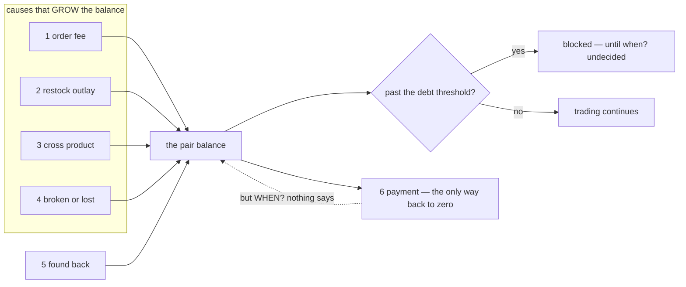
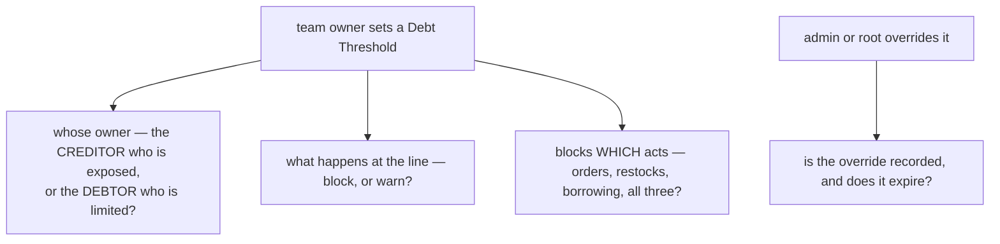
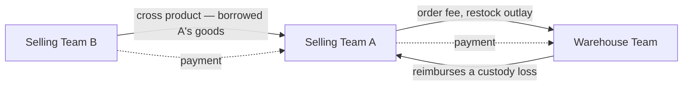
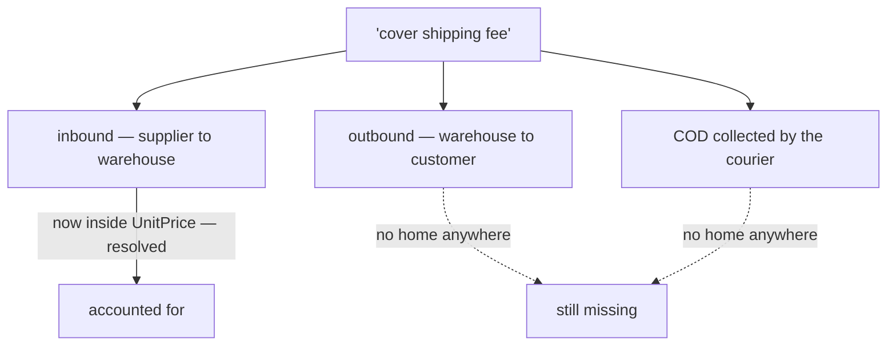

# Clarity — `balance_context.md`

The balance rules I read out of [balance_context.md](../../docs/requirements/balance_context.md), and
the **business** decisions still missing from them. **That doc is yours — this one is mine.** Answered
points are **deleted**, so this file is always the current open set.

> **Re-examined after `order_context.md` adopted double entry.** ✅ **Closed and deleted:** *which way does
> cause 3 move the balance* — that doc now says **payable** on the ordering team's books and **receivable**
> on the owner's, which names both parties in standard terms with no pronoun to misparse. The direction is
> the one this list already assumed, so nothing here changes except that it is now stated somewhere.
> **Narrowed:** the naming point, which is down from five words to two.

> **Scope split, so nothing is asked twice.** The *design* of this ledger — grain, tables, mirror
> invariant, idempotency, lock order, reversal mechanics — is argued in
> [`disscuss/architecture/team_balance_desgin_clarity.md`](../architecture/team_balance_desgin_clarity.md).
> **This file holds only what the BUSINESS must decide.**

> **Re-examined again.** The only change to `balance_context.md` this round was a spelling fix in
> §Balance Policy, so nothing below is closed by it. One word did get a definition elsewhere:
> *"team owner"* is now a real role
> *([user_context](user_context_clarity.md#warehouse-roles-are-owner-admin-packer))*, so
> [Critique 5](#critique) narrows to **whose** owner — the creditor's or the debtor's — and drops the
> "what is a team owner" half.

Siblings: [business_level](business_level_clarity.md) · [user_context](user_context_clarity.md) ·
[product_context](product_context_clarity.md) · [order_context](order_context_clarity.md) ·
[stock_context](stock_context_clarity.md).

---

## Proposed Design

### The rules, named

#### balance-is-between-two-teams
The balance is **team scope** and is held **between a pair** — the diagram shows Selling A owing
Warehouse C `Rp. -50.000` while Selling B owes Selling A `Rp. 30.000`. So a team has as many balances as
it has counterparties, not one number. *(§General 1–2 and the diagram)*

#### balance-is-two-mirrored-rows
Every balance exists **twice**, once from each side, and the two are mirrors. *(§General 2)*

#### balance-covers-receivable-and-payable
*"we need cover receivable & payable across the team"* — both directions are one ledger with a sign, not
two systems. *(§Why This Exists)*

#### selling-teams-owe-each-other-too
The diagram puts a balance between **Selling A and Selling B**, not only between selling and warehouse.
Cross/shared goods create a debt between two *selling* teams. *(§General diagram)*

#### debt-threshold-limits-liability
*"For prevent unfair liability, we must have feature Debt Thresholds"* — managed by the **team owner**,
**overridable by admin/root**. So the ledger is not only a record: a balance can reach a limit.
*(§Balance Policy)*

### The six causes, and which direction each pushes

| # | Cause *(§What Things That Affect The Team Balance)* | Who owes whom | What kind of money |
| --- | --- | --- | --- |
| 1 | Warehouse Order Fee | selling → warehouse | the warehouse **earns** it |
| 2 | Additional cost the warehouse spent to receive a restock | stock owner → warehouse | the warehouse **fronted** it |
| 3 | Cross / Shared Product — ⚠ **two names left**: this list's, and the order diagram's `Loan` — the order prose now says **payable** / **receivable** | borrowing team → owning team | the owner **earns** it — or **lends** it, [Critique 10](#critique) |
| 4 | Broken or lost goods in warehouse | **warehouse → owning team** | a **reimbursement** |
| 5 | Broken or lost goods **found back** | owning team → warehouse | a **reversal** of 4 |
| 6 | Create / Accepting Payment | debtor → creditor | it **discharges** the rest |

⚠ **Only cause 6 pushes toward zero** — and now that a threshold can block a team, the doc still does not
say when cause 6 has to happen.

⚠ **One order is not one entry.** [an-order-mixes-own-and-borrowed-lines](order_context_clarity.md#an-order-mixes-own-and-borrowed-lines)
means a single order posts cause **1** once to the fulfilling warehouse and cause **3** once **per owning
team it borrowed from** — so an order can move three or four pair-balances at once, some of which are
inside their [threshold](#debt-threshold-limits-liability) and some not. Whether that refuses the order or
only the line is asked in [order_context](order_context_clarity.md#question).

### The threshold, and the three things it does not yet say

**→ Recommend** the **creditor** sets the threshold, it **blocks** rather than warns, it blocks the acts
that *add* to the debt (new orders, new restock requests, new cross-borrowing) and never the acts that
*reduce* it, and an override is **recorded with an actor and a reason** and is **temporary**. A permanent
silent override is the same as not having the feature.

### The four teams as counterparties

---

## Critique

| | Problem | → Recommend |
| --- | --- | --- |
| **1** | **Nothing says when a balance must be SETTLED — and the new threshold makes that a trading outage, not just untidiness.** Causes 1–4 accrue daily, only cause 6 reduces, and a team that reaches its threshold now **stops** until somebody pays. With no cycle, nobody is obliged to pay on any particular day, so the block has no defined end. | State a **settlement cycle**: I would say **weekly, per pair, with a statement** — each side sees the period's entries, agrees the closing figure, and pays. A cycle also gives disputes a deadline, and gives the threshold a rhythm to work against instead of being an arbitrary wall. |
| **2** | **Cause 2 is still unbounded — "additional cost" is whatever the warehouse types — and it now reaches further than this ledger.** `product_context.md` §Unit Price Components puts *AdditionalWarehouseFee* **inside the goods' unit price**. So one number typed by the warehouse both raises what another team owes **and** permanently changes the value of their stock, which is what a later reimbursement pays out on. | A **closed list of chargeable cost kinds**, decided by you, with anything outside it not chargeable — and each line frozen at accept. Keep the warehouse's **own service fee** on cause 1: cause 1 is what the warehouse *earns*, cause 2 is what it *fronted*, and merging them makes both the warehouse's margin and the goods' cost unreadable. |
| **3** | **Cause 5 lets one team create a debt on another team's books with no acknowledgement.** Cause 6 got *"Create / Accepting"* — a handshake — because a payment is a claim. Cause 5 is the same shape: the warehouse says *"we found it"* weeks later and the owner owes money back on the warehouse's word alone. Cause 4 needs no handshake (the warehouse types a debt against itself), but 5 is its mirror — and it can now push a team **through** its threshold. | Give cause 5 the same two-phase shape as cause 6, or at minimum **notify the owner and let them dispute it**. |
| **4** | **Cause 4 is still written flat here, while the phase rule now lives in another doc.** [stock_context §Stock loss](stock_context_clarity.md#the-rules-named) says in-custody losses and count shortfalls are the warehouse's and receiving losses are the selling team's — so whether cause 4 posts at all depends on a phase this list does not mention. And *return* receiving is not clearly on either side of that line. | Cause 4 should **link** to `stock_context.md` §Stock loss rather than restate it — the two lists have already drifted once in this requirement set ([Contradiction](#contradiction)). And the return-receiving case needs an explicit word, because it is a whole phase currently answered by inference. |
| **5** | **[debt-threshold-limits-liability](#debt-threshold-limits-liability) names a real role and still says nothing about what the number does.** *"Team owner"* is now defined, so the open half is **whose** owner sets it — the creditor who is exposed, or the debtor who is limited. Does hitting it **block** or **warn**? Which acts stop? Does the admin/root override get recorded, and does it ever expire? That last one matters more since §Admin Team became *"manage all resource"* — an unrecorded, permanent override is the difference between a supervisor and a back door. | As in the diagram above: **creditor sets it · it blocks · it blocks only debt-increasing acts · the override is recorded and temporary.** And blocking must never block **cause 6** — a team that cannot pay because it owes too much is a deadlock. |
| **6** | **Operating costs are missing entirely, and `business_level.md` §covered 7 asks for them.** Electricity, ads and payroll are tracked somewhere. If any is ever recharged to a team, that is a seventh cause and it is not here. If none ever is, that is worth saying — two ledgers keyed by team that never touch is a much simpler world. | Say plainly: **does an operating cost ever move a team balance?** I would say **no for v1**. The same question is open downstream in [`cost_design_clarity.md`](../architecture/cost_design_clarity.md#question). |
| **7** | **Cause 3 does not say the charge equals the borrower's COGS** — `product_context.md` does, and only as a formula. Read alone, this doc allows a reader to think the cross charge is a fee *on top of* something the borrower already paid. | One line here: *"the cross charge IS the borrowing team's COGS — see [cross-line-cogs-adds-the-fee](product_context_clarity.md#cross-line-cogs-adds-the-fee)"*. Link, do not restate — a restated formula is the next thing to drift. |
| **8** | **No currency, no precision, no statement that this is exact.** The diagram is in rupiah and the doc never says the balance is whole rupiah. It matters because cause 3 comes from a **percentage** and cause 4 from a **cost per unit** that is itself the result of a **division** ([product_context Critique 8](product_context_clarity.md#critique)) — three chances to produce a fraction before it reaches here. | State: **whole rupiah, exact, no tolerance**, and the rounding happens *before* the entry, once. A balance two teams argue over — and that can now block one of them — cannot reconcile "within a rupiah or two". |
| **9** | **Nothing says what the balance is EVIDENCE of.** A team disputing a charge needs to see *which order*, *which restock*, *which loss*, *who recorded it*, and *the amount as frozen then*. That is the same promise as "transparency accounting" in [business_level](business_level_clarity.md) §covered 3, and the threshold makes it acute: a charge nobody can explain can now stop a team working. | State it as a business requirement here: **every movement names its cause, its source record, its actor, and its frozen amount, and none of them is editable afterwards.** |
| **10** | **One movement still has more than one name, though `order_context.md` has just cleaned up its half.** That doc now uses **payable** and **receivable** — the standard mirror pair, so those are two legs of one thing rather than two names for it. What remains is this list's `Cross/Shared Product` and the order diagram's `loan["Loan"]` label. The word still matters: a *product charge* is priced once and done, while a *loan* invites accrual and repayment — possibly **in goods**, A restocking B with equivalent units rather than paying. | **Adopt the accounting pair here too**: cause 3 raises a **receivable** for the owning team and a **payable** for the ordering team, and the diagram's `Loan` label should follow. Then one vocabulary spans the two docs. And say whether repayment **in kind** is allowed — I recommend no: a goods repayment is a restock plus a payment, not a second instrument. |

---

## Question

1. **When must a balance be settled** — weekly, monthly, on demand? ([Critique 1](#critique))
   **→ I recommend a weekly per-pair statement.**
2. **Who sets the Debt Threshold, what does hitting it stop, and is the override recorded?**
   ([Critique 5](#critique)) **→ I recommend creditor-set, blocking only debt-increasing acts, override
   recorded and temporary, and never blocking a payment.**
3. **Which receiving costs may a warehouse charge onward?** — cause 1 and cause 2 are now visibly
   different animals in your own picture (`o-->wf` hangs off the ORDER, not off a restock).
   ([Critique 2](#critique))
   **→ I recommend a closed list, with the warehouse's own service fee kept on cause 1.**
4. **Does an operating cost ever move a team balance?** ([Critique 6](#critique))
   **→ I recommend no for v1.**
5. **Does the found-back charge need the owner's acknowledgement?** ([Critique 3](#critique))
   **→ I recommend yes — it is a debt asserted on someone else's books, and it can now block them.**
6. **Should cause 3 adopt the order doc's payable/receivable pair — and is repayment IN GOODS allowed?** ([Critique 10](#critique))
   **→ I recommend yes to the vocabulary, no to repayment in kind — a goods repayment is a restock plus a
   payment, not a second instrument.**

---

# Contradiction

## the causes list exists in two requirement docs and they no longer agree

Recorded in full, with the diagram, under
[business_level_clarity → the balance-causes list is written twice](business_level_clarity.md#the-balance-causes-list-is-written-twice-and-the-two-copies-differ).
Repeated here only as a pointer, because the fix belongs to `business_level.md`.

**The half that lands on this doc — and it narrowed this round.** *Shipping fee* is named as a balance
use in `business_level.md` §covered 6 and is **not** one of the six causes here:

> `business_level.md` §covered 6: *"the balance is used in: … **cover shipping fee** …"*
> `balance_context.md`: six causes, **none of which is shipping**

`product_context.md` §Unit Price Components has now placed the **inbound** freight — *ShipmentFee* —
**inside the unit price**, where it is capitalised into the goods rather than being a balance movement in
its own right. That removes one of the three readings. What is left is the **outbound** fee to send a
parcel to the customer, and the **COD** amount a courier collects — neither of which appears anywhere in
the requirement set.

**→ Recommend** name the outbound shipping money explicitly: is it a cost the selling team simply bears,
or does the warehouse front it at handover and get reimbursed? If the latter, it is a **seventh cause**
and it belongs in this list.

---

# Awaiting

- **The doc says what moves the balance and what caps it, never what a balance IS to a person.** Nobody's
  *job* appears in it: who reads it, on what day, to decide what. The settlement cycle in
  [Critique 1](#critique) is that missing job.
- **No rule for a team that is closed or suspended while it still owes** — the one case where a balance
  must reach zero by something other than cause 6.
