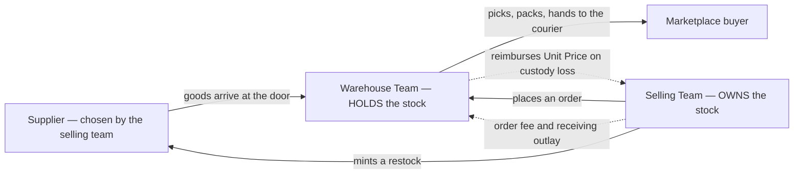
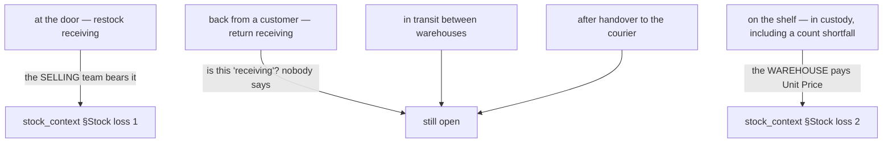
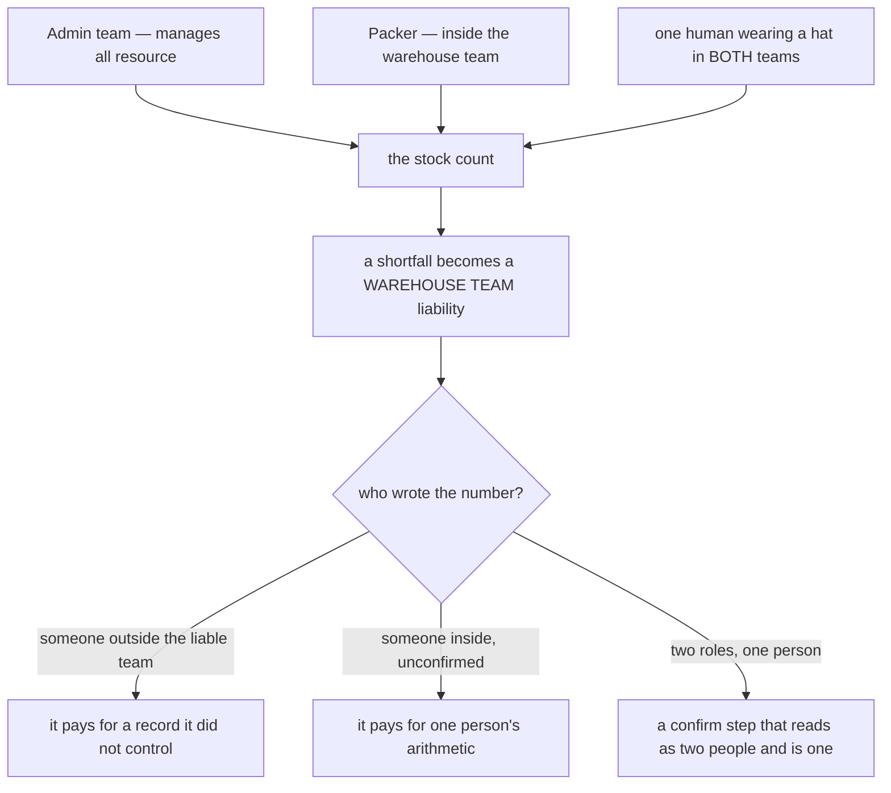
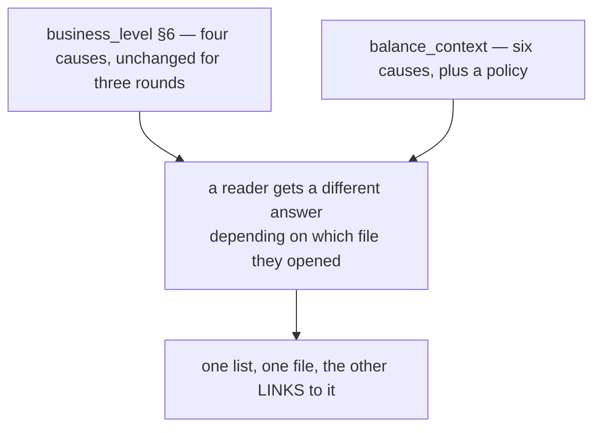
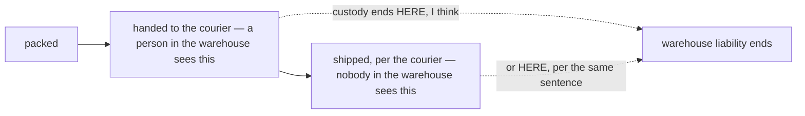

# Clarity — `business_level.md`

The rules I read out of [business_level.md](../../docs/requirements/business_level.md), and what it
does not yet say. **That doc is yours — this one is mine.** Answered points are **deleted**, so this
file is always the current open set, never a log.

> **Re-examined after your update.** Closed and deleted from here: **is Customer Service a fifth team**
> — [user_context.md](../../docs/requirements/user_context.md) makes it a **role inside the selling
> team**, and adds no fifth team. **Narrowed:** §Admin Team now reads *"Monitoring **and manage all
> resource** warehouse and selling team"*, so Admin plainly **acts** — what it may act *on* is the part
> still open, and it has created a new contradiction with the liability rules
> ([below](#a-team-is-liable-for-records-it-does-not-solely-control)).
>
> **Re-examined again after `user_context.md` §General.** *Can one person serve several teams* is
> **answered — yes**, with a worked example, and is deleted from [Critique 5](#critique); what is left
> there is the **team**-side half. The same edit gives the contradiction below its **second site**.
>
> **Re-examined after §Warehouse 5's `(COGS price)` → `(Unit Price)`.** ✅ **Closed and deleted:** *whose* number
> the warehouse reimburses on a cross-team unit. `UnitPrice` is the landed cost and the doc set's own formula
> makes it the fee-free half of `COGS = UnitPrice + fee`, so the markup-inclusive reading is no longer
> available — and *"to the team that own the goods"* names the payee. **The rule is renamed with it:**
> `warehouse-reimburses-cogs` → **[warehouse-reimburses-unit-price](#warehouse-reimburses-unit-price)**, all
> eight reference sites updated (HARD RULE 12 — a name carries its verdict, and the verdict's noun changed).
> **Narrowed, not closed:** which *layer's* unit price — [Critique 3](#critique).
>
> ⚠ **The two standing contradictions were NOT touched.** This doc was edited this round and §covered 6
> and §Warehouse 2 both came through unchanged — so both are one round older, not closer.

Siblings: [user_context](user_context_clarity.md) · [product_context](product_context_clarity.md) ·
[balance_context](balance_context_clarity.md) · [order_context](order_context_clarity.md) ·
[stock_context](stock_context_clarity.md) ·
[systems/systems_product_context](systems/systems_product_context_clarity.md).

---

## Proposed Design

### The four actors, and who inside them

| Team | Roles *(user_context)* | Does | Owns | Owes / is owed |
| --- | --- | --- | --- | --- |
| **Root** | Root | highest access to everything | nothing operational | — |
| **Admin** | Owner, Admin | monitors **and manages all resource** of warehouse and selling teams · overrides a debt threshold | nothing operational | — |
| **Warehouse** | Owner, Admin, **Packer** | holds goods, places them, processes orders, handles returns/broken/lost, opname | **no goods** | owes Unit Price on custody loss · is owed order fee + receiving outlay |
| **Selling** | Owner, Admin, **Customer Service** | orders, shops, products, restock decisions, suppliers · bears the loss at receiving | **the stock** | owes order fee, outlay, cross charge |

⚠ **Naming the roles did not assign the acts.** No role accepts a restock, declares a loss, runs an
opname, or hands a parcel to a courier — see [user_context_clarity](user_context_clarity.md#critique).

### The rules, named

#### stock-owned-by-selling-team
**Selling team** owns every unit of stock · the **warehouse team** holds it physically and decides its
placement · ownership never transfers to the warehouse. *(§Stock Ownership 1, §Warehouse Team 4)*

#### stock-splits-across-warehouses
One selling team's stock for one product may sit in **several warehouses at once** — the diagram splits
100 into 70 + 30. So "how much do I have" is a **per-warehouse** question before it is a total.
*(§Stock Ownership diagram)*

#### warehouse-reimburses-unit-price
**Warehouse team** · goods broken or lost **in the warehouse** · owes the owning selling team the
**Unit Price** of those goods — the landed cost, which by the doc set's own vocabulary excludes the cross
markup (`COGS = UnitPrice + fee`, so `UnitPrice` is the fee-free half). *(§Warehouse Team 5)* — extended from
the stock side to an unexplained count shortfall:
[in-custody-shortfall-is-the-warehouses](stock_context_clarity.md#in-custody-shortfall-is-the-warehouses).

⚠ **The "fee-free" half of that reading no longer holds for every unit.** `product_context.md`'s restored
[return-price-is-the-orders-cogs](product_context_clarity.md#return-price-is-the-orders-cogs) puts a
**returned cross-sold unit** back into stock at `UnitPrice + fee`, so *that batch's* Unit Price contains a
markup. Reimbursing "Unit Price" then pays the markup out — to whoever owns that shelf, which is itself
undecided ([product_context Question 1](product_context_clarity.md#question)). Two identical units can sit
side by side at different Unit Prices, and this rule pays different amounts for them.

#### receiving-losses-are-not-the-warehouses
**Warehouse team** · goods broken or lost **at restock receiving** or **at return-goods receiving** ·
owes nothing. *(§Warehouse Team 6)* — the other half exists in the stock doc:
[selling-team-bears-the-receiving-loss](stock_context_clarity.md#selling-team-bears-the-receiving-loss).

#### warehouse-runs-the-order-to-handover
**Warehouse team** · a selling team's order exists · processes it "until order is taken by shipment
channel. until its shipped". *(§Warehouse Team 2)* — ⚠ two end-points in one sentence, see
[Contradiction](#one-sentence-two-endpoints-for-warehouse-responsibility).

#### admin-team-manages-all-resource
**Admin team** · monitors **and manages** all resource of warehouse and selling teams · and can override
a debt threshold *(balance_context §Balance Policy)*. So it is a supervisor with hands, not an observer.
*(§Admin Team 1)*

#### selling-team-mints-restock
**Selling team** decides and **mints** a restock transaction · the **warehouse accepts it later** ·
so a restock is a two-party act with a gap in the middle. *(§Selling Team 4)*

#### selling-team-owns-the-supplier
**Selling team** picks and manages its own suppliers · there is **no shared supplier master** and no
central sourcing decision. *(§Selling Team 5, §Supplier 1)* — and it carries the receiving loss for that
choice, which makes the two rules one coherent position.

#### cross-team-order-lines
One selling team's **order** may contain a **product owned by another selling team**.
*(§Cross / Shared goods diagram)* — the owner's controls over it are written in
[reserved-stock-is-never-shared](product_context_clarity.md#reserved-stock-is-never-shared) and
[shared-lock-stops-sharing-entirely](product_context_clarity.md#shared-lock-stops-sharing-entirely).

#### many-teams-per-type
There can be **multiple teams of each type** — several warehouses, several selling teams.
*(§Business Entity, "we can have multiple team on that")*

### What physically happens, and where the money crosses

### The custody boundary — three phases still have no bearer

**→ Recommend** §Warehouse 6 **link** to `stock_context.md` §Stock loss rather than stating only the
negative half — the doc that defines the four teams' responsibilities says who does *not* pay, and who
*does* is in a file it lists only as further reading.

### Capability → who does it → what is missing

| §"Whats Should be covered" | The actor | Missing before it can be built |
| --- | --- | --- |
| 1 · order management for marketplace | selling team's **Customer Service** | ✅ actor and entry path both answered — the order's *lifecycle* is not |
| 2 · stock management | warehouse team's **Packer**, presumably | ⚠ the role is named for packing only — [user_context_clarity](user_context_clarity.md#critique) |
| 3 · transparency accounting | ? | **the term is undefined** — [Critique 1](#critique) |
| 4 · flexible statistics | admin team | "flexible" and the question list are undefined |
| 5 · sharing stock between selling teams | both selling teams | ✅ consent answered — **no role** is named for setting the reserve or the lock |
| 6 · team balance | all teams | the causes list still disagrees with `balance_context.md` — [Contradiction](#the-balance-causes-list-is-written-twice-and-the-two-copies-differ) |
| 7 · cost tracking — electricity, ads, payroll | ? | whose cost, and does it ever move a team balance? |

---

## Critique

| | Problem | → Recommend |
| --- | --- | --- |
| **1** | **"provide transparency accounting" (§covered 3) is the project's third stated purpose and has no definition, no audience and no test.** Transparent *to whom* — the selling team reading what the warehouse charged it, or the owner reading the whole business? It cannot be satisfied ambiguously: it is the thing the warehouse and the selling team will argue about, the debt threshold gives that argument teeth, and [admin-team-manages-all-resource](#admin-team-manages-all-resource) now adds a third party who can change the numbers being argued over. | State it as a **provable claim**: "any team can see, for any charge against it, the event that caused it, the amount frozen at that moment, and **who** recorded it — including when that person was not on their team." Testable, and it drives the `actor` field every ledger then needs. |
| **2** | **"Responsibility" is still used for two different things and the money hangs on the difference.** §Warehouse 3 says the warehouse *handles* returns, broken and lost. §Warehouse 6 says it has no *responsibility* for broken/lost at receiving. The first means "does the work", the second means "bears the cost". `stock_context.md` has adopted the sharper word — *"its shortfall a warehouse **liability**"* — and this doc still has not. | Use both words here: **handles** (does the physical work) vs **liable for** (pays). §3 is *handles*, §5 and §6 are *liable*. |
| **3** | **[warehouse-reimburses-unit-price](#warehouse-reimburses-unit-price) now names a price and still not WHICH ONE.** A team's stock is FIFO layers at different unit prices — that is the whole point of [batch-fifo-pricing](product_context_clarity.md#batch-fifo-pricing) — so "Unit Price" singular has no referent until the broken unit is tied to a **batch**. The cheap layer and the dear layer can differ by a lot, and the warehouse is paying the difference. Worse, a unit found short at opname is by definition **untraceable to a layer**, so the rule has no number at all in the case that produces the most losses. | Say which layer: **the batch the unit actually came from**, when it is known — the warehouse pays for what it broke. When it is **not** known (an opname shortfall), name a fallback rather than leaving it undefined: I would draw the shortfall **FIFO from the oldest layers**, the same order a sale would have consumed them, so the stock that remains is the stock the books say remains. |
| **4** | **§Admin now says "manage all resource" and that is a very large sentence.** It answers whether Admin acts — it does — but not *what*. Managing a team's users is one thing; adjusting a stock count, editing a cross markup, or posting a balance entry are each a different order of power, and the third would make Admin a second set of books. | Enumerate it in §Admin: I would allow **manage users and roles · override a control · unblock · read everything**, and forbid **posting money** and **changing a count** — the two acts that would let a non-owner rewrite what another team owes. And every admin act is **recorded with actor and reason**, which is [Critique 1](#critique) again. |
| **5** | **Whether a TEAM can be two types is still unanswered — and the person half being settled makes it sharper, not softer.** `user_context.md` §General now allows one human to hold roles in several teams, so a person standing on both sides of a money rule is a described case rather than a worry. If a **team** could also be both a warehouse and a selling team, [warehouse-reimburses-unit-price](#warehouse-reimburses-unit-price) would have it reimbursing itself, and a debt threshold would apply against itself. | State: **a team has exactly ONE type.** The four responsibilities are genuinely different jobs, and one team holding two of them turns three money rules into no-ops. The small-operation case that would otherwise tempt a dual-type team is already covered by the person-level flexibility — see [user_context_clarity Question 2](user_context_clarity.md#question). |
| **6** | **"until its shipped" ends the warehouse's job and nothing covers the parcel after it.** A courier loses a shipped parcel — not broken in the warehouse, not at receiving, not a return. `stock_context.md` §Stock loss covers only the two phases inside the building, and no role hands the parcel over. | Add a third loss phase — **in transit to the customer** — and name who bears it. I would put it on the **selling team** (it owns the sale and the courier relationship), with the courier claim as the recovery. |

---

## Question

1. **What exactly may the Admin team manage — users and controls, or also counts and money?**
   ([Critique 4](#critique)) **→ I recommend users, roles, overrides and reads — never a posting or a count.**
2. **WHICH batch's Unit Price does the warehouse reimburse** — the broken unit's own layer, or a
   fallback when an opname shortfall cannot be traced to one? ([Critique 3](#critique))
   **→ I recommend the unit's own batch when known, and FIFO from the oldest layers when it is not.**
3. **Can a TEAM be two types?** — the person half is now answered (`user_context.md` §General: yes).
   ([Critique 5](#critique)) **→ I recommend exactly one type per team.**
4. **Who bears a parcel lost after handover to the courier?** ([Critique 6](#critique))
   **→ I recommend the selling team.**
5. **What does "transparency accounting" have to prove, and to whom?** ([Critique 1](#critique))

---

# Contradiction

## a team is liable for records it does not solely control

**New this round**, and caused by one edit meeting two older rules.

> §Warehouse Team 5: *"every broken and lost in warehouse, warehouse have responsbility **reimburse the
> cost (Unit Price)**"* — the liability sits on the **warehouse team**.
>
> §Admin Team 1 *(edited this round)*: *"Monitoring **and manage all resource** warehouse and selling
> team."* — so a **different** team may manage the warehouse's resources.
>
> [`user_context.md`](../../docs/requirements/user_context.md) §1: the warehouse's own people are
> **Owner, Admin, Packer** — three roles, none of which the doc says may or may not record a loss.

If "all resource" includes stock counts, then a person outside the warehouse team can create or erase a
warehouse liability, and the warehouse pays for a number it did not write. If it does not include stock
counts, the sentence is narrower than it reads — and nothing says so. **I think §Admin Team 1 is the line
that is wrong**, or at least too broad to leave standing: monitoring and managing *users, teams and
controls* is a supervisor, managing *records that decide who owes whom* is a participant.

**Second site of the same cause, added by `user_context.md` §General.** The outsider who can move a
liable team's numbers need not be another *team* at all:

> §General: *"User can be have different role across teams"* — and the diagram shows one person holding
> two roles in two teams at once.

So one human may be Customer Service in a selling team **and** a Packer in the warehouse that holds its
goods — taking the order, picking it, and recording the shortfall. Every rule in the set assigns the cost
to a **team**, and a team is not a person: naming *which role* may write the number does not help when one
human holds both roles. **The cause is the same in both sites** — a rule says who **pays** without saying
who may **write**.

**→ Recommend** bound the sentence — *manage all resource **except** the records that determine a team's
liability* — and pair it with a **person-level** recorder/confirmer split
([user_context_clarity Critique 2](user_context_clarity.md#critique)), not a role-level one. What stops
this recurring: **any rule that says a team pays must also say which human may write the number it pays
on.**

## the balance-causes list is written twice and the two copies differ

> `business_level.md` §covered 6: *"the balance is used in: sharing stock · cost of stock broken or lost ·
> cover shipping fee · cover warehouse order processing fee"* — **four**
>
> [`balance_context.md`](../../docs/requirements/balance_context.md) §What Things That Affect The Team
> Balance: warehouse order fee · restock receiving cost · cross/shared product · broken or lost ·
> **found back** · **payment** — **six**

⚠ **Still open, and this doc was edited without touching it.** §Other Context and §Admin both moved this
round while §covered 6 stayed as it was. **I think `business_level.md` is the wrong copy** — it is the
summary, and the detail doc is where the causes are thought through. But *shipping fee* exists **only**
in the summary, so deleting the list would delete a rule with no other home — see
[balance_context Contradiction](balance_context_clarity.md#contradiction).

**→ Recommend** §covered 6 keep the **why** and **link** to `balance_context.md` instead of re-listing the
causes — after *shipping fee* is given a home there.

## one sentence, two endpoints for warehouse responsibility

> §Warehouse Team 2: *"processing order that created by selling team **until order is taken by shipment
> channel**. **until its shipped**."*

⚠ **Also untouched this round.** "Taken by the shipment channel" is the courier collecting the parcel;
"shipped" is a status the courier reports afterwards, which the warehouse neither controls nor observes.
The first makes a parcel scanned and then lost not the warehouse's problem; the second makes it
accountable for something it cannot see.

**I think the first is right** — custody ends when the goods leave the building, a moment a person in the
warehouse actually witnesses. `stock_context.md` §Stock loss draws the same boundary for goods
(*"already in Warehouse"*), which supports it — but stops at the door.

**→ Recommend** keep **one** endpoint — *handover to the courier* — and treat any later "shipped" or
"delivered" fact as information about the **order**, not about the warehouse's responsibility.

---

# Awaiting

- **§Root** — one line, and now the only team whose powers are not described at all.
- **No lifecycle anywhere.** Nothing says what states an order, a restock, a return or a team passes
  through, or who moves them.
- **No volumes.** How many warehouses, racks, SKUs, orders a day, people at once — and now, how many
  Packers work one shelf at a time.
