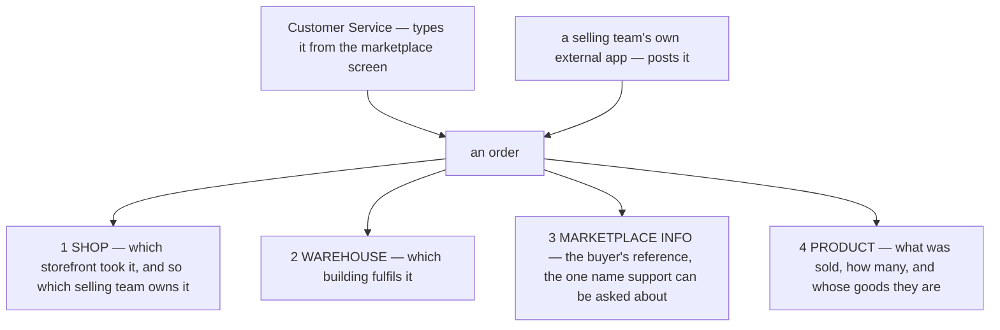
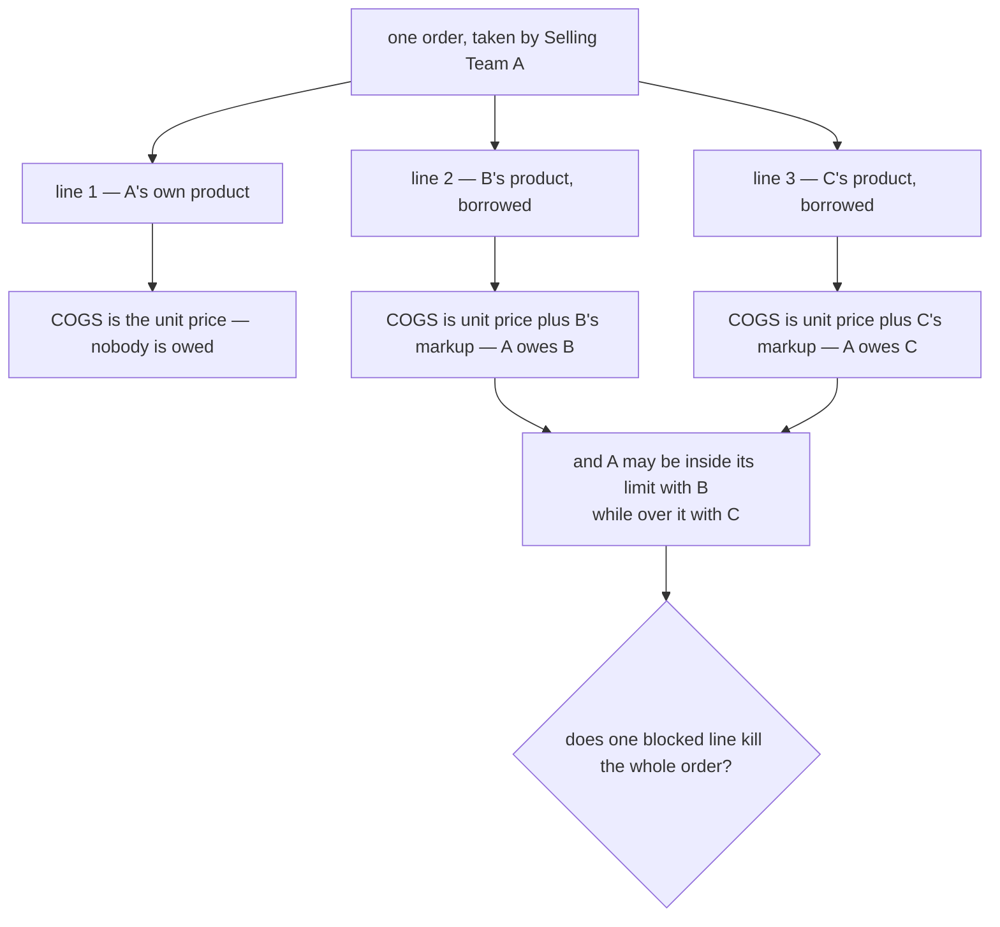
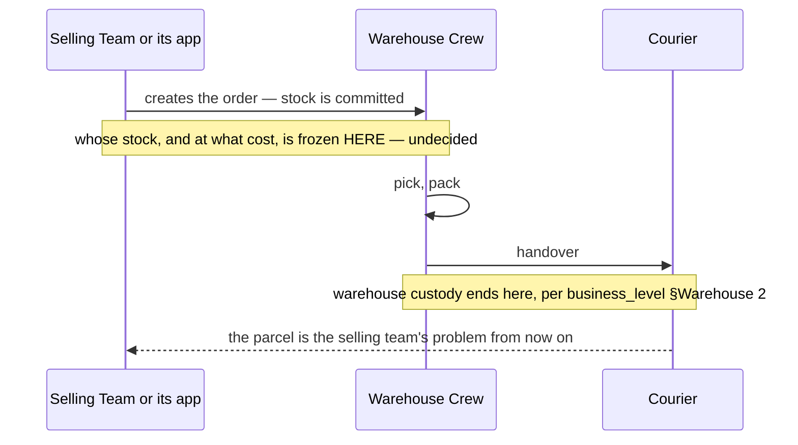

# Clarity — `order_context.md`

What [order_context.md](../../docs/requirements/order_context.md) says, and the much larger part it does
not. **That doc is yours — this one is mine.** Answered points are **deleted**, so this file is always
the current open set.

> **Re-examined after your update.** Closed and deleted from here: **how an order enters the system**
> (§How Order Enter Our System — two paths, a person and an API), and **who Customer Service is** —
> [user_context.md](../../docs/requirements/user_context.md) makes CS a **role inside the selling team**,
> not a fifth actor. What the two paths still open is a **duplicate** problem and a second door that has
> to obey the same rules as the first.
>
> **Re-examined after §What Make Our Order Unique became double entry.** ✅ **Closed and deleted — three
> items, all by one edit.** *Does a borrowed line's liability become a COST of that sale* (bullet 2 now says
> **the debit is COGS**, so both the double-count and the understatement are excluded by the text) ·
> *whose debt increases* (**payable** on the ordering team's books, **receivable** on the owner's — the
> parties are named, not described) · and **both contradictions** this file carried. The rule is renamed to
> match what the doc now says: `own-line-is-cogs-cross-line-is-liability` →
> **[every-line-debits-cogs-the-credit-differs](#every-line-debits-cogs-the-credit-differs)**.
>
> ⚠ **One residue kept:** the bullets name the legs and never the **amount** — see [Question 7](#question).
>
> ⚠ **§What Make Our Order Unique answers a different question from the one I asked, and the words
> collide.** Your new section says what is **distinctive** about these orders — they mix borrowed and own
> lines. My [Question 1](#question) asks what makes an order **identifiable**, so a retrying API can be
> refused. Both are "unique". **The dedup question is still open** and is reworded below to say
> *identity* — the ambiguity is worth removing before somebody reads §What Make Our Order Unique as
> having settled it.
>
> ✅ **Your block-beta parses**, and the completed picture is the mixed order in one image — two different owners' products resolving onto stock held by one warehouse.
>
> **Three sections of prose, and the order run is the warehouse's whole day.** That is still the finding:
> everything the crew physically does — pick, pack, hand over, take back — hangs off an order, and none
> of it has a rule yet.

Siblings: [business_level](business_level_clarity.md) · [user_context](user_context_clarity.md) ·
[product_context](product_context_clarity.md) · [balance_context](balance_context_clarity.md) ·
[stock_context](stock_context_clarity.md).

---

## Proposed Design

### The rules, named

#### an-order-carries-four-facts
When an order is created it brings **shop**, **warehouse**, **marketplace order info**, and **product**.
*(§Order Anatomy)*

#### an-order-is-typed-or-posted
Two entry paths, both first-class: **Customer Service records it manually** — a role inside the selling
team *([user_context](user_context_clarity.md#selling-roles-are-owner-admin-customer-service))* — and a
**create-order API** exists so a selling team's own external app can post orders faster.
*(§How Order Enter Our System)*

#### an-order-mixes-own-and-borrowed-lines
*"our Order can contain partials shared products and own products"* — one order carries **both** kinds of
line at once. So every rule about cross/shared goods is a rule about a **line**, never about an order.
*(§What Make Our Order Unique 1 and its diagram)*

Your diagram now states far more than the sentence does. **Product 2 (Team A) and Product 1 (Team B)
resolve onto stock held by ONE warehouse**, the order draws from both — and the order then emits **three
obligations, each landing in a different team's block**:

| drawn as | lands in | what it is |
| --- | --- | --- |
| `o-->cogs` | **Selling Team A** — the ordering team | what these goods cost the team that sold them |
| `o-->wf` | **Warehouse Team** | the per-order handling fee — [balance cause 1](balance_context_clarity.md#the-six-causes-and-which-direction-each-pushes) |
| `o-->loan` | **Selling Team B** — the lending team | ⚠ a **Loan**, not a purchase and not a fee |

⚠ **`Loan` is a new word in the requirement set, and it is the first affirmative statement of what a
cross-team line IS.** It is drawn, not written — but it is the owner's own picture, and it says the goods
stayed B's and A owes for them. See [product_context Contradiction](product_context_clarity.md#the-return-path-prices-the-unit-as-the-borrowers-while-the-order-path-leaves-it-the-owners).

#### every-line-debits-cogs-the-credit-differs
*"when product in order is own team, **the debit is COGS and credit was from assets**"* · *"when product in
order is cross team, **the debit is COGS and the credit is payable to cross team**"* · *"in team that have
product side, its also increase **receivable from team that have order**."*
*(§What Make Our Order Unique 1, bullets)*

**Both line kinds produce a cost. What differs is only what the cost is credited against** — and the doc now
says so on both, in both legs:

| the line | debit | credit | the mirror, on the owner's side |
| --- | --- | --- | --- |
| **own** — A's own goods | COGS | **assets** (the inventory that left) | — |
| **cross** — B's goods | COGS | **payable to the cross team** | **receivable from the ordering team** |

Three consequences worth stating once, because everything downstream leans on them:

- **`margin = revenue − COGS − warehouse fee`, on both line kinds.** The payable is the *credit side of the
  COGS*, never a fourth thing to subtract — the order diagram's `o-->cogs` and `o-->loan` are **two legs of
  one entry**, not two charges.
- **The direction is now explicit and it is the borrower's debt that rises** — *payable* on the ordering
  team's books, *receivable* on the owner's. That is the two-mirrored-row model
  [`balance_context.md` §General 2](../../docs/requirements/balance_context.md) already requires.
- **A cross line has a real cost of goods.** It is not a balance-sheet item parked off the P&L, so a
  borrowed line's margin is not its whole sale price.

### One order, several owners — what the mixed line-up forces

**→ Recommend** state the order's **atomicity** once: an order either goes through whole or not at all.
I would make it **all-or-nothing at creation** — a partly-accepted order is a parcel the buyer did not
order — with the refusal naming *which line* and *why*, so Customer Service can drop that line and retake
it rather than guess.

⚠ **Two doors, one set of rules.** Whatever the manual path checks — the stock reserve, the shared lock,
the debt threshold — the API must check identically, or the API becomes the way around them
([Critique 2](#critique)).

### What each of the four has to carry before a screen can exist

| # | The doc says | What is actually needed, and who can say |
| --- | --- | --- |
| 1 | Shop Related | which selling team owns the sale · is a shop always exactly one team's? |
| 2 | Warehouse Related | **one** warehouse per order, or may lines ship from two? ([Critique 5](#critique)) |
| 3 | Marketplace Order Info | the marketplace's own order id · and whether it is **unique**, which is now the only defence against a double post ([Critique 1](#critique)) |
| 4 | Product Related | quantity, the **frozen** cost per line, and the **owning team** per line — now required rather than merely advisable, since §What Make Our Order Unique lets ownership vary *within* one order |

### The three actors an order passes between

⚠ **Every note above is a proposal, not a reading of the doc** — none of these moments is written down.

---

## Critique

| | Problem | → Recommend |
| --- | --- | --- |
| **1** | **Two entry paths means the same order can be recorded twice, and nothing says what IDENTIFIES an order.** ⚠ §What Make Our Order Unique is about what is *distinctive* about these orders, not about what makes one *tellable from another* — so this is still open, under a heading that now sounds like it answers it. A CS agent types it while the team's app posts it — or the app retries a request whose response was lost. Both produce two orders, two stock commitments, two warehouse fees, and one confused customer. A machine path makes retries routine rather than rare. | Make the **marketplace order id** the thing that identifies an order within a shop, and **refuse a second one** with the same pair. Then a retry is harmless and a double entry is impossible by construction. It also needs an answer for orders with **no** marketplace id (a phone order): I would let those through, since only the machine path retries. |
| **2** | **The API is a second door and the doc does not say it obeys the same rules.** [an-order-is-typed-or-posted](#an-order-is-typed-or-posted) exists to *"speed up record the orders"* — and speed is exactly what makes people route around checks. If the manual path enforces the [reserve](product_context_clarity.md#reserved-stock-is-never-shared), the [shared lock](product_context_clarity.md#shared-lock-stops-sharing-entirely) and the [debt threshold](balance_context_clarity.md#debt-threshold-limits-liability) and the API does not, every one of those controls is optional. | State it once: **every rule is enforced on the order, not on the screen.** And say whether the API may create an order for a **different team** than the one whose credentials posted it — I would say no, ever. |
| **3** | **There is no lifecycle.** An order is created and then nothing. No states, no transitions, no actor moving it. The crew cannot see what to work on next, and the business cannot say when a sale is a sale. | State the **states a person starts and finishes**, so an order being worked on right now looks different from one nobody has touched. My proposal: **placed → picking → packed → handed over → cancelled**, with any later "delivered" fact treated as information *about* the order and not as a state the warehouse owns (see [business_level Contradiction](business_level_clarity.md#one-sentence-two-endpoints-for-warehouse-responsibility)). |
| **4** | **Nothing says when stock is COMMITTED.** At creation, or when a picker starts? This is the most consequential unanswered question in the requirement set: it decides whether two selling teams can sell the same last unit — and with [reserved-stock-is-never-shared](product_context_clarity.md#reserved-stock-is-never-shared) now in the doc, it also decides **when the reserve is checked**. A reserve tested at creation and a reserve tested at picking protect different things. | Commit **at creation**, and test the reserve there. It is the only choice that makes "available" mean something to the person taking the order, and its cost — stock held by an order nobody picks — is fixed by cancellation, which you need anyway. |
| **5** | **One order, one warehouse — is that a rule or an accident?** [an-order-carries-four-facts](#an-order-carries-four-facts) names a *warehouse* singular, but [stock-splits-across-warehouses](business_level_clarity.md#stock-splits-across-warehouses) says a team's goods sit in several. So an order for two products may have no single warehouse holding both. | Make it a stated rule: **one order ships from one warehouse**, and an order that cannot be filled from one is split by whoever takes it. Splitting later, inside the system, means a parcel, a courier fee and a marketplace order id that no longer map one-to-one. |
| **6** | **Cancellation is not mentioned at all** — and it is the most common thing that happens to an order after creation. Before picking, after picking, after packing and after handover are four different physical situations: goods on a shelf, in a tote, in a box, on a van. | Say **who may cancel and until when**. My proposal: freely until packed · after packed it is a **return-to-stock** task for the crew, not a cancellation · after handover it is a return. And every money movement the order caused reverses with it — the order fee, the cross charge — which matters more now that those movements can push a team through its [debt threshold](balance_context_clarity.md#debt-threshold-limits-liability). |
| **7** | **A partially fillable order has no answer — and [an-order-mixes-own-and-borrowed-lines](#an-order-mixes-own-and-borrowed-lines) makes it two questions, not one.** The picker reaches the shelf and there are 4 of the 5 ordered. Ship 4, hold, or split? A shortfall on an **own** line costs the team its own sale. A shortfall on a **borrowed** line also means the cross charge already computed against another team is now wrong — money that has to shrink, on somebody else's books. | Decide it once, in the doc. **I would ship what is there and record the shortfall on the order** — the buyer is waiting and a held order helps nobody. And state the money half explicitly: **a short-picked borrowed line reduces the charge to that owner to what actually shipped**, which needs the charge to be revisable up to handover, or posted at handover rather than at creation. |
| **8** | **The mixed order is now stated, and §Order Anatomy still does not carry it.** *"Product Related"* is one of the four things an order brings, and it says nothing about **whose goods** each line is — yet §What Make Our Order Unique makes ownership vary *within* one order. Nothing says the owner is **frozen** either, and a product's owner is exactly the sort of thing corrected six months after a sale. | Add it to §Order Anatomy item 4: **every line carries its owning team and its cost, frozen at creation**, never looked up later. A debt must not move when a catalogue is tidied. |
| **11** | **A blocked line has no defined effect on the order — and there are now three ways to block one.** A [shared lock](product_context_clarity.md#shared-lock-stops-sharing-entirely) is on · the line would break the owner's [reserve](product_context_clarity.md#reserved-stock-is-never-shared) · the buyer's team is past its [debt threshold](balance_context_clarity.md#debt-threshold-limits-liability) **with that one owner**. Since one order can borrow from several owners, an order can be simultaneously allowed against B and refused against C. Nothing says whether that kills the order or only the line. | **All-or-nothing at creation**, with the refusal naming the line and the reason. A partly-accepted order is a parcel the buyer did not order, and silently dropping a line is worse than refusing the whole thing — the person taking the order can drop it themselves and retake it. |
| **9** | **Returns are named as a warehouse responsibility and have no doc** — yet `product_context.md` now prices a returned unit back into stock, so a return is already a *pricing* event with no *process* behind it. Nothing says who declares a return, what states it has, whether the unit rejoins sellable stock, or what happens to the money. | A **return context doc**, or a section here. It cannot live as an exception clause in a liability rule plus a formula in the pricing doc — between them they imply a whole process nobody has written down. |
| **10** | **Nothing says what the business must be able to PROVE about an order.** Which buyer, which shop, what was picked, by whom, what it cost, what was charged, which parcel left the building — and now also **which door the order came in by**. Without that, "transparency accounting" ([business_level](business_level_clarity.md) §covered 3) has no evidence for the most common transaction in the business. | List the facts an order carries **forever**, and mark which are frozen at creation versus recorded as it moves. Frozen: shop, warehouse, lines, their owners, their cost, **its source (typed or API, and by whom)**. Recorded: who picked, who packed, when it was handed over. |

---

## Question

1. **What IDENTIFIES an order, so a retried API call is refused rather than duplicated** — is it the
   marketplace order id within a shop? *(Not the same question as §What Make Our Order Unique, which
   answers what is distinctive about them.)* ([Critique 1](#critique))
   **→ I recommend the marketplace order id within a shop, and refuse a duplicate.**
2. **Does the API enforce the same reserve, lock and threshold checks as the manual path — and may it
   create orders for another team?** ([Critique 2](#critique)) **→ I recommend same rules, never another team.**
3. **What states does an order pass through, and who moves it?** ([Critique 3](#critique))
   **→ I recommend placed → picking → packed → handed over → cancelled.**
4. **When is stock committed, and when is the reserve tested?** ([Critique 4](#critique))
   **→ I recommend both at creation.**
5. **Does one blocked or unavailable LINE refuse the whole order?** — a lock, a reserve, or a debt
   threshold reached with one of several owners. ([Critique 11](#critique))
   **→ I recommend all-or-nothing at creation, with the refusal naming the line.**
6. **What happens on a partial pick — and does a short-picked BORROWED line reduce what that owner is
   owed?** ([Critique 7](#critique)) **→ I recommend ship what is there, record the shortfall, and charge
   the owner for what actually shipped.**
7. **Is the cross line's COGS — and so the payable — `UnitPrice + fee`?** The bullets name the legs and not
   the amount; `product_context.md` §Pricing Behavior 2 supplies it and this doc does not repeat or link it.
   ([Contradiction — the residue](#contradiction))
   **→ I recommend saying it here in four words, or linking: the two docs already agree.**

---

# Contradiction

**Nothing open.** Two contradictions lived here and **both were closed this round by the same edit.**

- *The same money named by its credit side in one doc and its debit side in the other* — `order_context.md`
  now says *"the debit is **COGS**"* on the cross line, which is exactly what
  [`product_context.md`](../../docs/requirements/product_context.md) §Pricing Behavior 2 supplies a formula
  for (`COGS = UnitPrice + fee`). The two docs now name the **same leg with the same word**, and the second
  leg — the payable — is named only where it belongs. Resolved.
- *The direction of the cross-team debt* — *"increase the debt of team that have product being crossed"* is
  gone, replaced by **payable** on the ordering team's books and **receivable** on the owner's. The
  ambiguity had three readings and the current wording admits only one. Resolved, and in the direction I
  recommended.

Recorded rather than deleted silently, because the *pattern* is the useful part: both were cases of a rule
naming **one leg of a two-leg movement** and a sibling doc naming the other. What stopped it recurring was
stating both legs in the same sentence — the shape §What Make Our Order Unique now uses on every bullet.

**Also resolved: *Customer Service* has a seat** as a role in the selling team
([user_context.md](../../docs/requirements/user_context.md) §2), not a fifth team.

⚠ **One residue, and it is much smaller than the question it replaces.** The bullets name **what** is
debited and credited and never the **amount**. Is the cross line's COGS — and therefore the payable —
`UnitPrice + fee`, or `UnitPrice` with the fee charged as something separate?
[`product_context.md`](../../docs/requirements/product_context.md) §Pricing Behavior 2 says the former
(`COGS = UnitPrice + fee`), and nothing here disagrees — but `order_context.md` does not say it either, and
this is the doc a reader building the order will work from. **→ Recommend** the bullet borrow the four words:
*"the debit is COGS (`UnitPrice + fee`)"*, or link to §Pricing Behavior 2. It is a cross-reference, not a
decision — the two docs already agree, which is why this is a residue and not a contradiction.

---

# Awaiting

- **Everything after creation.** The doc now describes how an order arrives and what it holds at that
  instant. Picking, packing, handover, cancellation, partial fulfilment and returns are all absent.
- **The money.** An order triggers at least three of the six balance causes — the warehouse order fee,
  the cross/shared charge, and on cancellation their reversal — and this doc mentions none of them.
- **No mention of the buyer's own shipping or COD**, which is the money that touches an order most
  visibly and is the likeliest home for the *"cover shipping fee"* line that
  [balance_context_clarity](balance_context_clarity.md#contradiction) still cannot place.
