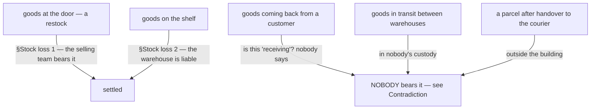
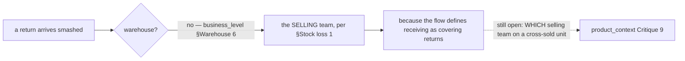

# Clarity — `stock_context.md`

[stock_context.md](../../docs/requirements/stock_context.md) has grown from a heading to **one section**:
§Stock loss. **That doc is yours — this one is mine.** Answered points are **deleted**, so this file is
always the current open set.

> **Re-examined after your update.** Closed and deleted from here: **who bears a receiving loss** (the
> selling team) and **whether a count shortfall is a warehouse liability** (yes). Both were my top two
> questions and both are now rules below. What the section does **not** do is cover the rest of stock —
> and it answers the money question before the doc has said what a unit, a place, or "available" is,
> which is the wrong end first but a useful end.

> **Re-examined again.** `stock_context.md` did not move this round, but
> [user_context.md](../../docs/requirements/user_context.md) arrived and it lands squarely here: the
> liability in §Stock loss 2 belongs to a **team**, and the acts that trigger it are now performed by a
> named **person** — a Packer. Which role may count, declare a loss, or accept a delivery is asked in
> [user_context_clarity](user_context_clarity.md#question); what changes *here* is that
> [Critique 2](#critique) and [Critique 7](#critique) are no longer abstract.

Siblings: [business_level](business_level_clarity.md) · [user_context](user_context_clarity.md) ·
[product_context](product_context_clarity.md) · [balance_context](balance_context_clarity.md) ·
[order_context](order_context_clarity.md).

---

## Proposed Design

### The rules, named

#### selling-team-bears-the-receiving-loss
**Selling team** · goods broken, short or lost **at receiving** · bears the loss itself.
*(§Stock loss 1)* — the completing half of
[receiving-losses-are-not-the-warehouses](business_level_clarity.md#receiving-losses-are-not-the-warehouses),
which said only who does *not* pay.

#### receiving-is-one-flow-for-restock-and-return
**Warehouse team member** · goods arrive, whether a **restock or a return** · one procedure handles both:
check against the system · accept · optional fee · calculate unit price · record losses and breakages ·
calculate valid quantity · **set placements**. *(§How Warehouse Team Member Accept Stock / Return That
Arrived)*

✅ **This closes what "at receiving" means.** The word in [selling-team-bears-the-receiving-loss](#selling-team-bears-the-receiving-loss)
now has a defined scope — the flow is titled for both phases and its first node reads *"Receiving
Restock/Return"* — so a return arriving damaged is a loss **at receiving**, and the selling team bears it.
That question was open for every pass of this analysis and is **deleted**. ⚠ The closure rests on *receiving*
meaning the same thing in the prose rule and in the flow's title; if it does not, this reopens.

⚠ **Still unstated: WHICH selling team**, when the sale was cross-team — the borrower who sold it, or the
owner whose goods they are. The flow never mentions an owning team at all
([product_context Critique 9](product_context_clarity.md#critique)).

#### in-custody-shortfall-is-the-warehouses
**Warehouse team** · stock already **in** the warehouse · a loss **or an opname shortfall** · is a
warehouse **liability**. *(§Stock loss 2)* — so an unexplained count difference is money, not a
correction. §Warehouse 5 prices *broken and lost* at
[warehouse-reimburses-unit-price](business_level_clarity.md#warehouse-reimburses-unit-price) — ⚠ **it does
not price a shortfall**, and an untraceable one cannot name a batch, so the number is an inference I am
making rather than a rule either doc states.

### The custody line, and the phase that falls between the two rules

**→ Recommend** state the rule as a **list of phases with a bearer each**, rather than as two sentences.
Three phases currently have no bearer, and each of them is a real event that happens weekly.

### What a business-level stock doc still has to say

| | The question | Why it cannot be deferred |
| --- | --- | --- |
| **1** | **What is the unit we track?** A piece, a box, a pair? Is it the same unit the supplier sells and the marketplace sells? | If they differ, every count, every cost and every order line needs a conversion — a business rule nobody can guess. It also decides what `AllProductQtyRestock` counts in [unit-price-is-landed-cost](product_context_clarity.md#unit-price-is-landed-cost). |
| **2** | **Where can stock BE?** On a shelf · arrived but not yet shelved · in transit between warehouses · set aside as damaged · held for an order. | ⚠ **`business_level.md` §Warehouse 8 now makes placement a named capability and still does not say what a placement IS** — a rack, a shelf, a bin, a zone. My recommendation elsewhere that opname be *"counted per shelf"* assumes a grain no doc has defined. These are the places a person can physically point at, and [in-custody-shortfall-is-the-warehouses](#in-custody-shortfall-is-the-warehouses) now attaches **money** to being "in the warehouse" — so the boundary of that phrase has a price. |
| **3** | **What does "available" mean?** On-hand minus what — committed orders, the shared reserve, damaged units awaiting a decision? | Two selling teams share one pool by design, and [reserved-stock-is-never-shared](product_context_clarity.md#reserved-stock-is-never-shared) now subtracts from it. "Available" is the number both teams sell against, and if it means two things they will oversell. |
| **4** | **Who may move stock, is the move RECORDED, and who may change a count?** `business_level.md` §Warehouse 8 now names *"manage placements of the stocks"* as a standalone responsibility ([warehouse-manages-placements](business_level_clarity.md#warehouse-manages-placements)) — so moving goods between places is a first-class act, and nothing says it leaves a trace. ⚠ **An unrecorded move is indistinguishable from a loss at the next count**, and under [in-custody-shortfall-is-the-warehouses](#in-custody-shortfall-is-the-warehouses) a count shortfall is a **warehouse liability**. A crew that reshelves without recording it **manufactures its own debt** — and the units turn up on another shelf as an unexplained surplus. | **Every move is recorded, from place to place, with its actor** — that single rule is what makes the opname liability survivable, because a difference then has somewhere to be explained from. Also answer the two originals: may the *owner* adjust a quantity, and may the warehouse write stock off unilaterally? |
| **5** | **Can stock change OWNER without moving?** Team A sells its remaining units to team B, or a team closes. | Nothing allows it and nothing forbids it. If it can happen it is a movement with a cost and a balance entry, not an edit. |
| **6** | **How often is stock counted, and who may call for a count?** §Warehouse 7 says opname happens. Nothing says when, at what grain, or who triggers it. | Now that a shortfall is a liability, **the trigger is a financial act**. See [Critique 2](#critique). |

### The failure list — three rows closed this round

| What happened | Who is out of pocket | Status |
| --- | --- | --- |
| short delivery — 8 of 10 arrived | the **selling team** | ✅ §Stock loss 1 |
| a unit smashed while being received | the **selling team** | ✅ §Stock loss 1 |
| a unit smashed on the shelf | the **warehouse** | ✅ §Stock loss 2, at the owner's **Unit Price** ([warehouse-reimburses-unit-price](business_level_clarity.md#warehouse-reimburses-unit-price)) — ⚠ but WHICH batch's is open |
| a count is 3 short and nobody knows why | the **warehouse** | ✅ §Stock loss 2 — but at what tolerance, and with what dispute path? [Critique 1](#critique) — and ⚠ **at what price**: §Stock loss 2 names none, and §Warehouse 5 prices *broken and lost*, not an untraceable shortfall |
| the missing 3 turn up two weeks later | reverses — but who **owns** them now? | open, [Critique 4](#critique) |
| a customer returns a unit unsellable | ? | **open — nobody bears it**, see [Contradiction](#contradiction). ⚠ And a *sellable* return now has a price but no shelf — [product_context Q1](product_context_clarity.md#question) |
| goods expire on the shelf | ? | open — expiry is not mentioned anywhere in the requirement set |
| a unit is lost in transit between two warehouses | ? | open, [Critique 6](#critique) |

---

## Critique

| | Problem | → Recommend |
| --- | --- | --- |
| **1** | **[in-custody-shortfall-is-the-warehouses](#in-custody-shortfall-is-the-warehouses) has no tolerance and no dispute path.** Every count in a real warehouse differs from the book by a little. As written, each of those differences is a debt on the warehouse the moment somebody counts — and with a [debt threshold](balance_context_clarity.md#debt-threshold-limits-liability) now able to block a team, an accumulation of small counting noise can stop a warehouse trading. | Keep the rule (it is right — a count with no consequence stops being done carefully), but add the two things that make it survivable: **a stated tolerance or none, said explicitly**, and **a dispute window** in which the warehouse can recount before the entry is final. I would say **no tolerance, and a 24-hour recount window** — exactness with a chance to correct beats a fudge factor nobody can audit. |
| **2** | **Nothing says who may CALL an opname — nor, now that roles exist, who may PERFORM one.** If a stock owner can demand a count of their own goods at will, they can generate warehouse liabilities on demand. If only the warehouse may count itself, nobody independent ever verifies the goods. And [user_context.md](../../docs/requirements/user_context.md) gives the warehouse a **Packer**, so the person whose handling caused a shortfall may also be the person who records it — the team then pays for one person's arithmetic, unchecked. | **The warehouse counts on a schedule it owns, and an owner may REQUEST a count** which the warehouse must perform within a stated time — the trigger stays with the party that bears the result, and the owner still gets a real check. **Grain: a shelf, on a rolling cycle**, because a whole-building count needs the building shut. And **recorder ≠ confirmer, stated against the HUMAN and not the role** — `user_context.md` §General lets one person hold two roles, so a role-level rule can be satisfied by one pair of hands ([user_context_clarity Critique 2](user_context_clarity.md#critique)). |
| **3** | **"loss/opname" merges two different events into one liability.** A *witnessed* loss — someone drops a box — is a fact with an actor, a time and often a photograph. An *opname shortfall* is the absence of an explanation: the goods went at some unknown moment, possibly before this warehouse ever had them. Charging both identically is defensible, but it makes the more common one impossible to investigate, because nothing distinguishes them afterwards. | Record them as **two kinds** even though they price the same: **loss** (witnessed, has an actor and a cause) and **shortfall** (found by counting, cause unknown). A warehouse whose shortfalls are rising has a different problem from one whose losses are, and the doc should let you see which. |
| **4** | **Nothing says what happens to a broken unit — or a found one — after the money is settled.** The warehouse has reimbursed the owner's Unit Price. The object still exists: does the warehouse keep it, scrap it, or sell it? And when a written-off unit is found again ([balance cause 5](balance_context_clarity.md#the-six-causes-and-which-direction-each-pushes)), does it return to the owner's shelf? | Say it: **once reimbursed, the object is the warehouse's** — it paid for it. That also makes found-back coherent: the unit going *back* to the owner is exactly why the money reverses. A broken-and-reimbursed unit the warehouse then sells is its own income, not the owner's. |
| **5** | **"Broken" and "lost" are used as one phrase everywhere and they are different events.** A broken unit is here and unsellable — someone is holding it. A lost unit is not here, and only a lost unit can be *found back*. | Separate them in the vocabulary. **Broken** = present, unsellable, something must be decided about the object ([Critique 4](#critique)). **Lost** = absent, and it may come back. Only the second needs a reversal path. |
| **6** | **In-transit stock between warehouses has no owner of the risk.** Goods leave warehouse 1 and have not arrived at warehouse 2 — they are in nobody's custody, so [in-custody-shortfall-is-the-warehouses](#in-custody-shortfall-is-the-warehouses) does not reach them. A transfer is currently the one way to lose goods with no liability. | Name **in transit** as a place, and put the risk on the **sending** warehouse until receipt is confirmed. |
| **7** | **Two Packers at one shelf is the normal case here, and no requirement mentions it.** One counts A-01-3 while the other picks from it. The count is right, the pick is right, the recorded result is wrong — and that wrong result is now a **debt on the warehouse**. The role doc names the people without saying two of them may be at one shelf at once. | A business rule, not a technical one: **a count is a statement about a moment**, and either the shelf is closed to picking while it is counted, or the count is reconciled against what moved during it. I would close the shelf — it is the version a person can actually follow. |
| **8** | **Expiry is never mentioned in the requirement set.** If anything you sell perishes, it is a loss with a date on it that nobody is watching, and FIFO stops being an accounting rule and becomes a picking instruction. | Say whether **anything you sell expires**. If yes, expiry belongs here as a first-class fact and it changes how the crew picks. If no, one line closes a whole area. |
| **9** | **⚠ The flow computes the unit price BEFORE it knows what arrived.** The arrows run *Accept → (fee) → **Calculate Unit Price** → Is Any Lost → Is Any Broken → **Calculate valid Qty***. So the divisor in [unit-price-is-landed-cost](product_context_clarity.md#unit-price-is-landed-cost) — `AllProductQtyRestock` — can only be the **expected** quantity, because the shortfall has not been captured yet. Freight and the warehouse fee are then spread over units that **never turned up**: the surviving units are **under-costed**, the margin on them is overstated for the life of the batch, and [warehouse-reimburses-unit-price](business_level_clarity.md#warehouse-reimburses-unit-price) under-pays the owner if one of them later breaks. | **Move `Calculate Unit Price` after `Calculate valid Qty`.** It is one arrow, and it makes the cost of a batch the money actually spent divided by the goods actually landed. ⚠ **I am not treating the diagram as having decided this** — a drawn order is not prose, and drawing the fee step early is exactly the kind of thing that happens for layout reasons. It is [Question 2](#question). |
| **10** | **A delivery that is both SHORT and DAMAGED can only record one of the two.** `Is Any Lost → yes → Input Losts → Calculate valid Qty` — the "yes" branch **skips the broken check entirely**. Only a delivery with *no* losses ever reaches *Is Any Broken*. Both happen in one delivery routinely: a carton missing and another crushed. Under the drawn flow the crushed one is never recorded, so it becomes stock the system believes is sellable — and the difference surfaces later as an unexplained shortfall, which under [in-custody-shortfall-is-the-warehouses](#in-custody-shortfall-is-the-warehouses) is a **warehouse liability** for goods that arrived broken. | Make the two checks **sequential, not exclusive** — `Input Losts → Is Any Broken`. One arrow again, and it stops the warehouse inheriting a supplier's damage. |
| **11** | **"Report Manually (Outside System)" ends the process with goods in the building and nothing recorded.** Stock arrives, the system has no matching restock, and the flow terminates outside it. Nothing says what happens to the goods physically: whether they are refused at the door, set aside, or shelved anyway. If they are shelved, the next opname finds units nobody can explain; if they are set aside, they are goods in limbo with no owner and no liability. **A real receipt can currently leave no trace.** | Keep the escape hatch — an unexpected delivery is real — but **end it inside the system**: record a *receipt with no matching restock*, name who it is being held for, and leave the goods **unplaced** until someone resolves it. Then the count reconciles and the manual report is a task rather than a dead end. |
| **12** | **Placement now has two moments and only one is drawn.** The receiving flow ends at `Set Placements`, so a **first** placement always happens and nothing routinely sits unshelved — good, and it matches [warehouse-manages-placements](business_level_clarity.md#warehouse-manages-placements). What the flow does not cover is the **later** move: reshelving, consolidating, moving between racks. My recording recommendation in row 4 covers both, but only the second is a *move* — the first is part of accepting, and it already has a natural record because the receipt exists. | Say the two are different acts: **placement at receiving is part of the receipt** · **a later move is its own recorded event with its own actor**. Otherwise "record every move" reads as demanding a second record for something the receipt already captured. |

---

## Question

1. **Is the flow's step order deliberate — `Calculate Unit Price` BEFORE the shortfall is known?** As
   drawn, freight and the warehouse fee are divided by the **expected** quantity, so units that never
   arrived carry cost and the ones that did are under-priced. ([Critique 9](#critique))
   **→ I recommend moving it after `Calculate valid Qty`. One arrow — but a diagram is not prose, so this
   is a question and not a finding against you.**
2. **Should a delivery be able to record losses AND breakages?** The `Is Any Lost → yes` branch skips
   `Is Any Broken` entirely, so a short-and-damaged delivery can only record the shortage.
   ([Critique 10](#critique)) **→ I recommend chaining them: `Input Losts → Is Any Broken`.**
3. **Goods arrive that the system does not know about — what happens to them physically, and who bears
   them?** *"Report Manually (Outside System)"* ends the flow with stock in the building and no record.
   ([Critique 11](#critique)) **→ I recommend recording a receipt with no matching restock and leaving the
   goods unplaced, so the escape hatch ends inside the system.**
4. **Is there a tolerance on an opname shortfall, and can the warehouse dispute one?**
   ([Critique 1](#critique)) **→ I recommend no tolerance, with a short recount window.**
5. **Who may call for an opname, and at what grain?** ([Critique 2](#critique))
   **→ I recommend the warehouse schedules it, the owner may request one, counted per shelf.**
6. **After the warehouse has reimbursed a broken unit, whose object is it?** ([Critique 4](#critique))
   **→ I recommend the warehouse's.**
7. **Does anything you sell expire?** ([Critique 8](#critique))

---

# Contradiction

## ✅ the receiving-boundary gap is CLOSED — recorded, not deleted silently

For several passes this section held a contradiction: `business_level.md` §Warehouse 6 named **two**
phases the warehouse is not liable for — *"receiving restock or return goods from the returning orders"* —
while §Stock loss 1 assigned the loss using **one** word, *"at receiving"*. Between them, a return arriving
smashed was borne by nobody.

**§How Warehouse Team Member Accept Stock / Return That Arrived closes it** by giving the word a scope:
one flow, titled for both, first node *"Receiving Restock/Return"*. So *"at receiving"* covers both phases
and the selling team bears both.

**Why it is recorded rather than removed:** the cause was a rule assigning liability with a **word whose
scope lived in another document** — the same shape as the two leg-naming contradictions in
`order_context_clarity`. What closed it was not a new rule but a **definition of the term**, and that is
the cheapest fix available for this class. ⚠ The one residue is named under
[receiving-is-one-flow-for-restock-and-return](#receiving-is-one-flow-for-restock-and-return): *which*
selling team bears a cross-sold return.

---

# Awaiting

- **Everything except loss.** The doc now answers who pays when stock goes wrong, before it has said what
  stock **is**: no unit, no places, no meaning for "available", no lifecycle, no movement rules.
- ⚠ **Note the direction of dependency.** `product_context.md` has committed to
  [batch-fifo-pricing](product_context_clarity.md#batch-fifo-pricing) and to a return re-entering stock at a
  price **whose shelf it never names** — both rules about how *stock* behaves — while the stock doc that
  would define a batch, a place and a movement is still one section long. The pricing doc is deciding the
  stock model by implication.
