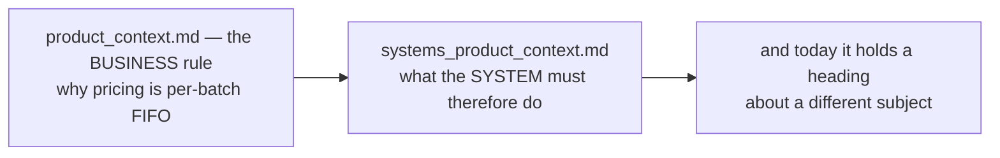

# Clarity — `systems/systems_product_context.md`

[systems_product_context.md](../../../docs/requirements/systems/systems_product_context.md) is still
**one line**: `# Stock System Requirements.` — in a file named *product*, linked from
[product_context.md](../../../docs/requirements/product_context.md) §System Requirements.

**That doc is yours — this one is mine.** It is short because there is one concrete problem and one
structural question, and neither needs a page.

> **Re-examined after your update.** Nothing changed in this file, but `product_context.md` grew by three
> sections — and every one of them is a rule that needs a *system* statement to be buildable. The table
> below has grown accordingly: this is now the file with the largest gap between what the context doc has
> decided and what has been said about enforcing it.

Siblings: [product_context](../product_context_clarity.md) · [stock_context](../stock_context_clarity.md).

---

## Proposed Design

`docs/requirements/` runs **low level → high level**, and `systems/` holds the system-level requirements
derived from a context doc. So the shape is one derived file per context doc, answering what the context
doc deliberately does not.

| The context doc has now decided | The systems doc has to decide |
| --- | --- |
| cost is drawn FIFO from batches | what a batch is at system level, what a draw records, and what happens when a draw spans two layers |
| `UnitPrice` includes freight and the warehouse fee, divided by the restock quantity | whether that divisor is **ordered** or **arrived**, and where the rounding remainder goes |
| a return re-enters stock at the order line's **COGS** | whether a cross-sold unit carries the markup back in — which turns on whether a cross order is a loan or a sale |
| a role list exists per team type | which role may perform each act, and which must confirm one that creates a debt |
| a reserve stops sharing below a level | who sets it, in what unit, **when it is tested**, and what the refused team is told |
| a shared lock stops sharing entirely | whether it affects orders already placed, and whether it can be aimed at one counterparty |
| the cross fee is a percent of unit price | where the rate lives, **when the fee freezes**, and how it rounds |

**→ Recommend** the file open with **one sentence naming the context doc it derives from**, so a mismatch
like the one below is visible on the first line rather than in the path.

---

## Critique

| | Problem | → Recommend |
| --- | --- | --- |
| **1** | **The filename and the heading name two different subjects, and `product_context.md` links here as its own system requirements.** A reader following the link from the pricing doc lands on a stock heading. One of the two is wrong and only you know which. | If this is meant to be the **product** one, the heading is the typo. If the **stock** system requirements were started here by accident, they want their own `systems_stock_context.md` — and note [stock_context.md](../../../docs/requirements/stock_context.md) is itself still one section long, so a system doc for it would be derived from very little ([stock_context_clarity](../stock_context_clarity.md)). |
| **2** | **`systems/` has no stated contract — and it is now the MIDDLE of a three-layer ladder.** A third layer, [`architectures/`](../../../docs/requirements/architectures/architecture_context.md), arrived while this one was still a single empty heading, so any new rule now has three plausible homes and no stated rule for choosing. | **Moved, not dropped.** The boundary question is asked once, over the whole ladder, in [architectures/architecture_context_clarity](../architectures/architecture_context_clarity.md#question) — it changed shape when the third layer appeared and only the whole ladder can answer it. |

---

## Question

1. **Is this file the product one or the stock one?** ([Critique 1](#critique))
   **→ I recommend product, and the heading is corrected** — the filename matches the link from
   `product_context.md`, so two references point at *product* against one pointing at *stock*.

> **One question was re-routed out of this file** — *what does a `systems/` doc hold that its context doc
> does not* is now asked once over all three layers, in
> [architectures/architecture_context_clarity](../architectures/architecture_context_clarity.md#question).
> Left here as a pointer, not as an open item, so it is counted once.

---

# Contradiction

## the file's name says product and its only line says stock

> path: `docs/requirements/systems/**systems_product_context**.md`
> its entire content: `# **Stock** System Requirements.`
> [`product_context.md`](../../../docs/requirements/product_context.md) §System Requirements: *"for
> system requirements it live in [this] → `./systems/systems_product_context.md`"*

**I think the heading is the wrong one** — two references point at *product* and one at *stock*. It is one
word either way and the file is empty, so the cheap moment to decide is now, before anything is written
into it under the wrong subject.

---

# Awaiting

- **The document.** There is nothing to analyse yet — this file exists so the name/heading mismatch is
  not discovered after the doc has been written, and so the six rows above are not lost.
