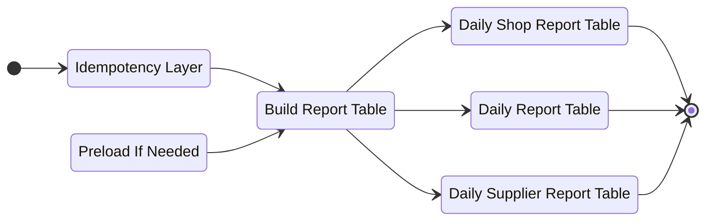

# Analytic Context

## Who Proposed This Design
1. This is Proposed by `Heri`
2. Maybe `Toni` have another design to compare.

## Responsbility
1. Provide Analytical Design Pattern

### Why We Need Analytical Design Pattern.
1. Separate responsbility domain between Operational Domain like create order, restock and etc with analytical domain that processing data & serve the reports.


## General.
This is architectural design concept about how we build robust & flexible analitical data.
**This is principle design, so question about what report that we have, or further case is depend on implementation. our focus is designed streaming processing that can be used other service or analytical service**

1. This Design relied heavily on Message Broker
2. For message broker, we use `Google Pub/Sub`
3. Basic Flows.
    ```mermaid
    stateDiagram-v2
    direction LR

    state "Transaction Happen" as tx
    state "Source Truth Logs" as src
    state "Message Broker" as msg
    state "Push (Webhook)" as push
    state "Pull" as pull
    state "Streaming Processing" as stream
    state "Report Table" as report
    state "Event" as evt

    [*]-->tx
    tx-->evt
    src-->evt
    evt-->msg
    msg-->push
    msg-->pull
    push-->stream
    pull-->stream
    stream-->report
    ```


## Event
```proto

message OrderCreated {
    uint64 order_id
}

message Event {
    string topic

    oneof event_data {
        OrderCreated order_created
        ...another event
    }
}
```

## Streaming Processing
Inside Streaming Processing



