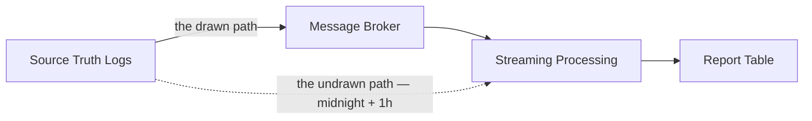
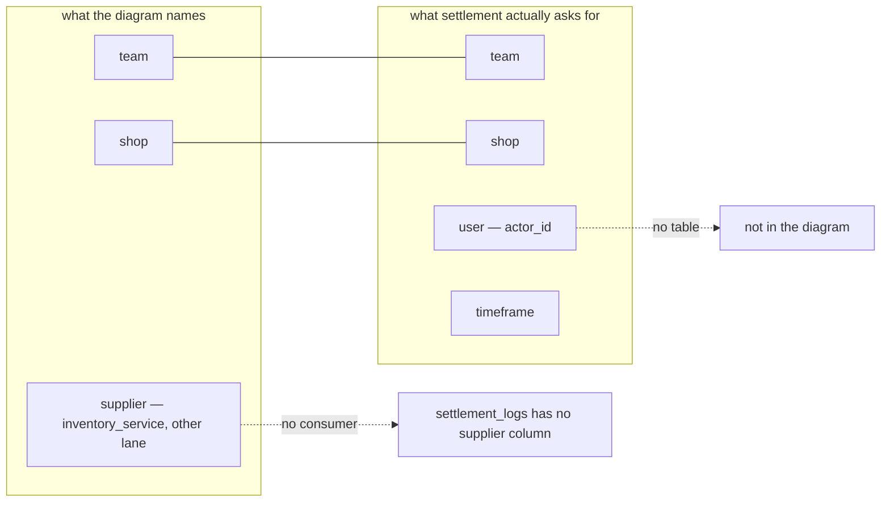
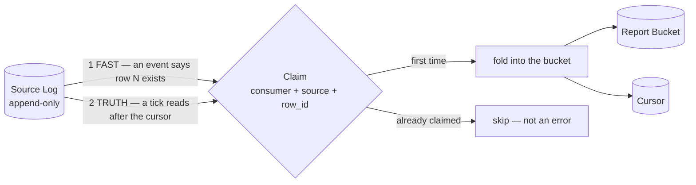
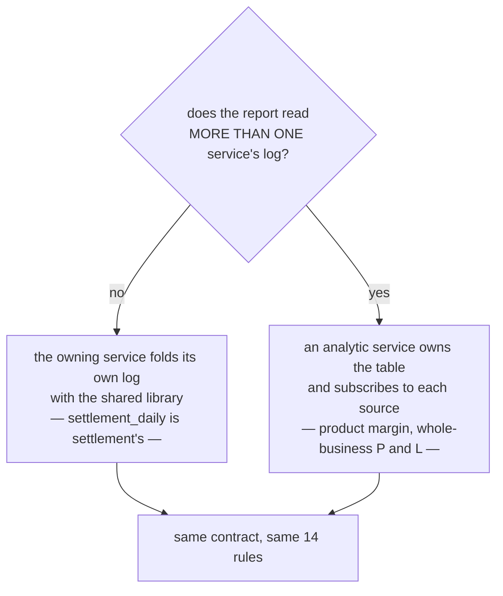
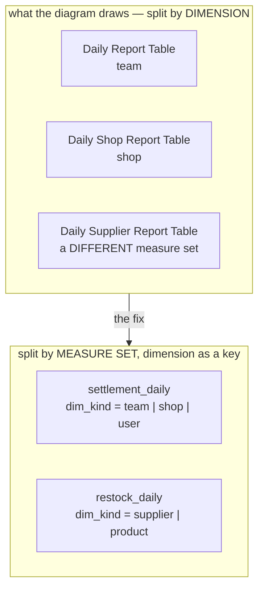
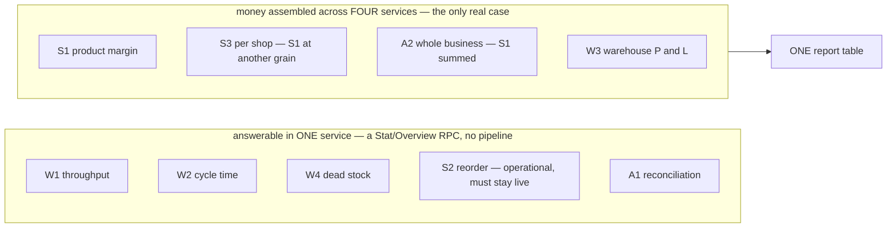
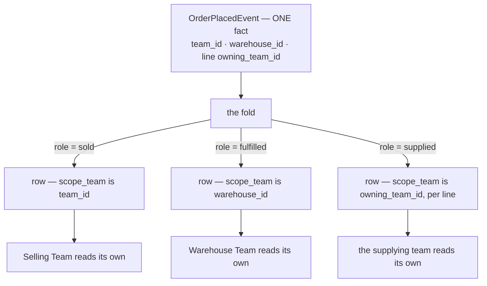

# Clarity — `analytic/context.md`

Critique, questions and warnings about [context.md](./context.md). That doc is yours — this one is
mine. Answered points are **deleted**, so this file is always the current open set.

> **Fifth pass — the contract is written.** You settled the order of work: *"we decide later what
> service follow this, for now make this principle robust first"*
> ([the-pattern-comes-before-its-consumers](./context_decision.md#the-pattern-comes-before-its-consumers)).
> So this file stops asking for a contract and **proposes one**:
> [what-the-pattern-owes-an-implementer](#what-the-pattern-owes-an-implementer) — 14 rules in three
> groups, plus a failure table showing what each rule buys.
>
> ⛔ **The one design move that does the most work: the event is a DOORBELL, not a delivery.** Two paths
> over one fold — a best-effort fast path for latency, a convergent tick for truth, and a claim keyed on
> the source row so they can overlap safely. That is the reconcile arrow
> [mutation_and_ledger.md](../../technical/ledger/mutation_and_ledger.md) already promised, and it makes
> the broker **optional to correctness**. It also retires the thin-vs-fat event argument outright — the
> event is never the record, so either shape works.
>
> ⚠ **Three rules already FAIL against a table that exists**, which is the point of checking them against
> real ones: `expense_records` breaks **S1** (append-only — `ExpenseUpdate` rewrites in place) and **S3**
> (an immutable bucket date — its month is person-chosen and editable), and **no source anywhere has S6**,
> the cursor-paged `LogRead`. That is the pattern's one real build cost, and it is worth naming now.
>
> ⚠ **`Preload If Needed` is the box to look at hardest.** It is rule **F4** wearing a helpful name: a
> fold that preloads mutable state gives a different answer on rebuild than it gave live, and nothing
> detects it.
>
> 🆕 **This pass — the `### Why` section landed, and it argues my case for me.** *"Separate the
> operational domain from the analytical domain"* is right but one level too abstract to choose a design
> with: separation comes in four strengths, and the section leans on the cheap ones while leaving out the
> only one that makes this pattern **necessary rather than preferred** — HARD RULE 3 forbids a
> cross-service join, so a report spanning services **cannot be a query**
> ([C18](#critique) → [name-the-coupling-not-the-benefit](#name-the-coupling-not-the-benefit)).
> ⛔ **And it is now the strongest argument against two things already in the doc**: `Preload If Needed`
> re-couples the two domains it separates, and a *pattern* that names a `supplier` table has absorbed one
> consumer's vocabulary ([C19](#critique)). ⚠ It also opens a structural question — *is `analytic` a
> LIBRARY or a SERVICE?* — on which I have **revised my own [C9](#critique)**.
>
> ⏸ **Deferred by the same decision:** which consumer goes first ([C16](#critique)). ⚠ It is kept rather
> than deleted, because the risk it names is now live — an unimplemented pattern is unfalsifiable.
>
> ✅ **Earlier passes settled and recorded:** reports belong to the consumer · this doc is a pattern, not
> a data product · the `Admin Team` question re-routed to settlement.
>
> ⛔ **Still contradicted:** a doc whose responsibility is *a pattern* names three concrete report tables,
> and names them wrongly ([Contradiction](#the-doc-disclaims-reports-and-then-names-three), [C15](#critique)).
>
> ✅ **The diagrams parse** (`npm run lint:mermaid`).

Siblings: [mutation_and_ledger](../../technical/ledger/mutation_and_ledger_clarify.md) — its
`# Statistic Design.` is the *same pipeline in more detail* · [event_library](../../technical/event/library_clarify.md) ·
[ledger_context](../ledger/context_clarify.md) · [member](../project/member_clarify.md) — analytic is
Toni's lane, and this design is Heri's.

---

# Contradiction

## The reconcile pass exists in one doc and has no box in the other

| where | what it says |
| --- | --- |
| [mutation_and_ledger.md](../../technical/ledger/mutation_and_ledger.md) `# Statistic Design.` item 2 | *"Statistic is **streaming and reconcile every midnight + 1 hour**"* |
| [context.md](./context.md) `## General.` | `src → msg → push/pull → stream → report`. **No second path.** The broker is the only way anything reaches a report |

One doc has two paths into the report table and the other has one. That is not a drafting slip: **which
one is primary decides the whole design.** If reconcile is real, the broker is an optimisation and every
loss is self-healing. If the diagram is right, the broker is load-bearing and a dropped message is a
permanently wrong number with nothing to detect it.

**→ Recommend:** draw the reconcile arrow. It is the same arrow that answers *rebuild*, *late events* and
*lost publish* at once — see [log-is-the-source-broker-is-the-trigger](#log-is-the-source-broker-is-the-trigger).



## `Source Truth Logs` is one box where the ledger doc has four

[ledger/context.md](../ledger/context.md) names exactly four sources — Settlement, Purchasing, Inventory,
Other Expense — each writing its own `*_log`, and
[ledger-is-downstream-projection](../ledger/context_clarify.md#ledger-is-downstream-projection) makes those
logs the records of truth. So `src` here is **four tables in four services across both lanes**, not one thing.

⛔ **And checked against the migrations, only one of the four is real:**

| the ledger doc's source | what is actually built | is it a log? |
| --- | --- | --- |
| Settlement Log | `settlement_logs` | ✅ yes |
| Inventory Log | `stock_movements` | ⚠ close enough — no in-place update path found |
| Other Expense Log | `expense_records` | ⛔ **no** — an entity table, edited in place ([C14](#critique)) |
| Purchasing Log | **nothing. No service, no table** | ⛔ |

**→ Recommend:** say whether analytic reads the **four source logs** or the **ledger** built from them —
and then which **one** it reads first. They give different numbers on the day an event is stuck: the
ledger is behind, the logs are not. ⚠ Three of the four are not a design decision yet, they are unbuilt,
so a fold contract written over all four today is three parts guesswork.

## the-doc-disclaims-reports-and-then-names-three

⚠ **Sharper this round, not smaller.** `## Responsbility` is now **"Provide Analytical Design Pattern"**
— so the contradiction is no longer between two paragraphs, it is between the doc's **stated
responsibility** and its only concrete specification.

| where | what it says |
| --- | --- |
| `## Responsbility` | **"Provide Analytical Design Pattern"** — a pattern, with implementers, not reports |
| `## General.` | *"question about **what report that we have** … is **depend on implementation**"* |
| `## Streaming Processing` | `Daily Report Table` · `Daily Shop Report Table` · **`Daily Supplier Report Table`** — three named business reports |

The first two agree and are recorded
([reports-belong-to-the-consumer](./context_decision.md#reports-belong-to-the-consumer) ·
[analytic-is-a-pattern-not-a-data-product](./context_decision.md#analytic-is-a-pattern-not-a-data-product)).
The diagram contradicts both — and contradicts them **wrongly**, which is what makes this worth reporting
rather than tidying: of the three tables named, the doc's only consumer needs `team` ✅, `shop` ✅,
**`user`** (absent) and does not have a supplier at all.



**→ Recommend:** delete the three tables from the diagram — they are the *"what report we have"* the same
edit says belongs to the consumer — and replace them with the thing a capability doc **does** owe:
`grain_kind` as a **key** ([C15](#critique)). One box, `Report Table`, keyed by whatever the consumer asks
for.

## The example event is thin, and the shipped event argues against thin

| where | what it says |
| --- | --- |
| [context.md](./context.md) `## Event` | `message OrderCreated { uint64 order_id }` — an id and nothing else |
| [selling/v1/events.proto](../../../proto/warehouse/selling/v1/events.proto) `OrderPlacedEvent`, shipped | `revenue`, `cogs`, `shipping_cost`, `cost_known`, `warehouse_id`, `actor_id` and every line — under the comment *"IT CARRIES THE MONEY, not just an order id, and that is a correctness choice"* |

The shipped event's reasoning is explicit: the figures were **frozen at order time**, so *"a thin event
naming only an order would make revenue read the order back later and record whatever it said then — so
an edit between publish and consume would silently rewrite history."*

**Your `## Event` section proposes the exact shape that comment argues against**, in a repo where the fat
version is already generated, published and consumed. One of the two is wrong, and neither knows about
the other.

**→ Recommend:** the *third* option resolves it, and it is not a compromise — see
[log-is-the-source-broker-is-the-trigger](#log-is-the-source-broker-is-the-trigger). The objection to a
thin event is *"the entity may have changed by the time you read it back"*, and that objection **only
holds against reading the ENTITY**. Reading the **append-only log row** the event was derived from
returns what was true at that moment, by construction — a fat event is a snapshot precisely because a
mutable row is a bad source, and an immutable log row is not one.

⚠ **That defence is conditional, and for one source the condition ALREADY FAILS.** It needs the log to
be genuinely append-only — open in general
([mutation_and_ledger Q3](../../technical/ledger/mutation_and_ledger_clarify.md#question)), and **settled
in the wrong direction for expense**, which `ExpenseUpdate` rewrites in place ([C14](#critique)). So the
honest position is per source, not global: the proposal holds for `settlement_logs` and
`stock_movements`, and **does not hold for `expense_records` as it stands today**. Either expense gains a
correction row, or a fat event, or it is not in the first slice.

---

# Critique

| | Problem | → Recommend |
| --- | --- | --- |
| ~~**1**~~ | ✅ **CLOSED** — *"which numbers, for whom"* is answered by [reports-belong-to-the-consumer](./context_decision.md#reports-belong-to-the-consumer): this doc specifies a capability, and reports belong to the consuming service. Settlement proved it the same day. | [two-questions-need-the-pipeline](#two-questions-need-the-pipeline) is not withdrawn — it moves. It is now a **consumer-side** list for the services owning those screens, and its finding still stands: **seven of nine questions are one service's own tables** and want a `Stat`/`Overview` RPC, not a broker. |
| **15** | ⛔ **A GRAIN is modelled as a TABLE, and it does not survive the second consumer.** `## Streaming Processing` fans out to **three named tables** — `Daily Report Table` (team), `Daily Shop Report Table`, `Daily Supplier Report Table` — in a doc whose stated responsibility is *a pattern*. Its likeliest consumer needs **team, shop and USER**: two match, `user` is missing, and `supplier` is not a settlement concept at all (`settlement_logs` has no supplier column — suppliers live in `inventory_service`, the other lane). ⛔ **The split is on the wrong axis**: team and shop are two *dimensions of one measure set*, supplier is a *different measure set*. | Full answer with schema, costs and the mechanical test: [a-grain-is-a-key-a-measure-set-is-a-table](#a-grain-is-a-key-a-measure-set-is-a-table). **A measure set is a TABLE, a dimension is a KEY, and only `day` is stored.** For settlement that is **one** table and **one** fold instead of three-to-twelve — and adding `user` becomes a value rather than a migration. It also makes the cross-cut invariant **Σ(shop) == team** assertable, which cannot even be written when the cuts live in separate tables. |
| **16** | ⏸ **DEFERRED, and the deferral is recorded** — [the-pattern-comes-before-its-consumers](./context_decision.md#the-pattern-comes-before-its-consumers). It said a capability with no consumer cannot be judged: settlement adopted the principle and then shipped a `GROUP BY`, and the pipeline has **no parts at all** (no settlement event in the proto, no `EventSender` in `settlement_service`, no report-table migration, no analytic service — so `settlement_logs` is a table nobody publishes). | ⚠ **Kept, not deleted, because the risk it names is now live**: an unimplemented pattern is unfalsifiable. The mitigation is in force — every rule in [what-the-pattern-owes-an-implementer](#what-the-pattern-owes-an-implementer) is **checked against a table that already exists**, and three of them already fail against `expense_records`. **Reopen this the moment a consumer is picked.** |
| **2** | **This design is already written, at higher resolution, somewhere else.** [mutation_and_ledger.md](../../technical/ledger/mutation_and_ledger.md) `# Statistic Design.` has the same Pub/Sub, the same push/pull subscriber, an idempotency layer and a materialize metric table. Two copies at two resolutions in two trees drift — and they already disagree ([Contradiction](#contradiction)). | **One home.** The *pipeline* is technical → `docs/technical/analytic/context.md`, and the ledger doc's `# Statistic Design.` links to it instead of restating it. **This** file keeps what only the business can answer: which numbers, for whom, at what lag, and what a corrected number does to a closed month. |
| **17** | 🆕 ⛔ **The doc's responsibility is now to PROVIDE A PATTERN, and the pattern is not written down.** A pattern is only worth the **contract** it states — what an implementer must guarantee, and what it gets back. This doc has a flow picture, a sketched `Event` message and a box called *Idempotency Layer*. It states **none** of: what a source must guarantee (append-only? a monotonic cursor? a stable id?) · what the dedup key IS · whether the fold must be commutative · what happens to an event for a **closed period** · how a report is **rebuilt** when its definition changes · which delivery mode an implementer should choose. ⚠ **And `## Source Truth Log` and `## Report Table` — the two headings that would hold exactly this — were DELETED this round rather than filled in.** Settlement has already written *"follow this"* into its own doc, so a real service now depends on a contract that does not exist. | Write the contract as a **checklist an implementer can be held to**, and nothing else — see [what-the-pattern-owes-an-implementer](#what-the-pattern-owes-an-implementer). Six rules is enough, and every open critique in this file is one of them: [C4](#critique) rebuild · [C7](#critique) commutative fold · [C11](#critique) the scope rule · [C13](#critique)/[C14](#critique) what a source must guarantee · [C15](#critique) grain as a key. **The critiques are not separate problems — they are the missing contract, itemised.** |
| **18** | 🆕 **The new `### Why` names a BENEFIT, not a coupling — and the strongest argument available is the one it does not make.** *"Separate the operational domain from the analytical domain"* is right, but separation comes in four strengths with wildly different prices: **load** (a read replica fixes it, no broker), **availability** (an event fixes it), **schema** (⛔ **nothing else works** — HARD RULE 3 forbids one service reading another's tables), **lifecycle** (a rebuildable fold fixes most of it). As written, a reader can fairly ask why a broker rather than a replica. ⚠ It also states only gains: the price of the separation is that **the number is wrong for a while**, which in this app is sharper than usual because HARD RULE 10 makes freshness a *correctness* property. | Name the **schema** coupling explicitly — it is the one that makes this pattern the only option rather than a preference: *"a report that spans services cannot be a query, so it must be assembled from what services publish, and an operational write must never fail or wait because that assembly is down."* And state the price beside the benefit — it is what forces [R2](#what-the-pattern-owes-an-implementer) and [R3](#what-the-pattern-owes-an-implementer). → [name-the-coupling-not-the-benefit](#name-the-coupling-not-the-benefit) |
| **19** | 🆕 ⛔ **Two things already in the doc LEAK across the boundary the `### Why` just drew — and it is now YOUR argument against them, not mine.** `Preload If Needed` has the analytical fold reach back for operational state, re-coupling exactly what the section separates (and breaking rebuild reproducibility — [F4](#what-the-pattern-owes-an-implementer)). The three named report tables have a *pattern* absorbing one consumer's vocabulary: a pattern that knows what a `supplier` is has not separated anything ([C15](#critique)). | Rename `Preload If Needed` to **"preload only what is frozen on the source row"**, or drop the box. Remove the three tables. **The `### Why` section is the reason** — both were arguable before it was written and are not after. |
| **3** | **`src → msg` is the one arrow that loses data, and it is drawn as if it cannot.** The publish happens **after commit, outside the transaction** — [order_place.go:294](../../../backend/services/selling_service/selling_v1/order_place.go) and the event's own comment say so. Crash in between and the fact is committed, the event is gone, the report is short forever and nothing notices. | Already raised as [mutation_and_ledger C5](../../technical/ledger/mutation_and_ledger_clarify.md#critique) (an outbox) — **not re-argued here.** What analytic must add is the consequence: **a report built only from the broker inherits that hole.** [log-is-the-source-broker-is-the-trigger](#log-is-the-source-broker-is-the-trigger) closes it without an outbox. |
| **4** | **No rebuild path — and a report's DEFINITION changes more often than its data.** The day *"margin"* changes, or a fold bug ships, history has to be recomputed. The diagram starts at the broker, and Pub/Sub retains messages for **days**, not years. | Make **every report table rebuildable from the source logs by the same fold code** the live path runs. If it is rebuildable, a definition change is a re-run — and dedup, ordering and late arrival stop being separate problems. |
| **5** | **`push` and `pull` are both drawn, with no reason given for either.** They are not two styles of one thing: push is an HTTP endpoint with no backpressure and a mandatory dead-letter policy — pull is a worker that holds a lease, **batches**, and controls its own concurrency. Both means two operational surfaces for one report. ⚠ **And push is not hypothetical — it is what ships** ([Fair note](#fair-note-on-what-exists)), so "both" really reads *"add pull"*. | **Pull for analytic.** Batching is what makes a rollup cheap: 500 events fold into one `UPDATE` per bucket. Keep push for a service that *reacts* to a single fact — which is exactly what `liability_service` does with it today. The doc should say which is deployed **per consumer**, not that both exist. |
| **6** | **"Streaming Processing" names machinery this stack does not have.** No Flink, no Beam, no Kafka Streams — it is Go handlers over Pub/Sub. The word imports windows, watermarks and late-event policy, none of which have an implementation here. | Call it an **incremental aggregator** and state the two rules it actually needs: (a) one event folds into one bucket row, (b) **what happens to an event that arrives after its period is closed** — a *business* answer, not a technical one, and it is [Question 3](#question). |
| **7** | **`Report Table` is one box hiding a grain decision.** A fact table and a pre-aggregated bucket table are different designs, and the grain (`day × product × team`?) decides storage, query shape and every future slice. ⚠ Under at-least-once delivery `count = count + 1` is only safe if the increment and the dedup `Claim` commit **in one transaction** — nothing says so. | Write the grain as a row: `(grain, period_start, scope keys) → measures`. Then two hard rules: the fold **sums `change`, never stores `after_balance`** (a sum is commutative, so out-of-order delivery is harmless — an `after_balance` is not), and **the increment runs inside the `Claim` transaction**. See [one-fact-three-audiences](#one-fact-three-audiences) for what the new audience list does to the scope keys. |
| **8** | **No lag budget — and this app's freshness rule is a correctness rule.** HARD RULE 10 makes every read always-fresh because two people work one stock level. A report table lags by construction, so a screen can show a number that *looks* operational and is a minute old. | **An operational number is never served from a report table.** Give each report a stated lag budget and show *"as of HH:MM"* on the screen. A dashboard tile a picker acts on is not analytics. |
| **9** | 🔄 **REVISED — my own recommendation, changed by your `### Why` section.** It said *"one `analytic_service` owning its report tables"*. That was right when this doc was a data product with three audiences; under [analytic-is-a-pattern-not-a-data-product](./context_decision.md#analytic-is-a-pattern-not-a-data-product) it puts one service in charge of every other domain's numbers, which is the biggest authorization surface in the system and strains HARD RULE 3's *a model belongs to exactly one service*. | **Split by one rule:** a report reading **one** service's log is that service's own, folded in-process with a shared library — `settlement_daily` belongs to `settlement_service`. A report reading **several** needs an owner, and that is what an analytic service is for. Seven of the nine questions in [two-questions-need-the-pipeline](#two-questions-need-the-pipeline) are single-source, so the library carries most of the value. → [single-source-is-the-services-own-cross-source-is-analytics](#single-source-is-the-services-own-cross-source-is-analytics) |
| **10** | **A comparison with no axes.** *"Maybe `Toni` have another design to compare."* Two designs compared on taste end in preference, and this one is already ahead by being written down. | Fix the axes **before** the second design arrives: rebuildability · lag · correctness under redelivery and out-of-order · ops surface · cost per month · how a definition change is rolled out. Score both on the same six. |
| **11** | 🔄 **Reframed — the audiences are gone, the problem is not.** It was *"one fact belongs to three of your audiences"*; with [analytic-is-a-pattern-not-a-data-product](./context_decision.md#analytic-is-a-pattern-not-a-data-product) it becomes a **pattern-level rule the doc still owes**: one source fact can belong to SEVERAL scopes. A single `OrderPlacedEvent` carries `team_id` (sold), `warehouse_id` (fulfilled) and `owning_team_id` per line (supplied) — three teams, three right answers, one event. A pattern that says *"fold the event into the bucket"* does not say which bucket, and every implementer will guess differently. | **The pattern states the scope rule**: the fold writes **one row per `(scope_team, role)`** — never one row with three nullable team columns, which cannot be indexed for *"my team's numbers"*, the only query any consumer runs. See [one-fact-three-audiences](#one-fact-three-audiences); it is now a **pattern requirement**, not an audience observation. |
| ~~**12**~~ | ✅ **RETIRED — re-routed, not answered.** It said *"Admin Team" is an audience your authorization model cannot serve* (the scope bypass is by ROLE in team 1, not by `TEAM_TYPE_ADMIN`). The audience list is gone, so this doc can no longer answer it. | The problem is **live in the doc that can answer it**: two of settlement's four report shapes are per-team lists behind a required `use_scope` `team_id` → [settlement C5](../settlement/context_clarify.md#critique). Not restated here. |
| **13** | 🆕 ⛔ **Three of the four "Source Truth Logs" do not exist, and one of the three cannot.** Checked against the migrations: **`settlement_logs` is the only one built.** *Purchasing* has **no service and no table at all** ([ledger C5](../ledger/context_clarify.md#critique)). *Inventory* has `stock_movements` — append-only in practice, and a reasonable log. *Other Expense* has `expense_records`, which is **not a log**: it is an entity table with an in-place `ExpenseUpdate`. So `src` is one box over one real log, one plausible one, one entity table and one absence. | Say which of the four analytic actually reads **in its first slice**, and build that one. ⚠ **Do not design a fold over four sources when one exists** — the shape of a `PurchasingLog` is unknowable until purchasing has a service, and any contract written for it now is a guess that the first real implementation will break. |
| **14** | 🆕 ⛔ **An expense can be edited to a different AMOUNT and a different MONTH, in place, and nothing is published.** [expense_update.go:67](../../../backend/services/expense_service/expense_v1/expense_update.go) writes `amount`, `kind`, `shop_id` **and `occurred_at`** over the existing row, and `expense_service` publishes **no events whatsoever**. `occurred_at` is *"the date the cost BELONGS TO, chosen by the person — not the insert timestamp"*, by design, so payroll paid on the 5th is filed to the month before. **A folded bucket therefore goes wrong twice — the month it left and the month it joined — with no message to tell anyone.** | This is [Question 3](#question) made live, and it is not hypothetical: it is shipped behaviour today. Whichever answer you pick, expense needs **one** of: an event on update (carrying the old bucket as well as the new), an append-only correction row instead of an in-place edit, or exclusion from the pipeline until it has one. **→ I recommend the correction row** — it makes expense a real log, which is what [C13](#critique) says it currently is not. |

## fair-note-on-what-exists

⚠ **Correcting my own first pass.** I wrote *"no subscription consumes anything yet — nothing on this
diagram has ever run."* That is wrong, and the truth cuts both ways:

| | |
| --- | --- |
| ✅ **The push path is LIVE.** [liability_service/push_handler.go](../../../backend/services/liability_service/push_handler.go) consumes `order-placed` and `order-cancelled` and charges real ledger fees. `san_event` has `Claim` (dedup as the insert), the `Handled`/`Duplicate`/`Rejected` rule, and rejection recording | so **push is the deployed mode**, and C5's "both are drawn" really reads *"add pull"* |
| ⚠ **There is no broker in the dev server.** [event_sender.go](../../../backend/cmd/app_development/event_sender.go) is a synchronous in-process **loopback** — the contract and the handler are exercised, the broker is not: no retries, no redelivery, no dead-lettering | every claim this design makes about *delivery* is still unproven here |
| ⛔ **The pull path does not exist.** No subscriber, no lease, no batching, anywhere | |
| ⛔ **`inventory_service/push_handler.go` is a skeleton** that acks every message | |

## the-report-table-this-repo-already-deleted

The strongest evidence available to this design, and it is not in the doc.

`revenue_service` was **exactly this**: a push subscriber on `order-placed` and `order-cancelled`, its
own report table (`order_revenues`), a void path for cancellations, and a `RevenueDaily` rollup RPC. Six
issues of work — #74, #75, #78, #153, #164, #171. It was **deleted** in `0d4cbc4 "settlement
implementation"`, and its two events are still published today with **no consumer**, deliberately, so it
can be re-added.

Two things in the wreckage bear on this doc:

1. **It was replaced by the ACTUAL data, not by a better pipeline.** Revenue recorded what an order was
   *expected* to make. Settlement records what it *actually paid out*, per order. The projection lost to
   the source.
2. **Its rollup was a `GROUP BY`, not a bucket table.** `RevenueDaily` ran one grouped query over the
   fact rows, with a comment noting the obvious wrong way was a query per day. The one daily report this
   repo shipped needed **no incremental aggregation at all**.

**→ Recommend:** this is [Question 5](#question) with evidence attached. Say what this design does that
`revenue_service` did not, or the same outcome is the likely one. If the answer is *"nothing — the same
thing, for more numbers"*, that is a fine answer, and it means the argument is about **scale**, which can
be measured rather than debated.

---

# Proposed Design

## what-the-pattern-owes-an-implementer

[C17](#critique), and the job [the-pattern-comes-before-its-consumers](./context_decision.md#the-pattern-comes-before-its-consumers)
now makes the whole job. This is my proposal for `## Source Truth Log` and `## Report Table` — the two
sections the doc deleted. **Correct it or replace it**, but a pattern with no contract cannot be
followed or refuted.

⚠ **Every rule below is checked against a table that already exists** — `settlement_logs`,
`stock_movements`, `expense_records` — because an unimplemented pattern is unfalsifiable and that is the
only guard available.

### the one idea — the event is a DOORBELL, not a delivery

Your diagram has one path into the report. That makes the broker load-bearing: a lost message is a
permanently wrong number. Your sibling doc already promised the fix —
[mutation_and_ledger.md](../../technical/ledger/mutation_and_ledger.md) says statistic is *"streaming
**and** reconcile every midnight + 1 hour"* — and this is that reconcile arrow, drawn.

**Two paths, one fold, applied at most once per source row.**



| | |
| --- | --- |
| **the fast path** | an event arrives → claim → fold. Low latency. **Best-effort** — it is allowed to lose messages |
| **the truth path** | a tick reads the log after the cursor → claim → fold → advance. **Convergent** — it cannot lose anything |
| **why both** | the fast path buys latency, the truth path buys correctness, and neither can be got from the other. The claim is what lets them run over the same rows without double counting |

⛔ **This is what makes the broker optional to CORRECTNESS**, which is the single biggest robustness gain
available here — and it resolves three arguments at once:

| the argument | how this settles it |
| --- | --- |
| **thin event or fat event?** ([Contradiction](#the-example-event-is-thin-and-the-shipped-event-argues-against-thin)) | ✅ **stops mattering.** The event is never the record — the log row is. Ship the fat `OrderPlacedEvent` as it stands, or a thin trigger; the fold reads the log either way |
| **the publish-after-commit hole** ([C3](#critique)) | ✅ **needs no outbox.** A lost publish delays a number, it never loses one |
| **the missing reconcile arrow** ([Contradiction](#the-reconcile-pass-exists-in-one-doc-and-has-no-box-in-the-other)) | ✅ it is the truth path — the two docs stop disagreeing |

### the contract — 14 rules, in three groups

**A SOURCE must promise**, or it cannot be a `Source Truth Log`:

| | rule | checked against what exists |
| --- | --- | --- |
| **S1** | **append-only** — a correction is a NEW row, never an edit | ✅ `settlement_logs` (*"just can adjustment by added record log, not updated the log"*) · ✅ `stock_movements` · ⛔ **`expense_records` FAILS** — `ExpenseUpdate` rewrites amount, kind and month in place ([C14](#critique)) |
| **S2** | **a monotonic `id`** — this is the cursor, and the read order | ✅ all three are `BIGSERIAL` |
| **S3** | **a server-stamped bucket date that never moves** | ✅ settlement's `posted_on` · ⛔ **`expense_records.occurred_at` is person-chosen AND editable** |
| **S4** | **a stable `event_id` DERIVED from the row**, never a fresh UUID | ✅ already the rule in [san_event](../../../backend/pkgs/san_event/) and on both shipped events |
| **S5** | **every row carries its own scope keys** — the fold must never look them up | ✅ `settlement_logs` has `team_id`, `shop_id`, `actor_id` |
| **S6** | **a cursor-paged `LogRead(after_id, limit)` RPC** | ⛔ **none of the three has one.** This is the one new thing every source must build |

**A FOLD must promise:**

| | rule | why it is a rule, not advice |
| --- | --- | --- |
| **F1** | **at most once per source row** — via the claim, keyed `(consumer, source, source_row_id)` | it is what lets the two paths overlap safely. ✅ `san_event.Claim` is already this shape |
| **F2** | **the claim and the fold commit in ONE transaction** | two transactions means a crash between them either double-counts or silently drops. There is no third option |
| **F3** | **measures are summed CHANGES, never a stored balance** | a sum is commutative, so out-of-order delivery and re-folding are harmless. An `after_balance` is neither — ⚠ note `settlement_logs` carries **both** `change` and `balance`: **fold the `change`** |
| **F4** | **the fold reads nothing mutable** — only what the source row froze | ⛔ **this is what `Preload If Needed` in your diagram invites a bug on.** A fold that preloads *"the product's current team"* gives a different answer on rebuild than it gave live, and nothing detects it |
| **F5** | **one row per SCOPE the fact belongs to** | one order is the selling team's, the warehouse's *and* the supplying team's number ([one-fact-three-audiences](#one-fact-three-audiences)). Without this rule every implementer picks a different one |

**A REPORT must promise:**

| | rule | why |
| --- | --- | --- |
| **R1** | **grain is a KEY, not a table** — `grain_kind` + `grain_id` | a new dimension is a VALUE, not a migration, a fold and a rebuild path ([C15](#critique)) |
| **R2** | **carries a `watermark`** — the highest source row folded | ⛔ **without it a stalled pipeline is invisible**, and that is the failure that ends trust in a report. It is also what *"as of HH:MM"* on the screen reads |
| **R3** | **never serves an operational number** | HARD RULE 10 — two people work one stock level, so a lagging number there is wrong, not merely stale ([C8](#critique)) |

### the shape

```
-- what a consumer keeps per source
cursor(consumer, source, last_row_id, updated_at)
claim (consumer, source, source_row_id)            PRIMARY KEY (all three)

-- the one report table. NOT one per grain (R1)
report_bucket(
  scope_team    -- WHOSE number this row is         <- the use_scope key (F5)
  role          -- what that team did in the fact
  grain_kind    -- 'team' | 'shop' | 'user' | ...   <- a KEY, so a new grain is a VALUE (R1)
  grain_id
  period_start  -- server-stamped, never moves (S3)
  measures      -- summed changes (F3)
  watermark     -- highest source row folded (R2)
)
PRIMARY KEY (scope_team, role, grain_kind, grain_id, period_start)
```

### the failure table — what each rule actually buys

The point of a pattern is that a named failure has a named answer. If a row here has no rule, the
pattern is not robust yet.

| failure | what kills it |
| --- | --- |
| publish lost after commit | the truth path — **S6** |
| the same message delivered twice | the claim — **F1** |
| two messages arrive out of order | summed changes — **F3** |
| a crash between dedup and increment | one transaction — **F2** |
| a row backdated into a reported period | immutable bucket date — **S3** |
| a source row edited after it was folded | append-only — **S1** |
| a report's DEFINITION changes | drop the report + claims, cursor to 0, re-run the same fold — **S6 + F1** |
| a poison message | DLQ on the subscription, and the truth path still converges without it |
| the pipeline silently stalls | the watermark — **R2** |
| a rebuild gives a different answer than the live run | no mutable reads — **F4** |
| the wrong team's number | one row per scope — **F5** |
| a new grain is needed | a new `grain_kind` value — **R1** |

### what is STILL the owner's call

The contract above is deliberately silent on four things, because they are not robustness questions:

| | | my recommendation |
| --- | --- | --- |
| **push or pull** ([C5](#critique)) | ⚠ push is what ships today | **pull for a fold** — it batches, so 500 rows become one `UPDATE` per bucket. Keep push for a service that *reacts* to a single fact, which is what `liability_service` does |
| **the tick interval** | — | start at **5 minutes**, plus the nightly full sweep your sibling doc already promised. Cheap, because a sweep with nothing to do is one indexed read |
| **the lag budget, per report** ([C8](#critique)) | — | state it per report and print it on the screen |
| **the closed-period rule** ([C14](#critique)) | ⛔ **business, and still open** | this is the one the contract cannot supply. **S1 + S3 make it unnecessary for a compliant source** — a correction is a new row on a new date — but `expense_records` is not compliant today |

### what I would change in your doc

| in `## Streaming Processing` | |
| --- | --- |
| ⛔ **remove** the three report tables | they are the consumer's business by your own `## General.` ([C15](#critique)) |
| ⚠ **rename** `Preload If Needed` | it is the F4 hazard wearing a helpful name. If it stays, it must say **"preload only what is frozen on the source row"** |
| ✅ **add** the second arrow | source → fold, no broker. It is the reconcile pass your ledger doc already promised |
| ✅ **restore** `## Source Truth Log` and `## Report Table` | with S1–S6 and R1–R3 in them. They are the two halves of the contract |

## name-the-coupling-not-the-benefit

`### Why We Need Analytical Design Pattern.` ([C18](#critique)). The rationale is right, and it is
**one level too abstract to choose a design with** — *"separate the operational domain from the
analytical domain"* is a benefit, and separation comes in four strengths that cost wildly different
amounts.

### the four couplings, and the cheapest thing that breaks each

| the coupling | the symptom | cheapest fix | does it need THIS pattern? |
| --- | --- | --- | --- |
| **load** | a year-long report query slows down order placement | ⚠ **a read replica.** One line of config | ⛔ **no** |
| **availability** | analytics is down, so an order cannot be placed | an **event** — fire and forget | ✅ yes, and it is already how `OrderPlacedEvent` is justified in the proto |
| **schema** | the report must join settlement + liability + inventory + expense | ⛔ **nothing else works.** HARD RULE 3 forbids one service reading another's tables | ✅ **yes — and this is the strongest justification available** |
| **lifecycle** | changing a report definition needs an operational deploy | a separate service, or a rebuildable fold | ⚠ partly — [rule 6](#what-the-pattern-owes-an-implementer) buys most of it |

⛔ **The strongest argument for this pattern is the one the section does not make.** *"HARD RULE 3 means a
cross-service report is impossible in a single query"* is not a preference about tidiness — it is a
constraint of this codebase, and it makes the pattern the **only** option for a whole class of report.
Load and lifecycle, by contrast, have much cheaper answers, and if the section leans on them a reader can
fairly ask why a broker rather than a replica.

**→ Recommend:** say **which** coupling. My proposal for the section, in one line:

> *A report that spans services cannot be a query — HARD RULE 3 forbids one service reading another's
> tables. It has to be assembled from what services publish, and an operational write must never fail or
> wait because that assembly is down.*

### the price the section does not state

Separation is not free, and the unpaid half is what forces two of the contract's rules:

| what you gain | what you pay |
| --- | --- |
| the operational domain never waits on, or fails because of, analytics | ⛔ **the analytical number is WRONG for a while**, by construction |

⚠ **In this app that is sharper than usual.** HARD RULE 10 makes freshness a *correctness* property —
two people work one stock level from a scanner and a phone — so *"separate domain"* also means **a hard
boundary on what a report may be used for**. That is [R2](#what-the-pattern-owes-an-implementer) (a
`watermark`, so staleness is visible) and [R3](#what-the-pattern-owes-an-implementer) (never serve an
operational number). **→ Recommend** stating the price beside the benefit — a *"why"* that lists only
gains reads as advocacy rather than design.

### ⛔ two things in the doc LEAK across the boundary it just drew

The new section is the strongest argument yet against two things already in the diagram, and it is the
owner's own argument, not mine:

| what leaks | which way | |
| --- | --- | --- |
| **`Preload If Needed`** | analytical → operational | a fold that preloads current operational state has **re-coupled** exactly what this section separates — and it breaks reproducibility too, so a rebuild disagrees with the live run ([F4](#what-the-pattern-owes-an-implementer)) |
| **the three named report tables** | consumer → pattern | a *pattern* that knows what a `supplier` is has absorbed one domain's vocabulary. If separation is the point, the pattern must not name a business entity ([C15](#critique)) |

## single-source-is-the-services-own-cross-source-is-analytics

⚠ **I am revising [C9](#critique).** It recommended *"one `analytic_service` owning its report tables"*.
That was written when this doc was a data product with three audiences; under
[analytic-is-a-pattern-not-a-data-product](./context_decision.md#analytic-is-a-pattern-not-a-data-product)
it is the wrong shape, and the new `### Why` is what makes it wrong.

**The open question it exposes:** *"analytical domain that processing data & serve the reports"* — is
`analytic` a **library** every service uses, or a **service** that holds other domains' data? The doc says
*pattern* in one place and *serves the reports* in another, and they are different systems.

| | **(L) a library** — `pkgs/san_fold` | **(S) a service** — `analytic_service` |
| --- | --- | --- |
| who owns `settlement_daily` | ✅ `settlement_service` — HARD RULE 3 clean | ⛔ analytic owns another domain's numbers |
| authorization | ✅ settlement's existing `use_scope team_id`, unchanged | ⛔ one service accumulates every team's every domain — the largest auth surface in the system |
| a cross-service report | ⛔ **has no home** | ✅ this is exactly what it is for |
| the broker | needed only when a report crosses services | always |

**→ Recommend BOTH, split by one rule** — and the rule is the same test that decided the grain:



| | |
| --- | --- |
| **single-source** — settlement's four shapes, warehouse throughput, dead stock | the **owning service**, using the library. No broker needed at all: the fold reads its own log in-process |
| **cross-source** — product margin, warehouse P&L, whole-business | an **analytic service**, subscribing. It never joins another service's tables — it folds what they publish |

✅ **This matches what the workload actually looks like:** of the nine questions in
[two-questions-need-the-pipeline](#two-questions-need-the-pipeline), **seven are single-source** and four
are the same cross-source money question at different grains. So the library carries most of the value and
the service carries the part that is otherwise impossible.

⚠ **And it keeps the pattern honest.** A library has to be general or nobody can use it — which is exactly
the pressure that would have removed `Daily Supplier Report Table` from the diagram on its own.

## a-grain-is-a-key-a-measure-set-is-a-table

[Question 3](#question) elaborated. **The question as posed is a false binary**, and the false binary is
what produced the three mismatched tables in `## Streaming Processing`. *"Grain"* is being used for three
independent things, and they do not get the same answer.

### the three axes hiding inside the word "grain"

| axis | settlement's example | table or key? |
| --- | --- | --- |
| **measure set** — *what is counted* | the seven settlement types · vs a restock report's lead time and defect rate | ⛔ **a TABLE.** These genuinely need different typed columns |
| **dimension** — *what it is broken down by* | team · shop · user | ✅ **a KEY.** Same measures, different cut |
| **period** — *at what resolution* | daily · monthly · yearly | ✅ **neither — store only DAY** (below) |

⛔ **This is exactly where the doc's diagram goes wrong, and the mistake is specific:** `Daily Report
Table` (team) and `Daily Shop Report Table` are two **dimensions of one measure set**, while `Daily
Supplier Report Table` is a **different measure set entirely** — suppliers live in `inventory_service`
with restock volume, lead time and defect rate, none of which is a settlement number, and
`settlement_logs` has no supplier column. So one fold is drawn producing three tables across two
unrelated measure sets. **It split on the wrong axis.**



### the test that decides it, mechanically

**Do these two cuts want the same columns?**

- **Yes** → same table, `dim_kind` tells them apart. Settlement's team, shop and user all report the
  same seven types → **one table, three values.**
- **No** → different measure sets, different tables. Settlement money and restock defect rate share
  nothing → **two tables.**

⚠ **This is also the anti-nullable-soup rule.** The usual objection to one table is *"you get 40 nullable
columns"* — that objection is real, and this test is what prevents it: columns are only ever shared by
cuts that all populate them.

### period: store only DAY, derive the rest

Settlement asks for daily, monthly and yearly. **Fold only the day.**

| | |
| --- | --- |
| ⛔ **if day, month and year are each folded from source rows** | three folds that can disagree, and a missed row corrupts them *inconsistently* — the month says one thing, its days another, and neither is checkable against the other |
| ✅ **if month is `GROUP BY date_trunc` over days** | a discrepancy is impossible by construction, and a rebuild fixes all three at once |

**And it is cheap.** A year is ≤366 rows per dimension value: a 50-shop team over a year aggregates
18,300 rows, which is nothing. So there is no `period_kind` in the table at all — **there is only `day`.**
One whole axis disappears.

### the derivation rule for dimensions — and it differs per source

A coarser dimension may be **derived** from a finer one only if the finer key is **total** — never 0,
never absent. Checked against what exists, and the two sources disagree:

| source | is `shop_id` total? | so team is… |
| --- | --- | --- |
| `settlement_logs` | ⚠ `BIGINT NOT NULL`, and every row descends from an order that has a shop — but **there is no `CHECK (shop_id > 0)`**, so this is a convention, not an invariant | derivable as Σ shops — **once the CHECK is added.** → **Recommend adding it** |
| `expense_records` | ⛔ **no** — `shop_id BIGINT NOT NULL DEFAULT 0`, documented as *"0 = not attributed to one shop"* | **must be folded independently.** Σ shops would silently drop every unattributed cost |

⚠ **So "team = Σ shops" is not a property of the pattern — it is a property of a source**, and the pattern
must make an implementer state it rather than assume it. A fold that assumes it against `expense_records`
under-reports team costs, and nothing detects that.

### the shape

```
settlement_daily(
  scope_team   -- WHOSE row this is                    <- the use_scope key
  dim_kind     -- 'team' | 'shop' | 'user'             <- a KEY, so a new cut is a VALUE
  dim_id       -- for dim_kind='team' this equals scope_team. Redundant, and deliberately so:
               --   one key shape for every cut beats a special case in the fold
  day          -- the ONLY period stored. Bucketed by posted_on (below)
  initial_total, fund, external_ads_fee, affiliate_fee,
  marketplace_adjustment, other, initial_total_cancel   -- the seven, as SUMMED CHANGES (F3)
  watermark    -- highest source row folded (R2)
)
PRIMARY KEY (scope_team, dim_kind, dim_id, day)
```

⚠ **Bucket by `posted_on`, not `occurred_on` — and the pattern's own rule says so.** `settlement_logs`
carries both: *"`occurred_on` is the day the platform says the money belongs to, `posted_on` is the day we
learned it."* `posted_on` is `DEFAULT CURRENT_DATE` — **server-stamped**, so it satisfies **S3** and no row
can ever land in a day already reported. `occurred_on` is caller-supplied and would violate S3 outright.
✅ This agrees with [posted-on-buckets-the-report](../settlement/context_decision.md#posted-on-buckets-the-report),
which reached the same answer from the business side.

### what the two options actually cost

For settlement's four shapes alone:

| | tables | folds to write | rebuild paths | migrations to add `user` |
| --- | ---: | ---: | ---: | ---: |
| **a grain is a TABLE** (the diagram) | 3–4, and up to 12 if period splits too | 3–4 | 3–4 | **1 new table + 1 new fold** |
| **a grain is a KEY** (this) | **1** | **1** | **1** | **0 — it is a value** |

**And the usual argument for splitting does not apply here:** splitting does not reduce row count — the
same rows exist either way, just in more places. The only real gain would be index locality, and
`PRIMARY KEY (scope_team, dim_kind, dim_id, day)` already makes *"my team's shop report for March"* a
single range scan.

⛔ **The cost that is real, and I would rather name it than hide it:** one table means one fold, so a bug
in the fold is wrong across every cut at once. That is the correct trade — the alternative is four folds
that are wrong *differently*, which is strictly harder to notice. And it is what makes the cross-cut
invariant assertable at all: **Σ(dim_kind='shop') == the dim_kind='team' row**, a test that cannot even be
written when the two live in separate tables with separate folds.

### ⚠ the boundary this design does NOT cross

A report table earns its place when the fold **spans services** or the source is too large to scan. It
does not earn it for one service aggregating its own rows — that is
[the report table this repo already deleted](#the-report-table-this-repo-already-deleted), whose daily
view was a plain `GROUP BY`. ⛔ **Settlement has since CANCELLED the query phase** — [the-report-is-the-pipeline-from-day-one](../settlement/context_decision.md#the-report-is-the-pipeline-from-day-one)
reverses it, so the first settlement report is a folded table with no aggregate to check it against. That
raises the stakes on this schema rather than lowering them: **the shape below is now the only definition
of the numbers**, and the `GROUP BY` that would have been the second opinion has to survive as a TEST
ORACLE instead of an RPC, or the fold has nothing to be wrong against.

## two-questions-need-the-pipeline

[Critique 1](#critique) elaborated. This replaces my earlier five-row guess with a **grounded** set:
every row below names the table that already holds the measure, so the list can be argued against the
system rather than against my imagination. Correct it — it is a starting position, not a proposal to
accept.

### the test a row has to pass

A number is not a report. Four things have to be true, and the **fourth is what decides the whole
architecture**:

| | | why it is on the list |
| --- | --- | --- |
| 1 | **a person, at a moment** | *"the warehouse admin, at 7am before the shift"* — not *"management"* |
| 2 | **a different ACTION on a different answer** | if nothing changes, it is a dashboard. This is the filter that removes most candidates |
| 3 | **a measure the system records** | name the table, or name the gap |
| 4 | **what a plain query costs** | ⛔ **cross-service is the only real reason to build a pipeline.** HARD RULE 3 forbids joining another service's tables, so *"four services"* is not "slow" — it is *impossible in one query* |

### Warehouse Team

⚠ **This audience is the best served by the data and the worst served by the doc.** Both
`order_events` and `stock_movements` already carry **`actor_user_id` and a timestamp**, so per-person
throughput is answerable today and nobody has asked for it.

| | the warehouse admin asks | acts on it by | recorded in | plain query? |
| --- | --- | --- | --- | --- |
| **W1** | *how much did we receive, pick, pack and ship yesterday — per person?* | rostering tomorrow's shift, spotting who needs training, deciding to hire | `order_events (kind, actor_user_id, at)` · `stock_movements (kind, actor_user_id, created_at)` | ✅ `GROUP BY actor, date, kind` — one service, and it stays fine for years |
| **W2** | *how long from paid to shipped, and which stage eats it?* | staffing the slow stage, promising same-day or not | `order_events` — consecutive rows per order | ⚠ a window function per order. **Materialise one row per order at ship time**, not a stream |
| **W3** | *is this warehouse making money?* | moving the fee rate, taking on another selling team | `liability_entries` (fees earned) **+** `expense_records` (what it costs to run) | ⛔ **two services. Needs analytic** |
| **W4** | *what is sitting here that nobody is selling?* | chasing the owning team, charging storage, freeing racks | `stock_levels` · `stock_batches` (received date) | ⚠ heavy at scale — **an index, not a pipeline**. One service |

### Selling Team

| | the team owner asks | acts on it by | recorded in | plain query? |
| --- | --- | --- | --- | --- |
| **S1** | *did this product actually make money last month?* | repricing it, dropping it, spending more on ads | `order_items` (what sold) · `order_settlements` (what the marketplace **actually paid**) · `liability_entries` (fees paid to the warehouse) · the order's frozen `unit_cost` (COGS) · `expense_records` (ads, per shop) | ⛔ **four services. ❌ impossible in one query — this is THE question that justifies the pipeline** |
| **S2** | *what do I reorder, and how much?* | the restock request raised this morning | `order_items` over time (velocity) **+** `stock_levels` **+** `restock_requests` (lead time) | ⚠ two services, joined by `product_id` — a `ByIds` call. ⛔ **And it is OPERATIONAL**: HARD RULE 10 says a lagging number here is wrong, so it must NOT come from a report table |
| **S3** | *which shop is worth the effort?* | closing a shop, moving ad budget | the same sources as **S1** | ✅ **not a new report — S1 with `shop_id` in the key.** It argues the grain, not the pipeline |

### Admin Team

| | asks | acts on it by | recorded in | plain query? |
| --- | --- | --- | --- | --- |
| **A1** | *does what the teams owe each other agree with what was settled?* | chasing a team, finding a posting bug | `liability_balances` vs `liability_entries` vs `liability_payments` | ✅ **one service — and it is the #187 reconciliation report, not analytics** |
| **A2** | *is the whole business making money this month?* | pricing, which teams to keep | **S1, summed across every team** | ⛔ cross-service **and** cross-team — needs the pipeline *and* [Question 6](#question) |

### the verdict



**Nine real questions. Two shapes.** Seven are one service's own tables and belong to that service as a
`Stat` / `Overview` RPC under [service-guideline](../../../guidelines/service-guideline.md). The
remaining four are **the same question at four grains**: *money, assembled across services*.

**→ Recommend: build the margin report, not an analytics platform.** One report table, one grain —
money per `(scope_team, role, period, product | shop)` — fed by settlement, liability, expense and the
order's frozen cost. Everything operational stays a live query in the service that owns it.

| what this changes about the doc | |
| --- | --- |
| the name | `analytic` is broad enough to have invited a general architecture. What needs building is **"what did we make, after everything"** |
| the scope | four sources shrink to the ones that carry **money** — which happens to include `settlement_logs`, the one source log that actually exists ([C13](#critique)) |
| the risk | ⚠ S1 rests on the **frozen unit cost**, which is [#2 in biggest_question](../../biggest_question.md) — the courier's tip is capitalised into it. **Every margin number this pipeline produces is wrong until that is answered** |
| what gets built first, cheaply | **W1 and W4** — no pipeline, no broker, real value, and they are the audience with the most people in it |

### what I need back

1. **Keep / drop / correct each row**, and add what is missing — especially for the Warehouse Team,
   where I have guessed four questions for the lane holding 52 of the system's operations.
2. **Is a warehouse a BUSINESS that reads its own P&L (W3), or only an operation?** It changes whether
   the pipeline has one audience or two.
3. **Is S1 per product, per shop, or both?** It is the primary key of the only table this design needs.

## one-fact-three-audiences

[Critique 11](#critique). Naming three audiences turned the grain question into a concrete one, so here
is the concrete answer.



```
report_fact(
  grain         -- 'day'
  period_start  -- the bucket, from occurred_at
  scope_team    -- WHOSE number this row is         <- the use_scope key
  role          -- sold | fulfilled | supplied      <- what that team did in the fact
  ...dimensions -- product_id, ...
  ...measures   -- summed changes, never a balance
)
PRIMARY KEY (scope_team, role, grain, period_start, ...dimensions)
```

| why this shape | |
| --- | --- |
| `scope_team` is the **leading key**, and it is what the roling interceptor's `use_scope` reads | *"my team's numbers"* is the only query any audience asks, and it becomes one index seek |
| `role` is a column, not three tables | *"what did we ship for other people"* and *"what did we sell"* are the same query with a different `role` |
| one event writes up to `2 + lines` rows | a warehouse and a selling team disagreeing about one order is then arithmetic, not a bug |
| measures are **summed changes** | commutative, so out-of-order and re-fold are harmless ([C7](#critique)) |

⚠ **This is not free.** A cross-sold order writes several rows where one fact happened, so the table is
wider than the event stream — and *"total revenue"* across all roles double-counts unless the reader
filters to one. **→ Recommend** every report RPC pick exactly one `role`, and never expose a sum across
them.

## log-is-the-source-broker-is-the-trigger

🔄 **MERGED into [what-the-pattern-owes-an-implementer](#what-the-pattern-owes-an-implementer)** and no
longer argued separately. It was the counter-proposal *"the event only wakes the worker"*, and the
hardened pattern keeps its mechanism (the log is the record, the cursor is the truth) while dropping its
one weakness — it made the fast path impossible, and latency is a real thing to want. **Two paths, one
fold** is that proposal plus the fast path, so the thin-vs-fat event argument stops mattering instead of
having to be won.

# Question

> ✅ **CLOSED and removed:** *"which numbers, for whom"* ([reports-belong-to-the-consumer](./context_decision.md#reports-belong-to-the-consumer)
> → [analytic-is-a-pattern-not-a-data-product](./context_decision.md#analytic-is-a-pattern-not-a-data-product))
> · *"is Admin Team team 1"* — the audience no longer exists here, re-routed to
> [settlement C5](../settlement/context_clarify.md#critique).
> · *"which consumer proves this?"* — **deferred**, deliberately
> ([the-pattern-comes-before-its-consumers](./context_decision.md#the-pattern-comes-before-its-consumers)).
> [two-questions-need-the-pipeline](#two-questions-need-the-pipeline) survives as a *consumer-side* list:
> it belongs to the services that own those screens, not here.
>
> ⛔ **With the consumer deferred, the contract IS the deliverable** — so Q1 is no longer *"please write
> one"*, it is *"here is one, in 14 rules, three of which a table that already exists fails"*.

1. ⛔ **Do you accept the contract — 14 rules in three groups?**
   [what-the-pattern-owes-an-implementer](#what-the-pattern-owes-an-implementer) is now written, and
   every rule is checked against a table that exists. **Correct it or replace it.** The two that most
   need your eye: **F4** — a fold reads nothing mutable, which is what your `Preload If Needed` box
   invites a bug on — and **S6**, a cursor-paged `LogRead` on every source, which is the pattern's one
   real build cost.
2. ⛔ **Do you accept TWO PATHS — a best-effort fast path and a convergent tick?** It is the reconcile
   arrow [mutation_and_ledger.md](../../technical/ledger/mutation_and_ledger.md) already promises, and it
   is what makes the broker optional to *correctness*. ⚠ It also makes the thin-vs-fat event argument
   **stop mattering**. Say if you would rather keep the broker load-bearing — that is the one choice the
   rest of the contract cannot compensate for.
3. ⛔ **Is a GRAIN a TABLE, or a KEY?** ([C15](#critique)) — **elaborated into a full answer**:
   [a-grain-is-a-key-a-measure-set-is-a-table](#a-grain-is-a-key-a-measure-set-is-a-table). The short
   version: **the question is a false binary**, and the false binary is what produced the three
   mismatched tables. *"Grain"* covers three independent axes — **measure set** (a TABLE), **dimension**
   (a KEY), **period** (store only `day`, derive month and year). The diagram split on the wrong one:
   team and shop are two dimensions of one measure set, while supplier is a **different measure set**
   living in `inventory_service`. **What I need back is the mechanical test** — *do these two cuts want
   the same columns?* — and specifically: ⚠ **is "team = Σ shops" allowed?** It holds for
   `settlement_logs` and **fails** for `expense_records`, whose `shop_id` is documented `0 = not
   attributed`. That is a per-SOURCE property the pattern must force an implementer to state, not assume.
4. 🆕 ⛔ **Is `analytic` a LIBRARY or a SERVICE?** `## Responsbility` says *design pattern* — a library.
   `### Why` says *"analytical domain that … serve the reports"* — a service. They are different systems:
   a library leaves `settlement_daily` owned by `settlement_service` (HARD RULE 3 clean, existing
   `use_scope` unchanged), a service puts one process in charge of every domain's numbers and every
   team's scope. **→ Recommend BOTH, split by one rule**: single-source reports are the owning service's,
   cross-source reports are an analytic service's
   ([single-source-is-the-services-own-cross-source-is-analytics](#single-source-is-the-services-own-cross-source-is-analytics)).
   ⚠ **This revises my own [C9](#critique)**, which had recommended one analytic service for everything.
5. ▲ **Which ONE source log does the first slice read?** The original question — four logs or the ledger
   — is now narrower and more urgent, because **only `settlement_logs` exists**: purchasing has no
   service, and expense is not a log ([C13](#critique)). ⚠ A fold designed over four sources when one is
   built is three parts guesswork, and the guesses will not survive the first real implementation.
6. ▲ **What happens to a number for a period that is already closed — and this is not hypothetical.**
   [`ExpenseUpdate`](../../../backend/services/expense_service/expense_v1/expense_update.go) lets a
   person change a cost's **amount and its month**, in place, today, publishing nothing ([C14](#critique)).
   So the question is live before the pipeline is built: does last month's report **change**, or does the
   correction show in the month it arrived? A business rule, and every technical answer above depends on
   it.
7. **What lag is acceptable, per report?** *"Yesterday's totals by 6am"* and *"this hour, within a
   minute"* are different systems. ([C8](#critique))
8. **What does this do that `revenue_service` did not?** It was this design, built and then deleted, and
   its daily report needed no aggregation at all
   ([the record](#the-report-table-this-repo-already-deleted)). If the answer is *"more numbers, same
   idea"*, then the argument is about **scale** and can be measured.

---

# Awaiting

- ⚠ **`## Source Truth Log` and `## Report Table` were DELETED this round, not filled in.** They were
  empty headings; they are now absent. Those two boxes carry every critique above — the fold contract
  ([C15](#critique)), what a source must guarantee ([C13](#critique), [C14](#critique)) and the rebuild
  path ([C4](#critique)) — and a capability doc owes them even though it owes no reports
  ([reports-belong-to-the-consumer](./context_decision.md#reports-belong-to-the-consumer)).
- Nothing yet on: retention, cost, or what a consumer must implement to use this.
