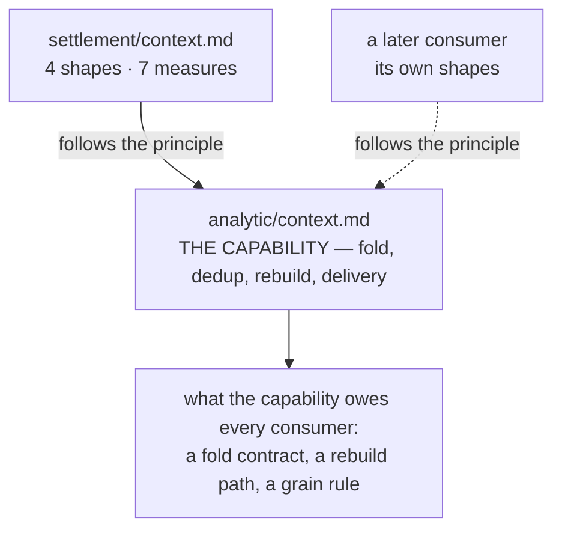
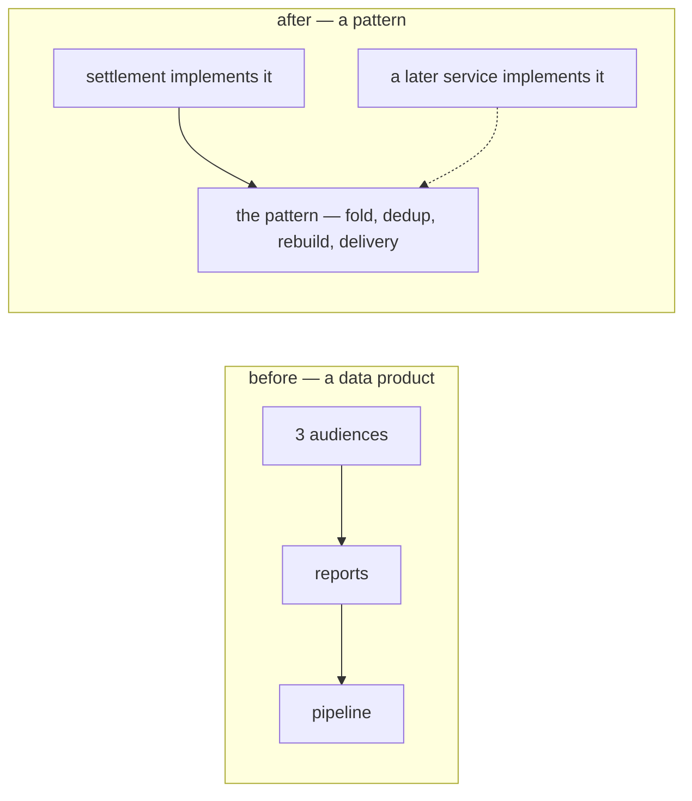
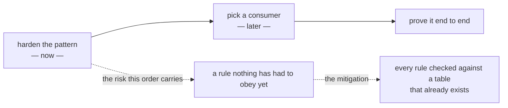

# Decisions — `analytic/context.md`

What the owner decided about [context.md](./context.md), with the reasoning that produced it.
**Append-only** — a decision is added here before it is acted on, and it is never edited away.
The open set lives in [context_clarify.md](./context_clarify.md).

---

## reports-belong-to-the-consumer

**Decided 2026-09-01, in the doc itself.** `## General.` gained:

> *"This is principle design, so question about what report that we have, or further case is depend on
> implementation. our focus is designed streaming processing that can be used other service or
> analytical service"*

**What it decides:** `analytic/context.md` specifies a **reusable streaming capability**, not a set of
reports. *Which* numbers exist, and for whom, is settled by each **consuming service** in its own doc —
not here.

### the reasoning

It answers what was this file's #1 open question for two rounds (*"which numbers, for whom?"*) by
**relocating it rather than answering it**, and the relocation is sound: a capability that had to name
its reports before it could be designed would have to be redesigned for the second consumer. Settlement
proved the shape the same day — [settlement/context.md](../settlement/context.md) `# Settlement Reports.`
names four shapes and seven measures **in settlement's own doc**, and points here only for the principle.

### what it settles, and what it does NOT

| | |
| --- | --- |
| ✅ **settles** | this doc is not required to list reports · a consumer's reports are that consumer's business · [C1](./context_clarify.md#critique) is closed |
| ⛔ **does not settle** | the capability still owes every consumer a **fold contract**, a **rebuild path** and a **grain rule** — and those are unanswerable without at least one consumer actually built on it |
| ⚠ **and it re-opens a filing question** | by the owner's own words this is a *principle design* — machinery, not a business need. It sits in `docs/business/`, where HARD RULE 7 says the **business** requirement lives. Settlement's reports are the business requirement; this is how it gets built → `docs/technical/` ([C2](./context_clarify.md#critique)) |

⚠ **The same edit contradicts itself two paragraphs later.** `## Streaming Processing` now names **three
specific report tables** — team, shop, supplier — which is exactly the *"what report that we have"* the
sentence above disclaims. See
[the-doc-disclaims-reports-and-then-names-three](./context_clarify.md#the-doc-disclaims-reports-and-then-names-three).

---

## analytic-is-a-pattern-not-a-data-product

**Decided 2026-09-01, in the doc itself.** `## Responsbility` was replaced outright:

| was | is |
| --- | --- |
| *"Provide Analitical Data to: Warehouse Team · Selling Team · Admin Team"* | **"Provide Analytical Design Pattern"** |

**What it decides:** this doc has **no audience and no data product**. It supplies a *pattern* that other
services implement. It is the follow-through on
[reports-belong-to-the-consumer](#reports-belong-to-the-consumer) — that entry relocated the reports, this
one removes the readership too.

### the reasoning

The two are one position taken in two steps, and the second is the honest one: a doc that named three
audiences while disclaiming their reports was claiming a readership it did not serve. A pattern has
**implementers**, not readers.

### what it settles, and what it now owes

| | |
| --- | --- |
| ✅ **settles** | no audience list is owed here · [C12](./context_clarify.md#critique) — *"Admin Team has no code path"* — is **moot in this doc** and re-routed to [settlement C5](../settlement/context_clarify.md#critique), where the same problem is live and answerable |
| ⛔ **now owes, and does not have** | a pattern's whole value is its **contract**: what an implementer must provide and what it gets back. `## Source Truth Log` and `## Report Table` were **deleted** rather than filled ([C17](./context_clarify.md#critique)) |
| ⚠ **and it settles the filing question** | *"design pattern"* is not a business need. By HARD RULE 7 this belongs in `docs/technical/analytic/`, with the business need staying where it already is — in each consumer's doc ([C2](./context_clarify.md#critique)) |

⚠ **The contradiction gets sharper, not smaller.** A doc whose stated responsibility is *a pattern* still
names three concrete business report tables — team, shop, supplier — in `## Streaming Processing`.
See [the-doc-disclaims-reports-and-then-names-three](./context_clarify.md#the-doc-disclaims-reports-and-then-names-three).

---

## the-pattern-comes-before-its-consumers

**Decided 2026-09-01, in chat.**

> *"we decide later what service follow this, for now make this principle robust first"*

**What it decides:** *which* service implements the pattern first is **deferred**. The pattern is
hardened on its own merits before a consumer is picked.

### the reasoning

It answers what was [Question 3](./context_clarify.md#question) — *"which consumer PROVES this
capability?"* — by refusing the premise, and the refusal has a real argument behind it: a pattern
designed **around** its first consumer becomes that consumer's pipeline with a general name on it. The
second implementer then finds it does not fit, and the pattern is rewritten rather than reused.

⚠ **The cost is stated plainly, because it is the thing to watch:** an unimplemented pattern is
**unfalsifiable**. Nothing forces a rule to be honest until code has to obey it. The mitigation is that
every rule must be **checkable against something that already exists** — which is why the contract below
is written against `settlement_logs`, `stock_movements` and `expense_records` rather than against an
imagined source.

### what this parks, and what it does NOT

| | |
| --- | --- |
| ⏸ **parked** | *which consumer goes first* · the settlement event and its publisher · when the analytic service gets built |
| ⛔ **NOT parked — it is now the whole job** | the contract itself: what a source must promise, what the fold must promise, what a report must promise ([C17](./context_clarify.md#critique) → [what-the-pattern-owes-an-implementer](./context_clarify.md#what-the-pattern-owes-an-implementer)) |
| ⛔ **also NOT parked** | the three named report tables still contradict the doc's stated responsibility, and a **pattern** is exactly the wrong place for them ([C15](./context_clarify.md#critique)) |
