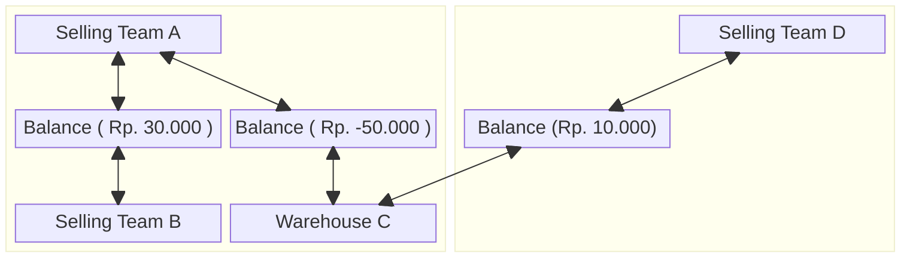

# Balance Context.

## Why This Exists In System ?.
1. because we need cover receivable & payable across the team.

## What Things That Affect The Team Balance.
1. Warehouse Order Fee.
2. Additional Cost that Warehouse Team spent to receive restock.
3. Cross/Shared Product.
4. Broken or Lost goods in warehouse.
5. Broken or Lost goods that found back.
6. Create / Accepting Payment other teams.

## General.
1. The balance is Team scope.
2. the balance is two mirrored row.

## Balance Policy.
For prevent unfair liability, we must have feature Debt Thresholds.
1. Debt Thresholds is manage by team owner and can overide by admin/root team.
2. when customer service finalizes order that contain cross products. its compared to the committed pair row only.