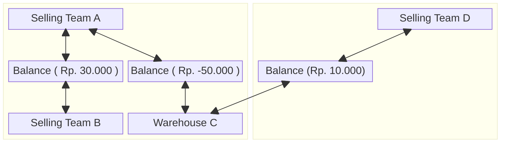
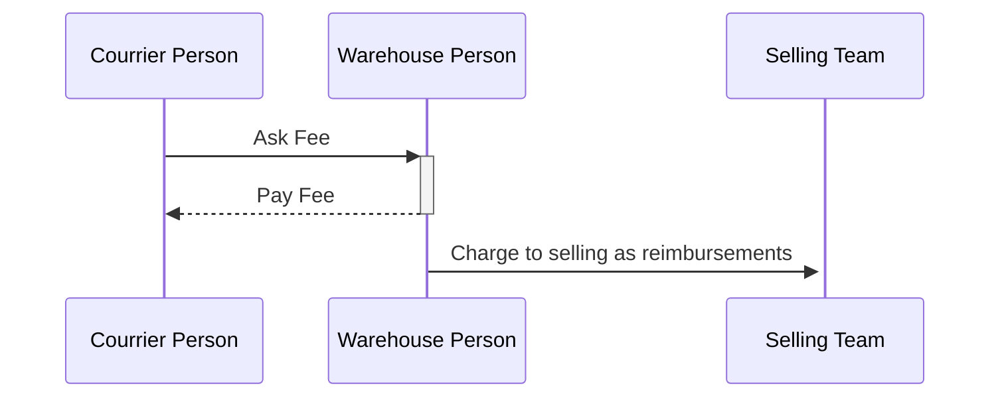

# Balance Context.

## Why This Exists In System ?.
1. because we need cover receivable & payable across the team.

## General.
1. The balance is Team scope.
2. the balance is two mirrored row.
3. The balance Grain is per pair team.
4. There is no overdue rule, only threshold.

## Whats Balance Resposbility and Whats Not.
### Responsbility.
1. Manage Balance.
2. Serve Balance Daily Report.
3. Manage Payments Accross Team.

## Payment Flow.

## What Things That Affect The Team Balance.
1. Warehouse Order Fee.
2. Additional Cost that Warehouse Team spent to receive restock.
3. Cross/Shared Product.
4. Broken or Lost goods in warehouse.
5. Broken or Lost goods that found back.
6. Create / Accepting Payment other teams.

## What Warehouse Can Receivable
1. `order_fee`, its charge when order created. and it can be canceled in order canceled.
2. `cod_fee`, its optionally set warehouse when accept restock/return.
3. `found`, a lost goods found back later.

### Why `cod_fee` Exists.
its bit confusing about `cod_fee` and `shipping_fee`. And why the both exists not one `shipping_fee`. in reality, we already charge `shipping_fee` when restock/return goods created. But sometimes when its arrived in warehouse, shipping channel person who brought the goods ask accidental fee (`cod_fee`) to the warehouse for the cost like coffe tip or other.

## What Warehouse Can Payable
1. `broken_good`, when good broken
2. `lost_good`, when good lost

## Balance Policy.
For prevent unfair liability, we must have feature Debt Thresholds.
1. Debt Thresholds is manage by team owner and can overide by admin/root team.
2. when customer service finalizes order that contain cross products. its compared to the committed pair row only.

## About Thresholds.
1. there is warning on the balance screen and daily report if thresholds 80% reached.
2. thresholds default is unlimited. and team owner, team admin, or root edited it.

