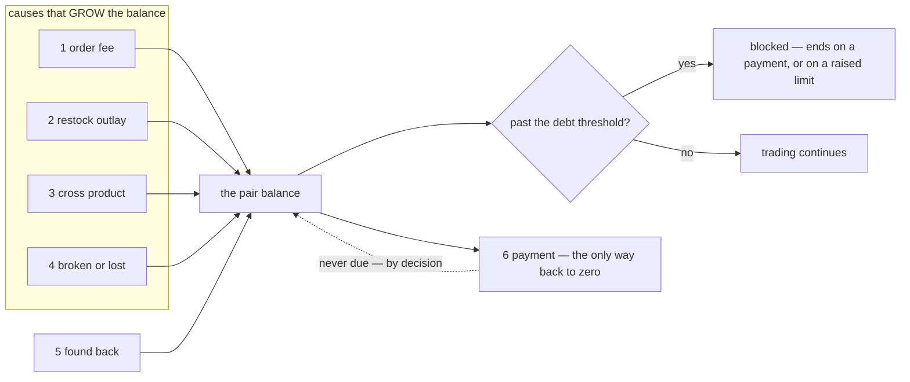
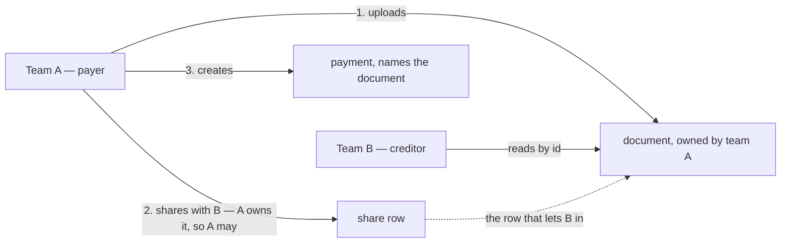
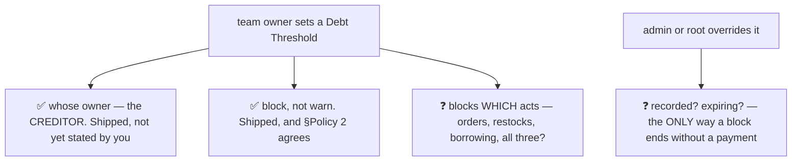
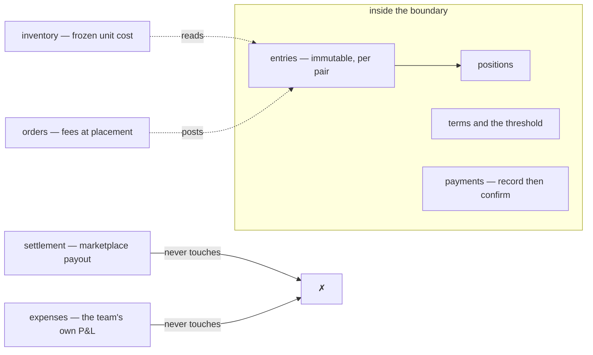
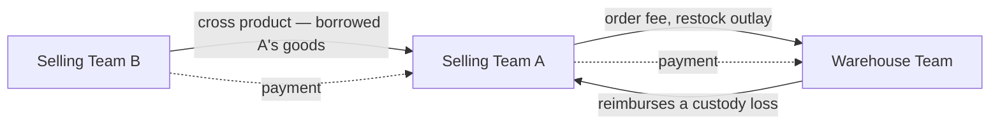
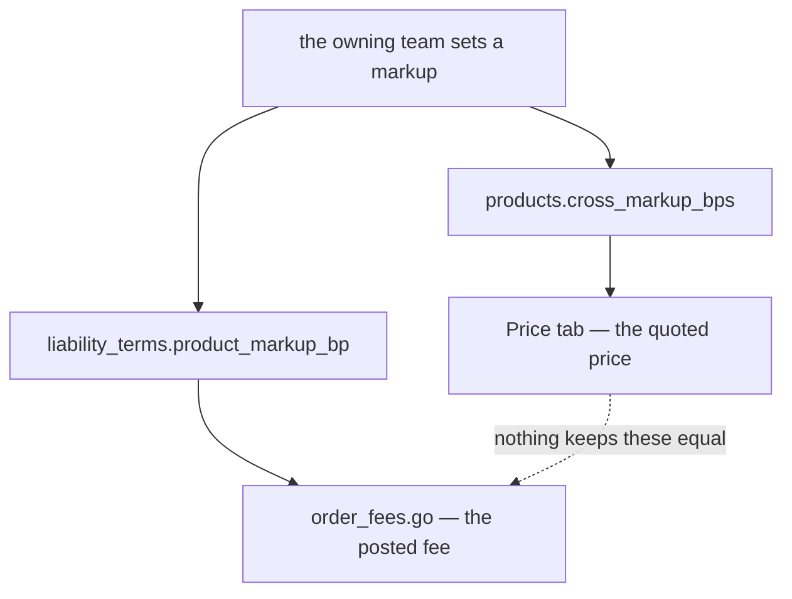
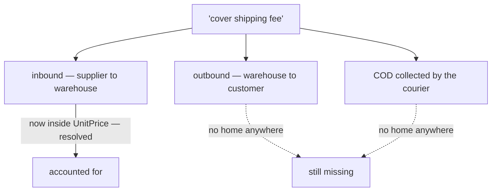

# Clarity — `balance_context.md`

The balance rules I read out of [balance_context.md](./context.md), and
the **business** decisions still missing from them. **That doc is yours — this one is mine.** Answered
points are **deleted**, so this file is always the current open set.

> **Re-examined after `order_context.md` adopted double entry.** ✅ **Closed and deleted:** *which way does
> cause 3 move the balance* — that doc now says **payable** on the ordering team's books and **receivable**
> on the owner's, which names both parties in standard terms with no pronoun to misparse. The direction is
> the one this list already assumed, so nothing here changes except that it is now stated somewhere.
> **Narrowed:** the naming point, which is down from five words to two.

> **Scope split, so nothing is asked twice.** The *design* of this ledger — grain, tables, mirror
> invariant, idempotency, lock order, reversal mechanics — is argued in
> [`technical/balance/team_balance_design_clarify.md`](../../technical/balance/team_balance_design_clarify.md).
> **This file holds only what the BUSINESS must decide.**

> **Re-examined again.** The only change to `balance_context.md` this round was a spelling fix in
> §Balance Policy, so nothing below is closed by it. One word did get a definition elsewhere:
> *"team owner"* is now a real role
> *([user_context](../user/context_clarify.md#warehouse-roles-are-owner-admin-packer))*, so
> [Critique 4](#critique) narrows to **whose** owner — the creditor's or the debtor's — and drops the
> "what is a team owner" half.

> # ⚠ Re-examined against `liability_service`, which has SHIPPED
>
> **The ledger these rules govern is built.** `liability_entries`, `liability_balances`,
> `liability_payments`, `liability_terms` — and **all six causes post today**. That does not close a
> single question below, because none of them was a design question. It changes something else: **two of
> them have been answered in code while still open with you.**
>
> | your open question | what the code has decided, in the absence of an answer |
> | --- | --- |
> | ~~*when must a balance be settled*~~ | **never** — and you have since said the same thing in §General 4, so the code and the doc now agree. ✅ Closed as [no-overdue-only-the-threshold](./context_decision.md#no-overdue-only-the-threshold). `liability_balances.oldest_unsettled_at` survives as ageing that triggers nothing |
> | [Q1](#question) *is the override recorded, and does it expire* | **no, and no.** ROOT/ADMIN may write `liability_terms`, so the override works — but it writes the same columns the creditor writes, so nothing distinguishes an override from the creditor changing its own mind |
>
> ✅ **Three of your own §Balance Policy lines are satisfied as written**: the threshold is set by the
> **creditor** (`liability_terms.team_id` is the creditor), it **blocks** rather than warns, and §Policy 2's
> *"compared to the committed pair row only"* is exactly the shipped rule — `debt < limit` on **current**
> debt, so an order is never refused mid-flight for an amount the person cannot see.
>
> ⚠ **Nothing gates a PAYMENT**, which [Critique 4](#critique) said must never be blocked — correct today,
> and by absence rather than by rule. Worth stating so it survives the next change.
>
> ⚠ **[Critique 8](#critique) is not satisfied and cannot be retro-fitted.** *"Every movement names its
> actor"* — `liability_entries` **has no actor column at all**. Only payments record who acted. Every
> entry posted between now and the migration that adds it is permanently unattributable, which is the
> cost of the delay. Design detail is [technical C9](../../technical/balance/team_balance_design_clarify.md#critique).

> # ⚠ Re-examined after §General 3–4 and the new §Responsibility heading
>
> **Two questions are closed by the doc itself**, both recorded in
> [context_decision.md](./context_decision.md):
>
> | the edit | what it settles |
> | --- | --- |
> | §General 4 — *"There is no overdue rule, only threshold."* | [no-overdue-only-the-threshold](./context_decision.md#no-overdue-only-the-threshold). **Q1 is closed and deleted below** — against this file's recommendation of a weekly statement |
> | §General 3 — *"The balance Grain is per pair team."* | [the-grain-is-the-team-pair](./context_decision.md#the-grain-is-the-team-pair). States what §General 2's mirrored rows already implied, and what shipped |
>
> ⚠ **The decision does not remove the problem Q1 named — it moves it onto the override.** With no
> cycle there is no date on which a block lifts by itself, so a blocked team has exactly two ways
> back: **pay**, or **have its limit raised**. [Q1 below](#question) is therefore no longer a
> governance nicety — it is the only mechanism by which a block ends, which is why it is now first.
>
> **Two new questions arrive with the decision**, both consequences rather than second-guesses:
> nothing now closes a **dispute** ([Critique 10](#critique)), and a creditor has no **instrument**
> to chase with ([Critique 11](#critique)).
>
> **§Whats Balance Resposbility and Whats Not is EMPTY** — which under RULE 8b.11 means *not designed
> yet*, not an open question. A proposal for it is [below](#the-boundary).

> # ⚠ Re-examined after §Responsbility, §Warehouse Receivable and §Warehouse Payable
>
> **Three new sections, and they are the first statement of who owes what BY PARTY** rather than by
> cause. Four more decisions in [context_decision.md](./context_decision.md), and **all four ratify
> shipped behaviour** — the first time that has happened in this file:
> [balance-manages-reports-and-takes-payments](./context_decision.md#balance-manages-reports-and-takes-payments) ·
> [the-order-fee-posts-at-creation-and-reverses-on-cancel](./context_decision.md#the-order-fee-posts-at-creation-and-reverses-on-cancel) ·
> [the-warehouse-receivable-is-order-fee-cod-fee-and-found](./context_decision.md#the-warehouse-receivable-is-order-fee-cod-fee-and-found) ·
> [the-warehouse-payable-is-broken-and-lost](./context_decision.md#the-warehouse-payable-is-broken-and-lost).
>
> ✅ **The contradiction this raised is already RESOLVED.** For one revision §Warehouse Receivable held
> `order_fee` alone, which read as deleting cause 2 and cause 5. Adding `cod_fee` and `found` settles
> it: the lists were **incomplete, not restrictive**. Kept as a record at
> [Contradiction](#-the-causes-list-was-written-three-times-and-briefly-disagreed--resolved), because
> the lesson stands — a cause list restated per audience goes stale per audience, and this one went
> stale inside a single edit.
>
> ⚠ **What survives is a VOCABULARY gap, not a contradiction** ([Critique 13](#critique)): you have
> named five movements and the ledger has one source type and a boolean for three of them. `found`,
> `broken_good` and `lost_good` are all `STOCK_DAMAGE`. And `cod_fee` sides with
> `LIABILITY_SOURCE_TYPE_COD_FEE` — the name the ledger **abandoned** and the daily statement still
> reads. ✅ Since **decided** — [the-ledger-speaks-the-business-words](./context_decision.md#the-ledger-speaks-the-business-words) — and since 2026-08-29 **no longer blocked**: the codegen plugins are local and pinned, so the migration is ordinary build work.
>
> ⚠ **`cod_fee` says *"restock/return"* and the return half does not exist** ([Critique 14](#critique)).
> `StockReturn` is a pick-undo with no cost line and no posting. Asked as [Q4](#question).
>
> ✅ **§Responsbility answers half of the boundary** — *manage the balance, serve the daily report*. The
> **"Whats Not" half is still empty**, so [The boundary](#the-boundary) below keeps only that half as a
> proposal.

> # ⚠ Re-examined after §Why `cod_fee` Exists
>
> **One paragraph, and it changes what the fee IS** — not the agreed freight, but *"shipping channel
> person who brought the goods ask accidental fee … like coffe tip or other"*. Recorded as
> [cod-fee-is-the-couriers-incidental-ask](./context_decision.md#cod-fee-is-the-couriers-incidental-ask).
>
> ⚠ **It REVERSES a recommendation this file was making.** [Q2](#question) said *drop
> `RESTOCK_COST_KIND_OTHER`*, on the argument that an open amount typed by the payee is unauditable.
> Your paragraph says the openness **is the point** — the ask is accidental and nobody can enumerate
> it in advance. So the fix is not to close the list but to notice that `COD_SHIPPING` and `OTHER` are
> **one thing described twice**.
>
> ⛔ **NEW CONTRADICTION, and it belongs to another doc.** `product_context.md` §Unit Price Components
> puts *AdditionalWarehouseFee* — the same money — **inside `UnitPrice`**, frozen forever. A
> discretionary tip is now setting every future COGS and every breakage reimbursement on that batch.
> Recorded where the fix lives:
> [product_context clarify → AdditionalWarehouseFee is capitalised into UnitPrice](../product/context_clarify.md#contradiction),
> asked as [product Q6](../product/context_clarify.md#question).
>
> ⚠ **And the name now argues against itself** ([Q8](#question)). *Cash On Delivery* means paying for
> the **goods** at the door, which is exactly how the shipped code reads it. A tip is a different
> order of magnitude and a different risk.

> # ⚠ Re-examined after §About Thresholds
>
> **Two lines, and they close three of the five parts of [Q1](#question)** —
> [the-threshold-warns-at-eighty-percent](./context_decision.md#the-threshold-warns-at-eighty-percent) ·
> [the-threshold-defaults-to-unlimited](./context_decision.md#the-threshold-defaults-to-unlimited) ·
> [three-roles-edit-the-threshold](./context_decision.md#three-roles-edit-the-threshold).
>
> ✅ **The warn level is adopted as recommended** — 80%, on the balance screen and the daily report.
> That was the sharpest gap in the threshold design: with no cycle and no chase instrument, the
> **block itself** was the notification, and the first person to learn of a debt problem was customer
> service, mid-order, with a customer waiting.
>
> ⛔ **The separate override object is ANSWERED "no".** *"team owner, team admin, or root **edited
> it**"* is one verb on one value — so root's change and the creditor's change are the same act. My
> proposal for a `credit_override` row with an actor, a reason and an expiry does not survive that
> reading. [Q1](#question) narrows to whether the *absence of a record* is deliberate.
>
> ⚠ **NEW, and it may be a slip of wording rather than a decision** ([Critique 15](#critique)):
> `ROLE_WAREHOUSE_OWNER` and `ROLE_WAREHOUSE_ADMIN` are **distinct roles** from `TEAM_OWNER` /
> `TEAM_ADMIN`, and the creditor is normally the **warehouse**. Read literally, the party carrying the
> credit risk cannot set the limit protecting it. New [Q3](#question).
>
> ⚠ **Neither warning surface can render this yet.** The daily report exists; the terms screen does
> not — `liabilityTermsClient` has **zero callers**, so nothing in the app can show a limit, let alone
> 80% of one.

> # ⚠ Re-examined after the scoping answer
>
> **The owner, in chat** — *"team owner and team admin in team scoped, for root its globally."*
> Recorded as
> [terms-are-team-scoped-root-is-global](./context_decision.md#terms-are-team-scoped-root-is-global).
>
> ✅ **It ratifies the shipped mechanism exactly** — `team_id` carries `use_scope`, and ROOT/ADMIN in
> the root team hold a global bypass.
>
> ⛔ **And it makes the override object unnecessary rather than merely unwanted.** Scope means every
> non-root write is **self-directed**, so an override has a structural definition already:
> **a write to a creditor's row by somebody who is not in that team.** Nothing else can produce one.
> [Q1](#question) therefore collapses from *"design an override object"* to **one column** — store
> `actor_id`, and every override becomes identifiable without a new concept.
>
> ⚠ **Q3 survives, narrowed to an enum question.** *Which roles count as "a team's own people"* — a
> warehouse is a team, but its people hold `ROLE_WAREHOUSE_*`, not `ROLE_TEAM_OWNER`.

> # ✅ THE THRESHOLD IS FULLY DECIDED — three answers, and the file's oldest question set closes
>
> The owner answered all three remaining parts in chat. Recorded as
> [warehouse-roles-count-as-their-own-team](./context_decision.md#warehouse-roles-count-as-their-own-team) ·
> [a-limit-change-is-recorded](./context_decision.md#a-limit-change-is-recorded) ·
> [the-block-stops-orders-only](./context_decision.md#the-block-stops-orders-only).
>
> | was open | answered |
> | --- | --- |
> | do warehouse roles count as a team's own? | **yes**, and the two families stay **separate roles** because warehouse and selling access differ |
> | is a limit change recorded? | **yes** — `actor_id` always, `reason` when the actor is outside the creditor team, plus a change log |
> | what does a block stop? | **orders only** |
>
> ⛔ **Q1 and Q3 are deleted.** The threshold — asked since this file's first pass, and #3 in
> [biggest_question.md](../../biggest_question.md) — is settled end to end: warn level, default, write
> set, reach, audit, and blast radius.
>
> ✅ **All three ratify the shipped code**, so [Critique 15](#critique) is **withdrawn**: the doc's
> shorthand and the proto's six-role list were saying the same thing.
>
> ⚠ **What it leaves behind is BUILD work, not design work** — and none of it exists:
>
> | | |
> | --- | --- |
> | the terms screen | `liabilityTermsClient` has **zero callers**. Nothing can show a limit |
> | the 80% warning | needs that screen, and a place on the daily report |
> | `actor_id` + `reason` + a change log | a migration on `liability_terms`. ⚠ the logged limit must be **nullable** |
>
> ⚠ **`liability_entries` still has no actor.** This settles the *terms*, not the ledger — *"who
> posted this charge"* stays unanswerable and unbackfillable
> ([technical C9](../../technical/balance/team_balance_design_clarify.md#critique)).

> # ⚠ Re-examined after §Payment Flow — it RATIFIES the design and breaks two things
>
> Two diagrams, and they make payments the most fully specified thing in this doc. ✅ **They match
> the shipped two-phase design almost exactly** — the debtor creates, the creditor checks, a claim
> posts nothing — and they answer
> [technical Q5](../../technical/balance/team_balance_design_clarify.md#question): **the creditor MAY
> reject.** Recorded as
> [the-debtor-claims-the-creditor-decides](./context_decision.md#the-debtor-claims-the-creditor-decides).
>
> | §Payment Flow says | shipped |
> | --- | --- |
> | Team A sees **-100.000** and creates the payment | ✅ `LiabilityPaymentRecordRequest.team_id` is the PAYER **and** the scope — you may only record your own |
> | brings **Proof of bank transfer** — image/doc/screenshot | ❌ **nowhere to put it.** A payment carries a 500-char `note` and nothing else |
> | Team B checks manually | ⛔ **impossible today** — [Critique 18](#critique) |
> | Team B **accepts** | ✅ `LiabilityPaymentConfirm`, creditor-scoped |
> | Team B **rejects** | ❌ not built — `RECORDED · CONFIRMED · REVERSED`, no `REJECTED` |
> | `accept` is **terminal** | ⚠ **contradicts the shipped `REVERSED`** — [Critique 19](#critique) |
>
> ⚠ **It also inverts what I told you last round.** I called *"`PaymentReverse` has no screen"* a
> **defect**. Your lifecycle says a confirmed payment is finished, which makes that RPC an
> **unasked-for feature** rather than a missing screen. I still think the reverse should live, and I
> argue it in [Critique 19](#critique) — but it is your rule.
>
> ✅ **It settles a reading of cause 6.** *"Create / Accepting Payment"* in §What Things That Affect
> The Team Balance could be read as *creating* a payment moving the balance. The lifecycle says it
> does not — `pending` is a claim, acceptance is the posting. **→ Recommend** the cause read
> *"Accepting a payment from another team"*, since create moves nothing.
> # ⚠ Re-examined after §Responsbility grew a THIRD line
>
> *"3. Manage Payments Accross Team."* — one line, and it renames a decision.
> [balance-manages-and-reports](./context_decision.md#balance-manages-and-reports) said **exactly two
> jobs**, so its verdict is now wrong as written and it is renamed
> [balance-manages-reports-and-takes-payments](./context_decision.md#balance-manages-reports-and-takes-payments) (RULE 12,
> references grepped).
>
> ✅ **It ratifies shipped code** — `liability_payments`, Record / Confirm / Reverse / List and the
> `awaiting_confirmation` count all exist. Payments were **built and never named**, which is exactly
> why the two holes in them read as niceties until now.
>
> ⛔ **Two open items are promoted from nicety to DEFECT**, because a gap in a stated responsibility
> is a different thing from a gap in something nobody claimed:
>
> | | |
> | --- | --- |
> | **no `rejected` state** | a creditor facing a payment that never arrived can only leave it at `recorded` forever, or **confirm then reverse** — two real ledger movements for money that never moved. [technical Q5](../../technical/balance/team_balance_design_clarify.md#question) |
> | **`PaymentReverse` has no screen** | the RPC ships and nothing calls it, so a confirmation made in error cannot be undone by anyone. [technical C14](../../technical/balance/team_balance_design_clarify.md#critique) |
>
> ⚠ **And it sharpens [Critique 11](#critique) rather than answering it.** With payments a stated
> job, the absence of any way to *ask* for one stands out: a creditor's only lever is still lowering
> the limit, which stops the debtor trading rather than requesting money. Managing payments without
> a way to request one is managing only the half that the debtor starts.
>
> ```mermaid
> flowchart LR
>   R1["1. Manage Balance"] --> A["the ledger — entries and positions"]
>   R2["2. Serve Daily Report"] --> B["LiabilityDaily — warehouse only today"]
>   R3["3. Manage Payments"] --> C["record, then confirm"]
>   C --> D["the ONLY act that lets a balance go down"]
>   C -.->|"missing"| E["reject a payment that never arrived"]
>   C -.->|"missing"| G["a screen to reverse a mistaken confirm"]
>   C -.->|"missing"| H["any way to ASK for a payment"]
> ```
>
> ✅ **And the words "Accross Team" are evidence for the boundary.** [Q7](#question) asks whether
> supplier and courier payables belong here. A responsibility scoped to payments **across teams** is
> the teams-only rule stated from the other side — an outsider has no account to confirm from, and
> now no line in §Responsbility claiming them either. It does not close Q7 (where they DO live is
> still nowhere), but it strengthens the half I recommended: not in this ledger.
>
> ⚠ **What it does NOT make balance is a WALLET.** Managing payments is managing the claim and the
> acknowledgement — no cash, no bank, no float. The pair figure stays an obligation, and the
> boundary proposal below is unchanged by this line.

> # ⚠ Re-examined after `settlement_service` LANDED and `revenue_service` was REMOVED
>
> Commit `0d4cbc4` changed three things about this context at once and **touched
> `balance_context.md` only to add the sections already answered above** — so nothing below is closed
> by it, and two things are newly open.
>
> | what changed in the code | what it does to this doc |
> | --- | --- |
> | `settlement_service` shipped — an **order-grain** signed ledger with its own running `balance` | the word *balance* now names two different things in one system |
> | `revenue_service` was **removed** | §Responsbility 2 — *"Serve Balance Daily Report"* — is now **warehouse-only**. The page refuses a selling team |
> | the old `settlement_service` was **renamed** `liability_service` | the code word for this context is `liability`, the business word is `balance`, and *settlement* now means something else entirely |
>
> ✅ **The boundary between the two ledgers is stated, and it is right.**
> `settlement_context.md` §Responsbility — *"for owe and balance across teams, its `liability_service`"*.
> Two ledgers, one of them explicitly not doing the other's job. Recorded so it is not re-argued.
>
> ⚠ **Your §Responsbility 2 is half-served, and the missing half moved into another service.**
> `StatementMode` is `"warehouse"` and nothing else — a selling team is **refused** rather than shown a
> subtraction with no income in it. The money that would fill that half — `initial_total`, `fund`,
> `external_ads_fee`, `affiliate_fee`, `marketplace_adjustment` — is in `settlement_service`, and
> nothing reads it for this report. New [Critique 16](#critique), new [Q8](#question).
>
> ```mermaid
> flowchart LR
>   W["warehouse team"] --> R["the daily statement"]
>   SE["selling team"] -.->|"refused since revenue_service was removed"| R
>   R --> I["income = handling fees, and nothing else"]
>   ST["settlement — fund, adjustments, platform fees"] -.->|"nothing reads it here"| R
> ```
>
> ⚠ **No ledger can answer *"what did ONE order make"*.** The marketplace money is settlement's, at
> order grain. The `order_fee` that same order cost is here, at **pair** grain. The link exists in the
> data — `liability_entries.source_id` **is** the `order_id` — but not in the contract:
> `LiabilityEntryListFilter` carries `counterparty_id` **only**. New [Critique 17](#critique), new
> [Q9](#question).
>
> ```mermaid
> flowchart TB
>   O["one order"] --> S["settlement_service — ORDER grain"]
>   O --> L["balance / liability — PAIR grain"]
>   S --> S1["initial_total, fund, ads fee, adjustment"]
>   L --> L1["order_fee, cross charge — source_id IS the order id"]
>   S1 --> Q{"what did THIS order make?"}
>   L1 --> Q
>   Q --> N["unanswerable — no filter reaches the fee by order"]
> ```

Siblings: [business_level](../business_level_clarify.md) · [user_context](../user/context_clarify.md) ·
[product_context](../product/context_clarify.md) · [order_context](../order/context_clarify.md) ·
[stock_context](../stock/context_clarify.md).

---

## Proposed Design

### The rules, named

#### balance-is-between-two-teams
The balance is **team scope** and is held **between a pair** — the diagram shows Selling A owing
Warehouse C `Rp. -50.000` while Selling B owes Selling A `Rp. 30.000`. So a team has as many balances as
it has counterparties, not one number. *(§General 1–2 and the diagram)*

#### balance-is-two-mirrored-rows
Every balance exists **twice**, once from each side, and the two are mirrors. *(§General 2)*

#### balance-covers-receivable-and-payable
*"we need cover receivable & payable across the team"* — both directions are one ledger with a sign, not
two systems. *(§Why This Exists)*

#### selling-teams-owe-each-other-too
The diagram puts a balance between **Selling A and Selling B**, not only between selling and warehouse.
Cross/shared goods create a debt between two *selling* teams. *(§General diagram)*

#### debt-threshold-limits-liability
*"For prevent unfair liability, we must have feature Debt Thresholds"* — managed by the **team owner**,
**overridable by admin/root**. So the ledger is not only a record: a balance can reach a limit.
*(§Balance Policy)*

### The six causes, and which direction each pushes

| # | Cause *(§What Things That Affect The Team Balance)* | Who owes whom | What kind of money |
| --- | --- | --- | --- |
| 1 | Warehouse Order Fee | selling → warehouse | the warehouse **earns** it |
| 2 | Additional cost the warehouse spent to receive a restock — ✅ named `cod_fee`, and **optional** | stock owner → warehouse | the warehouse **fronted** it |
| 3 | Cross / Shared Product — ⚠ **two names left**: this list's, and the order diagram's `Loan` — the order prose now says **payable** / **receivable** | borrowing team → owning team | the owner **earns** it — or **lends** it, [Critique 9](#critique) |
| 4 | Broken or lost goods in warehouse — ✅ now named as **two**, `broken_good` and `lost_good` | **warehouse → owning team** | a **reimbursement** |
| 5 | Broken or lost goods **found back** — ✅ named `found` | owning team → warehouse | a **reversal** of 4 |
| 6 | Create / Accepting Payment | debtor → creditor | it **discharges** the rest |

⚠ **Only cause 6 pushes toward zero, and it is never due.**
[no-overdue-only-the-threshold](./context_decision.md#no-overdue-only-the-threshold) settles that a
debtor pays when it chooses. So the ledger has five inflows, one outflow, and **nothing that obliges
the outflow to happen** — which is deliberate, and which is why the threshold now carries the whole
job of limiting exposure.

⚠ **One order is not one entry.** [an-order-mixes-own-and-borrowed-lines](../order/context_clarify.md#an-order-mixes-own-and-borrowed-lines)
means a single order posts cause **1** once to the fulfilling warehouse and cause **3** once **per owning
team it borrowed from** — so an order can move three or four pair-balances at once, some of which are
inside their [threshold](#debt-threshold-limits-liability) and some not. Whether that refuses the order or
only the line is asked in [order_context](../order/context_clarify.md#question).



### A payment's proof, and who may see it

🆕 Proposed against §Payment Flow. The rule is one sentence and the whole difficulty is in it:
**the person who must look at the proof is not the person who owns it.**

| | |
| --- | --- |
| what a proof IS | one or more uploaded files — a transfer screenshot, a bank PDF — attached to the payment, never to the ledger |
| who uploads | the **payer**, at create. The file belongs to the payer's team |
| who may READ | the payer's team **and the creditor's team**, and nobody else. Not the whole system, not a sibling selling team |
| how the creditor gets in | the payer **grants a share** on the file, as themselves, before creating the payment. No service asks another service for permission |
| after a decision | the proof is **kept**, accepted or rejected. It is the evidence for a decision somebody may be asked about later |
| ⚠ therefore | a shared file **cannot be hard-deleted**, and a share is **permanent**. The creditor acted on it and must be able to show what they saw |



⚠ **`document_service`'s scope is right and must not widen** — it answers NotFound for another
team's file on purpose. What it gains is one clause: *owner **or** shared-with*. It still never
learns what a payment is, and it keeps its invariant — **no read without a row saying you may**.
Plumbing in [technical Critique 19](../../technical/balance/team_balance_design_clarify.md#critique).

### The threshold — now the ONLY control, and what it still does not say

[no-overdue-only-the-threshold](./context_decision.md#no-overdue-only-the-threshold) removed the
alternative, so everything below is load-bearing rather than tidy-up.



**→ Recommend** it blocks the acts that *add* to the debt (new orders, new restock requests, new
cross-borrowing) and never the acts that *reduce* it, and an override is **recorded with an actor and
a reason** and is **temporary**. A permanent silent override is the same as not having the feature —
and with no cycle behind it, an override is now the difference between a blocked team trading again
today and not trading at all.

### The boundary

✅ **You have written the Responsibility half** — *manage the balance, serve the daily report*. Read
against the code, those two cover: the entries and positions, the payments, the terms and the credit
answer, and `LiabilityDaily`. Nothing shipped falls outside them.

**The "Whats Not" half is still empty.** This is what I would put in it — the test being *"if this
went wrong, would you look at the balance screen to find out why?"*

| ❌ not balance's job | whose it is |
| --- | --- |
| the **marketplace payout** on an order | `settlement_service` — [the-name-settlement-moves-to-the-payout](../settlement/context_decision.md#the-name-settlement-moves-to-the-payout) |
| a team's own **P&L** — payroll, rent, electricity | `expense_service` |
| **deciding** to refuse an order | the order flow. Balance answers *"is this team over its limit"* and never acts on it |
| **cash and bank** | nowhere yet. This is an obligation ledger — no money moves inside it |
| the goods' **unit cost / HPP** | `inventory_service` freezes it at receipt. Balance only reads it |
| the **stock movement itself** | `inventory_service`. Balance records the money consequence, never moves a unit |



**Two boundary lines I would state explicitly**, because both are currently true only by accident:

- **Counterparties are TEAMS ONLY.** A payment must be confirmable, and an outsider has no account to
  confirm from. That silently excludes **suppliers** and **couriers** — real creditors with no home
  anywhere in the system ([Critique 12](#critique)).
- **The ledger never refuses to record.** The threshold is a gate *in front of* an act, never a guard
  inside the posting. A ledger that declines to write reality is how books stop matching the world.

### The four teams as counterparties



---

## Critique

| | Problem | → Recommend |
| --- | --- | --- |
| **1** | **⚠ MOSTLY WITHDRAWN — the unboundedness is DELIBERATE.** This critique argued for a closed list of chargeable cost kinds. §Why `cod_fee` Exists answers it: the courier's ask is *accidental*, so no list can enumerate it, and `restock_cost_lines` already carries a typed `kind`, positive-only amounts, an `actor_id` and a required note. **What survives is smaller and different**: `COD_SHIPPING` and `OTHER` are one thing described twice ([Q2](#question)), and the fee's *accounting treatment* is disproportionate to its nature — a tip freezing into `UnitPrice` forever ([product Q6](../product/context_clarify.md#question)). `product_context.md` §Unit Price Components puts *AdditionalWarehouseFee* **inside the goods' unit price**. So one number typed by the warehouse both raises what another team owes **and** permanently changes the value of their stock, which is what a later reimbursement pays out on. | A **closed list of chargeable cost kinds**, decided by you, with anything outside it not chargeable — and each line frozen at accept. Keep the warehouse's **own service fee** on cause 1: cause 1 is what the warehouse *earns*, cause 2 is what it *fronted*, and merging them makes both the warehouse's margin and the goods' cost unreadable. |
| ~~**2**~~ | ⛔ **CLOSED — no acknowledgement** ([found-posts-without-a-handshake](./context_decision.md#found-posts-without-a-handshake)), against this recommendation. Kept one round because the asymmetry it names is now a **standing property of the design**, not a gap awaiting a fix: cause 4 is safe unilaterally because the warehouse types a debt against itself, and cause 5 is that entry running backwards in the warehouse's own favour, with nothing bounding it to the loss it repays ([technical Critique 10](../../technical/balance/team_balance_design_clarify.md#critique)). Original: **Cause 5 lets one team create a debt on another team's books with no acknowledgement.** Cause 6 got *"Create / Accepting"* — a handshake — because a payment is a claim. Cause 5 is the same shape: the warehouse says *"we found it"* weeks later and the owner owes money back on the warehouse's word alone. Cause 4 needs no handshake (the warehouse types a debt against itself), but 5 is its mirror — and it can now push a team **through** its threshold. | Give cause 5 the same two-phase shape as cause 6, or at minimum **notify the owner and let them dispute it**. |
| **3** | **Cause 4 is still written flat here, while the phase rule now lives in another doc.** [stock_context §Stock loss](../stock/context_clarify.md#the-rules-named) says in-custody losses and count shortfalls are the warehouse's and receiving losses are the selling team's — so whether cause 4 posts at all depends on a phase this list does not mention. And *return* receiving is not clearly on either side of that line. | Cause 4 should **link** to `stock_context.md` §Stock loss rather than restate it — the two lists have already drifted once in this requirement set ([Contradiction](#contradiction)). And the return-receiving case needs an explicit word, because it is a whole phase currently answered by inference. |
| **4** | **[debt-threshold-limits-liability](#debt-threshold-limits-liability) is now the ONLY control, and the override is now the only way a block ever ends by itself.** ⚠ **Sharpened by [no-overdue-only-the-threshold](./context_decision.md#no-overdue-only-the-threshold)**, not weakened by it. Block-or-warn and whose-owner are answered in shipped code (blocks · creditor) though not yet by you. What is genuinely open is narrower and heavier: **which acts stop**, and whether the admin/root override is **recorded** and **expires**. §Admin Team is *"manage all resource"*, so an unrecorded permanent override is the difference between a supervisor and a back door — and it is now the door every blocked team has to walk through. | **It blocks only debt-increasing acts · the override is recorded with an actor and a reason · the override is temporary.** And it must never block **cause 6** — a team that cannot pay because it owes too much is a deadlock, and with no cycle nothing else would ever break it. |
| **5** | **Operating costs are missing entirely, and `business_level.md` §covered 7 asks for them.** Electricity, ads and payroll are tracked somewhere. If any is ever recharged to a team, that is a seventh cause and it is not here. If none ever is, that is worth saying — two ledgers keyed by team that never touch is a much simpler world. | Say plainly: **does an operating cost ever move a team balance?** I would say **no for v1**. The same question is open downstream in [`cost_design_clarity.md`](../../technical/cost/design_clarify.md#question). |
| **6** | **Cause 3 does not say the charge equals the borrower's COGS** — `product_context.md` does, and only as a formula. Read alone, this doc allows a reader to think the cross charge is a fee *on top of* something the borrower already paid. | One line here: *"the cross charge IS the borrowing team's COGS — see [cross-line-cogs-adds-the-fee](../product/context_clarify.md#cross-line-cogs-adds-the-fee)"*. Link, do not restate — a restated formula is the next thing to drift. |
| **7** | **No currency, no precision, no statement that this is exact.** The diagram is in rupiah and the doc never says the balance is whole rupiah. It matters because cause 3 comes from a **percentage** and cause 4 from a **cost per unit** that is itself the result of a **division** ([product_context Critique 8](../product/context_clarify.md#critique)) — three chances to produce a fraction before it reaches here. | State: **whole rupiah, exact, no tolerance**, and the rounding happens *before* the entry, once. A balance two teams argue over — and that can now block one of them — cannot reconcile "within a rupiah or two". |
| **8** | **Nothing says what the balance is EVIDENCE of.** A team disputing a charge needs to see *which order*, *which restock*, *which loss*, *who recorded it*, and *the amount as frozen then*. That is the same promise as "transparency accounting" in [business_level](../business_level_clarify.md) §covered 3, and the threshold makes it acute: a charge nobody can explain can now stop a team working. | State it as a business requirement here: **every movement names its cause, its source record, its actor, and its frozen amount, and none of them is editable afterwards.** |
| **9** | **One movement still has more than one name, though `order_context.md` has just cleaned up its half.** That doc now uses **payable** and **receivable** — the standard mirror pair, so those are two legs of one thing rather than two names for it. What remains is this list's `Cross/Shared Product` and the order diagram's `loan["Loan"]` label. The word still matters: a *product charge* is priced once and done, while a *loan* invites accrual and repayment — possibly **in goods**, A restocking B with equivalent units rather than paying. | **Adopt the accounting pair here too**: cause 3 raises a **receivable** for the owning team and a **payable** for the ordering team, and the diagram's `Loan` label should follow. Then one vocabulary spans the two docs. And say whether repayment **in kind** is allowed — I recommend no: a goods repayment is a restock plus a payment, not a second instrument. |

| | Problem *(arising from [no-overdue-only-the-threshold](./context_decision.md#no-overdue-only-the-threshold))* | → Recommend |
| --- | --- | --- |
| **10** | **Nothing ever closes a DISPUTE now.** A cycle would have given each period a closing figure that both sides agree by a date. Without one, an entry from any month is as contestable as this morning's — and causes 4 and 5, broken-or-lost and found-back, are exactly the charges people argue about. A creditor's position is never final and a debtor may reopen a charge indefinitely. | ⚠ **A cycle is not the only way to close one.** Put the window on the **ENTRY**, not on a period: an entry is disputable for N days after it posts and is **agreed by silence** afterwards. No statement object, no due date, no overdue state — so it does not reopen your decision — and both sides still get a moment where the number becomes final. |
| **11** | **A creditor has no INSTRUMENT to chase with.** With nothing ever due, *"please pay"* has nothing behind it. The only lever the design leaves is **lowering the credit limit** — which does not ask for money, it stops the debtor trading. So the mildest form of chasing and the most aggressive act available are the same act. | A **request-for-payment that posts nothing**: a notice on the pair, visible to both sides, ageing on the debtor's screen. It moves no balance and refuses no act, so it stays inside the decision — and it means the first step of chasing is not a block. |
| **12** | **Counterparties are TEAMS ONLY, and supplier and courier debt therefore has no home.** It follows from cause 6 — a payment must be **confirmed by the creditor**, and an outsider has no account to confirm from. But a restock bought on supplier terms, and a courier invoiced monthly, are real payables. They are in neither this ledger nor `expense_service`, which records a cost once **paid** rather than an obligation while it is **outstanding**. Surfaced by your new §Responsibility heading. | Say plainly whether **external payables are in scope for v1**. → I recommend **no** — keep this ledger inter-team, where both sides can confirm — **but name where they do live**, because *"nowhere"* is today's answer and nobody decided it. |
| **13** | **You have now named five kinds of movement, and the ledger has one source type and a boolean for three of them.** ⚠ Not a contradiction — the doc agrees with itself. It is a **vocabulary** gap between your words and the ledger's: `order_fee` → `HANDLING_FEE` · `cod_fee` → `RESTOCK_OUTLAY` · **`found`, `broken_good` and `lost_good` all → `STOCK_DAMAGE`**, the first distinguished only by a `reversal` flag. So *"how much to breakage versus shrinkage"* is unanswerable, and every reference has to be translated by whoever is reading. ⚠ Meanwhile `LIABILITY_SOURCE_TYPE_COD_FEE` **exists and nothing posts it** — your `cod_fee` sides with the name the ledger abandoned. | **Rename to your words and split `STOCK_DAMAGE` into three.** The names are yours, they are better (`order_fee` says when, `handling_fee` does not), and the split has to happen before volume — an enum widened later leaves rows nobody can re-classify. ⚠ The rename also **fixes the daily statement for free**: it already reads `COD_FEE`. |
| **14** | **`cod_fee` says *"restock/return"* and the return half does not exist.** `PostRestockOutlay` is called from `RestockRequestFulfill` only. `StockReturn` is a pick-undo — it carries no cost line, no COD field, and posts nothing to this ledger. So a warehouse that pays a courier to bring a customer return back has no way to record it. | Say whether the return half is **v1 or later**. → I recommend **later, but named**: it is a real outlay and the mechanism is identical, but returns have several other open questions in front of them ([product Q1](../product/context_clarify.md#question)). What must not happen is it staying implicit — a doc that says *"restock/return"* while only restock works reads as done. |
| ~~**15**~~ | ⛔ **WITHDRAWN.** This read *"team owner, team admin, or root"* as excluding warehouse roles. The owner confirmed the opposite: [warehouse-roles-count-as-their-own-team](./context_decision.md#warehouse-roles-count-as-their-own-team) — a team’s own people are **the role family matching its team type**, and the shipped six-role policy is exactly right. Kept one round as a record: the doc’s shorthand and the proto’s enum said the same thing in different words. | No action. ✅ Code needs no change. |

| | Problem *(found by re-examining after `settlement_service` landed)* | → Recommend |
| --- | --- | --- |
| ~~**16**~~ | ⛔ **DEFERRED** ([the-daily-report-is-deferred](./context_decision.md#the-daily-report-is-deferred)) — not resolved. Kept one round because the gap it names is still real and now has no question in front of it: a selling team is refused by a page §Responsbility 2 promises them. Original: **§Responsbility 2 now serves ONE of the two team types.** `revenue_service` was removed with the settlement work and it held the selling team's income, so `StatementMode` is `"warehouse"` alone and the page **refuses** a non-warehouse team rather than show it a subtraction with no income term. ⚠ [balance-manages-reports-and-takes-payments](./context_decision.md#balance-manages-reports-and-takes-payments) reasoned that a warehouse's statement income *"exists nowhere else"* — still true, and it is now the only half that exists at all. | **Say whose report it is.** → I recommend **two screens: balance serves the WAREHOUSE statement, settlement serves the SELLING one.** They subtract different things — fees − expenses against payout − COGS − fees — and only the warehouse's is a pair-ledger read. Then §Responsbility 2 should say *warehouse* daily report, so the doc stops promising a selling team a screen this ledger cannot give it. |
| **17** | **Nothing can answer *"what did order 1 actually make"*.** Settlement holds that order's marketplace money at **order** grain, and the `order_fee` it also cost sits here at **pair** grain. The join exists in the data and not in the contract: [`order_fees.go:165`](../../../backend/services/liability_service/liability_v1/order_fees.go) writes `SourceID = orderID`, while `LiabilityEntryListFilter` accepts `counterparty_id` and nothing else. So the fee is recorded, attributable, and **unaskable**. | **One filter field, never a second copy of the fee.** → I recommend adding an `order_id` (`source_id`) filter to `LiabilityEntryListFilter` and assembling the order's P&L on the screen from settlement + the frozen COGS + the fee. Posting the fee into `settlement_entries` as well would make one movement two rows in two services with no shared transaction — [technical Critique 4](../../technical/balance/team_balance_design_clarify.md#critique) is that exact failure. |

---
| ~~**18**~~ | ✅ **ANSWERED — proof is REQUIRED** ([a-payment-must-carry-proof](./context_decision.md#a-payment-must-carry-proof)). Kept one round for the retraction inside it, which is the part worth remembering: the first recommendation had `liability_service` vouching and `document_service` signing, needing an internal non-team-scoped signing path — **the payer can grant the share themselves**, and one bug in a vouching service would have leaked every private file. Original: **The proof has nowhere to live — and the creditor could not read it if it did.** §Payment Flow makes *"bring image/doc/screenshot Proof of bank transfer"* part of creating a payment, and *"Team B check manually"* is the entire reason acceptance is a human act rather than a rule. Today a payment carries `note` — 500 characters of free text — and no document. ⛔ **The second half is verified, not suspected.** `document_service` exists and can hold the file, but [`get_download_url.go`](../../../backend/services/document_service/document_v1/get_download_url.go) filters `id = ? AND team_id = ?`, so a file uploaded by team A **reads as NotFound to team B**. The one person who must see the proof is the one person that ACL is written to exclude — so the flow's middle step cannot happen at all. | ⚠ **REVISED — my first recommendation was more expensive than the problem.** I proposed a `LiabilityPaymentProofUrl` that vouches for the creditor and asks `document_service` to sign, which needs an internal non-team-scoped signing path. **The payer can grant the share themselves**, in their own scope, before creating the payment — so no service ever asks another for permission and `document_service` keeps its invariant intact. Design in [§A payment's proof](#a-payments-proof-and-who-may-see-it), plumbing in [technical Critique 19](../../technical/balance/team_balance_design_clarify.md#critique). ⚠ And say whether proof is **required** ([Q10](#question)): a manual check with an optional attachment is a check with nothing to look at. |
| **19** | **🆕 `accept` is a TERMINAL state, and shipped code can leave it.** Your lifecycle is `pending → accept → [*]` — a confirmation is final. `LiabilityPaymentReverse` ships, takes a mandatory reason, and moves a confirmed payment to `REVERSED`. ⚠ **There are three positions here, not two**, and they differ only in what a correction does to the CLAIM: your diagram (accept is the end, no undo drawn) · my earlier proposal (the row stays `accepted`, a **compensating entry** fixes the ledger) · shipped (a compensating entry **and** the row flips to `REVERSED`). The middle one may be what you meant — a reversal is a later ledger act, not an un-accepting — but the shipped enum makes `REVERSED` a state of the payment, which yours does not have. ⚠ **I argued the other way last round**, and re-reading your diagram I think the asymmetry is the point: **reject posts nothing, accept posts money.** A wrong reject costs a re-submitted claim — two rows for one transfer, no harm done. A wrong accept has already lowered a real debt, and with no undo the only remedy is a hand-typed adjustment with no link to the payment that caused it: the exact untraceable correction two-phase confirmation exists to prevent. And a mis-confirm is likely — it is a tired person matching a screenshot against a bank app. | **Keep the correction, and say which of the three it is.** → I recommend the **middle**: the claim stays `accepted` forever, and a mis-confirm is fixed by a compensating entry that names the payment. It keeps your diagram literally true and still leaves a trail. → It is your rule, so it is [Q11](#question). ⚠ If you want accept final, the RPC and its status must be **removed**, not left unused — an unreachable write path in a ledger is one somebody eventually reaches. |
| ~~**20**~~ | ✅ **ANSWERED — the note is required, always** ([an-incidental-line-must-say-what-it-was-for](./context_decision.md#an-incidental-line-must-say-what-it-was-for)). ⚠ Worth keeping one round: the rule can now be expressed in the **proto** rather than in the handler, because it stopped being a rule about a PAIR of fields. Original: **Collapsing the two cost kinds removes the thing the note rule keys on.** [the-ledger-speaks-the-business-words](./context_decision.md#the-ledger-speaks-the-business-words) makes `COD_SHIPPING` and `OTHER` one `INCIDENTAL` kind — correctly, they describe the same money. But the note rule was a **pair rule**: optional for `COD_SHIPPING`, because the kind already said what the money was, and required for `OTHER`, because an untyped amount with no words beside it is a number the charged team cannot argue with. With one kind, every line is the `OTHER` case. ⚠ **This is why that half of the migration is NOT built** — the rest of the decision shipped, and this one step waits on a rule only you can set, because it adds a required field to what a warehouse person types at acceptance. | **Required, always** ([Q12](#question)). The kind has stopped carrying the meaning, so the note has to. ⚠ The alternative — optional always — is the one that quietly loses something: it makes every incidental charge a bare number, and §Why `cod_fee` Exists describes precisely the *accidental*, unenumerable ask that most needs a sentence beside it. |

## Question

> ⛔ **The old Q1 — *"when must a balance be settled"* — is GONE**, answered by §General 4 and recorded
> as [no-overdue-only-the-threshold](./context_decision.md#no-overdue-only-the-threshold). Q1 below is
> the old Q2, promoted because that decision made it the only way a block ever ends.

1. **Does an operating cost ever move a team balance?** ([Critique 5](#critique))
   **→ I recommend no for v1.**
> ⛔ **Q2 is DELETED — `found` posts with NO acknowledgement**, and it closed **against** this file's
> recommendation:
> [found-posts-without-a-handshake](./context_decision.md#found-posts-without-a-handshake). ✅ It
> ratifies shipped code — `found` is a `StockDamageKind` on a stock adjust, posted in that adjust's
> transaction, so there was never a place a handshake could go. ✅ **It unblocks the frontend**: an
> acknowledgement would have needed a fourth screen. ⚠ **It hands the whole weight to [Q5](#question)**
> — dispute is now the owning team's only recourse, and behind it there is nothing.
3. **Is repayment IN GOODS allowed** — may a borrowing team clear cause 3 by restocking the owner with
   equivalent units instead of paying? ([Critique 9](#critique))
   **→ I recommend no: a goods repayment is a restock plus a payment, not a second instrument.**
4. **🆕 Is the RETURN side of `cod_fee` v1?** ([Critique 14](#critique)) You wrote *"when accept
   restock/return"*, and only the restock half exists — `StockReturn` is a pick-undo with no cost line
   and no posting.
   **→ I recommend later, but explicitly named as later.** A doc saying *"restock/return"* while only
   restock works reads as done.
5. **🆕 Is an entry disputable forever?** ([Critique 10](#critique)) No cycle means no moment at which a
   charge becomes final, and causes 4 and 5 are the ones people argue about.
   ⛔ **PROMOTED — this is now the heaviest open question in the context.**
   [found-posts-without-a-handshake](./context_decision.md#found-posts-without-a-handshake) refused
   cause 5 an acknowledgement, so dispute is the owning team's **only** recourse against a charge
   asserted on their books in the asserter's favour — and today there is nothing behind it. ⚠ Sharper
   still because a `found` is not bound to the loss it repays
   ([technical Critique 10](../../technical/balance/team_balance_design_clarify.md#critique)), and
   because the resulting balance can push a team through its threshold and stop their orders.
   **→ I recommend a window on the ENTRY — disputable for N days, agreed by silence after** — which
   needs no statement, no due date and no overdue state.
6. **How does a creditor CHASE?** ([Critique 11](#critique)) Today the only lever is lowering the
   limit, which stops the debtor trading rather than asking it to pay.
   ⚠ **Narrowed by §Payment Flow, not answered.** The flow opens *"Team A see -100.000"* — the debtor
   notices on their own — so payment is **debtor-initiated by design**, and there is no step in which
   a creditor asks for one. What survives is the debtor who never looks.
   **→ I recommend a request-for-payment that posts nothing** — a notice, not a block.
7. **🆕 Are external payables — suppliers, couriers — in scope for this ledger?**
   ([Critique 12](#critique)) They cannot use cause 6, because an outsider cannot confirm a payment.
   **→ I recommend no for v1, but name where they DO live** — the current answer is "nowhere".
> ⛔ **Q8 is DEFERRED and leaves this file** —
> [the-daily-report-is-deferred](./context_decision.md#the-daily-report-is-deferred). Parked is not
> open, so it stops being counted here; the decision file holds it for when it comes back.
> ⚠ **What it leaves broken is deliberate**: §Responsbility 2 promises every team a daily report and
> the shipped page refuses all but warehouses.

9. **🆕 Should one ORDER's warehouse fee be readable beside its settlement?** ([Critique 17](#critique))
   The entry knows the `order_id`, the filter does not, so an order's true P&L exists in no screen.
   **→ I recommend one `order_id` filter on `LiabilityEntryListFilter`** — and explicitly **not** a
   copy of the fee in settlement's ledger.
> ⛔ **TWO QUESTIONS DELETED, both answered the way this file recommended.**
> [an-incidental-line-must-say-what-it-was-for](./context_decision.md#an-incidental-line-must-say-what-it-was-for)
> — every cost line requires a note, which unblocks the LAST step of the vocabulary migration.
> [a-payment-must-carry-proof](./context_decision.md#a-payment-must-carry-proof) — a payment with no
> attached document is refused.

11. **🆕 Is a confirmed payment FINAL?** ([Critique 19](#critique)) Your lifecycle ends at `accept`, and
    `LiabilityPaymentReverse` ships and can undo one.
    **→ I recommend NOT final** — accepting posts real money and a mis-confirm needs an undo that
    stays attached to the payment. But if you say final, the RPC must go rather than sit unused.

---

# Contradiction

## two markups exist, and the screen and the ledger read different ones

**Found while acting on [the-cross-markup-belongs-to-the-product](./context_decision.md#the-cross-markup-belongs-to-the-product).** It is not a doc-vs-doc drift like the one below — it is a **doc-vs-code** one, and it is live.

The cross-product markup is stored **twice**, in two services, and nothing keeps the two equal:

| | where | who reads it |
| --- | --- | --- |
| `products.cross_markup_bps` | `product_service` migration `00003` | the product detail's **Price tab** — what a borrowing team is SHOWN it will pay |
| `liability_terms.product_markup_bp` | `liability_service` | [`order_fees.go:144`](../../../backend/services/liability_service/liability_v1/order_fees.go) — what it is actually CHARGED |



⛔ **The failure is silent and it favours nobody predictably.** Set the product to 20% and leave the
pair row at 5%, and the borrowing team is quoted a price it is not charged — in either direction,
depending which was edited last. Neither screen can show that the other exists.

**→ Recommend: ONE number, and it is the product's.** The owner has decided the rate belongs to
`product_service`, so `order_fees.go` should read the product's `cross_markup_bps` at the moment it
freezes the fee, and `liability_terms.product_markup_bp` should go. Balance is then told the amount
rather than asked to compute the rate — which is what it already does for every other cause.

⚠ **What stops it recurring is the same rule as the causes list below: one definition, and every other
site links to it.** This one is sharper because the second copy is not prose — it is a column that
something charges from, so the drift bills people.

## the causes list exists in two requirement docs and they no longer agree

Recorded in full, with the diagram, under
[business_level_clarity → the balance-causes list is written twice](../business_level_clarify.md#the-balance-causes-list-is-written-twice-and-the-two-copies-differ).
Repeated here only as a pointer, because the fix belongs to `business_level.md`.

**The half that lands on this doc — and it narrowed this round.** *Shipping fee* is named as a balance
use in `business_level.md` §covered 6 and is **not** one of the six causes here:

> `business_level.md` §covered 6: *"the balance is used in: … **cover shipping fee** …"*
> `balance_context.md`: six causes, **none of which is shipping**

`product_context.md` §Unit Price Components has now placed the **inbound** freight — *ShipmentFee* —
**inside the unit price**, where it is capitalised into the goods rather than being a balance movement in
its own right. That removes one of the three readings. What is left is the **outbound** fee to send a
parcel to the customer, and the **COD** amount a courier collects — neither of which appears anywhere in
the requirement set.

⚠ **A SECOND SITE of the same cause, added by §Responsbility 3.** *Manage Payments Accross Team* is
now a named responsibility here, and `business_level.md` §covered 6's list of what the balance is
*used in* still does not mention a payment — the one act that lets a balance go back DOWN. Recorded
as a site rather than a new entry, per RULE 11: this is the same cause as the shipping-fee drift
above — **one list restated per audience, going stale per audience** — and grouping by symptom would
make one problem look like two.

**→ Recommend** name the outbound shipping money explicitly: is it a cost the selling team simply bears,
or does the warehouse front it at handover and get reimbursed? If the latter, it is a **seventh cause**
and it belongs in this list.



## ✅ the causes list was written three times and briefly disagreed — RESOLVED

Kept as a record, not an open point (RULE 11 — the pattern is what matters, not the incident).

**What happened.** §What Warehouse Can Receivable and §What Warehouse Can Payable restated part of
§What Things That Affect The Team Balance by *party* rather than by *cause*. For one revision the
receivable list held `order_fee` alone, so **cause 2 (restock outlay) and cause 5 (found back) were in
the six-item list and in neither new one** — readable as a deletion that would have taken out a
shipped table, a shipped posting, and the warehouse's only way to recover money it fronts.

**How it resolved.** The next revision added `cod_fee` and `found`. The lists were **incomplete, not
restrictive**, as recorded in
[the-warehouse-receivable-is-order-fee-cod-fee-and-found](./context_decision.md#the-warehouse-receivable-is-order-fee-cod-fee-and-found).

**→ What stops it recurring:** the same fix as the two-doc case above. **One list, and everywhere else
links to it.** A cause list restated per audience goes stale per audience — this one went stale within
a single edit, and the two restatements are still copies rather than views.

⚠ **A smaller disagreement survives, and it is now about NAMES rather than existence** — five business
kinds map onto one ledger source type and a boolean. That is [Critique 13](#critique), not a
contradiction: nothing in the doc contradicts anything else in the doc.

---

# Awaiting

- **The doc says what moves the balance and what caps it, never what a balance IS to a person.** Nobody's
  *job* appears in it: who reads it, on what day, to decide what. ⚠ A cycle would have supplied that job
  and [no-overdue-only-the-threshold](./context_decision.md#no-overdue-only-the-threshold) rules it out —
  so the job is now **the creditor deciding when to chase**, with no rule and, per
  [Critique 11](#critique), no instrument. Nothing for you to decide here: a note that the gap moved
  rather than closed.
- **No rule for a team that is closed or suspended while it still owes** — the one case where a balance
  must reach zero by something other than cause 6. ⚠ **Sharper without a cycle:** there is now no moment
  at all at which anybody is obliged to square up, so a departing team's debt has no forcing event
  whatsoever.
- **`liability_balances.oldest_unsettled_at` is now decoration.** It was ageing that *might* have fed a
  cycle. The decision says it feeds nothing, so it is information a creditor may act on or ignore —
  worth keeping on the screen, worth nobody building anything on.
