# Decisions — `balance_context.md`

What the owner settled, recorded before it is acted on. **Append-only** — a decision that is later
reversed is renamed and its references grepped (RULE 12), never quietly edited away.

| decision | what it decided |
| --- | --- |
| [no-overdue-only-the-threshold](#no-overdue-only-the-threshold) | there is **no settlement cycle, no due date and no overdue state**. The debt threshold is the only control |
| [the-grain-is-the-team-pair](#the-grain-is-the-team-pair) | a balance is held **per ordered pair of teams**, never one number per team |
| ~~[balance-manages-and-reports](#balance-manages-and-reports)~~ | ⚠ **RENAMED** — its verdict *"exactly two jobs"* is no longer true. See below |
| [balance-manages-reports-and-takes-payments](#balance-manages-reports-and-takes-payments) | **three** jobs: hold the ledger, serve the daily report, and take payments between teams |
| [the-order-fee-posts-at-creation-and-reverses-on-cancel](#the-order-fee-posts-at-creation-and-reverses-on-cancel) | `order_fee` is raised at order **creation** and **reversed** on cancellation — ratifying what shipped, and fixing the name |
| [the-warehouse-receivable-is-order-fee-cod-fee-and-found](#the-warehouse-receivable-is-order-fee-cod-fee-and-found) | the warehouse may charge **three** things — `order_fee`, `cod_fee`, `found`. Resolves the causes-list contradiction |
| [cod-fee-is-the-couriers-incidental-ask](#cod-fee-is-the-couriers-incidental-ask) | `shipping_fee` is the agreed freight at creation; `cod_fee` is whatever the courier asks at the door — **accidental and open-ended by design** |
| [the-threshold-warns-at-eighty-percent](#the-threshold-warns-at-eighty-percent) | at **80% of the limit** the balance screen and daily report warn — the block is no longer the first news |
| [the-threshold-defaults-to-unlimited](#the-threshold-defaults-to-unlimited) | no threshold set = **unlimited**. ⚠ `0` means the opposite — no credit at all |
| [three-roles-edit-the-threshold](#three-roles-edit-the-threshold) | `TEAM_OWNER`, `TEAM_ADMIN`, `ROOT` — one value, no override object. ⚠ narrows the shipped six, and excludes warehouse roles |
| [terms-are-team-scoped-root-is-global](#terms-are-team-scoped-root-is-global) | team owner/admin write **their own** row, root writes **any** — which defines an override as *a write by somebody outside the creditor team* |
| [warehouse-roles-count-as-their-own-team](#warehouse-roles-count-as-their-own-team) | *a team’s own people* = **the role family matching its team type**. ✅ The shipped six-role policy is exactly right |
| [a-limit-change-is-recorded](#a-limit-change-is-recorded) | `actor_id` always, `reason` when the actor is outside the creditor team, and a **change log** with a nullable limit |
| [the-block-stops-orders-only](#the-block-stops-orders-only) | the threshold refuses **order creation** and nothing else — never a restock accept, never a payment, never a ledger posting |
| [the-ledger-speaks-the-business-words](#the-ledger-speaks-the-business-words) | the source types become `order_fee` · **`incidental_fee`** · `broken_good` · `lost_good` · `found`. ✅ **unblocked — local codegen plugins** |
| [the-warehouse-payable-is-broken-and-lost](#the-warehouse-payable-is-broken-and-lost) | the warehouse owes the owner in two named cases — `broken_good` and `lost_good`. ⚠ the code has **one** type for both |

---

## no-overdue-only-the-threshold

> `balance_context.md` §General 4 — *"There is no overdue rule, only threshold."*

**The verdict.** A balance is **never due**. No cycle, no statement, no deadline, and no overdue
state. What limits exposure is the **debt threshold** and nothing else.

This closes the clarify's Q1 — *"when must a balance be settled"* — and it closes it against that
file's recommendation of a weekly per-pair statement. Recorded here so it is not re-litigated.

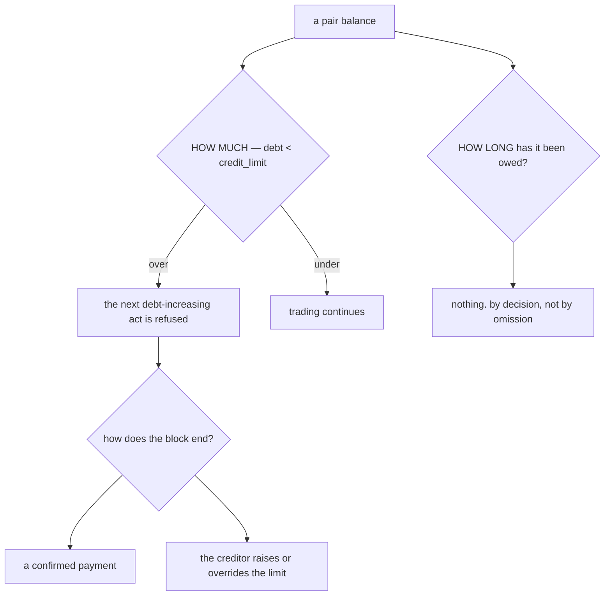

### The spec

| | |
| --- | --- |
| when a debtor must pay | **never** — on demand, any amount, at its own choosing |
| due date | none exists |
| overdue state | does not exist |
| statement object | none — there is nothing to cut a period against |
| the only gate | `debt < credit_limit`, read before an order |
| the only exits from a block | a **confirmed payment**, or the creditor **raising / overriding** the limit |
| `liability_balances.oldest_unsettled_at` | **information only.** It is real ageing and it triggers nothing |

### What this makes load-bearing

The threshold was one of two possible controls and is now the only one. Two things follow, and both
are open in the [clarify](./context_clarify.md#question) rather than settled here:

- **The override is the sole escape hatch.** With no cycle there is no date on which a block lifts
  by itself, so *"who may raise a limit, is it recorded, does it expire"* stops being an audit nicety
  and becomes the mechanism by which a blocked team trades again.
- **Chasing a debt has no instrument.** A creditor's only lever is to lower the limit, which stops
  the debtor working — a blunt one, and the only one this decision leaves.

---

## the-grain-is-the-team-pair

> `balance_context.md` §General 3 — *"The balance Grain is per pair team."*

**The verdict.** The unit of account is the **ordered pair of teams**. A team has as many balances as
it has counterparties, and never a single consolidated number.

This states what §General 2's mirrored rows already implied, and it matches what shipped:
`liability_entries` carries `(team_id, counterparty_id)` on every leg and `liability_balances` holds
one row per ordered pair, the two sides exact negatives.

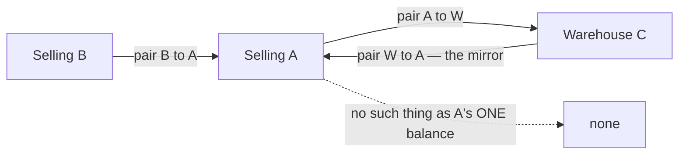

### The spec

| | |
| --- | --- |
| grain | one balance per **ordered pair**, stored twice, exact negatives |
| a team's position | a **list** of pair balances, not a total |
| the threshold | set **per pair**, with a default row for every counterparty without one |
| the credit check | asks **each creditor independently** — any one over its limit stops the act |
| a payment | settles **one pair**, never a team's overall position |

---

## balance-manages-and-reports

⚠ **RENAMED to [balance-manages-reports-and-takes-payments](#balance-manages-reports-and-takes-payments)**
(2026-08-29). §Responsbility grew a third line — *"Manage Payments Accross Team"* — so this
section's verdict, *"exactly two jobs"*, is wrong as written. RULE 12: a decision whose verdict
changes is renamed and its references grepped, never quietly edited.

**Everything below still holds about the two jobs it named.** Only the count changed, and the
reasoning about the daily report is untouched.

> `balance_context.md` §Responsbility — *"1. Manage Balance. 2. Serve Balance Daily Report."*

**The verdict.** Balance has exactly two jobs: **hold the ledger**, and **serve the daily report**
read from it. Both halves already exist in code — `liability_entries` / `liability_balances` /
`liability_payments` / `liability_terms`, and `LiabilityDaily`.

Naming the report as a *responsibility* rather than a screen matters: the warehouse's half of the
daily statement exists **only** here. A warehouse has no orders, so `order_revenues.team_id` is always
the selling team and pointing a warehouse at revenue returns nothing. Without this RPC a warehouse's
statement puts real expenses against a margin of zero and reports every day as a pure loss.

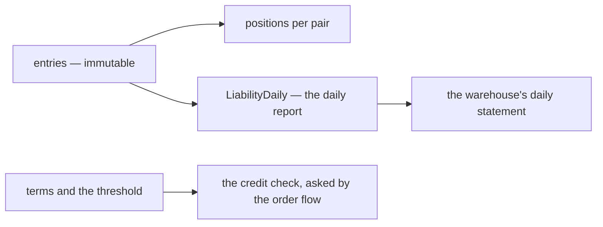

⚠ **The report is a stated responsibility and it is currently under-reporting.** The statement reads
`COD_FEE`, and nothing has posted under that source since `RESTOCK_OUTLAY` superseded it — so the
column is permanently zero and the outlay appears nowhere. ⚠ **Which of the two names is wrong is now
a business question, not a code one**:
[the-warehouse-receivable-is-order-fee-cod-fee-and-found](#the-warehouse-receivable-is-order-fee-cod-fee-and-found)
calls it **`cod_fee`**, siding with the screen. Detail and the hold in
[technical balance C15](../../technical/balance/team_balance_design_clarify.md#critique).

---

## the-order-fee-posts-at-creation-and-reverses-on-cancel

> `balance_context.md` §What Warehouse Can Receivable 1 — *"`order_fee`, its charge when order
> created. and it can be canceled in order canceled."*

**The verdict.** The warehouse's order fee is raised **when the order is created**, not when it ships
or is delivered, and a **cancellation reverses it**.

This ratifies what shipped: `handling_fee` posts on `OrderPlacedEvent` and `ReverseOrder` posts the
opposite on `OrderCancelledEvent`. It also fixes the naming — the business word is **`order_fee`**,
the code's is `handling_fee`.

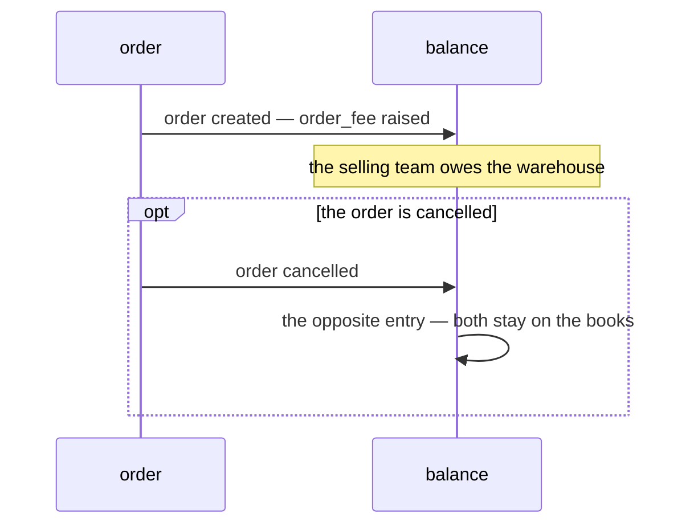

**A reversal is compensation, never a delete.** Both entries remain and net to zero, so the history
shows the fee was charged and withdrawn rather than never having happened.

⚠ **It reverses only the order fee.** A cancellation does **not** give the warehouse back money it
laid out at a courier's door — that is
[`cod_fee`](#the-warehouse-receivable-is-order-fee-cod-fee-and-found), a separate receivable with its
own life, and the goods did arrive.

---

## the-warehouse-payable-is-broken-and-lost

> `balance_context.md` §What Warehouse Can Payable — *"1. `broken_good`, when good broken. 2.
> `lost_good`, when good lost."*

**The verdict.** The warehouse owes the owning team in exactly two situations, and they are **named
separately**: goods **broken**, and goods **lost**. It holds stock it does not own, so damaging it is
a debt to the owner rather than a cost it absorbs alone.

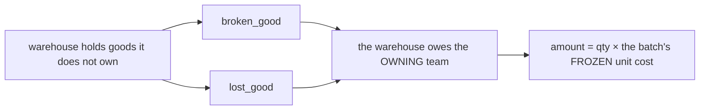

⚠ **The doc names two, the code has one.** `LIABILITY_SOURCE_TYPE_STOCK_DAMAGE` covers both, so
*"how much did we lose to breakage versus to shrinkage"* is not a question this ledger can answer
today. Whether the split is meaningful is asked in
[context_clarify.md](./context_clarify.md#question).

---

## the-warehouse-receivable-is-order-fee-cod-fee-and-found

> `balance_context.md` §What Warehouse Can Receivable — *"1. `order_fee` … 2. `cod_fee`, its
> optionally set warehouse when accept restock/return. 3. `found`, a lost goods found back later."*

**The verdict.** A warehouse may raise exactly **three** receivables against a selling team. This
completes the list that previously held only `order_fee` and **resolves the contradiction** with
§Causes 2 and 5 — the list was incomplete, not restrictive.

| named | cause | when |
| --- | --- | --- |
| `order_fee` | 1 | order created — reversed on cancel |
| `cod_fee` | 2 | **optionally** set by the warehouse when it accepts a **restock or a return** |
| `found` | 5 | a lost good turns up later |

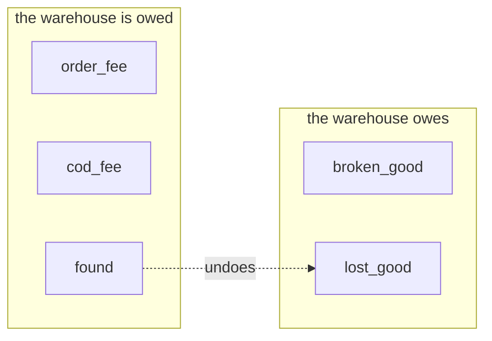

### Two things this narrows, and one it opens

**`cod_fee` is the COD fee — not "everything the warehouse laid out".** The shipped posting is
`RESTOCK_OUTLAY`, and it charges the **sum of every cost line** on the delivery, including
`RESTOCK_COST_KIND_OTHER` — a free amount with a note. This decision names one kind of money, so
`OTHER` has no stated business backing. Asked in [context_clarify.md](./context_clarify.md#question).

**The business name is `cod_fee`.** `LIABILITY_SOURCE_TYPE_COD_FEE` still exists in the proto and
nothing posts under it, because `RESTOCK_OUTLAY` superseded it. The doc has now come down on the side
of the older name — which is also the one the daily statement still reads.

⚠ **"restock/**return**" is half-implemented.** `PostRestockOutlay` is called from
`RestockRequestFulfill` only. `StockReturn` is a pick-undo: it carries no cost line, no COD field and
posts nothing to this ledger. So the return half of this decision does not exist yet.

### `found` is a receivable in its own right

Not merely the absence of a payable. The warehouse reimbursed a loss and the goods turned up, so the
owner owes the money back — which is why it sits on the receivable side of the doc rather than being
described as a correction. ⚠ In the ledger it is `STOCK_DAMAGE` with `reversal = true`, so the three
business names `broken_good`, `lost_good` and `found` map to **one** source type and a boolean.

---

## cod-fee-is-the-couriers-incidental-ask

> `balance_context.md` §Why `cod_fee` Exists — *"we already charge `shipping_fee` when restock/return
> goods created. But sometimes when its arrived in warehouse, shipping channel person who brought the
> goods ask accidental fee (`cod_fee`) to the warehouse for the cost like coffe tip or other."*

**The verdict.** `cod_fee` and `shipping_fee` are **two different moments and two different kinds of
money**, and both exist on purpose.

| | `shipping_fee` | `cod_fee` |
| --- | --- | --- |
| when | the restock / return is **created** | the goods **arrive** |
| what | the agreed freight | whatever the courier asks for at the door |
| known in advance | ✅ yes | ❌ no — it is **accidental** |
| who is out of pocket | the requesting team, already | the **warehouse**, right then |
| predictable size | ✅ | ❌ open-ended by nature — *"coffe tip or other"* |

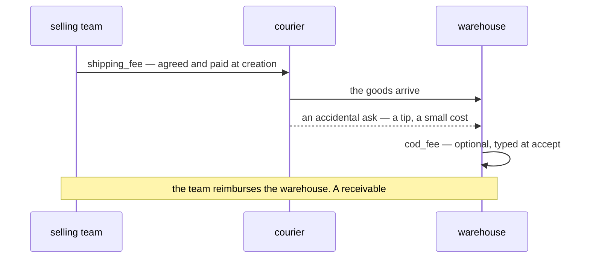

### What this settles, and what it opens

✅ **It answers why there are two fees rather than one.** They are not two names for freight. One is
priced before the journey, the other is demanded at the end of it.

✅ **The owner's own diagram calls it a REIMBURSEMENT** — *"Charge to selling as reimbursement"*. That
is a strong word here: a reimbursement is money moving back to whoever fronted it, **not** a component
of what the goods cost. It is the clearest argument yet for keeping the fee out of `UnitPrice`
([product Q6](../product/context_clarify.md#question)) — though that formula is `product_context.md`'s
to change.

✅ **`shipping_fee` is correctly NOT a balance movement.** The requesting team already paid it, so
nobody owes anybody — which is exactly how the code treats it (`restock_requests.shipping_cost` feeds
the unit price and posts no entry).

⚠ **It makes `cod_fee` an OPEN-ENDED discretionary amount by design.** *"or other"* is the point of
the line, not a gap in it — so *"close the list of chargeable kinds"* is answered: the list has one
entry and that entry is deliberately open. The consequence is that
`RESTOCK_COST_KIND_COD_SHIPPING` and `RESTOCK_COST_KIND_OTHER` are the **same** thing split in two.

⚠ **It puts the fee's size and its accounting treatment out of proportion.** A tip is small, and it
currently capitalises permanently into the goods' `UnitPrice` — see the contradiction in
[product_context clarify](../product/context_clarify.md#contradiction).

⚠ **The name now argues against itself.** *Cash On Delivery* means paying for the **goods** at the
door — which is how the shipped code reads it (*"paying the courier at the door for goods it does not
own"*). What this decision describes is an incidental. Asked in
[context_clarify.md](./context_clarify.md#question).

---

## the-threshold-warns-at-eighty-percent

> `balance_context.md` §About Thresholds 1 — *"there is warning on the balance screen and daily report
> if thresholds 80% reached."*

**The verdict.** The threshold is no longer binary. At **80% of the limit** a warning appears on the
**balance screen** and in the **daily report** — so the block is never the first news.

This closes the clarify's question *"is there a warn level before the wall"*. It matters more than it
looks: with [no-overdue-only-the-threshold](#no-overdue-only-the-threshold) there is no cycle and no
chase instrument, so before this the **block itself** was the notification — and the first human to
learn of a debt problem was a customer service person mid-order with a customer waiting.

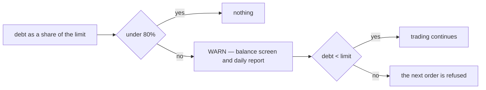

### The spec

| | |
| --- | --- |
| trigger | `debt >= 0.8 × limit` |
| where | the **balance screen** and the **daily report** — both already exist |
| what it does | **warns only.** It refuses nothing |
| no limit set | **no warning** — 80% of unlimited is not a number |
| cost | none new: `CheckCredit` already reads both figures |

⚠ **Neither surface can show it yet.** The daily report exists; the **terms screen does not** —
`liabilityTermsClient` has zero callers, so nothing in the app can display a limit, let alone a
percentage of one. The warning arrives with that screen or not at all.

---

## the-threshold-defaults-to-unlimited

> `balance_context.md` §About Thresholds 2 — *"thresholds default is unlimited."*

**The verdict.** A team with no threshold set has **unlimited** credit. Ratifies what shipped: no
`liability_terms` row, or a row with a `NULL` limit, allows anything.

⚠ **`0` is NOT unlimited — it is no credit at all**, and the two are opposites. That trap is why the
limit is a pointer end to end in the code and is never read through a zero-defaulting getter: the day
somebody means to freeze a team and types `0`, the naive reading would grant infinite credit instead.
Removing a limit means **deleting the row**, never zeroing the column.

| the limit is | means |
| --- | --- |
| no row | **unlimited** ← the default this decision names |
| a row with `NULL` | **unlimited** |
| a row with `0` | **no credit at all** — blocks the very first order |

---

## three-roles-edit-the-threshold

> `balance_context.md` §About Thresholds 2 — *"team owner, team admin, or root edited it."*

**The verdict.** The threshold is **one value**, edited by **`TEAM_OWNER`, `TEAM_ADMIN` or `ROOT`**.
There is no separate override object: root's change and the creditor's change are the same act on the
same field.

This narrows the shipped policy, which allows **six** roles — it adds `ADMIN`, `WAREHOUSE_OWNER` and
`WAREHOUSE_ADMIN`.

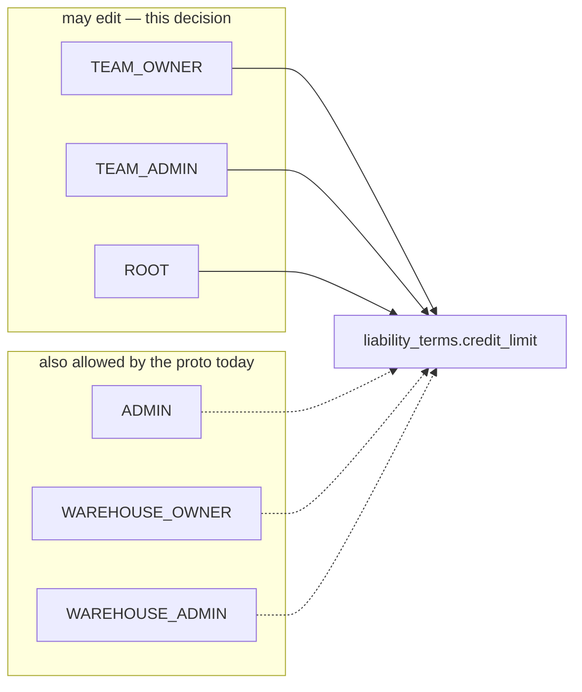

⚠ **The creditor is usually the WAREHOUSE, and warehouse roles are not on this list.**
`liability_terms.team_id` is the team that is **owed** — so a warehouse setting a limit on a selling
team is the ordinary case, and `ROLE_WAREHOUSE_OWNER` is a distinct role from `ROLE_TEAM_OWNER`. Read
literally, the party carrying the credit risk cannot set its own limit. Asked in
[context_clarify.md](./context_clarify.md#question).

⚠ **No override object follows from this**, so root's edit leaves no actor, no reason and no expiry —
it is indistinguishable from the creditor changing its own mind. Whether that is intended is the
narrow half of [Q1](./context_clarify.md#question) still open.

---

## terms-are-team-scoped-root-is-global

> The owner, in chat — *"team owner and team admin in team scoped, for root its globally."*

**The verdict.** The threshold write set has **two different reaches**. A team owner or team admin may
set the limit **on their own team's row only**. **Root** may set it on **any** row.

This ratifies the shipped mechanism exactly: `LiabilityTermsSetRequest.team_id` carries
`use_scope`, so a role-holder is authorized only against their own team, while ROOT/ADMIN in the root
team hold a global bypass (`access_interceptors/interceptor.go`). §Balance Policy 1's *"admin/root
team"* puts `ADMIN` on the same footing as `ROOT`.

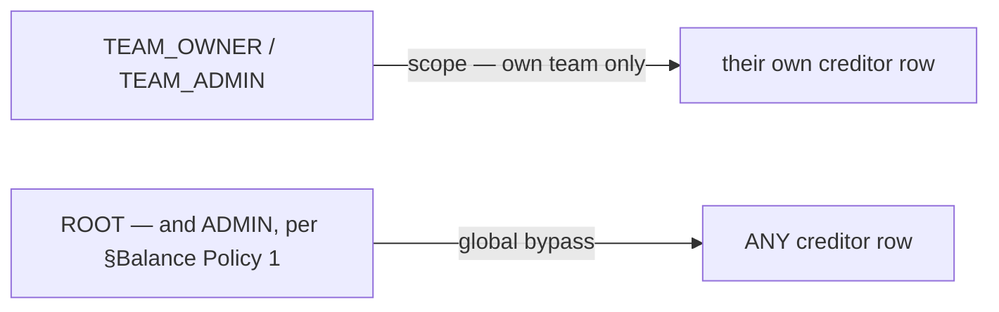

### What this settles that no other line could

**It defines an OVERRIDE precisely, without inventing an object for it:**

> An override is **a write to a creditor's row by somebody who is not in that team.**

Nothing else can produce one — scope makes every other write self-directed. So the distinction
[three-roles-edit-the-threshold](#three-roles-edit-the-threshold) left invisible is **already
structural**; it is simply not stored.

| | |
| --- | --- |
| what identifies an override | the actor's team ≠ the row's `team_id` |
| what it costs to record | **one column** — `actor_id` on `liability_terms` |
| what it does NOT need | a separate override table, an `expires_at`, a second flow |

That is the whole of what [Q1](./context_clarify.md#question) still asks for, and it survives *"one
value, three roles, one act"* untouched.

⚠ **What this does not answer** is whether `WAREHOUSE_OWNER` / `WAREHOUSE_ADMIN` are inside the
scoped set. A warehouse **is** a team (`TEAM_TYPE_WAREHOUSE`) and is the creditor in three of the five
movements, but its people hold `ROLE_WAREHOUSE_*`, which is a different enum value from
`ROLE_TEAM_OWNER`. Still asked as [Q3](./context_clarify.md#question).

---

## warehouse-roles-count-as-their-own-team

> The owner, in chat — *"yes, but we separate to warehouse owner and team owner because its different
> access for warehouse and selling."*

**The verdict.** *"A team's own people"* means **the role family matching that team's TYPE**. A
warehouse's owner and admin set their warehouse's terms exactly as a selling team's owner and admin
set theirs — and the two families stay **separate roles**, because warehouse access and selling access
are not the same thing and must not be merged into one `OWNER`.

| the creditor team is | its own people are |
| --- | --- |
| `TEAM_TYPE_SELLING` | `ROLE_TEAM_OWNER`, `ROLE_TEAM_ADMIN` |
| `TEAM_TYPE_WAREHOUSE` | `ROLE_WAREHOUSE_OWNER`, `ROLE_WAREHOUSE_ADMIN` |
| any — globally | `ROLE_ROOT`, and `ROLE_ADMIN` per §Balance Policy 1 |

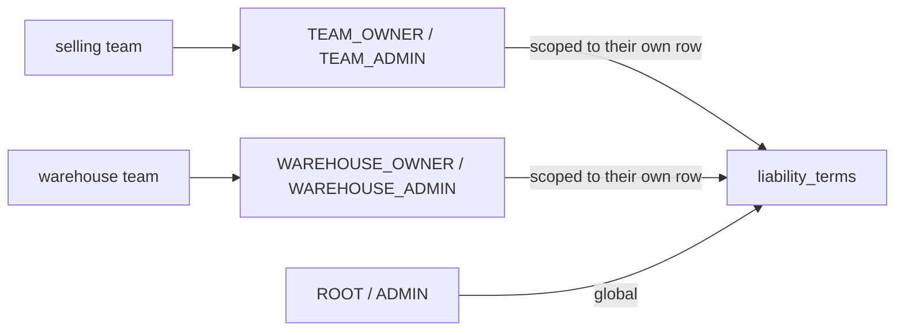

### ✅ The shipped policy is already exactly this

`LiabilityTermsSetRequest` allows
`[ROOT, ADMIN, TEAM_OWNER, TEAM_ADMIN, WAREHOUSE_OWNER, WAREHOUSE_ADMIN]` — the same six. Combined
with [terms-are-team-scoped-root-is-global](#terms-are-team-scoped-root-is-global), the code needs no
change. **The clarify's Critique 15 is withdrawn**: it read the doc's shorter wording as a narrowing,
and it was shorthand.

⚠ **The `*_ADMIN` roles stay.** The clarify recommended dropping them, on the argument that stopping
another business trading is an owner's act. The owner has now named admins twice — recorded, not
re-argued.

### The rule generalises beyond this policy

Every scoped `request_policy` in the system faces the same question, and this is the answer for all of
them: **a scoped policy lists BOTH role families, and the team's type decides which one can ever
match.** A policy naming only `TEAM_*` silently excludes warehouses; one naming only `WAREHOUSE_*`
silently excludes selling teams. Neither failure raises an error — the request is simply denied to a
person who should have had it.

---

## a-limit-change-is-recorded

> The owner, in chat — asked *"is a limit change recorded?"*, answered **yes**.

**The verdict.** Changing a credit limit is an **audited act**. Who changed it, and — when the actor
is outside the creditor team — why.

This is what [terms-are-team-scoped-root-is-global](#terms-are-team-scoped-root-is-global) made cheap:
scope already distinguishes a creditor's own edit from an outsider's, so the record needs **no new
concept**, only the actor.

### The spec

| | |
| --- | --- |
| `actor_id` | on every write. Never null — a limit nobody set is not a thing that happened |
| `reason` | required **only when the actor is outside the creditor team** — a creditor setting its own terms owes nobody an explanation, somebody else changing them does |
| a **change log** | one row per change, not just the latest values on the terms row |
| ⚠ the logged limit | **NULLABLE**. `NULL` · `80.000.000` · `0` are three different acts, and a plain integer column flattens `NULL` to `0` — turning *"they removed the limit"* into *"they froze the team"* |
| what is logged | the pair, the actor, the old and new limit, the reason, the timestamp |

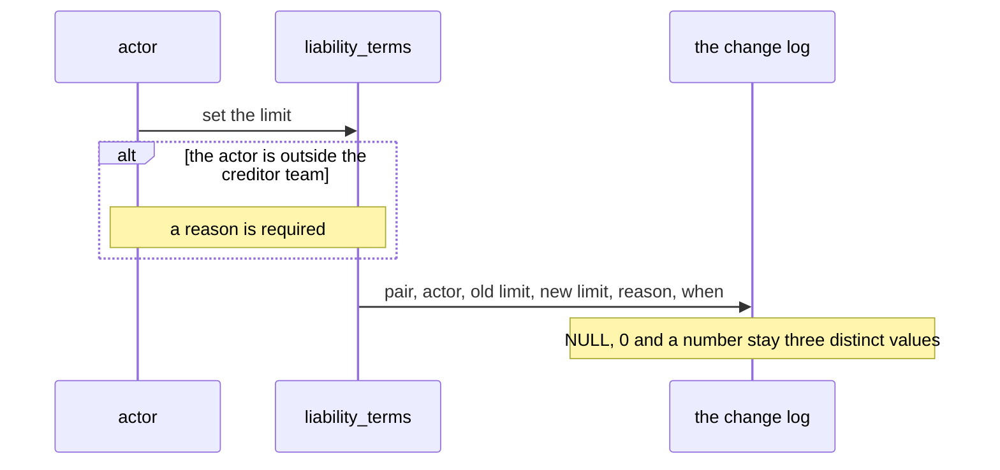

### Why the LOG and not just columns

Two reasons, and both come from decisions already made here:

- **The limit is also the chase instrument.** [no-overdue-only-the-threshold](#no-overdue-only-the-threshold)
  leaves a creditor no way to demand payment except lowering the limit. Raising and lowering it is
  therefore an ongoing negotiation between two businesses, and only its **latest value** is not a
  record of that.
- **A raise silently erases the warning.**
  [the-threshold-warns-at-eighty-percent](#the-threshold-warns-at-eighty-percent) makes 80% the only
  signal this design has. A team at 85% whose limit doubles drops to 42% and the warning vanishes —
  with columns alone, nothing anywhere shows it was ever warning.

⚠ **`liability_entries` still has no actor at all.** This decision covers the *terms*, not the ledger.
*"Who posted this charge"* remains unanswerable and unbackfillable — the older gap in
[technical balance C9](../../technical/balance/team_balance_design_clarify.md#critique), and every day
of delay adds unattributable rows.

---

## the-block-stops-orders-only

> The owner, in chat — asked *"what does a block stop?"*, answered **"yes, order only."**

**The verdict.** Hitting the threshold refuses **order creation** and nothing else.

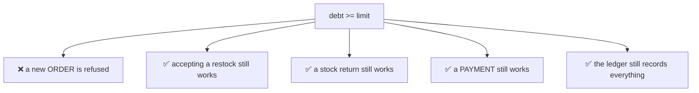

| act | blocked? | why |
| --- | --- | --- |
| create an order | ✅ **yes** | the only act that voluntarily takes on more debt |
| accept a restock carrying a `cod_fee` | ❌ no | the warehouse **already paid the courier**. Blocking strands goods at a door over money that is spent |
| a stock return | ❌ no | not a debt-taking act |
| record or confirm a **payment** | ❌ **never** | it is the one act that *reduces* the debt. Blocking it would deadlock a team that owes too much to pay |
| any ledger posting | ❌ never | the ledger records what happened. A book that declines to record reality stops matching the world |

### ✅ This ratifies the code exactly

`CheckCredit` has **one caller** — `credit_checker.go`, from order create. Nothing else in the system
consults the threshold, and per this decision nothing else should. It is also a **pre-check, never a
guard inside `PostEntry`**: the fees of an order that slipped through still post truthfully, and the
*next* order is the one stopped.

⚠ **Cross-borrowing is covered without being named.** An order draws on the fulfilling warehouse *and*
every team whose goods it sells, and each creditor is checked independently — so borrowing is blocked
as part of the order, not as a separate act.

---

## the-ledger-speaks-the-business-words

> The owner, in chat — *"for 1, yes migrate it"*, and `incidental_fee` chosen over keeping `cod_fee`.

**The verdict.** The ledger's source types become the **business's** words. Three business movements
that share one type today are **split into three**, and the two cost-line kinds that describe the same
money become **one**.

⚠ **`cod_fee` does NOT survive the migration.** *Cash on delivery* means paying for the **goods** at
the door — which is exactly how the current code reads it (*"paying the courier at the door for goods
it does not own"*). What
[cod-fee-is-the-couriers-incidental-ask](#cod-fee-is-the-couriers-incidental-ask) describes is an
unplanned ask on arrival, a different order of magnitude and a different risk. The word is
**`incidental_fee`**.

### The mapping

| today | becomes | note |
| --- | --- | --- |
| `LIABILITY_SOURCE_TYPE_HANDLING_FEE` | `LIABILITY_SOURCE_TYPE_ORDER_FEE` | the business word says *when*, the old one did not |
| `LIABILITY_SOURCE_TYPE_RESTOCK_OUTLAY` | `LIABILITY_SOURCE_TYPE_INCIDENTAL_FEE` | |
| `LIABILITY_SOURCE_TYPE_COD_FEE` | **removed**, number reserved | nothing has ever posted under it since it was superseded |
| `LIABILITY_SOURCE_TYPE_STOCK_DAMAGE` | `BROKEN_GOOD` · `LOST_GOOD` · `FOUND` | **three**, per §What Warehouse Can Payable and §Receivable 3 |
| `LIABILITY_SOURCE_TYPE_PRODUCT_FEE` | unchanged | selling-to-selling — outside the warehouse lists, so no business word was given |
| `LIABILITY_SOURCE_TYPE_PAYMENT` | unchanged | |
| `RESTOCK_COST_KIND_COD_SHIPPING` + `RESTOCK_COST_KIND_OTHER` | one `RESTOCK_COST_KIND_INCIDENTAL` | the openness is deliberate, so two kinds described one thing |

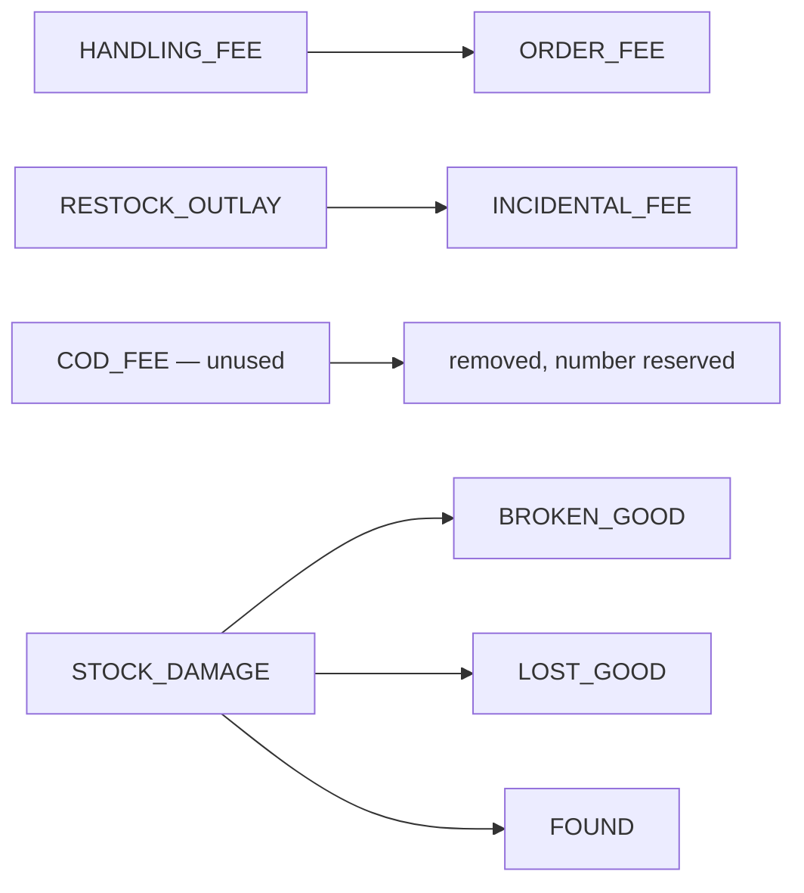

### ✅ The three-way split is already available at the call site

`StockAdjustReason` **already** carries `DAMAGED`, `LOST` and `FOUND` as distinct values —
`stock_adjust.go` reads the reason and then collapses all three into one `PostStockDamage` call. So
the split needs no new input and asks the warehouse crew for nothing new: the distinction is already
being captured and thrown away.

### ⚠ `reversal` STAYS, and `found` keeps it set

`Reversal` is not a label — `PostEntry` **flips the sign** on it (`creditorAmount = -p.Amount`). So:

| movement | source type | `reversal` |
| --- | --- | --- |
| goods broken | `broken_good` | `false` |
| goods lost | `lost_good` | `false` |
| goods **found** | `found` | **`true`** — it is a giving-back movement |
| order cancelled | `order_fee` | `true` |

The **type carries the cause, the flag carries the direction.** They are not redundant, and the
idempotency key `(team_id, counterparty_id, source_type, source_id, reversal)` keeps all five columns.

### ✅ It fixes a live bug for free

The daily statement reads `LiabilitySourceType.COD_FEE`, which nothing has posted since
`RESTOCK_OUTLAY` superseded it — so its column is permanently zero and the outlay appears in **no**
column. Repointing it at `INCIDENTAL_FEE` is part of the same change
([technical C15](../../technical/balance/team_balance_design_clarify.md#critique)).

### The migration, in order

| | |
| --- | --- |
| 1 | **proto** — rename the enum values, reserve the removed number, collapse the cost-line kinds |
| 2 | **`buf generate`** — Go and TypeScript together |
| 3 | **goose migration** in `liability_service` — rewrite `liability_entries.source_type` TEXT: `handling_fee`→`order_fee`, `restock_outlay`→`incidental_fee`, and `stock_damage`→`found` where `reversal` is true, `broken_good` otherwise ⚠ |
| 4 | **Go** — the mapper's constants and stored strings, `PostStockDamage` taking the reason, `stock_adjust.go` / `stock_opname.go` passing it |
| 5 | **frontend** — `causeKey`, both locales, and the daily statement's `COD_FEE` read |
| 6 | **docs** — `database-schema.md`, `liability_service/rpc.md`, and a grep of `docs/faq/` |

⚠ **Step 3 cannot recover `broken_good` vs `lost_good` for existing rows.** The ledger stored one type
for both, and the adjust reason lives in another service's table. Existing non-reversal rows can only
be back-filled by joining `liability_entries.source_id` to the inventory movement that produced it —
and if that join is not available, history lands on one of the two and says so. **The longer this
waits, the more rows carry the ambiguity.**

### ⛔ BLOCKED — `buf generate` cannot run in this environment

Step 2 is impossible here, so nothing after it can land:

| | |
| --- | --- |
| `buf registry whoami` | *"Not currently logged in for buf.build"* |
| every plugin in `buf.gen.yaml` | a **`remote:`** BSR plugin |
| `BUF_TOKEN` | unset, and there is no `~/.netrc` |
| ⚠ `clean: true` | so running it anyway **empties `backend/gen` and `frontend/src/gen` and produces nothing** — this has already happened once in a previous pass |
| local fallback | `protoc-gen-go` is **v1.36.11** against the pinned **v1.36.6**, `protoc-gen-connect-go` **1.20.0** against **v1.18.1**, and **`protoc-gen-es` is absent entirely** — so Go would drift against CI's generated-check and TypeScript could not be produced at all |

✅ **UNBLOCKED 2026-08-29 — and not by logging in.** `proto/buf.gen.yaml` now uses `local:` plugins,
pinned by the root go.mod's `tool` directives and by `frontend/package.json`, so `cd proto && buf
generate` needs no Buf account. **The six steps above run in order.** ⚠ The verdict of this decision is
unchanged — only the sentence about what stood in its way.

---

## balance-manages-reports-and-takes-payments

> `balance_context.md` §Responsbility — *"1. Manage Balance. 2. Serve Balance Daily Report.
> 3. Manage Payments Accross Team."*

**The verdict.** Balance has **three** jobs. The third is **payments between teams** — recording
one, and confirming it — and it is the only one of the three that lets a balance go back down.

⚠ **This renames [balance-manages-and-reports](#balance-manages-and-reports)**, whose verdict was
*"exactly two jobs"* (RULE 12).

✅ **It ratifies shipped code.** `liability_payments`, `LiabilityPaymentRecord`,
`LiabilityPaymentConfirm`, `LiabilityPaymentReverse`, `LiabilityPaymentList` and the
`awaiting_confirmation` count all exist. Payments were built and never *named* as a
responsibility — which is why two holes in them read as niceties until now.

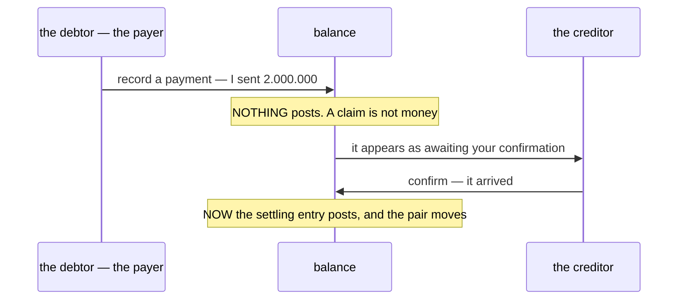

### The spec

| | |
| --- | --- |
| what a payment IS | a **claim and an acknowledgement**, never a transfer. The money moves by bank outside this system |
| the two phases | **record** by the payer, **confirm** by the creditor. Only the confirm posts |
| who may confirm | the **creditor only** — they are the one who sees the money arrive |
| what moves the balance | the confirm, and nothing else. A recorded payment changes no figure |
| never blocked | the threshold must **never** refuse a payment. A team that cannot pay because it owes too much is a deadlock, and with no cycle nothing would ever break it |

### ⚠ Not a wallet

*Managing payments* is managing the claim and the acknowledgement. It is **not** holding money:
no cash, no bank account, no float, no balance to draw down. The pair figure is an **obligation**,
and the third responsibility does not turn it into an account with money in it.

### Two gaps this promotes from nicety to defect

Both were open before and both were arguable while payments were merely *built*. Naming them a
responsibility ends that argument.

| | |
| --- | --- |
| **no `rejected` state** | a creditor facing a payment that never arrived can only leave it at `recorded` forever, or **confirm it and reverse it** — two real ledger movements for money that never moved, and a pair history telling a story that did not happen. [technical Q5](../../technical/balance/team_balance_design_clarify.md#question) |
| **`PaymentReverse` has no screen** | the RPC ships and **nothing in the frontend calls it**, so a confirmation made in error cannot be undone by anyone. [technical C14](../../technical/balance/team_balance_design_clarify.md#critique) |

⚠ **And the chase problem is now sharper, not smaller.** With payments a stated job, the absence of
any way to *ask* for one stands out: a creditor's only lever is still lowering the limit, which
stops the debtor trading rather than requesting money ([Critique 11](./context_clarify.md#critique)).

---

## the-debtor-claims-the-creditor-decides

> `balance_context.md` §Payment Flow — *"1. How team create payment"* and *"2. Payment lifecycles"*,
> two diagrams added 2026-08-29.

**The verdict.** A payment is **started by the team that owes** and **settled by the team that is
owed**. The debtor creates a claim carrying proof of a bank transfer, the creditor checks it by hand,
and the creditor either **accepts** it — which posts — or **rejects** it — which posts nothing. Three
states, and the middle one is a claim rather than money.

This answers [technical Q5](../../technical/balance/team_balance_design_clarify.md#question),
*"may the creditor reject a claimed payment?"* — **yes**, and it is a first-class terminal state,
not a confirm-then-reverse.

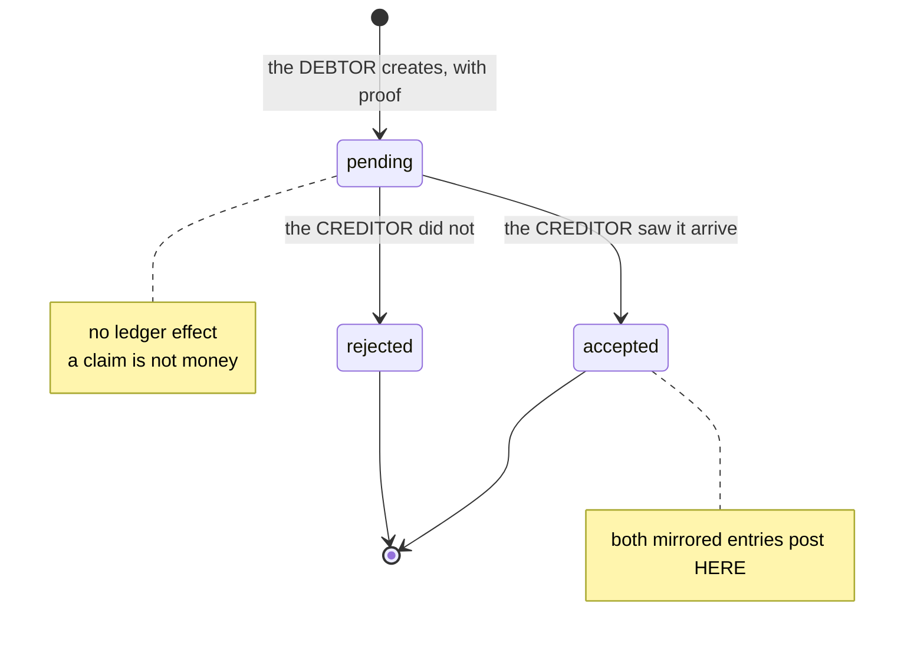

### The spec

| | |
| --- | --- |
| who creates | the **debtor** — the team whose pair figure is negative. Never the creditor, never a third party |
| what starts it | the debtor **seeing** the figure. There is no request, no notice, no due date — the flow's first step is *"Team A see -100.000"* |
| what it carries | an amount, and **proof of the bank transfer** — an image, a document or a screenshot |
| who decides | the **creditor only**, and **manually**. The system never verifies a transfer |
| accept | posts both mirrored entries. The pair moves, and only now |
| reject | terminal, posts **nothing**, and the row stays. A rejected claim is history, not a deletion |
| re-claiming | a rejected payment is not reopened — the debtor makes a **new** claim. Two rows for one transfer is the correct record of what happened |

### ✅ What it ratifies

| shipped | |
| --- | --- |
| `LiabilityPaymentRecordRequest.team_id` is the **payer** and the scope | you may only ever record your own payment |
| `LiabilityPaymentConfirmRequest.team_id` is the **creditor** and the scope | a payer who could confirm their own payment could write off any debt they liked |
| `RECORDED` has no ledger effect | *"pending"* in your words. Same state, and the code's comment already said why |
| a negative pair figure means **you owe** | the flow reads *"Team A see -100.000 in Team B"* and then A pays — the sign convention the ledger already uses |

### ⚠ What it does NOT settle

| | |
| --- | --- |
| **is proof required?** | the flow says the payer *brings* it. Whether the system **refuses** a payment without one is [Q10](./context_clarify.md#question). The shipped `MakePaymentDialog` collects an amount and a note and would let one through with neither |
| **where does proof LIVE?** | nowhere today, and the creditor could not read it if it did — `document_service` scopes a read to the owning team. [Critique 18](./context_clarify.md#critique) |
| **is `accept` really final?** | the diagram makes it terminal, and `LiabilityPaymentReverse` ships and can leave it. [Q11](./context_clarify.md#question) |
| **may a payment be an OFFSET?** | netting what a warehouse owes a team against what that team owes it is still open — [technical Q2](../../technical/balance/team_balance_design_clarify.md#question) |

### ⚠ It qualifies an entry above it

[balance-manages-reports-and-takes-payments](#balance-manages-reports-and-takes-payments) listed
*"`PaymentReverse` has no screen"* as a **defect**. A terminal `accept` inverts that: the same RPC
becomes a path the design does not ask for. This log is append-only, so the earlier entry stands as
written and this one is the correction — the reverse is now **[Q11](./context_clarify.md#question)**,
not a defect. Its sibling, the missing `rejected` state, is **confirmed** as a defect and is now
build work.

---

## an-incidental-line-must-say-what-it-was-for

> The owner, in chat — *"yes"*, answering [Q12](./context_clarify.md#question): must an incidental
> cost line carry a note?

**The verdict.** Every `restock_cost_lines` row **requires a note**. The rule stops being conditional
on the kind, because after
[the-ledger-speaks-the-business-words](#the-ledger-speaks-the-business-words) there is only one kind.

| before | after |
| --- | --- |
| `COD_SHIPPING` — note **optional**, the kind said what the money was | one `INCIDENTAL` kind — note **always required** |
| `OTHER` — note **required**, an untyped amount is unarguable | |

**Why it lands on required rather than optional.** The kind was carrying the meaning for half the
rows and has stopped. §Why `cod_fee` Exists describes this money as the courier's *accidental* ask —
*"coffe tip or other"* — which is exactly the charge a team cannot argue with unless somebody wrote
down what it was for. Optional-always would make every incidental charge a bare number on another
team's books.

⚠ **It costs a required field** at acceptance, typed by a warehouse person with a courier waiting.
That is the price, and it is why this was not settled without asking.

### The spec

| | |
| --- | --- |
| proto | `RESTOCK_COST_KIND_INCIDENTAL = 1`, `2` **reserved**. The note gets `min_len: 1` — it is no longer a pair rule, so it can finally be expressed in the contract instead of in the handler |
| migration | `restock_cost_lines.kind`: `cod_shipping` and `other` both become `incidental` |
| ⚠ existing rows | a `cod_shipping` line written before today may have an **empty** note, and no migration can invent one. Validation binds new writes only |
| handler | the pair rule in `restock_request_fulfill.go` goes — `protovalidate` covers it |

---

## a-payment-must-carry-proof

> The owner, in chat — *"yes"*, answering [Q10](./context_clarify.md#question): is proof of transfer
> required, or a convention?

**The verdict.** A payment is **refused without at least one attached document**. §Payment Flow's
*"bring image/doc/screenshot Proof of bank transfer"* is a rule the system enforces, not a habit it
hopes for.

**Why.** The creditor's confirmation is a *manual* check — the whole two-phase design rests on a
human looking at something. A payment with nothing attached asks them to accept on the payer's word,
which is precisely what
[the-debtor-claims-the-creditor-decides](#the-debtor-claims-the-creditor-decides) declines to trust.

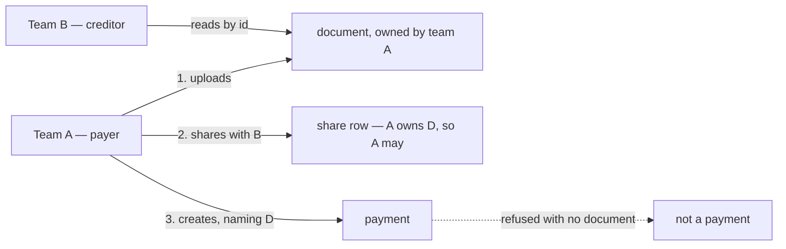

### The spec

| | |
| --- | --- |
| the rule | `PaymentRecordRequest.document_ids` — `repeated string`, **min 1** |
| who uploads | the **payer**. The file belongs to the payer's team |
| how the creditor reads it | a **share grant**: `document_shares(document_id, team_id, granted_by)`, and `GetDownloadUrl` gains one clause — *owner **or** shared-with* |
| what authorizes the share | the payer owns the file, so the payer may share it. **No service asks another service for permission** |
| ⚠ two rules it needs | a shared document **cannot be hard-deleted**, and a share is **permanent** — the creditor acted on that evidence. A share must NOT put the file in the recipient's document **list**, only make a read by id succeed |
| the type | `DOCUMENT_RESOURCE_TYPE_PAYMENT_PROOF`, **private** — a transfer slip names an account number |

⚠ **The share-grant plumbing is the recommendation this answer was given against**, not a second
decision. It is recorded here so it is visible and correctable rather than buried in a clarify: an
earlier proposal had `liability_service` vouching and `document_service` signing, which needed an
internal non-team-scoped signing path — retracted, because one bug in the vouching service's
relation check would leak every private file in the system.

### ⚠ What it does NOT cover

A bank transfer is the only payment kind that **has** a slip. If `offset`
([technical Q2](../../technical/balance/team_balance_design_clarify.md#question)) is ever allowed, or
cash changes hands in the building, there is nothing to attach and this rule has to be relaxed for
that kind. Relaxing a validation later is a compatible change — which is why no `kind` enum was
added now for a feature that has not been approved.
