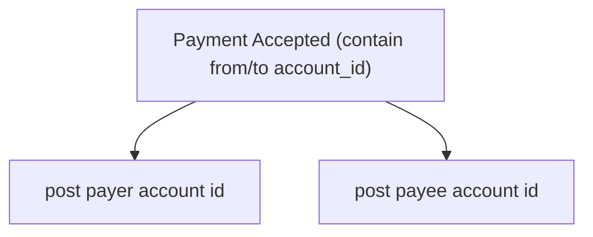

# Financial Account service.

## General.

## Responsbility.
1. Managing Financial account of the team:
    - Bank Account
    - Shopeepay
    - Cash

## Table That Must be Have.
1. for the ledger, we have `financial_accounts` and `financial_account_logs`.

### Table that Named `shop_accounts`
1. Field that must have:
    - `id`, its primary key
    - `team_id`
    - `shop_id`, its unique.
    - `account_id` 
    - `updated_at`
    - `created_at`

2. It's used to decide what account used by shops when like `withdrawal` happen

### Table that Named `operational_accounts`
1. Field that must have:
    - `id`, its primary key
    - `team_id`
    - `account_id`, its unique 
    - `updated_at`
    - `created_at`

2. It's used to decide what account used for operational like restock

### Table that Named `financial_accounts`
1. Field that must have:
    - `id`, its primary key
    - `team_id`
    - `type`
    - `provider`
    - `status`
    - `account_number`, its unique
    - `name`
    - `holder_name`
    - `description`
    - `balance`
    - `updated_at`
    - `created_at`

2. What is `type`

    `type` is:
    - `wallet`
    - `bank_account`
    - `cash`
    - `unknown`

3. What is `provider`

    `provider` is:
    - `cash`
    - `bca`
    - `bni`
    - `jago`
    - `shopeepay`
    - `unknown`

4. What is `status`

    `status` is:
    - `active`
    - `archived`

    

### Table that Named `financial_account_logs`
1. Field that must have:
    - `id`, its primary key
    - `team_id`
    - `account_id`
    - `change_type`
    - `change`
    - `balance_after`
    - `description`
    - `actor_id`
    - `occurred_at`
    - `created_at`

2. What is `change_type`

    `change_type` is:
    - `expense`
    - `ads_expense`
    - `adjustment`
    - `withdrawal`
    - `restock`
    - `opening_balance`
    - `transfer`
    - `team_payment`
    - `capital`
    - `opening_balance`

## How we Update The Ledger.
1. Manual.
2. Listen from Message Broker.

## What Happen when if Payment Accepted.

# How Financial Account Service Rpc Deliver Analytical Data.
we adopt how settlement deliver analitical data. [see this](../settlement/analytic_context.md#how-rpc-api-deliver-analytical-data)

## What Metric that existed.
1. Daily
2. Monthly
3. Yearly
3. `provider` Grouped
4. `change_type` Grouped
5. Account Grouped