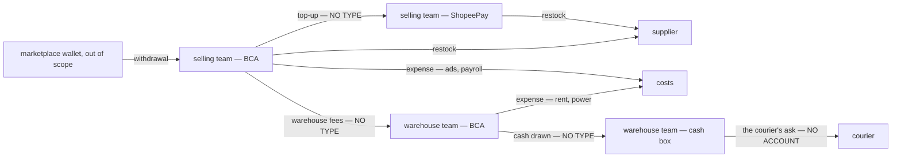
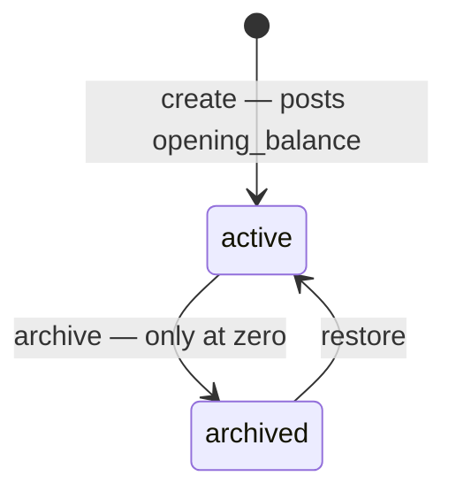
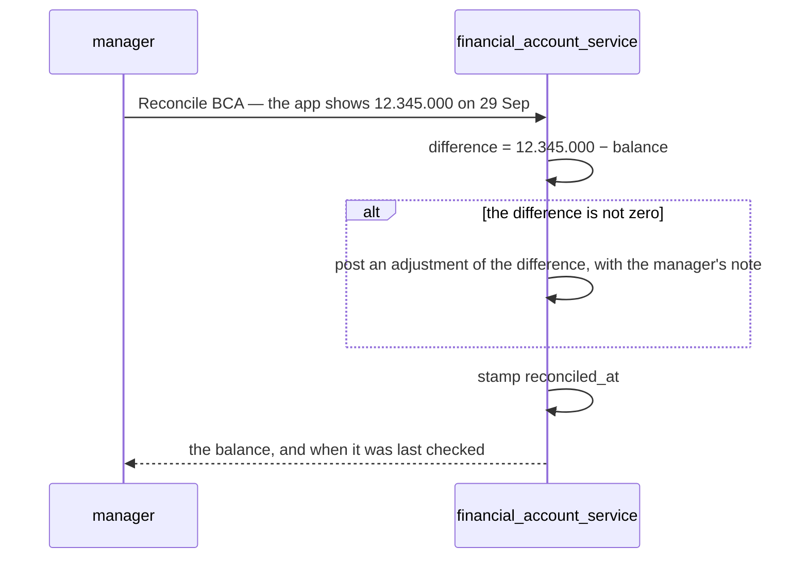
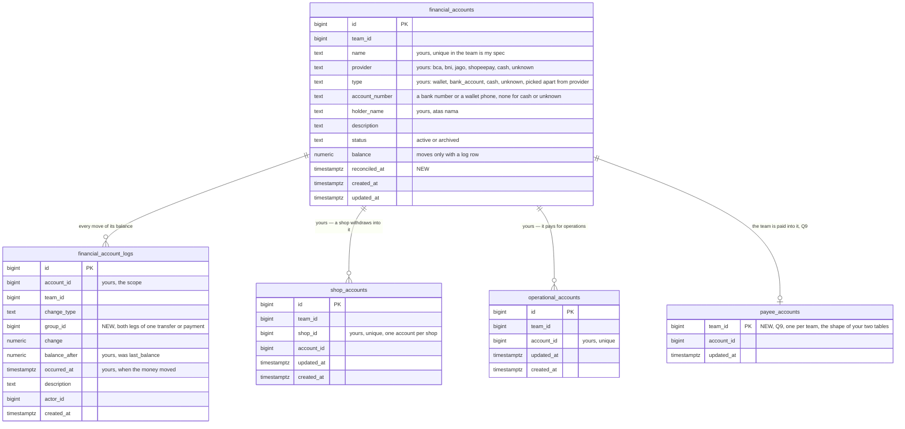

# Clarify — `financial_account/context.md`

What I read out of [context.md](./context.md), and what has to be settled beside it. **That doc is yours — this
one is mine.** An answered point is deleted; what you settled is in [context_decision.md](./context_decision.md).

🔄 **Re-examined through 2026-09-30 — newest first.**

| | |
| --- | --- |
| ✅ your §What Happen when if Payment Accepted *(lines 112–119)* | the acceptance carries the from and to account ids, and posts on each — as [a-team-payment-posts-on-accept](./context_decision.md#a-team-payment-posts-on-accept) records · its diagram parses · nothing new to decide |
| 🔄 elaborated | [Q9](#question) — which service holds the payee |
| 🔄 elaborated | Q9 — the core choice as A (one payee account) · B (ask in chat) · C (show every account), and why finality raises the stakes |
| ✅ answered in chat | a team payment posts only on acceptance, and the balance service's event carries the from and to account ids: [a-team-payment-posts-on-accept](./context_decision.md#a-team-payment-posts-on-accept) · ✅ and never reversed: [a-team-payment-is-never-reversed](./context_decision.md#a-team-payment-is-never-reversed) |
| 🔄 elaborated | Q9 — one payment end to end, and who names the payee · which account may be it · a change while a payment waits · archiving it |
| ✅ answered in chat | critique 2 — `type` and `provider` are picked apart: [type-and-provider-are-picked-apart](./context_decision.md#type-and-provider-are-picked-apart) · critique 1 — the cause is the `description`: [the-description-names-the-cause](./context_decision.md#the-description-names-the-cause) · both against my recommendation · **no critique left** |
| ✅ answered in chat, and your line 105 | critique 4 — an account opens with an `opening_balance` log row: [an-account-opens-with-a-log-row](./context_decision.md#an-account-opens-with-a-log-row) · critique 8 — archived only at zero: [an-account-is-archived-only-at-zero](./context_decision.md#an-account-is-archived-only-at-zero) · ⚠ line 105 repeats `opening_balance` — [reported](#contradiction) |
| ✅ your lines 43, 46–47, 90 | `account_type` is `provider`: [provider-replaces-account-type](./context_decision.md#provider-replaces-account-type) — critique 2 narrows to deriving `type` · `name` and `holder_name`: [an-account-has-a-name-and-a-holder](./context_decision.md#an-account-has-a-name-and-a-holder) — critique 3 adopted · `occurred_at`: [the-log-keeps-the-day-the-money-moved](./context_decision.md#the-log-keeps-the-day-the-money-moved) — critique 7 adopted · no new contradiction · lines below 45 moved down 2, below 89 down 3 |
| ✅ your line 82 | the log carries `account_id`: [every-log-row-names-its-account](./context_decision.md#every-log-row-names-its-account) · ⛔ the [log contradiction](#one-ledger-and-its-state-and-its-log-have-different-grains) closes, as recommended — **none left** · lines below 81 moved down 1 |
| ✅ answered in chat | two parts of Q9 — the team record holds no bank: its three columns are **dropped**, not copied (built: `team_service` `00008`): [the-team-record-holds-no-bank](./context_decision.md#the-team-record-holds-no-bank) · [Q9](#question) narrows to where a team is paid |
| 🔄 elaborated | Q9 — five parts: is it an account · where *where we are paid* lives · who sees it · where it shows · what happens to the three fields |
| ✅ your line 19 | `shop_id` is unique — a shop names one account: [a-shop-has-one-account](./context_decision.md#a-shop-has-one-account) · ⛔ the [shop-key contradiction](#a-table-that-must-decide-one-account-allows-several) closes, as recommended · *Smallest Grain Reports* removed from line 110's section |
| ✅ answered in chat, and your line 93 | Q13 — settlement's ads and the accounts are independent, nothing syncs: [settlement-ads-and-accounts-are-independent](./context_decision.md#settlement-ads-and-accounts-are-independent) · `ads_expense` joins the types: [ads-expense-joins-the-types](./context_decision.md#ads-expense-joins-the-types) · lines below 92 moved down 1 |
| 🔄 elaborated | Q13 — my *Marketplace balance* choice withdrawn: it counted a withheld ad in settlement and in expense, which [withheld-is-not-spent](../settlement/context_clarify.md#withheld-is-not-spent) rules out · now: a withheld ad is never an expense |
| ✅ answered in chat | Q12 — an unknown account is filled in or moved in: [an-unknown-account-is-filled-in-or-moved-in](./context_decision.md#an-unknown-account-is-filled-in-or-moved-in) · Q2 and Q3 — every restock and every expense **must** name the account that paid: [a-restock-must-name-the-account-that-paid](./context_decision.md#a-restock-must-name-the-account-that-paid) · [an-expense-must-name-the-account-that-paid](./context_decision.md#an-expense-must-name-the-account-that-paid) · the account required, against my *optional* · 🆕 [Q13](#question) — an ads charge the platform took from the seller balance |
| ✅ answered in chat, and your lines 57, 67 | Q11 — a shop with no row gets an account typed `unknown`: [a-shop-with-no-account-gets-an-unknown-one](./context_decision.md#a-shop-with-no-account-gets-an-unknown-one) · against my recommendation, and better than it · 🆕 [Q12](#question) — how an unknown account becomes the real one · ⛔ it sharpens the [shop key](#a-table-that-must-decide-one-account-allows-several) · lines below 56 moved down 1–2 |
| ✅ your two new tables | `shop_accounts` — [a-shop-names-the-account-it-withdraws-into](./context_decision.md#a-shop-names-the-account-it-withdraws-into) (Q1, as recommended) · `operational_accounts` — [operational-accounts-pay-for-operations](./context_decision.md#operational-accounts-pay-for-operations) (Q2's *which account*) · 🆕 [Q11](#question) — a shop with no row · ⛔ both keys allow several accounts where they must decide one — [Contradiction](#a-table-that-must-decide-one-account-allows-several) |
| ✅ your list | `revenue_fund` is `withdrawal` — revenue stays in settlement: [revenue-stays-in-settlement](./context_decision.md#revenue-stays-in-settlement) · the name against my recommendation · [Q1](#question) narrows to where a withdrawal lands |
| ✅ answered in chat | Q8 — for now the whole team sees, and admin and up move the money: [seeing-is-team-wide-moving-is-admin-and-up](./context_decision.md#seeing-is-team-wide-moving-is-admin-and-up) · the seeing half against my recommendation |
| ✅ answered in chat | Q10 — every type has one way in: [restock-is-never-typed-by-hand](./context_decision.md#restock-is-never-typed-by-hand), then [one-way-in-per-type](./context_decision.md#one-way-in-per-type) · 🔄 [Q1](#question) and [Q3](#question) narrow with it, to which account a withdrawal and an expense name |
| ✅ answered in chat | Q4's last half — an adjustment is only a reconcile's difference: [adjustment-is-for-reconciling-only](./context_decision.md#adjustment-is-for-reconciling-only) |
| ✅ your log section | `last_balance` is `balance_after`, as critique 5 recommended — [the-log-says-balance-after](./context_decision.md#the-log-says-balance-after) · ⚠ the log still has no account column, so the [contradiction](#one-ledger-and-its-state-and-its-log-have-different-grains) stands — and no cause (critique 1), no date (critique 7) |
| ✅ your list | `opening_balance`, `transfer`, `team_payment`, then `capital`, joined `change_type` — [opening-transfer-and-team-payment-join-the-types](./context_decision.md#opening-transfer-and-team-payment-join-the-types) · [capital-joins-the-types](./context_decision.md#capital-joins-the-types) |
| ✅ answered in chat | Q5, Q6, Q7 — each as recommended: [shopeepay-is-the-wallet-a-team-pays-with](./context_decision.md#shopeepay-is-the-wallet-a-team-pays-with) · [a-real-account-is-recorded-once](./context_decision.md#a-real-account-is-recorded-once) · [below-zero-is-warned-never-refused](./context_decision.md#below-zero-is-warned-never-refused) |
| ✅ closed with Q6 | the contradiction *account_number is unique, and a cash box has none* — the rule has its scope now. ⚠ Line 45 still reads *"its unique"* — yours to carry into the doc |
| ⚠ ripple of Q6 | [Q9](#question) — `team_infos` can hold one bank number in two teams today, and a copy into accounts takes it once |
| ✅ your line 13 | the two tables are one ledger — [the-accounts-are-one-ledger](./context_decision.md#the-accounts-are-one-ledger) |
| ✅ your §How we Update The Ledger | a row comes by hand or from the broker — [a-row-comes-by-hand-or-from-the-broker](./context_decision.md#a-row-comes-by-hand-or-from-the-broker) |
| 🆕 +1 | [Q10](#question) — which way each type comes in, and whether one may come both ways |
| ⛔ found | line 13 turns the log's missing account into a [contradiction](#one-ledger-and-its-state-and-its-log-have-different-grains) — the state is per account, the log per team |
| 🔄 withdrawn | my `FinancialAccountPost`, a write other services would call — the broker replaces it |
| 🔄 reshaped | Q1–Q4 — *posts itself* now means *comes from the broker*, and only settlement publishes today · the build order puts withdrawal second |

First pass: this is the *cash service* [order/context.md](../order/context.md) set aside on its line 13 — *"The
Cash, about withdrawal & platform wallet. we separate in other service"* — arriving where four built services
already touch a bank without naming one. **One question open, no critique, no contradiction.**

## What already moves money

| your doc | already in the build | on the broker | |
| --- | --- | --- | --- |
| a team's *Bank Account* | ✅ none — `team_infos`' three bank columns were dropped 2026-09-30, so a team's bank lives only here | — | [the-team-record-holds-no-bank](./context_decision.md#the-team-record-holds-no-bank) · [Q9](#question) |
| *Shopeepay* or a bank, as a way to pay | `restock_requests.payment_type` — `shopee_pay` or `bank_account`: the **kind** that paid, never **which** account | ❌ nothing published | ✅ [a-restock-must-name-the-account-that-paid](./context_decision.md#a-restock-must-name-the-account-that-paid) |
| `expense` | `expense_records` — typed by a manager, naming no account · `STOCK_LOSS` is posted by inventory and moves no cash | ❌ nothing published | ✅ [an-expense-must-name-the-account-that-paid](./context_decision.md#an-expense-must-name-the-account-that-paid) · [settlement-ads-and-accounts-are-independent](./context_decision.md#settlement-ads-and-accounts-are-independent) |
| `withdrawal` — was `revenue_fund` | settlement's `withdrawal` rows — imported, shop-addressed, successful only: money that reached the bank | ✅ `SettlementLogPosted` — the whole row | [Q1](#question) |
| — | `liability_payments` — one team paying another, recorded then confirmed; the money moves *"by bank outside this system"* | ❌ nothing published | ✅ [a type](./context_decision.md#opening-transfer-and-team-payment-join-the-types) |
| *Cash* | nothing — the courier's ask is a `restock_cost_lines` row the warehouse pays at the door, from no account | ❌ | ✅ [a-restock-must-name-the-account-that-paid](./context_decision.md#a-restock-must-name-the-account-that-paid) |

✅ **Two boundaries already hold, and your doc keeps both.** The team balance is *"not a wallet — no cash, no bank
account"* ([balance-manages-reports-and-takes-payments](../balance/context_decision.md#balance-manages-reports-and-takes-payments)),
and the marketplace wallet stays out of scope
([superseded-the-position-is-the-shortfall-not-the-wallet](../settlement/context_decision.md#superseded-the-position-is-the-shortfall-not-the-wallet)).
The money a team actually holds had no home. This is it.

Where the money physically goes — three moves have no type, and one has no account:



## Critique

| # | Problem | → Recommend |
| --- | --- | --- |
| **1** | ✅ **Decided, against my recommendation** — the cause is the `description`, no `source_id`: [the-description-names-the-cause](./context_decision.md#the-description-names-the-cause). Kept as a line so the numbers hold. | — |
| **2** | ✅ **Decided** — `provider` adopted, and `type` is picked apart from it, against my recommendation: [type-and-provider-are-picked-apart](./context_decision.md#type-and-provider-are-picked-apart). Kept as a line so the numbers hold. | — |
| **3** | ✅ **Adopted** — `name` and `holder_name`: [an-account-has-a-name-and-a-holder](./context_decision.md#an-account-has-a-name-and-a-holder). Kept as a line so the numbers hold. | — |
| **4** | ✅ **Adopted** — the opening balance is a log row: [an-account-opens-with-a-log-row](./context_decision.md#an-account-opens-with-a-log-row). Kept as a line so the numbers hold. | — |
| **5** | ✅ **Adopted** — `last_balance` is `balance_after` now: [the-log-says-balance-after](./context_decision.md#the-log-says-balance-after). Kept as a line so the numbers hold. | — |
| **6** | ✅ **Decided** — every movement has a type of its own, and an adjustment is only a reconcile's difference: [adjustment-is-for-reconciling-only](./context_decision.md#adjustment-is-for-reconciling-only). Kept as a line so the numbers hold. | — |
| **7** | ✅ **Adopted** — `occurred_at`: [the-log-keeps-the-day-the-money-moved](./context_decision.md#the-log-keeps-the-day-the-money-moved). Kept as a line so the numbers hold. | — |
| **8** | ✅ **Adopted** — archived only at zero: [an-account-is-archived-only-at-zero](./context_decision.md#an-account-is-archived-only-at-zero). Kept as a line so the numbers hold. | — |

## Recommendation

✅ **[the-act-posts-the-entry](#the-act-posts-the-entry) is decided** — how a row gets here
([a-row-comes-by-hand-or-from-the-broker](./context_decision.md#a-row-comes-by-hand-or-from-the-broker)) and which
way each type takes ([one-way-in-per-type](./context_decision.md#one-way-in-per-type)). What is left of it is small:
a row's cause is its `description` ([the-description-names-the-cause](./context_decision.md#the-description-names-the-cause)), and each publisher carries the
account it names — required: [a-restock-must-name-the-account-that-paid](./context_decision.md#a-restock-must-name-the-account-that-paid), [an-expense-must-name-the-account-that-paid](./context_decision.md#an-expense-must-name-the-account-that-paid).

🔄 **Build order**, settlement already publishing: **1.** accounts and the hand path · **2.** withdrawal — only the
listener is new · **3.** restock · **4.** expense · **5.** team payment — each of these needs its own event first.
Until a type is wired, a reconcile catches what it moved as an `adjustment` — which is honest: it was not recorded.

✅ **Nothing in your doc blocks the account screens now** — the log names its account. Left: [Q9](#question), which
shapes only the payee screens.

## Proposed Design

### The jobs

| who | does | how often |
| --- | --- | --- |
| a selling team's owner or admin | sees what the team holds, and where · tops ShopeePay up from the bank · checks each account against its bank app | daily · weekly |
| a CS | names the account that paid, when raising a restock | many times a day |
| a warehouse team's owner or admin | pays the courier's ask from the cash box · receives the selling teams' payments · counts the box | daily |
| root, admin | reads every team's accounts | weekly |

### the-act-posts-the-entry

| `change_type` | moves | way in | when |
| --- | --- | --- | --- |
| `opening_balance` ✅ | in | ✅ by hand only — creating the account | once — [an-account-opens-with-a-log-row](./context_decision.md#an-account-opens-with-a-log-row) |
| `withdrawal` ✅ | in | ✅ broker only — a `withdrawal` row on `SettlementLogPosted`, into its shop's account — ✅ an `unknown` one made for it when the shop has none | [a-shop-names-the-account-it-withdraws-into](./context_decision.md#a-shop-names-the-account-it-withdraws-into) · [a-shop-with-no-account-gets-an-unknown-one](./context_decision.md#a-shop-with-no-account-gets-an-unknown-one) |
| `restock` | out · in, for a refund | ✅ broker only — 🆕 a restock event naming the account that paid, always | created · an edit posts the difference · a refund on cancel — ✅ [a-restock-must-name-the-account-that-paid](./context_decision.md#a-restock-must-name-the-account-that-paid) |
| `expense` | out | ✅ broker only — 🆕 an expense event — every kind a person types but `ADS` | created · a void reverses it — ✅ [an-expense-must-name-the-account-that-paid](./context_decision.md#an-expense-must-name-the-account-that-paid) |
| `ads_expense` ✅ | out | ✅ broker only — the same expense event, when its kind is `ADS` — ⚠ my reading | created · a void reverses it — [ads-expense-joins-the-types](./context_decision.md#ads-expense-joins-the-types) |
| `transfer` ✅ | out of one, into another | ✅ by hand only — two legs, one act | when typed |
| `team_payment` ✅ | out of the payer, into the creditor | ✅ broker only — 🆕 the balance service's acceptance, carrying both account ids | the creditor accepts — [a-team-payment-posts-on-accept](./context_decision.md#a-team-payment-posts-on-accept) · never reversed: [a-team-payment-is-never-reversed](./context_decision.md#a-team-payment-is-never-reversed) |
| `capital` ✅ | in or out | ✅ by hand only — the business owner's own money | when typed |
| `adjustment` ✅ | in or out | ✅ by hand only — a reconcile; the difference, never typed | [adjustment-is-for-reconciling-only](./context_decision.md#adjustment-is-for-reconciling-only) |


✅ The two ways in, and which type takes which, are yours —
[one-way-in-per-type](./context_decision.md#one-way-in-per-type). Each new event should carry the **change**, never a level — a restock's edit
publishes the difference, not its new total — so events that arrive out of order still sum right. A row's cause is
its `description` ([the-description-names-the-cause](./context_decision.md#the-description-names-the-cause)), and a redelivered event still posts once — the listener claims its `event_id`
([one-contract-for-both-handler-types](../../technical/event_architecture/context_decision.md#one-contract-for-both-handler-types)).

### An account's life



| | active | archived |
| --- | --- | --- |
| a row by hand | ✅ | ❌ refused |
| a row from the broker | ✅ | ✅ posts — refused, it would dead-letter and be recorded nowhere |
| lists | ✅ | ✅ marked archived |
| pickers | ✅ | ❌ |
| its rows, and the causes they link to | ✅ | ✅ |

🆕 An `unknown` account ([a-shop-with-no-account-gets-an-unknown-one](./context_decision.md#a-shop-with-no-account-gets-an-unknown-one))
is `active` — `unknown` is a type, not a status — and stops being unknown as [an-unknown-account-is-filled-in-or-moved-in](./context_decision.md#an-unknown-account-is-filled-in-or-moved-in) says.

### Reconcile

✅ Decided — [adjustment-is-for-reconciling-only](./context_decision.md#adjustment-is-for-reconciling-only). The
manager types what the bank app shows — or what the cash box counts — and the difference posts. Nobody types an
adjustment's sign.



| | |
| --- | --- |
| a non-zero difference | needs a note — it is the one row that can hide missing cash |
| every account | shows *last checked* — a balance nobody checks is a number nobody should trust |
| a lost event | lands here: the publish is trusted ([no-outbox-the-publish-is-trusted](../../technical/event_architecture/context_decision.md#no-outbox-the-publish-is-trusted)), so a reconcile is what finds a row that never arrived |
| money | `double` on the wire, per [rupiah-is-floating-point](../order/context_decision.md#rupiah-is-floating-point) — stored `numeric` and rounded as it posts, that decision's own mitigations, so a reconcile compares exactly |

### The contract

| RPC | who | |
| --- | --- | --- |
| `FinancialAccountList` | every member of the team | guideline List · `GENERAL` — name, provider, number, holder, status · **no balance** · paginated (HARD RULE 9) — the picker asks a large first page |
| `FinancialAccountOverview` | every member of the team — [seeing-is-team-wide-moving-is-admin-and-up](./context_decision.md#seeing-is-team-wide-moving-is-admin-and-up) | guideline Overview · `BALANCE` — balance and last checked, per account · a total per kind |
| `FinancialAccountByIds` | anyone reading a row that names an account | guideline ByIds · `GENERAL` — a restock names *which* account paid, never what is left in it |
| `FinancialAccountCreate` | admin and up | name, provider, number, holder, description, opening balance → posts `opening_balance` · refused when the number is already registered ([a-real-account-is-recorded-once](./context_decision.md#a-real-account-is-recorded-once)) |
| `FinancialAccountUpdate` | admin and up | name, holder, description — provider and number are fixed: another number is another account |
| `FinancialAccountIdentify` 🆕 | admin and up | an `unknown` account → filled in as a new real one, or moved into one already registered — ✅ [an-unknown-account-is-filled-in-or-moved-in](./context_decision.md#an-unknown-account-is-filled-in-or-moved-in) |
| `FinancialAccountArchive` · `FinancialAccountRestore` | admin and up | archive refused unless the balance is zero |
| `FinancialAccountTransfer` | admin and up | from, to, amount, date, note → two legs sharing a `group_id` |
| `FinancialAccountCapital` | admin and up | in or out, amount, date, note ([capital-joins-the-types](./context_decision.md#capital-joins-the-types)) |
| `FinancialAccountReconcile` | admin and up | the figure the bank shows, the date, a note → [Reconcile](#reconcile) |
| `FinancialAccountLogList` | every member of the team | one account's rows, newest first, paginated, by type and date |
| `FinancialAccountShopSet` | admin and up | a shop's account — its `shop_accounts` row ([a-shop-names-the-account-it-withdraws-into](./context_decision.md#a-shop-names-the-account-it-withdraws-into)) |
| `FinancialAccountOperationalSet` | admin and up | marks or unmarks an account operational — `operational_accounts` ([operational-accounts-pay-for-operations](./context_decision.md#operational-accounts-pay-for-operations)) |
| `FinancialAccountPayeeSet` | admin and up | the account the team is paid into ([Q9](#question)) |
| `FinancialAccountPayee` | any team paying another — [Q9](#question) | the account a team is paid into — name, number, holder, never its balance |

🔄 No RPC for other services to write with — they publish, and the account listens:

| topic | exists | posts |
| --- | --- | --- |
| `settlement-log-posted` | ✅ | a `withdrawal` row → a `withdrawal` into its shop's account — a shop with none gets an `unknown` one first — the sign turned — money leaving the wallet is money arriving here · a reversal of one reverses it · every other settlement type is ignored |
| a restock topic | 🆕 inventory publishes | `restock` — the account that paid, and the change |
| an expense topic | 🆕 expense publishes | `expense`, or `ads_expense` when its kind is `ADS` — every expense a person types · settlement's ads never, [settlement-ads-and-accounts-are-independent](./context_decision.md#settlement-ads-and-accounts-are-independent) |
| a payment-accepted topic | 🆕 the balance service publishes | `team_payment` — out of `from_account_id`, into `to_account_id` ([a-team-payment-posts-on-accept](./context_decision.md#a-team-payment-posts-on-accept)) · no reversal topic: [a-team-payment-is-never-reversed](./context_decision.md#a-team-payment-is-never-reversed) |

### The data



| unique | why |
| --- | --- |
| `(team_id, name)` | a picker never shows two of the same |
| `(provider, account_number)` where a number exists — across all teams | ✅ one real account, one row — [a-real-account-is-recorded-once](./context_decision.md#a-real-account-is-recorded-once) |
| — a broker row | posts once by its `event_id`, claimed beside the write ([one-contract-for-both-handler-types](../../technical/event_architecture/context_decision.md#one-contract-for-both-handler-types)) — no key on the row |
| `shop_accounts (shop_id)` | ✅ yours — one account per shop, [a-shop-has-one-account](./context_decision.md#a-shop-has-one-account) |
| `operational_accounts (account_id)` | yours — an account is marked once |
| `payee_accounts (team_id)` | one place a team is paid ([Q9](#question)) |

### The screens

| where | what |
| --- | --- |
| `/financial-accounts` 🆕 | the team's accounts — name, provider, number, holder, balance, *last checked* · a warning on any account below zero ([below-zero-is-warned-never-refused](./context_decision.md#below-zero-is-warned-never-refused)) · a total per kind: bank, wallet, cash, unknown · **New account** · row menu: Transfer, Reconcile, Archive (a `ConfirmDialog`) · an `unknown` account warned *bank not named*, with **Which account is this?** ([an-unknown-account-is-filled-in-or-moved-in](./context_decision.md#an-unknown-account-is-filled-in-or-moved-in)) |
| `/financial-accounts/:id` 🆕 | the balance — warned while below zero — and its rows, newest first, paginated; each row shows its description · Transfer · Reconcile |
| the restock form | *Paid from* — `FinancialAccountSelect` over the team's operational accounts, replacing `PaymentTypeSelect` — **required** ([a-restock-must-name-the-account-that-paid](./context_decision.md#a-restock-must-name-the-account-that-paid)) · no operational account: the form cannot be sent |
| the expense form | *Paid from*, **required** ([an-expense-must-name-the-account-that-paid](./context_decision.md#an-expense-must-name-the-account-that-paid)) · on `ADS`, *taken from the seller balance? It is already in settlement* ([settlement-ads-and-accounts-are-independent](./context_decision.md#settlement-ads-and-accounts-are-independent)) |
| a team payment | *Paid from* on record · *Received into* on accept — both carried in the acceptance ([a-team-payment-posts-on-accept](./context_decision.md#a-team-payment-posts-on-accept)) |
| the shop detail | *Withdraws into* — its `shop_accounts` row ([a-shop-names-the-account-it-withdraws-into](./context_decision.md#a-shop-names-the-account-it-withdraws-into)) · *Unknown — not named yet* after a withdrawal found none ([a-shop-with-no-account-gets-an-unknown-one](./context_decision.md#a-shop-with-no-account-gets-an-unknown-one)) |
| `/financial-accounts` | mark an account *operational* ([operational-accounts-pay-for-operations](./context_decision.md#operational-accounts-pay-for-operations)) |
| the team detail | *Where we are paid* ([Q9](#question)) — the three bank fields are already gone ([the-team-record-holds-no-bank](./context_decision.md#the-team-record-holds-no-bank)) |

`FinancialAccountSelect` is one picker in `components/pickers/`, with its story. It names the account and shows no
balance — a person picking *which account paid* is recording a fact, and the balance is on the accounts page.

## Question

1. ✅ **Answered 2026-09-30 — each shop names the account it withdraws into**, as recommended: [a-shop-names-the-account-it-withdraws-into](./context_decision.md#a-shop-names-the-account-it-withdraws-into), revenue
   staying in settlement: [revenue-stays-in-settlement](./context_decision.md#revenue-stays-in-settlement). ⛔ Its key
   allows a shop two accounts — ✅ closed: [a-shop-has-one-account](./context_decision.md#a-shop-has-one-account) · a shop with no row: [a-shop-with-no-account-gets-an-unknown-one](./context_decision.md#a-shop-with-no-account-gets-an-unknown-one). Kept as a line so
   the numbers hold.

2. ✅ **Answered 2026-09-30 — every restock names, at create, the operational account that paid**, as recommended
   but required — no *not paid yet*: [a-restock-must-name-the-account-that-paid](./context_decision.md#a-restock-must-name-the-account-that-paid). Kept as a line so the numbers hold.

3. ✅ **Answered 2026-09-30 — every expense a person types names the account that paid**, required rather than
   optional: [an-expense-must-name-the-account-that-paid](./context_decision.md#an-expense-must-name-the-account-that-paid) · an ads charge taken from the seller balance: [settlement-ads-and-accounts-are-independent](./context_decision.md#settlement-ads-and-accounts-are-independent). Kept as a line so the
   numbers hold.

4. ✅ **Answered 2026-09-29 — all four types joined, and an adjustment is only a reconcile's difference**, as
   recommended: [opening-transfer-and-team-payment-join-the-types](./context_decision.md#opening-transfer-and-team-payment-join-the-types) ·
   [capital-joins-the-types](./context_decision.md#capital-joins-the-types) ·
   [adjustment-is-for-reconciling-only](./context_decision.md#adjustment-is-for-reconciling-only). Kept as a line so
   the numbers hold.

5. ✅ **Answered 2026-09-29 — `shopeepay` is the team's e-wallet**, never the Shopee seller balance, as recommended:
   [shopeepay-is-the-wallet-a-team-pays-with](./context_decision.md#shopeepay-is-the-wallet-a-team-pays-with). Kept as
   a line so the numbers hold.

6. ✅ **Answered 2026-09-29 — a real account is recorded once**, across all teams, a cash box exempt, as recommended:
   [a-real-account-is-recorded-once](./context_decision.md#a-real-account-is-recorded-once). Kept as a line so the
   numbers hold.

7. ✅ **Answered 2026-09-29 — below zero is warned, never refused**, as recommended:
   [below-zero-is-warned-never-refused](./context_decision.md#below-zero-is-warned-never-refused). Kept as a line so
   the numbers hold.

8. ✅ **Answered 2026-09-29 — for now the whole team sees, and admin and up move the money**, the seeing half
   against my recommendation: [seeing-is-team-wide-moving-is-admin-and-up](./context_decision.md#seeing-is-team-wide-moving-is-admin-and-up).
   Kept as a line so the numbers hold.

9. 🔄 **Narrowed — where is a team paid, and how does a payer find it?**
   ✅ The team record holds no bank — dropped, not copied, and a team's bank is only a financial account: [the-team-record-holds-no-bank](./context_decision.md#the-team-record-holds-no-bank).
   Until something marks *where we are paid*, no screen tells a payer in balance's Payment Flow where to transfer.
   **The core choice** — the acceptance carries a *to* account ([a-team-payment-posts-on-accept](./context_decision.md#a-team-payment-posts-on-accept)), and something has to
   tell the payer which one to transfer into:

   | | how the payer learns where to pay | what it costs |
   | --- | --- | --- |
   | **A → Recommend** | the creditor marks **one** account *where we are paid*; the payment form shows it and pre-fills *to* | one table, one picker on the accounts page |
   | B | nobody marks one — the payer asks the creditor in chat, and the creditor picks *to* when accepting | the number travels by chat, the step that sends money to an old account |
   | C | the payer sees **every** bank and wallet the creditor holds, and picks one | a team's whole list of accounts shown to every other team — and the payer guessing which one is watched |

   🆕 **Finality raises the stakes.** An acceptance can no longer be undone ([an-accepted-payment-is-final](../balance/context_decision.md#an-accepted-payment-is-final)), so a payment
   accepted into the wrong account stays there until a reconcile. A *to* pre-filled from one named account is the
   cheapest guard against that.

   With **A**, three parts, one recommendation each:

   | | **→ Recommend** | instead | why not |
   | --- | --- | --- | --- |
   | which one is *where we are paid* | a `payee_accounts` row, one per team — the shape of your `shop_accounts` | a flag on `financial_accounts` | a flag lets two accounts claim it — the table's key says *one* |
   | which service holds it | **financial accounts** — beside `shop_accounts` and `operational_accounts`, the other *which account is used for X* tables · the balance service reads it to draw *Pay to* and pre-fill *to* | the balance service, a payee id per team | the balance service would hold an id into another service's table, and financial accounts could not refuse archiving an account it does not know is the payee |
   | who sees it | anyone signed in, as the team detail was — its name, number and holder, **never its balance** | only teams it has a debt with | a payer finds out where to pay before the debt is on screen |
   | where it shows | the team detail's *Where we are paid* · the payment form's *Pay to* · *Received into* pre-filled on confirm ([opening-transfer-and-team-payment-join-the-types](./context_decision.md#opening-transfer-and-team-payment-join-the-types)) | the team detail only | the payer copies a number from another screen — the step that sends money to a stale one |

   One payment, end to end — Team A owes Team B:

   ```mermaid
   sequenceDiagram
     participant A as Team A — the payer
     participant L as balance — payment
     participant F as financial accounts
     participant B as Team B — the creditor
     A->>F: FinancialAccountPayee(B)
     F-->>A: Pay to — BCA 123, a.n. PT B — no balance
     A->>A: transfers by bank, outside the system
     A->>L: record — proof, Paid from BCA A, paid to BCA 123
     B->>L: confirm — Received into pre-filled BCA 123
     L-->>F: payment accepted — from BCA A, to BCA 123
     F->>F: team_payment — out of BCA A, into BCA 123
   ```

   And five cases the walk-through does not show, one recommendation each:

   | case | **→ Recommend** | why |
   | --- | --- | --- |
   | who names it | admin and up, `FinancialAccountPayeeSet` ([seeing-is-team-wide-moving-is-admin-and-up](./context_decision.md#seeing-is-team-wide-moving-is-admin-and-up)) | the same people who open and archive accounts |
   | which account may be it | the team's own, active, `bank_account` or `wallet` — never `cash`, never `unknown` | nobody can transfer into a cash box, and an `unknown` account has no number to show |
   | it changes while a payment waits | the payment keeps the account it was **shown** — *paid to BCA 123* — and confirm pre-fills that one, not today's | the money went where the payer was told; a new payee is for the next payment |
   | its account is archived | refused while it is the payee — name another first ([an-account-is-archived-only-at-zero](./context_decision.md#an-account-is-archived-only-at-zero) already needs it at zero) | a team would otherwise go quietly unpayable |
   | no payee named yet | the payment can still be recorded — the form says *this team has not named where it is paid* | the debt is real either way; the payer asks the creditor |

   ✅ The payment holds both account ids, and the acceptance carries them: [a-team-payment-posts-on-accept](./context_decision.md#a-team-payment-posts-on-accept).

10. ✅ **Answered 2026-09-29 — every type has one way in**, as recommended:
    [restock-is-never-typed-by-hand](./context_decision.md#restock-is-never-typed-by-hand), then
    [one-way-in-per-type](./context_decision.md#one-way-in-per-type). Kept as a line so the numbers hold.

11. ✅ **Answered 2026-09-30 — a shop with no row gets an account typed `unknown`**, against my recommendation of
    holding the withdrawal, and better than it:
    [a-shop-with-no-account-gets-an-unknown-one](./context_decision.md#a-shop-with-no-account-gets-an-unknown-one).
    Kept as a line so the numbers hold.

12. ✅ **Answered 2026-09-30 — an unknown account is filled in, or moved into the real one**, as recommended:
    [an-unknown-account-is-filled-in-or-moved-in](./context_decision.md#an-unknown-account-is-filled-in-or-moved-in). Kept as a line so the numbers hold.

13. ✅ **Answered 2026-09-30 — settlement's ads and the accounts are independent**, and nothing syncs between them;
    *Paid from* on `ADS` is required with no exception: [settlement-ads-and-accounts-are-independent](./context_decision.md#settlement-ads-and-accounts-are-independent) — and an ad posts as `ads_expense`: [ads-expense-joins-the-types](./context_decision.md#ads-expense-joins-the-types).
    Kept as a line so the numbers hold.

14. ✅ **Answered 2026-10-01 — there is no reversal to hear.** The balance service made an accepted payment final and
    removed its reverse: [a-team-payment-is-never-reversed](./context_decision.md#a-team-payment-is-never-reversed).
    Kept as a line so the numbers hold.

# Contradiction

## one ledger, and its state and its log have different grains

✅ **Closed 2026-09-30, as recommended** — line 82 adds `account_id` to the log: [every-log-row-names-its-account](./context_decision.md#every-log-row-names-its-account). The state and the log share
one scope, the account, so `balance_after` is one account's running balance again. Kept as a heading so the links
to it hold.

## a-table-that-must-decide-one-account-allows-several

✅ **Closed 2026-09-30, as recommended** — line 19 now reads *"`shop_id`, its unique."*: [a-shop-has-one-account](./context_decision.md#a-shop-has-one-account). A shop names one
account, and two withdrawals from a new shop can no longer make two `unknown` accounts. `operational_accounts` keeps
several per team, as it should. Kept as a heading so the links to it hold.

✅ **Closed — *account_number is unique, and a cash box has none*** (line 45 against lines 58 and 64): the rule now
has its scope, [a-real-account-is-recorded-once](./context_decision.md#a-real-account-is-recorded-once) — unique per
provider and number across all teams, a cash box exempt. ⚠ Line 45 still reads only *"its unique"* — yours to carry
into the doc.

⚠ **A repeated line:** `opening_balance` is listed twice in `change_type` — lines 101 and 105. One of them to delete.

⚠ **One in another of yours:** `technical/architecture/context.md` §Microservice lists no financial account
service — reported in [its clarify](../../technical/architecture/context_clarify.md).

# Awaiting

- **§General *(line 3)* is empty.** Who reads these accounts, and to decide what, is the first thing it could say —
  [The jobs](#the-jobs) is my reading.
- **No technical doc yet** — `docs/technical/financial_account/` is where each new event's shape gets decided.
- 🆕 **§Financial Analytical Reports Design *(line 122)* is started** — a heading only now; *Smallest Grain Reports* was
  removed. No content yet. Read when it has some.
