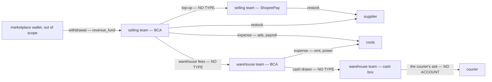
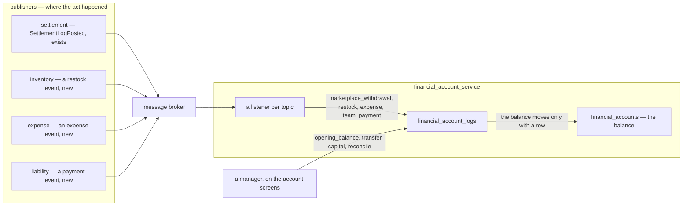
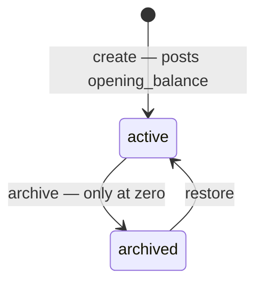
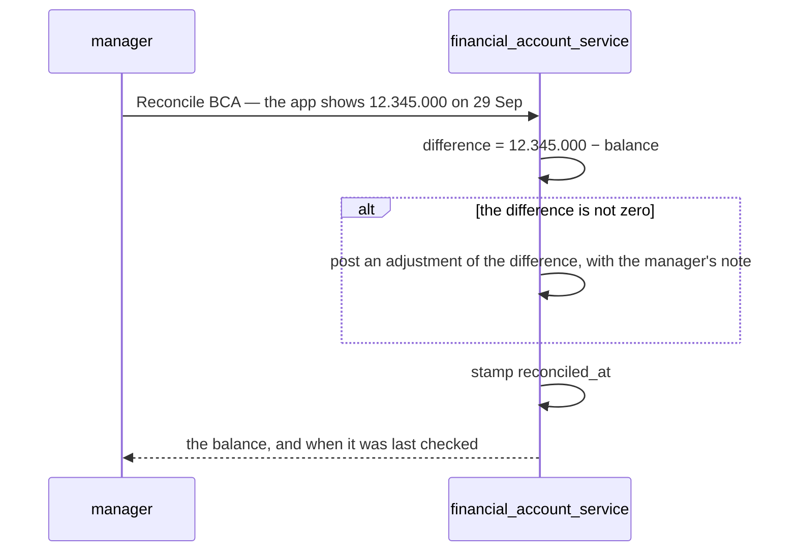
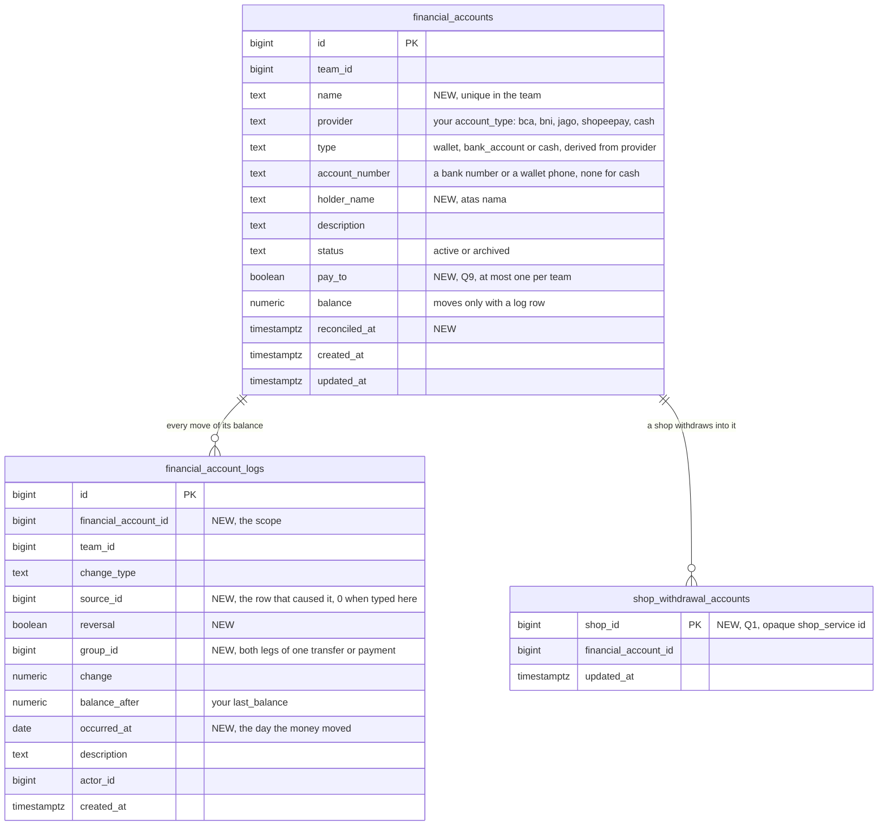
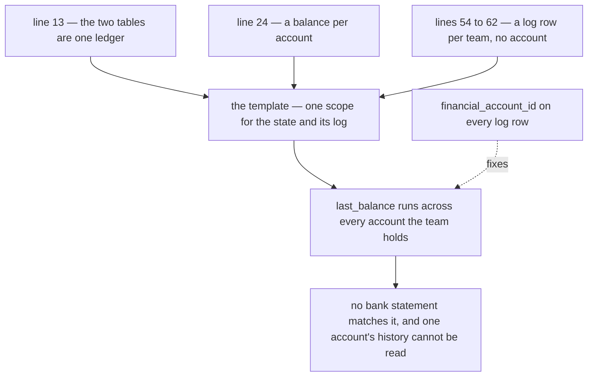
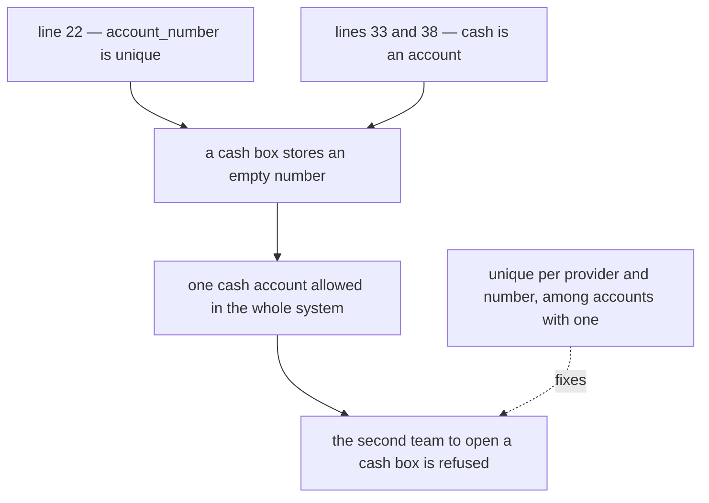

# Clarify — `financial_account/context.md`

What I read out of [context.md](./context.md), and what has to be settled beside it. **That doc is yours — this
one is mine.** An answered point is deleted; what you settled is in [context_decision.md](./context_decision.md).

🔄 **Second pass, 2026-09-29 — after your edit.**

| | |
| --- | --- |
| ✅ your line 13 | the two tables are one ledger — [the-accounts-are-one-ledger](./context_decision.md#the-accounts-are-one-ledger) |
| ✅ your §How we Update The Ledger | a row comes by hand or from the broker — [a-row-comes-by-hand-or-from-the-broker](./context_decision.md#a-row-comes-by-hand-or-from-the-broker) |
| 🆕 +1 | [Q10](#question) — which way each type comes in, and whether one may come both ways |
| ⛔ found | line 13 turns the log's missing account into a [contradiction](#one-ledger-and-its-state-and-its-log-have-different-grains) — the state is per account, the log per team |
| 🔄 withdrawn | my `FinancialAccountPost`, a write other services would call — the broker replaces it |
| 🔄 reshaped | Q1–Q4 — *posts itself* now means *comes from the broker*, and only settlement publishes today · the build order puts withdrawal second |

First pass: this is the *cash service* [order/context.md](../order/context.md) set aside on its line 13 — *"The
Cash, about withdrawal & platform wallet. we separate in other service"* — arriving where four built services
already touch a bank without naming one. **Ten questions, eight critiques, two contradictions.**

## What already moves money

| your doc | already in the build | on the broker | |
| --- | --- | --- | --- |
| a team's *Bank Account* | `team_infos.bank_type` · `bank_owner_name` · `bank_account_number` — **one** bank per team, on the team detail, so other teams know where to pay | — | [Q9](#question) |
| *Shopeepay* or a bank, as a way to pay | `restock_requests.payment_type` — `shopee_pay` or `bank_account`: the **kind** that paid, never **which** account | ❌ nothing published | [Q2](#question) |
| `expense` | `expense_records` — typed by a manager, naming no account · `STOCK_LOSS` is posted by inventory and moves no cash | ❌ nothing published | [Q3](#question) |
| `revenue_fund` | settlement's `withdrawal` rows — imported, shop-addressed, successful only: money that reached the bank | ✅ `SettlementLogPosted` — the whole row | [Q1](#question) |
| — | `liability_payments` — one team paying another, recorded then confirmed; the money moves *"by bank outside this system"* | ❌ nothing published | [Q4](#question) |
| *Cash* | nothing — the courier's ask is a `restock_cost_lines` row the warehouse pays at the door, from no account | ❌ | [Q2](#question) |

✅ **Two boundaries already hold, and your doc keeps both.** The team balance is *"not a wallet — no cash, no bank
account"* ([balance-manages-reports-and-takes-payments](../balance/context_decision.md#balance-manages-reports-and-takes-payments)),
and the marketplace wallet stays out of scope
([superseded-the-position-is-the-shortfall-not-the-wallet](../settlement/context_decision.md#superseded-the-position-is-the-shortfall-not-the-wallet)).
The money a team actually holds had no home. This is it.

Where the money physically goes — three moves have no type, and one has no account:

## Critique

| # | Problem | → Recommend |
| --- | --- | --- |
| **1** | 🔄 **A log row names no cause.** `description` *(line 60)* is text, so *why did BCA drop 2.000.000?* cannot open the restock behind it, and a correction has nothing to point at. Its missing **account** is now a [contradiction](#one-ledger-and-its-state-and-its-log-have-different-grains). | `source_id` beside `change_type` — the settlement, restock, expense or payment row behind it — and `reversal`. On the broker path the cause is already in the event (`log_id` on `SettlementLogPosted`), so keeping it costs nothing. |
| **2** | **`type` and `account_type` can disagree** *(lines 19–20)*. The provider decides the kind — `bca` is a bank, `shopeepay` a wallet — and `cash` sits in both lists. Two columns that must agree, and nothing making them: a `bank_account` whose provider is `shopeepay`. | The person picks the **provider**; the server derives the kind from one fixed table. Rename `account_type` → `provider` — *type* and *account type* read as the same word. A new bank (Mandiri, BRI, SeaBank) is an append to the list, never free text: the provider is what will pick a bank-statement reader later, as the marketplace picks the settlement reader. |
| **3** | **An account has no name and no holder.** A team with two BCA accounts tells them apart by ten digits in every picker. And the holder — *atas nama* — is what a payer checks before transferring; `team_infos.bank_owner_name` exists for exactly that. | `name` — required, unique in the team (*BCA Operasional*, *Kas Gudang*) — and `holder_name`. |
| **4** | **An account opens with no row.** One registered with Rp 50.000.000 already in it either starts at 0 — wrong on day one — or sets `balance` with no log row, which the ledger your line 13 names forbids: *"cannot change the `State` without log recorded"*. | Creating an account posts its first row, `opening_balance`. |
| **5** | **`last_balance` reads both ways** *(line 59)*. On a log row, *last* can mean before this change or after it. | `balance_after`, the template's word — then `balance_after = previous + change` reads straight off the row. |
| **6** | **`adjustment` is the only type for anything off the list — so it will mean everything.** A ShopeePay top-up, cash drawn at an ATM, a fee paid to the warehouse: each lands as an adjustment, and the one total that should say *money we failed to record* says nothing. | `adjustment` means reconciling only — [Q4](#question) gives the rest a type — and it is **derived, never typed**: the manager types what the bank app shows, and the difference posts ([Reconcile](#reconcile)). |
| **7** | **The date the money moved is not kept.** `created_at` is when someone typed it. Yesterday's transfer typed this morning files under today, while the bank statement lists yesterday — the two never line up. | `occurred_at`. A broker row already has it — every event carries when its fact happened — so only a hand row needs a date picked, defaulting to today. The running balance still follows entry order. |
| **8** | **An archived account can hold money.** Nothing says what `archived` *(line 48)* stops, or whether an account holding Rp 3.000.000 may be archived — its money then drops out of the team's total, or sits in a total nobody can spend. | Archive only at zero — transfer or reconcile first. An archived account takes no row **by hand**, stays readable everywhere, and can be restored. 🆕 A row **from the broker** still posts — refused, it would dead-letter — so the pickers stop offering an archived account, and a row that lands anyway shows as money to move out. |

## Recommendation

**[the-act-posts-the-entry](#the-act-posts-the-entry)** — a row is posted by the act that moved the money, once,
naming it. ✅ **How** it gets here is now yours: from the broker
([a-row-comes-by-hand-or-from-the-broker](./context_decision.md#a-row-comes-by-hand-or-from-the-broker)). What is
left is **which way each type takes** — [Q10](#question): the hand path types only what no other service knows — an
opening balance, a transfer, capital, a reconcile — and every other type comes from the broker, never both.

Typed by hand **and** heard from the broker, one payment is two rows — the restock's event posts 1.200.000, someone
types 1.250.000, and neither knows the other exists.

🔄 **Build order**, reordered because settlement already publishes: **1.** accounts and the hand path ·
**2.** withdrawal — `SettlementLogPosted` already carries it, so only the listener is new · **3.** restock ·
**4.** expense · **5.** team payment — each of these needs its own event first. Until a type is wired, a reconcile
catches what it moved as an `adjustment` — which is honest: it was not recorded.

**Answer first:** [Q10](#question) and [Q4](#question) together decide every form; [Q8](#question) decides which
screens show a balance at all.

## Proposed Design

### The jobs

| who | does | how often |
| --- | --- | --- |
| a selling team's owner or admin | sees what the team holds, and where · tops ShopeePay up from the bank · checks each account against its bank app | daily · weekly |
| a CS | names the account that paid, when raising a restock | many times a day |
| a warehouse team's owner or admin | pays the courier's ask from the cash box · receives the selling teams' payments · counts the box | daily |
| root, admin | reads every team's accounts | weekly |

### the-act-posts-the-entry

| `change_type` | moves | way in | when |
| --- | --- | --- | --- |
| `opening_balance` 🆕 | in | by hand — creating the account | once |
| `marketplace_withdrawal` — your `revenue_fund` | in | broker — a `withdrawal` row on `SettlementLogPosted`, into its shop's account | [Q1](#question) |
| `restock` | out · in, for a refund | broker — 🆕 a restock event naming the account that paid | created · an edit posts the difference · a refund on cancel — [Q2](#question) |
| `expense` | out | broker — 🆕 an expense event, when the expense names an account | created · a void reverses it — [Q3](#question) |
| `transfer` 🆕 | out of one, into another | by hand — two legs, one act | [Q4](#question) |
| `team_payment` 🆕 | out of the payer, into the creditor | broker — 🆕 a payment event | the creditor confirms · a reversal reverses both — [Q4](#question) |
| `capital` 🆕 | in or out | by hand — the business owner's own money | [Q4](#question) |
| `adjustment` | in or out | by hand — a reconcile; the difference, never typed | [Reconcile](#reconcile) |

✅ The two ways in are yours. Each new event should carry the **change**, never a level — a restock's edit
publishes the difference, not its new total — so events that arrive out of order still sum right. And every row
names its cause, so the Financial Ledger ([ledger/context.md](../ledger/context.md)) can pair it with the cause's own
log instead of counting one payment twice.

### An account's life

| | active | archived |
| --- | --- | --- |
| a row by hand | ✅ | ❌ refused |
| a row from the broker | ✅ | ✅ posts — refused, it would dead-letter and be recorded nowhere |
| lists | ✅ | ✅ marked archived |
| pickers | ✅ | ❌ |
| its rows, and the causes they link to | ✅ | ✅ |

### Reconcile

The manager types what the bank app shows — or what the cash box counts — and the difference posts. Nobody types an
adjustment's sign.

| | |
| --- | --- |
| a non-zero difference | needs a note — it is the one row that can hide missing cash |
| every account | shows *last checked* — a balance nobody checks is a number nobody should trust |
| a lost event | lands here: the publish is trusted ([no-outbox-the-publish-is-trusted](../../technical/event_architecture/context_decision.md#no-outbox-the-publish-is-trusted)), so a reconcile is what finds a row that never arrived |
| money | `double` on the wire, per [rupiah-is-floating-point](../order/context_decision.md#rupiah-is-floating-point) — stored `numeric` and rounded as it posts, that decision's own mitigations, so a reconcile compares exactly |

### The contract

| RPC | who | |
| --- | --- | --- |
| `FinancialAccountList` | every member who names an account on a form | guideline List · `GENERAL` — name, provider, number, holder, status · **no balance** · paginated (HARD RULE 9) — the picker asks a large first page |
| `FinancialAccountOverview` | managers — [Q8](#question) | guideline Overview · `BALANCE` — balance and last checked, per account · a total per kind |
| `FinancialAccountByIds` | anyone reading a row that names an account | guideline ByIds · `GENERAL` — a restock names *which* account paid, never what is left in it |
| `FinancialAccountCreate` | managers | name, provider, number, holder, description, opening balance → posts `opening_balance` |
| `FinancialAccountUpdate` | managers | name, holder, description, *where we are paid* ([Q9](#question)) — provider and number are fixed: another number is another account |
| `FinancialAccountArchive` · `FinancialAccountRestore` | managers | archive refused unless the balance is zero |
| `FinancialAccountTransfer` | managers | from, to, amount, date, note → two legs sharing a `group_id` |
| `FinancialAccountCapital` | managers | in or out, amount, date, note ([Q4](#question)) |
| `FinancialAccountReconcile` | managers | the figure the bank shows, the date, a note → [Reconcile](#reconcile) |
| `FinancialAccountLogList` | managers | one account's rows, newest first, paginated, by type and date |
| `FinancialAccountShopSet` | managers | the account a shop withdraws into ([Q1](#question)) |
| `FinancialAccountPayee` | any team paying another — [Q9](#question) | the account a team is paid into — name, number, holder, never its balance |

🔄 No RPC for other services to write with — they publish, and the account listens:

| topic | exists | posts |
| --- | --- | --- |
| `settlement-log-posted` | ✅ | a `withdrawal` row → `marketplace_withdrawal` into its shop's account, the sign turned — money leaving the wallet is money arriving here · a reversal of one reverses it · every other settlement type is ignored |
| a restock topic | 🆕 inventory publishes | `restock` — the account that paid, and the change |
| an expense topic | 🆕 expense publishes | `expense` — only when the expense names an account |
| a payment topic | 🆕 liability publishes | `team_payment` — both legs on confirm, reversed on a reversal |

### The data

| unique | why |
| --- | --- |
| `(team_id, name)` | a picker never shows two of the same |
| `(provider, account_number)` where a number exists — across all teams | one real account, one row ([Q6](#question), [Contradiction](#contradiction)) |
| `(financial_account_id, change_type, source_id, reversal)` where `source_id <> 0` | one cause posts once |
| `(team_id)` where `pay_to` | one place a team is paid ([Q9](#question)) |

### The screens

| where | what |
| --- | --- |
| `/financial-accounts` 🆕 | the team's accounts — name, provider, number, holder, balance, *last checked* · a total per kind: bank, wallet, cash · **New account** · row menu: Transfer, Reconcile, Archive (a `ConfirmDialog`) |
| `/financial-accounts/:id` 🆕 | the balance and its rows, newest first, paginated — each row links to its cause · Transfer · Reconcile |
| the restock form | *Paid from* — `FinancialAccountSelect` replaces `PaymentTypeSelect` ([Q2](#question)) |
| the expense form | *Paid from*, optional ([Q3](#question)) |
| a team payment | *Paid from* on record · *Received into* on confirm ([Q4](#question)) |
| the shop detail | *Withdraws into* ([Q1](#question)) |
| the team detail | *Where we are paid* replaces the three bank fields ([Q9](#question)) |

`FinancialAccountSelect` is one picker in `components/pickers/`, with its story. It is shown to people who may not
see a balance, so it shows none.

## Question

1. 🔄 **Is `revenue_fund` a marketplace withdrawal reaching the bank — and does it come from the broker?** *(line 69)*
   **→ Recommend yes, and yes.** `SettlementLogPosted` already carries every successful withdrawal as a
   shop-addressed row ([withdrawal-is-a-settlement-type](../settlement/context_decision.md#withdrawal-is-a-settlement-type),
   [only-a-successful-withdrawal-is-recorded](../settlement/settlement_importer_decision.md#only-a-successful-withdrawal-is-recorded)),
   so only the listener is new. Each shop names the account it withdraws into — one per shop — and the row posts
   there. Rename it `marketplace_withdrawal` — settlement's `fund` is a different moment of the same money (the
   platform paying the wallet), and two *funds* invite reading one as the other.
   ⚠ A shop that names no account yet: its withdrawals are held, and post when one is named — refused, they would
   dead-letter.

2. 🔄 **Which account paid a restock, how much, and when?** *(line 70)*
   **→ Recommend: the restock names the account it was paid from**, replacing `payment_type`, whose kind the
   account already carries. Inventory publishes the change — goods plus shipping when the restock is created, the
   difference on an edit, a refund when a cancel says the money came back. The warehouse's cost lines — the
   courier's ask at the door — name an account too, usually its cash box. It also supplies what
   [purchasing-is-the-restock-document](../../technical/architecture/context_clarify.md#purchasing-is-the-restock-document)
   found missing: a cash account and a payment moment. ⚠ Inventory publishes nothing today — the event is new.

3. 🔄 **Where is an expense typed — here, or in `expense_service`?** *(line 67)*
   **→ Recommend `expense_service`, once, with an optional *paid from* account.** It publishes the expense and the
   account hears it; a void publishes the reversal. An expense naming no account moves none — and two kinds must
   name none: `STOCK_LOSS` (goods written off, no cash moved) and an ads charge the platform took from the seller
   balance (that is a settlement row). ⚠ Expense publishes nothing today — the event is new.

4. **What else moves money — and is `adjustment` for reconciling only?** *(lines 66–70)*
   **→ Recommend four more types, and yes.**
   `opening_balance` — an account's first row.
   `transfer` — between the team's own accounts: a ShopeePay top-up, cash drawn from the bank. Two legs, one act.
   `team_payment` — out of the payer's account and into the creditor's **when the creditor confirms** — the moment
   the team balance moves, so the two never disagree about what has been paid. Until then the payer's account shows
   it *awaiting confirmation*. 🔄 Liability publishes the confirm — an event that is new.
   `capital` — the business owner's own money, put in or taken out.
   Then `adjustment` only ever means *money we did not record* — worth reading every week.

5. **Is `shopeepay` the e-wallet a team pays suppliers with — not the Shopee seller balance?** *(lines 8, 42)*
   **→ Recommend yes.** It is what `restock_requests.payment_type` already calls `shopee_pay`. The seller balance
   stays out of scope — *"we dont care about shop wallet"*
   ([superseded-the-position-is-the-shortfall-not-the-wallet](../settlement/context_decision.md#superseded-the-position-is-the-shortfall-not-the-wallet)).
   ⚠ If it **is** the seller balance, every settlement row — `fund`, every fee — posts here, and that decision reopens.

6. **Is a real account recorded once, across all teams?** *(line 22)* — see [Contradiction](#contradiction).
   **→ Recommend yes — unique per provider and number, across all teams.** Registered in two teams, one BCA account
   is two balances of the same money: neither matches the bank, and the business-wide total counts it twice. If two
   teams really share one account, it is one team's account, and the other's money in it is owed between them — a
   team-balance question, not a second copy of the account.

7. **May an account go below zero?**
   **→ Recommend: never refused, always shown.** The money already left; a refusal only stops the record of it.
   Below zero means an inflow was never recorded — the account carries a warning until a reconcile or the missing row
   fixes it. 🆕 And the broker path cannot refuse at all, so a refusal could only ever bind a hand row — a rule that
   would depend on which way the money came.

8. **Who sees a balance, and who moves one?**
   **→ Recommend the team's managers** — owner and admin of the role family matching the team's type
   ([warehouse-roles-count-as-their-own-team](../balance/context_decision.md#warehouse-roles-count-as-their-own-team))
   — plus root and admin: they see balances, open and archive accounts, and type every hand row — a transfer,
   capital, a reconcile. No finance role, as with expenses. Anyone who raises an act naming an account — a CS raising
   a restock — picks it by **name**, from a list with no balance in it.

9. **Is the bank on the team record one of the team's financial accounts?**
   **→ Recommend yes.** A team marks one account *where we are paid*; a payer sees its name, number and holder —
   never its balance — on the payment form. `team_infos`' three bank fields retire, each copied into an account
   first. Otherwise one bank is typed in two places, and the day one is edited a payer is sent to the other.

10. 🆕 **Which way does each type come in — and may one come both ways?** *(lines 72–74)*
    **→ Recommend one way per type, fixed.** **By hand** — `opening_balance`, `transfer`, `capital`, and
    `adjustment` as a reconcile: no other service knows them. **From the broker** — `marketplace_withdrawal`,
    `restock`, `expense`, `team_payment`: the act already happened in another service. The hand form never offers a
    broker type — typed here and heard from the broker, one payment posts twice, and nothing can tell which row is
    the copy.

# Contradiction

## one ledger, and its state and its log have different grains

> line 13 — *"for the ledger, we have `financial_accounts` and `financial_account_logs`"* · line 24 — `balance` on
> each **account** row · lines 54–62 — the log carries `team_id` and **no account**.

The template gives a ledger **one** scope, shared by its state and its log — *"scope is use smallest grain to track
ledger balance"* ([mutation_and_ledger.md](../../technical/ledger/mutation_and_ledger.md) §Scope). Here the state's
grain is the account and the log's is the team, so `last_balance` is a running total of every account the team
holds — a number no bank shows — and one account's history cannot be read back out of it.

**Which is wrong:** lines 54–62 — the log is missing its scope. Line 13 is right, and it is what makes the gap
visible: before it, the log could have been read as a team-wide journal of its own.

**→ Recommend:** `financial_account_id` on every log row; `team_id` stays as a copy. What stops it recurring: a
ledger's field list starts with its scope — the template's ERD puts `scope` right after the id.

## account_number is unique, and a cash box has none

> line 22 — *"`account_number`, its unique"* · lines 33 and 38 — `cash` is a `type` and an `account_type`.

A cash box has no number. Stored as `''`, the unique rule lets **one** cash account exist in the whole system — the
second team to open a box is refused. Stored as `NULL`, the rule says nothing about cash at all.

**Which is wrong:** line 22 — it names a rule without its scope. Cash is right to be an account: the warehouse's box
is the one that pays the courier.

**→ Recommend:** unique per `(provider, account_number)`, among accounts that have a number, across all teams
([Q6](#question)). What stops it recurring: say per kind what the number **is** — a bank's is the account number, a
wallet's is its phone number, cash has none.

⚠ **One in another of yours:** `technical/architecture/context.md` §Microservice lists no financial account
service — reported in [its clarify](../../technical/architecture/context_clarify.md).

# Awaiting

- **§General *(line 3)* is empty.** Who reads these accounts, and to decide what, is the first thing it could say —
  [The jobs](#the-jobs) is my reading.
- 🔄 **The two ways in are named; which type takes which is not** — [Q10](#question), and
  [the-act-posts-the-entry](#the-act-posts-the-entry) is my proposal for it.
- **No technical doc yet** — `docs/technical/financial_account/` is where each new event's shape gets decided.
