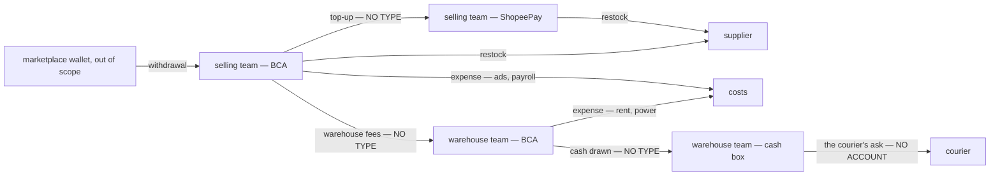
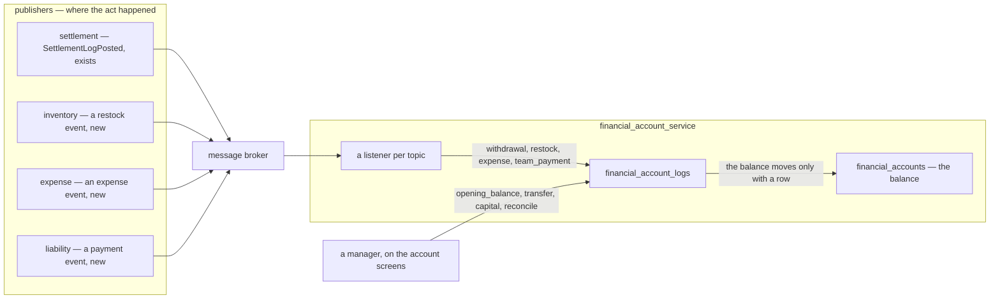
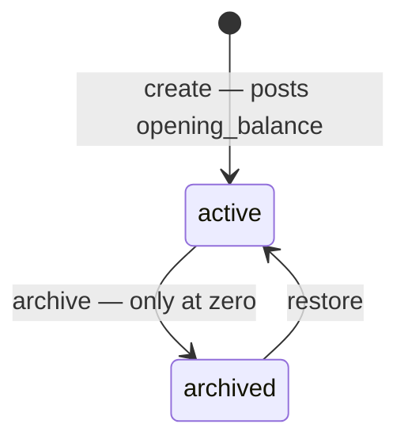
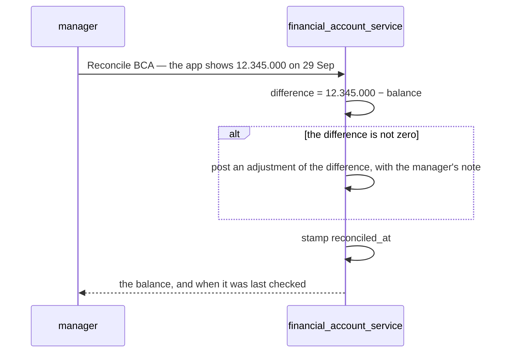
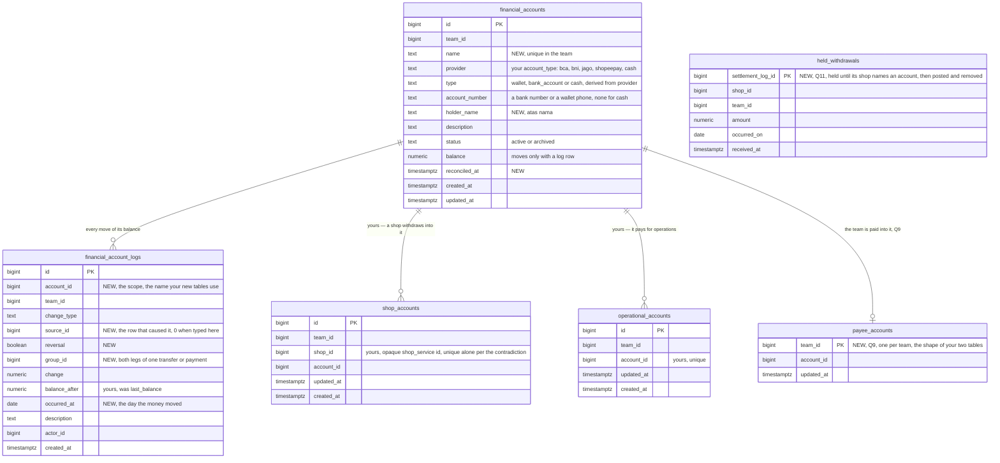
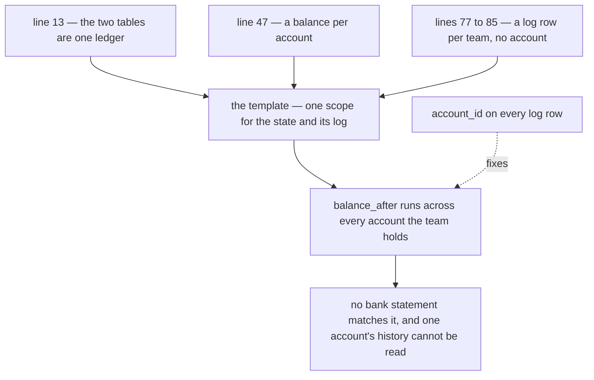
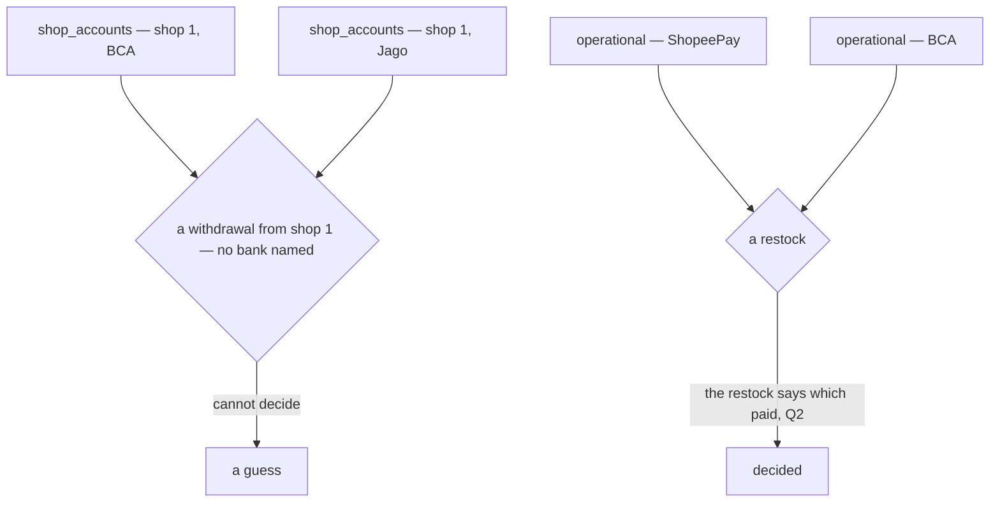

# Clarify — `financial_account/context.md`

What I read out of [context.md](./context.md), and what has to be settled beside it. **That doc is yours — this
one is mine.** An answered point is deleted; what you settled is in [context_decision.md](./context_decision.md).

🔄 **Re-examined through 2026-09-29 — newest first.**

| | |
| --- | --- |
| ✅ your two new tables | `shop_accounts` — [a-shop-names-the-account-it-withdraws-into](./context_decision.md#a-shop-names-the-account-it-withdraws-into) (Q1, as recommended) · `operational_accounts` — [operational-accounts-pay-for-operations](./context_decision.md#operational-accounts-pay-for-operations) (Q2's *which account*) · 🆕 [Q11](#question) — a shop with no row · ⛔ both keys allow several accounts where they must decide one — [Contradiction](#a-table-that-must-decide-one-account-allows-several) |
| ✅ your list | `revenue_fund` is `withdrawal` — revenue stays in settlement: [revenue-stays-in-settlement](./context_decision.md#revenue-stays-in-settlement) · the name against my recommendation · [Q1](#question) narrows to where a withdrawal lands |
| ✅ answered in chat | Q8 — for now the whole team sees, and admin and up move the money: [seeing-is-team-wide-moving-is-admin-and-up](./context_decision.md#seeing-is-team-wide-moving-is-admin-and-up) · the seeing half against my recommendation |
| ✅ answered in chat | Q10 — every type has one way in: [restock-is-never-typed-by-hand](./context_decision.md#restock-is-never-typed-by-hand), then [one-way-in-per-type](./context_decision.md#one-way-in-per-type) · 🔄 [Q1](#question) and [Q3](#question) narrow with it, to which account a withdrawal and an expense name |
| ✅ answered in chat | Q4's last half — an adjustment is only a reconcile's difference: [adjustment-is-for-reconciling-only](./context_decision.md#adjustment-is-for-reconciling-only) |
| ✅ your log section | `last_balance` is `balance_after`, as critique 5 recommended — [the-log-says-balance-after](./context_decision.md#the-log-says-balance-after) · ⚠ the log still has no account column, so the [contradiction](#one-ledger-and-its-state-and-its-log-have-different-grains) stands — and no cause (critique 1), no date (critique 7) |
| ✅ your list | `opening_balance`, `transfer`, `team_payment`, then `capital`, joined `change_type` — [opening-transfer-and-team-payment-join-the-types](./context_decision.md#opening-transfer-and-team-payment-join-the-types) · [capital-joins-the-types](./context_decision.md#capital-joins-the-types) |
| ✅ answered in chat | Q5, Q6, Q7 — each as recommended: [shopeepay-is-the-wallet-a-team-pays-with](./context_decision.md#shopeepay-is-the-wallet-a-team-pays-with) · [a-real-account-is-recorded-once](./context_decision.md#a-real-account-is-recorded-once) · [below-zero-is-warned-never-refused](./context_decision.md#below-zero-is-warned-never-refused) |
| ✅ closed with Q6 | the contradiction *account_number is unique, and a cash box has none* — the rule has its scope now. ⚠ Line 22 still reads *"its unique"* — yours to carry into the doc |
| ⚠ ripple of Q6 | [Q9](#question) — `team_infos` can hold one bank number in two teams today, and a copy into accounts takes it once |
| ✅ your line 13 | the two tables are one ledger — [the-accounts-are-one-ledger](./context_decision.md#the-accounts-are-one-ledger) |
| ✅ your §How we Update The Ledger | a row comes by hand or from the broker — [a-row-comes-by-hand-or-from-the-broker](./context_decision.md#a-row-comes-by-hand-or-from-the-broker) |
| 🆕 +1 | [Q10](#question) — which way each type comes in, and whether one may come both ways |
| ⛔ found | line 13 turns the log's missing account into a [contradiction](#one-ledger-and-its-state-and-its-log-have-different-grains) — the state is per account, the log per team |
| 🔄 withdrawn | my `FinancialAccountPost`, a write other services would call — the broker replaces it |
| 🔄 reshaped | Q1–Q4 — *posts itself* now means *comes from the broker*, and only settlement publishes today · the build order puts withdrawal second |

First pass: this is the *cash service* [order/context.md](../order/context.md) set aside on its line 13 — *"The
Cash, about withdrawal & platform wallet. we separate in other service"* — arriving where four built services
already touch a bank without naming one. **Four questions open, six critiques, two contradictions.**

## What already moves money

| your doc | already in the build | on the broker | |
| --- | --- | --- | --- |
| a team's *Bank Account* | `team_infos.bank_type` · `bank_owner_name` · `bank_account_number` — **one** bank per team, on the team detail, so other teams know where to pay | — | [Q9](#question) |
| *Shopeepay* or a bank, as a way to pay | `restock_requests.payment_type` — `shopee_pay` or `bank_account`: the **kind** that paid, never **which** account | ❌ nothing published | [Q2](#question) |
| `expense` | `expense_records` — typed by a manager, naming no account · `STOCK_LOSS` is posted by inventory and moves no cash | ❌ nothing published | [Q3](#question) |
| `withdrawal` — was `revenue_fund` | settlement's `withdrawal` rows — imported, shop-addressed, successful only: money that reached the bank | ✅ `SettlementLogPosted` — the whole row | [Q1](#question) |
| — | `liability_payments` — one team paying another, recorded then confirmed; the money moves *"by bank outside this system"* | ❌ nothing published | ✅ [a type](./context_decision.md#opening-transfer-and-team-payment-join-the-types) |
| *Cash* | nothing — the courier's ask is a `restock_cost_lines` row the warehouse pays at the door, from no account | ❌ | [Q2](#question) |

✅ **Two boundaries already hold, and your doc keeps both.** The team balance is *"not a wallet — no cash, no bank
account"* ([balance-manages-reports-and-takes-payments](../balance/context_decision.md#balance-manages-reports-and-takes-payments)),
and the marketplace wallet stays out of scope
([superseded-the-position-is-the-shortfall-not-the-wallet](../settlement/context_decision.md#superseded-the-position-is-the-shortfall-not-the-wallet)).
The money a team actually holds had no home. This is it.

Where the money physically goes — three moves have no type, and one has no account:

## Critique

| # | Problem | → Recommend |
| --- | --- | --- |
| **1** | 🔄 **A log row names no cause.** `description` *(line 83)* is text, so *why did BCA drop 2.000.000?* cannot open the restock behind it, and a correction has nothing to point at. Its missing **account** is now a [contradiction](#one-ledger-and-its-state-and-its-log-have-different-grains). | `source_id` beside `change_type` — the settlement, restock, expense or payment row behind it — and `reversal`. On the broker path the cause is already in the event (`log_id` on `SettlementLogPosted`), so keeping it costs nothing. |
| **2** | **`type` and `account_type` can disagree** *(lines 42–43)*. The provider decides the kind — `bca` is a bank, `shopeepay` a wallet — and `cash` sits in both lists. Two columns that must agree, and nothing making them: a `bank_account` whose provider is `shopeepay`. | The person picks the **provider**; the server derives the kind from one fixed table. Rename `account_type` → `provider` — *type* and *account type* read as the same word. A new bank (Mandiri, BRI, SeaBank) is an append to the list, never free text: the provider is what will pick a bank-statement reader later, as the marketplace picks the settlement reader. |
| **3** | **An account has no name and no holder.** A team with two BCA accounts tells them apart by ten digits in every picker. And the holder — *atas nama* — is what a payer checks before transferring; `team_infos.bank_owner_name` exists for exactly that. | `name` — required, unique in the team (*BCA Operasional*, *Kas Gudang*) — and `holder_name`. |
| **4** | **An account opens with no row.** One registered with Rp 50.000.000 already in it either starts at 0 — wrong on day one — or sets `balance` with no log row, which the ledger your line 13 names forbids: *"cannot change the `State` without log recorded"*. | Creating an account posts its first row, `opening_balance`. |
| **5** | ✅ **Adopted** — `last_balance` is `balance_after` now: [the-log-says-balance-after](./context_decision.md#the-log-says-balance-after). Kept as a line so the numbers hold. | — |
| **6** | ✅ **Decided** — every movement has a type of its own, and an adjustment is only a reconcile's difference: [adjustment-is-for-reconciling-only](./context_decision.md#adjustment-is-for-reconciling-only). Kept as a line so the numbers hold. | — |
| **7** | **The date the money moved is not kept.** `created_at` is when someone typed it. Yesterday's transfer typed this morning files under today, while the bank statement lists yesterday — the two never line up. | `occurred_at`. A broker row already has it — every event carries when its fact happened — so only a hand row needs a date picked, defaulting to today. The running balance still follows entry order. |
| **8** | **An archived account can hold money.** Nothing says what `archived` *(line 71)* stops, or whether an account holding Rp 3.000.000 may be archived — its money then drops out of the team's total, or sits in a total nobody can spend. | Archive only at zero — transfer or reconcile first. An archived account takes no row **by hand**, stays readable everywhere, and can be restored. 🆕 A row **from the broker** still posts — refused, it would dead-letter — so the pickers stop offering an archived account, and a row that lands anyway shows as money to move out. |

## Recommendation

✅ **[the-act-posts-the-entry](#the-act-posts-the-entry) is decided** — how a row gets here
([a-row-comes-by-hand-or-from-the-broker](./context_decision.md#a-row-comes-by-hand-or-from-the-broker)) and which
way each type takes ([one-way-in-per-type](./context_decision.md#one-way-in-per-type)). What is left of it is small:
every row **names its cause** — `source_id` and `reversal` ([critique 1](#critique)) — and each publisher carries the
account it names ([Q2](#question), [Q3](#question)).

🔄 **Build order**, settlement already publishing: **1.** accounts and the hand path · **2.** withdrawal — only the
listener is new · **3.** restock · **4.** expense · **5.** team payment — each of these needs its own event first.
Until a type is wired, a reconcile catches what it moved as an `adjustment` — which is honest: it was not recorded.

**Answer first:** the two [contradictions](#contradiction) — the log's missing account and the shop key. Both are edits
in your doc, and the account screens' contract waits on them. Then [Q11](#question), [Q2](#question), [Q3](#question) and
[Q9](#question).

## Proposed Design

### The jobs

| who | does | how often |
| --- | --- | --- |
| a selling team's owner or admin | sees what the team holds, and where · tops ShopeePay up from the bank · checks each account against its bank app | daily · weekly |
| a CS | names the account that paid, when raising a restock | many times a day |
| a warehouse team's owner or admin | pays the courier's ask from the cash box · receives the selling teams' payments · counts the box | daily |
| root, admin | reads every team's accounts | weekly |

### the-act-posts-the-entry

| `change_type` | moves | way in | when |
| --- | --- | --- | --- |
| `opening_balance` ✅ | in | ✅ by hand only — creating the account | once |
| `withdrawal` ✅ | in | ✅ broker only — a `withdrawal` row on `SettlementLogPosted`, into its shop's account | [Q1](#question) |
| `restock` | out · in, for a refund | ✅ broker only — 🆕 a restock event naming the account that paid | created · an edit posts the difference · a refund on cancel — [Q2](#question) |
| `expense` | out | ✅ broker only — 🆕 an expense event, when the expense names an account | created · a void reverses it — [Q3](#question) |
| `transfer` ✅ | out of one, into another | ✅ by hand only — two legs, one act | when typed |
| `team_payment` ✅ | out of the payer, into the creditor | ✅ broker only — 🆕 a payment event | the creditor confirms · a reversal reverses both |
| `capital` ✅ | in or out | ✅ by hand only — the business owner's own money | when typed |
| `adjustment` ✅ | in or out | ✅ by hand only — a reconcile; the difference, never typed | [adjustment-is-for-reconciling-only](./context_decision.md#adjustment-is-for-reconciling-only) |

✅ The two ways in, and which type takes which, are yours —
[one-way-in-per-type](./context_decision.md#one-way-in-per-type). Each new event should carry the **change**, never a level — a restock's edit
publishes the difference, not its new total — so events that arrive out of order still sum right. And every row
names its cause, so the Financial Ledger ([ledger/context.md](../ledger/context.md)) can pair it with the cause's own
log instead of counting one payment twice.

### An account's life

| | active | archived |
| --- | --- | --- |
| a row by hand | ✅ | ❌ refused |
| a row from the broker | ✅ | ✅ posts — refused, it would dead-letter and be recorded nowhere |
| lists | ✅ | ✅ marked archived |
| pickers | ✅ | ❌ |
| its rows, and the causes they link to | ✅ | ✅ |

### Reconcile

✅ Decided — [adjustment-is-for-reconciling-only](./context_decision.md#adjustment-is-for-reconciling-only). The
manager types what the bank app shows — or what the cash box counts — and the difference posts. Nobody types an
adjustment's sign.

| | |
| --- | --- |
| a non-zero difference | needs a note — it is the one row that can hide missing cash |
| every account | shows *last checked* — a balance nobody checks is a number nobody should trust |
| a lost event | lands here: the publish is trusted ([no-outbox-the-publish-is-trusted](../../technical/event_architecture/context_decision.md#no-outbox-the-publish-is-trusted)), so a reconcile is what finds a row that never arrived |
| money | `double` on the wire, per [rupiah-is-floating-point](../order/context_decision.md#rupiah-is-floating-point) — stored `numeric` and rounded as it posts, that decision's own mitigations, so a reconcile compares exactly |

### The contract

| RPC | who | |
| --- | --- | --- |
| `FinancialAccountList` | every member of the team | guideline List · `GENERAL` — name, provider, number, holder, status · **no balance** · paginated (HARD RULE 9) — the picker asks a large first page |
| `FinancialAccountOverview` | every member of the team — [seeing-is-team-wide-moving-is-admin-and-up](./context_decision.md#seeing-is-team-wide-moving-is-admin-and-up) | guideline Overview · `BALANCE` — balance and last checked, per account · a total per kind |
| `FinancialAccountByIds` | anyone reading a row that names an account | guideline ByIds · `GENERAL` — a restock names *which* account paid, never what is left in it |
| `FinancialAccountCreate` | admin and up | name, provider, number, holder, description, opening balance → posts `opening_balance` · refused when the number is already registered ([a-real-account-is-recorded-once](./context_decision.md#a-real-account-is-recorded-once)) |
| `FinancialAccountUpdate` | admin and up | name, holder, description — provider and number are fixed: another number is another account |
| `FinancialAccountArchive` · `FinancialAccountRestore` | admin and up | archive refused unless the balance is zero |
| `FinancialAccountTransfer` | admin and up | from, to, amount, date, note → two legs sharing a `group_id` |
| `FinancialAccountCapital` | admin and up | in or out, amount, date, note ([capital-joins-the-types](./context_decision.md#capital-joins-the-types)) |
| `FinancialAccountReconcile` | admin and up | the figure the bank shows, the date, a note → [Reconcile](#reconcile) |
| `FinancialAccountLogList` | every member of the team | one account's rows, newest first, paginated, by type and date |
| `FinancialAccountShopSet` | admin and up | a shop's account — its `shop_accounts` row ([a-shop-names-the-account-it-withdraws-into](./context_decision.md#a-shop-names-the-account-it-withdraws-into)) |
| `FinancialAccountOperationalSet` | admin and up | marks or unmarks an account operational — `operational_accounts` ([operational-accounts-pay-for-operations](./context_decision.md#operational-accounts-pay-for-operations)) |
| `FinancialAccountPayeeSet` | admin and up | the account the team is paid into ([Q9](#question)) |
| `FinancialAccountPayee` | any team paying another — [Q9](#question) | the account a team is paid into — name, number, holder, never its balance |

🔄 No RPC for other services to write with — they publish, and the account listens:

| topic | exists | posts |
| --- | --- | --- |
| `settlement-log-posted` | ✅ | a `withdrawal` row → a `withdrawal` into its shop's account, the sign turned — money leaving the wallet is money arriving here · a reversal of one reverses it · every other settlement type is ignored |
| a restock topic | 🆕 inventory publishes | `restock` — the account that paid, and the change |
| an expense topic | 🆕 expense publishes | `expense` — only when the expense names an account |
| a payment topic | 🆕 liability publishes | `team_payment` — both legs on confirm, reversed on a reversal |

### The data

| unique | why |
| --- | --- |
| `(team_id, name)` | a picker never shows two of the same |
| `(provider, account_number)` where a number exists — across all teams | ✅ one real account, one row — [a-real-account-is-recorded-once](./context_decision.md#a-real-account-is-recorded-once) |
| `(account_id, change_type, source_id, reversal)` where `source_id <> 0` | one cause posts once |
| `shop_accounts (shop_id)` | one account per shop — [Contradiction](#a-table-that-must-decide-one-account-allows-several) |
| `operational_accounts (account_id)` | yours — an account is marked once |
| `payee_accounts (team_id)` | one place a team is paid ([Q9](#question)) |

### The screens

| where | what |
| --- | --- |
| `/financial-accounts` 🆕 | the team's accounts — name, provider, number, holder, balance, *last checked* · a warning on any account below zero ([below-zero-is-warned-never-refused](./context_decision.md#below-zero-is-warned-never-refused)) · a total per kind: bank, wallet, cash · **New account** · row menu: Transfer, Reconcile, Archive (a `ConfirmDialog`) |
| `/financial-accounts/:id` 🆕 | the balance — warned while below zero — and its rows, newest first, paginated; each row links to its cause · Transfer · Reconcile |
| the restock form | *Paid from* — `FinancialAccountSelect` over the team's operational accounts, replacing `PaymentTypeSelect` ([Q2](#question)) |
| the expense form | *Paid from*, optional ([Q3](#question)) |
| a team payment | *Paid from* on record · *Received into* on confirm ([opening-transfer-and-team-payment-join-the-types](./context_decision.md#opening-transfer-and-team-payment-join-the-types)) |
| the shop detail | *Withdraws into* — its `shop_accounts` row ([a-shop-names-the-account-it-withdraws-into](./context_decision.md#a-shop-names-the-account-it-withdraws-into)) |
| `/financial-accounts` | mark an account *operational* ([operational-accounts-pay-for-operations](./context_decision.md#operational-accounts-pay-for-operations)) |
| the team detail | *Where we are paid* replaces the three bank fields ([Q9](#question)) |

`FinancialAccountSelect` is one picker in `components/pickers/`, with its story. It names the account and shows no
balance — a person picking *which account paid* is recording a fact, and the balance is on the accounts page.

## Question

1. ✅ **Answered 2026-09-30 — each shop names the account it withdraws into**, as recommended: [a-shop-names-the-account-it-withdraws-into](./context_decision.md#a-shop-names-the-account-it-withdraws-into), revenue
   staying in settlement: [revenue-stays-in-settlement](./context_decision.md#revenue-stays-in-settlement). ⛔ Its key
   allows a shop two accounts — [Contradiction](#a-table-that-must-decide-one-account-allows-several) · a shop with no row is [Q11](#question). Kept as a line so
   the numbers hold.

2. 🔄 **Which account paid a restock, how much, and when?** *(line 93)*
   ✅ It comes only from the broker — [restock-is-never-typed-by-hand](./context_decision.md#restock-is-never-typed-by-hand).
   What inventory publishes is what this asks — seven parts, one recommendation each:

   | | **→ Recommend** | instead | why not |
   | --- | --- | --- | --- |
   | which account | ✅ one of the team's operational accounts ([operational-accounts-pay-for-operations](./context_decision.md#operational-accounts-pay-for-operations)) — the restock's *Paid from* picks it, pre-filled when there is only one, replacing `payment_type` | the table alone, no picker | a team paying from ShopeePay and from BCA could not say which one paid |
   | how much | goods plus shipping, from the restock's own lines | a separate *amount paid* | a second number that can disagree with the lines — and the lines are what the stock's unit cost is built from, so a voucher belongs in them |
   | when | when the restock names its account — at create if it is paid, later if not; *not paid yet* stays selectable | when the warehouse accepts | the money left days before the goods arrived — the account would disagree with the bank until then |
   | an edit | posts the difference | post the whole again | a second full row — the payment counted twice |
   | a cancel | asks *did the money come back?* — yes posts a refund into the account that paid | refund on every cancel | a supplier that keeps the money would show a refund that never came |
   | the courier's ask | the warehouse's cost line names the account it paid from — usually its cash box | nothing | the cash box drifts by every tip paid at the door |
   | restocks already made | keep their `payment_type`; nothing posts back | back-post them | a guess about which account paid months ago — and each account's opening balance already holds the past |

   The account must be the restock team's own, and active. It also supplies what
   [purchasing-is-the-restock-document](../../technical/architecture/context_clarify.md#purchasing-is-the-restock-document)
   found missing: a cash account and a payment moment. ⚠ Inventory publishes nothing today — the event is new, and it
   carries the change, never the restock's total.

3. 🔄 **Narrowed — does an expense name the account it was paid from?** *(line 90)*
   ✅ It is typed in `expense_service`, never here — [one-way-in-per-type](./context_decision.md#one-way-in-per-type).
   **→ Recommend yes, optionally: a *paid from* account on the expense form.** Expense publishes the expense and the
   account hears it; a void publishes the reversal. An expense naming no account moves none — and two kinds must
   name none: `STOCK_LOSS` (goods written off, no cash moved) and an ads charge the platform took from the seller
   balance (that is a settlement row). The picker offers the team's operational accounts — the list a restock picks
   from ([operational-accounts-pay-for-operations](./context_decision.md#operational-accounts-pay-for-operations)). ⚠ Expense publishes nothing today — the event is new.

4. ✅ **Answered 2026-09-29 — all four types joined, and an adjustment is only a reconcile's difference**, as
   recommended: [opening-transfer-and-team-payment-join-the-types](./context_decision.md#opening-transfer-and-team-payment-join-the-types) ·
   [capital-joins-the-types](./context_decision.md#capital-joins-the-types) ·
   [adjustment-is-for-reconciling-only](./context_decision.md#adjustment-is-for-reconciling-only). Kept as a line so
   the numbers hold.

5. ✅ **Answered 2026-09-29 — `shopeepay` is the team's e-wallet**, never the Shopee seller balance, as recommended:
   [shopeepay-is-the-wallet-a-team-pays-with](./context_decision.md#shopeepay-is-the-wallet-a-team-pays-with). Kept as
   a line so the numbers hold.

6. ✅ **Answered 2026-09-29 — a real account is recorded once**, across all teams, a cash box exempt, as recommended:
   [a-real-account-is-recorded-once](./context_decision.md#a-real-account-is-recorded-once). Kept as a line so the
   numbers hold.

7. ✅ **Answered 2026-09-29 — below zero is warned, never refused**, as recommended:
   [below-zero-is-warned-never-refused](./context_decision.md#below-zero-is-warned-never-refused). Kept as a line so
   the numbers hold.

8. ✅ **Answered 2026-09-29 — for now the whole team sees, and admin and up move the money**, the seeing half
   against my recommendation: [seeing-is-team-wide-moving-is-admin-and-up](./context_decision.md#seeing-is-team-wide-moving-is-admin-and-up).
   Kept as a line so the numbers hold.

9. **Is the bank on the team record one of the team's financial accounts?**
   **→ Recommend yes** — in the shape of your two new tables: a `payee_accounts` row, one per team. A team marks one
   account *where we are paid*; a payer sees its name, number and holder —
   never its balance — on the payment form. `team_infos`' three bank fields retire, each copied into an account
   first. Otherwise one bank is typed in two places, and the day one is edited a payer is sent to the other.
   ⚠ **Ripple of [a-real-account-is-recorded-once](./context_decision.md#a-real-account-is-recorded-once):** those
   fields took any number, so one bank can sit in two teams today — the copy takes it once, and lists the rest for a
   person to settle.

10. ✅ **Answered 2026-09-29 — every type has one way in**, as recommended:
    [restock-is-never-typed-by-hand](./context_decision.md#restock-is-never-typed-by-hand), then
    [one-way-in-per-type](./context_decision.md#one-way-in-per-type). Kept as a line so the numbers hold.

11. 🆕 **What happens to a withdrawal from a shop with no `shop_accounts` row?** *(lines 15–24)*
    **→ Recommend: it is held** — shown on the shop and on the accounts page as *N withdrawals with no account* — and
    posts the moment the shop names one. Refused, it would dead-letter and the money would be recorded nowhere;
    posted to a guess, the next reconcile would find it in the wrong account.

# Contradiction

## one ledger, and its state and its log have different grains

> line 13 — *"for the ledger, we have `financial_accounts` and `financial_account_logs`"* · line 47 — `balance` on
> each **account** row · lines 77–85 — the log carries `team_id` and **no account**.

The template gives a ledger **one** scope, shared by its state and its log — *"scope is use smallest grain to track
ledger balance"* ([mutation_and_ledger.md](../../technical/ledger/mutation_and_ledger.md) §Scope). Here the state's
grain is the account and the log's is the team, so `balance_after` is a running total of every account the team
holds — a number no bank shows — and one account's history cannot be read back out of it.

**Which is wrong:** lines 77–85 — the log is missing its scope. Line 13 is right, and it is what makes the gap
visible. 🆕 And your two new tables both carry `account_id` — the log, the one table that must, still does not.

**→ Recommend:** `account_id` on every log row — the name your new tables already use; `team_id` stays as a copy.
What stops it recurring: a ledger's field list starts with its scope — the template's ERD puts `scope` right after
the id.

## a-table-that-must-decide-one-account-allows-several

> line 19 — `shop_id`, *"its composite unique with `account_id`"* · line 24 — *"used to decide what account used by
> shops when like `withdrawal` happen"* · line 30 — `account_id` unique, so a team may mark several · line 34 —
> *"used to decide what account used for operational like restock"*.

Both new tables allow **several** accounts where their purpose says they **decide one**. A shop with two rows receives
a withdrawal that names no bank — nothing can say which of the two it went to. A team with two operational accounts
pays a restock — the table alone cannot say which.

**Which is wrong:** the shop's key *(line 19)*. A statement never names the bank, so a second row can only be a guess.
The operational key *(line 30)* is right — ShopeePay and BCA both paying restocks is ordinary — because the restock
itself can say which one paid ([Q2](#question)).

**→ Recommend:** `shop_id` unique in `shop_accounts` — one account per shop; a shop that changes bank edits its
row. Keep `operational_accounts` as it is. What stops it recurring: a mapping table says which side is *one* — *a
shop has one account, an account serves many shops*.

✅ **Closed — *account_number is unique, and a cash box has none*** (line 45 against lines 56 and 61): the rule now
has its scope, [a-real-account-is-recorded-once](./context_decision.md#a-real-account-is-recorded-once) — unique per
provider and number across all teams, a cash box exempt. ⚠ Line 45 still reads only *"its unique"* — yours to carry
into the doc.

⚠ **One in another of yours:** `technical/architecture/context.md` §Microservice lists no financial account
service — reported in [its clarify](../../technical/architecture/context_clarify.md).

# Awaiting

- **§General *(line 3)* is empty.** Who reads these accounts, and to decide what, is the first thing it could say —
  [The jobs](#the-jobs) is my reading.
- **No technical doc yet** — `docs/technical/financial_account/` is where each new event's shape gets decided.
- 🆕 **§Financial Analytical Reports Design *(line 107)* is started** — a heading and *Smallest Grain Reports*, no content
  yet. Read when it has some.
