# Decisions — `financial_account/context.md`

What the owner settled, recorded before it is acted on. **Append-only** — a decision that is later reversed is
renamed and its references grepped (RULE 12), never quietly edited away. The open set is
[context_clarify.md](./context_clarify.md).

| decision | what it decided | from | still open |
| --- | --- | --- | --- |
| [the-accounts-are-one-ledger](#the-accounts-are-one-ledger) | `financial_accounts` is the ledger's state and `financial_account_logs` its log — the ledger template applies | owner | ⛔ the log has no account, so its grain is not the state's — [Contradiction](./context_clarify.md#one-ledger-and-its-state-and-its-log-have-different-grains) |
| [a-row-comes-by-hand-or-from-the-broker](#a-row-comes-by-hand-or-from-the-broker) | two ways in: a person types a row, or the service hears an event another service published | owner | [Q10](./context_clarify.md#question) — which type takes which way |
| [shopeepay-is-the-wallet-a-team-pays-with](#shopeepay-is-the-wallet-a-team-pays-with) | `shopeepay` is the e-wallet a team pays suppliers with — never the Shopee seller balance, which stays out of scope | owner | [Q2](./context_clarify.md#question), [Q4](./context_clarify.md#question) — what moves it |
| [a-real-account-is-recorded-once](#a-real-account-is-recorded-once) | a provider and its number are unique across all teams — one real account, one row, one team · a cash box is exempt | owner | ⚠ [Q9](./context_clarify.md#question) — a number two teams typed into `team_infos` |
| [below-zero-is-warned-never-refused](#below-zero-is-warned-never-refused) | a row that takes an account below zero posts, whichever way it came in, and the account shows a warning until it is back | owner | — |
| [opening-transfer-and-team-payment-join-the-types](#opening-transfer-and-team-payment-join-the-types) | `opening_balance`, `transfer` and `team_payment` are types of their own — none of them is typed as an `adjustment` | owner | [Q10](./context_clarify.md#question) — which way each comes in |
| [capital-joins-the-types](#capital-joins-the-types) | `capital` is a type of its own — the business owner's money, put in or taken out, never read as revenue, an expense or an adjustment | owner | ✅ who types it: [seeing-is-team-wide-moving-is-admin-and-up](#seeing-is-team-wide-moving-is-admin-and-up) |
| [adjustment-is-for-reconciling-only](#adjustment-is-for-reconciling-only) | an `adjustment` is only ever the difference a reconcile finds — the manager types the figure the bank shows, never an amount | owner | ✅ who reconciles: [seeing-is-team-wide-moving-is-admin-and-up](#seeing-is-team-wide-moving-is-admin-and-up) |
| [the-log-says-balance-after](#the-log-says-balance-after) | a log row's running balance is `balance_after` — the balance once its change is applied | owner | — |
| [restock-is-never-typed-by-hand](#restock-is-never-typed-by-hand) | a `restock` row comes only from the broker — no hand screen and no RPC takes one from a person | owner | [Q2](./context_clarify.md#question) — what inventory publishes |
| [one-way-in-per-type](#one-way-in-per-type) | every type has exactly one way in — what another service records comes only from the broker, what no other service knows only by hand | owner | [Q1](./context_clarify.md#question), [Q3](./context_clarify.md#question) — which account a withdrawal and an expense name |
| [revenue-stays-in-settlement](#revenue-stays-in-settlement) | revenue is settlement's — a financial account records the marketplace's money only when it is withdrawn, as `withdrawal` (was `revenue_fund`) | owner | [Q1](./context_clarify.md#question) — where a withdrawal lands |
| [seeing-is-team-wide-moving-is-admin-and-up](#seeing-is-team-wide-moving-is-admin-and-up) | for now, every member of a team sees its accounts, balances and rows · admin and up open, archive and move the money | owner | ⚠ my reading of *admin up* — the team's admin and owner, plus root and admin |

## the-accounts-are-one-ledger

> `context.md` §Table That Must be Have *(owner, 2026-09-29)* — *"for the ledger, we have `financial_accounts` and
> `financial_account_logs`."*

**The verdict.** The two tables are one ledger, in the shape of
[mutation_and_ledger.md](../../technical/ledger/mutation_and_ledger.md): `financial_accounts` is its **state** — one
balance per account — and `financial_account_logs` is its **log**, the record of truth every change of a balance is
written to.

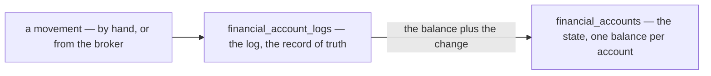

### The spec

| | |
| --- | --- |
| the state | `financial_accounts.balance` |
| the log | `financial_account_logs` — the `change`, and the balance after it |
| the template's rule | *"cannot change the `State` without log recorded"* — every change of a balance is a log row, written in the same transaction |
| the scope | the template gives state and log **one** scope. The state's is the account; ⛔ the log's, as written, is the team — [Contradiction](./context_clarify.md#one-ledger-and-its-state-and-its-log-have-different-grains) |

### What it confirms

Three [critiques](./context_clarify.md#critique) argued from the template before this line named it, and now rest on
it: an account opens with a row (4), the log says `balance_after` (5), and the log carries its account — promoted to
the contradiction above.

## a-row-comes-by-hand-or-from-the-broker

> `context.md` §How we Update The Ledger *(owner, 2026-09-29)* — *"1. Manual. 2. Listen from Message Broker."*

**The verdict.** A row reaches the ledger one of two ways: **a person types it** on the account screens, or
`financial_account_service` **hears an event** another service published, and posts it. No other service writes the
ledger directly.

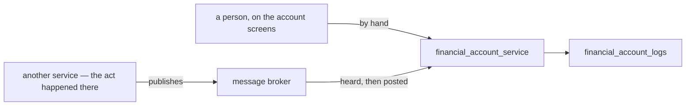

### The spec

| | |
| --- | --- |
| by hand | a person on the account screens — which types: [Q10](./context_clarify.md#question) · who: [Q8](./context_clarify.md#question) |
| from the broker | a listener per topic, posting each row in its own transaction |
| published today | `SettlementLogPosted` only — it carries the whole settlement row, withdrawals included ([event.proto](../../../proto/warehouse/events/v1/event.proto)) |
| not published yet | a restock, an expense, a confirmed team payment — each needs an event of its own, carrying the account it names |
| a redelivery | normal — the broker delivers at least once, and a consumer dedups on the event's `event_id`, derived from the row that caused it |
| a lost publish | a missing row, found only by a reconcile — the publish is trusted ([no-outbox-the-publish-is-trusted](../../technical/event_architecture/context_decision.md#no-outbox-the-publish-is-trusted)) |
| a refusal | impossible on the broker path — an event the listener refuses dead-letters, and the money is recorded nowhere |
| withdrawn | my `FinancialAccountPost` — a write other services would call. The broker replaces it |

### What it does NOT settle

- **Which way each type comes in**, and whether one may come both ways — [Q10](./context_clarify.md#question).
- **Who types a row by hand** — [Q8](./context_clarify.md#question).
- **What each new event carries** — the account, and the change rather than a level — a technical item, per publisher.

## shopeepay-is-the-wallet-a-team-pays-with

> Chat *(owner, 2026-09-29)* — *"for q5, yes"*, to [Q5](./context_clarify.md#question) as recommended: is `shopeepay`
> the e-wallet a team pays suppliers with — not the Shopee seller balance?

**The verdict.** `shopeepay` *(lines 8, 42)* is the **e-wallet a team pays with** — the same thing a restock's
`payment_type` already calls `shopee_pay`. The Shopee **seller** balance is not an account here: it stays out of
scope, as settlement decided
([superseded-the-position-is-the-shortfall-not-the-wallet](../settlement/context_decision.md#superseded-the-position-is-the-shortfall-not-the-wallet)),
so no settlement `fund` or fee row ever posts to an account.

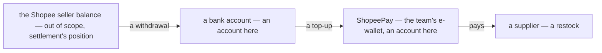

### The spec

| | |
| --- | --- |
| the account | `type` `wallet` · `account_type` `shopeepay` |
| its number | the wallet's phone number |
| what moves it | a restock paid from it ([Q2](./context_clarify.md#question)) · a top-up from the bank ([Q4](./context_clarify.md#question)) — both still open |
| what never does | a settlement row — `fund`, a fee, an adjustment. That is the seller balance, and settlement's position already counts it |
| a withdrawal | the seller balance paying out — it lands in whichever account its shop names ([Q1](./context_clarify.md#question)) |

## a-real-account-is-recorded-once

> Chat *(owner, 2026-09-29)* — *"for q6, yes"*, to [Q6](./context_clarify.md#question) as recommended: is a real
> account recorded once, across all teams?

**The verdict.** One real account is **one row, in one team**. A provider and its number — `account_type` and
`account_number` — are unique across all teams; a cash box has no number and is exempt. If two teams really share one
bank account, it is one team's account, and what the other keeps in it is owed between them — a team-balance
question, not a second copy of the account.

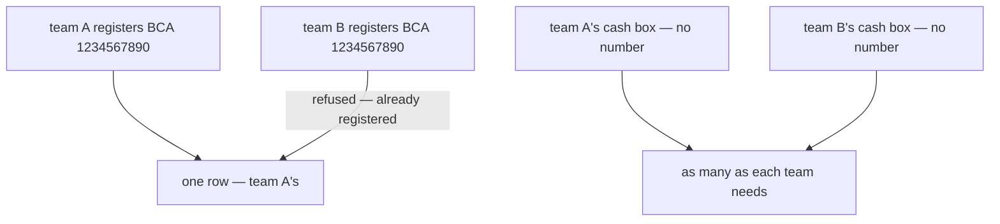

### The spec

| | |
| --- | --- |
| unique | `(account_type, account_number)` where a number exists — across all teams, archived accounts included |
| cash | exempt — it has no number, and is told apart by its name ([critique 3](./context_clarify.md#critique)) |
| a second registration | refused. ⚠ my spec: the message says the account is already registered, and names no team |
| an archived account | keeps its number — restored, never registered again |
| a shared real account | one team's account. The other's money in it is owed between them — the team balance, not a second row |
| the contradiction it closes | *account_number is unique, and a cash box has none* — the rule now has its scope. ⚠ Line 22 still reads *"its unique"* — yours to carry into the doc |

### ⚠ The ripple

[Q9](./context_clarify.md#question) proposes copying each team's `team_infos` bank into an account. Those fields took
any number, so one bank can be typed in two teams today — and under this rule a copy takes it **once**. The rest must
be listed for a person to settle, never silently dropped.

## below-zero-is-warned-never-refused

> Chat *(owner, 2026-09-29)* — *"for q7 yes"*, to [Q7](./context_clarify.md#question) as recommended: may an account
> go below zero?

**The verdict.** Yes. A row that takes an account below zero **posts**, whichever way it came in, and the account
shows a **warning** while it stays below zero. Nothing refuses it: the money already left, and a refusal would only
stop the record of it — on the broker path, it would dead-letter and be recorded nowhere.

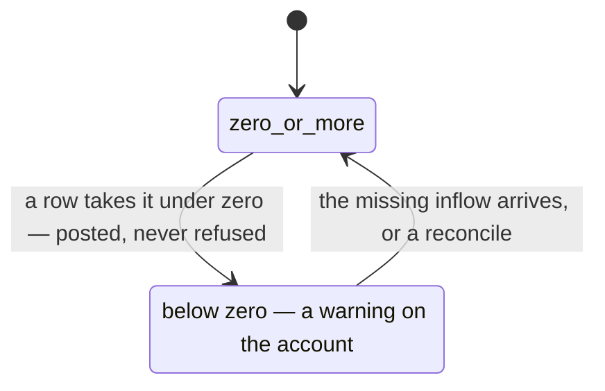

### The spec

| | |
| --- | --- |
| a row that goes below zero | posts — by hand or from the broker |
| what below zero means | an inflow was never recorded: nobody spends from an empty wallet or box |
| the warning | on the account list and on the account's page, for as long as the balance is below zero |
| what clears it | the missing row arriving, or a reconcile |

## opening-transfer-and-team-payment-join-the-types

> `context.md` §What is `change_type` *(owner, 2026-09-29)* — `opening_balance`, `transfer` and `team_payment` added
> to the list *(lines 71–73)*: three of the four [Q4](./context_clarify.md#question) recommended. The fourth,
> `capital`, is not in it — asked about in chat the same minute: *"what is `capital` used for"*.

**The verdict.** Three more ways money moves are types of their own, so none of them has to be typed as an
`adjustment`.

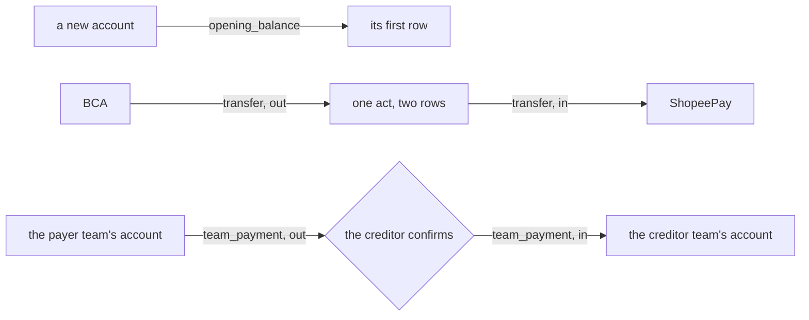

### The spec

| type | what it is | ⚠ my spec, from Q4's recommendation — yours to correct |
| --- | --- | --- |
| `opening_balance` | an account's first row | posted when the account is created, with the money it already holds ([critique 4](./context_clarify.md#critique)) |
| `transfer` | money between two of the team's own accounts — a ShopeePay top-up, cash drawn from the bank | two rows in one act, out of one account and into the other · inside one team |
| `team_payment` | one team paying another what it owes | out of the payer's account and into the creditor's **when the creditor confirms** — the moment the team balance moves, so the two never disagree about what has been paid |

### What it does NOT settle

- **`capital`**, and whether `adjustment` is for reconciling only — [Q4](./context_clarify.md#question).
- **Which way each comes in** — [Q10](./context_clarify.md#question) recommends by hand for `opening_balance` and
  `transfer`, and from the broker for `team_payment`: liability records the payment, and publishes nothing yet.

🔄 *(2026-09-29, later the same day)* `capital` joined the list too — [capital-joins-the-types](#capital-joins-the-types).

## capital-joins-the-types

> `context.md` §What is `change_type` *(owner, 2026-09-29)* — `capital` added to the list *(line 74)*, after asking in
> chat *"what is `capital` used for"* and reading the answer. The fourth of the four types
> [Q4](./context_clarify.md#question) recommended.

**The verdict.** The business owner's own money, put into a team or taken out of it, is a type of its own:
`capital`. It is never read as revenue, an expense or an adjustment — it is what separates a team that **earned**
Rp 20.000.000 from one that was **given** it.

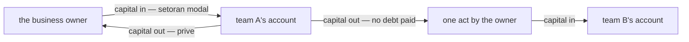

### The spec

| | example | why no other type fits |
| --- | --- | --- |
| in | a new team's first Rp 20.000.000 (*setoran modal*) · a team that ran short, topped up | not `revenue_fund` — nothing was sold, and the team's profit would include money it was given |
| out | profit taken out (*prive*) | not `expense` — nothing was bought, and the profit would shrink by money that was profit |
| between teams | Rp 10.000.000 moved from team A to team B, paying no debt | not `team_payment` — it would lower a debt that does not exist · not `transfer` — a transfer stays inside one team |

| | ⚠ my spec, from Q4's recommendation — yours to correct |
| --- | --- |
| the sign | one type, signed — in is positive, out is negative |
| between teams | two rows, one per team, sharing a `group_id` — out of one, into the other |
| the way in | by hand — no other service sees the owner's own money ([Q10](./context_clarify.md#question)) |
| who types it | [Q8](./context_clarify.md#question) |

## adjustment-is-for-reconciling-only

> Chat *(owner, 2026-09-29)* — *"yes, adjsutment for reconcil only"*, to [Q4](./context_clarify.md#question) as
> recommended: is `adjustment` for reconciling only, calculated from the figure the bank app shows and never an amount
> someone chose?

**The verdict.** An `adjustment` *(line 68)* is **only** the difference a reconcile finds. The manager types what the
bank app shows — or what the cash box counts — and the difference between that and the account's balance posts as
the adjustment. Nobody types an adjustment's amount or its sign, and no other movement is ever recorded as one: each
has a type of its own ([opening-transfer-and-team-payment-join-the-types](#opening-transfer-and-team-payment-join-the-types),
[capital-joins-the-types](#capital-joins-the-types)).

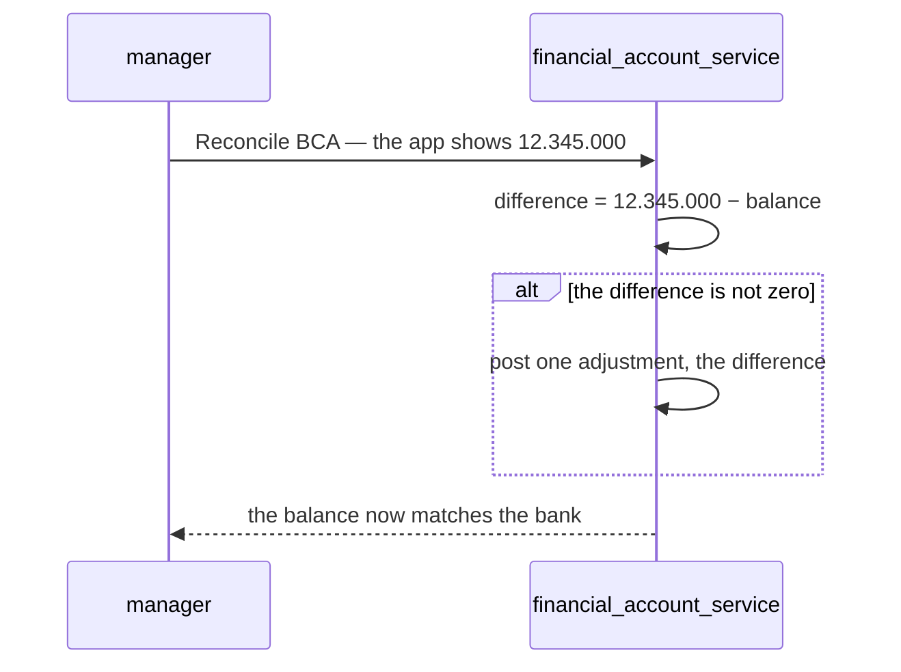

### The spec

| | |
| --- | --- |
| what an adjustment means | *money we did not record* — the one total worth reading every week |
| what the manager types | the figure the bank shows or the box counts, and the date of it — never the difference |
| a zero difference | posts nothing |
| ⚠ my spec — a note | required on a non-zero difference: it is the one row that can hide missing cash |
| ⚠ my spec — last checked | the account stamps `reconciled_at`, and shows how long ago it was checked |
| who reconciles | [Q8](./context_clarify.md#question) |
| the way in | by hand — only a person looking at the bank app knows the figure ([Q10](./context_clarify.md#question)) |

## the-log-says-balance-after

> `context.md` §Table that Named `financial_account_logs` *(owner, 2026-09-29)* — `last_balance` renamed
> `balance_after` *(line 59)*, as [critique 5](./context_clarify.md#critique) recommended.

**The verdict.** A log row's running balance is **`balance_after`** — the account's balance once this row's `change`
is applied — the ledger template's own word. *Last* could be read as before the change or after it; *after* cannot.

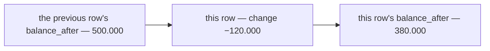

### The spec

| | |
| --- | --- |
| the rule | `balance_after` = the previous row's `balance_after` + this row's `change` |
| the first row | the `opening_balance` row — its `balance_after` is the money the account opened with |
| ⚠ still missing | the account the row belongs to — without it, *previous row* runs across every account of the team ([Contradiction](./context_clarify.md#one-ledger-and-its-state-and-its-log-have-different-grains)) |

## restock-is-never-typed-by-hand

> Chat *(owner, 2026-09-29)* — *"restock cant create by hand"*, after reading [Q10](./context_clarify.md#question):
> which way does each type come in, and may one come both ways? It answers Q10 for `restock` — as its recommendation,
> option A, puts it.

**The verdict.** A `restock` row *(line 70)* comes **only from the broker** — inventory records the restock, and the
account hears it. No hand screen offers `restock`, and no RPC takes one from a person.

**Why.** Typed here as well, one payment is two rows, and nothing tells which is the copy:

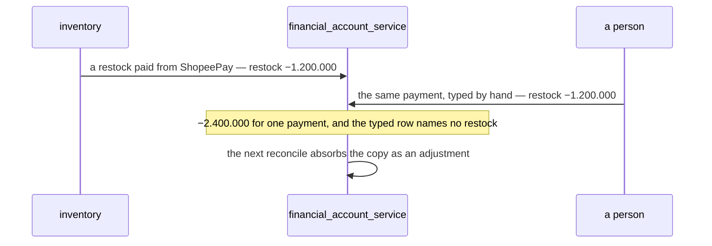

### The spec

| | |
| --- | --- |
| the way in | the broker only — a restock event from inventory, naming the account that paid ([Q2](./context_clarify.md#question)) |
| the hand screens | offer no `restock` — the four hand acts are New account, Transfer, Capital, Reconcile |
| a refund | the same way — inventory publishes it when a cancel says the money came back ([Q2](./context_clarify.md#question)) |
| until inventory publishes | ⚠ nothing does today. Until the event exists, a restock's payment reaches the account only through a reconcile — as an `adjustment`, money not yet recorded ([adjustment-is-for-reconciling-only](#adjustment-is-for-reconciling-only)) |

## one-way-in-per-type

> Chat *(owner, 2026-09-29)* — *"yes"*, to [Q10](./context_clarify.md#question) as narrowed and recommended: are
> `expense`, `revenue_fund` and `team_payment` never typed by hand either — each already recorded by its own service,
> an expense by `expense_service`, `revenue_fund` by settlement's withdrawal row, a team payment by liability's confirm?
> With [restock-is-never-typed-by-hand](#restock-is-never-typed-by-hand), it answers Q10 whole.

**The verdict.** Every type has **exactly one way in**. A type another service already records comes **only from the
broker**; a type no other service knows is **only typed by hand**. No type comes both ways — so one payment can never
be two rows.

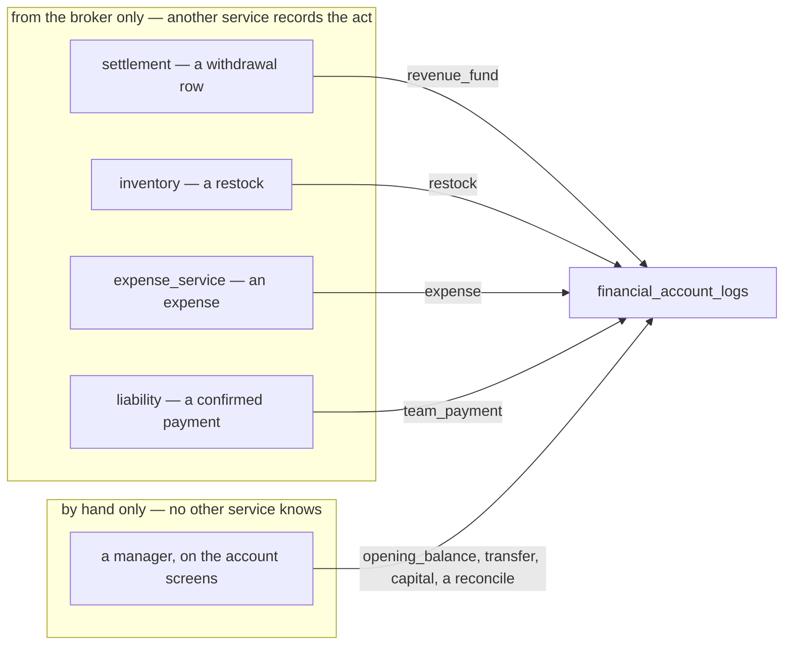

### The spec

| type | way in | recorded first by |
| --- | --- | --- |
| `revenue_fund` | broker only | settlement — a successful withdrawal row. ✅ `SettlementLogPosted` publishes it today |
| `restock` | broker only | inventory — [restock-is-never-typed-by-hand](#restock-is-never-typed-by-hand) · 🆕 its event |
| `expense` | broker only | `expense_service` · 🆕 its event |
| `team_payment` | broker only | liability — the creditor's confirm · 🆕 its event |
| `opening_balance` | by hand only | creating the account |
| `transfer` | by hand only | the account screens |
| `capital` | by hand only | the account screens |
| `adjustment` | by hand only | a reconcile — [adjustment-is-for-reconciling-only](#adjustment-is-for-reconciling-only) |

| | |
| --- | --- |
| how it holds | by structure: no RPC takes a `change_type` from a person, and each listener posts only its own type |
| until a publisher exists | its money reaches the account only through a reconcile — `revenue_fund`'s event exists; `restock`, `expense` and `team_payment` wait for theirs |

### What it narrows

- 🔄 [Q1](./context_clarify.md#question) — that `revenue_fund` is settlement's withdrawal row, heard from the broker,
  is settled here. Left: which account each shop's withdrawal lands in, and the rename.
- 🔄 [Q3](./context_clarify.md#question) — that an expense is typed in `expense_service`, never here, is settled here.
  Left: whether it names the account it was paid from, and which expenses name none.

## seeing-is-team-wide-moving-is-admin-and-up

> Chat *(owner, 2026-09-29)* — *"for q8, for now all user in team can see that, and admin up can move the money"*, to
> [Q8](./context_clarify.md#question): who sees a balance, and who moves one? **Seeing is against my
> recommendation** (option A — only the managers see); **moving is as recommended**.

**The verdict.** For now, **every member of a team sees its accounts** — their balances and their rows. **Admin and
up move the money**: they open, archive and restore accounts, and type every hand row.

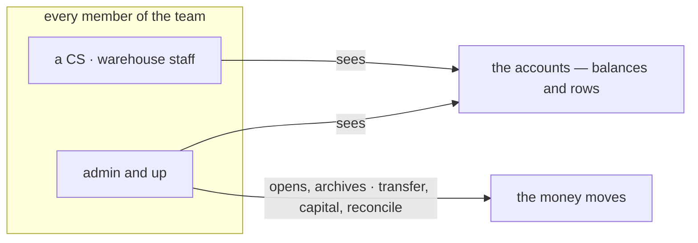

### The spec

| act | who |
| --- | --- |
| see the accounts, their balances and their rows | every member of the team · root and admin, every team's |
| open, archive, restore an account | admin and up |
| a transfer · capital · a reconcile | admin and up |
| name an account on another service's form | that form's own roles — ⚠ my reading: a CS raising a restock names the account that paid. That records a payment, heard from the broker; it moves nothing by hand |
| see where another team is paid | [Q9](./context_clarify.md#question) |

| *admin and up* — ⚠ my reading of *"admin up"*, yours to correct | roles |
| --- | --- |
| a selling team | `ROLE_TEAM_ADMIN`, `ROLE_TEAM_OWNER` |
| a warehouse team | `ROLE_WAREHOUSE_ADMIN`, `ROLE_WAREHOUSE_OWNER` |
| the root team, over every team | `ROLE_ADMIN`, `ROLE_ROOT` |
| — | the same six roles that record and confirm team payments today. If *admin* meant the root team alone, only head office would move a team's money — say so, and this is renamed |

### What seeing team-wide costs — recorded, not re-argued

- Every CS and every warehouse staff member sees how much the team holds, and each `capital` move the owner makes.
- ✅ **"For now" stays cheap to change.** Balances still come from their own RPC — `FinancialAccountOverview` — so
  narrowing who sees them later is one line in the proto, that request's policy, not a rework.

### What else it answers

Who reconciles ([adjustment-is-for-reconciling-only](#adjustment-is-for-reconciling-only)) and who types `capital`
([capital-joins-the-types](#capital-joins-the-types)): admin and up.

## revenue-stays-in-settlement

> `context.md` §What is `change_type` *(owner, 2026-09-29)* — `revenue_fund` became `withdrawal` *(line 69)*, and in
> chat: *"revenue fund stay in settlement, we record in financial account when only withdrawal happen"*. The naming
> half of [Q1](./context_clarify.md#question) — **against my recommendation** of `marketplace_withdrawal`.

**The verdict.** Revenue is **settlement's**: the platform paying the wallet — `fund`, every fee — is recorded there
and nowhere here. A financial account records the marketplace's money **only when it is withdrawn** — the moment it
reaches the bank — as a `withdrawal`, the same word settlement uses for the same act.

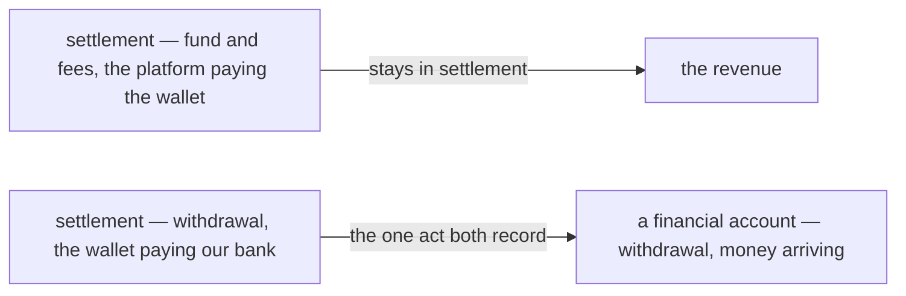

### The spec

| | |
| --- | --- |
| the type | `withdrawal` — was `revenue_fund` |
| what it records | a successful withdrawal row from settlement, heard from the broker ([one-way-in-per-type](#one-way-in-per-type)) |
| what it never records | `fund`, a fee, an adjustment — settlement's revenue |
| the sign | settlement's row is negative, money leaving the wallet · here it is positive, money arriving |
| ⚠ my spec — the label | an account's page shows the row as *+ Withdrawal from <the shop>* — the sign and the shop carry the direction |
| where it lands | still open — [Q1](./context_clarify.md#question) |

### What the name costs — recorded, not re-argued

One word for one act in both services is the reason to keep it. The cost: on a bank account's page, *withdrawal*
alone means money **leaving** the bank, and this row is money **arriving** — which is what the label above is for.

### The older entries

[one-way-in-per-type](#one-way-in-per-type) and [capital-joins-the-types](#capital-joins-the-types) say
`revenue_fund` — read it as `withdrawal`.
