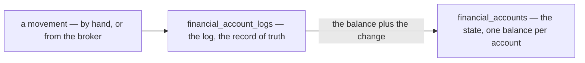
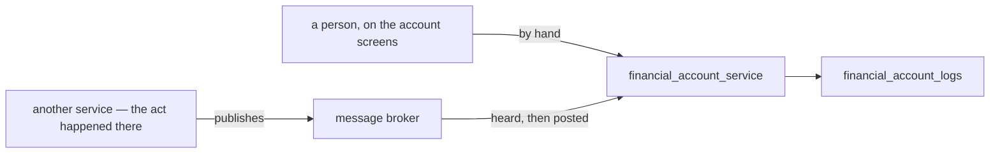

# Decisions — `financial_account/context.md`

What the owner settled, recorded before it is acted on. **Append-only** — a decision that is later reversed is
renamed and its references grepped (RULE 12), never quietly edited away. The open set is
[context_clarify.md](./context_clarify.md).

| decision | what it decided | from | still open |
| --- | --- | --- | --- |
| [the-accounts-are-one-ledger](#the-accounts-are-one-ledger) | `financial_accounts` is the ledger's state and `financial_account_logs` its log — the ledger template applies | owner | ⛔ the log has no account, so its grain is not the state's — [Contradiction](./context_clarify.md#one-ledger-and-its-state-and-its-log-have-different-grains) |
| [a-row-comes-by-hand-or-from-the-broker](#a-row-comes-by-hand-or-from-the-broker) | two ways in: a person types a row, or the service hears an event another service published | owner | [Q10](./context_clarify.md#question) — which type takes which way |

## the-accounts-are-one-ledger

> `context.md` §Table That Must be Have *(owner, 2026-09-29)* — *"for the ledger, we have `financial_accounts` and
> `financial_account_logs`."*

**The verdict.** The two tables are one ledger, in the shape of
[mutation_and_ledger.md](../../technical/ledger/mutation_and_ledger.md): `financial_accounts` is its **state** — one
balance per account — and `financial_account_logs` is its **log**, the record of truth every change of a balance is
written to.

### The spec

| | |
| --- | --- |
| the state | `financial_accounts.balance` |
| the log | `financial_account_logs` — the `change`, and the balance after it |
| the template's rule | *"cannot change the `State` without log recorded"* — every change of a balance is a log row, written in the same transaction |
| the scope | the template gives state and log **one** scope. The state's is the account; ⛔ the log's, as written, is the team — [Contradiction](./context_clarify.md#one-ledger-and-its-state-and-its-log-have-different-grains) |

### What it confirms

Three [critiques](./context_clarify.md#critique) argued from the template before this line named it, and now rest on
it: an account opens with a row (4), the log says `balance_after` (5), and the log carries its account — promoted to
the contradiction above.

## a-row-comes-by-hand-or-from-the-broker

> `context.md` §How we Update The Ledger *(owner, 2026-09-29)* — *"1. Manual. 2. Listen from Message Broker."*

**The verdict.** A row reaches the ledger one of two ways: **a person types it** on the account screens, or
`financial_account_service` **hears an event** another service published, and posts it. No other service writes the
ledger directly.

### The spec

| | |
| --- | --- |
| by hand | a person on the account screens — which types: [Q10](./context_clarify.md#question) · who: [Q8](./context_clarify.md#question) |
| from the broker | a listener per topic, posting each row in its own transaction |
| published today | `SettlementLogPosted` only — it carries the whole settlement row, withdrawals included ([event.proto](../../../proto/warehouse/events/v1/event.proto)) |
| not published yet | a restock, an expense, a confirmed team payment — each needs an event of its own, carrying the account it names |
| a redelivery | normal — the broker delivers at least once, and a consumer dedups on the event's `event_id`, derived from the row that caused it |
| a lost publish | a missing row, found only by a reconcile — the publish is trusted ([no-outbox-the-publish-is-trusted](../../technical/event_architecture/context_decision.md#no-outbox-the-publish-is-trusted)) |
| a refusal | impossible on the broker path — an event the listener refuses dead-letters, and the money is recorded nowhere |
| withdrawn | my `FinancialAccountPost` — a write other services would call. The broker replaces it |

### What it does NOT settle

- **Which way each type comes in**, and whether one may come both ways — [Q10](./context_clarify.md#question).
- **Who types a row by hand** — [Q8](./context_clarify.md#question).
- **What each new event carries** — the account, and the change rather than a level — a technical item, per publisher.
