# Decisions — `financial_account/context.md`

What the owner settled, recorded before it is acted on. **Append-only** — a decision that is later reversed is
renamed and its references grepped (RULE 12), never quietly edited away. The open set is
[context_clarify.md](./context_clarify.md).

| decision | what it decided | from | still open |
| --- | --- | --- | --- |
| [the-accounts-are-one-ledger](#the-accounts-are-one-ledger) | `financial_accounts` is the ledger's state and `financial_account_logs` its log — the ledger template applies | owner | ✅ the log names its account: [every-log-row-names-its-account](#every-log-row-names-its-account) |
| [a-row-comes-by-hand-or-from-the-broker](#a-row-comes-by-hand-or-from-the-broker) | two ways in: a person types a row, or the service hears an event another service published | owner | [Q10](./context_clarify.md#question) — which type takes which way |
| [shopeepay-is-the-wallet-a-team-pays-with](#shopeepay-is-the-wallet-a-team-pays-with) | `shopeepay` is the e-wallet a team pays suppliers with — never the Shopee seller balance, which stays out of scope | owner | ✅ what moves it: a restock ([a-restock-must-name-the-account-that-paid](#a-restock-must-name-the-account-that-paid)), a top-up ([opening-transfer-and-team-payment-join-the-types](#opening-transfer-and-team-payment-join-the-types)) |
| [a-real-account-is-recorded-once](#a-real-account-is-recorded-once) | a provider and its number are unique across all teams — one real account, one row, one team · a cash box is exempt | owner | ✅ moot — the `team_infos` numbers were dropped, not copied: [the-team-record-holds-no-bank](#the-team-record-holds-no-bank) |
| [below-zero-is-warned-never-refused](#below-zero-is-warned-never-refused) | a row that takes an account below zero posts, whichever way it came in, and the account shows a warning until it is back | owner | — |
| [opening-transfer-and-team-payment-join-the-types](#opening-transfer-and-team-payment-join-the-types) | `opening_balance`, `transfer` and `team_payment` are types of their own — none of them is typed as an `adjustment` | owner | [Q10](./context_clarify.md#question) — which way each comes in |
| [capital-joins-the-types](#capital-joins-the-types) | `capital` is a type of its own — the business owner's money, put in or taken out, never read as revenue, an expense or an adjustment | owner | ✅ who types it: [seeing-is-team-wide-moving-is-admin-and-up](#seeing-is-team-wide-moving-is-admin-and-up) |
| [adjustment-is-for-reconciling-only](#adjustment-is-for-reconciling-only) | an `adjustment` is only ever the difference a reconcile finds — the manager types the figure the bank shows, never an amount | owner | ✅ who reconciles: [seeing-is-team-wide-moving-is-admin-and-up](#seeing-is-team-wide-moving-is-admin-and-up) |
| [the-log-says-balance-after](#the-log-says-balance-after) | a log row's running balance is `balance_after` — the balance once its change is applied | owner | — |
| [restock-is-never-typed-by-hand](#restock-is-never-typed-by-hand) | a `restock` row comes only from the broker — no hand screen and no RPC takes one from a person | owner | ✅ what inventory publishes: [a-restock-must-name-the-account-that-paid](#a-restock-must-name-the-account-that-paid) |
| [one-way-in-per-type](#one-way-in-per-type) | every type has exactly one way in — what another service records comes only from the broker, what no other service knows only by hand | owner | ✅ which account: a withdrawal ([a-shop-names-the-account-it-withdraws-into](#a-shop-names-the-account-it-withdraws-into)), an expense ([an-expense-must-name-the-account-that-paid](#an-expense-must-name-the-account-that-paid)) |
| [revenue-stays-in-settlement](#revenue-stays-in-settlement) | revenue is settlement's — a financial account records the marketplace's money only when it is withdrawn, as `withdrawal` (was `revenue_fund`) | owner | [Q1](./context_clarify.md#question) — where a withdrawal lands |
| [a-shop-names-the-account-it-withdraws-into](#a-shop-names-the-account-it-withdraws-into) | a withdrawal lands in the account its shop names in `shop_accounts` — set up once per shop, never chosen per withdrawal | owner | ✅ one account per shop: [a-shop-has-one-account](#a-shop-has-one-account) · ✅ a shop with no row: [a-shop-with-no-account-gets-an-unknown-one](#a-shop-with-no-account-gets-an-unknown-one) |
| [operational-accounts-pay-for-operations](#operational-accounts-pay-for-operations) | a team marks which of its accounts pay for its operations — a restock first — in `operational_accounts` | owner | ✅ which one paid a given restock: [a-restock-must-name-the-account-that-paid](#a-restock-must-name-the-account-that-paid) |
| [a-shop-has-one-account](#a-shop-has-one-account) | a shop names one account — `shop_id` is unique in `shop_accounts` · an account may take many shops | owner | — |
| [the-team-record-holds-no-bank](#the-team-record-holds-no-bank) | `team_infos` holds no bank — its three bank columns are dropped, not copied, and a team's bank lives only as a financial account | owner | [Q9](./context_clarify.md#question) — where a team is paid |
| [every-log-row-names-its-account](#every-log-row-names-its-account) | every log row carries `account_id` — the state and the log share one scope, the account | owner | — |
| [provider-replaces-account-type](#provider-replaces-account-type) | the column naming who holds the money is `provider` (was `account_type`) · `type` stays beside it | owner | ✅ `type` is picked apart: [type-and-provider-are-picked-apart](#type-and-provider-are-picked-apart) |
| [an-account-has-a-name-and-a-holder](#an-account-has-a-name-and-a-holder) | every account has a `name` and a `holder_name` (*atas nama*) | owner | — |
| [the-log-keeps-the-day-the-money-moved](#the-log-keeps-the-day-the-money-moved) | every log row keeps `occurred_at`, when the money moved, beside `created_at` | owner | — |
| [an-account-opens-with-a-log-row](#an-account-opens-with-a-log-row) | an account created by hand opens with an `opening_balance` log row — its balance is never set without one | owner | — |
| [an-account-is-archived-only-at-zero](#an-account-is-archived-only-at-zero) | an account is archived only when its balance is zero — move the money out or reconcile first | owner | — |
| [type-and-provider-are-picked-apart](#type-and-provider-are-picked-apart) | `type` and `provider` are picked apart — nothing derives one from the other, and a pair that disagrees saves | owner, against my recommendation | — |
| [the-description-names-the-cause](#the-description-names-the-cause) | a log row's cause is its `description` — no `source_id`, no `reversal` | owner, against my recommendation | — |
| [a-team-payment-posts-on-accept](#a-team-payment-posts-on-accept) | a team payment posts only on the creditor's acceptance — the balance service's event carries the from and to account ids | owner | [Q14](./context_clarify.md#question) — a reversed acceptance |
| [a-shop-with-no-account-gets-an-unknown-one](#a-shop-with-no-account-gets-an-unknown-one) | a withdrawal from a shop with no `shop_accounts` row creates an account typed `unknown`, connects it to the shop, and posts there — never held | owner, against my recommendation | ✅ how it becomes the real account: [an-unknown-account-is-filled-in-or-moved-in](#an-unknown-account-is-filled-in-or-moved-in) · ✅ one per shop holds: [a-shop-has-one-account](#a-shop-has-one-account) |
| [an-unknown-account-is-filled-in-or-moved-in](#an-unknown-account-is-filled-in-or-moved-in) | an `unknown` account is filled in when its real account is not registered, and moved into it by a transfer when it is | owner | — |
| [a-restock-must-name-the-account-that-paid](#a-restock-must-name-the-account-that-paid) | every restock names, at create, the operational account that paid — no *not paid yet* · an edit posts the difference, a cancel asks whether the money came back | owner, required against my recommendation | — |
| [an-expense-must-name-the-account-that-paid](#an-expense-must-name-the-account-that-paid) | every expense a person types names the account that paid it | owner, required against my recommendation | ✅ an ads charge taken from the seller balance: [settlement-ads-and-accounts-are-independent](#settlement-ads-and-accounts-are-independent) |
| [settlement-ads-and-accounts-are-independent](#settlement-ads-and-accounts-are-independent) | settlement's ads and a financial account never connect — an ad reaches an account only as an `ADS` expense naming the account that paid, and nothing syncs | owner | — |
| [ads-expense-joins-the-types](#ads-expense-joins-the-types) | ads paid from an account post as `ads_expense`, a type of their own beside `expense` | owner | ⚠ my reading: from the expense event when its kind is `ADS` |
| [seeing-is-team-wide-moving-is-admin-and-up](#seeing-is-team-wide-moving-is-admin-and-up) | for now, every member of a team sees its accounts, balances and rows · admin and up open, archive and move the money | owner | ⚠ my reading of *admin up* — the team's admin and owner, plus root and admin |

## the-accounts-are-one-ledger

> `context.md` §Table That Must be Have *(owner, 2026-09-29)* — *"for the ledger, we have `financial_accounts` and
> `financial_account_logs`."*

**The verdict.** The two tables are one ledger, in the shape of
[mutation_and_ledger.md](../../technical/ledger/mutation_and_ledger.md): `financial_accounts` is its **state** — one
balance per account — and `financial_account_logs` is its **log**, the record of truth every change of a balance is
written to.

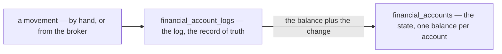

### The spec

| | |
| --- | --- |
| the state | `financial_accounts.balance` |
| the log | `financial_account_logs` — the `change`, and the balance after it |
| the template's rule | *"cannot change the `State` without log recorded"* — every change of a balance is a log row, written in the same transaction |
| the scope | the template gives state and log **one** scope. The state's is the account; ⛔ the log's, as written, is the team — [Contradiction](./context_clarify.md#one-ledger-and-its-state-and-its-log-have-different-grains) |

### What it confirms

Three [critiques](./context_clarify.md#critique) argued from the template before this line named it, and now rest on
it: an account opens with a row (4), the log says `balance_after` (5), and the log carries its account — promoted to
the contradiction above.

## a-row-comes-by-hand-or-from-the-broker

> `context.md` §How we Update The Ledger *(owner, 2026-09-29)* — *"1. Manual. 2. Listen from Message Broker."*

**The verdict.** A row reaches the ledger one of two ways: **a person types it** on the account screens, or
`financial_account_service` **hears an event** another service published, and posts it. No other service writes the
ledger directly.

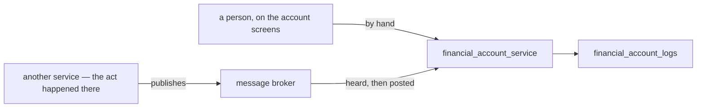

### The spec

| | |
| --- | --- |
| by hand | a person on the account screens — which types: [Q10](./context_clarify.md#question) · who: [Q8](./context_clarify.md#question) |
| from the broker | a listener per topic, posting each row in its own transaction |
| published today | `SettlementLogPosted` only — it carries the whole settlement row, withdrawals included ([event.proto](../../../proto/warehouse/events/v1/event.proto)) |
| not published yet | a restock, an expense, a confirmed team payment — each needs an event of its own, carrying the account it names |
| a redelivery | normal — the broker delivers at least once, and a consumer dedups on the event's `event_id`, derived from the row that caused it |
| a lost publish | a missing row, found only by a reconcile — the publish is trusted ([no-outbox-the-publish-is-trusted](../../technical/event_architecture/context_decision.md#no-outbox-the-publish-is-trusted)) |
| a refusal | impossible on the broker path — an event the listener refuses dead-letters, and the money is recorded nowhere |
| withdrawn | my `FinancialAccountPost` — a write other services would call. The broker replaces it |

### What it does NOT settle

- **Which way each type comes in**, and whether one may come both ways — [Q10](./context_clarify.md#question).
- **Who types a row by hand** — [Q8](./context_clarify.md#question).
- **What each new event carries** — the account, and the change rather than a level — a technical item, per publisher.

## shopeepay-is-the-wallet-a-team-pays-with

> Chat *(owner, 2026-09-29)* — *"for q5, yes"*, to [Q5](./context_clarify.md#question) as recommended: is `shopeepay`
> the e-wallet a team pays suppliers with — not the Shopee seller balance?

**The verdict.** `shopeepay` *(lines 8, 42)* is the **e-wallet a team pays with** — the same thing a restock's
`payment_type` already calls `shopee_pay`. The Shopee **seller** balance is not an account here: it stays out of
scope, as settlement decided
([superseded-the-position-is-the-shortfall-not-the-wallet](../settlement/context_decision.md#superseded-the-position-is-the-shortfall-not-the-wallet)),
so no settlement `fund` or fee row ever posts to an account.

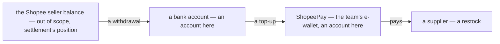

### The spec

| | |
| --- | --- |
| the account | `type` `wallet` · `account_type` `shopeepay` |
| its number | the wallet's phone number |
| what moves it | a restock paid from it ([Q2](./context_clarify.md#question)) · a top-up from the bank ([Q4](./context_clarify.md#question)) — both still open |
| what never does | a settlement row — `fund`, a fee, an adjustment. That is the seller balance, and settlement's position already counts it |
| a withdrawal | the seller balance paying out — it lands in whichever account its shop names ([Q1](./context_clarify.md#question)) |

## a-real-account-is-recorded-once

> Chat *(owner, 2026-09-29)* — *"for q6, yes"*, to [Q6](./context_clarify.md#question) as recommended: is a real
> account recorded once, across all teams?

**The verdict.** One real account is **one row, in one team**. A provider and its number — `account_type` and
`account_number` — are unique across all teams; a cash box has no number and is exempt. If two teams really share one
bank account, it is one team's account, and what the other keeps in it is owed between them — a team-balance
question, not a second copy of the account.

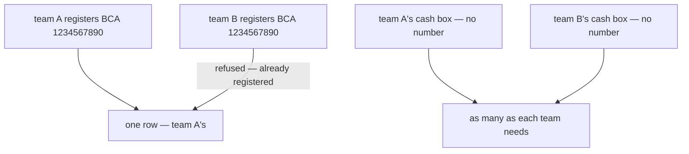

### The spec

| | |
| --- | --- |
| unique | `(account_type, account_number)` where a number exists — across all teams, archived accounts included |
| cash | exempt — it has no number, and is told apart by its name ([critique 3](./context_clarify.md#critique)) |
| a second registration | refused. ⚠ my spec: the message says the account is already registered, and names no team |
| an archived account | keeps its number — restored, never registered again |
| a shared real account | one team's account. The other's money in it is owed between them — the team balance, not a second row |
| the contradiction it closes | *account_number is unique, and a cash box has none* — the rule now has its scope. ⚠ Line 22 still reads *"its unique"* — yours to carry into the doc |

### ⚠ The ripple

[Q9](./context_clarify.md#question) proposes copying each team's `team_infos` bank into an account. Those fields took
any number, so one bank can be typed in two teams today — and under this rule a copy takes it **once**. The rest must
be listed for a person to settle, never silently dropped.

## below-zero-is-warned-never-refused

> Chat *(owner, 2026-09-29)* — *"for q7 yes"*, to [Q7](./context_clarify.md#question) as recommended: may an account
> go below zero?

**The verdict.** Yes. A row that takes an account below zero **posts**, whichever way it came in, and the account
shows a **warning** while it stays below zero. Nothing refuses it: the money already left, and a refusal would only
stop the record of it — on the broker path, it would dead-letter and be recorded nowhere.

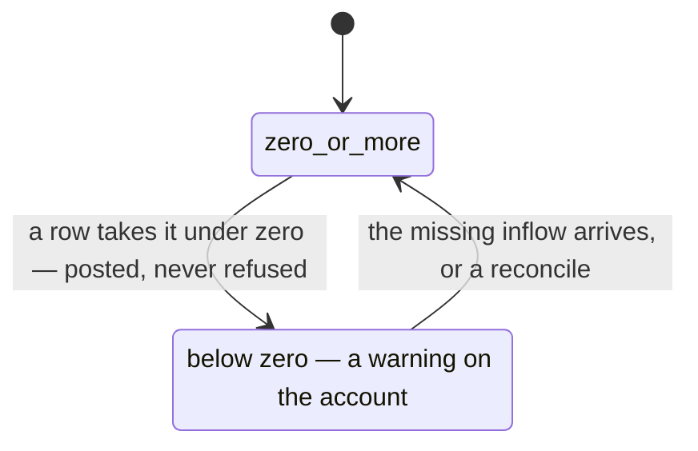

### The spec

| | |
| --- | --- |
| a row that goes below zero | posts — by hand or from the broker |
| what below zero means | an inflow was never recorded: nobody spends from an empty wallet or box |
| the warning | on the account list and on the account's page, for as long as the balance is below zero |
| what clears it | the missing row arriving, or a reconcile |

## opening-transfer-and-team-payment-join-the-types

> `context.md` §What is `change_type` *(owner, 2026-09-29)* — `opening_balance`, `transfer` and `team_payment` added
> to the list *(lines 71–73)*: three of the four [Q4](./context_clarify.md#question) recommended. The fourth,
> `capital`, is not in it — asked about in chat the same minute: *"what is `capital` used for"*.

**The verdict.** Three more ways money moves are types of their own, so none of them has to be typed as an
`adjustment`.

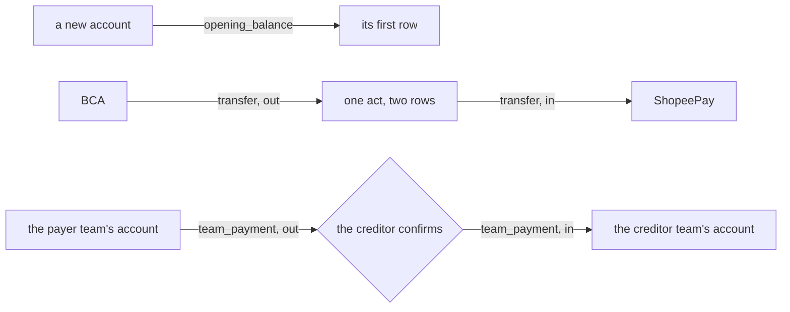

### The spec

| type | what it is | ⚠ my spec, from Q4's recommendation — yours to correct |
| --- | --- | --- |
| `opening_balance` | an account's first row | posted when the account is created, with the money it already holds ([critique 4](./context_clarify.md#critique)) |
| `transfer` | money between two of the team's own accounts — a ShopeePay top-up, cash drawn from the bank | two rows in one act, out of one account and into the other · inside one team |
| `team_payment` | one team paying another what it owes | out of the payer's account and into the creditor's **when the creditor confirms** — the moment the team balance moves, so the two never disagree about what has been paid |

### What it does NOT settle

- **`capital`**, and whether `adjustment` is for reconciling only — [Q4](./context_clarify.md#question).
- **Which way each comes in** — [Q10](./context_clarify.md#question) recommends by hand for `opening_balance` and
  `transfer`, and from the broker for `team_payment`: liability records the payment, and publishes nothing yet.

🔄 *(2026-09-29, later the same day)* `capital` joined the list too — [capital-joins-the-types](#capital-joins-the-types).

## capital-joins-the-types

> `context.md` §What is `change_type` *(owner, 2026-09-29)* — `capital` added to the list *(line 74)*, after asking in
> chat *"what is `capital` used for"* and reading the answer. The fourth of the four types
> [Q4](./context_clarify.md#question) recommended.

**The verdict.** The business owner's own money, put into a team or taken out of it, is a type of its own:
`capital`. It is never read as revenue, an expense or an adjustment — it is what separates a team that **earned**
Rp 20.000.000 from one that was **given** it.

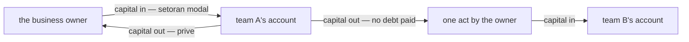

### The spec

| | example | why no other type fits |
| --- | --- | --- |
| in | a new team's first Rp 20.000.000 (*setoran modal*) · a team that ran short, topped up | not `revenue_fund` — nothing was sold, and the team's profit would include money it was given |
| out | profit taken out (*prive*) | not `expense` — nothing was bought, and the profit would shrink by money that was profit |
| between teams | Rp 10.000.000 moved from team A to team B, paying no debt | not `team_payment` — it would lower a debt that does not exist · not `transfer` — a transfer stays inside one team |

| | ⚠ my spec, from Q4's recommendation — yours to correct |
| --- | --- |
| the sign | one type, signed — in is positive, out is negative |
| between teams | two rows, one per team, sharing a `group_id` — out of one, into the other |
| the way in | by hand — no other service sees the owner's own money ([Q10](./context_clarify.md#question)) |
| who types it | [Q8](./context_clarify.md#question) |

## adjustment-is-for-reconciling-only

> Chat *(owner, 2026-09-29)* — *"yes, adjsutment for reconcil only"*, to [Q4](./context_clarify.md#question) as
> recommended: is `adjustment` for reconciling only, calculated from the figure the bank app shows and never an amount
> someone chose?

**The verdict.** An `adjustment` *(line 68)* is **only** the difference a reconcile finds. The manager types what the
bank app shows — or what the cash box counts — and the difference between that and the account's balance posts as
the adjustment. Nobody types an adjustment's amount or its sign, and no other movement is ever recorded as one: each
has a type of its own ([opening-transfer-and-team-payment-join-the-types](#opening-transfer-and-team-payment-join-the-types),
[capital-joins-the-types](#capital-joins-the-types)).

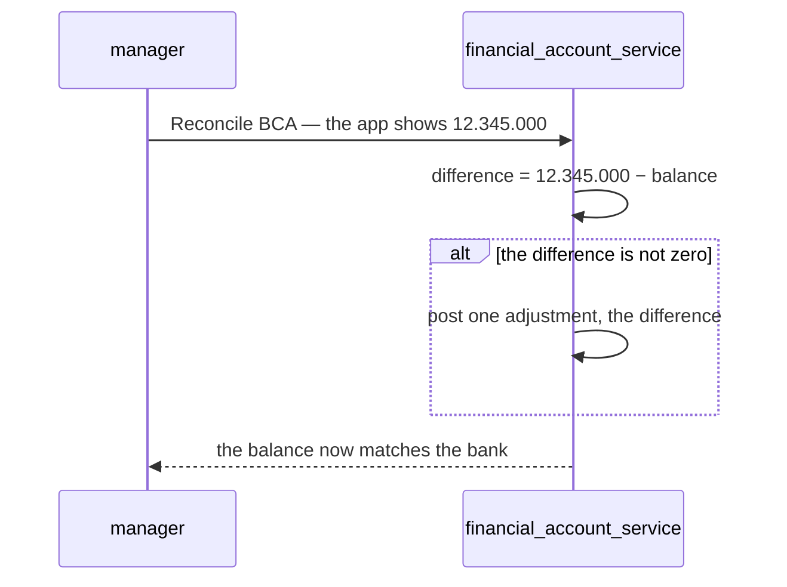

### The spec

| | |
| --- | --- |
| what an adjustment means | *money we did not record* — the one total worth reading every week |
| what the manager types | the figure the bank shows or the box counts, and the date of it — never the difference |
| a zero difference | posts nothing |
| ⚠ my spec — a note | required on a non-zero difference: it is the one row that can hide missing cash |
| ⚠ my spec — last checked | the account stamps `reconciled_at`, and shows how long ago it was checked |
| who reconciles | [Q8](./context_clarify.md#question) |
| the way in | by hand — only a person looking at the bank app knows the figure ([Q10](./context_clarify.md#question)) |

## the-log-says-balance-after

> `context.md` §Table that Named `financial_account_logs` *(owner, 2026-09-29)* — `last_balance` renamed
> `balance_after` *(line 59)*, as [critique 5](./context_clarify.md#critique) recommended.

**The verdict.** A log row's running balance is **`balance_after`** — the account's balance once this row's `change`
is applied — the ledger template's own word. *Last* could be read as before the change or after it; *after* cannot.

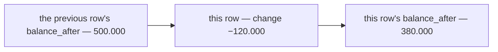

### The spec

| | |
| --- | --- |
| the rule | `balance_after` = the previous row's `balance_after` + this row's `change` |
| the first row | the `opening_balance` row — its `balance_after` is the money the account opened with |
| ⚠ still missing | the account the row belongs to — without it, *previous row* runs across every account of the team ([Contradiction](./context_clarify.md#one-ledger-and-its-state-and-its-log-have-different-grains)) |

## restock-is-never-typed-by-hand

> Chat *(owner, 2026-09-29)* — *"restock cant create by hand"*, after reading [Q10](./context_clarify.md#question):
> which way does each type come in, and may one come both ways? It answers Q10 for `restock` — as its recommendation,
> option A, puts it.

**The verdict.** A `restock` row *(line 70)* comes **only from the broker** — inventory records the restock, and the
account hears it. No hand screen offers `restock`, and no RPC takes one from a person.

**Why.** Typed here as well, one payment is two rows, and nothing tells which is the copy:

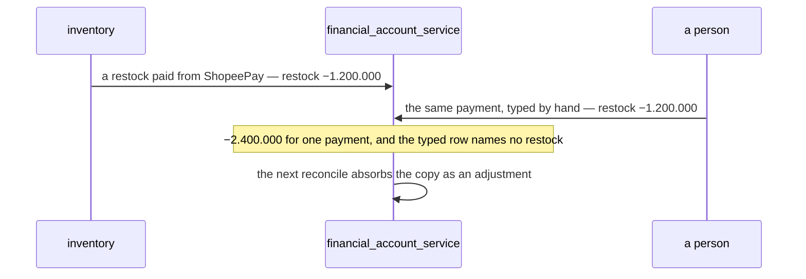

### The spec

| | |
| --- | --- |
| the way in | the broker only — a restock event from inventory, naming the account that paid ([Q2](./context_clarify.md#question)) |
| the hand screens | offer no `restock` — the four hand acts are New account, Transfer, Capital, Reconcile |
| a refund | the same way — inventory publishes it when a cancel says the money came back ([Q2](./context_clarify.md#question)) |
| until inventory publishes | ⚠ nothing does today. Until the event exists, a restock's payment reaches the account only through a reconcile — as an `adjustment`, money not yet recorded ([adjustment-is-for-reconciling-only](#adjustment-is-for-reconciling-only)) |

## one-way-in-per-type

> Chat *(owner, 2026-09-29)* — *"yes"*, to [Q10](./context_clarify.md#question) as narrowed and recommended: are
> `expense`, `revenue_fund` and `team_payment` never typed by hand either — each already recorded by its own service,
> an expense by `expense_service`, `revenue_fund` by settlement's withdrawal row, a team payment by liability's confirm?
> With [restock-is-never-typed-by-hand](#restock-is-never-typed-by-hand), it answers Q10 whole.

**The verdict.** Every type has **exactly one way in**. A type another service already records comes **only from the
broker**; a type no other service knows is **only typed by hand**. No type comes both ways — so one payment can never
be two rows.

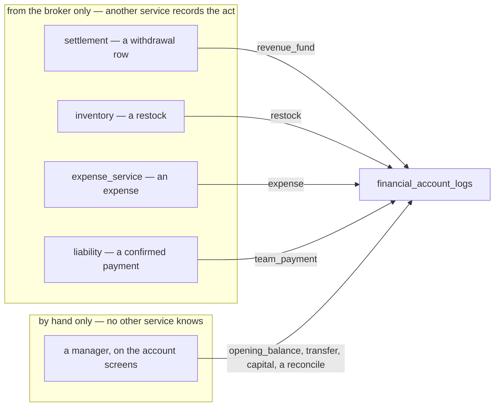

### The spec

| type | way in | recorded first by |
| --- | --- | --- |
| `revenue_fund` | broker only | settlement — a successful withdrawal row. ✅ `SettlementLogPosted` publishes it today |
| `restock` | broker only | inventory — [restock-is-never-typed-by-hand](#restock-is-never-typed-by-hand) · 🆕 its event |
| `expense` | broker only | `expense_service` · 🆕 its event |
| `team_payment` | broker only | liability — the creditor's confirm · 🆕 its event |
| `opening_balance` | by hand only | creating the account |
| `transfer` | by hand only | the account screens |
| `capital` | by hand only | the account screens |
| `adjustment` | by hand only | a reconcile — [adjustment-is-for-reconciling-only](#adjustment-is-for-reconciling-only) |

| | |
| --- | --- |
| how it holds | by structure: no RPC takes a `change_type` from a person, and each listener posts only its own type |
| until a publisher exists | its money reaches the account only through a reconcile — `revenue_fund`'s event exists; `restock`, `expense` and `team_payment` wait for theirs |

### What it narrows

- 🔄 [Q1](./context_clarify.md#question) — that `revenue_fund` is settlement's withdrawal row, heard from the broker,
  is settled here. Left: which account each shop's withdrawal lands in, and the rename.
- 🔄 [Q3](./context_clarify.md#question) — that an expense is typed in `expense_service`, never here, is settled here.
  Left: whether it names the account it was paid from, and which expenses name none.

## seeing-is-team-wide-moving-is-admin-and-up

> Chat *(owner, 2026-09-29)* — *"for q8, for now all user in team can see that, and admin up can move the money"*, to
> [Q8](./context_clarify.md#question): who sees a balance, and who moves one? **Seeing is against my
> recommendation** (option A — only the managers see); **moving is as recommended**.

**The verdict.** For now, **every member of a team sees its accounts** — their balances and their rows. **Admin and
up move the money**: they open, archive and restore accounts, and type every hand row.

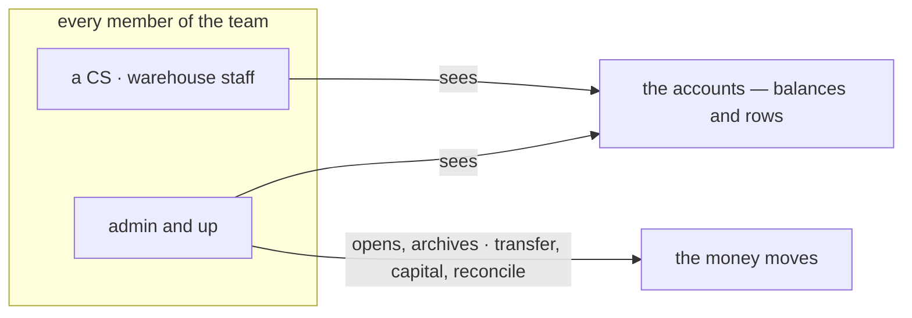

### The spec

| act | who |
| --- | --- |
| see the accounts, their balances and their rows | every member of the team · root and admin, every team's |
| open, archive, restore an account | admin and up |
| a transfer · capital · a reconcile | admin and up |
| name an account on another service's form | that form's own roles — ⚠ my reading: a CS raising a restock names the account that paid. That records a payment, heard from the broker; it moves nothing by hand |
| see where another team is paid | [Q9](./context_clarify.md#question) |

| *admin and up* — ⚠ my reading of *"admin up"*, yours to correct | roles |
| --- | --- |
| a selling team | `ROLE_TEAM_ADMIN`, `ROLE_TEAM_OWNER` |
| a warehouse team | `ROLE_WAREHOUSE_ADMIN`, `ROLE_WAREHOUSE_OWNER` |
| the root team, over every team | `ROLE_ADMIN`, `ROLE_ROOT` |
| — | the same six roles that record and confirm team payments today. If *admin* meant the root team alone, only head office would move a team's money — say so, and this is renamed |

### What seeing team-wide costs — recorded, not re-argued

- Every CS and every warehouse staff member sees how much the team holds, and each `capital` move the owner makes.
- ✅ **"For now" stays cheap to change.** Balances still come from their own RPC — `FinancialAccountOverview` — so
  narrowing who sees them later is one line in the proto, that request's policy, not a rework.

### What else it answers

Who reconciles ([adjustment-is-for-reconciling-only](#adjustment-is-for-reconciling-only)) and who types `capital`
([capital-joins-the-types](#capital-joins-the-types)): admin and up.

## revenue-stays-in-settlement

> `context.md` §What is `change_type` *(owner, 2026-09-29)* — `revenue_fund` became `withdrawal` *(line 69)*, and in
> chat: *"revenue fund stay in settlement, we record in financial account when only withdrawal happen"*. The naming
> half of [Q1](./context_clarify.md#question) — **against my recommendation** of `marketplace_withdrawal`.

**The verdict.** Revenue is **settlement's**: the platform paying the wallet — `fund`, every fee — is recorded there
and nowhere here. A financial account records the marketplace's money **only when it is withdrawn** — the moment it
reaches the bank — as a `withdrawal`, the same word settlement uses for the same act.

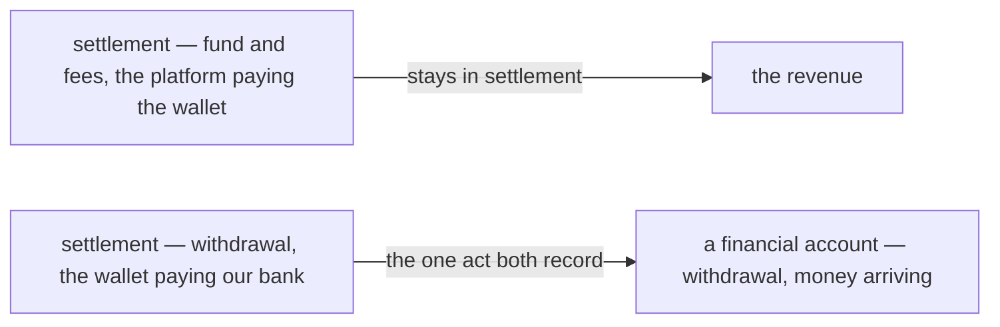

### The spec

| | |
| --- | --- |
| the type | `withdrawal` — was `revenue_fund` |
| what it records | a successful withdrawal row from settlement, heard from the broker ([one-way-in-per-type](#one-way-in-per-type)) |
| what it never records | `fund`, a fee, an adjustment — settlement's revenue |
| the sign | settlement's row is negative, money leaving the wallet · here it is positive, money arriving |
| ⚠ my spec — the label | an account's page shows the row as *+ Withdrawal from <the shop>* — the sign and the shop carry the direction |
| where it lands | still open — [Q1](./context_clarify.md#question) |

### What the name costs — recorded, not re-argued

One word for one act in both services is the reason to keep it. The cost: on a bank account's page, *withdrawal*
alone means money **leaving** the bank, and this row is money **arriving** — which is what the label above is for.

### The older entries

[one-way-in-per-type](#one-way-in-per-type) and [capital-joins-the-types](#capital-joins-the-types) say
`revenue_fund` — read it as `withdrawal`.

## a-shop-names-the-account-it-withdraws-into

> `context.md` §Table that Named `shop_accounts` *(owner, 2026-09-30)* — *"It's used to decide what account used by
> shops when like `withdrawal` happen"* *(lines 15–24)*. [Q1](./context_clarify.md#question) as recommended — option
> A, each shop names its account.

**The verdict.** A withdrawal lands in the account **its shop names** in `shop_accounts` — set up once per shop, never
chosen per withdrawal. A statement names the shop, never the bank, so the shop is where the answer is kept.

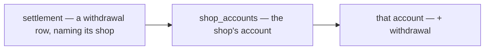

### The spec

| | |
| --- | --- |
| the table | `shop_accounts` — `team_id`, `shop_id`, `account_id` |
| what it decides | which account a withdrawal from the shop lands in. ⚠ The doc says *like* `withdrawal` — my reading: withdrawals only, until another use is named |
| a shop's bank changes | edit the shop's row — later withdrawals follow, earlier rows stay where they posted |
| ⛔ one shop, two rows | the key `(shop_id, account_id)` allows it, and then the table cannot decide — [Contradiction](./context_clarify.md#a-table-that-must-decide-one-account-allows-several) |
| a shop with no row | [Q11](./context_clarify.md#question) |
| ⚠ my spec — the account | the shop's own team's, and active |

## operational-accounts-pay-for-operations

> `context.md` §Table that Named `operational_accounts` *(owner, 2026-09-30)* — *"It's used to decide what account
> used for operational like restock"* *(lines 26–34)*. The *which account* part of [Q2](./context_clarify.md#question).

**The verdict.** A team **marks which of its accounts pay for its operations** — a restock first — in
`operational_accounts`. Those are the accounts an operational payment may come from.

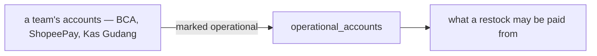

### The spec

| | |
| --- | --- |
| the table | `operational_accounts` — `team_id`, `account_id` unique |
| what it decides | which accounts pay for operations. ⚠ The doc says *like* restock — my reading: also the courier's ask at the door, and an expense ([Q3](./context_clarify.md#question)) |
| several per team | allowed by the key — a team paying restocks from ShopeePay and from BCA marks both. Which one paid a given restock: [Q2](./context_clarify.md#question) |
| ⚠ my spec — the account | the team's own, and active |

## a-shop-with-no-account-gets-an-unknown-one

> In chat *(owner, 2026-09-30)* — *"for q11 we create account that have type and account type unknown and connect to
> shop_accounts"* · `context.md` gains `unknown` in `type` *(line 57)* and `account_type` *(line 67)*.
> [Q11](./context_clarify.md#question) — **against my recommendation** of holding the withdrawal.

**The verdict.** A withdrawal from a shop with no `shop_accounts` row is **never held and never refused**. The service
creates an account whose `type` and `account_type` are both `unknown`, connects it to the shop in `shop_accounts`, and
posts the withdrawal into it — the money is recorded the moment it arrives, in an account that says *we do not know
which bank yet*.

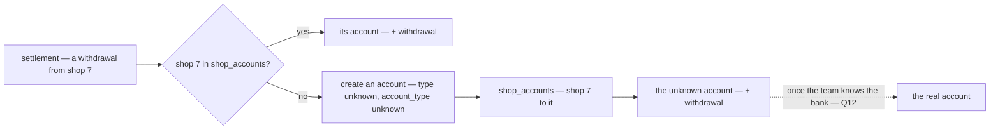

### The spec

| | |
| --- | --- |
| when | a withdrawal arrives from a shop with no `shop_accounts` row |
| what is created | a `financial_accounts` row — `type` `unknown`, `account_type` `unknown`, no number, `active` — and the shop's `shop_accounts` row pointing at it · then the withdrawal posts into it, in the same transaction |
| its number | none — so [a-real-account-is-recorded-once](#a-real-account-is-recorded-once) does not reach it, as for a cash box |
| ⚠ my spec — one per shop | made on the shop's first withdrawal and reused by every later one until it is identified. ⛔ Safe only when `shop_id` alone is unique — two withdrawals from one shop in the same second would each make one, and the composite key lets both in ([Contradiction](./context_clarify.md#a-table-that-must-decide-one-account-allows-several)) |
| ⚠ my spec — its name | *Unknown — <the shop>*, so the list says whose money it is |
| ⚠ my spec — its first row | the withdrawal itself — it opens at zero, and `opening_balance` stays by hand only ([one-way-in-per-type](#one-way-in-per-type)) |
| ⚠ my spec — what it can do | listed and counted in the team's total, warned *bank not named* · transfer out ✅ · never offered as operational, payee or *Paid from* · no reconcile — there is no statement to read |
| how it becomes the real account | open — [Q12](./context_clarify.md#question) |

### Why this beats what I recommended — recorded, not re-argued

I recommended holding the withdrawal until the shop named an account. This is better: no side table, the money counts
in the team's total from the day it arrived, and every withdrawal keeps its own row and date. The cost: the real bank
reconciles short by what the unknown account holds until it is identified — which is the right signal, and it points
at the missing name.

## an-unknown-account-is-filled-in-or-moved-in

> In chat *(owner, 2026-09-30)* — *"for q12 follow recomend"*. [Q12](./context_clarify.md#question) as recommended.

**The verdict.** An `unknown` account ([a-shop-with-no-account-gets-an-unknown-one](#a-shop-with-no-account-gets-an-unknown-one))
becomes the real one through one action, *Which account is this?* — **filled in** when the real account is not
registered yet, **moved in** when it is.

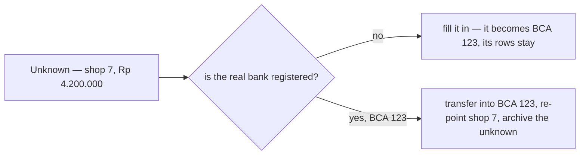

### The spec

| | |
| --- | --- |
| the action | `FinancialAccountIdentify` — admin and up ([seeing-is-team-wide-moving-is-admin-and-up](#seeing-is-team-wide-moving-is-admin-and-up)) · offered only on an `unknown` account |
| not registered yet — **fill in** | provider, number, holder and name set on the unknown account, `type` derived from the provider · its rows stay, each withdrawal on its own day |
| already registered — **move in** | one transaction: a `transfer` of the whole balance into the real account — two legs, one `group_id` — the shop's `shop_accounts` row re-pointed, the unknown account archived at zero |
| why not only one of them | fill in a registered number — [a-real-account-is-recorded-once](#a-real-account-is-recorded-once) refuses it · register new, then transfer — one row summing every withdrawal, dated the day it was fixed, beside a statement that lists each on its own day |
| later withdrawals | follow the shop's row — to the real account either way |
| the one exception | provider and number are fixed on every account — except `unknown`, filled in once |
| ⚠ my spec — the real account | the unknown one's own team's, active, not `unknown` |

## a-restock-must-name-the-account-that-paid

> In chat *(owner, 2026-09-30)* — *"for q2 follow recomend but its not optional"*, and asked which part was not
> optional: *"Both"* — the restock's account and the expense's. [Q2](./context_clarify.md#question) as recommended,
> with the account **required** — against the recommendation's *not paid yet*.

**The verdict.** Every restock names, when it is created, the operational account that paid for it — there is no
*not paid yet*. Inventory publishes the payment, and this service posts it.

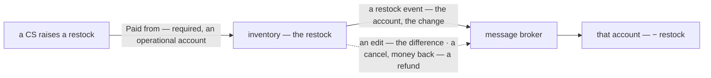

### The spec

| | |
| --- | --- |
| which account | **required** at create — one of the team's operational accounts ([operational-accounts-pay-for-operations](#operational-accounts-pay-for-operations)), pre-filled when there is only one · replaces `payment_type` on new restocks |
| how much | goods plus shipping, from the restock's own lines — no separate *amount paid* |
| when | at create — the money left when the restock was raised |
| an edit | posts the difference, never the whole again |
| a cancel | asks *did the money come back?* — yes posts a refund into the account that paid, no posts nothing |
| the courier's ask | the warehouse's cost line names the warehouse's own operational account — usually its cash box · ⚠ my reading: required too, as *not optional* covers the whole of Q2 |
| restocks already made | keep their `payment_type` — nothing posts back |
| the account | the restock team's own, active, operational |
| the event | new — inventory publishes nothing today · it carries the account and the change, never the restock's total |
| ⚠ my spec — no operational account | the form cannot be sent, and says *ask an admin to mark an operational account* — marking one is admin and up |
| ⚠ launch | every team starts with no account — its accounts and one operational mark are set up before the field ships, or no restock can be raised |

### What *required* costs — recorded, not re-argued

A restock bought on credit — the supplier paid days later — is recorded as paid the day it is raised: the account
drops before the bank does, and a reconcile in between finds the gap. The gain: no restock is ever left with its
payment unrecorded.

## an-expense-must-name-the-account-that-paid

> In chat *(owner, 2026-09-30)* — the same answer's *"Both"*: [Q3](./context_clarify.md#question) as recommended,
> with *Paid from* **required** — against the recommendation's *optionally*.

**The verdict.** Every expense a person types names the account it was paid from. Expense publishes it, this service
posts it, and a void reverses it.

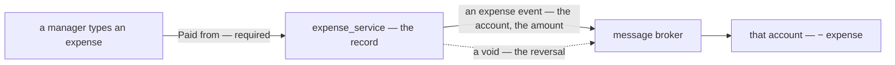

### The spec

| | |
| --- | --- |
| which account | **required** — one of the team's operational accounts, the list a restock picks from |
| the kinds a person types | `ADS`, `PAYROLL`, `OPERATIONAL`, `OTHER` — each names an account |
| `STOCK_LOSS` | ⚠ my reading: outside the rule — inventory posts it, no person types it, and it moves no cash: goods written off at their cost |
| an ads charge the platform took from the seller balance | open — [Q13](./context_clarify.md#question): no bank moved, and settlement already records it |
| a void | publishes the reversal — the account gets its money back |
| the event | new — expense publishes nothing today |
| ⚠ my spec — expenses already made | nothing posts back — each account's opening balance already holds the past |
| ⚠ my spec — no operational account | the form cannot be sent — as for a restock |

### What *required* costs — recorded, not re-argued

An expense cannot be recorded until someone knows which account paid it — a receipt with no account waits. The gain:
every expense typed is in a balance, so a reconcile finds only what was never typed.

## settlement-ads-and-accounts-are-independent

> In chat *(owner, 2026-09-30)* — *"for q13, ads in settlement and financial its independent, no connection, so no
> need sync it"*. [Q13](./context_clarify.md#question) — my *Marketplace balance* choice stays withdrawn.

**The verdict.** An ad the platform withheld and an ad we paid for live in two books that **never connect**:
settlement keeps its ads rows, a financial account keeps only the ads an `ADS` expense says an account paid — and
nothing syncs, matches or copies between them.

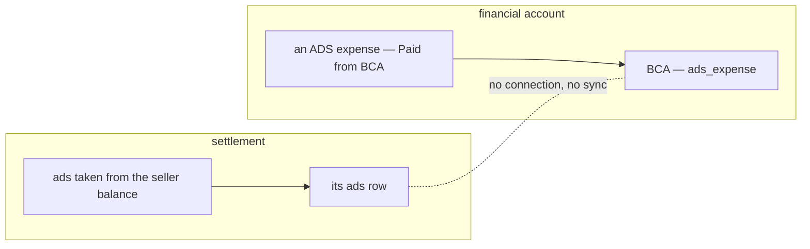

### The spec

| | |
| --- | --- |
| settlement's ads rows | never reach an account — the settlement listener posts only `withdrawal` rows ([revenue-stays-in-settlement](#revenue-stays-in-settlement)) |
| an ad in a financial account | only through an `ADS` expense, *Paid from* the account that paid it ([an-expense-must-name-the-account-that-paid](#an-expense-must-name-the-account-that-paid)) — posted as `ads_expense` ([ads-expense-joins-the-types](#ads-expense-joins-the-types)) |
| *Paid from* on `ADS` | required with no exception — no *Marketplace balance* choice |
| between the two | nothing — no sync, no matching, no cross-check |
| ⚠ my reading — an ad the platform withheld | is not typed as an `ADS` expense: typed, it would have to name an account that never paid it |
| ⚠ my spec — the form | on `ADS`, a hint: *taken from the seller balance? It is already in settlement* — text only, no link between the books |

## ads-expense-joins-the-types

> `context.md` §What is `change_type` *(owner, 2026-09-30)* — `ads_expense` added *(line 93)*, beside `expense`.

**The verdict.** Ads paid from an account are a type of their own, `ads_expense` — so an account's page and its
totals say how much went on ads apart from every other expense.

```mermaid
flowchart LR
  E["expense_service — an expense, Paid from BCA"] --> K{"its kind"}
  K -->|"ADS"| AD["BCA — ads_expense"]
  K -->|"PAYROLL, OPERATIONAL, OTHER"| EX["BCA — expense"]
```

### The spec

| | |
| --- | --- |
| the type | `ads_expense` — out · a void reverses it |
| ⚠ my reading — the way in | the broker only — the same expense event, when its kind is `ADS`: an ads expense is recorded in `expense_service`, and [one-way-in-per-type](#one-way-in-per-type) sends what another service records through the broker. Typed here as well, one ad would be in two places |
| `expense` | now means every other kind a person types — `PAYROLL`, `OPERATIONAL`, `OTHER` |
| settlement's ads | never — [settlement-ads-and-accounts-are-independent](#settlement-ads-and-accounts-are-independent) |

## a-shop-has-one-account

> `context.md` §Table that Named `shop_accounts` *(owner, 2026-09-30)* — line 19 now reads *"`shop_id`, its unique."*,
> was *"its composite unique with `account_id`"*. The
> [contradiction](./context_clarify.md#a-table-that-must-decide-one-account-allows-several) resolved as recommended.

**The verdict.** A shop names **one** account — `shop_id` is unique in `shop_accounts`. An account may still take
many shops' withdrawals, and `operational_accounts` still marks several per team, because a restock names which one
paid.

```mermaid
flowchart LR
  S1["shop 1"] --> BCA["BCA"]
  S2["shop 2"] --> BCA
  S3["shop 3"] --> J["Jago"]
  W["a withdrawal from shop 1"] -->|"one row, one answer"| BCA
```

### The spec

| | |
| --- | --- |
| the key | `shop_accounts (shop_id)` unique |
| a shop's bank changes | edit its row — later withdrawals follow, earlier ones stay where they posted ([a-shop-names-the-account-it-withdraws-into](#a-shop-names-the-account-it-withdraws-into)) |
| one account, many shops | allowed — one BCA may take every shop's withdrawals |
| two withdrawals from a new shop at once | the second one's `shop_accounts` insert is refused ([a-shop-with-no-account-gets-an-unknown-one](#a-shop-with-no-account-gets-an-unknown-one)) · ⚠ my spec: its transaction rolls back whole — no orphan `unknown` account — and the retry finds the first one's row and posts there |
| `operational_accounts` | unchanged — several per team ([operational-accounts-pay-for-operations](#operational-accounts-pay-for-operations)) |

## the-team-record-holds-no-bank

> In chat *(owner, 2026-09-30)* — *"remove bank info like bank_type, bank_owner_name, bank_account number in team
> info"*, then, asked whether to keep the stored numbers until this service could copy them: *"Drop now"*. Two parts
> of [Q9](./context_clarify.md#question) — whether a team's bank is an account, and what happens to the three fields.

**The verdict.** `team_infos` holds **no bank**. Its three bank columns are dropped — not copied — and the only place
a team's bank lives is a financial account.

```mermaid
flowchart LR
  subgraph "team_infos — after 00008"
    C["contact_number · return warehouse · default warehouse"]
  end
  subgraph "financial accounts"
    A["BCA 123 — the team's bank, typed once"]
  end
  X["bank_type · bank_owner_name · bank_account_number"] -->|"dropped, not copied"| G["gone"]
```

### The spec

| | |
| --- | --- |
| the columns | `bank_type`, `bank_owner_name`, `bank_account_number` dropped — `team_service` migration `00008_drop_team_bank` |
| the contract | `TeamInfo` and `TeamInfoUpdateRequest` reserve fields 3–5 and their names |
| the screens | the team detail's section and the row menu read *Contact* · the dialog edits the contact number only |
| a number stored before | gone — a team enters it again as a financial account · the copy Q9 proposed does not happen, so its collision ripple of [a-real-account-is-recorded-once](#a-real-account-is-recorded-once) is moot |
| ⚠ my reading — is it an account | yes, by elimination: a team's bank has no other home now |
| ⚠ until this service ships | no screen shows where a team is paid — a payer in balance's Payment Flow asks the creditor |
| still open | where a team is paid, who sees it, where it shows — [Q9](./context_clarify.md#question) |

## every-log-row-names-its-account

> `context.md` §Table that Named `financial_account_logs` *(owner, 2026-09-30)* — `account_id` added *(line 82)*.
> The [contradiction](./context_clarify.md#one-ledger-and-its-state-and-its-log-have-different-grains) resolved as
> recommended.

**The verdict.** Every log row names the **account** it moved — the ledger's state and its log now share one scope,
the account, as [the-accounts-are-one-ledger](#the-accounts-are-one-ledger) needs.

```mermaid
flowchart LR
  A1["BCA — balance 12.345.000"] --- L1["BCA's rows — balance_after runs for BCA alone"]
  A2["Kas Gudang — balance 800.000"] --- L2["Kas Gudang's rows — its own running balance"]
```

### The spec

| | |
| --- | --- |
| the column | `account_id` on every `financial_account_logs` row — the scope, a `financial_accounts.id` |
| `balance_after` | one account's running balance — that account's previous row plus this `change` ([the-log-says-balance-after](#the-log-says-balance-after)) |
| `team_id` | stays beside it — ⚠ my reading: a copy, so a team's rows read without a join |
| a transfer, a team payment | two rows, one per account — each leg names its own ([opening-transfer-and-team-payment-join-the-types](#opening-transfer-and-team-payment-join-the-types)) |
| ⚠ my spec — the read | an index on `(account_id, id)` — an account's page reads its rows newest first |
| still missing from the log | the row behind it — critique 1 · the day the money moved — critique 7 |

## provider-replaces-account-type

> `context.md` §Table that Named `financial_accounts` *(owner, 2026-09-30)* — `account_type` renamed `provider`
> *(lines 43, 61–69)*. The first half of [critique 2](./context_clarify.md#critique).

**The verdict.** The column that says **who holds the money** — BCA, BNI, Jago, ShopeePay, a cash box — is
`provider`. `type` stays beside it as the kind: wallet, bank account, cash.

```mermaid
flowchart LR
  P["provider — bca"] -->|"its kind"| T["type — bank_account"]
  P2["provider — shopeepay"] -->|"its kind"| T2["type — wallet"]
```

### The spec

| | |
| --- | --- |
| `provider` | `cash`, `bca`, `bni`, `jago`, `shopeepay`, `unknown` |
| `type` | stays — `wallet`, `bank_account`, `cash`, `unknown` |
| still open | whether `type` is picked or derived from `provider` — [critique 2](./context_clarify.md#critique) |
| ⚠ my spec — a new bank | an append to the list, never free text |
| the older entries | [a-real-account-is-recorded-once](#a-real-account-is-recorded-once), [shopeepay-is-the-wallet-a-team-pays-with](#shopeepay-is-the-wallet-a-team-pays-with) and [a-shop-with-no-account-gets-an-unknown-one](#a-shop-with-no-account-gets-an-unknown-one) say `account_type` — read it as `provider` |

## an-account-has-a-name-and-a-holder

> `context.md` §Table that Named `financial_accounts` *(owner, 2026-09-30)* — `name` and `holder_name` added
> *(lines 46–47)*. [Critique 3](./context_clarify.md#critique) as recommended.

**The verdict.** Every account carries a **`name`** — what the team calls it, *BCA Operasional*, *Kas Gudang* — and a
**`holder_name`**, the *atas nama* a payer checks before transferring.

```mermaid
flowchart LR
  P["Paid from"] --> A["BCA Operasional — 123…"]
  P --> B["BCA Gaji — 456…"]
  P --> C["Kas Gudang"]
```

### The spec

| | |
| --- | --- |
| `name` | what every list and picker shows — two BCA accounts told apart by name, not by ten digits |
| ⚠ my spec — `name` | required, unique in the team |
| `holder_name` | the *atas nama* · ⚠ my spec: empty for a cash box |
| an `unknown` account | named *Unknown — <the shop>* ([a-shop-with-no-account-gets-an-unknown-one](#a-shop-with-no-account-gets-an-unknown-one)) |
| ⚠ my spec — editing | both editable; the provider and number are not |

## the-log-keeps-the-day-the-money-moved

> `context.md` §Table that Named `financial_account_logs` *(owner, 2026-09-30)* — `occurred_at` added *(line 90)*.
> [Critique 7](./context_clarify.md#critique) as recommended.

**The verdict.** Every log row carries **`occurred_at`** — when the money moved — beside `created_at`, when the row was
written. The two differ whenever a movement is recorded late, and the bank statement lists the first.

```mermaid
flowchart LR
  T["a transfer made on 29 Sep"] --> R["typed on 30 Sep"]
  R --> O["occurred_at — 29 Sep, what the statement lists"]
  R --> C["created_at — 30 Sep, when it was typed"]
```

### The spec

| | |
| --- | --- |
| a row from the broker | its event's own time — when the withdrawal, restock, expense or payment happened |
| a row by hand | picked on the form, defaulting to today |
| ⚠ my spec — its type | `timestamptz`, as its `_at` name says; a hand row picks a day |
| ⚠ my spec — `balance_after` | still runs in entry order, so a late row never rewrites the rows after it |
| a reconcile | lines rows up with the statement by `occurred_at` |

## an-account-opens-with-a-log-row

> In chat *(owner, 2026-09-30)* — *"for crit4, yes but its recorded as log"* · `opening_balance` listed again at
> line 105. [Critique 4](./context_clarify.md#critique) as recommended.

**The verdict.** An account created by hand opens with its first **log row**, `opening_balance` — the money already in
it on the day it is registered. Its balance is never set without that row.

```mermaid
flowchart LR
  C["create BCA Operasional — Rp 50.000.000 already in it"] --> L["log — opening_balance +50.000.000, balance_after 50.000.000"]
  L --> S["financial_accounts — balance 50.000.000"]
```

### The spec

| | |
| --- | --- |
| when | `FinancialAccountCreate` — in the same transaction that inserts the account |
| the row | `change_type` `opening_balance` · `change` = the amount typed · `balance_after` = the same · `occurred_at` = the day it was counted |
| ⚠ my spec — at zero | still posts, a row of 0 — every account made by hand starts its log with who opened it and when |
| an `unknown` account | none — the broker makes it, and its first row is the withdrawal ([a-shop-with-no-account-gets-an-unknown-one](#a-shop-with-no-account-gets-an-unknown-one)) |
| ⚠ my spec — a filled-in `unknown` account | none — it already has rows ([an-unknown-account-is-filled-in-or-moved-in](#an-unknown-account-is-filled-in-or-moved-in)) |
| ⚠ my spec — a wrong opening figure | corrected by a reconcile, never by editing the row ([adjustment-is-for-reconciling-only](#adjustment-is-for-reconciling-only)) |

## an-account-is-archived-only-at-zero

> In chat *(owner, 2026-09-30)* — *"for critique 8, yes, allow archiving when balance zero"*.
> [Critique 8](./context_clarify.md#critique) as recommended.

**The verdict.** An account can be archived only when its balance is **zero**. The money is moved out — a transfer —
or found missing — a reconcile — first, so nothing a team holds drops out of its total.

```mermaid
stateDiagram-v2
  [*] --> active: create — opening_balance
  active --> archived: archive — balance is zero
  archived --> active: restore
```

### The spec

| | |
| --- | --- |
| archive | refused unless `balance` is 0 — the screen says *move the money out first* and offers Transfer and Reconcile |
| who | admin and up ([seeing-is-team-wide-moving-is-admin-and-up](#seeing-is-team-wide-moving-is-admin-and-up)) |
| ⚠ my spec — while archived | no row by hand · readable everywhere · restorable |
| ⚠ my spec — a row from the broker | still posts — refused, it would dead-letter · the pickers stop offering an archived account, and a row that lands anyway shows it as money to move out |
| an `unknown` account | its move-in archives it at zero ([an-unknown-account-is-filled-in-or-moved-in](#an-unknown-account-is-filled-in-or-moved-in)) |

## type-and-provider-are-picked-apart

> In chat *(owner, 2026-09-30)* — *"for 2, its okay for that"*, and asked which: *"Leave as is"*. The second half of
> [critique 2](./context_clarify.md#critique) — **against my recommendation** of deriving `type` from `provider`.

**The verdict.** `type` and `provider` are **two fields, picked apart**. Nothing derives one from the other, and
nothing refuses a pair that disagrees.

```mermaid
flowchart LR
  F["the account form"] --> P["provider — picked"]
  F --> T["type — picked"]
  P -.-|"no rule between them"| T
```

### The spec

| | |
| --- | --- |
| `provider` | picked from its list ([provider-replaces-account-type](#provider-replaces-account-type)) |
| `type` | picked from its list — never filled in from the provider |
| a pair that disagrees | allowed — `bank_account` with `shopeepay` saves |

### What it costs — recorded, not re-argued

The totals per kind — bank, wallet, cash — read `type`. An account whose type was mis-picked counts its money under
the wrong kind, and nothing points at it. The gain: a provider that is both, or neither, never waits for a table to
be changed.

## the-description-names-the-cause

> In chat *(owner, 2026-09-30)* — *"for 1, description is enough"*. [Critique 1](./context_clarify.md#critique) —
> **against my recommendation** of `source_id` and `reversal`.

**The verdict.** A log row says why the balance moved in its **`description`**, and nothing else. There is no
`source_id` pointing at the restock, expense, withdrawal or payment behind it, and no `reversal` flag.

```mermaid
flowchart LR
  E["a restock paid from BCA"] --> L["BCA's log row — restock −2.000.000"]
  L --> D["description — Restock R-1042, from Supplier A"]
```

### The spec

| | |
| --- | --- |
| the cause | `description` — text written by whoever posts the row |
| ⚠ my spec — a broker row | the listener writes it from the event — *Restock R-1042*, *Withdrawal from <the shop>*, *Expense E-88* — so every one reads alike |
| a correction | an ordinary row, its `description` saying what it undoes |
| a redelivered event | still posts once — the listener claims its `event_id` beside the write ([one-contract-for-both-handler-types](../../technical/event_architecture/context_decision.md#one-contract-for-both-handler-types)), which needs no column on the row |

### What it costs — recorded, not re-argued

*Why did BCA drop 2.000.000?* is answered by reading the text, never by opening the restock — a row cannot link to
its cause, and a report cannot join one. The gain: the log keeps the owner's field list, and nothing about it
depends on another service's ids.

## a-team-payment-posts-on-accept

> In chat *(owner, 2026-09-30)* — *"financial account only listen event accept payment from balance service, and
> balance service must send event to/from financial account id"*. Settles when a `team_payment` posts
> ([opening-transfer-and-team-payment-join-the-types](#opening-transfer-and-team-payment-join-the-types) had it as my
> spec) and what the event carries.

**The verdict.** A team payment reaches the financial accounts **only when the creditor accepts it**. The balance
service — `liability_service` in the build — publishes the acceptance carrying the **from** account, the payer's, and
the **to** account, the creditor's; the listener posts one `team_payment` row on each.

```mermaid
sequenceDiagram
  participant A as Team A — the payer
  participant L as balance service
  participant F as financial accounts
  participant B as Team B — the creditor
  A->>L: record — proof, from BCA A
  B->>L: accept — to BCA B
  L-->>F: payment accepted — from BCA A, to BCA B, amount
  F->>F: team_payment −amount on BCA A
  F->>F: team_payment +amount on BCA B
  Note over L,F: record and reject publish nothing to this service
```

### The spec

| | |
| --- | --- |
| heard | the acceptance only — a recorded or rejected payment moves no account |
| the event carries | `from_account_id` — the payer's · `to_account_id` — the creditor's · the amount · when it was accepted |
| the balance service holds | both ids on the payment — new in `liability_service` · ⚠ my reading: *from* picked by the payer when recording, *to* fixed by the creditor when accepting |
| the rows | two `team_payment` rows in one transaction — out of *from*, into *to* · ⚠ my spec: sharing a `group_id` |
| ⚠ my spec — `occurred_at` | when the creditor accepted |
| a redelivered event | posts once — its `event_id` claimed ([one-contract-for-both-handler-types](../../technical/event_architecture/context_decision.md#one-contract-for-both-handler-types)) |
| an accepted payment later reversed | not heard — open: [Q14](./context_clarify.md#question) |
