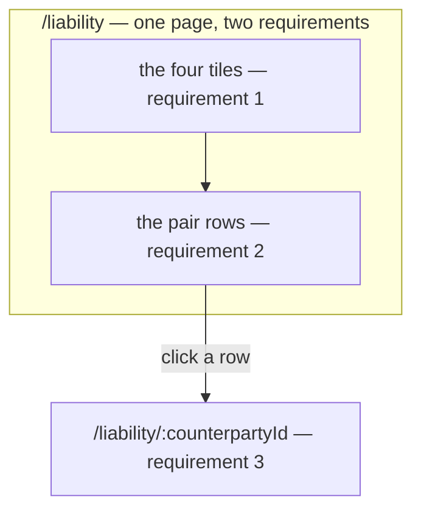
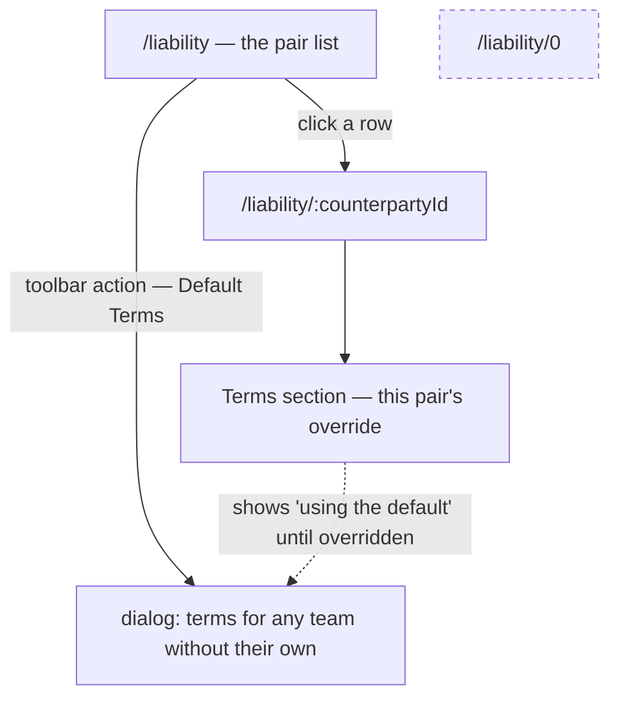

# Decisions — the liability list

The owner's decisions about the **liability list** (`/liability`) — what teams owe each other. **Append-only** (RULE 12): a reversed decision is renamed and its references grepped.

The rules every screen follows are in [context_decision.md](context_decision.md). These were recorded in
[technical/balance/team_balance_design_decision.md](../../technical/balance/team_balance_design_decision.md) first and moved here on 2026-10-02; each old heading there now points here.

| decision | what it settles |
| --- | --- |
| [the-summary-is-tiles-on-the-list](#the-summary-is-tiles-on-the-list) | *Summarize All Balance* is the **tiles on `/liability`** — and the totals must come from the SERVER, not the loaded page |
| [the-default-terms-row-is-a-dialog-on-the-list](#the-default-terms-row-is-a-dialog-on-the-list) | `counterparty_id = 0` is edited in a **dialog opened from the list**. ⚠ against recommendation. Fixes a live regression |

## the-summary-is-tiles-on-the-list

> The owner, in chat — *"q7, tile on the list"*, answering [Q7](../../technical/balance/team_balance_design_clarify.md#question).

**The verdict.** *"Summarize All Balance"* is the **tiles on top of `/liability`**, not a screen of its
own. ✅ Closes as this file recommended.

§Frontend Requirements names **three requirements**, served by **two pages** — items 1 and 2 are one
screen read top to bottom.

### ⛔ It does not fix the tiles — it makes fixing them mandatory

[Critique 16](../../technical/balance/team_balance_design_clarify.md#critique) survives this answer intact, and the answer
raises its cost: a separate screen could have run its own whole-set query, while a tile sitting on a
**paginated** list is now permanently exposed to the list's page window.

Today three of the four reduce `rows` — one page of **20**, further narrowed client-side by the
search box. A creditor with 21 counterparties reads a headline total that omits the 21st, and turning
to page 2 changes the "total".

| tile | today | after |
| --- | --- | --- |
| Awaiting confirmation | ✅ **already whole-set** — `LiabilityPositionListResponse.awaiting_confirmation` | unchanged. It is the precedent for the other three |
| Total payable | ⛔ `rows.reduce(…)` over the loaded page | from the response |
| Total receivable | ⛔ `rows.reduce(…)` over the loaded page | from the response |
| Oldest unsettled | ⛔ `rows.sort(…)[0]` over the loaded page | from the response — **and it needs the counterparty id too**, because the tile renders that team's name beneath the day count |

### The spec

Three fields on `LiabilityPositionListResponse`, beside `awaiting_confirmation` — the whole-set
number that already ships, so both the shape and the precedent are the service's own:

| field | |
| --- | --- |
| `int64 total_receivable` | Σ of positive balances across **every** counterparty, not the page |
| `int64 total_payable` | Σ of negative balances, as a positive magnitude — the screen never renders a sign ([direction.ts](../../../frontend/src/features/liability/direction.ts)) |
| `uint64 oldest_unsettled_counterparty_id` | whose `oldest_unsettled_at_unix` is the smallest non-zero one, so the tile can name the team. The timestamp itself is read from that row |

⚠ **A `LiabilitySummary` RPC is refused** — a second round trip for numbers the list query already
touches every row of.

⚠ **The client-side search must stop narrowing the tiles.** It filters `positions` in the browser, so
leaving it in place makes the tiles disagree with the filter in a new way — the summary is *all*
balance by requirement, and a search box is not a scope.

### What it does NOT settle

The **80% warning** is a per-row badge, not a tile ([Q9](../../technical/balance/team_balance_design_clarify.md#question) is
still open on where the debtor's half lives). A tile that said *"3 teams near their limit"* would be a
fifth summary number nobody asked for.

---

## the-default-terms-row-is-a-dialog-on-the-list

> The owner, in chat — *"q6, dedicated popup in list"*, answering [Q6](../../technical/balance/team_balance_design_clarify.md#question).

**The verdict.** The DEFAULT row — `counterparty_id = 0`, the terms applying to every team without
their own — is edited in a **dedicated dialog opened from `/liability`**.

⚠ **This closes against the recommendation**, which put the default on the creditor's own team
settings. The owner's answer keeps it one click from the rows it governs; the recommendation kept it
next to the other things a team configures about itself. Both were defensible and the placement is
now settled.

### ✅ It needs no proto change, and no new route

Verified against the shipped contract — both halves already exist and are already reachable:

| | |
| --- | --- |
| read | `LiabilityTermsList` returns every terms row for the creditor, **default first** — [terms_list.go:21](../../../backend/services/liability_service/liability_v1/terms_list.go) orders by `counterparty_id ASC` precisely so it leads. The dialog takes the row where `counterparty_id == 0` |
| write | `LiabilityTermsSet` with `counterparty_id = 0` — the field carries no `gt = 0` constraint, and its comment already says *"0 sets the DEFAULT row"* |
| hooks | `useLiabilityTerms` / `useSetTerms` in [features/liability/queries.ts](../../../frontend/src/features/liability/queries.ts) — both exist, neither is called by a page today |

### The spec

| | |
| --- | --- |
| trigger | one toolbar action on `/liability`, beside the search — **not** a row, because the default is not a counterparty |
| body | `TermsEditDialog` with no `editing` counterparty and no `options` picker — the counterparty is fixed at 0 |
| wording | the dialog says *"terms for any team without their own"*. It must never read as *"terms for team 0"* |
| ⚠ file move | `TermsEditDialog` currently lives in [pages/liability-detail/components/](../../../frontend/src/pages/liability-detail/components/TermsEditDialog.tsx). A second page importing it makes it a domain component — it moves to **`features/liability/`**, per CLAUDE.md's placement rule. `CreditMeter` moves with it: the dialog imports `limitStateOf` from it |
| the pair section | shows the inherited value with a **"using the default"** marker until somebody overrides it — an exception to a rule should look like one |

### ⛔ A synthetic `/liability/0` route stays refused

It puts a page in the pair namespace for something that is not a pair, and every list row, breadcrumb
and back-link would special-case it. The dialog is what makes that route unnecessary.

### ⚠ It qualifies the decision above it, and the qualification is worth naming

[terms-live-on-the-pair-detail](../../technical/balance/team_balance_design_decision.md#terms-live-on-the-pair-detail) reasoned *"terms are read where the
pair is read"*. That rule has exactly one exception and this is it: the default has no pair, so it is
read where the **set of pairs** is read. Not a contradiction — that decision opened this question
itself — but the rule is now *"a pair's terms live on the pair, the default lives on the list"*, and
restating the shorter version elsewhere would be wrong.

### What it fixes

⛔ A **live regression**: the default row has been settable nowhere in the running app since the terms
list screen was deleted. §Balance Policy's threshold for every unconfigured team has required direct
database access.
