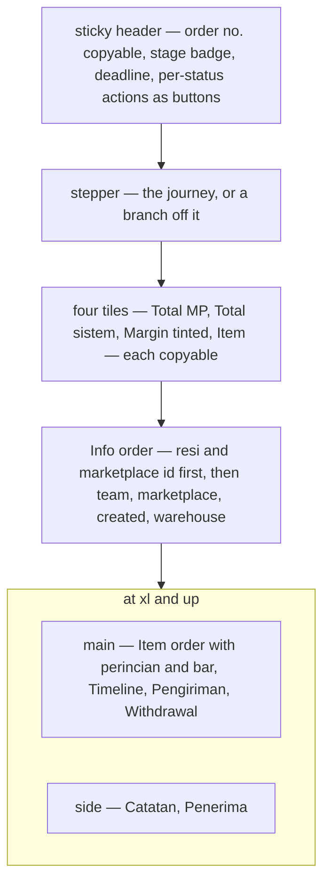
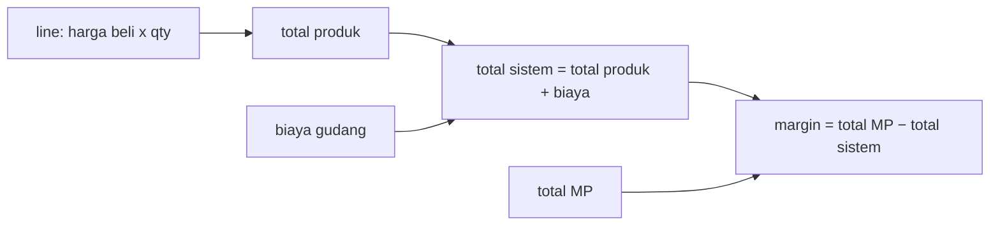
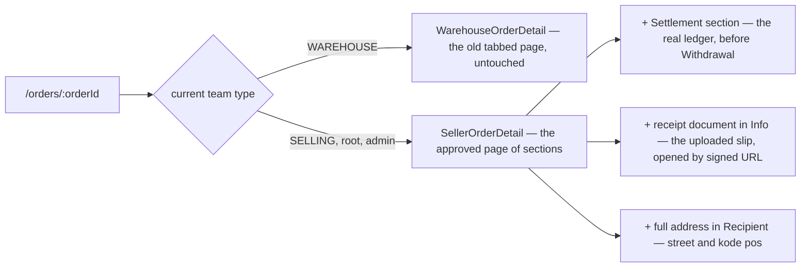
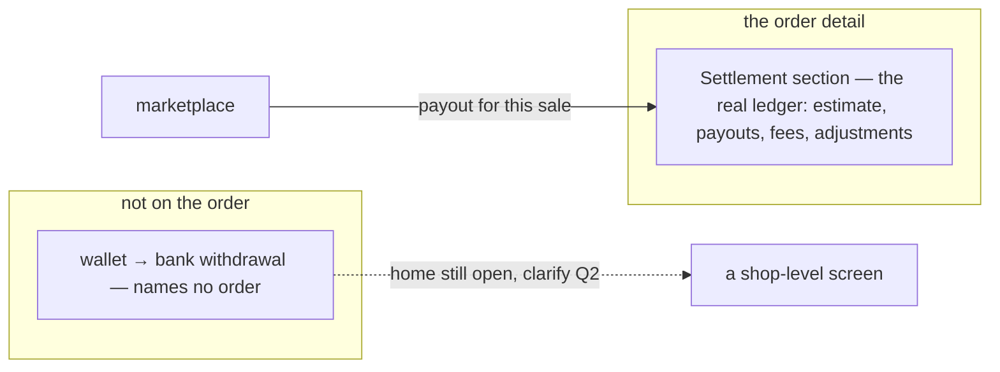

# Decisions — the order detail

The owner's decisions about the selling team's **order detail** (`/orders/:orderId`). **Append-only** (RULE 12): a reversed decision is renamed and its references grepped.

The rules every screen follows are in [context_decision.md](context_decision.md). These were recorded in
[technical/order/design_decision.md](../../technical/order/design_decision.md) first and moved here on 2026-10-02;
each old heading there now points here.

| decision | what it settles |
| --- | --- |
| [the-order-detail-is-one-page-of-sections](#the-order-detail-is-one-page-of-sections) | the detail is one page of sections with a scrolling left nav — not three tabs |
| [the-order-detail-lines-are-priced-at-harga-beli](#the-order-detail-lines-are-priced-at-harga-beli) | the item table shows what we PAID, so the perincian adds up to the list's figures |
| [the-detail-margin-is-mp-minus-system](#the-detail-margin-is-mp-minus-system) | margin = total MP − total sistem, the list's formula read from the detail |
| [the-detail-preview-became-the-order-detail](#the-detail-preview-became-the-order-detail) | a seller's `/orders/:id` IS the approved page now — and it keeps the two wired features the preview lacked |
| [settlement-replaces-withdrawal-on-the-order](#settlement-replaces-withdrawal-on-the-order) | the order's money-back section IS the settlement ledger; withdrawals stay a shop-level question |

## the-order-detail-is-one-page-of-sections

> Owner, in chat (2026-09-29): *"oke detail aku setujui"* — approving the preview
> `Pages/Order/OrderDetailNextPage` after a round of changes.

The order detail is **one page of sections**, not the built page's three tabs, with a left navigation
that scrolls to each. The question it answers — *what happened with this order* — is usually answered by
two sections at once, and tabs put exactly those pairs on opposite sides of a click.

| part | the spec |
| --- | --- |
| **header** (sticky, one line) | `Pesanan #id` with the number copyable · stage badge · deadline badge · the list's per-status actions as **buttons**, folding into `⋯` only past three (never a `⋯` of one; destructive ones fold first) |
| **navigation** | left column on a desktop, chips inside the sticky block on a phone; short labels (`Withdrawal`), the card keeps its full title; the same icon on the card and the nav item; click scrolls the section just below the header; scrolling lights the section being read — in two columns, the main column only |
| **stepper** (not sticky) | Menunggu → Diproses → Dikirim → Selesai; an off-journey status is a branch in its own hue, cancel from Menunggu, the rest from Dikirim |
| **tiles** | Total MP · Total sistem · Margin (success/error by sign) · Item; each copies a plain number (`245000`, not `Rp 245.000`) |
| **Info order** | full width; the resi (courier + number) and the marketplace order id first and a size larger, both copyable; a return resi only when a return exists |
| **Catatan** | its own section: a list, newest first, of `system` and `user` notes; user notes editable, system notes never; `Order.note` is the first user note |
| **Item order** | per line: the marketplace's own title (as on the draft) above our product — image, name, SKU — then team, **harga beli**, qty, line total |
| **perincian** | full-width panel: total produk + biaya = total sistem, total MP, margin — and a bar across harga MP split into produk · biaya · margin (a loss draws as a red overflow; no bar without both facts) |
| **Timeline** | status changes on a dotted rail, newest first — the same rail as the courier trail |
| **Pengiriman** | two legs of one shape, side by side: order (courier · resi · deadline · trail) and return (only when there is one) |
| **Penerima** | name, address, and the phone as a copy button |
| **Withdrawal** | the owner's columns, invented rows — its home is still open (see the clarify file) |
| **WD summary** | under the withdrawal table: total WD · penyesuaian · bersih diterima · % of total MP — the per-order figures the old system reported, summed from the rows |
| **build marks** | every ⚠ sits BESIDE the label or title it belongs to, as on the order form and the list — never pushed to a card's far edge, where the withdrawal table's mark read as belonging to nothing. `EveryDeclaredGapIsMarkedOnScreen` fails if a declared gap has no badge on screen |

⚠ **Still a preview.** It is not routed; `/orders/:id` opens `pages/order-detail` until it is applied, the
way the order list was. Every invented figure keeps its ⚠ mark.

## the-order-detail-lines-are-priced-at-harga-beli

> Settled by approving the preview, which prices the lines at harga beli; was open as *is the order
> detail's "harga" what we PAID or what we CHARGED?*

The item table's price column is **what we paid** (`OrderItem.unit_cost`), and the perincian under it
sums those. That is what makes the detail's percentage the SAME as the list's: the list's margin is
`harga MP − (cogs + biaya)`, so the detail's total sistem has to be `cogs + biaya`.

## the-detail-margin-is-mp-minus-system

> Settled by approving the preview; was open as *the subtraction is written the other way up — which is
> it?* The owner had written *"total sistem dikurangi lagi dengan total mp"*.

**`margin = total MP − total sistem`**, as a share of total MP — the list's formula
([the-margin-is-mp-minus-total-beli](order_list_decision.md#the-margin-is-mp-minus-total-beli)) read from the other end. The
written order was word order: taken literally it negates the margin and every healthy order reads as a
loss.

## the-detail-preview-became-the-order-detail

> Owner, in chat (2026-09-29): *"oh iya, terapkan dulu"* — apply the approved detail, as the list was
> applied in [the-preview-became-the-order-list](order_list_decision.md#the-preview-became-the-order-list).

`/orders/:orderId` opens the approved page of sections for every team that is not a warehouse. The
preview story is gone; its review stories now live in the page's own story file.

| | what | why |
| --- | --- | --- |
| warehouse | keeps the old tabbed detail | same argument as [the-two-ends-are-two-screens](warehouse_order_list_decision.md#the-two-ends-are-two-screens): the seller page shows harga beli and margin, which a building fulfilling many sellers has no business reading |
| settlement | carried over as a SECTION, placed before Withdrawal | it is wired (reads `OrderSettlement`, posts entries); the preview had only the invented withdrawal table, so applying it bare would have removed a working feature. Whether *withdrawal & penyesuaian* IS this ledger stays open in [design_clarify.md](../../technical/order/design_clarify.md) — now with both on screen |
| receipt document | carried over as a fact of Info | the uploaded PDF is real; only the resi CODE is sampled |
| address | full, never clamped | the preview's one-line region summary dropped the street — the one part a parcel cannot go without |
| not found / bad id | back button + message, as before | a dead end on a mistyped URL |

⚠ **The e2e now reads the seller page from the root seat**: the Pending stage (`data-stage="pending"`)
instead of the word "Placed", `order-action-cancel` instead of `order-cancel`, the `tile-mp` tile
instead of the old total line. The warehouse fulfilment test still reads the old page, tabs and all.

## settlement-replaces-withdrawal-on-the-order

> Owner, in chat (2026-09-30): *"untuk secara globalnya, wd mungkin diganti settlement"* — answering
> *is "withdrawal & penyesuaian" the settlement ledger?*

The order detail's money-back section is the **settlement ledger**. The invented withdrawal table, its
summary and its mock are gone. What arrives from the marketplace for this sale is a **payout** row in the
ledger, and a correction is a further row.

| | |
| --- | --- |
| on screen | the section keeps the ledger's summary and rows, with no card of its own inside the section card |
| still missing | nothing IMPORTS the marketplace's payouts yet, so a payout appears only when posted by hand. That is the `withdrawal` ⚠ on the section title, and Edit Withdrawal still has no RPC |
| not decided by this | where a wallet → bank withdrawal lives ([design_clarify.md](../../technical/order/design_clarify.md#question) Q2). It names no order, so it was never going to fit on one |

⚠ The owner said *mungkin*. Built as decided because the recommendation was the same, and it can be
reversed by bringing a section back. The ledger itself is unchanged.
