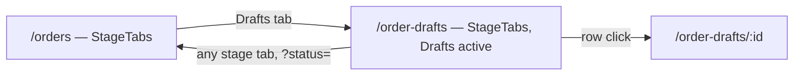
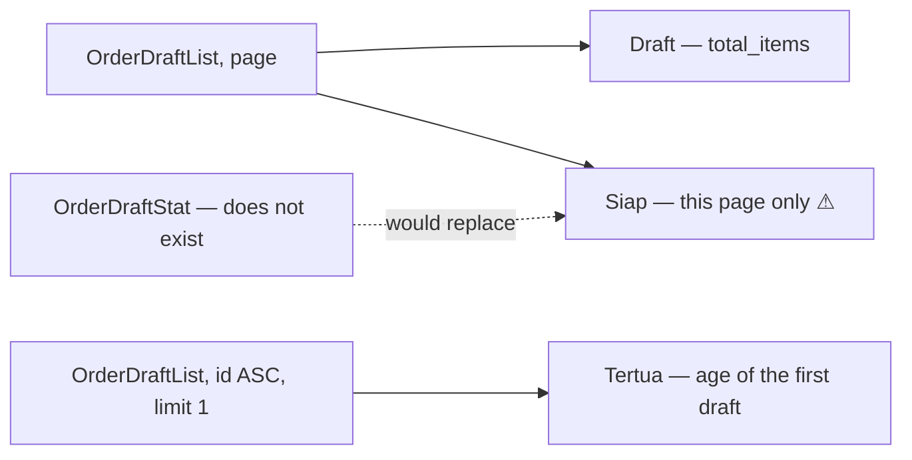
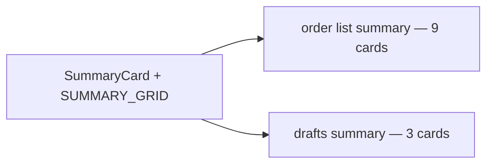
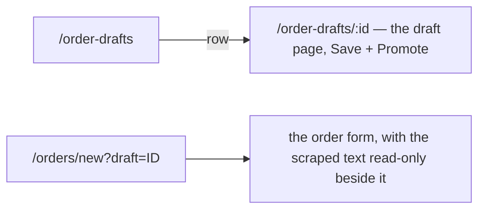
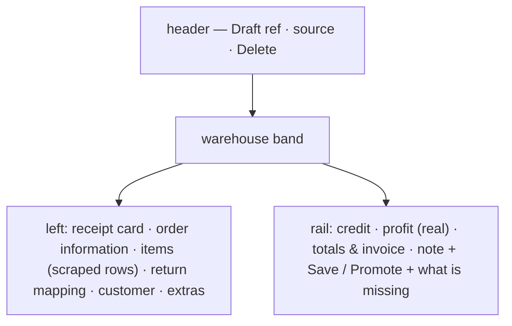
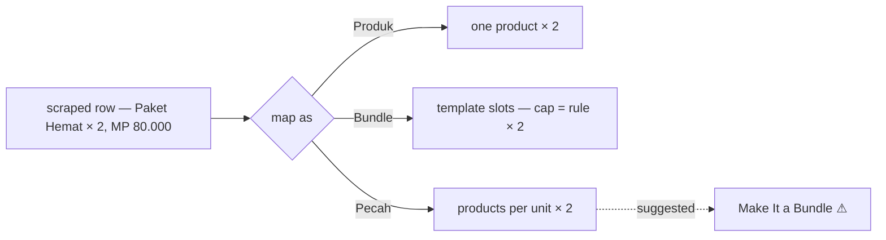
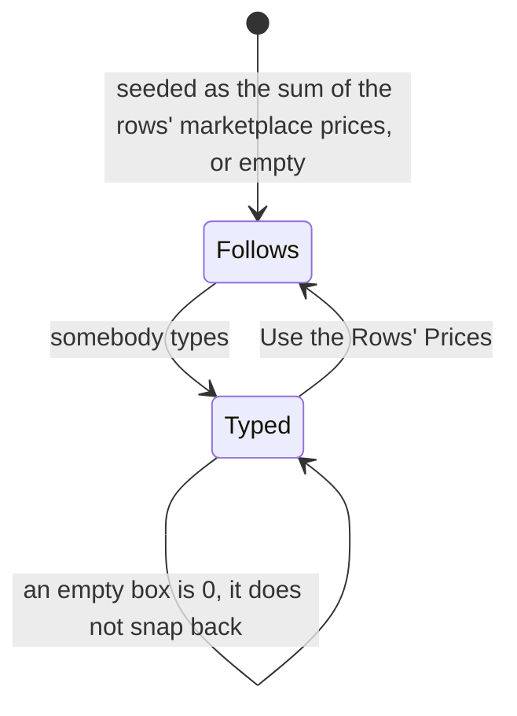
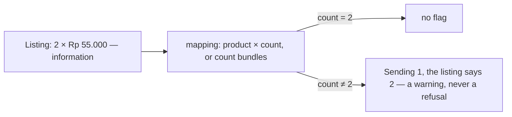
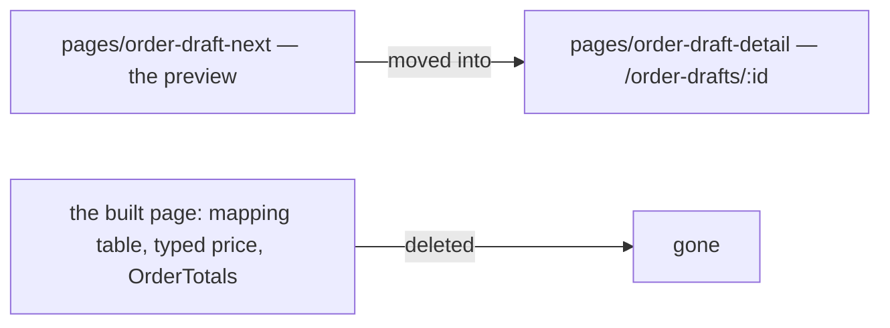

# Decisions — the order drafts

The owner's decisions about **order drafts** — the Drafts tab (`/order-drafts`) and the draft page (`/order-drafts/:id`). **Append-only** (RULE 12): a reversed decision is renamed and its references grepped.

The rules every screen follows are in [context_decision.md](context_decision.md). These were recorded in
[technical/order/design_decision.md](../../technical/order/design_decision.md) first and moved here on 2026-10-02;
each old heading there now points here.

| decision | what it settles |
| --- | --- |
| [the-draft-list-is-the-drafts-tab](#the-draft-list-is-the-drafts-tab) | `/order-drafts` wears the seller list's shell and row grammar, with only the columns a draft can fill |
| [the-draft-summary-is-three-cards](#the-draft-summary-is-three-cards) | total and oldest are real; ready counts this page only, says so, and carries a ⚠ |
| [the-draft-cards-are-the-order-list-cards](#the-draft-cards-are-the-order-list-cards) | one `SummaryCard` and one grid for both tabs, so a card is the same shape and size on each |
| [the-draft-keeps-its-own-page](#the-draft-keeps-its-own-page) | `/order-drafts/:id` stays the separate draft page — opening the draft in the order form was tried and reverted |
| [the-draft-page-wears-the-order-form](#the-draft-page-wears-the-order-form) | the draft page uses the create form's cards and rail; save in any state, Promote as strict as Create |
| [a-draft-row-maps-to-a-product-a-bundle-or-a-split](#a-draft-row-maps-to-a-product-a-bundle-or-a-split) | each scraped row maps to one product, one bundle, or several products — a split suggests a bundle |
| [the-draft-sell-price-starts-from-the-rows](#the-draft-sell-price-starts-from-the-rows) | the sell price starts as Σ the rows' platform prices and can be typed over, down to 0 |
| [the-listing-is-information-the-mapping-sets-the-count](#the-listing-is-information-the-mapping-sets-the-count) | a row's scraped quantity and price are shown, not edited; the count is set on the mapping, and a different one is flagged |
| [the-draft-preview-became-the-draft-page](#the-draft-preview-became-the-draft-page) | `/order-drafts/:id` IS the draft page in the order form's clothes now — the built page is gone |

## the-draft-list-is-the-drafts-tab

> Owner, in chat (2026-09-30): *"sekarang draft sesuaikan dengan all, tapi jelas tidak selengkap di sana"* —
> the analysis was approved before building.

`/order-drafts` keeps its own route but reads as the **Drafts tab of the seller's order list**: the same heading,
the same stage strip with Drafts active, the same row grammar. It had been the old six-status strip, so clicking
Drafts swapped the whole strip under the reader.

| order list column | on a draft | from |
| --- | --- | --- |
| ID Order + stage under it | reference (copyable) + **what is left** under it: `Ready` or the first gap, `+n` for the rest, all on the title | `external_id`, `draftGaps` |
| Resi | — | no field |
| Toko, badge under | Toko | `shop_id` |
| Dipesan + oleh | **Dibuat** + oleh, with a real author | `created_at_unix`, `author_user_id` |
| Tgl MP + deadline | **Diubah** | `updated_at_unix` |
| Beli · Total MP · Margin | — | a draft has no cost or MP figure, and the list returns no lines |
| *(draft only)* | Baris: `2`, or `1 of 3 unmapped` | `item_count`, `unmapped_item_count` |
| Aksi | kebab: Open · Delete (confirms) | Promote stays on the detail, which checks readiness |

- **Kept, draft only:** the checkbox and bulk delete — pruning is half this screen's job.
- **Dropped:** summary tiles, filter bar, Export and Import, the overdue tint. None has data on a draft.
- **No ⚠ on the row.** Every cell is a real field. The one mark on the page is the strip's `statusSet`.
- **The whole row opens the draft**; the checkbox, the copy button and the kebab stop the click.
- **A warehouse keeps the old strip here too**, matching its own unredesigned list.
- `listQuery` + `RefreshOverlay`, which the page had neither of.
- Moved to shared homes now that two pages use them: `CopyText` → `components/chrome/` (with a story), and
  `OrderRowCells`, `StageTabs`, `deadlineMock`, `rowMock` → `features/orders/`. `StageTabs` takes its ⚠ from the
  calling screen.

⚠ **Dropped from the row: the pushing app's name** (`source`), which sat under the reference. The readiness took
that line. See [design_clarify.md](../../technical/order/design_clarify.md#question).

⚠ Found while analysing: the build lets a person draft and promotes on the server, against two business
decisions — recorded in
[the-build-lets-a-person-draft-and-promotes-on-the-server](../order/context_clarify.md#the-build-lets-a-person-draft-and-promotes-on-the-server).

## the-draft-summary-is-three-cards

> Owner, in chat (2026-09-30): asked which statistics the existing data can carry, then *"3 teratas saja"*.

Three cards under the drafts page's tab strip, drawn like the order list's summary and, like it, controlling
nothing.

| card | value | source | real? |
| --- | --- | --- | --- |
| Draft | `2` | `page_info.total_items` | ✅ |
| Tertua | `2 hari` + the date | one row of `OrderDraftList` sorted `id` ASC — ids are issued in order | ✅ |
| Siap (halaman ini) | `1 dari 2` | `draftGaps` over the drafts on screen | ⚠ `readyCount` — the right rule, the wrong scope |

- **Not built, and why:** unmapped totals, missing shop/warehouse/customer counts and per-app counts — each needs a
  server aggregate, and a page-only count on a screen whose whole point is the backlog would read as the backlog.
- The stub transport now honours the list's sort, and the fixtures' draft ids follow their creation dates, so
  the oldest card is correct in Storybook as it is on the server.

## the-draft-cards-are-the-order-list-cards

> Owner, in chat (2026-09-30): *"gunakan referensi statistik dari list secara bentuk dan ukuran, biar kelihatan
> seragam"*.

The card and the strip are now ONE component, `features/orders/SummaryCard.tsx` (`SummaryCard` + `SUMMARY_GRID`),
drawn by both the order list's summary and the drafts page's. At 1440px a card is 145px wide on both.

| | before | after |
| --- | --- | --- |
| draft card | own copy: muted label, `lg` figure, cards stretched to fill the row | the list's card: bold `fg.label` label, `md` figure, quiet line |
| grid | draft `minChildWidth 10rem`, list `8.5rem`, both `auto-fit` | one grid, `auto-fill` of `8.5rem` |
| "this page" on Siap | in the label | on the card's own line, under `1 of 2` |

⚠ **`auto-fill`, not `auto-fit`, and it touches the order list too.** auto-fit collapses empty tracks and
stretches the cards, which is why three draft cards filled the width. With auto-fill the order list's nine
cards are unchanged at 1440px, but on a screen wide enough for more than nine tracks they no longer stretch
to the edge.

## the-draft-keeps-its-own-page

> Owner, in chat (2026-09-30): *"kembalikan, tetap /:id"* — asked which part, answered **the old draft page**.

The draft was opened IN the order create form for one round (draft mode: seeded form, a picker per scraped row,
Save as Draft updating the draft, Create consuming it). The owner reverted it: `/order-drafts/:id` is the separate
draft page again — mapping table, Save, Promote — and the order create form is as it was.

- Kept from that round: the order form's phone grid is `minmax(0, 1fr)`, so a wide lines table scrolls in its
  own box instead of pushing the page past the screen.
- The business contradiction (a person drafts, Promote finalizes on the server) stands, with a note that the
  form route was tried —
  [the-build-lets-a-person-draft-and-promotes-on-the-server](../order/context_clarify.md#the-build-lets-a-person-draft-and-promotes-on-the-server).

## the-draft-page-wears-the-order-form

> Owner, in chat (2026-09-30): *"yang aku maksudkan sesuaikan itu secara ui dan form"* — then, while brainstorming:
> *"draft boleh saja tidak lengkap … tapi pasti error atau dibatasi sebelum promote to order"*, *"seperti biasa warning
> saja"*, *"aman, tidak masalah tidak disimpan"*, and the two-price columns.

The draft keeps its own page ([the-draft-keeps-its-own-page](#the-draft-keeps-its-own-page)), drawn with the order
create form's parts. Preview: `Pages/Order/OrderDraftNextPage` (`pages/order-draft-next/`), not routed yet.

| | rule |
| --- | --- |
| layout | the create form's cards, in its order, and its sticky money rail |
| what a draft does not store | on screen with a ⚠ as usual — receipt, references, tracking number, note, dates, username (`draftKeeps`); the owner accepted they are not kept |
| Save | any state; only the changed fields are sent (each one becomes touched) |
| Promote | refused until the order could be placed — shop, warehouse, customer, every row mapped, stock, saved — then the create form's own checks: an error stops it, a warning can be overruled |
| prices | per row: HPP (from the warehouse, as on create) **and** the marketplace price (the draft's own, editable); the sell price is their sum and the profit estimate reads it — real, not typed |

- The create form's cards moved to `features/orders/form/` (with its `pending`, `checks`, `bundles` and samples), so both
  screens draw the same parts. Its invoice and credit rows are `form/money.ts`, used by both.

## a-draft-row-maps-to-a-product-a-bundle-or-a-split

> Owner, in chat (2026-09-30): *"items draft sebenarnya bisa antara produk atau bundle dan tiap bundle juga bisa
> dimapping"* — then: split allowed but suggest a bundle, bundle quantity like create, the package's price stays on
> the package row, and mappings are not remembered.

| | rule |
| --- | --- |
| three ways | a product; a bundle (its slots filled, each capped at rule × the row's quantity); a split into several products at a quantity per listing unit |
| split | allowed, because a bundle is optional; the row offers **Make It a Bundle** (⚠ `makeBundle` — templates are samples) |
| price | the marketplace price stays on the package row; HPP is the sum of what fills it |
| memory | a mapping is NOT remembered for the next draft |
| storing | only a product mapping is stored — a draft line holds one `product_id`. A bundle or split row is shown and counted, saved unmapped, and blocks Promote (⚠ `rowBundle`, `rowSplit`) until the contract can hold it ([design_clarify.md](../../technical/order/design_clarify.md#question)) |

## the-draft-sell-price-starts-from-the-rows

> Owner, in chat (2026-09-30): *"sell price masih mungkin untuk diganti, bisa juga kita masuk di kontrak awal atau 0"*.

The draft page's sell price is a field again, as on the create form — not a read-only sum.

- It follows the rows while untouched; typing takes it over, down to 0; **Use the Rows' Prices** hands it back.
- ⚠ `sellPrice` — a draft has no sell price, so a typed one is not kept. It could arrive with the draft from the
  start ([design_clarify.md](../../technical/order/design_clarify.md#question)).
- Refines [the-draft-page-wears-the-order-form](#the-draft-page-wears-the-order-form), whose price row said the sell
  price is the rows' sum.
- The split row's product picker keeps a product row's width instead of stretching across the row.

## the-listing-is-information-the-mapping-sets-the-count

> Owner, in chat (2026-09-30): *"harga cuma info, jumlah pun cuma info, tapi bisa jadi indicator warning jika
> jumlahnya tidak sesuai, di split, qty per satuannya luruskan dengan pilih produk"*.

| | rule |
| --- | --- |
| the listing's quantity and price | shown under the scraped text, like the text itself; not editable |
| the count | set beside the product picker, or as the number of bundles; starts at the listing's quantity |
| a different count | flagged on the row, never refused — the buyer may have changed it, or the scrape misread it |
| split | parts are per listing unit × the listing's quantity, so a split has no count to differ; each part's picker and quantity sit on one line under column names given once |
| price | only the sell price is corrected, at the order level ([the-draft-sell-price-starts-from-the-rows](#the-draft-sell-price-starts-from-the-rows)) |

- ⚠ `listingQty` — a draft line holds one quantity, so a different count replaces the listing's on save, and the
  warning is gone the next time the draft opens. Refines
  [the-draft-page-wears-the-order-form](#the-draft-page-wears-the-order-form), whose price row had the marketplace
  price editable per row.

## the-draft-preview-became-the-draft-page

> Owner, in chat (2026-09-30): *"oke, sudah bagus"*, then *"pasang sekarang"*.

The preview replaced the built draft page at `/order-drafts/:id`; the route and its export name did not change.

- `pages/order-draft-detail/` now holds the page, `rows.ts`, `pending.ts` and `components/DraftRowsCard.tsx`; its story is
  `Pages/Order/OrderDraftDetailPage` with the preview's stories.
- `features/orders/OrderTotals.tsx` is deleted — the built page was its only user.
- The e2e's draft-detail test needed no change: `draft-detail-page`, `draft-line-scraped-N`, `draft-line-unmapped-N`,
  `draft-promote`, `draft-gaps`, `draft-customer-name` and `draft-save` all carried over.
