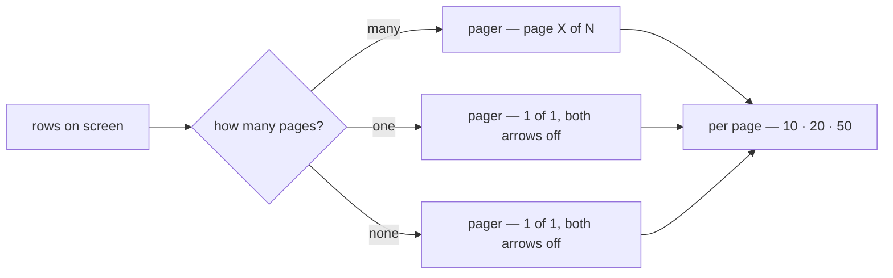
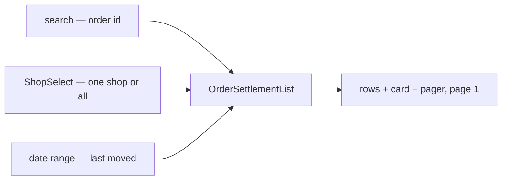
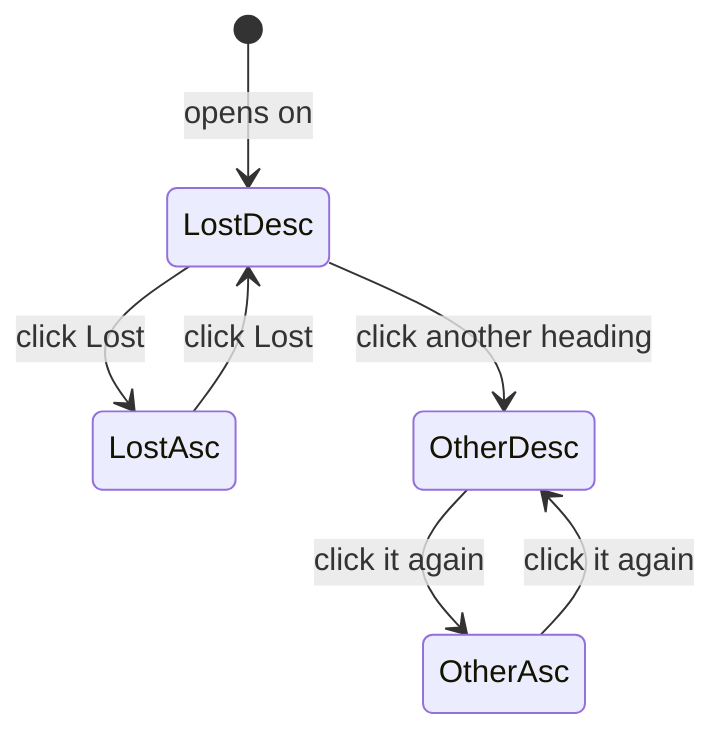
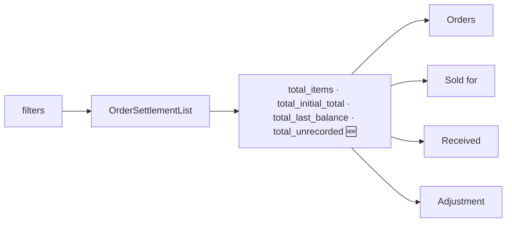
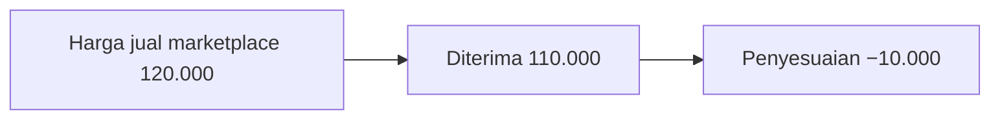
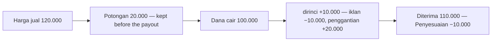
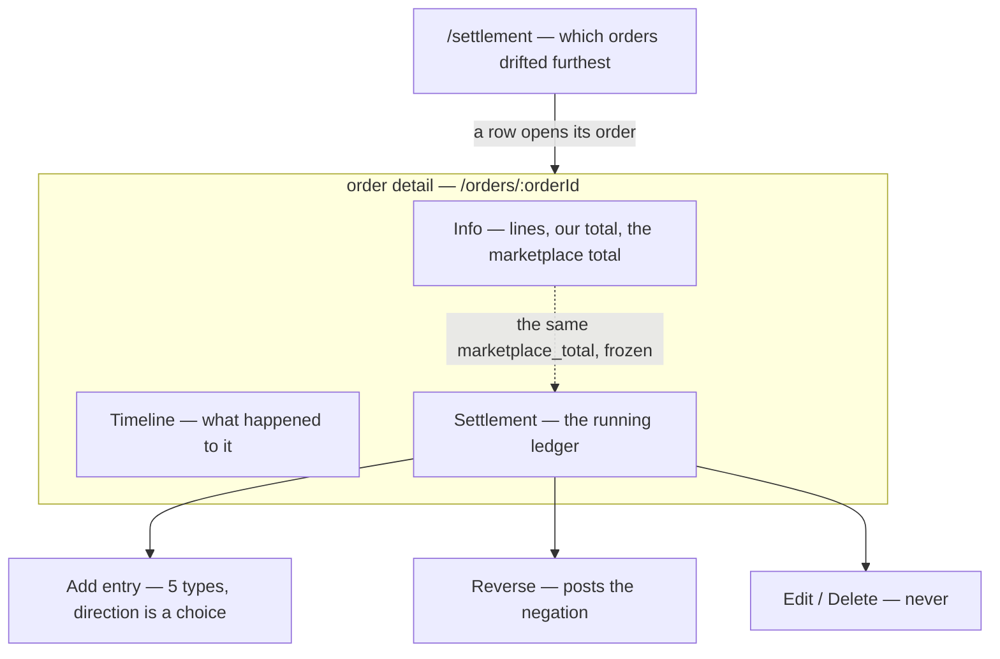

# Decisions — the order settlement screens

The owner's decisions about **`/settlement`** (the order settlement list) and the **settlement ledger** on an order's
detail page. **Append-only** (RULE 12): a reversed decision is renamed and its references grepped.

The rules every screen follows are in [context_decision.md](context_decision.md); the settlement *business* decisions
stay in [settlement/context_decision.md](../settlement/context_decision.md). These were recorded there first
and moved here on 2026-10-02; each old heading there now points here.

| decision | what it decided |
| --- | --- |
| [the-settlement-list-always-shows-its-pager](#the-settlement-list-always-shows-its-pager) | the `/settlement` list keeps its pager AND its per-page selector on screen on one page and on an empty list |
| [the-settlement-list-filters-what-the-contract-can](#the-settlement-list-filters-what-the-contract-can) | the `/settlement` list filters by order id, one shop (`ShopSelect`) and the date the account last moved (the order list's picker) |
| [the-settlement-list-sorts-by-its-headings](#the-settlement-list-sorts-by-its-headings) | Order · Sold for · Received · Adjustment sort from their headings, largest first then flipped; an unrecorded sale always last |
| [the-settlement-list-summary-is-the-order-lists-cards](#the-settlement-list-summary-is-the-order-lists-cards) | the summary is the order list's card strip, over the whole filtered set, an unrecorded sale counted and left out of the sums |
| [the-sale-is-the-marketplace-selling-price](#the-sale-is-the-marketplace-selling-price) | the recorded sale is written **harga jual marketplace** (EN *marketplace selling price*), never "total marketplace" |
| [the-gap-is-an-adjustment](#the-gap-is-an-adjustment) | what reached us less the selling price is **Penyesuaian** (EN *Adjustment*), signed — not *Hilang* / *Lebih* |
| [the-unitemised-take-is-a-deduction](#the-unitemised-take-is-a-deduction) | the selling price less every payout is **Potongan** (EN *Deductions*) — not *Tidak dirinci* |
| [the-source-is-a-badge](#the-source-is-a-badge) | an entry's source — Import · Manual · Order — is a badge in the ledger; the list row shows none |
| [order-detail-manages-the-ledger](#order-detail-manages-the-ledger) | the order page MANAGES settlement — read, add, reverse — as a third tab. ⚠ widens the verbs, not the guarantees: append-only stands |

## the-settlement-list-always-shows-its-pager

> Owner, in chat (2026-10-02), on the order settlement list: *"tampilkan saja, selalu"* — asked which it meant, the
> pager on screen. Then: *"perpagenya juga ada untuk tabel 1 halaman seperti ini"* — the per-page selector too.

The `/settlement` list's pager is part of the page, not a control that appears once there is something to page.
Every other list in the app keeps the shared default — it hides when everything fits.

⚠ **Widened the same day** by [the-pager-is-always-on-screen](context_decision.md#the-pager-is-always-on-screen):
every list now keeps its pager, so the sentence above no longer holds.

| | |
| --- | --- |
| control | the shared `Pagination` with `alwaysShow` — no second pager |
| empty list | reads as one page, never *1 of 0* |
| per page | always beside it — `10 · 20 · 50`, default `20`, the app's own choices; changing it returns to page 1 |
| where | under the table, inside the list component, so the design stories show it |
| other lists | unchanged — `alwaysShow` is opt-in |

## the-settlement-list-filters-what-the-contract-can

*Applies [a-date-range-filter-is-the-order-lists-picker](context_decision.md#a-date-range-filter-is-the-order-lists-picker).*

> Owner, in chat (2026-10-02), on the list's filters: *"cari order id, toko aku ingin pakai shop select, rentang
> tanggal gunakan seperti order list"* — and sorting by column heading *"kita diskusikan dulu"*.

The list filters by exactly what `OrderSettlementList` can narrow on — no control the server would ignore.

| control | spec |
| --- | --- |
| search | the shared `FilterSearch`, placeholder *Search order ID* — the server matches `CAST(order_id AS TEXT) LIKE %q%`; settlement never sees the marketplace reference ([settlement-keys-on-our-order-id](../settlement/context_decision.md#settlement-keys-on-our-order-id)) |
| shop | the design system's `ShopSelect` over the team's shops, *All shops* = none |
| date | the order list's `DateRangePicker`, with one field segment reading **Last moved**: the filter is the account's latest entry (`updated_at`), not the order date — a plain picker would read as the order date |
| layout | the shared `FilterBar` — search in the row, the rest in a sheet on a phone, Clear while anything narrows |
| any change | back to page 1 |
| refresh | the overlay dims the card and the table, never the filter bar |

Not filters yet, because the contract cannot narrow on them: marketplace reference, order date, order status,
paid-out or not, manual entries, result (lost · gained · not recorded), creator. Sorting: see
[the-settlement-list-sorts-by-its-headings](#the-settlement-list-sorts-by-its-headings).

## the-settlement-list-sorts-by-its-headings

*Applies [a-table-sorts-from-its-headings](context_decision.md#a-table-sorts-from-its-headings).*

> Owner, in chat (2026-10-02): *"sort akan lebih baik jika bisa tiap heading"*, then — on the recommendation —
> *"gunakan rekomendasi"*: Shop and Never itemised do not sort, and *"cukup bolak-balik"*.

| heading | sorts by | first click |
| --- | --- | --- |
| Order | `ORDER_ID` | highest id first |
| Shop | — | the server holds the id, not the name, so it could not be alphabetical; the filter narrows to one |
| Sold for | `INITIAL_TOTAL` | largest first |
| Received | `RECEIVED` 🆕 — `last_balance + initial_total` | largest first |
| Lost | `LOSS` — **the default, largest loss first** | largest first |
| ~~Never itemised~~ | — | the column is gone — see [the-unitemised-take-is-a-deduction](#the-unitemised-take-is-a-deduction) |

- **Two states, no third** — a click flips the active heading; another heading starts at largest first.
- **The server sorts the whole set**, and the page is not re-sorted on the client. Any new sort returns to page 1.
- **An unrecorded sale sorts last** under every money measure, both directions — its figures are not real.
- **Ties break on `order_id`**, in the sort's direction, so a page boundary cannot fall differently twice.
- **The direction is the named measure's.** `LOSS` used to apply it to the balance, so `ASC` meant the biggest
  loss; now `DESC` is the biggest loss and `UNSPECIFIED` is `DESC`.
- **On a phone** the sheet carries a *Sort* control with each heading's two directions.

## the-settlement-list-summary-is-the-order-lists-cards

*Applies [a-list-summary-is-the-order-lists-card-strip](context_decision.md#a-list-summary-is-the-order-lists-card-strip).*

> Owner, in chat (2026-10-02): *"statistik cuma 3 itu? aku ingin statistik designnya seperti di order list"*.

The summary is the order list's `SummaryStrip` of `SummaryCard`s — a label, one figure, a quiet line — over the
**whole filtered set**, from the server's sums.

| card | figure | line |
| --- | --- | --- |
| Orders | every account the filters match | *n with no marketplace total*, or *every sale recorded* |
| Sold for | Σ sale | *over n orders* (the recorded ones) |
| Received | Σ (sale + balance) | *% of sales* |
| Adjustment | Σ balance, signed — red when short ([the-gap-is-an-adjustment](#the-gap-is-an-adjustment)) | *% of sales* |

- **An unrecorded sale is counted, never summed** — its balance is payout with nothing to measure against, and
  adding it would shrink the loss by money that was never a gain. `total_unrecorded` is new on the wire.
- **No deductions card** (owner: *"potongan bisa dihitung manual? kalau tidak statnya hilangkan saja"*):
  `sale − Σ payout` cannot be summed for the set — the server sums no payouts and the page holds one page of
  rows without their entries — so the card was removed rather than marked or filled from the page.
- ⚠ **It amends [design-accepted](../settlement/context_decision.md#design-accepted)'s "implied take-rate card"**: with no deductions sum there is
  no take rate on the list until the server sums payouts.

## the-sale-is-the-marketplace-selling-price

> Owner, in chat (2026-10-02): *"total marketplace -> harga jual marketplace"*.

`initial_total` — what the buyer paid on the platform — is written **harga jual marketplace** (EN *marketplace
selling price*) wherever a sentence names it: *tanpa harga jual marketplace*, *Harga jual marketplace tidak
tercatat*. It is a fact, not an estimate ([marketplace-total-is-a-fact-not-an-estimate](../settlement/context_decision.md#marketplace-total-is-a-fact-not-an-estimate)).

| | before | now |
| --- | --- | --- |
| a sentence | total marketplace | **harga jual marketplace** |
| the column / card | Terjual | Terjual — unchanged until decided |
| the entry type | Estimasi | Estimasi — unchanged until decided |

## the-gap-is-an-adjustment

> Owner, in chat (2026-10-02), on *Diterima* and *Hilang*: *"untuk konteks order biasanya paling tepat adalah
> adjustment atau penyesuaian"*.

| | before | now |
| --- | --- | --- |
| received less the selling price | *Hilang 10.000* (red), or *Lebih 4.000* (green) — two words | **Penyesuaian**, signed: **−Rp 10.000** red, **+Rp 4.000** green — one word |
| where | list column · summary card · ledger panel | the same three |
| the entry type `marketplace_adjustment` | *Penyesuaian* | **Penyesuaian marketplace** — or one word would mean the total and one entry type |
| the phone's sort | *Biggest loss first* | **Penyesuaian paling minus / paling plus** |

The figure is `last_balance` as it stands — nothing is computed differently, only named and signed.

## the-unitemised-take-is-a-deduction

> Owner, in chat (2026-10-02), on *Tidak dirinci*: *"Potongan saja"*.

`initial_total − Σ fund` is **Potongan** (EN *Deductions*) in the ledger panel's hint (*potongan Rp 20.000 · dirinci +Rp 10.000*). It amends the label half of
[hidden-cost-is-left-in-the-balance](../settlement/context_decision.md#hidden-cost-is-left-in-the-balance) once more. Whether the figure is
always a deduction — it is not, before any payout arrives — is open in the chat that recorded this.

**Not on the list** (owner, 2026-10-02: *"hilangkan potongan karena memang tidak ada"*). A list row carries no
entries, so `sale − Σ fund` read `sale − 0` — the whole sale — on every live row; it was only ever right in
Storybook. The column, its summary card and its ⚠ marks are removed; no column was added to carry the payouts.

## the-source-is-a-badge

> Owner, in chat (2026-10-02), on *has manual entries*: *"sumber buat saja jadi badge"*.

| source | badge | where |
| --- | --- | --- |
| `importer` | **Impor** — teal | the ledger, on every imported entry |
| `manual` | **Manual · \<who typed it\>** — orange | the ledger |
| `order` | **Order** — gray | the ledger, on the order's own posts |

- One component, `SettlementSourceBadge` (`components/badges/`), so both screens draw the same badge.
- **The list row shows no source badge** (owner, 2026-10-02: *"hilangkan sama sekali"*). Whether an order holds a
  hand-typed entry needs its entries, and a list row carries none — the earlier *has manual entries* line was
  only ever right in Storybook, whose sample rows carry their entries. No column was added for it (*"ga perlu"*).

## order-detail-manages-the-ledger

**The order detail page is where an order's settlement is MANAGED — not merely where an entry is
added.** (owner, 2026-08-28)

§What Frontend Expected 1 said *"manually add settlement entry from order detail page"*, which is one
verb. The owner's confirmation is the wider one: **manage**. That settles the seat and the verbs, and
it is what the built prototype already assumes.

### What "manage" covers, and where it stops

| | | |
| --- | --- | --- |
| **read** the running ledger | ✅ | every row, its running balance, and the four derived figures |
| **add** an entry | ✅ | §What Frontend Expected 1, verbatim |
| **reverse** a row | ✅ | confirms the recommendation that was Critique 5 — the negation, same type, linked to the row it undoes |
| **edit** a row | ⛔ | [a-correction-is-a-new-row](../settlement/context_decision.md#a-correction-is-a-new-row). Unchanged — "manage" does not reopen append-only |
| **delete** a row | ⛔ | same |
| **decide WHO may do any of it** | ❓ | still open — [Question 1](../settlement/context_clarify.md#question) |
| **type `initial_total`** | ❓ | still open — [Question 2](../settlement/context_clarify.md#question) |

⚠ **Manage widens the VERBS, not the guarantees.** Append-only survives it intact: reversing posts a
further row rather than removing one, which is why Reverse is a management action and Delete is not.

### Why the order page and not a settlement screen

The ledger's grain IS the order ([superseded-the-grain-is-the-order](../settlement/context_decision.md#superseded-the-grain-is-the-order)), so the order page
is the only screen where the whole account is in scope at once. A person adding a fee is looking at the
order to decide whether the fee is right — the lines, the shipping, what the buyer paid — and none of
that is on a settlement list.

**The two screens are a pair with one direction of travel.** `/settlement` ranks orders by loss and
answers *which order should I look at*; the order page answers *what happened to this one, and what do
I do about it*. Every management verb lives on the second — the list never writes.

### The spec

**A third tab on the order detail page**, after Info and Timeline.

| | |
| --- | --- |
| where | `pages/order-detail/index.tsx`, `Tabs.Trigger value="settlement"` |
| why third | Info is what the order IS and Timeline is what happened to it — both settled by the time money starts arriving. Settlement is the only tab that keeps changing for days afterwards ([a-residual-balance-is-normal](../settlement/context_decision.md#a-residual-balance-is-normal)) |
| what it renders | the ledger table, the four derived figures, **Add entry**, and a per-row **Reverse** behind the row's overflow menu |
| gating | one prop, `canPost`, resolved from the viewer's role — the single place [Question 1](../settlement/context_clarify.md#question)'s answer lands. Reading is never gated: the role gates writing, never looking |

⚠ **Built and previewable now**, but as a SEPARATE shell —
`pages/order-settlement/components/OrderDetailPreview.tsx`, story `Pages/Order Settlement/On Order
Detail`. Info and Timeline in it are the real shipped components; only the settlement tab is invented.
The real page is not touched until `design_accept`, because a fixture-fed ledger on `/orders/:orderId`
would show invented money on real orders. **On acceptance the tab moves into the real page and the
preview shell is deleted.**

---
