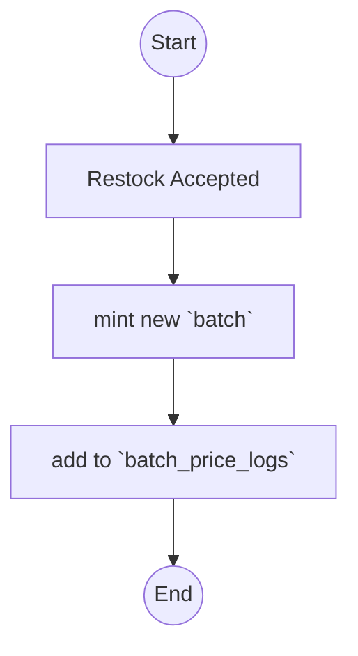
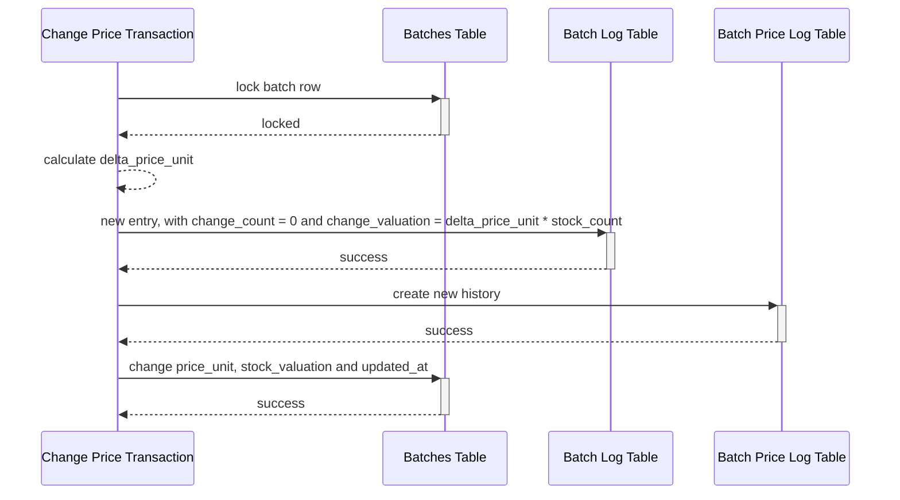

# Batch Ledger.

## Table Should We Have For Batch Ledger.

1. Table `batches`

    batch is minted by restock, return and adjustment

    Field that must have:
    - `id` as primary key
    - `warehouse_id`
    - `team_id`
    - `product_id`
    - `transaction_id`
    
    - `price_unit`
    
    - `stock_count`
    - `stock_valuation`
    
    - `init_stock_count`
    - `init_stock_valuation`

    - `supplier_channel_id`, its optional

    - `expired_at`, its optional
    - `updated_at`
    - `created_at`

2. Table `batch_logs`

    Field that must have:
    - `id` as primary key
    - `warehouse_id`
    - `team_id`
    - `batch_id`
    - `transaction_id`
    
    - `change_type`
    
    - `change_count`
    - `change_valuation`
    
    - `stock_count_after`
    - `stock_valuation_after`

    - `description`
    - `actor_id`
    - `created_at`

3. Table `batch_price_logs`. This for recording if batch edited the unit price.

    Field that must have:
    - `id` as primary key
    - `batch_id`
    - `new_price_unit`
    - `delta_price_unit`
    - `description`
    - `actor_id`
    - `created_at`

### Whats Inside `change_type`
- `order`
- `revaluation`
- `return`
- `restock`
- `adjustment`
- `broken`
- `lost`

## Restock Flow Example.

## Change Price Flow Example.

