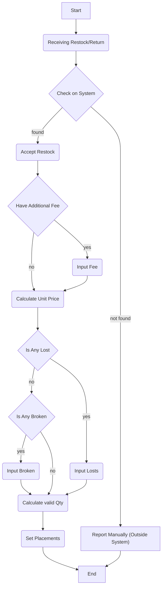

# Inventory Contexts.
**this design proposed by heri, toni have other design proposed too**

## General.
1. for restock reference, [see this](./restock.md)

## Responsbility.
1. managing stock.
2. managing restock.
3. managing return.
4. doing opname.
5. managing placements.
6. provide solid api for other service. like order for creating order.

## Placements.
Placement is like warehouse rack or physical placement in warehouse. like "rak 1", "rak ruang tengah" and other.

In Warehouse Team, we can:
- create placement
- update placement
- delete placement, placement can be delete if only have no stocks. And its soft delete

Placement have own ledger. [see this](./placement_ledger.md)

## Batches.
We have batch in inventory service. Because our product have different price unit across team and across time. for the reference [see this](./batch_ledger.md)

Still Confused.

3. Table `inventory_transactions`

    Field that must have:
    - `id` as primary key

3. Table `inventory_transaction_items`

    Field that must have:
    - `id` as primary key

## Placement Recomendation Feature

## QR Code Labelling

## Stock loss.
1. Selling Team bears the loss at receiving.
2. When Stocks already in Warehouse, and loss/opname happen, its shortfall a warehouse liability.

## How Warehouse Team Member Accept Stock / Return That Arrived

