# Clarity — `inventory/context.md`

[inventory/context.md](./context.md) is yours — this one is mine. Answered points are **deleted**, so
this file is always the current open set.

> **Q11b–d elaborated (2026-10-08)**, on request — [PostOrder, worked](#postorder-worked). 11b and 11c share one
> missing fact, the moment of the pick, so both now recommend a **`pick` transaction**. 🔄 11d: my *lowest shelf that fills
> the line* is **withdrawn** — a line of 3 over shelves of 1, 2 and 5 empties two racks under your rule and none under
> mine. Keep yours as written.
>
> **Re-examined after your Q15 answer in chat (2026-10-08).** ✅ [Q15](#question) **closed**: batches lock before shelves,
> by id ([batches-lock-before-shelves-by-id](./context_decision.md#batches-lock-before-shelves-by-id)), and the layer
> under a mutation is a *ledger* ([the-layer-under-a-mutation-is-a-ledger](./context_decision.md#the-layer-under-a-mutation-is-a-ledger)).
> [mutation-means-two-layers](#mutation-means-two-layers) now waits only on the old word in your two docs.
>
> **Re-examined after your Q14 answers in chat (2026-10-08).** ✅ **Closed:** 14e — `price_unit_after` added and
> `batch_price_logs` **kept**, against my drop ([batch-logs-carry-price-unit-after](./context_decision.md#batch-logs-carry-price-unit-after)) ·
> 14f — one shelf row per product per placement, codes reusable, and a delete only when nothing waits on the rack
> ([one-shelf-row-per-product-per-placement](./context_decision.md#one-shelf-row-per-product-per-placement),
> [a-placement-deletes-only-when-nothing-waits-on-it](./context_decision.md#a-placement-deletes-only-when-nothing-waits-on-it)) ·
> 14g — the owning team revalues, with a reason ([the-owning-team-revalues-with-a-reason](./context_decision.md#the-owning-team-revalues-with-a-reason)).
> Q14 stays open for a–d. ⚠ [batch.md](./batch.md)'s *Restock Flow Example* still has a mint writing
> `batch_price_logs` only; it now writes a `batch_logs` row too. ⚠ `batch_ledger.md` is now [batch.md](./batch.md):
> [context.md](./context.md) **line 50 and line 53** both link a file that no longer exists (`placement_ledger.md`,
> `batch_ledger.md`).
>
> **Q14 elaborated (2026-10-08)**, on request — [the ledger rules, worked](#the-ledger-rules-worked). Two corrections
> of mine: 14a needs **no exceptions** (a move and a revaluation already obey it), and 🆕 14g asks who may revalue,
> since a raise grows what the warehouse reimburses on a later loss.
>
> **Re-examined after your Post Order rule (2026-10-08).** ✅ [Q11a](#question): the shelf holding the fewest goes
> first, as recommended — [an-order-takes-from-the-lowest-shelf-first](./context_decision.md#an-order-takes-from-the-lowest-shelf-first).
> 🆕 11d: a line bigger than the lowest shelf, and ties. [15b](#question) gains a warning: choose by stock, but lock by id.
>
> **Re-examined after your answer in chat (2026-10-08).** ✅ [Q15a](#question): **one mutation per operation**,
> as recommended — [one-mutation-per-operation](./context_decision.md#one-mutation-per-operation). Q15 stays open for
> 15b (the lock order) and 15c (what the per-ledger layer is called, now that *mutation* means the operation).
>
> **Re-examined after placement.md §Placement Ledger Mutation (2026-10-08)** — `placement_ledger.md` is now
> [placement.md](./placement.md). Its `change_type` list equals `tx_type`, which half-fixes
> [the-two-type-lists-do-not-line-up](#the-two-type-lists-do-not-line-up). `PostOrder` makes [Q11](#question) concrete
> (which shelf, a count before the pick) and [15a](#question) a per-ledger list. ⚠ **[context.md](./context.md) line 50
> still links `./placement_ledger.md`**, which no longer exists.
>
> **Re-examined after §How We Breakdown Complexity in Inventory Service (2026-10-08).** 🆕 [Q15](#question): is a
> mutation one per ledger or one per operation, and which ledger locks first · a
> [Contradiction](#mutation-means-two-layers) with your ledger template over what the word means. §Responsbility grew to
> six, so [Critique 13](#critique) narrows to transfer and broken/lost.
>
> **Re-examined after §General Table That Must Have (2026-10-08)**, and with it — for the first time — §Placements,
> §Batches, [batch.md](./batch.md) and [placement.md](./placement.md).
> ✅ **Closed:** the core of the old Q13 — one transaction per operation, both logs point at it, no items table
> ([every-stock-change-belongs-to-a-transaction](./context_decision.md#every-stock-change-belongs-to-a-transaction)) ·
> [Q2](#question), by the restock's per-line count. 🔄 **Re-asked:** [Q13](#question) is now what the transaction
> still does not say · [Q7](#question) — `batches.expired_at` says something expires, so the question is whether
> picking follows it. 🆕 [Q14](#question): the two ledgers' rules · a
> [Contradiction](#the-two-type-lists-do-not-line-up) between `tx_type` and the batch `change_type`.

> **Merged.** The stock context now lives inside inventory
> ([stock-merges-into-inventory](./context_decision.md#stock-merges-into-inventory)). Everything below was
> written against `stock/context.md` and still applies verbatim: §Stock loss and §How Warehouse Team
> Member Accept Stock / Return That Arrived moved unchanged. New questions from the merge are
> [Question 8–10](#question).

> **Re-examined after §Responsbility grew to four** — *managing restock*, *managing return* and *doing
> opname* joined *managing stock*. It narrows [Question 8](#question) without closing it, and it leaves out
> acts this doc's own flow and `business_level.md` already give the warehouse ([Critique 13](#critique)).

> **Re-examined after your update.** Closed and deleted from here: **who bears a receiving loss** (the
> selling team) and **whether a count shortfall is a warehouse liability** (yes). Both were my top two
> questions and both are now rules below. What the section does **not** do is cover the rest of stock —
> and it answers the money question before the doc has said what a unit, a place, or "available" is,
> which is the wrong end first but a useful end.

> **Re-examined again.** `stock_context.md` did not move this round, but
> [user_context.md](../user/context.md) arrived and it lands squarely here: the
> liability in §Stock loss 2 belongs to a **team**, and the acts that trigger it are now performed by a
> named **person** — a Staff member. Which role may count, declare a loss, or accept a delivery is asked in
> [user_context_clarity](../user/context_clarify.md#question); what changes *here* is that
> [Critique 2](#critique) and [Critique 7](#critique) are no longer abstract.

Siblings: [business_level](../business_level_clarify.md) · [user_context](../user/context_clarify.md) ·
[product_context](../product/context_clarify.md) · [balance_context](../balance/context_clarify.md) ·
[order_context](../order/context_clarify.md).

---

## Proposed Design

### The two ledgers, tied by the transaction

Your three tables, plus what [Q13](#question) and [Q14](#question) would add.

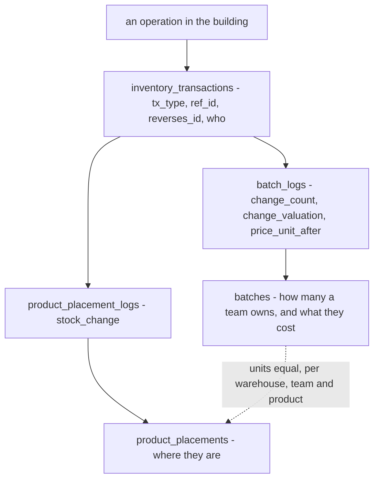

What each operation writes — the row a `tx_type` list has to cover:

| operation | `tx_type` | batch | shelf |
| --- | --- | --- | --- |
| restock or return accepted | `restock` · `return` | + mint | + |
| an order takes stock | `order` | − oldest batch first | − |
| a sample leaves | `sample` | − | − |
| goods move to another warehouse | `transfer_out` → `transfer_in` | − → + mint | − → + |
| broken, lost, found in custody | `adjustment` | − / + | − / + |
| a count differs | 🆕 `opname` | − / + | − / + |
| goods move between shelves | 🆕 `move` | — | − then + |
| a batch's price changes | 🆕 `revaluation` | money only | — |
| a mistake or a cancel | the same type, `reverses_id` set | opposite signs | opposite signs |

### PostOrder, worked

[Q11](#question) b–d. One product, *Kaos Polos Hitam*.

**Why 11b and 11c exist at all.** The shelf drops when the order is created
([a-take-reduces-stock-and-placement](../order/context_decision.md#a-take-reduces-stock-and-placement)); the picker lifts
the unit later, in *"Warehouse Process Order (Packing/Picking)"* ([order/context.md](../order/context.md)). For those
hours the book and the rack disagree by exactly the units waiting to be picked — and **inventory never hears the pick**,
so it cannot tell which those are.

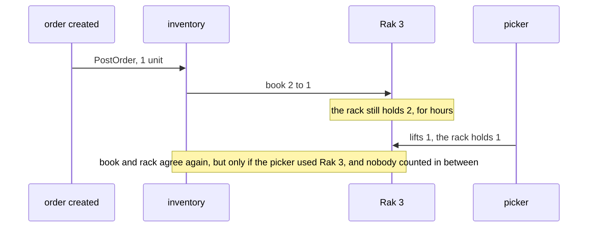

**What 11b and 11c both need: the moment of the pick.** The picker confirms which shelf the unit left, **when it leaves
the shelf** — not when the parcel leaves the building, or a count in between finds a shortfall that is only a parcel on a
packing table. Inventory records it as a **`pick` transaction**, referencing the order ([13a](#question)'s `ref_id`):

| the pick | writes |
| --- | --- |
| from the shelf the list printed | nothing to either ledger — the take already moved the book |
| from another shelf | a shelf-to-shelf `move` on the placement ledger; batches untouched |
| its existence | marks that order's take on that shelf as picked — the order's own transaction is never updated ([13e](#question)) |

`pick` joins the types [13c](#question) is adding.

**11b — the picker takes it from another shelf.** The list prints Rak 3. Rak 3 is empty in fact — an earlier move went
unrecorded — or Rak 1 is simply nearer.

| | Rak 3 book | Rak 3 rack | Rak 1 book | Rak 1 rack |
| --- | --- | --- | --- | --- |
| before | 2 | 2 | 5 | 5 |
| `PostOrder` plans Rak 3 | **1** | 2 | 5 | 5 |
| the picker lifts it from Rak 1 | 1 | 2 | 5 | **4** |
| *unrecorded:* the next count | +1 found | | **−1, a warehouse debt** | |
| *recorded:* the pick writes a `move`, Rak 1 → Rak 3 | **2** | 2 | **4** | 4 |

Two edges. When the printed shelf was **empty**, the pick also flags it for a count — the move keeps the book from getting
worse, but cannot repair a shelf that was already wrong. And a move that would take the shelf the picker used **below 0**
in the book is not written; that shelf is flagged for a count instead.

**11c — a count before the pick.**

| | Rak 3 book | Rak 3 rack |
| --- | --- | --- |
| `PostOrder` takes 1 | 1 | 2 — the unit waits for the picker |
| *as built today:* the count posts what it sees | **2, "found" +1** | 2 |
| the picker lifts it | 2 | 1 |
| the next order takes and picks the one real unit | 1 | 0 |
| the book's last unit does not exist — the order sold against it finds nothing, and the count posts | **−1: a debt for a unit the warehouse never lost** | 0 |

The recommended count compares **counted − waiting** against the book, where *waiting* is the takes from that shelf with
no `pick` yet:

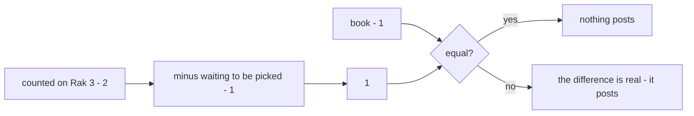

The count screen shows *"waiting to be picked: 1"* beside the shelf, so the counter can see why the rack holds more than
the book.

**11d — a line bigger than the lowest shelf.** I had proposed *the lowest shelf that can fill the whole line*. Working it
through, it can cost exactly what your rule is for:

| the line, and the shelves | yours — fewest first, then spill | mine — the lowest shelf that fills it |
| --- | --- | --- |
| 4 · Rak 3: 2, Rak 2: 4, Rak 1: 5 | Rak 3 −2, Rak 2 −2 · 2 racks · 1 emptied | Rak 2 −4 · 1 rack · 1 emptied |
| 3 · Rak 3: 1, Rak 2: 2, Rak 1: 5 | Rak 3 −1, Rak 2 −2 · 2 racks · **2 emptied** | Rak 1 −3 · 1 rack · **none emptied** |
| 1 — most order lines | the lowest shelf that is not empty | the same shelf |

Mine saves a walk and can leave every small remainder standing; for a line of 1 the two are identical. **So keep yours as
written**: fewest first, spilling to the next-fewest, and the pick list prints each shelf with its count —
*"Rak 3 × 1, Rak 2 × 2"*. Every spill moves the product onto fewer racks, which shortens later picks and counts. Two
shelves with the same count go by the **lower placement id** — the order the locks are already taken in
([batches-lock-before-shelves-by-id](./context_decision.md#batches-lock-before-shelves-by-id)), and a reprinted list never
changes. If all the product's shelves together hold less than the line, `PostOrder` fails whole and writes nothing.

### The ledger rules, worked

[Q14](#question), part by part. The examples use one product, *Kaos Polos Hitam*.

**14a — the two ledgers count the same units.** A batch says how many units a team owns and what they cost; a shelf
row says where they are. Suppose `PostAdjustment` for a broken unit lowers the shelf and forgets the batch: shelves
hold 9, batches hold 10. The next order's batch side takes a unit no shelf holds, and the pick list sends the picker to
an empty rack. The rule below holds for **every** type, including the two I had wrongly listed as exceptions:

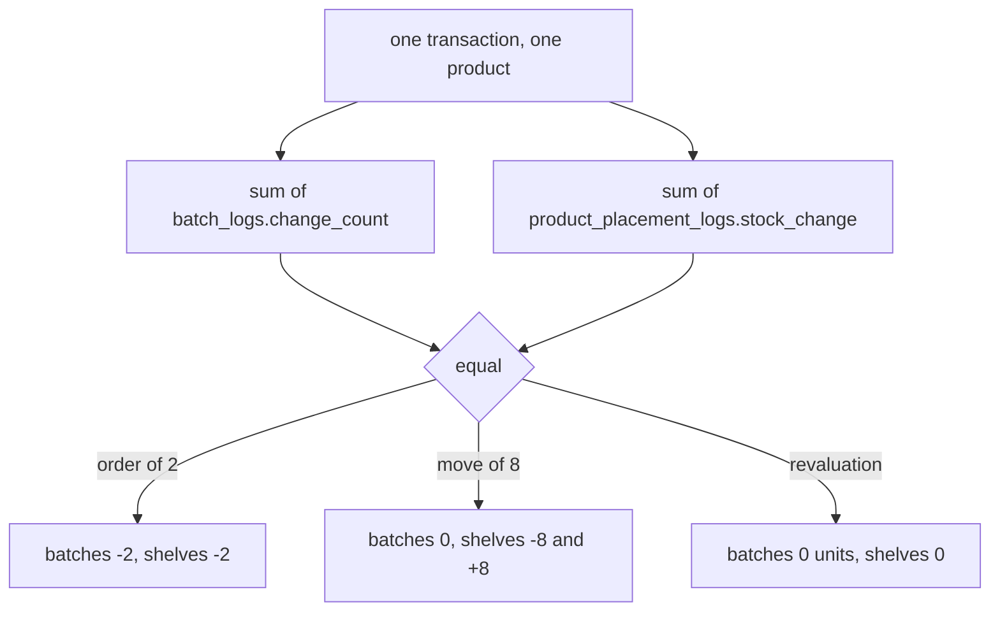

**14b — a found unit goes back where it was lost from.** A shirt goes missing from batch 7, priced Rp 12.000, and the
warehouse reimburses Rp 12.000. Two weeks later it turns up. Put on the newest batch 9 at Rp 15.000, the reversal
pays the warehouse back Rp 15.000 — Rp 3.000 more than it paid. As the reversal of the loss, it returns to batch 7 at
Rp 12.000, and FIFO then sells it first, which is right: it is the oldest unit.

**14c — a batch ends at exactly zero money.** 3 pcs bought for Rp 10.000:

| take | as drawn: `price_unit × n` | recommended: `valuation × n / count` |
| --- | --- | --- |
| 1st | −3.333,33 → 6.666,67 left | −3.333,33 → 6.666,67 left |
| 2nd | −3.333,33 → 3.333,34 left | −3.333,34 → 3.333,33 left |
| 3rd — the batch empties | −3.333,33 → **0,01 left on an empty batch** | **everything left**, −3.333,33 → **0** |
| taken in total | 9.999,99 | **10.000,00 — what was paid** |

Rupiah is floating point ([rupiah-is-floating-point](../order/context_decision.md#rupiah-is-floating-point)), so the
residue may be `0.000000000001` instead of `0,01` — still not zero, and that decision itself warns that an `== 0` check
fails on it. Taking *everything left* subtracts a number from itself, which is exactly 0. `price_unit` stays the price
shown on screen, changed only by a revaluation.

**14d — what a revaluation is for.** 10 units at Rp 10.000 (Rp 100.000); 6 sold, so Rp 60.000 has gone into order
costs; then the freight invoice arrives late, Rp 20.000 — Rp 2.000 a unit. As drawn, the batch's price goes to Rp
12.000, and `delta × stock_count` adds Rp 8.000 to the 4 left. Paid: Rp 120.000. Costed: Rp 60.000 + Rp 48.000 =
Rp 108.000. **Rp 12.000 is in no cost anywhere.** It depends on why the price changed:

| trigger | example | the right result |
| --- | --- | --- |
| a typo, nothing sold yet | 1.000 typed for 10.000 | as drawn — nothing sold, nothing lost |
| the goods are worth less now | an old model marked down | as drawn — only what is left has a value to change |
| **a cost that arrived late** | the freight invoice | **split by units** — see below |

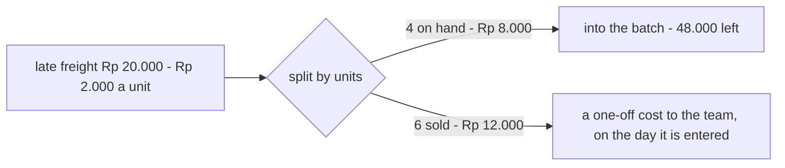

Not onto the 4 left (Rp 5.000 each would overstate them), and not into the 6 orders already costed (that rewrites
what an order said happened). Where the one-off cost is read — balance, or the profit report — is theirs to say.

**14e, 14f, 14g** — ✅ decided *(2026-10-08)*: [batch-logs-carry-price-unit-after](./context_decision.md#batch-logs-carry-price-unit-after) ·
[one-shelf-row-per-product-per-placement](./context_decision.md#one-shelf-row-per-product-per-placement) ·
[a-placement-deletes-only-when-nothing-waits-on-it](./context_decision.md#a-placement-deletes-only-when-nothing-waits-on-it) ·
[the-owning-team-revalues-with-a-reason](./context_decision.md#the-owning-team-revalues-with-a-reason).

### The mutation layers

✅ *(2026-10-08)* **Decided, all of it** — one mutation per operation, writing the transaction row and both ledgers
([one-mutation-per-operation](./context_decision.md#one-mutation-per-operation)); batches locked before shelves, by id
([batches-lock-before-shelves-by-id](./context_decision.md#batches-lock-before-shelves-by-id)); and the layer beneath
is a *ledger* ([the-layer-under-a-mutation-is-a-ledger](./context_decision.md#the-layer-under-a-mutation-is-a-ledger)).

### §Responsbility, mapped to what happens in the building

🔄 *(2026-10-08)* Six now — *managing placements* and *a solid api for other services* joined.

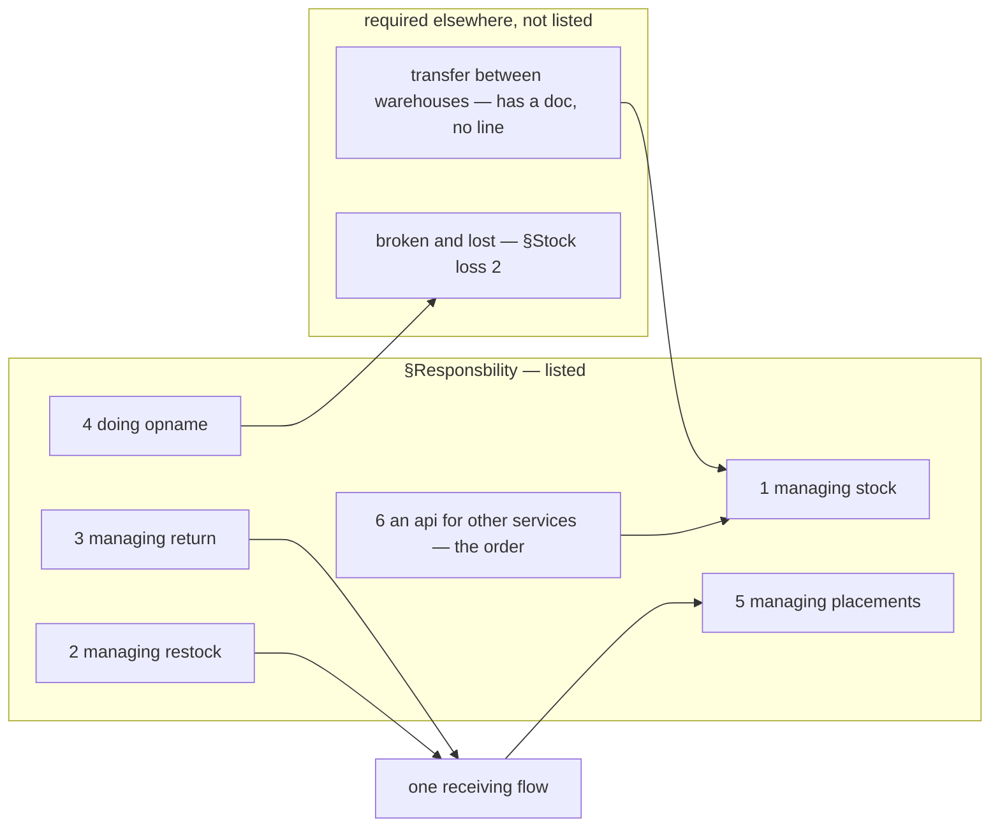

### The rules, named

#### selling-team-bears-the-receiving-loss
**Selling team** · goods broken, short or lost **at receiving** · bears the loss itself.
*(§Stock loss 1)* — the completing half of
[receiving-losses-are-not-the-warehouses](../business_level_clarify.md#receiving-losses-are-not-the-warehouses),
which said only who does *not* pay.

#### receiving-is-one-flow-for-restock-and-return
**Warehouse team member** · goods arrive, whether a **restock or a return** · one procedure handles both:
check against the system · accept · optional fee · calculate unit price · record losses and breakages ·
calculate valid quantity · **set placements**. *(§How Warehouse Team Member Accept Stock / Return That
Arrived)*

✅ **This closes what "at receiving" means.** The word in [selling-team-bears-the-receiving-loss](#selling-team-bears-the-receiving-loss)
now has a defined scope — the flow is titled for both phases and its first node reads *"Receiving
Restock/Return"* — so a return arriving damaged is a loss **at receiving**, and the selling team bears it.
That question was open for every pass of this analysis and is **deleted**. ⚠ The closure rests on *receiving*
meaning the same thing in the prose rule and in the flow's title; if it does not, this reopens.

⚠ **Still unstated: WHICH selling team**, when the sale was cross-team — the borrower who sold it, or the
owner whose goods they are. The flow never mentions an owning team at all
([product_context Critique 9](../product/context_clarify.md#critique)).

#### in-custody-shortfall-is-the-warehouses
**Warehouse team** · stock already **in** the warehouse · a loss **or an opname shortfall** · is a
warehouse **liability**. *(§Stock loss 2)* — so an unexplained count difference is money, not a
correction. §Warehouse 5 prices *broken and lost* at
[warehouse-reimburses-unit-price](../business_level_clarify.md#warehouse-reimburses-unit-price) — ⚠ **it does
not price a shortfall**, and an untraceable one cannot name a batch, so the number is an inference I am
making rather than a rule either doc states.

### The custody line, and the phase that falls between the two rules

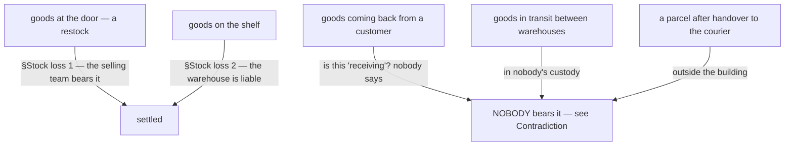

**→ Recommend** state the rule as a **list of phases with a bearer each**, rather than as two sentences.
Three phases currently have no bearer, and each of them is a real event that happens weekly.

### What a business-level stock doc still has to say

| | The question | Why it cannot be deferred |
| --- | --- | --- |
| **1** | **What is the unit we track?** A piece, a box, a pair? Is it the same unit the supplier sells and the marketplace sells? | If they differ, every count, every cost and every order line needs a conversion — a business rule nobody can guess. It also decides what `AllProductQtyRestock` counts in [unit-price-is-landed-cost](../product/context_clarify.md#unit-price-is-landed-cost). |
| **2** | **Where can stock BE?** On a shelf · arrived but not yet shelved · in transit between warehouses · set aside as damaged · held for an order. | 🔄 *(2026-10-08)* **A placement is now defined** — §Placements: *"like warehouse rack or physical placement… "rak 1", "rak ruang tengah""*, so opname *per shelf* has a grain. ⚠ Still unplaced: goods in transit between warehouses, and broken goods set aside — neither has a placement row. These are the places a person can physically point at, and [in-custody-shortfall-is-the-warehouses](#in-custody-shortfall-is-the-warehouses) now attaches **money** to being "in the warehouse" — so the boundary of that phrase has a price. |
| **3** | **What does "available" mean?** On-hand minus what — committed orders, the shared reserve, damaged units awaiting a decision? | Two selling teams share one pool by design, and [reserved-stock-is-never-shared](../product/context_clarify.md#reserved-stock-is-never-shared) now subtracts from it. "Available" is the number both teams sell against, and if it means two things they will oversell. |
| **4** | **Who may move stock, is the move RECORDED, and who may change a count?** `business_level.md` §Warehouse 8 now names *"manage placements of the stocks"* as a standalone responsibility ([warehouse-manages-placements](../business_level_clarify.md#warehouse-manages-placements)) — so moving goods between places is a first-class act. 🔄 *(2026-10-08)* **The trace now exists**: `product_placement_logs` carries a `transaction_id` and an actor — but a move has no `tx_type` yet ([Q13c](#question)). ⚠ **An unrecorded move is indistinguishable from a loss at the next count**, and under [in-custody-shortfall-is-the-warehouses](#in-custody-shortfall-is-the-warehouses) a count shortfall is a **warehouse liability**. A crew that reshelves without recording it **manufactures its own debt** — and the units turn up on another shelf as an unexplained surplus. | **Every move is recorded, from place to place, with its actor** — that single rule is what makes the opname liability survivable, because a difference then has somewhere to be explained from. Also answer the two originals: may the *owner* adjust a quantity, and may the warehouse write stock off unilaterally? |
| **5** | **Can stock change OWNER without moving?** Team A sells its remaining units to team B, or a team closes. | Nothing allows it and nothing forbids it. If it can happen it is a movement with a cost and a balance entry, not an edit. |
| **6** | **How often is stock counted, and who may call for a count?** §Warehouse 7 says opname happens. Nothing says when, at what grain, or who triggers it. | Now that a shortfall is a liability, **the trigger is a financial act**. See [Critique 2](#critique). |

### The failure list — three rows closed this round

| What happened | Who is out of pocket | Status |
| --- | --- | --- |
| short delivery — 8 of 10 arrived | the **selling team** | ✅ §Stock loss 1 |
| a unit smashed while being received | the **selling team** | ✅ §Stock loss 1 |
| a unit smashed on the shelf | the **warehouse** | ✅ §Stock loss 2, at the owner's **Unit Price** ([warehouse-reimburses-unit-price](../business_level_clarify.md#warehouse-reimburses-unit-price)) — ⚠ but WHICH batch's is open |
| a count is 3 short and nobody knows why | the **warehouse** | ✅ §Stock loss 2 — but at what tolerance, and with what dispute path? [Critique 1](#critique) — and ⚠ **at what price**: §Stock loss 2 names none, and §Warehouse 5 prices *broken and lost*, not an untraceable shortfall |
| the missing 3 turn up two weeks later | reverses — but who **owns** them now? | open, [Critique 4](#critique) |
| a customer returns a unit unsellable | ? | **open — nobody bears it**, see [Contradiction](#contradiction). ⚠ And a *sellable* return now has a price but no shelf — [product_context Q1](../product/context_clarify.md#question) |
| goods expire on the shelf | ? | open — expiry is not mentioned anywhere in the requirement set |
| a unit is lost in transit between two warehouses | ? | open, [Critique 6](#critique) |

### Who confirms a count — the separation-of-duty picture (moved from the user context)

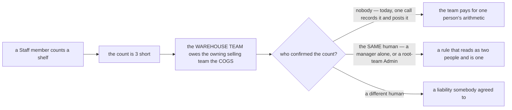

**→ Recommend** state the rule against the **person**, not the role: *the human who records may not be the
human who confirms.* One role per team does not do it: a manager may count and confirm alone, and the root team
acts in every team. A check of recorder against confirmer closes both, and it costs one comparison.

---

## Critique

| | Problem | → Recommend |
| --- | --- | --- |
| **1** | **[in-custody-shortfall-is-the-warehouses](#in-custody-shortfall-is-the-warehouses) has no tolerance and no dispute path.** Every count in a real warehouse differs from the book by a little. As written, each of those differences is a debt on the warehouse the moment somebody counts — and with a [debt threshold](../balance/context_clarify.md#debt-threshold-limits-liability) now able to block a team, an accumulation of small counting noise can stop a warehouse trading. | Keep the rule (it is right — a count with no consequence stops being done carefully), but add the two things that make it survivable: **a stated tolerance or none, said explicitly**, and **a dispute window** in which the warehouse can recount before the entry is final. I would say **no tolerance, and a 24-hour recount window** — exactness with a chance to correct beats a fudge factor nobody can audit. |
| **2** | **Nothing says who may CALL an opname — nor, now that roles exist, who may PERFORM one.** If a stock owner can demand a count of their own goods at will, they can generate warehouse liabilities on demand. If only the warehouse may count itself, nobody independent ever verifies the goods. And [user_context.md](../user/context.md) gives the warehouse **Staff**, so the person whose handling caused a shortfall may also be the person who records it — the team then pays for one person's arithmetic, unchecked. | **The warehouse counts on a schedule it owns, and an owner may REQUEST a count** which the warehouse must perform within a stated time — the trigger stays with the party that bears the result, and the owner still gets a real check. **Grain: a shelf, on a rolling cycle**, because a whole-building count needs the building shut. And **recorder ≠ confirmer, stated against the HUMAN and not the role** — `user_context.md` §General lets one person hold two roles, so a role-level rule can be satisfied by one pair of hands (user Critique 2, since moved here as [Q12](#question)). |
| **3** | **"loss/opname" merges two different events into one liability.** A *witnessed* loss — someone drops a box — is a fact with an actor, a time and often a photograph. An *opname shortfall* is the absence of an explanation: the goods went at some unknown moment, possibly before this warehouse ever had them. Charging both identically is defensible, but it makes the more common one impossible to investigate, because nothing distinguishes them afterwards. | Record them as **two kinds** even though they price the same: **loss** (witnessed, has an actor and a cause) and **shortfall** (found by counting, cause unknown). A warehouse whose shortfalls are rising has a different problem from one whose losses are, and the doc should let you see which. |
| **4** | **Nothing says what happens to a broken unit — or a found one — after the money is settled.** The warehouse has reimbursed the owner's Unit Price. The object still exists: does the warehouse keep it, scrap it, or sell it? And when a written-off unit is found again ([balance cause 5](../balance/context_clarify.md#the-six-causes-and-which-direction-each-pushes)), does it return to the owner's shelf? | Say it: **once reimbursed, the object is the warehouse's** — it paid for it. That also makes found-back coherent: the unit going *back* to the owner is exactly why the money reverses. A broken-and-reimbursed unit the warehouse then sells is its own income, not the owner's. |
| **5** | **"Broken" and "lost" are used as one phrase everywhere and they are different events.** A broken unit is here and unsellable — someone is holding it. A lost unit is not here, and only a lost unit can be *found back*. | Separate them in the vocabulary. **Broken** = present, unsellable, something must be decided about the object ([Critique 4](#critique)). **Lost** = absent, and it may come back. Only the second needs a reversal path. |
| **6** | **In-transit stock between warehouses has no owner of the risk.** Goods leave warehouse 1 and have not arrived at warehouse 2 — they are in nobody's custody, so [in-custody-shortfall-is-the-warehouses](#in-custody-shortfall-is-the-warehouses) does not reach them. A transfer is currently the one way to lose goods with no liability. | Name **in transit** as a place, and put the risk on the **sending** warehouse until receipt is confirmed. |
| **7** | **Two Staff at one shelf is the normal case here, and no requirement mentions it.** One counts A-01-3 while the other picks from it. The count is right, the pick is right, the recorded result is wrong — and that wrong result is now a **debt on the warehouse**. The role doc names the people without saying two of them may be at one shelf at once. | A business rule, not a technical one: **a count is a statement about a moment**, and either the shelf is closed to picking while it is counted, or the count is reconciled against what moved during it. I would close the shelf — it is the version a person can actually follow. |
| **8** | 🔄 *(2026-10-08)* **A batch knows when it expires, and not which shelf it is on.** [batch.md](./batch.md) gives `batches` an optional `expired_at`, so something you sell perishes. But a batch has no placement and a shelf row has no batch — the system can say *"12 units expire in March"* and cannot tell the picker where they are. | **FIFO stays a costing rule, and expiry is a report** — what expires soon, per product per warehouse. If an expiring product must be **picked** soonest-first, a shelf row needs a `batch_id` — [Q7](#question). |
| **9** | **⚠ The flow computes the unit price BEFORE it knows what arrived.** The arrows run *Accept → (fee) → **Calculate Unit Price** → Is Any Lost → Is Any Broken → **Calculate valid Qty***. So the divisor in [unit-price-is-landed-cost](../product/context_clarify.md#unit-price-is-landed-cost) — `AllProductQtyRestock` — can only be the **expected** quantity, because the shortfall has not been captured yet. Freight and the warehouse fee are then spread over units that **never turned up**: the surviving units are **under-costed**, the margin on them is overstated for the life of the batch, and [warehouse-reimburses-unit-price](../business_level_clarify.md#warehouse-reimburses-unit-price) under-pays the owner if one of them later breaks. | **Move `Calculate Unit Price` after `Calculate valid Qty`.** It is one arrow, and it makes the cost of a batch the money actually spent divided by the goods actually landed. ⚠ **I am not treating the diagram as having decided this** — a drawn order is not prose, and drawing the fee step early is exactly the kind of thing that happens for layout reasons. It is [Question 2](#question). |
| **10** | ✅ *(2026-10-08)* **Answered** — a restock line records both: what arrived and how many of those are broken, and the short units are the difference ([any-warehouse-member-counts-what-arrived](./restock_decision.md#any-warehouse-member-counts-what-arrived)). ⚠ This flow still draws them as exclusive, so it is now older than the restock it describes | redraw it from the restock, or point at it |
| **11** | **"Report Manually (Outside System)" ends the process with goods in the building and nothing recorded.** Stock arrives, the system has no matching restock, and the flow terminates outside it. Nothing says what happens to the goods physically: whether they are refused at the door, set aside, or shelved anyway. If they are shelved, the next opname finds units nobody can explain; if they are set aside, they are goods in limbo with no owner and no liability. **A real receipt can currently leave no trace.** | Keep the escape hatch — an unexpected delivery is real — but **end it inside the system**: record a *receipt with no matching restock*, name who it is being held for, and leave the goods **unplaced** until someone resolves it. Then the count reconciles and the manual report is a task rather than a dead end. |
| **12** | **Placement now has two moments and only one is drawn.** The receiving flow ends at `Set Placements`, so a **first** placement always happens and nothing routinely sits unshelved — good, and it matches [warehouse-manages-placements](../business_level_clarify.md#warehouse-manages-placements). What the flow does not cover is the **later** move: reshelving, consolidating, moving between racks. My recording recommendation in row 4 covers both, but only the second is a *move* — the first is part of accepting, and it already has a natural record because the receipt exists. | Say the two are different acts: **placement at receiving is part of the receipt** · **a later move is its own recorded event with its own actor**. Otherwise "record every move" reads as demanding a second record for something the receipt already captured. |
| **13** | 🔄 *(2026-10-08)* **Two of the four are now listed** — *5. managing placements*, and *6. a solid api for other services, like order* covers stock leaving for an order ([order.md](./order.md) draws it). **Still not listed:** transfer between warehouses — it has [warehouse_transfer.md](./warehouse_transfer.md) and a `tx_type`, and no line — and recording broken and lost, which §Stock loss 2 makes a liability. | Add **7. transfer between warehouses** and **8. recording broken, lost and found back**. |

---

## Question

1. **Is the flow's step order deliberate — `Calculate Unit Price` BEFORE the shortfall is known?** As
   drawn, freight and the warehouse fee are divided by the **expected** quantity, so units that never
   arrived carry cost and the ones that did are under-priced. ([Critique 9](#critique))
   **→ I recommend moving it after `Calculate valid Qty`. One arrow — but a diagram is not prose, so this
   is a question and not a finding against you.**
2. ✅ *(2026-10-08)* **Answered: both**, per line —
   [any-warehouse-member-counts-what-arrived](./restock_decision.md#any-warehouse-member-counts-what-arrived).
3. **Goods arrive that the system does not know about — what happens to them physically, and who bears
   them?** *"Report Manually (Outside System)"* ends the flow with stock in the building and no record.
   ([Critique 11](#critique)) **→ I recommend recording a receipt with no matching restock and leaving the
   goods unplaced, so the escape hatch ends inside the system.**
4. **Is there a tolerance on an opname shortfall, and can the warehouse dispute one?**
   ([Critique 1](#critique)) **→ I recommend no tolerance, with a short recount window.**
5. **Who may call for an opname, and at what grain?** ([Critique 2](#critique))
   **→ I recommend the warehouse schedules it, the owner may request one, counted per shelf.**
6. **After the warehouse has reimbursed a broken unit, whose object is it?** ([Critique 4](#critique))
   **→ I recommend the warehouse's.**
7. 🔄 *(2026-10-08)* **Something expires — does the picker take the soonest-expiring unit?** `batches.expired_at`
   answers the old question. A batch has no shelf, so today the system can report expiry and cannot direct a pick.
   ([Critique 8](#critique)) **→ I recommend no: expiry is a report, and FIFO stays costing.** If yes, a shelf row
   carries its `batch_id`, and every put-away and pick has to name the batch.
8. **§Responsbility 2 *managing restock* — from the moment the selling team CREATES it, or only from the
   door?** §Selling 4 has the selling team *decide and mint* the restock; §Warehouse accepts it.
   **→ I now recommend inventory owns the restock record end to end** — I previously said purchasing should
   be its own context, and your update changed my mind: the receiving flow's first step is *Check on
   System*, so the expected-goods record and its acceptance belong in one place. What stays **out** is the
   buying decision itself — **suppliers** (§Selling 5) and the price paid. Where do suppliers live?
9. **What does inventory NOT own?** §Responsbility now says what it does and still draws no outer line.
   Candidates at the edge: suppliers (Q8), the unit-price rule (defined in
   [product](../product/context.md#unit-pricing-system), computed at receiving), the loss money (balance),
   the pick job for an order ([Critique 13](#critique)).
   **→ I recommend** a *"not responsible for"* list beside §Responsbility, each item naming who is.
10. **Where is Toni's proposal, and who picks between the two?** The doc is marked as Heri's design;
    [member.md](../project/member.md) gives Stock & Inventory to Toni, and the tiebreak is still open in
    [member_clarify Q4](../project/member_clarify.md#question).
    **→ I recommend** writing Toni's proposal into this repo too, so the two can be compared on the page.
    ⚠ Also: [technical/stock/design.md](../../technical/stock/design.md) still sits at `stock/` coordinates —
    move it to `technical/inventory/` when you are ready, so the three trees line up again.

11. 🔄 *(2026-10-08)* **`PostOrder` lowers a shelf when the order is created — which shelf, and what does a count do
    before the pick?** [order.md](./order.md) posts the placement ledger inside the create, and
    [placement.md](./placement.md) lists `PostOrder` — as
    [a-take-reduces-stock-and-placement](../order/context_decision.md#a-take-reduces-stock-and-placement) decided. So the
    shelf figure drops before anyone has lifted the unit. My earlier *two quantities* recommendation is **withdrawn**: it
    lowered the shelf at the pick, and the decision lowers it at create.

    | | Part | → Recommend |
    | --- | --- | --- |
    | **11a** | ✅ **Answered: the shelf holding the fewest goes first** — [an-order-takes-from-the-lowest-shelf-first](./context_decision.md#an-order-takes-from-the-lowest-shelf-first) | — |
    | **11b** | **The picker takes it from another shelf.** The book moves a unit off Rak 3 and the picker lifts it off Rak 1. The next count finds a debt on Rak 1 and a surplus on Rak 3 | 🔄 *(elaborated)* **the pick list prints the shelf; the picker confirms the shelf it actually used, as a `pick` transaction**; when the two differ, the pick writes a `move` so the book follows the unit |
    | **11c** | **A count before the pick** finds the unit still on the rack. Posted as found, the same unit is sold twice — and a warehouse debt turns up later for a unit it never lost | 🔄 *(elaborated)* **the count subtracts the units taken from that shelf and not yet picked** — known from the `pick` transactions, so nothing has to update the order's transaction ([13e](#question)) |
    | **11d** | **A line bigger than the lowest shelf**, and two shelves with the same count | 🔄 *(elaborated)* **keep your rule as written — fewest first, spilling to the next** — and the pick list prints each shelf with its count. My *lowest shelf that fills the line* is **withdrawn**: it can cost exactly the emptying your rule exists for. Ties go to the lower placement id |

    All three are worked through, with the book and the rack side by side, in [PostOrder, worked](#postorder-worked).

    ➡ Re-routed here from [order_creation](../order/order_creation_clarify.md) on 2026-09-17. When
    [placement.md](./placement.md) gets a clarify of its own, this moves there.

12. **When a count or a loss changes what one team owes another, who has to agree before it posts?**
    ➡ Moved from [user Q3](../user/context_clarify.md#question) (2026-10-02). It is the confirm half of
    [Critique 2](#critique). Five parts, each its own yes or no:

    | | Part | Built today | → I recommend |
    | --- | --- | --- | --- |
    | **12a** | **Which acts need a second person?** | none — every count and adjustment posts in the call that records it | **every count or adjustment that changes a debt**: short, damaged, lost, and *found*, because a false *found* erases a debt. A count that matches posts at once, so the usual case costs nothing |
    | **12b** | **Who records, who confirms?** | only the warehouse's Owner or Admin may count or adjust, and Staff are refused, though the proto itself says Staff are the ones at the racks | **Staff or a manager records, the warehouse's Owner or Admin confirms.** Counting is floor work, and your Staff line does not list it yet |
    | **12c** | **May the confirmer be the human who recorded?** | yes — nothing compares the two | **No, never.** This is the half one role per team does not give you |
    | **12d** | **May Root or the root team's Admin confirm?** | they can do anything in any team. The access check already knows when someone got in this way (an *override*), but only liability's terms log records it | **Root and the Administrator may** — [root-can-do-anything](../user/context_decision.md#root-can-do-anything), [the-administrator-can-do-anything](../user/context_decision.md#the-administrator-can-do-anything). **→ Recorded as an override, and still never their own record.** |
    | **12e** | **What does the shelf show while a count waits?** | nothing ever waits | **The old figure, with the pending count beside it.** A count never posts by timeout, because a debt nobody agreed to is what this exists to stop. A rejected count is counted again |

    ```mermaid
    flowchart LR
      C["Staff or a manager counts shelf A-01-3"] --> V{"does it match?"}
      V -->|"yes"| P["posts now — no debt moves"]
      V -->|"no — short, damaged, lost or found"| W["PENDING — the shelf keeps its old figure"]
      W --> K{"who confirms?"}
      K -->|"the warehouse's Owner or Admin, another human"| OK["posts — the debt is created"]
      K -->|"the human who counted"| X["refused"]
      W -->|"rejected"| R["counted again"]
    ```

    ⚠ Your receiving flow runs **one actor end to end** — accept, input
    losses, input broken, set placements — with no second party. For a **restock** that is now decided: Staff accepts
    it alone ([staff-accepts-the-restock](../user/context_decision.md#staff-accepts-the-restock)), and 🔄 *(2026-10-07)* so
    does any member of the warehouse team ([any-warehouse-member-counts-what-arrived](./restock_decision.md#any-warehouse-member-counts-what-arrived)).
    A loss at receiving is the selling team's, so it creates no warehouse debt, and Q12 is about counts and losses **in custody**.

13. 🔄 *(2026-10-08)* **What the transaction still does not say.** Its core is decided —
    [every-stock-change-belongs-to-a-transaction](./context_decision.md#every-stock-change-belongs-to-a-transaction).
    These are the gaps in the table you wrote:

    | | Part | → Recommend |
    | --- | --- | --- |
    | **13a** | **Which restock, which order?** 🔄 You answered it the other way round: `restocks.transaction_id`, so the restock points at its transaction. That works while a restock has **one** transaction. It breaks on the second — a mistyped count corrected after accept, a reversal — because one column holds one id. And an order lives in another service, so inventory cannot add the column to the order | **`ref_id` on the transaction** — the restock's, order's, return's or transfer's id, and `tx_type` already says which kind. Many transactions can then point at one restock, and inventory can say which order a transaction served without asking anyone. `restocks.transaction_id` becomes a copy. *I would still put it on the transaction — what breaks?* |
    | **13b** | **"get transaction" — made at accept, or earlier?** [restock.md](./restock.md)'s accept *gets* one, and `restocks.transaction_id` suggests it exists before accept. Made when the restock is created, a cancelled or lost restock holds a transaction that never moved stock | **created at accept.** A transaction is a change to stock, and nothing changes before accept |
    | **13c** | **Operations with no `tx_type`.** A move between shelves writes placement logs, a revaluation writes `batch_logs`, a count corrects both — each needs a `transaction_id`, and none has a type | add **`move`**, **`revaluation`**, **`opname`**. Not `adjustment` for all three: a move creates no debt and a count does ([Critique 3](#critique)) |
    | **13d** | **What is `sample`?** Units out for a product photo, a buyer's sample, a giveaway? Who asks for it, and who pays — the owning team or the warehouse? | **the owning team asks, and bears it** — its own goods leaving on its own request, never a warehouse debt |
    | **13e** | **How is a mistake undone?** There is no `status`, yet `updated_at` says the row changes. And an order cancelled before the pick puts its units back — under which type? | **Nothing updates a transaction** — drop `updated_at`. A mistake or a cancel is a **new** transaction with opposite signs and **`reverses_id`** pointing at the one it undoes. A found unit is then the reversal of its loss: same batch, same price ([Q14b](#question)) |
    | **13f** | **Whose `team_id` when team B sells team A's goods?** | **the stock's owner, A** — both ledgers are keyed by the owning team, and the seller is on the order. An order holding two owners' goods writes two transactions |
    | **13g** | **The person, recorded twice** — `create_by_user_id` on the transaction, `actor_id` on both logs. I asked for the placement log's `actor_id` in chat; now that the transaction names the person, it is a copy that can disagree | **keep it on the transaction only**; drop `actor_id` from `batch_logs` and `product_placement_logs` |

14. 🔄 *(2026-10-08, elaborated)* **The two ledgers' rules** — what [batch.md](./batch.md) and
    [placement.md](./placement.md) do not yet say. Seven parts; e, f and g are answered, a–d are open. Every part is worked through,
    with an example, in [the ledger rules, worked](#the-ledger-rules-worked).

    | | Part | → Recommend |
    | --- | --- | --- |
    | **14a** | **Nothing says the two ledgers count the same units.** One mutation that writes a shelf and forgets the batch leaves a unit the system can sell and nobody can find | **one rule, no exceptions:** per transaction and product, the batch change equals the shelf change. A move nets 0 on shelves and a revaluation moves no units, so both obey it as written. Each mutation's unit test asserts it |
    | **14b** | **A found unit — which batch?** On the newest batch, its money comes back at a different price from the one the warehouse paid out | **the reversal of the loss** ([13e](#question)) — same batch, same price, so the money reverses to the rupiah. An emptied batch reopens for it |
    | **14c** | **A batch must reach zero money when it reaches zero units.** `price_unit × n` leaves Rp 0,01 on an emptied 3-for-Rp-10.000 batch | **`stock_valuation` is the truth.** A take of *n* removes `valuation × n / count`; the take that empties a batch removes all that is left, which is exactly 0 even in floating point |
    | **14d** | **Revaluing a part-sold batch loses money.** A late Rp 20.000 freight bill after 6 of 10 sold: Rp 8.000 lands in the batch, Rp 12.000 nowhere | **name the triggers.** A typo or a markdown revalues only what is left, as drawn. A **late cost** splits by units: the on-hand share into the batch, the sold share out as a one-off cost to the team |
    | **14e** | ✅ **Answered: `price_unit_after` added, `batch_price_logs` kept** — [batch-logs-carry-price-unit-after](./context_decision.md#batch-logs-carry-price-unit-after) | — |
    | **14f** | ✅ **Answered, as recommended** — [one-shelf-row-per-product-per-placement](./context_decision.md#one-shelf-row-per-product-per-placement), [a-placement-deletes-only-when-nothing-waits-on-it](./context_decision.md#a-placement-deletes-only-when-nothing-waits-on-it) | — |
    | **14g** | ✅ **Answered, as recommended** — [the-owning-team-revalues-with-a-reason](./context_decision.md#the-owning-team-revalues-with-a-reason) | — |

15. ✅ *(2026-10-08)* **Answered: one mutation per operation · batches lock before shelves, by id · the layer underneath
    is a ledger** — [one-mutation-per-operation](./context_decision.md#one-mutation-per-operation),
    [batches-lock-before-shelves-by-id](./context_decision.md#batches-lock-before-shelves-by-id),
    [the-layer-under-a-mutation-is-a-ledger](./context_decision.md#the-layer-under-a-mutation-is-a-ledger).

---

# Contradiction

## mutation-means-two-layers

🔄 *(2026-10-08)* **Both words are decided** — a mutation is one operation
([one-mutation-per-operation](./context_decision.md#one-mutation-per-operation)) and the per-ledger writer is a *ledger*
([the-layer-under-a-mutation-is-a-ledger](./context_decision.md#the-layer-under-a-mutation-is-a-ledger)), which is the
template's meaning. **What keeps this open is your text**, which still uses the old word in two places:
[placement.md](./placement.md)'s heading *Placement Ledger Mutation* → *Placement Ledger*, and §How We Breakdown
Complexity's diagram node `PlacementLedgerMutation` → `PlacementLedger`. Who opens the transaction is still open in the
template's clarify ([mutation_and_ledger Q4](../../technical/ledger/mutation_and_ledger_clarify.md#question)).

As first found — your ledger template and §How We Breakdown Complexity use the word for different layers:

| | [technical/ledger/mutation_and_ledger.md](../../technical/ledger/mutation_and_ledger.md) | [context.md](./context.md) §How We Breakdown Complexity |
| --- | --- | --- |
| a mutation is | *"bussiness logic like `RestockCreateMutation`, `RestockAcceptMutation`"* — **one operation** | `PlacementLedgerMutation`, with `Order` and `Adjust` on it — **one ledger** |
| what writes a ledger | the *Ledger Manager* | the mutation |
| who opens the transaction | the mutation — *"open database transaction"* | the API — *"Api Called"*, the tx passed in |

**→ Recommend** the template's word and context.md's transaction:
- **A mutation is one operation.** The per-ledger writer is a *ledger* (`BatchLedger`, `PlacementLedger`), as the
  template's Ledger Manager is. The template is the doc every other service copies, so the word has to mean one thing.
- **The caller opens the transaction.** That is what lets restock accept put its problem rows in the same transaction
  without the mutation knowing restock's tables. The template draws the opposite, and that is asked where the template
  can answer it — [mutation_and_ledger Q4](../../technical/ledger/mutation_and_ledger_clarify.md#question).

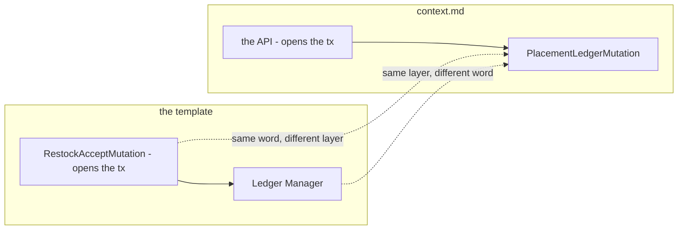

## the-two-type-lists-do-not-line-up

*(2026-10-08)* A transaction's type and its log rows' type are two lists, written in two docs, and they disagree:

| | `tx_type` — [context.md](./context.md) | `change_type` — [batch.md](./batch.md) |
| --- | --- | --- |
| in both | `order` · `restock` · `return` · `adjustment` | the same |
| only here | `sample` · `transfer_in` · `transfer_out` | — so a sample's or a transfer's batch row has **no valid `change_type`** |
| only there | — so a revaluation has **no `tx_type`** | `revaluation` · `broken` · `lost` |

🔄 *(2026-10-08)* **Half fixed.** [placement.md](./placement.md) now lists `product_placement_logs.change_type`, and it
is the `tx_type` list exactly — the placement side writes its transaction's type, as recommended below. **The batch side
still differs.** `broken` and `lost` are fine — they are the *reasons* inside an `adjustment` — but `revaluation`,
`sample` and the transfer legs each break one side. Neither list has `move` ([Q13c](#question)).

**→ Recommend** one list, kept in [context.md](./context.md), that both ledger docs point at: **every `tx_type`, plus
the reasons an `adjustment` carries** (`broken`, `lost`, `found`). A log row writes its transaction's type — or, inside
an adjustment, its reason. One list cannot drift from itself; two will drift again the next time a type is added.

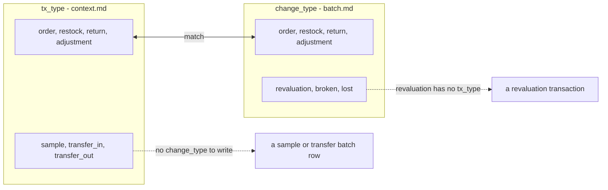

## ✅ the receiving-boundary gap is CLOSED — recorded, not deleted silently

For several passes this section held a contradiction: `business_level.md` §Warehouse 6 named **two**
phases the warehouse is not liable for — *"receiving restock or return goods from the returning orders"* —
while §Stock loss 1 assigned the loss using **one** word, *"at receiving"*. Between them, a return arriving
smashed was borne by nobody.

**§How Warehouse Team Member Accept Stock / Return That Arrived closes it** by giving the word a scope:
one flow, titled for both, first node *"Receiving Restock/Return"*. So *"at receiving"* covers both phases
and the selling team bears both.

**Why it is recorded rather than removed:** the cause was a rule assigning liability with a **word whose
scope lived in another document** — the same shape as the two leg-naming contradictions in
`order_context_clarity`. What closed it was not a new rule but a **definition of the term**, and that is
the cheapest fix available for this class. ⚠ The one residue is named under
[receiving-is-one-flow-for-restock-and-return](#receiving-is-one-flow-for-restock-and-return): *which*
selling team bears a cross-sold return.

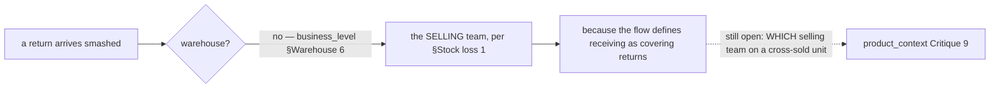

---

# Awaiting

- 🔄 *(2026-10-08)* **Places, batches and the transaction now exist** — §Placements, §Batches and the two ledger docs.
  Still unsaid: **the unit**, **what "available" means** ([Q11](#question)), and the four empty docs —
  [opname.md](./opname.md), [order.md](./order.md), [return.md](./return.md), and transfer, which
  has a `tx_type` and no doc.
