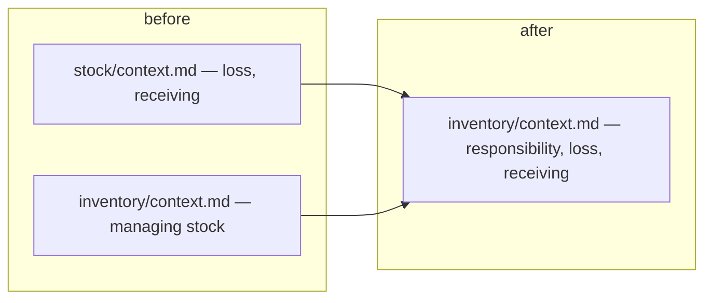

# Decisions — `inventory/context.md`

What the owner settled, recorded before it is acted on. **Append-only** — a decision that is later
reversed is renamed and its references grepped (RULE 12), never quietly edited away.

| decision | what it decided |
| --- | --- |
| [stock-merges-into-inventory](#stock-merges-into-inventory) | there is no separate stock context — its rules live in `inventory/context.md` |

---

## stock-merges-into-inventory

> Asked in chat as *"Does inventory contain stock, or replace it?"* — `inventory/context.md` said only
> *"managing stock"*, while `stock/context.md` held the loss rules and the receiving flow. **Owner (2026-09-14):
> merge stock context to inventory context.**

**The verdict.** `stock` is no longer a big context. `business/stock/context.md` is **deleted**; its two
sections — §Stock loss and §How Warehouse Team Member Accept Stock / Return That Arrived — are appended
**verbatim** to [inventory/context.md](./context.md). The open questions moved with them to
[context_clarify.md](./context_clarify.md).

**Spec — what moved.**

| from | to |
| --- | --- |
| `business/stock/context.md` | appended to `business/inventory/context.md` |
| `business/stock/context_clarify.md` | `business/inventory/context_clarify.md` (history kept) |
| every link to either | repointed — clarify files, `biggest_question.md`, `development_state/toni.md`, the business-analyst agent, and the link target in `business_level.md` §Other Context Related |

**Not moved:** [technical/stock/design.md](../../technical/stock/design.md). The owner's instruction named
the business context; lining up the technical tree is asked in
[Question 10](./context_clarify.md#question).
