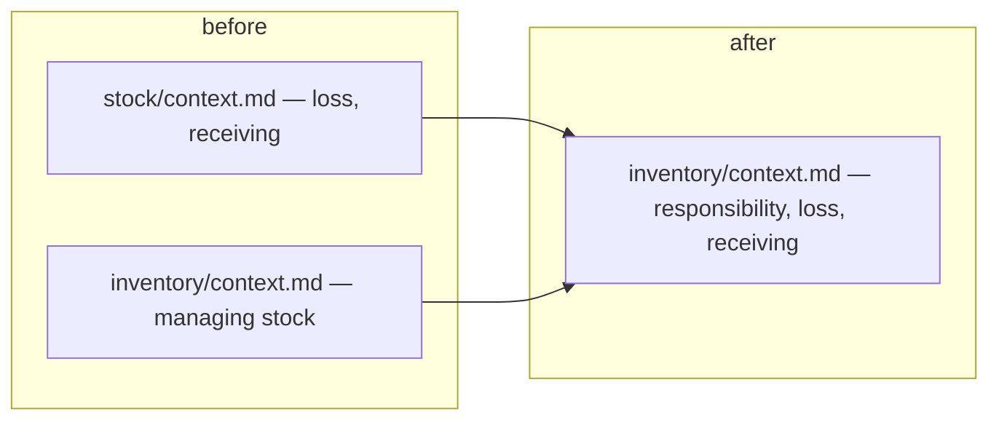
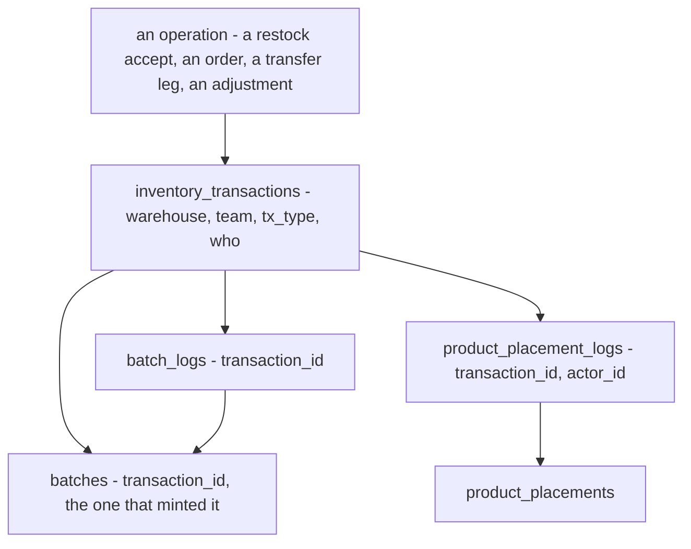
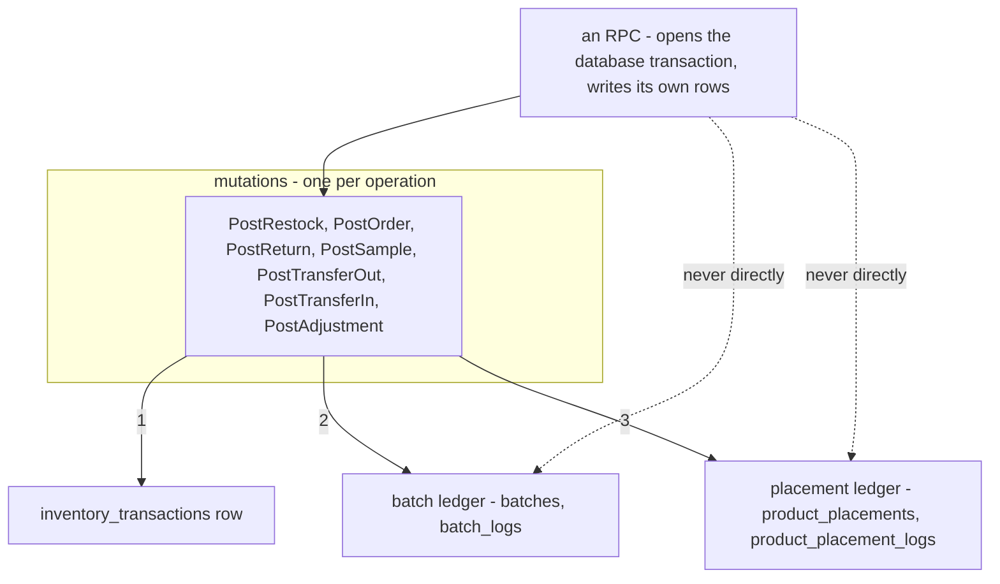
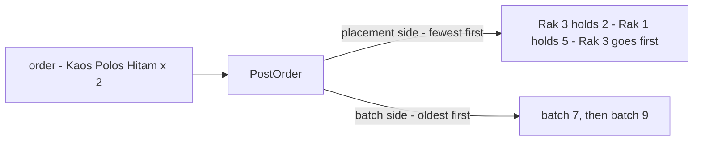
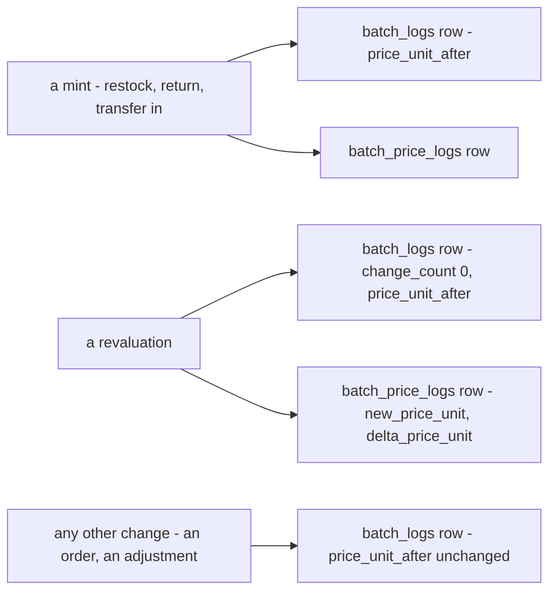
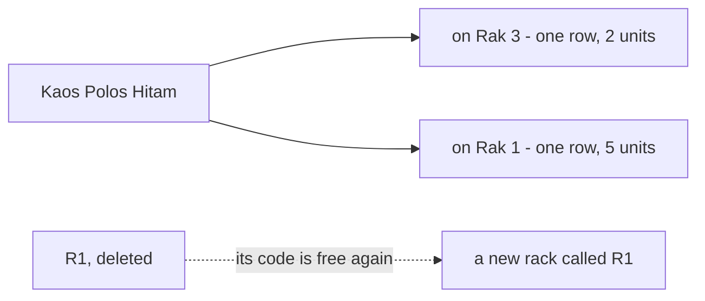
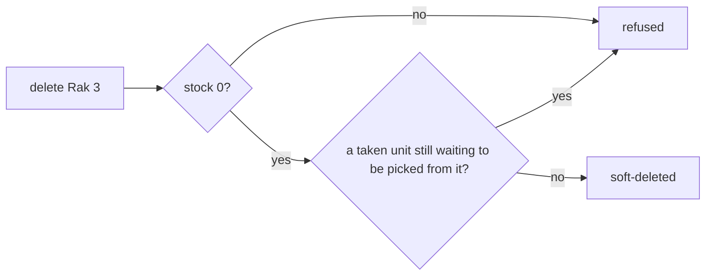
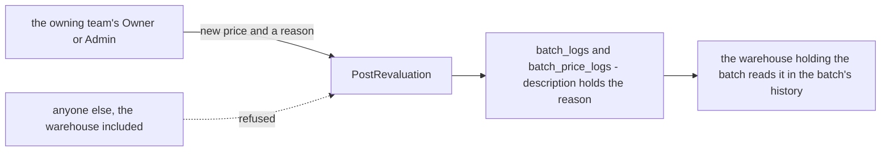
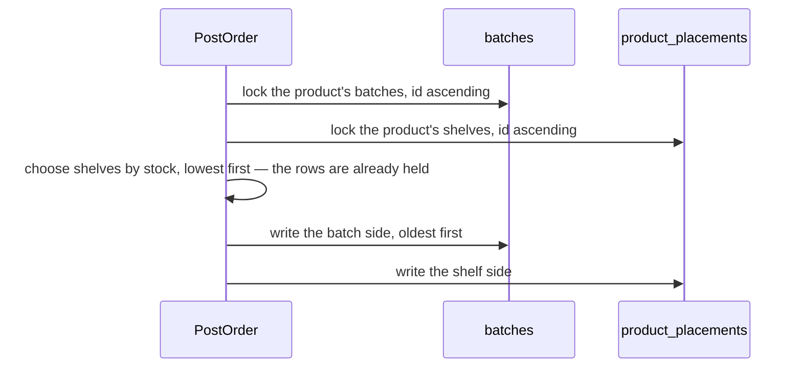
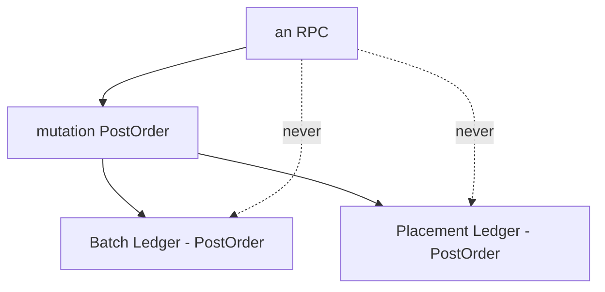

# Decisions — `inventory/context.md`

What the owner settled, recorded before it is acted on. **Append-only** — a decision that is later
reversed is renamed and its references grepped (RULE 12), never quietly edited away.

| decision | what it decided |
| --- | --- |
| [stock-merges-into-inventory](#stock-merges-into-inventory) | there is no separate stock context — its rules live in `inventory/context.md` |
| [every-stock-change-belongs-to-a-transaction](#every-stock-change-belongs-to-a-transaction) | one `inventory_transactions` row per operation; both ledgers' log rows point at it; there is no items table |
| [one-mutation-per-operation](#one-mutation-per-operation) | a mutation is one operation — `PostOrder`, `PostRestock` — and it writes the transaction row and both ledgers; no RPC writes a ledger directly |
| [an-order-takes-from-the-lowest-shelf-first](#an-order-takes-from-the-lowest-shelf-first) | `PostOrder` lowers the product's shelf holding the fewest units first; the batch side stays FIFO |
| [batch-logs-carry-price-unit-after](#batch-logs-carry-price-unit-after) | `batch_logs` gains `price_unit_after`; `batch_price_logs` is kept beside it, and a mint or a revaluation writes both |
| [one-shelf-row-per-product-per-placement](#one-shelf-row-per-product-per-placement) | `product_placements` is unique on (`product_id`, `placement_id`); a placement's code is unique among the warehouse's undeleted placements |
| [a-placement-deletes-only-when-nothing-waits-on-it](#a-placement-deletes-only-when-nothing-waits-on-it) | a placement is deleted only at 0 stock **and** with no taken unit still waiting on it to be picked |
| [the-owning-team-revalues-with-a-reason](#the-owning-team-revalues-with-a-reason) | only the owning team's Owner or Admin changes a batch's price, with a reason, and the warehouse sees it |
| [batches-lock-before-shelves-by-id](#batches-lock-before-shelves-by-id) | every mutation locks batches first, then shelves, each in id order — and locks a product's shelves before choosing among them by stock |
| [the-layer-under-a-mutation-is-a-ledger](#the-layer-under-a-mutation-is-a-ledger) | the per-ledger functions are a *Placement Ledger* and a *Batch Ledger*; only a mutation calls them |

---

## stock-merges-into-inventory

> Asked in chat as *"Does inventory contain stock, or replace it?"* — `inventory/context.md` said only
> *"managing stock"*, while `stock/context.md` held the loss rules and the receiving flow. **Owner (2026-09-14):
> merge stock context to inventory context.**

**The verdict.** `stock` is no longer a big context. `business/stock/context.md` is **deleted**; its two
sections — §Stock loss and §How Warehouse Team Member Accept Stock / Return That Arrived — are appended
**verbatim** to [inventory/context.md](./context.md). The open questions moved with them to
[context_clarify.md](./context_clarify.md).

```mermaid
flowchart LR
  subgraph before["before"]
    s["stock/context.md — loss, receiving"]
    i0["inventory/context.md — managing stock"]
  end
  subgraph after["after"]
    i["inventory/context.md — responsibility, loss, receiving"]
  end
  s --> i
  i0 --> i
```

**Spec — what moved.**

| from | to |
| --- | --- |
| `business/stock/context.md` | appended to `business/inventory/context.md` |
| `business/stock/context_clarify.md` | `business/inventory/context_clarify.md` (history kept) |
| every link to either | repointed — clarify files, `biggest_question.md`, `development_state/toni.md`, the business-analyst agent, and the link target in `business_level.md` §Other Context Related |

**Not moved:** [technical/stock/design.md](../../technical/stock/design.md). The owner's instruction named
the business context; lining up the technical tree is asked in
[Question 10](./context_clarify.md#question).

---

## every-stock-change-belongs-to-a-transaction

> Owner, in [context.md](./context.md) §General Table That Must Have *(2026-10-08)* — the section that was *"Still
> Confused"*: `inventory_transactions` *"is for record all operation that happen in inventory"*, with its columns and
> `tx_type` list; `inventory_transaction_items` is gone. Same day, [placement.md](./placement.md) gives
> `product_placement_logs` a `transaction_id` and an `actor_id`, and [restock.md](./restock.md)'s accept transaction
> *"get transaction"* before it writes anything else. It answers the core of the clarify's Q13 — 13a, 13c and 13d as
> recommended (13d's drop was my first answer, which I had argued against in chat; your design keeps the declared figures
> in each act's own record, which answers that argument). 13b only in part.

**The verdict.** Every operation that changes stock is **one transaction row**, and every row in either ledger names
it. That is what ties a batch change to the shelf change made by the same act.

```mermaid
flowchart TB
  A["an operation - a restock accept, an order, a transfer leg, an adjustment"] --> T["inventory_transactions - warehouse, team, tx_type, who"]
  T --> BL["batch_logs - transaction_id"]
  T --> PL["product_placement_logs - transaction_id, actor_id"]
  T --> B["batches - transaction_id, the one that minted it"]
  BL --> B
  PL --> P["product_placements"]
```

**The spec.**

| | |
| --- | --- |
| `inventory_transactions` | `id` · `warehouse_id` · `team_id` · `tx_type` · `create_by_user_id` · `updated_at` · `created_at` |
| `tx_type` | `order` · `restock` · `return` · `sample` · `transfer_in` · `transfer_out` · `adjustment` |
| `inventory_transaction_items` | **none** — the log rows are the lines |
| `batches.transaction_id`, `batch_logs.transaction_id` | as already in [batch.md](./batch.md) |
| `product_placement_logs` | 🆕 `transaction_id` · 🆕 `actor_id` |
| restock accept | the transaction comes **first**; the problem rows, the batch ledger and the placement ledger are written from it, in the one database transaction of [accept-is-one-transaction-then-an-event](./restock_decision.md#accept-is-one-transaction-then-an-event) |
| `restocks.transaction_id` | 🆕 the restock points at its transaction ([restock.md](./restock.md) §Table Should We Have In Restock, same day) |

**What it does NOT settle** — the open set is [context_clarify Q13](./context_clarify.md#question): a restock with a
second transaction, and how an order (in another service) names its own · whether accept *gets* one made earlier or *creates* one · the operations with no `tx_type`
(a shelf move, a revaluation, a count) · what `sample` is · how a mistake is undone · whose `team_id` a cross-team order
carries.

---

## one-mutation-per-operation

> Owner, in chat *(2026-10-08)*: *"for 1, per operation"*. The question was [context_clarify Q15a](./context_clarify.md#question)
> — *is a mutation one per ledger, or one per operation?* — raised by §How We Breakdown Complexity's
> `PlacementLedgerMutation` and [placement.md](./placement.md)'s per-ledger `PostOrder`. Answered as recommended.

**The verdict.** A mutation is **one operation in the building**, not one ledger. `PostOrder` takes stock for an order
from both ledgers at once, so *batch change = shelf change* is written once per operation, inside the mutation, and never
re-written by each RPC that calls it.

```mermaid
flowchart TB
  RPC["an RPC - opens the database transaction, writes its own rows"] --> M
  subgraph muts["mutations - one per operation"]
    M["PostRestock, PostOrder, PostReturn, PostSample, PostTransferOut, PostTransferIn, PostAdjustment"]
  end
  M -->|"1"| T["inventory_transactions row"]
  M -->|"2"| BL["batch ledger - batches, batch_logs"]
  M -->|"3"| PL["placement ledger - product_placements, product_placement_logs"]
  RPC -.->|"never directly"| BL
  RPC -.->|"never directly"| PL
```

**The spec.**

| | |
| --- | --- |
| a mutation | one per operation, named `Post<Operation>` after [placement.md](./placement.md)'s `PostOrder` — one per `tx_type` |
| what it writes | the `inventory_transactions` row, then the batch ledger, then the placement ledger, in the transaction it is handed |
| the per-ledger functions | may exist beneath it — [placement.md](./placement.md) §Placement Ledger Mutation — and are called only by a mutation |
| an RPC | opens the database transaction (§How We Breakdown Complexity), writes its own rows — a restock's status, its problem items — and calls **one** mutation. It never writes a ledger |
| another service | calls an RPC, as [order.md](./order.md) draws it |

**What it does NOT settle:** which ledger is locked first ([Q15b](./context_clarify.md#question)); what the per-ledger layer
is called, now that *mutation* means the operation ([Q15c](./context_clarify.md#question)); whether the template agrees
the caller opens the transaction ([mutation_and_ledger Q4](../../technical/ledger/mutation_and_ledger_clarify.md#question)).

---

## an-order-takes-from-the-lowest-shelf-first

> Owner, in [placement.md](./placement.md) §Placement Ledger Mutation *(2026-10-08)*: *"Post Order — stock decrease with
> priority product placement that have low stock."* It answers [context_clarify Q11a](./context_clarify.md#question) —
> *an order names a product, not a shelf: which shelf does `PostOrder` lower?* — as recommended.

**The verdict.** When an order takes a product, the shelf that holds the **fewest** of it goes first. Small remainders
empty out and free their slot, instead of a few units lingering on every rack. The batch side is a separate rule: the
oldest batch goes first ([product/context.md](../product/context.md): *"batch pricing system that use FIFO"*). A shelf
does not know its batch, so the two orders never have to agree.

```mermaid
flowchart LR
  O["order - Kaos Polos Hitam x 2"] --> M["PostOrder"]
  M -->|"placement side - fewest first"| S["Rak 3 holds 2 - Rak 1 holds 5 - Rak 3 goes first"]
  M -->|"batch side - oldest first"| B["batch 7, then batch 9"]
```

**The spec.**

| | |
| --- | --- |
| which shelves | the order's product, in the order's warehouse and team, with stock above 0 |
| the order they go in | ascending `stock_count` — the lowest first |
| the batch side | oldest batch first, independently ([one-mutation-per-operation](#one-mutation-per-operation) writes both in one call) |

**What it does NOT settle** — all in [context_clarify Q11](./context_clarify.md#question): a line bigger than the lowest
shelf, and two shelves holding the same count (11d) · whether the pick list prints the shelf, and a pick from another
shelf (11b) · a count before the pick (11c). The lock order is [Q15b](./context_clarify.md#question).

---

## batch-logs-carry-price-unit-after

> Owner, in chat *(2026-10-08)*: *"for 14e, yes, add price_unit_after"* — then, asked what happens to
> `batch_price_logs`: **keep both**. It answers [context_clarify Q14e](./context_clarify.md#question) — **in part against
> my recommendation**, which was to drop `batch_price_logs`.

**The verdict.** Every `batch_logs` row says what the batch's unit price is **after** it, so the batch's own log reads as
a complete history of count, value and price. `batch_price_logs` stays as the dedicated record of price changes.

```mermaid
flowchart LR
  MINT["a mint - restock, return, transfer in"] --> BL["batch_logs row - price_unit_after"]
  MINT --> PL["batch_price_logs row"]
  REV["a revaluation"] --> BL2["batch_logs row - change_count 0, price_unit_after"]
  REV --> PL2["batch_price_logs row - new_price_unit, delta_price_unit"]
  OTHER["any other change - an order, an adjustment"] --> BL3["batch_logs row - price_unit_after unchanged"]
```

**The spec.**

| | |
| --- | --- |
| `batch_logs.price_unit_after` | 🆕 on every row — the batch's `price_unit` once this row is applied |
| a mint | writes a `batch_logs` row (`restock`, `return`…) **and** a `batch_price_logs` row — the batch's first price |
| a revaluation | writes a `batch_logs` row (`change_count` 0) **and** a `batch_price_logs` row |
| every other change | writes `batch_logs` only; `price_unit_after` repeats the current price |
| the two rows of one change | written by the one mutation, so `batch_price_logs.new_price_unit` = that `batch_logs` row's `price_unit_after` |

⚠ [batch.md](./batch.md)'s *Restock Flow Example* still draws a mint writing `batch_price_logs` only.

## one-shelf-row-per-product-per-placement

> Owner, in chat *(2026-10-08)*: *"for 14f … the unique is (product_id+placement_id)"* — then, asked what it covers: **the
> shelf rows, and a code is reusable**. It answers the uniqueness half of [context_clarify Q14f](./context_clarify.md#question),
> as recommended for the code.

**The verdict.** A product has **one row per shelf** — its count on Rak 3 is one number, never two rows to add up. And a
placement's code names a rack that exists: once *R1* is deleted, a new rack may be called *R1*.

```mermaid
flowchart LR
  P["Kaos Polos Hitam"] --> R3["on Rak 3 - one row, 2 units"]
  P --> R1["on Rak 1 - one row, 5 units"]
  D["R1, deleted"] -.->|"its code is free again"| N["a new rack called R1"]
```

**The spec.**

| | |
| --- | --- |
| `product_placements` | unique (`product_id`, `placement_id`) — the placement fixes the warehouse, the product fixes the team |
| `placements.code` | unique per `warehouse_id` among rows where `deleted_at` is empty |

## a-placement-deletes-only-when-nothing-waits-on-it

> Owner, in chat *(2026-10-08)*: *"fo 14f i follow your recomendation"*. It answers the delete half of
> [context_clarify Q14f](./context_clarify.md#question), as recommended.

**The verdict.** A rack is deleted only when it is **truly** empty. Reading 0 is not enough: `PostOrder` lowers a shelf
when the order is created ([an-order-takes-from-the-lowest-shelf-first](#an-order-takes-from-the-lowest-shelf-first)),
so a rack can read 0 while a unit still sits on it waiting for the picker.

```mermaid
flowchart LR
  D["delete Rak 3"] --> Z{"stock 0?"}
  Z -->|"no"| X["refused"]
  Z -->|"yes"| W{"a taken unit still waiting to be picked from it?"}
  W -->|"yes"| X
  W -->|"no"| OK["soft-deleted"]
```

**The spec.**

| | |
| --- | --- |
| allowed when | every `product_placements` row on it is at 0 **and** no take from it is still unpicked |
| the delete | soft, as §Placements says |

**What it does NOT settle:** how inventory knows a take is unpicked — the pick time asked in
[Q11c](./context_clarify.md#question).

## the-owning-team-revalues-with-a-reason

> Owner, in chat *(2026-10-08)*: *"for 14g follow your recomendation"*. It answers
> [context_clarify Q14g](./context_clarify.md#question), as recommended.

**The verdict.** A batch's price is also what the warehouse reimburses for a unit lost in its custody
([warehouse-reimburses-unit-price](../business_level_clarify.md#warehouse-reimburses-unit-price)). So changing it is
limited to the people who own the goods, it always says why, and the warehouse holding them can see it.

```mermaid
flowchart LR
  O["the owning team's Owner or Admin"] -->|"new price and a reason"| R["PostRevaluation"]
  S["anyone else, the warehouse included"] -.->|"refused"| R
  R --> L["batch_logs and batch_price_logs - description holds the reason"]
  L --> W["the warehouse holding the batch reads it in the batch's history"]
```

**The spec.**

| | |
| --- | --- |
| who | the Owner or Admin of the team that owns the batch — plus Root and the Administrator, as everywhere |
| the reason | required; written to `description` on both rows |
| the warehouse | sees every revaluation of a batch it holds, in that batch's history |

**What it does NOT settle:** what a revaluation is for, and where a late cost's sold share goes
([Q14d](./context_clarify.md#question)).

---

## batches-lock-before-shelves-by-id

> Owner, in chat *(2026-10-08)*: *"for 15b,c i follow your recomendation"*. It answers
> [context_clarify Q15b](./context_clarify.md#question), as recommended.

**The verdict.** Every mutation takes its locks in **one order**: the batch rows first, then the shelf rows, and within
each kind in ascending id. The pair working one product at the same second then queue behind each other instead of
deadlocking. Because [an-order-takes-from-the-lowest-shelf-first](#an-order-takes-from-the-lowest-shelf-first) chooses
shelves **by stock** — the very number two orders change under each other — a mutation locks all of the product's shelves
by id **first**, and chooses among them only once it holds them.

```mermaid
sequenceDiagram
  participant M as PostOrder
  participant B as batches
  participant P as product_placements
  M->>B: lock the product's batches, id ascending
  M->>P: lock the product's shelves, id ascending
  M->>M: choose shelves by stock, lowest first — the rows are already held
  M->>B: write the batch side, oldest first
  M->>P: write the shelf side
```

**The spec.**

| | |
| --- | --- |
| the order | `batches` before `product_placements`, each `ORDER BY id` |
| choosing by stock | after the lock, never before it — choosing first and locking in that order lets two orders lock the same rows in opposite orders |
| where it lives | inside the mutation ([one-mutation-per-operation](#one-mutation-per-operation)) — no RPC takes a ledger lock |
| proven by | the concurrency audit (`audit-sql`, [backend/pkgs/san_race](../../../backend/pkgs/san_race/)) on each write RPC |

## the-layer-under-a-mutation-is-a-ledger

> Owner, in chat *(2026-10-08)*: *"for 15b,c i follow your recomendation"*. It answers
> [context_clarify Q15c](./context_clarify.md#question), as recommended.

**The verdict.** *Mutation* means one operation ([one-mutation-per-operation](#one-mutation-per-operation)), as the ledger
template says. What writes a single ledger is called **the ledger**: a *Placement Ledger* and a *Batch Ledger*, each with
its own `PostOrder`, `PostRestock` and so on. The mutation `PostOrder` calls both ledgers' `PostOrder`; nothing outside
a mutation calls a ledger.

```mermaid
flowchart TB
  RPC["an RPC"] --> M["mutation PostOrder"]
  M --> BL["Batch Ledger - PostOrder"]
  M --> PL["Placement Ledger - PostOrder"]
  RPC -.->|"never"| BL
  RPC -.->|"never"| PL
```

**The spec.**

| | |
| --- | --- |
| a mutation | one per operation, `Post<Operation>` — called by an RPC |
| a ledger | *Batch Ledger*, *Placement Ledger* — its functions are named for the operation too, and called only by a mutation |
| the template's word | its *Ledger Manager* is this layer |

⚠ Two places still use the old word: [placement.md](./placement.md)'s heading *Placement Ledger Mutation*, and
§How We Breakdown Complexity's diagram node `PlacementLedgerMutation` in [context.md](./context.md).
