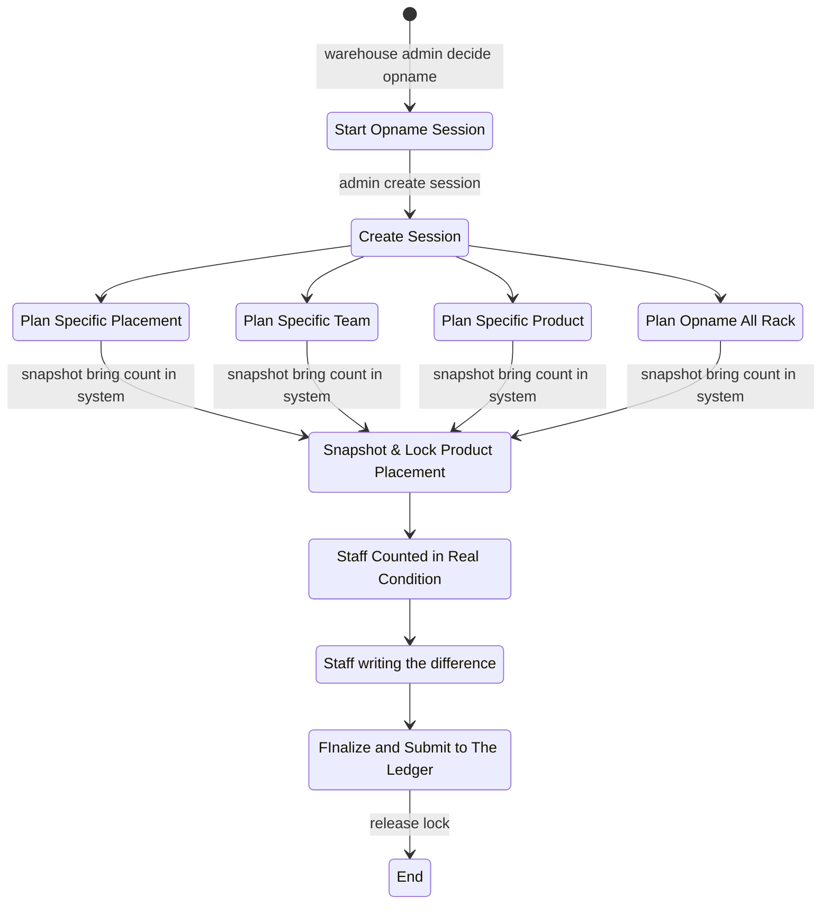

# Stock Opname Contexts.

## Table That Must have in Stock Opname.

1. Table `opname_sessions`.

    Field that must have:
    - `id` as primary key
    - `warehouse_id`

    - `created_by_id`
    - `created_at`

2. Table `session_placements`.

    Field that must have:
    - `id` as primary key
    - `placement_id`

    - `created_at`

3. Table `opname_session_snapshots`

    Field that must have:
    - `id` as primary key
    - `warehouse_id`
    - `team_id`
    - `warehouse_id`
    - `product_id`
    - `placement_id`
    
    - `system_stock_count`
    - `real_stock_count`
    - `created_at`

## Stock Opname Flow.
