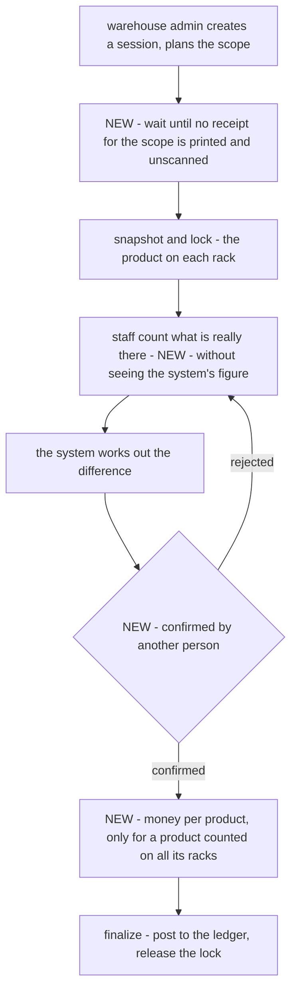
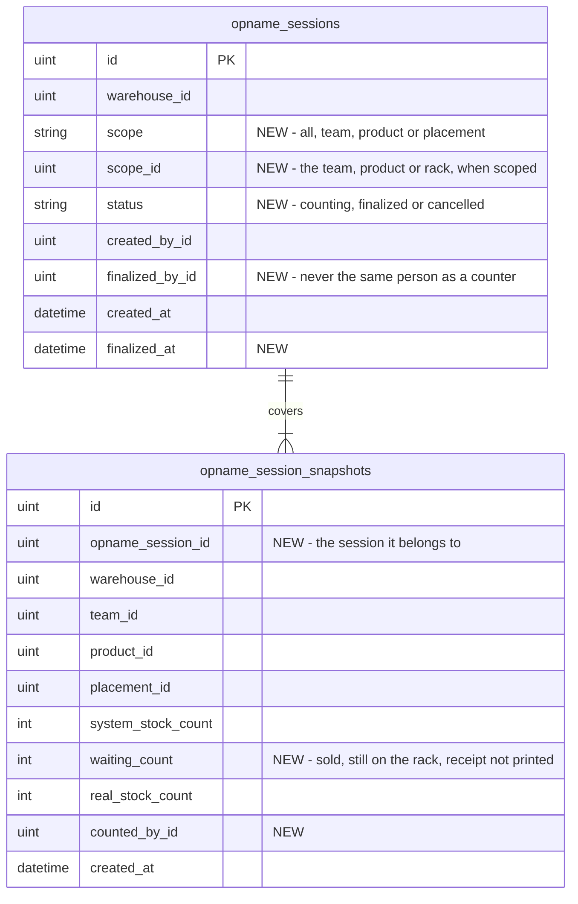
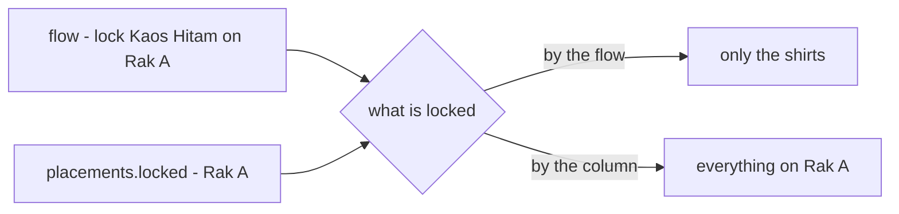

# Clarify — `inventory/opname.md`

[opname.md](./opname.md) is yours — this one is mine. An answered point is deleted; what you settle is recorded in
[opname_decision.md](./opname_decision.md).

> **Re-examined after your table and flow edits (2026-10-08).** ✅ [Q2](#question): one snapshot row per product on a rack
> ([a-snapshot-row-per-product-on-a-rack](./opname_decision.md#a-snapshot-row-per-product-on-a-rack)) · ✅ the grain of
> [Q3](#question): the lock covers the product on the rack
> ([a-count-locks-the-product-on-the-rack](./opname_decision.md#a-count-locks-the-product-on-the-rack)). 🆕 [Q10](#question):
> what the snapshot row still lacks. 🆕 [Contradiction](#the-lock-is-drawn-on-the-product-and-stored-on-the-rack): the flow
> locks the product on the rack, `placement.md` stores the lock on the rack. ⚠ `opname_session_snapshots` lists
> `warehouse_id` **twice** (lines 27 and 29).
>
> **First pass (2026-10-08)**, after §Table That Must have in Stock Opname, §Stock Opname Flow and `placements.locked`.
> Recorded: [an-opname-is-a-locked-session](./opname_decision.md#an-opname-is-a-locked-session) — it answers context Q5.
> ➡ **Re-routed here**, because this doc now answers them: context [Q4](./context_clarify.md#question) (tolerance),
> [Q11e](./context_clarify.md#question) (a whole product), [Q12](./context_clarify.md#question) (who confirms), what was
> left of context Q5 (a team asking for a count), and order [Q4](./order_clarify.md#question) (the basket).

Siblings: [context_clarify](./context_clarify.md) · [order_clarify](./order_clarify.md) · [restock_clarify](./restock_clarify.md).

---

## Proposed Design

### the session, with what I would add

Your flow, plus the four steps marked NEW.

### the tables

Yours, plus the columns marked NEW. `session_placements` goes: the snapshot rows already say which racks a session covers.

| | |
| --- | --- |
| the difference | `real_stock_count − waiting_count − system_stock_count`, worked out by the system |
| locked | a product on a rack is locked while a snapshot row of a **counting** session covers it — nothing to forget to clear |

---

## Critique

| | Problem | → Recommend |
| --- | --- | --- |
| **1** | **"Staff writing the difference"** means the counter knows the system's figure, and a counter who knows the answer tends to find it — and a shortfall is a warehouse debt. 🔄 Your new `real_stock_count` reads as *staff type what they see*; the flow still says *difference* | **staff type what they see; the system works out the difference**, and the snapshot stays hidden from the counter |
| **2** | ✅ **Answered** — `opname_session_snapshots` ([a-snapshot-row-per-product-on-a-rack](./opname_decision.md#a-snapshot-row-per-product-on-a-rack)). What the row still lacks is [Q10](#question) | — |
| **3** | **The lock has no holder.** As a yes-or-no on a row: two sessions over one product on a rack, and the first to finish unlocks it under the second. A session abandoned halfway leaves it locked for ever | the lock **is** the counting session's snapshot row; a session has a status, and **cancel releases it** like finalize does |
| **4** | ✅ **Answered** — the product on the rack is locked, not the rack ([a-count-locks-the-product-on-the-rack](./opname_decision.md#a-count-locks-the-product-on-the-rack)) | — |
| **5** | **What a lock blocks is not written.** Orders keep coming; refusing one because a rack is being counted refuses a real sale | **a lock stops units moving, not the book** — no receipt prints from it, no move, no put-away into it. `PostOrder` prefers unlocked racks and takes from a locked one only when nothing else holds the product; that receipt waits for the unlock |
| **6** | **Units already in a basket when the lock starts** — printed, lifted, not yet scanned. The count finds the rack short | wait for them before locking — [Q5](#question) |
| **7** | **One rack cannot net a wrong-rack pick.** It sees Rak B's −1 and not Rak A's +1, and charges the warehouse | money only for a product counted on all its racks — [Q6](#question) |

---

## Question

1. **Does staff type what they count, or the difference?** ([Critique 1](#critique)) 🔄 `real_stock_count` suggests the
   count. **→ Recommend: the count**, without seeing `system_stock_count` — and the flow's step renamed to match.
2. ✅ *(2026-10-08)* **Answered: `opname_session_snapshots`** —
   [a-snapshot-row-per-product-on-a-rack](./opname_decision.md#a-snapshot-row-per-product-on-a-rack).
3. **What holds the lock, and what releases it?** ([Critique 3](#critique)) The grain is decided — the product on the rack.
   **→ Recommend:** the lock is held by the counting session's snapshot row; a session is `counting`, `finalized` or
   `cancelled`, and leaving `counting` releases it. A product on a rack is in one counting session at a time.
4. **What does a lock block?** ([Critique 5](#critique)) **→ Recommend:** units moving — receipts, moves, put-away — not
   `PostOrder`'s take, which prefers unlocked racks.
5. **Units in a basket when the lock starts.** ➡ From [order Q4](./order_clarify.md#question). **→ Recommend:** the lock
   waits until no receipt in the scope is printed and unscanned — the screen lists them, *"order 9001, printed 13:00"*.
   It is minutes.
6. **When does a difference cost money?** ➡ From [context Q11e](./context_clarify.md#question). **→ Recommend:** per
   product, and only for a product counted on **all** its racks in the session — a +1 on one rack and a −1 on another
   is a move, not a debt. A one-rack plan corrects the racks and leaves the money to a whole-product count.
7. **Is there a tolerance, and can the warehouse recount?** ➡ From [context Q4](./context_clarify.md#question).
   **→ Recommend: no tolerance**, and a recount before finalize — the session is the dispute window.
8. **Who confirms a difference before it posts?** ➡ From [context Q12](./context_clarify.md#question), whose fifth part
   the lock answers (the rack waits, locked, until finalize).

   | | Part | → Recommend |
   | --- | --- | --- |
   | **8a** | which differences need a second person | **every one that moves money** — short, broken, lost and *found*, because a false *found* erases a debt. A count that matches finalizes at once |
   | **8b** | who counts, who confirms | **staff or a manager count; the warehouse's Owner or Admin finalizes** |
   | **8c** | may the finalizer be one of the counters | **no, never** — checked against the person, not the role |
   | **8d** | may Root or the root team's Administrator finalize | **yes, recorded as an override — and still never their own count** |

9. **May a selling team ask for a count of its goods?** ➡ What was left of context Q5. **→ Recommend: yes, as a request**
   the warehouse admin turns into a team-scoped session within a stated time — the team gets a check, and the warehouse
   keeps the trigger, since it bears the result.
10. 🆕 **What the snapshot row still lacks.** ([the tables](#the-tables))

    | | Part | → Recommend |
    | --- | --- | --- |
    | **10a** | **it names no session** — two sessions' rows for Rak A cannot be told apart | `opname_session_id` |
    | **10b** | **does `system_stock_count` include units sold but still on the rack?** If it is the book alone, every rack with an order waiting shows a false surplus — the ghost of [context Q11c](./context_clarify.md#question) | keep the book in `system_stock_count`, and the sold-but-unprinted units in **`waiting_count`**, both written at the snapshot |
    | **10c** | **who counted it** — [Q8c](#question) cannot check the finalizer against the counter without it | `counted_by_id` |
    | **10d** | **`session_placements` repeats the snapshot rows' racks** — and also names no session | drop it; the snapshot rows say which racks a session covers |

---

# Contradiction

## the-lock-is-drawn-on-the-product-and-stored-on-the-rack

*(2026-10-08)* Your edits put the lock in two places at two grains:

| where | says |
| --- | --- |
| [opname.md](./opname.md) §Stock Opname Flow | *"Snapshot & Lock **Product Placement**"* — one product on one rack |
| [placement.md](./placement.md) `placements` | `locked` — the **whole rack** |

Counting Kaos Hitam on Rak A then either locks every product on Rak A (the column) or only the shirts (the flow). The flow
is the newer and the decided one ([a-count-locks-the-product-on-the-rack](./opname_decision.md#a-count-locks-the-product-on-the-rack)).

**→ Recommend** drop `placements.locked`, and let the lock be the counting session's snapshot row ([Q3](#question)) — a
flag on `product_placements` instead would bring back the abandoned-session problem. Whatever holds it, one place: two
locks disagree the first time one is cleared and the other is not.

