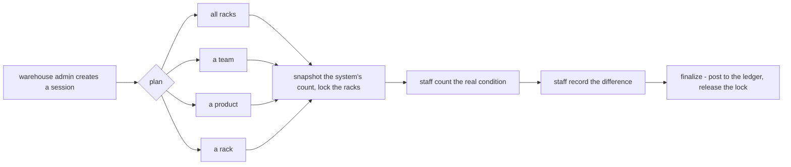
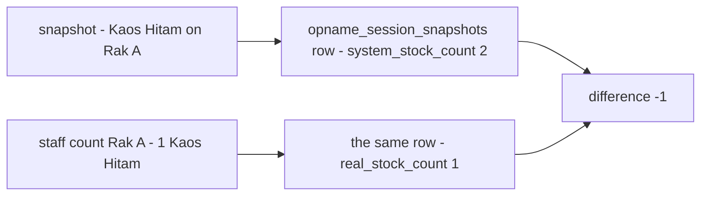
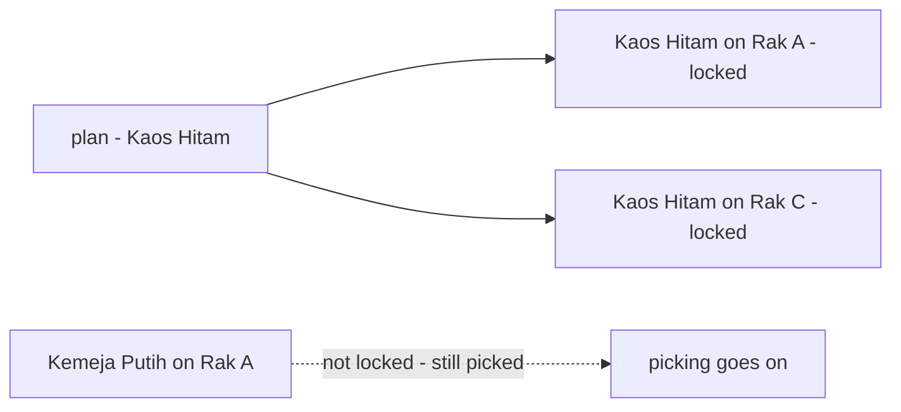

# Decisions — `inventory/opname.md`

What the owner settled, recorded before it is acted on. **Append-only** — a decision that is later reversed is renamed
and its references grepped (RULE 12), never quietly edited away. The open set is [opname_clarify.md](./opname_clarify.md).

| decision | says | from |
| --- | --- | --- |
| [an-opname-is-a-locked-session](#an-opname-is-a-locked-session) | the warehouse admin opens a session over all racks, a team, a product or a rack; it snapshots and locks, staff count, finalize posts to the ledger and releases the lock | your opname.md and `placements.locked`, 2026-10-08 — answers context Q5 |
| [a-snapshot-row-per-product-on-a-rack](#a-snapshot-row-per-product-on-a-rack) | `opname_session_snapshots` holds, per product on a rack, the system's count and the real count | your opname.md edit, 2026-10-08 — answers Q2, as recommended in shape |
| [a-count-locks-the-product-on-the-rack](#a-count-locks-the-product-on-the-rack) | the lock covers the product on the rack being counted, not the whole rack | your opname.md edit, 2026-10-08 — answers the grain half of Q3, as recommended |

---

## an-opname-is-a-locked-session

> Owner, in [opname.md](./opname.md) *(2026-10-08)* — §Table That Must have in Stock Opname and §Stock Opname Flow — and
> `placements.locked` in [placement.md](./placement.md) the same day. It gives
> [a-count-locks-its-rack](./order_decision.md#a-count-locks-its-rack) its mechanism, and answers
> [context Q5](./context_clarify.md#question) — *who may call an opname, and at what grain?* — the who as I recommended
> (the warehouse), the grain wider than I did (four plans, not only per shelf).

**The verdict.** A stock opname is a **session**. The warehouse admin decides to count and creates it, planning one of
four scopes. Planning takes a snapshot of what the system holds and locks the racks; staff count what is really there and
record the difference; finalizing posts it to the ledger and releases the lock.

**The spec.**

| | |
| --- | --- |
| who opens it | the warehouse team's admin |
| `opname_sessions` | `id` · `warehouse_id` · `created_by_id` · `created_at` |
| `session_placements` | `id` · `placement_id` · `created_at` — the racks a session covers |
| `placements.locked` | 🆕 set at the snapshot, cleared at finalize |
| scopes | all racks · a specific team · a specific product · a specific rack |
| the snapshot | the system's count at the moment of locking |
| finalize | posts the difference to the ledger — a stock transaction ([every-stock-change-belongs-to-a-transaction](./context_decision.md#every-stock-change-belongs-to-a-transaction)) |

**What it does NOT settle** — the open set is [opname_clarify.md](./opname_clarify.md): what staff type · where the
snapshot and the count are kept · what a lock blocks, and who holds it · the units in a basket at locking · when a
difference costs money, and who confirms it.

---

## a-snapshot-row-per-product-on-a-rack

> Owner, in [opname.md](./opname.md) §Table That Must have in Stock Opname *(2026-10-08)*: a third table,
> `opname_session_snapshots`, with `team_id`, `product_id`, `placement_id`, `system_stock_count` and `real_stock_count`.
> It answers [opname_clarify Q2](./opname_clarify.md#question) — *where do the snapshot and the count live?* — in the shape I
> recommended (one row per product on a rack), under your name for it.

**The verdict.** A count is kept where it is made: **one row per product on a rack**, holding what the system said at the
snapshot and what staff found. The difference is the gap between the two.

**The spec.**

| | |
| --- | --- |
| `opname_session_snapshots` | `id` · `warehouse_id` · `team_id` · `product_id` · `placement_id` · `system_stock_count` · `real_stock_count` · `created_at` |
| `system_stock_count` | written at the snapshot |
| `real_stock_count` | written when staff count |

**What it does NOT settle** — [opname_clarify Q10](./opname_clarify.md#question): the row names no session · whether
`system_stock_count` includes units sold but still on the rack · who counted it · whether `session_placements` is still
needed.

## a-count-locks-the-product-on-the-rack

> Owner, in [opname.md](./opname.md) §Stock Opname Flow *(2026-10-08)*: the step is now *"Snapshot & Lock **Product
> Placement**"*. It answers the grain half of [opname_clarify Q3](./opname_clarify.md#question) — *a product plan should
> not stop picks of the other products on the same rack* — as recommended.

**The verdict.** What a count locks is **the product on the rack** it is counting. Counting Kaos Hitam on Rak A stops
Kaos Hitam moving on Rak A; the shirts beside it can still be picked. A plan over a whole rack, or all racks, still locks
every product on it.

**The spec.**

| | |
| --- | --- |
| the lock | a `product_placements` row — one product on one rack |
| a rack or all-racks plan | locks every product on the racks it covers |
| released | at finalize, per [an-opname-is-a-locked-session](#an-opname-is-a-locked-session) |

**What it does NOT settle:** that [placement.md](./placement.md) still puts `locked` on the whole rack
([Contradiction](./opname_clarify.md#the-lock-is-drawn-on-the-product-and-stored-on-the-rack)); what holds the lock and
what releases it when a session is abandoned ([Q3](./opname_clarify.md#question)).
