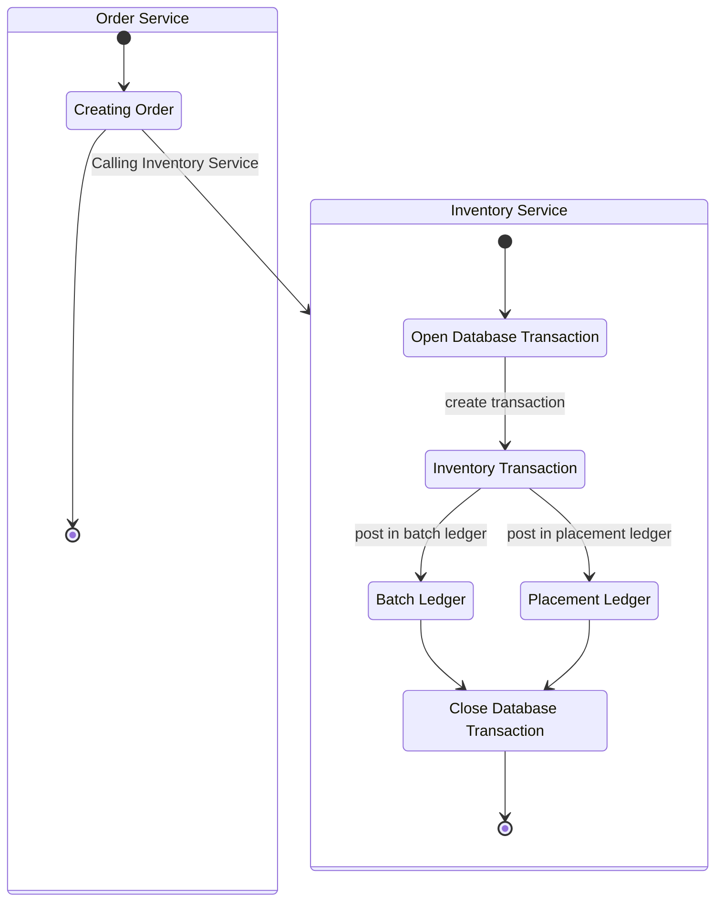
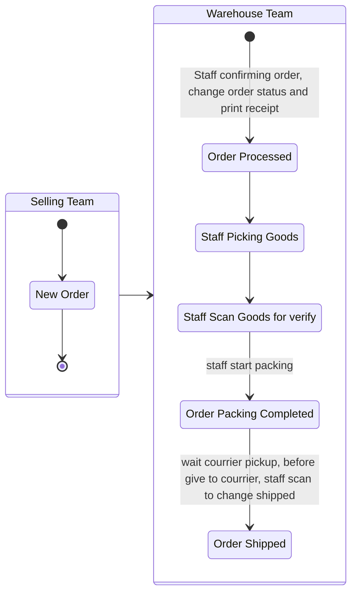

# Order & Inventory Related.

## General.
1. for order creation in Order Context. [see this](../order/order_creation.md)

## Order Created Flow.

```mermaid
stateDiagram-v2


ordsrv: Order Service
state ordsrv {
    state "Creating Order" as ocreate
    [*]-->ocreate
    ocreate-->[*]
    
}
ocreate-->invsrv: Calling Inventory Service

invsrv: Inventory Service
state invsrv {
    state "Open Database Transaction" as otx
    state "Close Database Transaction" as ctx
    state "Inventory Transaction" as itx
    state "Batch Ledger" as bleg
    state "Placement Ledger" as pleg

    [*]-->otx

    otx-->itx: create transaction
    itx-->bleg: post in batch ledger
    itx-->pleg: post in placement ledger

    bleg-->ctx
    pleg-->ctx
    
    ctx-->[*]

}

```

## How Warehouse Process The Order.

```mermaid
stateDiagram-v2
direction LR

sell: Selling Team
state sell {

    state "New Order" as nord

    [*]-->nord
    nord-->[*]

}

sell-->ware

ware: Warehouse Team
state ware {

    state "Order Processed" as confirm
    state "Staff Picking Goods" as pick
    state "Staff Scan Goods for verify" as scan
    state "Order Packing Completed" as pack
    state "Order Shipped" as shipped

    [*]-->confirm: Staff confirming order, change order status and print receipt
    confirm-->pick
    pick-->scan
    scan-->pack: staff start packing
    pack-->shipped: wait courrier pickup, before give to courrier, staff scan to change shipped
}

```

