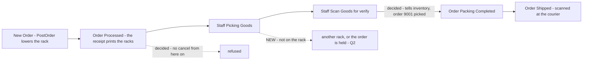
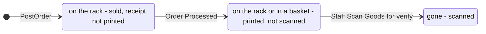
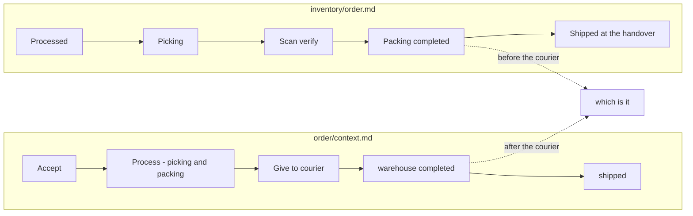

# Clarify — `inventory/order.md`

[order.md](./order.md) is yours — this one is mine. An answered point is deleted; what you settle is recorded in
[order_decision.md](./order_decision.md).

> **Re-examined after opname.md (2026-10-08).** ➡ [Q4](#question) re-routed to [opname_clarify Q5](./opname_clarify.md#question).
>
> **Re-examined after your Q4 answer (2026-10-08).** ⏸ [Q4](#question): a count **locks its rack**, to be designed in
> [opname.md](./opname.md) ([a-count-locks-its-rack](./order_decision.md#a-count-locks-its-rack)). It stays open until then — the
> units already in a basket when a lock starts are still unanswered.
>
> **Q4 elaborated (2026-10-08)**, on request — [the basket gap, worked](#the-basket-gap-worked). A count needs to know
> **printed** as well as **picked**: a unit sold but not printed is certainly on the rack, one printed but not scanned may be in
> a basket. So inventory also hears *Order Processed*, and a count waits for the printed-but-unscanned.
>
> **Re-examined after your answers in chat (2026-10-08).** ✅ [Q1](#question): the verify scan tells inventory *picked*
> ([the-verify-scan-tells-inventory-picked](./order_decision.md#the-verify-scan-tells-inventory-picked)) · ✅ [Q3](#question):
> no cancel after the warehouse confirms ([no-cancel-after-the-warehouse-confirms](./order_decision.md#no-cancel-after-the-warehouse-confirms)),
> instead of my put-back task. 🆕 [Q4](#question): the minutes a unit spends in a basket · [Q5](#question): a marketplace
> that cancels the order itself after the warehouse confirmed.

> **First pass (2026-10-08)**, after your §How Warehouse Process The Order. Its *"Staff Scan Goods for verify"* is the
> moment a unit has left the rack — the signal [context Q11c](./context_clarify.md#question) was missing — so that
> question is **re-routed here** as [Q1](#question). Two gaps in the flow are [Q2, Q3](#question), and the journey disagrees
> with the order context's ([Contradiction](#two-journeys-for-one-order)).

Siblings: [context_clarify](./context_clarify.md) · [restock_clarify](./restock_clarify.md) ·
[order_creation_clarify](../order/order_creation_clarify.md).

---

## Proposed Design

### the flow, with what inventory hears

Your steps, plus what is decided and the one branch still missing.

| step | what inventory needs from it |
| --- | --- |
| New Order | `PostOrder` — the take, at the lowest racks first ([an-order-takes-from-the-lowest-shelf-first](./context_decision.md#an-order-takes-from-the-lowest-shelf-first)) |
| Order Processed | the receipt prints each line's racks with their counts — *"Rak A × 1, Rak B × 2"* — and 🆕 inventory hears **printed**: from here the unit may be in a basket ([Q4](#question)) |
| Staff Scan Goods for verify | ✅ **picked** — from here on, the unit is no longer on the rack ([decided](./order_decision.md#the-verify-scan-tells-inventory-picked)) |
| the rest | nothing — packing and shipping move no stock |

### the basket gap, worked

[Q4](#question), told from the floor. Kaos Hitam, Rak A holds 2.

| time | what happens | the rack | the system | waiting to be picked |
| --- | --- | --- | --- | --- |
| 09:00 | order 9001 comes in | 2 | 2 → 1 | order 9001 |
| 13:00 | staff confirm it, the receipt prints *"Rak A × 1"* | 2 | 1 | order 9001 |
| 13:05 | the picker lifts the unit into a basket | **1** | 1 | order 9001 — **not scanned yet** |
| 13:07 | a count of Rak A: 1 counted − 1 waiting = 0, the system says 1 | 1 | **−1: a warehouse debt** | |
| 13:10 | the verify scan at the packing table | 1 | 0 | — |
| later | the next count finds 1 on a rack the system says is empty | 1 | +1 found | |

Nothing was lost — the unit was in a basket for five minutes. The count subtracted it as *waiting* while it was no longer
on the rack.

**The fix is to know where a sold unit can be.** Nobody picks before the receipt is printed, so the printing is the line:

| a sold unit is | so it is | the count |
| --- | --- | --- |
| sold, receipt not printed | certainly on the rack | subtracts it |
| printed, not scanned | on the rack **or** in a basket — nobody knows | **waits** for the scan |
| scanned | gone | ignores it |

So a count of Kaos Hitam starts once no Kaos Hitam receipt is printed-and-unscanned, and while it runs no new Kaos Hitam
receipt prints. Both waits are minutes. The count screen shows what it is waiting for — *"order 9001, printed 13:00,
not yet scanned"*.
---

## Critique

| | Problem | → Recommend |
| --- | --- | --- |
| **1** | ✅ **Answered** — the verify scan tells inventory *picked* ([the-verify-scan-tells-inventory-picked](./order_decision.md#the-verify-scan-tells-inventory-picked)) | — |
| **2** | **Picking has no "not there" branch.** The receipt says Rak A; Rak A is empty. The flow goes straight on to the scan | a branch, and who is told — [Q2](#question) |
| **3** | ✅ **Answered by removing the case** — no cancel after the warehouse confirms ([no-cancel-after-the-warehouse-confirms](./order_decision.md#no-cancel-after-the-warehouse-confirms)). ⚠ Except where the **marketplace** cancels on its own | [Q5](#question) |

---

## Question

1. ✅ *(2026-10-08)* **Answered: yes** — [the-verify-scan-tells-inventory-picked](./order_decision.md#the-verify-scan-tells-inventory-picked).
2. **The goods are not on the printed rack — what does the picker do?**
   **→ Recommend:** take it from another rack that holds it — the count fixes the two racks, as already decided. If **no**
   rack has it, the order is held, the selling team is told, and the empty rack is flagged for a count: a unit the book
   holds and the building does not is a shortfall in custody.
3. ✅ *(2026-10-08)* **Answered: it cannot be cancelled** — [no-cancel-after-the-warehouse-confirms](./order_decision.md#no-cancel-after-the-warehouse-confirms).
4. ➡ *(2026-10-08)* **Re-routed to [opname_clarify Q5](./opname_clarify.md#question)** — opname.md now has the lock
   ([a-count-locks-its-rack](./order_decision.md#a-count-locks-its-rack)); what is left is the units already in a basket when
   it starts. The worked story stays in [the basket gap, worked](#the-basket-gap-worked).
5. 🆕 **The marketplace cancels the order itself after the warehouse confirmed** — the buyer's request accepted on the
   platform, or a ship-by deadline missed. Our system refuses the cancel, but the courier will not take a parcel the
   platform has cancelled, so the goods are packed and going nowhere.
   **→ Recommend:** the order goes to `problem` (already in [order/context.md](../order/context.md)'s journey), and a staff
   member **unpacks it back onto a rack**, which reverses the take. It is rare, and it is the one case a put-back has to
   exist for. Put back on a different rack, the count fixes it.

---

# Contradiction

## two-journeys-for-one-order

*(2026-10-08)* The same order's warehouse steps are drawn twice, and they disagree:

| | [order/context.md](../order/context.md) §Complete Journey Of The Orders | [order.md](./order.md) §How Warehouse Process The Order |
| --- | --- | --- |
| first step | *"Warehouse Accept Order"* | *"Order Processed"* — confirm, change status, print the receipt |
| the work | *"Warehouse Process Order (Packing/Picking)"* — one step | picking · scan to verify · packing — three |
| when the warehouse is done | *"set status warehouse process `completed`"* — **after** *"Give to Shipping Channel"* | *"Order Packing Completed"* — **before** the courier comes |
| shipped | set after the warehouse is done | *"staff scan to change shipped"*, at the handover |

So while a parcel waits for the courier, one doc says the warehouse is done and the other says it is not.

**→ Recommend** one journey, kept where the statuses belong — [order/context.md](../order/context.md), since they are the
order's statuses — and this doc links it and adds only what inventory hears (the table above). Two copies of a status list
drift every time one is edited.

