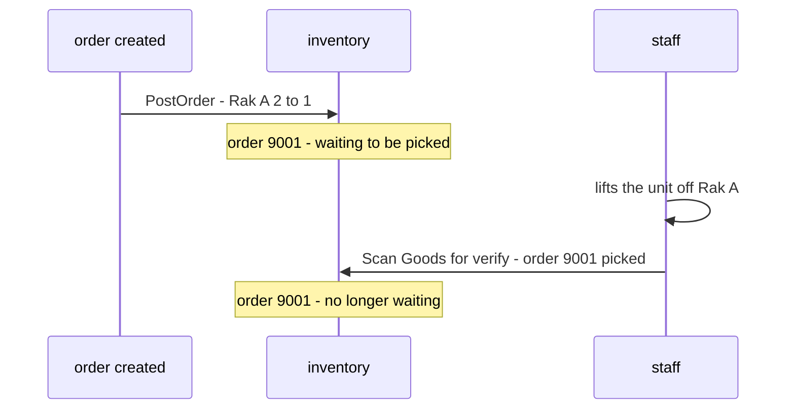
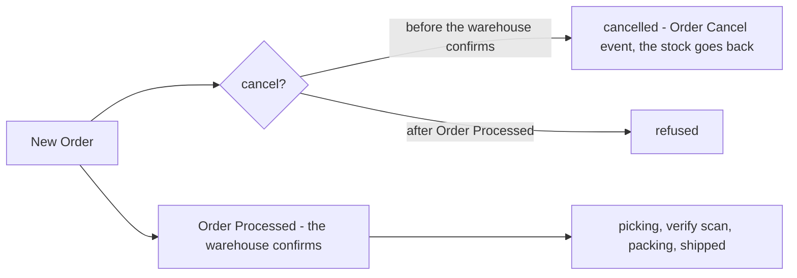
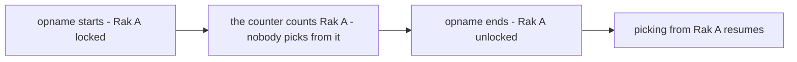

# Decisions — `inventory/order.md`

What the owner settled, recorded before it is acted on. **Append-only** — a decision that is later reversed is renamed
and its references grepped (RULE 12), never quietly edited away. The open set is [order_clarify.md](./order_clarify.md).

| decision | says | from |
| --- | --- | --- |
| [the-verify-scan-tells-inventory-picked](#the-verify-scan-tells-inventory-picked) | *Staff Scan Goods for verify* tells inventory the order is picked; a count subtracts the sold units not yet scanned | chat, 2026-10-08 — answers Q1, as recommended |
| [no-cancel-after-the-warehouse-confirms](#no-cancel-after-the-warehouse-confirms) | once the warehouse confirms an order (*Order Processed*), it can no longer be cancelled | chat, 2026-10-08 — answers Q3, against my put-back task |
| [a-count-locks-its-rack](#a-count-locks-its-rack) | the basket gap is solved inside stock opname: a rack being counted is locked; [opname.md](./opname.md) will say how | chat, 2026-10-08 — answers Q4's direction, instead of my wait-for-the-scan rules |

---

## the-verify-scan-tells-inventory-picked

> Owner, in chat *(2026-10-08)*: *"for q1, yes"*. The question was [order_clarify Q1](./order_clarify.md#question) —
> *does the verify scan tell inventory the order is picked?* — re-routed from
> [context Q11c](./context_clarify.md#question).

**The verdict.** The scan that verifies the goods is the moment a unit has left the rack, so it is the moment inventory
learns the order is **picked**. Until then, a sold unit may still be on the rack — and a stock count needs to know that,
or it adds the sold unit back and makes a ghost that is sold again and never found
([PostOrder, worked](./context_clarify.md#postorder-worked)).

**The spec.**

| | |
| --- | --- |
| the signal | *Staff Scan Goods for verify* sends inventory *"order 9001 picked"* — the goods are scanned, **not** the rack ([a-wrong-rack-pick-waits-for-the-count](./context_decision.md#a-wrong-rack-pick-waits-for-the-count) stands) |
| waiting to be picked | an order's take with no *picked* yet |
| a stock count | compares **counted − waiting** against the book, and its screen shows *"1 here is sold, waiting for the picker"* |
| idempotent | a second *picked* for the same order changes nothing |

**What it does NOT settle:** the few minutes a unit spends in a basket between the lift and the scan
([Q4](./order_clarify.md#question)); how the scan reaches inventory — an RPC or an event — and in what record inventory
keeps it ([context Q13](./context_clarify.md#question) proposes a `pick` transaction carrying the order's `ref_id`).

## no-cancel-after-the-warehouse-confirms

> Owner, in chat *(2026-10-08)*: *"for q3, order cannot cancel after warehouse confirm that"*. The question was
> [order_clarify Q3](./order_clarify.md#question) — *an order cancelled after its receipt is printed: who puts the goods
> back?* — answered by removing the case, **instead of** my put-back task.

**The verdict.** The warehouse's confirmation — *Order Processed*: the staff confirm the order, change its status and
print the receipt — is the point of no return. Before it, an order may be cancelled and its stock goes back by the Order
Cancel event ([inventory-returns-stock-on-order-cancelled](../order/context_decision.md#inventory-returns-stock-on-order-cancelled)).
After it, a cancel is refused — so a unit never has to find its way back from a basket or a parcel. It agrees with
[order/context.md](../order/context.md)'s journey, where the cancel branch comes before *"Warehouse Accept Order"*.

**The spec.**

| | |
| --- | --- |
| cancellable | from *New Order* until *Order Processed* |
| after *Order Processed* | the order service refuses the cancel |
| inventory | releases stock only for an order cancelled before confirmation — never from a basket or a parcel |

**What it does NOT settle:** a marketplace that cancels the order **itself** after the warehouse confirmed — the buyer's
request accepted on the platform, or a ship-by deadline missed — where refusing in our system does not stop the courier
refusing the parcel ([Q5](./order_clarify.md#question)).

## a-count-locks-its-rack

> Owner, in chat *(2026-10-08)*: *"for that case i will explain opname in opname.md, we create something that rack can
> locked"*. The question was [order_clarify Q4](./order_clarify.md#question) — *a count in the minutes a unit sits in a
> basket charges the warehouse for nothing* — answered with a **direction**, instead of my two waits (the count waits for
> printed-unscanned orders, new receipts wait for the count).

**The verdict.** Stock opname gets a **lock on the rack** being counted. While it is locked, the rack is the counter's:
picking from it stops, so the count is a statement about a rack nobody is changing. The design — what the lock blocks,
when it starts and ends — is the owner's to write in [opname.md](./opname.md).

**The spec.** Only the direction — the rest waits for [opname.md](./opname.md):

| | |
| --- | --- |
| what is locked | a rack, for the length of its count |
| what a lock is for | no unit leaves or arrives while it is counted |

**What it does NOT settle** — kept open in [order_clarify Q4](./order_clarify.md#question) until opname.md answers it: what
the lock blocks (new orders choosing the rack, receipts already printed for it, moves, put-away) · the units **already**
in a basket when the lock starts · and whether a product is counted on all its racks at once, which a wrong-rack pick
needs ([context Q11e](./context_clarify.md#question)).
