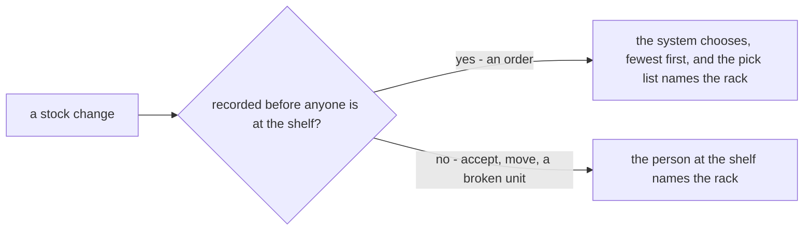
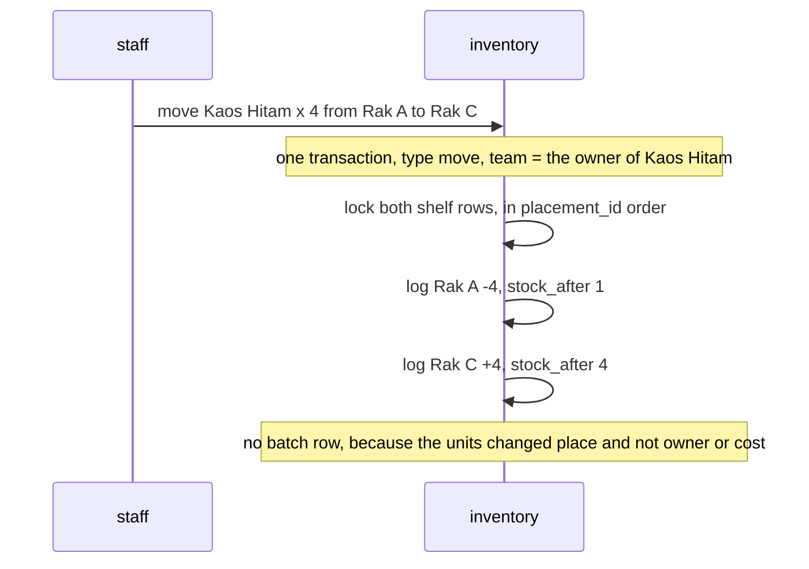
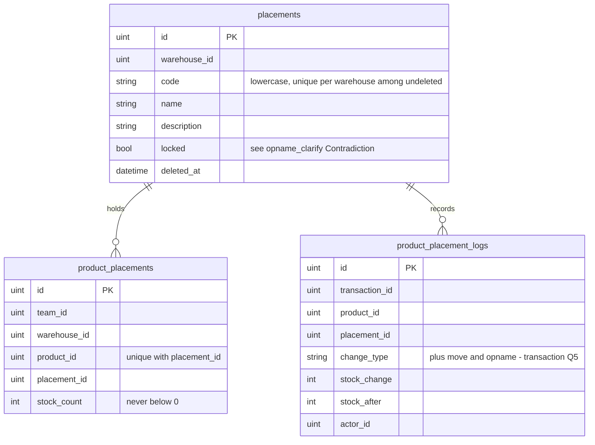

# Clarify — `inventory/placement.md`

[placement.md](./placement.md) is yours, and this file is mine. When a point is answered I delete it here, and your
answer goes in [placement_decision.md](./placement_decision.md).

> ✅ **Answered 2026-10-10 and deleted:** Q6, both rules —
> [a-shelf-never-goes-below-zero](./placement_decision.md#a-shelf-never-goes-below-zero) and
> [rack-codes-are-saved-lowercase](./placement_decision.md#rack-codes-are-saved-lowercase) (lowercase, against my uppercase).
>
> **First pass (2026-10-09).** Your three tables hold up, and I am adding no columns. What placement.md does not say
> yet is the **rules**: §Placement Ledger Mutation covers `PostOrder` and nothing else. ➡ **Moved here:**
> [context Q11d](./context_clarify.md#question) is now [Q2](#question), and
> [context Critique 12](./context_clarify.md#critique) is now [3d](#question).

Siblings: [context_clarify](./context_clarify.md) · [opname_clarify](./opname_clarify.md) ·
[transaction_clarify](./transaction_clarify.md) · [order_clarify](./order_clarify.md) ·
[restock_clarify](./restock_clarify.md).

---

## Already decided

| decision | says |
| --- | --- |
| [one-shelf-row-per-product-per-placement](./context_decision.md#one-shelf-row-per-product-per-placement) | one row per product per rack · a code is unique among the warehouse's undeleted racks |
| [a-placement-deletes-only-when-nothing-waits-on-it](./context_decision.md#a-placement-deletes-only-when-nothing-waits-on-it) | a rack can be deleted only at 0 stock, and only when no sold unit on it is still waiting for the picker |
| [an-order-takes-from-the-lowest-shelf-first](./context_decision.md#an-order-takes-from-the-lowest-shelf-first) | `PostOrder` takes from the rack holding the fewest first |
| [a-wrong-rack-pick-waits-for-the-count](./context_decision.md#a-wrong-rack-pick-waits-for-the-count) | no rack scan; the next count corrects a pick from the wrong rack |
| [there-is-no-unplaced-pile](./restock_decision.md#there-is-no-unplaced-pile) | every unit is on a placement; a staging area is just another placement |
| [batches-lock-before-shelves-by-id](./context_decision.md#batches-lock-before-shelves-by-id) | batches are locked first, then shelves, each in id order |
| [the-verify-scan-tells-inventory-picked](./order_decision.md#the-verify-scan-tells-inventory-picked) | a sold unit counts as waiting on the rack until the verify scan |
| [a-count-locks-the-product-on-the-rack](./opname_decision.md#a-count-locks-the-product-on-the-rack) | a count locks one product on one rack, not the whole rack |
| [a-shelf-never-goes-below-zero](./placement_decision.md#a-shelf-never-goes-below-zero) | `stock_count` is never below 0, checked by the database; an order that would take it below fails, and order creation returns the error |
| [rack-codes-are-saved-lowercase](./placement_decision.md#rack-codes-are-saved-lowercase) | a rack code is trimmed and lowercased when saved |

## Placement questions filed elsewhere

Each one stays in the doc that can answer it.

| question | lives in |
| --- | --- |
| `placements.locked` versus the lock on the product | [opname_clarify — Contradiction](./opname_clarify.md#the-lock-is-drawn-on-the-product-and-stored-on-the-rack) |
| what a count's lock blocks, including `PostOrder` | [opname_clarify Q4](./opname_clarify.md#question) |
| a `move` and an `opname` type | [transaction_clarify Q5](./transaction_clarify.md#question) |
| shelves and batches must count the same units | [context Q14a](./context_clarify.md#question) |
| does a shelf row know its batch, so picking can follow expiry | [context Q7](./context_clarify.md#question) |
| the heading's word *Mutation* | [context — Contradiction](./context_clarify.md#mutation-means-two-layers) |

---

## Proposed Design

### who chooses the rack

**The system chooses only when the act is recorded before anyone is standing at the shelf.** Otherwise the person at
the shelf names the rack, because they are the one looking at it.

| operation | `change_type` | who names the rack | rule |
| --- | --- | --- | --- |
| order | `order` | the system | fewest first ✅ · a line split over racks: [Q2](#question) |
| restock or return accept | `restock` · `return` | staff, at accept | one line may go to several racks, and together they hold exactly the good units (already in the prototype) |
| move | 🆕 `move` | staff | from rack to rack: [Q3](#question) |
| broken, lost or found on a rack | `adjustment` | staff | the rack where it happened |
| count | 🆕 `opname` | the session | per snapshot row |
| transfer out | `transfer_out` | the system | ✅ fewest first, at create — [a-transfer-takes-from-the-sender-at-create](./warehouse_transfer_decision.md#a-transfer-takes-from-the-sender-at-create) |
| sample | `sample` | ❓ | [Q1](#question) |
| transfer in | `transfer_in` | staff, at receipt | same as accept |
| undo | the original's type | nobody | the original's log rows with the sign flipped ([transaction Q3](./transaction_clarify.md#question)) |

### a move, written

### the tables, unchanged

---

## Critique

| | Problem | → Recommend |
| --- | --- | --- |
| **1** | **One rule for seven kinds.** §Placement Ledger Mutation covers `PostOrder`, but `change_type` lists seven kinds of change, and each one has to say which rack it uses. | Use the principle in [who chooses the rack](#who-chooses-the-rack), and give placement.md one line per operation |
| **2** | **There is no move**, and a move is the only act that touches placements and nothing else. Without a recorded move, reshelving shows up at the next count as a loss on one rack and a find on another, and a loss is the warehouse's debt. A rack can only be deleted at 0, so emptying one also needs a move | [Q3](#question) |
| **3** | **`stock_count` is not what is physically on the shelf.** `PostOrder` lowers it when the order is created, but the unit only leaves at the verify scan. So Rak A can read 1 while 2 units are still on it | Treat `stock_count` as *on the rack and not sold*, and have the screen show what is physically there: [Q4](#question) |
| **4** | **No screen is named.** HARD RULE 6 orders the design jobs → screens → API, and placement has jobs (set up racks, look at a rack, move goods) but no screens yet | [Q5](#question) |

---

## Question

1. 🔄 *(2026-10-10)* **Sample: which rack?** ✅ The transfer-out half is decided — the system picks fewest first, at create
   ([a-transfer-takes-from-the-sender-at-create](./warehouse_transfer_decision.md#a-transfer-takes-from-the-sender-at-create)). What is left is the sample. ([Critique 1](#critique))
   **→ Recommend:** it depends on how they are requested. If the selling team asks ahead (a sample for a buyer, stock
   sent to another warehouse), the request works exactly like an order: the system picks fewest first and prints a pick
   list. If the warehouse does it on the spot at the shelf, staff name the rack. I expect both are asked ahead, so the
   system chooses. *Who asks for a sample here?* Who pays for it is [transaction Q6](./transaction_clarify.md#question).

2. ➡ *(moved from [context Q11d](./context_clarify.md#question))* **An order line bigger than the smallest rack.**
   3 wanted; Rak A holds 1, Rak B 2, Rak C 5.

   | | takes | racks visited | racks emptied |
   | --- | --- | --- | --- |
   | **your rule, fewest first** | 1 from A, 2 from B | 2 | **2** |
   | all from one rack | 3 from C | 1 | 0 |

   **→ Recommend: keep your rule as written.** The pick list says *"Rak A × 1, Rak B × 2"*. If two racks hold the same
   amount, the smaller id goes first. If all racks together hold too few, `PostOrder` fails and writes nothing. *Is it
   OK for one order line to come from two racks?*

3. **A move: what it writes, and who may do it.** ([Critique 2](#critique))

   | | Part | → Recommend |
   | --- | --- | --- |
   | **3a** | the record | one transaction of type `move`; each product gets two log rows (minus on the old rack, plus on the new one) and no batch row ([a move, written](#a-move-written)) |
   | **3b** | who | any member of the warehouse team, the same as accept. Each row carries the actor |
   | **3c** | many products at once, e.g. *"empty Rak A into Rak C"* | one action that writes **one transaction per owning team**, because a transaction carries one `team_id` |
   | **3d** | putting goods away at accept | **not a move.** It is part of the accept's own log rows. Only a later re-shelving is a move (moved from context Critique 12) |
   | **3e** | where the move happens on screen | an action on the rack's page (a dialog: product, quantity, target rack), not a page of its own ([Q5](#question)) |

4. **What does the rack screen show?** ([Critique 3](#critique)) Rak A: the book says 1, one sold unit is waiting for the
   picker, so 2 are physically there.
   **→ Recommend:** show the **physical** count as the big number (*"2 on the rack"*) with *"1 sold, waiting for the
   picker"* under it. Whoever reads a rack's screen is standing at that rack, and a screen that disagrees with what they
   can see is a screen they stop trusting. The selling team never reads a rack: it reads the product total, which is the
   book. `stock_count` stays the book, and the physical count is the book plus the sold units not yet scanned.

5. **Which screens, and which come first?** ([Critique 4](#critique))

   | job | who | screen |
   | --- | --- | --- |
   | set up racks | warehouse admin | **Placements**: a list, plus create, edit and delete |
   | see what is on a rack | staff | **Placement detail**: its products with counts ([Q4](#question)) and its log |
   | move goods | staff | **Move**: an action on Placement detail ([3e](#question)) |
   | find where a product is | staff, picker | a section on the product's warehouse page |
   | put goods away at accept | staff | ✅ already in restock-accept |

   **→ Recommend:** build the list, the detail and the move first. The product section ships with the product page.

---

# Contradiction

placement.md has **no new contradictions of its own**. Three found earlier touch it, and each is recorded where it was
found:

- [the-lock-is-drawn-on-the-product-and-stored-on-the-rack](./opname_clarify.md#the-lock-is-drawn-on-the-product-and-stored-on-the-rack): the lock is on the product in opname.md and on the whole rack in `placements.locked`
- [mutation-means-two-layers](./context_clarify.md#mutation-means-two-layers): the heading should read *Placement Ledger*
- [the-two-type-lists-do-not-line-up](./transaction_clarify.md#the-two-type-lists-do-not-line-up): `change_type` has no `move` and no `opname`
