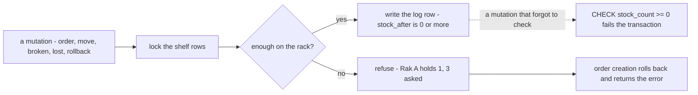
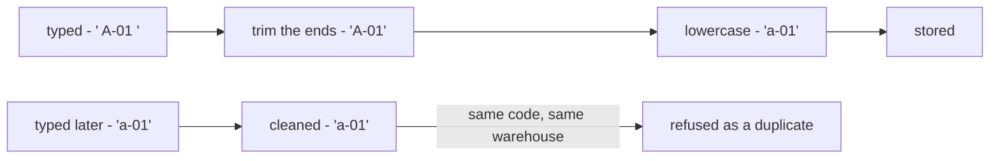

# Decisions — `inventory/placement.md`

What the owner settled, recorded before it is acted on. **Append-only** — a decision that is later reversed is renamed
and its references grepped (RULE 12), never quietly edited away. The open set is [placement_clarify.md](./placement_clarify.md).

| decision | says | from |
| --- | --- | --- |
| [a-shelf-never-goes-below-zero](#a-shelf-never-goes-below-zero) | `stock_count` is never below 0, checked by the database; a take that would go below is refused, and order creation returns the error | chat, 2026-10-10 — answers placement Q6a, as recommended |
| [rack-codes-are-saved-lowercase](#rack-codes-are-saved-lowercase) | a rack code is trimmed and lowercased when saved, so one label has one spelling | chat, 2026-10-10 — answers placement Q6b, **against** my uppercase |

---

## a-shelf-never-goes-below-zero

> Owner, in chat *(2026-10-10)*: *"for 6a, yes, in order creation, its return error"*. It answers
> [placement_clarify Q6a](./placement_clarify.md#question) — *is `stock_count` never below 0, enforced by the database?* —
> as recommended, and says what the selling team gets when an order is refused: **the error, from order creation**.

**The verdict.** A shelf never holds fewer than zero. A change that would take it below zero is refused, and nothing is
written. When the change is an order's take, the order is not created: order creation rolls back and returns the error.

**The spec.**

| | |
| --- | --- |
| `product_placements.stock_count` | `CHECK (stock_count >= 0)` — the backstop: a future mutation that forgets to check fails instead of writing −1 |
| the mutation | locks the shelf rows ([batches-lock-before-shelves-by-id](./context_decision.md#batches-lock-before-shelves-by-id)), compares, and refuses with an error naming the rack and what it holds — before the database check would fire |
| `PostOrder`, too few across all racks | fails and writes nothing; [order creation](../order/order_creation.md) rolls back its own transaction and **returns the error** to the caller |
| a move · broken or lost · a rollback | refused the same way |
| a count | unaffected — it writes the real number, which is never negative |
| `product_placement_logs.stock_after` | 0 or more, as a consequence |

**What it does NOT settle** — the batch side: the same check on `batches.stock_count` belongs to
[batch.md](./batch.md), and sits with [context Q14a](./context_clarify.md#question) · whether a rollback that would go below
zero is refused, or corrected some other way — the rack half is now forced, the batch half is
[transaction Q4](./transaction_clarify.md#question).

## rack-codes-are-saved-lowercase

> Owner, in chat *(2026-10-10)*: *"for 6b, no, make always lowercase"*. It answers
> [placement_clarify Q6b](./placement_clarify.md#question) — *are codes compared after trimming spaces and ignoring case?* —
> by cleaning the code when it is saved, as I offered, but **lowercase, against my uppercase**.

**The verdict.** One label painted on one shelf has one spelling in the system. A code is cleaned once, when it is saved,
so every screen, pick list and lookup reads the same text, and a plain `=` compares it.

**The spec.**

| | |
| --- | --- |
| on save (create, edit) | trim the ends, then lowercase |
| on lookup (a search, a typed code) | the input is cleaned the same way, then compared with plain `=` |
| unique | `(warehouse_id, code)` among racks with no `deleted_at` — a plain index, because the stored value is already clean |
| backstop | `CHECK (code = lower(btrim(code)))`, so a writer that skips the cleaning fails instead of storing a second spelling |
| shown | as stored — `a-01` |
| untouched | the inner characters: `a 01`, `a-01` and `a01` stay three codes, because the painted label is the label · `name`, which is free text |

**What it does NOT settle** — ⚠ the build today stores codes as typed, with a case-sensitive index. Moving to this rule
lowercases the existing codes, and two that differ only by case (`A-01` and `a-01` in one warehouse) collide: they must be
merged or renamed before the migration runs.
