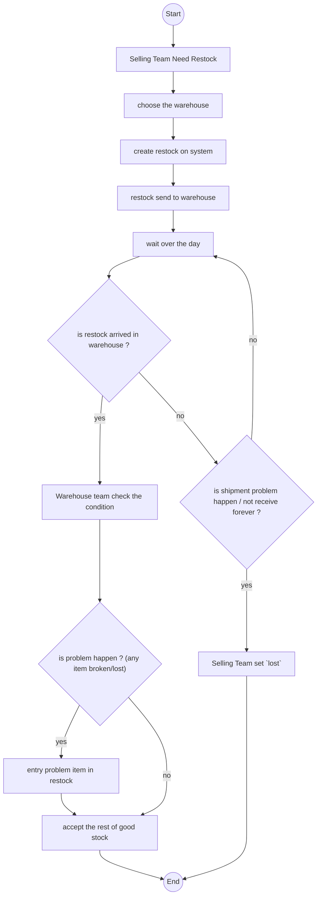
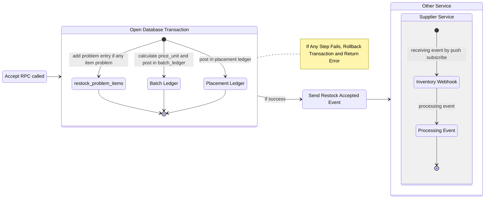

# Restock Related.

## Restock Flow.

## Restock Accepted Flow.
1. for what case that `supplier_service` listen restock accept, [see supplier context](../supplier/context.md)

## Table Should We Have.

First for restock:

1. Table `restocks`

    Field that must have:
    - `id` as primary key
    - `warehouse_id`
    - `team_id`
    - `status`, it has `ongoing`, `arrived`, `accepted`, `lost` and `cancel`
    - `shipment_cost`
    - `warehouse_additional_cost`
    - `subtotal`
    - `total`
    - `updated_at`
    - `created_at`

2. Table `restock_items`

    Field that must have:
    - `id` as primary key
    - `restock_id`
    - `product_id`
    - `supplier_channel_id`, its optionals

    - `count`
    - `price_unit`
    
    - `total`

3. Table `restock_problem_items`

    Field that must have:
    - `id` as primary key
    - `restock_id`
    - `product_id`

    - `supplier_channel_id`, its optionals

    - `problem_type`

    - `count`
    - `price_unit`
    - `total`
    - `created_at`

    Field `problem_type` is contain:
    - `broken`
    - `lost`
