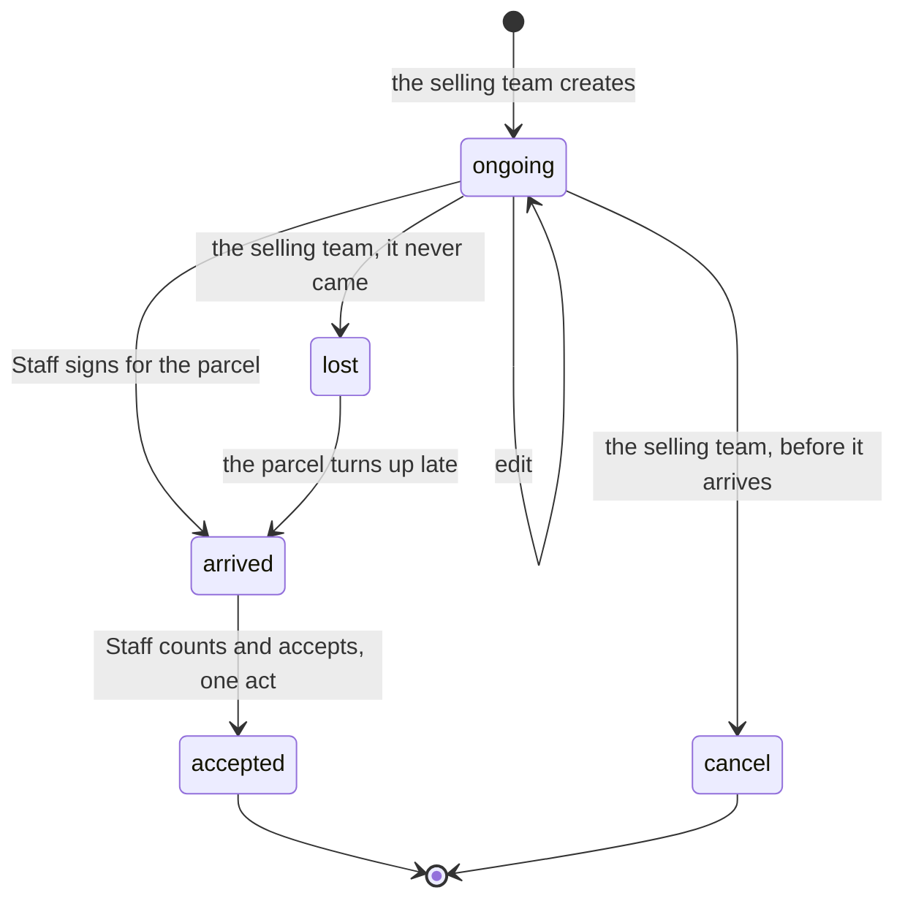
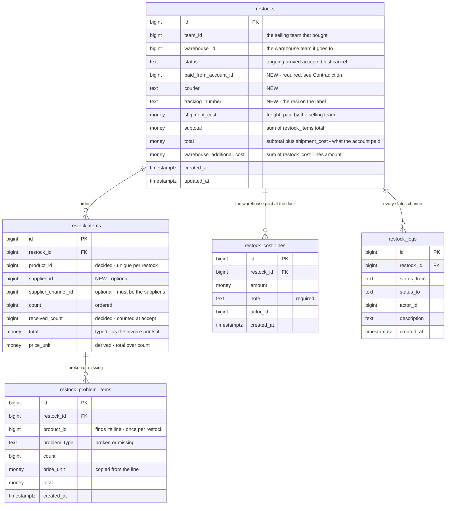
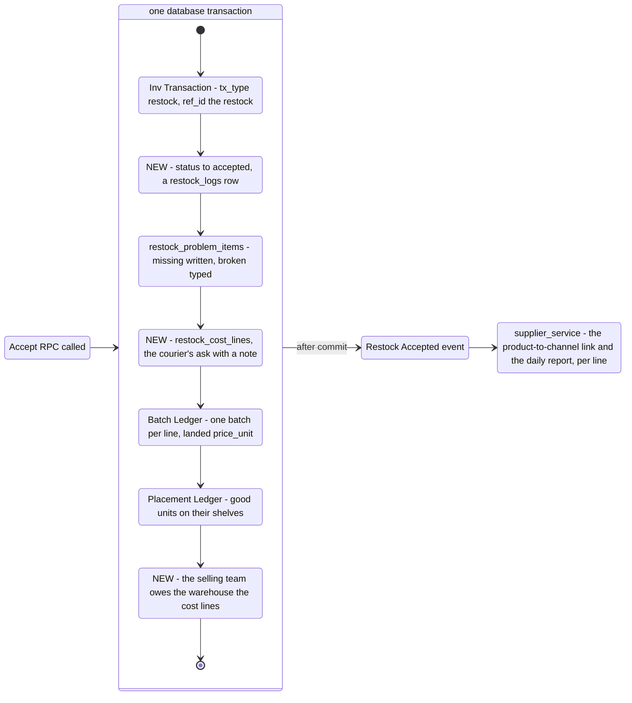
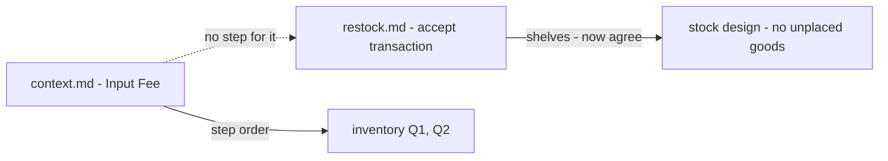
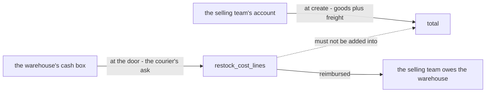
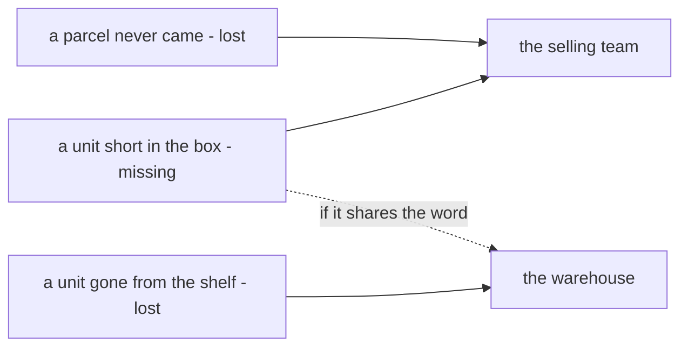

# Clarify — `inventory/restock.md`

[restock.md](./restock.md) is yours — this one is mine. An answered point is deleted; what you settle is recorded in
[restock_decision.md](./restock_decision.md).

> **Re-examined after your transaction edit (2026-10-08).** Accept now *gets* an inventory transaction before it writes
> anything ([every-stock-change-belongs-to-a-transaction](./context_decision.md#every-stock-change-belongs-to-a-transaction)).
> `restocks.transaction_id` points the restock at it, so [Critique 12](#critique) is answered for one accept, and
> [Q11b](#question) moves to [context Q13a](./context_clarify.md#question): a restock with a second transaction. Whether
> accept gets or creates it is [context Q13b](./context_clarify.md#question).
>
> **Re-examined after your answers in chat (2026-10-07).** ✅ **Closed:** [Q6a](#question) and [Q12](#question), both as
> recommended. Any warehouse member counts what arrived and what is broken
> ([any-warehouse-member-counts-what-arrived](./restock_decision.md#any-warehouse-member-counts-what-arrived)), and a
> product appears once per restock ([a-product-appears-once-per-restock](./restock_decision.md#a-product-appears-once-per-restock)).
> [Critique 5, 6](#critique) close with them. Product's answer puts the courier's ask **in** the price
> ([the-couriers-ask-is-in-the-unit-price](../product/context_decision.md#the-couriers-ask-is-in-the-unit-price)), so
> [Q10b](#question) narrows: the price reads the cost lines, so the cost lines must be inside the transaction.
>
> **Re-examined after supplier's soft delete (2026-10-07)** — a deleted supplier stays readable ([a-deleted-supplier-is-kept-for-its-figures](../supplier/context_decision.md#a-deleted-supplier-is-kept-for-its-figures)).
> [Critique 2](#critique) loses its main case, and [Q1](#question)'s recommendation moves to **no snapshot**.
>
> **Re-examined after supplier.md §Supplier Rule (2026-10-07)** — *"its choose per product in restock. we talk further
> in restock"*. Per product, or per line? It opens [Q12](#question): may one restock carry a product twice.
>
> **Re-examined after your supplier edit (2026-10-07).** supplier.md §How We Seed answers [Q10a](#question) as
> recommended — the event writes the product-to-channel link
> ([restock-accepted-links-the-product-to-its-channel](../supplier/context_decision.md#restock-accepted-links-the-product-to-its-channel)).
> Its new daily report also feeds on this event, so my [Q10c](#question) *no price* is revised: the event carries each
> line's price and its problem counts.
>
> **Re-examined after your §Restock Accepted Flow (2026-10-06).** Accept is one transaction — problem rows, a batch
> with its computed price, the placement ledger — and a *Restock Accepted* event to `supplier_service` after commit.
> Recorded as [accept-is-one-transaction-then-an-event](./restock_decision.md#accept-is-one-transaction-then-an-event).
> It settles the shelf half of [two-drawings-of-receiving](#two-drawings-of-receiving) and opens [Q10, Q11](#question):
> who hears the event, and what accept writes into the two ledgers.
>
> **First full pass — the same day**, read against your edit that put `supplier_channel_id` on the lines
> ([a-line-names-the-channel-it-was-bought-from](./restock_decision.md#a-line-names-the-channel-it-was-bought-from)).
> The two questions moved here from supplier are re-asked against it as [Q1, Q2](#question).

## What restock.md settles

| | |
| --- | --- |
| who | the selling team creates · the warehouse checks and accepts · the selling team sets `lost` |
| the record | `restocks` → `restock_items` (what was ordered) → `restock_problem_items` (`broken` · `lost`) |
| the lifecycle | five statuses — `ongoing` `arrived` `accepted` `lost` `cancel` |
| good units | not stored — by my reading, `count − Σ problem counts` |
| accept | ✅ one database transaction: problem rows · a batch, its `price_unit` computed · the placement ledger — then *Restock Accepted* to `supplier_service` |
| the door count | ✅ any warehouse member types `received_count` and broken per line; short = `count − received_count` |
| a product | ✅ once per restock |
| the courier's ask | ✅ in the batch's `price_unit` — product's [the-couriers-ask-is-in-the-unit-price](../product/context_decision.md#the-couriers-ask-is-in-the-unit-price) |

**What it changes in the build** — the build is a reference here, not an argument:

| built — `restock_requests` | restock.md |
| --- | --- |
| `pending` · `fulfilled` · `cancelled` | 🆕 `arrived` and `lost` — the parcel at the door, and the parcel that never came |
| one `supplier_id` on the restock | a channel per **line**, optional |
| a line's **total** typed | `price_unit` and `total` |
| `received_quantity` + damaged rows with a reason | problem rows, no reason |
| warehouse cost **lines**, each with a note, owed in the accept's transaction | one number, `warehouse_additional_cost` — and no step in the accept |
| resi, courier, order ref, payment type, note | gone — ⚠ the resi is [Q7](#question) |
| shelves per line · a timeline, actors | the placement ledger ✅ · the trail is gone — [Q9](#question) |
| no event | 🆕 *Restock Accepted*, heard by `supplier_service` |

## Critique

| # | Problem | → Recommend |
| --- | --- | --- |
| **1** | **A restock from a physical vendor names nobody.** A line reaches its supplier only through `supplier_channel_id`, and a supplier selling from a stall has no channel ([the-supplier-lists-only-its-online-stores](../supplier/context_decision.md#the-supplier-lists-only-its-online-stores)). | `restock_items.supplier_id` beside the channel, both optional — [Q3](#question) |
| **2** | 🔄 *(2026-10-07)* **A deleted supplier no longer blanks the line** — its delete is soft ([a-deleted-supplier-is-kept-for-its-figures](../supplier/context_decision.md#a-deleted-supplier-is-kept-for-its-figures)). A deleted **store** no longer does either — [a-store-delete-is-soft-too](../supplier/context_decision.md#a-store-delete-is-soft-too). | no snapshot — [Q1](#question) |
| **3** | **A restock with lines from two stores arrives as two parcels.** Two Shopee stores ship separately, at different times, but the flow asks *is restock arrived?* once, for all of it. | **a restock is one parcel** — [Recommendation](#recommendation), [Q4](#question) |
| **4** | **`arrived` and `cancel` are statuses no arrow sets.** Nor does the flow say whether `lost` may be set on a parcel the warehouse already signed for, or what happens when a `lost` parcel turns up. | the [state diagram](#lifecycle) — [Q5](#question) |
| **5** | ✅ **Answered** — `received_count` is typed per line, and the short units are the difference ([any-warehouse-member-counts-what-arrived](./restock_decision.md#any-warehouse-member-counts-what-arrived)). An over-delivery is still unwritten | [Q6d](#question) |
| **6** | ✅ **Answered by [Q12](#question)** — a product is once per restock, so the problem row's `product_id` finds its line. Its price can still disagree with the line's | price copied, never typed — [Q6b](#question) |
| **7** | **`count × price_unit` is not what the invoice says.** *3 pcs Rp 10.000* is Rp 3.333,33 a piece: a rounded price makes `total` disagree with what was paid. | the person types the line's `total`; `price_unit` is derived — [Q8](#question) |
| **8** | **The warehouse cannot find the restock a parcel belongs to.** The parcel's label carries a tracking number (resi). `restocks` has none, so *check on the system* is a search of every open restock by product. | `tracking_number` and `courier` on `restocks` — [Q7](#question) |
| **9** | **Nobody is named and nothing is timed.** No creator, and no actor or time on `arrived`, `accepted`, `lost`, `cancel` — yet the restock lists filter by them ([a-who-filter-lists-the-people-on-its-rows](../user/context_decision.md#a-who-filter-lists-the-people-on-its-rows)), and a supplier's lead time needs *arrived at*. | `restock_logs`, the shape of your `batch_logs` — [Q9](#question) |
| **10** | **The courier's ask has no step in the accept.** The warehouse may set it when it accepts ([the-warehouse-receivable-is-order-fee-cod-fee-and-found](../balance/context_decision.md#the-warehouse-receivable-is-order-fee-cod-fee-and-found)), and 🔄 *(2026-10-07)* it is now **decided** to enter the price ([the-couriers-ask-is-in-the-unit-price](../product/context_decision.md#the-couriers-ask-is-in-the-unit-price)). So the cost lines must be in the transaction. Still unwritten: what the selling team then owes | that debt inside the transaction too — [Q10b](#question) |
| **11** | ✅ **Answered by your supplier edit** — `supplier_service` writes the product-to-channel link and its daily report ([restock-accepted-links-the-product-to-its-channel](../supplier/context_decision.md#restock-accepted-links-the-product-to-its-channel), [a-supplier-is-measured-per-product-per-day](../supplier/context_decision.md#a-supplier-is-measured-per-product-per-day)) | what the event carries — [Q10c](#question) |
| **12** | 🔄 *(2026-10-08)* **Answered for one accept** — both logs point at a transaction, and `restocks.transaction_id` points the restock at it ([every-stock-change-belongs-to-a-transaction](./context_decision.md#every-stock-change-belongs-to-a-transaction)). A shelf that gained 8 units can now find its delivery. ⚠ One column holds one transaction, so a count corrected after accept has nowhere to go | `ref_id` on the transaction instead — asked where it is answered, [context Q13a](./context_clarify.md#question) |
| **13** | **The three branches are drawn side by side, but one transaction runs them in turn** — and two accepts of the same product, by the pair working one stock level, update the same placement rows. In different orders, they deadlock. | lines in `product_id` order, shelves in `placement_id` order. Not a question — the concurrency audit checks it |

## Recommendation

**A restock is ONE PARCEL** — what the courier hands over together: one courier, one resi, one arrival. Its lines may
still name different stores (a forwarder consolidating several sellers is one parcel), but goods that ship separately
are separate restocks. Every status in restock.md is then true of the whole restock, which is what the flow already
assumes.

**And what costs money stays in the transaction; what is cosmetic rides the event.** Under
[no-outbox-the-publish-is-trusted](../../technical/event_architecture/context_decision.md#no-outbox-the-publish-is-trusted)
an event can, rarely, be lost. A lost product link is redrawn by the next restock of that product; a lost debt leaves
the warehouse out of pocket with no record.

## Question

1. **What does a line show once its supplier or channel is deleted?** *(was supplier Q2a — re-asked for the channel)*
   🔄 *(2026-10-07, was "snapshot the names")* **→ Recommend: read the names from the kept rows — no snapshot — and A may
   always delete.** The supplier's delete is now soft, and so is the store's
   ([a-store-delete-is-soft-too](../supplier/context_decision.md#a-store-delete-is-soft-too)), so a name is always there to read. *What breaks?* A rename reaches B's past lines.
   I had called that wrong for a purchase record; with the blank line gone it is the only reason left, and it is the same
   vendor under its new name — not worth two columns and a call to `supplier_service` on every save.

2. **How does B's line find A's supplier?** *(was supplier Q2b)*
   **→ Recommend: the picker searches every selling team's suppliers, B's own first**, another team's with its
   team's name — then, optionally, one of that supplier's channels.

3. **May a line name a supplier that has no channel?** ([Critique 1](#critique))
   **→ Recommend: yes — `supplier_id` and `supplier_channel_id`, both optional; a channel, when given, must be that
   supplier's.** Without it every market-stall purchase is anonymous, and its batches with it.

4. **Is a restock one parcel?** ([Recommendation](#recommendation)) **→ Recommend: yes.**
   *What breaks?* A team buying from two stores that ship separately raises two restocks, not one.

5. **Who moves each status, and from where?** ([Critique 4](#critique))

   | | Part | → Recommend |
   | --- | --- | --- |
   | **5a** | who sets `arrived`, and when | **Staff, when signing for the parcel** — before it is opened. It stamps when the warehouse took the box, and when a courier's ask was paid |
   | **5b** | may `lost` be set after `arrived` | **no** — the box is in the building; a unit missing from it is a problem row ([Q6](#question)) |
   | **5c** | a `lost` parcel turns up | **`lost → arrived`, the same restock** — it is the record of what is in that box |
   | **5d** | `cancel` | **the selling team, from `ongoing` only**; the money follows [a-restock-must-name-the-account-that-paid](../financial_account/context_decision.md#a-restock-must-name-the-account-that-paid) — *did the money come back?* |
   | **5e** | editing | **while `ongoing` only** |

   `arrived` does not split the count: Staff still counts and accepts in one act
   ([staff-accepts-the-restock](../user/context_decision.md#staff-accepts-the-restock)).

6. **How is the box counted?** ([Critique 5, 6](#critique))

   | | Part | → Recommend |
   | --- | --- | --- |
   | **6b** | the problem row's money | 🔄 *(2026-10-07)* **`price_unit` and `total` copied from the line, never typed.** Which line is no longer a question: [a-product-appears-once-per-restock](./restock_decision.md#a-product-appears-once-per-restock) |
   | **6c** | the name of a short unit | **`missing`, not `lost`** — [lost-means-three-things](#lost-means-three-things) |
   | **6d** | more arrived than ordered | **accepted** — the extra units are good stock with no price of their own, so the landed price spreads over them |

7. **Does a restock carry its tracking number and courier?** ([Critique 8](#critique))
   **→ Recommend: yes, editable while `ongoing`** — a marketplace issues the resi a day after the purchase.

8. **Which is typed on a line — the unit price or the total?** ([Critique 7](#critique))
   **→ Recommend: the total**, as the invoice prints it; `price_unit` is derived for display. Whether money is integer
   rupiah is [stock Q4](../../technical/stock/design_clarify.md#question).

9. **A trail — `restock_logs`?** ([Critique 9](#critique))
   **→ Recommend: yes** — one row per status change: from, to, actor, time, description.

10. **Who hears *Restock Accepted*, and for what?** ([Critique 10, 11](#critique))

    | | Part | → Recommend |
    | --- | --- | --- |
    | **10a** | ✅ **answered** (2026-10-07) — the link, by your supplier §How We Seed: [restock-accepted-links-the-product-to-its-channel](../supplier/context_decision.md#restock-accepted-links-the-product-to-its-channel). Its three readings are [supplier Q11](../supplier/context_clarify.md#question) | — |
    | **10b** | what the selling team owes for the courier's ask | 🔄 *(2026-10-07)* The cost lines are now inside the transaction by necessity: the price reads them ([the-couriers-ask-is-in-the-unit-price](../product/context_decision.md#the-couriers-ask-is-in-the-unit-price)). **→ The debt goes in the same transaction, NOT on the event.** See [Recommendation](#recommendation) |
    | **10c** | what the event carries | 🔄 *(2026-10-07, was "no price")* **the restock, both teams, the accept time, and every line — product, channel, the accepted count, its price, the broken and the short counts.** Supplier's daily report needs all of it ([supplier: what the event has to carry](../supplier/context_clarify.md#what-the-event-has-to-carry--asked-where-it-is-produced)) |

11. **What does accept write into the two ledgers?** ([Critique 12](#critique))

    | | Part | → Recommend |
    | --- | --- | --- |
    | **11a** | how many batches | **one per line with good units** — a line is one product, one store, one price, which is exactly a batch. Its `price_unit` is the landed price; the formula stays [product Q2, Q6](../product/context_clarify.md#question) and [biggest #4](../../biggest_question.md) |
    | **11b** | what each log row names | ➡ *(2026-10-08)* **Re-routed to [context Q13a](./context_clarify.md#question).** Both logs now name a transaction ([every-stock-change-belongs-to-a-transaction](./context_decision.md#every-stock-change-belongs-to-a-transaction)); whether the transaction names its restock is a question about `inventory_transactions`, which context.md owns |

12. ✅ *(2026-10-07)* **Answered: once per restock**, as recommended —
    [a-product-appears-once-per-restock](./restock_decision.md#a-product-appears-once-per-restock).

## Proposed Design

### lifecycle

### the tables

`money` stands for whatever type [stock Q4](../../technical/stock/design_clarify.md#question) settles.

### what accept writes — yours, plus three

Yours as drawn; the three marked NEW are what I would add inside the same transaction.

The order inside is the one the price needs: the cost lines and the problem rows exist before a batch's `price_unit`
is computed.

# Contradiction

## two-drawings-of-receiving

| where | says |
| --- | --- |
| [restock.md](./restock.md) §Restock Flow and §Restock Accepted Flow | check → *entry problem item* → accept: problem rows · batch with its price · placement ledger |
| [context.md](./context.md) §How Warehouse Team Member Accept | **Input Fee** → Calculate Unit Price → Losts **or** Broken → Calculate valid Qty → Set Placements |
| [technical/stock/design.md](../../technical/stock/design.md) §Flow Of Accept Stock | *"there is no unplaced goods … when accepting we already decided where goods to be placed"* |

✅ **The shelf half is settled** — your accept posts the placement ledger, as context.md and the stock design require
([accept-is-one-transaction-then-an-event](./restock_decision.md#accept-is-one-transaction-then-an-event)).
**Still apart:** context.md's *Input Fee* has no place in restock.md's accept ([Q10b](#question)), and context.md's own
order is what [inventory Q1, Q2](./context_clarify.md#question) question. restock.md's single problem step reads as
allowing broken **and** lost on one delivery; if you meant that, inventory Q2 closes.
**→ Recommend:** context.md's procedure points at §Restock Accepted Flow instead of drawing its own order — the person's
steps and the transaction's steps then cannot disagree.

## the-tables-miss-two-decided-fields

| decision | requires | restock.md |
| --- | --- | --- |
| [a-restock-must-name-the-account-that-paid](../financial_account/context_decision.md#a-restock-must-name-the-account-that-paid) | the paying account, **required** at create | absent |
| [an-incidental-line-must-say-what-it-was-for](../balance/context_decision.md#an-incidental-line-must-say-what-it-was-for) | each warehouse cost a **line with a note** | one number, `warehouse_additional_cost` |

One cause: the tables were written without the financial and balance decisions beside them. And `total`, if it
includes `warehouse_additional_cost`, adds two payers' money — goods and freight left the selling team's account at
create, the courier's ask left the warehouse's at the door
([cod-fee-is-the-couriers-incidental-ask](../balance/context_decision.md#cod-fee-is-the-couriers-incidental-ask)).
**→ Recommend:** add `paid_from_account_id`; keep `warehouse_additional_cost` as the **sum** of `restock_cost_lines`;
`total = subtotal + shipment_cost`. ⚠ The same money has five names — `AdditionalWarehouseFee` (product), `cod_fee`
(balance), `incidental_fee` ([the-ledger-speaks-the-business-words](../balance/context_decision.md#the-ledger-speaks-the-business-words)),
`warehouse_ops_fee` (stock design), `warehouse_additional_cost` (here). I read them as one — the courier's ask, as
[product's contradiction](../product/context_clarify.md#additionalwarehousefee-is-capitalised-into-unitprice-and-balance_contextmd-has-now-defined-it-as-a-tip)
does. If yours is a **handling fee the warehouse charges**, it is a new kind of money and no decision covers it — say so.

## lost-means-three-things

| where | `lost` means | who bears it |
| --- | --- | --- |
| `restocks.status` | the parcel never came | the selling team — outside the building |
| `restock_problem_items.problem_type` | a unit short in a parcel that came | the selling team — [selling-team-bears-the-receiving-loss](./context_clarify.md#selling-team-bears-the-receiving-loss) |
| `batch_logs.change_type`, balance's `lost_good` | a unit gone from the shelf | the **warehouse** — [the-warehouse-payable-is-broken-and-lost](../balance/context_decision.md#the-warehouse-payable-is-broken-and-lost) |

One word, two payers. A receiving `lost` mapped to `lost_good` bills the warehouse for the selling team's loss.
**→ Recommend:** the receiving one is **`missing`** ([Q6c](#question)).

## ✅ restock-has-no-supplier — answered by your edit

Earlier this file said `restocks` and `restock_items` had no supplier field. You put `supplier_channel_id` on each line
instead — recorded as [a-line-names-the-channel-it-was-bought-from](./restock_decision.md#a-line-names-the-channel-it-was-bought-from),
**against** my *one `supplier_id` per restock*. What it leaves is [Q3](#question): a supplier with no channel.
