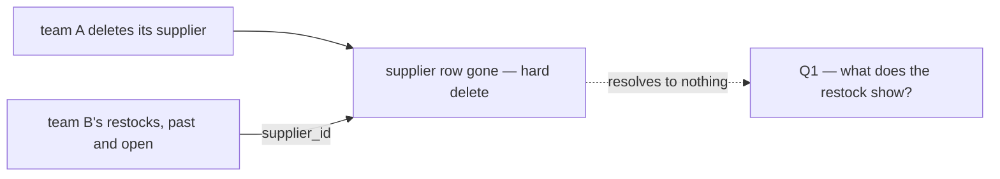
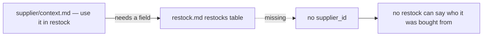

# Clarify — `inventory/restock.md`

What I read out of [restock.md](./restock.md), and what has to be settled beside it. **That doc is yours — this one is
mine.** An answered point is deleted; what you settle is recorded in `restock_decision.md`.

⚠ **Not a pass of restock.md yet.** This file was opened on 2026-10-06 to hold the supplier questions you moved here —
*"for 2 we talk further in restock context"*. The rest of restock.md has not been read against the build.

| | |
| --- | --- |
| ➡ moved here (2026-10-06) | [Q1](#question), [Q2](#question) — were [supplier Q2a, Q2b](../supplier/context_clarify.md#question) · the contradiction [restock-has-no-supplier](#restock-has-no-supplier) — was in the supplier clarify |

## What the supplier side has decided

Four supplier decisions land on the restock, and these two questions follow from them:

| decision | what it means for a restock |
| --- | --- |
| [a-team-restocks-from-another-teams-supplier](../supplier/context_decision.md#a-team-restocks-from-another-teams-supplier) | team B's restock may name team A's supplier |
| [the-supplier-gets-its-own-service](../supplier/context_decision.md#the-supplier-gets-its-own-service) | `supplier_id` is an opaque id into `supplier_service` — no foreign key |
| [no-province-city-or-soft-delete](../supplier/context_decision.md#no-province-city-or-soft-delete) | A's delete removes the row, so a restock can name a supplier that no longer exists |
| [only-a-selling-team-has-suppliers](../supplier/context_decision.md#only-a-selling-team-has-suppliers) | the supplier on a restock is always some selling team's |

## Critique

| # | Problem | → Recommend |
| --- | --- | --- |
| **1** | **A's hard delete leaves B's restocks pointing at nothing.** The restock keeps the id, `supplier_service` no longer has it, and the receiving screen, the restock detail and the batch all show a blank where the vendor was. Today a soft delete keeps the name readable; that is gone. | **The restock keeps a snapshot of the supplier's name** — [Q1](#question). |
| **2** | **B's restock form does not say how it finds A's supplier.** The picker shows B's own suppliers only. | **The picker searches every selling team's, B's own first** — [Q2](#question). |

## Question

1. **What does a restock show once its supplier is deleted — and may A delete a supplier that B's restocks name?**
   *(was supplier Q2a)*
   **→ Recommend: the restock keeps a snapshot of the supplier's name when it is saved, and A may always delete.** A
   restock line already keeps the product's `sku` and `name` the same way, for the same reason: the record must still
   read correctly after the catalogue changes. Refusing A's delete instead would need `supplier_service` to ask
   `inventory_service` whether any restock names the supplier — a call back the other way, for a rare case.
   *What breaks?* A rename by A no longer reaches B's past restocks, which keep the name they were made with. I think
   that is right for a record of what was bought.

2. **How does B's restock form find A's supplier?** *(was supplier Q2b)*
   **→ Recommend: the picker searches every selling team's suppliers, B's own listed first**, another team's with that
   team's name. The supplier's discover page is for looking before buying; the picker is where the buying happens, and
   B should not have to visit discover before every restock.

# Contradiction

## restock-has-no-supplier

| where | says |
| --- | --- |
| [supplier/context.md](../supplier/context.md) §General 1 and 3 | a supplier is for *"use it in restock"* — any selling team's |
| [restock.md](./restock.md) §Table Should We Have | `restocks` and `restock_items` have **no supplier field** |

The build has one: `restock_requests.supplier_id`, copied onto every batch received from it.
**→ Recommend:** `restocks.supplier_id` and, per [Q1](#question), `restocks.supplier_name` — one supplier per restock,
because one parcel has one sender. Whether a restock must also name the CHANNEL it bought from is parked with the
supplier's product linking ([linking-products-is-deferred](../supplier/context_decision.md#linking-products-is-deferred)).

