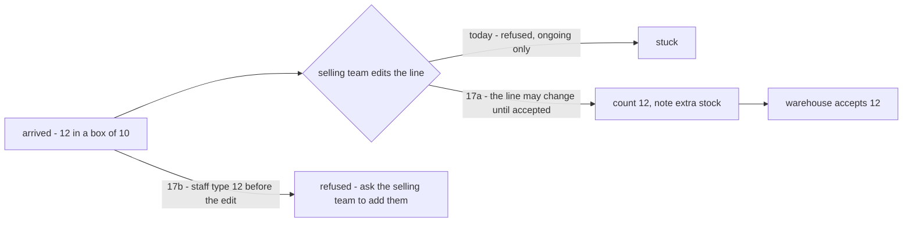
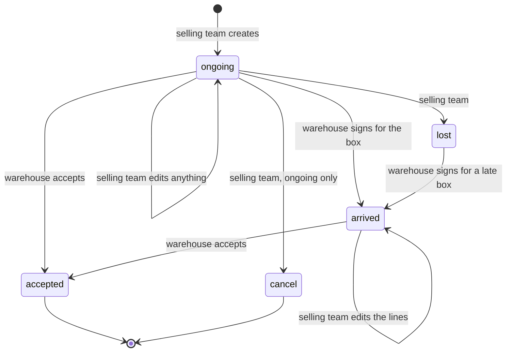
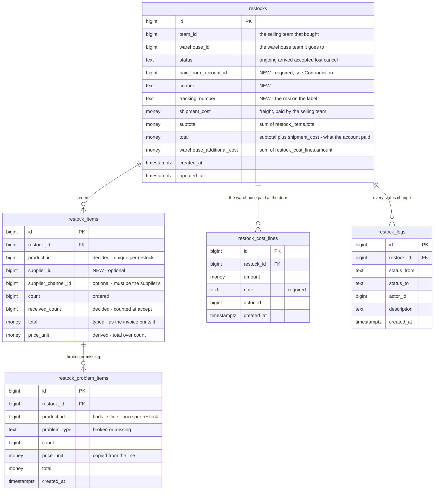
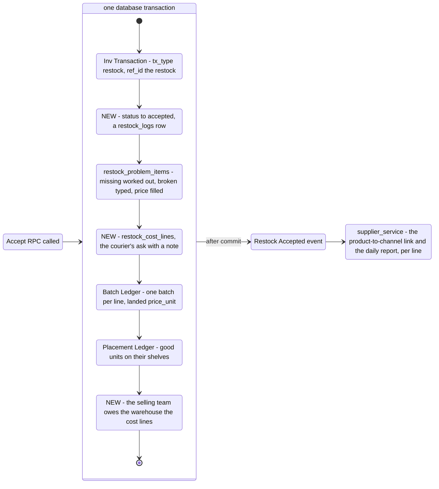
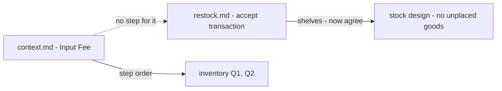
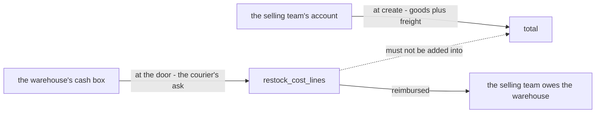
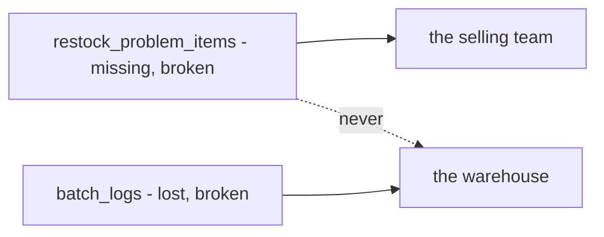

# Clarify — `inventory/restock.md`

[restock.md](./restock.md) is yours — this one is mine. An answered point is deleted; what you settle is recorded in
[restock_decision.md](./restock_decision.md).

> **The frontend gap analysis (2026-10-09)** raised [Q20](#question) — all five parts now answered, c as three notes with one
> writer each. **No question is open in restock.** ⚠ restock.md still lacks `restocks.note`, `restock_problem_items.note`, and the
> courier's-charge note.
>
> **Re-examined after your Q19a answer (2026-10-09).** ✅ [Q19](#question): one courier's charge per restock, for now, with a
> note. **No question is open in restock.** Left: [two-drawings-of-receiving](#two-drawings-of-receiving) — context.md still draws
> its own accept — and a column for the charge's note.
>
> **Re-examined after your Q19b answer (2026-10-09).** ✅ 19b: the courier's charge stays outside `total`. **Open now: Q19a** — a
> line per charge, or one number.
>
> **Re-examined after your answer on the courier's charge (2026-10-09).** `warehouse_additional_cost` is the courier's charge
> at the door — recorded. 🆕 [Q19](#question): a line per charge, and `total` without it. **Open now: Q19.**
>
> **The form prototype (2026-10-09)** raised [Q21](#question): may a line added after the box arrived name its supplier?
> **Open now: Q21.**
>
> **Re-examined after your Q17 answer (2026-10-09).** ✅ [Q17](#question): the lines stay editable until accepted, and accept
> refuses more than a line says. **No question is open.** What remains is two [contradictions](#contradiction) — receiving drawn
> twice, and `warehouse_additional_cost`. ✅ Fixed in restock.md since: `problem_type` says `missing`, and `shipment_id` is the courier.
>
> **Re-examined after your Q18 answer (2026-10-09).** ✅ [Q18](#question): one invoice per restock, many products in it. **Open now: Q17.**
>
> **Q17 and Q18 elaborated (2026-10-09)** — [Q17 and Q18, worked](#q17-and-q18-worked). 17a widened: while `arrived` the
> selling team may change the **lines** (count, total, note), not only count and note — the extra may have been paid for.
>
> **Re-examined after your 6c and 6d answers (2026-10-09).** ✅ Q6 closed: a short unit is `missing` after all — the decision
> I recorded minutes earlier is **reversed** — and extra units are the selling team's edit, with a `note`. 🆕 [Q17](#question):
> that edit comes after `arrived`, when editing is refused. 🆕 [Q18](#question): one invoice reference for a parcel from two
> stores. **Open now: Q17, Q18.**
>
> **Re-examined after your 6b and 6c answers (2026-10-09).** ✅ 6b: the system fills the price, read-only · ✅ 6c: `lost`
> and `broken` keep their names — the table says whose. My `missing` is withdrawn; it renamed one of two words with the same
> two meanings. **Open now: Q6d** — 12 arriving in a box of 10.
>
> **Re-examined after your answers (2026-10-09).** ✅ [Q15](#question), ✅ [Q16](#question): `receipt` is the tracking number.
> **Open now: Q6.** ⏸ `invoice_ref_id` was added in chat but is not saved in restock.md yet — examined once it is.
>
> **Re-examined after your `restocks` columns (2026-10-09).** `finance_account_id` is the paying account — recorded under your
> name. 🆕 [Q16](#question): is `receipt` the courier's resi or the supplier's invoice?
>
> **Q6 elaborated, Q14 answered (2026-10-09).** ✅ [Q14](#question): *Restock Updated* carries the difference
> ([an-edit-sends-the-difference](./restock_decision.md#an-edit-sends-the-difference)). 🆕 [Q15](#question): an edit that changes the paying account.
> [counting the box, worked](#counting-the-box-worked) tells Q6 at the door. **Open now: Q6 and Q15.**
>
> **Re-examined after your second round of answers (2026-10-09).** ✅ **Closed:** Q1 (a *deleted* badge), Q2 (a popup searching
> every supplier), Q3, Q4 (one parcel, many products), Q5 (b, c, e), Q7, Q8, Q9, Q11a — all recorded in
> [restock_decision.md](./restock_decision.md). 🆕 [Q14](#question): an edit has no event, though the financial account posts
> the difference. **Open now: Q6 (b–d) and Q14.**
>
> **Re-examined after your answers in chat (2026-10-09).** ✅ [Q13](#question) — accept locks the restock, from `ongoing` or
> `arrived` · ✅ [Q10](#question) b, c, d, as recommended · ✅ [Q5](#question) a and d — the warehouse signs and accepts, the
> selling team does the rest, and cancels only while `ongoing`. Q5 stays for 5b, 5c, 5e — and 5c now matters, since accept
> is refused from `lost`.
>
> **Re-examined after §Restock Created Flow and your accept change (2026-10-09).** Recorded:
> [a-created-restock-tells-the-financial-account](./restock_decision.md#a-created-restock-tells-the-financial-account),
> [an-accepted-restock-cannot-be-cancelled](./restock_decision.md#an-accepted-restock-cannot-be-cancelled) — Q5d half answered.
> 🆕 [Q13](#question): accept does not take cancel's lock, so both can win ([Critique 14](#critique)) · [Q10d](#question): the
> events lack the paying account and *did the money come back?* ([Critique 15](#critique)).
>
> **Re-examined after your transaction edit (2026-10-08).** Accept now *gets* an inventory transaction before it writes
> anything ([every-stock-change-belongs-to-a-transaction](./context_decision.md#every-stock-change-belongs-to-a-transaction)).
> `restocks.transaction_id` points the restock at it, so [Critique 12](#critique) is answered for one accept, and
> [Q11b](#question) moves to [context Q13a](./context_clarify.md#question): a restock with a second transaction. Whether
> accept gets or creates it is [context Q13b](./context_clarify.md#question).
>
> **Re-examined after your answers in chat (2026-10-07).** ✅ **Closed:** [Q6a](#question) and [Q12](#question), both as
> recommended. Any warehouse member counts what arrived and what is broken
> ([any-warehouse-member-counts-what-arrived](./restock_decision.md#any-warehouse-member-counts-what-arrived)), and a
> product appears once per restock ([a-product-appears-once-per-restock](./restock_decision.md#a-product-appears-once-per-restock)).
> [Critique 5, 6](#critique) close with them. Product's answer puts the courier's ask **in** the price
> ([the-couriers-ask-is-in-the-unit-price](../product/context_decision.md#the-couriers-ask-is-in-the-unit-price)), so
> [Q10b](#question) narrows: the price reads the cost lines, so the cost lines must be inside the transaction.
>
> **Re-examined after supplier's soft delete (2026-10-07)** — a deleted supplier stays readable ([a-deleted-supplier-is-kept-for-its-figures](../supplier/context_decision.md#a-deleted-supplier-is-kept-for-its-figures)).
> [Critique 2](#critique) loses its main case, and [Q1](#question)'s recommendation moves to **no snapshot**.
>
> **Re-examined after supplier.md §Supplier Rule (2026-10-07)** — *"its choose per product in restock. we talk further
> in restock"*. Per product, or per line? It opens [Q12](#question): may one restock carry a product twice.
>
> **Re-examined after your supplier edit (2026-10-07).** supplier.md §How We Seed answers [Q10a](#question) as
> recommended — the event writes the product-to-channel link
> ([restock-accepted-links-the-product-to-its-channel](../supplier/context_decision.md#restock-accepted-links-the-product-to-its-channel)).
> Its new daily report also feeds on this event, so my [Q10c](#question) *no price* is revised: the event carries each
> line's price and its problem counts.
>
> **Re-examined after your §Restock Accepted Flow (2026-10-06).** Accept is one transaction — problem rows, a batch
> with its computed price, the placement ledger — and a *Restock Accepted* event to `supplier_service` after commit.
> Recorded as [accept-is-one-transaction-then-an-event](./restock_decision.md#accept-is-one-transaction-then-an-event).
> It settles the shelf half of [two-drawings-of-receiving](#two-drawings-of-receiving) and opens [Q10, Q11](#question):
> who hears the event, and what accept writes into the two ledgers.
>
> **First full pass — the same day**, read against your edit that put `supplier_channel_id` on the lines
> ([a-line-names-the-channel-it-was-bought-from](./restock_decision.md#a-line-names-the-channel-it-was-bought-from)).
> The two questions moved here from supplier are re-asked against it as [Q1, Q2](#question).

## What restock.md settles

| | |
| --- | --- |
| who | the selling team creates · the warehouse checks and accepts · the selling team sets `lost` |
| the record | `restocks` → `restock_items` (what was ordered) → `restock_problem_items` (`broken` · `lost`) |
| the lifecycle | five statuses — `ongoing` `arrived` `accepted` `lost` `cancel` |
| good units | not stored — by my reading, `count − Σ problem counts` |
| accept | ✅ one database transaction: problem rows · a batch, its `price_unit` computed · the placement ledger — then *Restock Accepted* to `supplier_service` |
| the door count | ✅ any warehouse member types `received_count` and broken per line; short = `count − received_count` |
| a product | ✅ once per restock |
| the courier's ask | ✅ in the batch's `price_unit` — product's [the-couriers-ask-is-in-the-unit-price](../product/context_decision.md#the-couriers-ask-is-in-the-unit-price) |

**What it changes in the build** — the build is a reference here, not an argument:

| built — `restock_requests` | restock.md |
| --- | --- |
| `pending` · `fulfilled` · `cancelled` | 🆕 `arrived` and `lost` — the parcel at the door, and the parcel that never came |
| one `supplier_id` on the restock | a channel per **line**, optional |
| a line's **total** typed | `price_unit` and `total` |
| `received_quantity` + damaged rows with a reason | problem rows, no reason |
| warehouse cost **lines**, each with a note, owed in the accept's transaction | one number, `warehouse_additional_cost` — and no step in the accept |
| resi, courier, order ref, payment type, note | gone — ⚠ the resi is [Q7](#question) |
| shelves per line · a timeline, actors | the placement ledger ✅ · the trail is gone — [Q9](#question) |
| no event | 🆕 *Restock Accepted*, heard by `supplier_service` |

## Critique

| # | Problem | → Recommend |
| --- | --- | --- |
| **1** | ✅ **Answered** — [a-line-may-name-a-supplier-without-a-channel](./restock_decision.md#a-line-may-name-a-supplier-without-a-channel) | — |
| **2** | ✅ **Answered** — [a-deleted-supplier-still-shows-with-a-badge](./restock_decision.md#a-deleted-supplier-still-shows-with-a-badge) | — |
| **3** | ✅ **Answered** — [a-restock-is-one-parcel](./restock_decision.md#a-restock-is-one-parcel) | — |
| **4** | ✅ **Answered** — every status has its mover and its sources: [the-warehouse-signs-and-accepts-the-team-does-the-rest](./restock_decision.md#the-warehouse-signs-and-accepts-the-team-does-the-rest) and the rules after it | — |
| **5** | ✅ **Answered** — `received_count` is typed per line, and the short units are the difference ([any-warehouse-member-counts-what-arrived](./restock_decision.md#any-warehouse-member-counts-what-arrived)). An over-delivery is still unwritten | [Q6d](#question) |
| **6** | ✅ **Answered by [Q12](#question)** — a product is once per restock, so the problem row's `product_id` finds its line. Its price can still disagree with the line's | price copied, never typed — [Q6b](#question) |
| **7** | ✅ **Answered** — [a-line-is-typed-as-its-total](./restock_decision.md#a-line-is-typed-as-its-total) | — |
| **8** | ✅ **Answered** — [a-restock-carries-its-tracking-number](./restock_decision.md#a-restock-carries-its-tracking-number) | — |
| **9** | ✅ **Answered** — [every-status-change-is-logged](./restock_decision.md#every-status-change-is-logged) | — |
| **10** | ✅ **Answered** — [the-couriers-debt-is-written-in-the-accept](./restock_decision.md#the-couriers-debt-is-written-in-the-accept) | — |
| **11** | ✅ **Answered by your supplier edit** — `supplier_service` writes the product-to-channel link and its daily report ([restock-accepted-links-the-product-to-its-channel](../supplier/context_decision.md#restock-accepted-links-the-product-to-its-channel), [a-supplier-is-measured-per-product-per-day](../supplier/context_decision.md#a-supplier-is-measured-per-product-per-day)) | what the event carries — [Q10c](#question) |
| **12** | 🔄 *(2026-10-08)* **Answered for one accept** — both logs point at a transaction, and `restocks.transaction_id` points the restock at it ([every-stock-change-belongs-to-a-transaction](./context_decision.md#every-stock-change-belongs-to-a-transaction)). A shelf that gained 8 units can now find its delivery. ⚠ One column holds one transaction, so a count corrected after accept has nowhere to go | `ref_id` on the transaction instead — asked where it is answered, [context Q13a](./context_clarify.md#question) |
| **13** | **The three branches are drawn side by side, but one transaction runs them in turn** — and two accepts of the same product, by the pair working one stock level, update the same placement rows. In different orders, they deadlock. | lines in `product_id` order, shelves in `placement_id` order. Not a question — the concurrency audit checks it |
| **14** | ✅ **Answered** — accept takes cancel's lock ([accept-locks-the-restock](./restock_decision.md#accept-locks-the-restock)) | — |
| **15** | ✅ **Answered** — [a-restock-names-its-paying-account](./restock_decision.md#a-restock-names-its-paying-account) | — |
| **16** | ✅ **Answered** — [an-edit-sends-the-difference](./restock_decision.md#an-edit-sends-the-difference) | — |

## Recommendation

**A restock is ONE PARCEL** — what the courier hands over together: one courier, one resi, one arrival. Its lines may
still name different stores (a forwarder consolidating several sellers is one parcel), but goods that ship separately
are separate restocks. Every status in restock.md is then true of the whole restock, which is what the flow already
assumes.

**And what costs money stays in the transaction; what is cosmetic rides the event.** Under
[no-outbox-the-publish-is-trusted](../../technical/event_architecture/context_decision.md#no-outbox-the-publish-is-trusted)
an event can, rarely, be lost. A lost product link is redrawn by the next restock of that product; a lost debt leaves
the warehouse out of pocket with no record.

## Question

1. ✅ *(2026-10-09)* **Answered: still shown, with a *deleted* badge** — [a-deleted-supplier-still-shows-with-a-badge](./restock_decision.md#a-deleted-supplier-still-shows-with-a-badge).
2. ✅ *(2026-10-09)* **Answered: a Connect Supplier Channel popup that searches every supplier** — [a-line-connects-to-any-teams-supplier-from-a-popup](./restock_decision.md#a-line-connects-to-any-teams-supplier-from-a-popup).
3. ✅ *(2026-10-09)* **Answered: yes, `supplier_id` beside the channel** — [a-line-may-name-a-supplier-without-a-channel](./restock_decision.md#a-line-may-name-a-supplier-without-a-channel).
4. ✅ *(2026-10-09)* **Answered: one parcel, any number of products** — [a-restock-is-one-parcel](./restock_decision.md#a-restock-is-one-parcel).

5. ✅ *(2026-10-09)* **Answered, every part** — [the-warehouse-signs-and-accepts-the-team-does-the-rest](./restock_decision.md#the-warehouse-signs-and-accepts-the-team-does-the-rest) ·
   [lost-is-set-only-before-the-box-arrives](./restock_decision.md#lost-is-set-only-before-the-box-arrives) · [a-late-lost-box-is-signed-for-as-arrived](./restock_decision.md#a-late-lost-box-is-signed-for-as-arrived) ·
   [a-restock-is-cancelled-only-while-ongoing](./restock_decision.md#a-restock-is-cancelled-only-while-ongoing) · [a-restock-is-edited-only-while-ongoing](./restock_decision.md#a-restock-is-edited-only-while-ongoing).

6. ✅ *(2026-10-09)* **Answered, every part** — [the-problem-price-is-filled-by-the-system](./restock_decision.md#the-problem-price-is-filled-by-the-system) ·
   [a-short-unit-at-the-door-is-missing](./restock_decision.md#a-short-unit-at-the-door-is-missing) · [extra-units-are-added-by-the-selling-teams-edit](./restock_decision.md#extra-units-are-added-by-the-selling-teams-edit). What 6d leaves is
   [Q17](#question).

7. ✅ *(2026-10-09)* **Answered: yes** — [a-restock-carries-its-tracking-number](./restock_decision.md#a-restock-carries-its-tracking-number).
8. ✅ *(2026-10-09)* **Answered: the total** — [a-line-is-typed-as-its-total](./restock_decision.md#a-line-is-typed-as-its-total).
9. ✅ *(2026-10-09)* **Answered: yes** — [every-status-change-is-logged](./restock_decision.md#every-status-change-is-logged).

10. ✅ *(2026-10-09)* **Answered, as recommended** — the link (10a, earlier) ·
    [the-couriers-debt-is-written-in-the-accept](./restock_decision.md#the-couriers-debt-is-written-in-the-accept) ·
    [restock-accepted-carries-every-line](./restock_decision.md#restock-accepted-carries-every-line) ·
    [a-restock-names-its-paying-account](./restock_decision.md#a-restock-names-its-paying-account).

11. ✅ *(2026-10-09)* **Answered** — one batch per line with good units ([one-batch-per-line](./restock_decision.md#one-batch-per-line)). What each log row names
    moved to the transaction: [transaction_clarify Q1](./transaction_clarify.md#question).

12. ✅ *(2026-10-07)* **Answered: once per restock**, as recommended —
    [a-product-appears-once-per-restock](./restock_decision.md#a-product-appears-once-per-restock).

13. ✅ *(2026-10-09)* **Answered: accept locks the restock and accepts from `ongoing` or `arrived`** —
    [accept-locks-the-restock](./restock_decision.md#accept-locks-the-restock).

14. ✅ *(2026-10-09)* **Answered: Restock Updated, with the difference** — [an-edit-sends-the-difference](./restock_decision.md#an-edit-sends-the-difference).

15. ✅ *(2026-10-09)* **Answered: yes, while `ongoing`** — [an-edit-may-move-the-payment-to-another-account](./restock_decision.md#an-edit-may-move-the-payment-to-another-account).

16. ✅ *(2026-10-09)* **Answered: the tracking number** — [the-receipt-is-the-tracking-number](./restock_decision.md#the-receipt-is-the-tracking-number); the courier is
    `shipment_id`.

17. ✅ *(2026-10-09)* **Answered, as recommended** — [the-lines-stay-editable-until-accepted](./restock_decision.md#the-lines-stay-editable-until-accepted) ·
    [accept-refuses-more-than-the-line-says](./restock_decision.md#accept-refuses-more-than-the-line-says).

18. ✅ *(2026-10-09)* **Answered: one invoice per restock, many products in it** —
    [a-restock-has-one-invoice](./restock_decision.md#a-restock-has-one-invoice).

19. ✅ *(2026-10-09)* **Answered: one charge per restock for now, with a note; outside `total`** —
    [the-courier-is-paid-once-per-restock](./restock_decision.md#the-courier-is-paid-once-per-restock) ·
    [the-couriers-charge-stays-out-of-total](./restock_decision.md#the-couriers-charge-stays-out-of-total).

20. ✅ *(2026-10-09)* **Answered, every part** — [lines-can-be-added-not-removed-while-arrived](./restock_decision.md#lines-can-be-added-not-removed-while-arrived) ·
    [a-broken-reason-is-optional](./restock_decision.md#a-broken-reason-is-optional) · [three-notes-one-writer-each](./restock_decision.md#three-notes-one-writer-each) ·
    [edits-are-in-the-same-trail](./restock_decision.md#edits-are-in-the-same-trail) · [there-is-no-unplaced-pile](./restock_decision.md#there-is-no-unplaced-pile).

21. 🆕 *(2026-10-09)* **A line added after the box arrived — may it name where it was bought?** Raised by the form
    prototype. While `arrived`, a line's store is closed
    ([the-lines-stay-editable-until-accepted](./restock_decision.md#the-lines-stay-editable-until-accepted)) — and a line
    may be ADDED then ([lines-can-be-added-not-removed-while-arrived](./restock_decision.md#lines-can-be-added-not-removed-while-arrived)).
    Read together, a product that turned up unordered can never say which supplier sent it: its supplier report and its
    batch are anonymous for good.
    **→ Recommend: yes — a NEW line may name its supplier and store; a STORED line's stay closed.** The closing rule
    exists so a line already raised cannot be re-attributed after the box is in the building; a line that did not exist
    until now has nothing to re-attribute.

## Proposed Design

### counting the box, worked

[Q6](#question), told at the door. The selling team bought **Kaos Polos Hitam, 10 pcs, Rp 100.000** — Rp 10.000 each.

✅ *(2026-10-09)* **All three decided** — the system fills the price, read-only
([the-problem-price-is-filled-by-the-system](./restock_decision.md#the-problem-price-is-filled-by-the-system)); a short unit is `missing` ([a-short-unit-at-the-door-is-missing](./restock_decision.md#a-short-unit-at-the-door-is-missing));
extra units are the selling team's edit, with a note ([extra-units-are-added-by-the-selling-teams-edit](./restock_decision.md#extra-units-are-added-by-the-selling-teams-edit)).

### Q17 and Q18, worked

**[Q17](#question) — the extra units are found after the box is signed for.** The selling team raised *Kaos Hitam × 10,
Rp 100.000*.

| when | what happens | status |
| --- | --- | --- |
| day 1 | the selling team creates the restock | `ongoing` |
| day 3, 09:00 | the box arrives; staff sign for it | `arrived` |
| 10:00 | staff open it: **12** shirts | `arrived` |
| 10:05 | the selling team edits the line to 12, *"extra stock"* — **refused**: editing is `ongoing`-only | `arrived` |
| — | the warehouse cannot accept 12 (the line says 10), the selling team cannot edit: **stuck** | |

**→ 17a:** while `arrived`, the selling team may still change **the lines** — count, total, note — until the warehouse
accepts. The account, the store and the tracking number stay `ongoing`-only. **→ 17b:** if staff type more received than
the line says, accept is refused with *"more arrived than ordered — ask the selling team to add them"*.

**[Q18](#question) — one parcel, two invoices.** The selling team buys from two Shopee stores and a forwarder repacks both
into one box:

| line | store | invoice |
| --- | --- | --- |
| Kaos Hitam × 10 | Toko Melati | **INV-001** |
| Celana Chino × 5 | Toko Sinar | **INV-777** |

One box, one resi, so one restock ([a-restock-is-one-parcel](./restock_decision.md#a-restock-is-one-parcel)) — and
`restocks.invoice_ref_id` holds one string.

| | where INV-777 goes | the cost |
| --- | --- | --- |
| both in one string — *"INV-001, INV-777"* | the same field | a person can read it; nothing can search or match it |
| **one per line** | `restock_items.invoice_ref_id` | each line already names its store — its invoice sits beside it |
| two restocks for one box | a second restock | two restocks share one resi, and the warehouse finds two records for one box |

✅ *(2026-10-09)* **Decided: one invoice per restock** — [a-restock-has-one-invoice](./restock_decision.md#a-restock-has-one-invoice). A restock's lines share a store in practice.

### lifecycle

### the tables

`money` stands for whatever type [stock Q4](../../technical/stock/design_clarify.md#question) settles.

### what accept writes — yours, plus three

Yours as drawn; the three marked NEW are what I would add inside the same transaction.

The order inside is the one the price needs: the cost lines and the problem rows exist before a batch's `price_unit`
is computed.

# Contradiction

## two-drawings-of-receiving

| where | says |
| --- | --- |
| [restock.md](./restock.md) §Restock Flow and §Restock Accepted Flow | check → *entry problem item* → accept: problem rows · batch with its price · placement ledger |
| [context.md](./context.md) §How Warehouse Team Member Accept | **Input Fee** → Calculate Unit Price → Losts **or** Broken → Calculate valid Qty → Set Placements |
| [technical/stock/design.md](../../technical/stock/design.md) §Flow Of Accept Stock | *"there is no unplaced goods … when accepting we already decided where goods to be placed"* |

✅ **The shelf half is settled** — your accept posts the placement ledger, as context.md and the stock design require
([accept-is-one-transaction-then-an-event](./restock_decision.md#accept-is-one-transaction-then-an-event)).
**Still apart:** context.md's *Input Fee* has no place in restock.md's accept ([Q10b](#question)), and context.md's own
order is what [inventory Q1, Q2](./context_clarify.md#question) question. restock.md's single problem step reads as
allowing broken **and** lost on one delivery; if you meant that, inventory Q2 closes.
**→ Recommend:** context.md's procedure points at §Restock Accepted Flow instead of drawing its own order — the person's
steps and the transaction's steps then cannot disagree.

## the-tables-miss-two-decided-fields

✅ *(2026-10-09)* **Closed** — the paying account is `finance_account_id`; the warehouse cost is the courier's charge, one per
restock with a note, outside `total` ([the-courier-is-paid-once-per-restock](./restock_decision.md#the-courier-is-paid-once-per-restock)). ⚠ The note's column
is not in restock.md yet. As first recorded:

| decision | requires | restock.md |
| --- | --- | --- |
| [a-restock-must-name-the-account-that-paid](../financial_account/context_decision.md#a-restock-must-name-the-account-that-paid) | the paying account, **required** at create | absent |
| [an-incidental-line-must-say-what-it-was-for](../balance/context_decision.md#an-incidental-line-must-say-what-it-was-for) | each warehouse cost a **line with a note** | one number, `warehouse_additional_cost` |

One cause: the tables were written without the financial and balance decisions beside them. And `total`, if it
includes `warehouse_additional_cost`, adds two payers' money — goods and freight left the selling team's account at
create, the courier's ask left the warehouse's at the door
([cod-fee-is-the-couriers-incidental-ask](../balance/context_decision.md#cod-fee-is-the-couriers-incidental-ask)).
**→ Recommend:** add `paid_from_account_id`; keep `warehouse_additional_cost` as the **sum** of `restock_cost_lines`;
`total = subtotal + shipment_cost`. ⚠ The same money has five names — `AdditionalWarehouseFee` (product), `cod_fee`
(balance), `incidental_fee` ([the-ledger-speaks-the-business-words](../balance/context_decision.md#the-ledger-speaks-the-business-words)),
`warehouse_ops_fee` (stock design), `warehouse_additional_cost` (here). I read them as one — the courier's ask, as
[product's contradiction](../product/context_clarify.md#additionalwarehousefee-is-capitalised-into-unitprice-and-balance_contextmd-has-now-defined-it-as-a-tip)
does. If yours is a **handling fee the warehouse charges**, it is a new kind of money and no decision covers it — say so.

## ✅ lost-means-three-things — resolved by `missing`

*(2026-10-09)* `lost` meant three things with two payers. A short unit at the door is now **`missing`**
([a-short-unit-at-the-door-is-missing](./restock_decision.md#a-short-unit-at-the-door-is-missing)), so `lost` keeps only a parcel that never came and a unit gone from a rack —
two meanings that never meet in one table. `broken` keeps its name in both places; its table says whose it is.

**Why it is kept here:** the cause was one word, two payers. The guard that stops it recurring is one rule — a receiving
problem row never posts to the warehouse's payable. ✅ [restock.md](./restock.md)'s `problem_type` now says `broken` · `missing`.

## ✅ restock-has-no-supplier — answered by your edit

Earlier this file said `restocks` and `restock_items` had no supplier field. You put `supplier_channel_id` on each line
instead — recorded as [a-line-names-the-channel-it-was-bought-from](./restock_decision.md#a-line-names-the-channel-it-was-bought-from),
**against** my *one `supplier_id` per restock*. What it leaves is [Q3](#question): a supplier with no channel.
