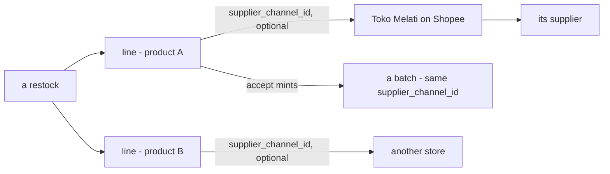
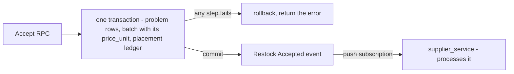

# Decisions — `inventory/restock.md`

What the owner settled, recorded before it is acted on. **Append-only** — a decision that is later reversed is renamed
and its references grepped (RULE 12), never quietly edited away. The open set is [restock_clarify.md](./restock_clarify.md).

| decision | says | from |
| --- | --- | --- |
| [a-line-names-the-channel-it-was-bought-from](#a-line-names-the-channel-it-was-bought-from) | each restock line names the supplier channel it was bought from, optionally — not one supplier per restock | your §Table Should We Have edit, 2026-10-06 — answers *restock-has-no-supplier*, against my *one `supplier_id` per restock* |
| [accept-is-one-transaction-then-an-event](#accept-is-one-transaction-then-an-event) | accept writes the problem rows, the batch with its price and the placements in ONE transaction; after commit it publishes *Restock Accepted*, heard by `supplier_service` | your §Restock Accepted Flow, 2026-10-06 — settles the shelf half of *two-drawings-of-receiving* |

## a-line-names-the-channel-it-was-bought-from

> Owner, in [restock.md](./restock.md) §Table Should We Have *(2026-10-06)*: `restock_items` and
> `restock_problem_items` gain *"`supplier_channel_id`, its optionals"*; [batch_ledger.md](./batch_ledger.md) gives
> `batches` the same. It answers the clarify's contradiction *restock-has-no-supplier*, **against my recommendation** of
> one `restocks.supplier_id`, *"because one parcel has one sender"*.

**The verdict.** Where goods were bought is a fact of the **line**, not of the restock: each line may name the store —
a supplier's channel — it came from, and one restock may mix stores. The batch minted from the line carries the
channel on.

**The spec.**

| | |
| --- | --- |
| `restock_items.supplier_channel_id` | optional · an opaque id into `supplier_service` ([the-supplier-gets-its-own-service](../supplier/context_decision.md#the-supplier-gets-its-own-service)) |
| `restock_problem_items.supplier_channel_id` | as written — ⚠ [Q6b](./restock_clarify.md#question) recommends the problem row point at its line instead |
| `batches.supplier_channel_id` | copied from the line at accept |
| the supplier | reached through the channel — `channel → supplier_id` |

**What it does NOT settle:** a supplier with no channel — a physical vendor
([Q3](./restock_clarify.md#question)); what a line shows once the channel is hard-deleted ([Q1](./restock_clarify.md#question));
and whether one restock may span parcels that arrive separately ([Q4](./restock_clarify.md#question)).

## accept-is-one-transaction-then-an-event

> Owner, in [restock.md](./restock.md) §Restock Accepted Flow *(2026-10-06)*: *"Accept RPC called"* → *"Open Database
> Transaction"* — *"If Any Step Fails, Rollback Transaction and Return Error"* — holding `restock_problem_items`,
> *"calculate price_unit and post in batch_ledger"* and *"post in placement ledger"*; then *"Send Restock Accepted
> Event"* *"if success"*, received by `supplier_service`'s *"Inventory Webhook"* *"by push subscribe"*. It settles the
> shelf half of the clarify's *two-drawings-of-receiving*.

**The verdict.** Accepting a restock is **all or nothing**: the problems found, the batch the good units become — its
unit price computed then — and the shelves they go to are written together, or not at all. Only once that has
committed does the rest of the system hear of it, through one event.

**The spec.**

| | |
| --- | --- |
| inside the transaction | `restock_problem_items` · `batches` + `batch_logs` (+ `batch_price_logs`, per [batch_ledger.md](./batch_ledger.md)) · `product_placements` + `product_placement_logs` |
| the price | computed at accept — consistent with [staff-accepts-the-restock](../user/context_decision.md#staff-accepts-the-restock) (*"the quantity, the losses, the unit price"*); the formula is still product Q2, Q6 |
| the event | published after commit, no outbox — [no-outbox-the-publish-is-trusted](../../technical/event_architecture/context_decision.md#no-outbox-the-publish-is-trusted) |
| who hears it | `supplier_service`, by push. What it does is [Q10a](./restock_clarify.md#question) |

**What it does NOT settle:** the courier's ask — neither its cost lines nor what the selling team owes for them is in
the transaction ([Q10b](./restock_clarify.md#question)); how many batches, and whether the log rows name the restock
([Q11](./restock_clarify.md#question)); the status change and its trail ([Q9](./restock_clarify.md#question)).
