# Decisions — `inventory/restock.md`

What the owner settled, recorded before it is acted on. **Append-only** — a decision that is later reversed is renamed
and its references grepped (RULE 12), never quietly edited away. The open set is [restock_clarify.md](./restock_clarify.md).

| decision | says | from |
| --- | --- | --- |
| [a-line-names-the-channel-it-was-bought-from](#a-line-names-the-channel-it-was-bought-from) | each restock line names the supplier channel it was bought from, optionally — not one supplier per restock | your §Table Should We Have edit, 2026-10-06 — answers *restock-has-no-supplier*, against my *one `supplier_id` per restock* |
| [accept-is-one-transaction-then-an-event](#accept-is-one-transaction-then-an-event) | accept writes the problem rows, the batch with its price and the placements in ONE transaction; after commit it publishes *Restock Accepted*, heard by `supplier_service` | your §Restock Accepted Flow, 2026-10-06 — settles the shelf half of *two-drawings-of-receiving* |
| [any-warehouse-member-counts-what-arrived](#any-warehouse-member-counts-what-arrived) | any member of the warehouse team counts and accepts; per line they type what arrived and how many of those are broken — the short units are the difference | chat, 2026-10-07 — answers Q6a, as recommended |
| [a-product-appears-once-per-restock](#a-product-appears-once-per-restock) | one restock lists each product once, the store chosen per product | chat, 2026-10-07 — answers Q12, as recommended |
| [a-created-restock-tells-the-financial-account](#a-created-restock-tells-the-financial-account) | create writes the restock and its lines in one transaction; after commit, *Restock Created* goes to `financial_account_service` | your §Restock Created Flow, 2026-10-09 |
| [an-accepted-restock-cannot-be-cancelled](#an-accepted-restock-cannot-be-cancelled) | cancel locks the restock and is refused once it is accepted; after commit, *Restock Cancel* goes to `financial_account_service` — 🔄 narrowed by [a-restock-is-cancelled-only-while-ongoing](#a-restock-is-cancelled-only-while-ongoing) | your §Restock Created Flow, 2026-10-09 — answers Q5d in part, wider than my *from `ongoing` only* |
| [the-warehouse-signs-and-accepts-the-team-does-the-rest](#the-warehouse-signs-and-accepts-the-team-does-the-rest) | the warehouse sets `arrived` when it signs for the box, and `accepted`; the selling team creates, edits, cancels and sets `lost` | chat, 2026-10-09 — answers Q5a and who moves each status, as recommended |
| [a-restock-is-cancelled-only-while-ongoing](#a-restock-is-cancelled-only-while-ongoing) | a cancel is allowed from `ongoing` only; a second cancel is an error | chat, 2026-10-09 — answers Q5d, as recommended |
| [accept-locks-the-restock](#accept-locks-the-restock) | accept finds and locks the restock, and accepts only from `ongoing` or `arrived` | chat, 2026-10-09 — answers Q13, as recommended |
| [the-couriers-debt-is-written-in-the-accept](#the-couriers-debt-is-written-in-the-accept) | what the selling team owes for the courier's ask is written inside the accept's transaction, not sent on the event | chat, 2026-10-09 — answers Q10b, as recommended |
| [restock-accepted-carries-every-line](#restock-accepted-carries-every-line) | *Restock Accepted* carries the restock, both teams, the accept time and every line with its counts and price | chat, 2026-10-09 — answers Q10c, as recommended |
| [a-restock-names-its-paying-account](#a-restock-names-its-paying-account) | `restocks.paid_from_account_id`; *Created* and *Cancel* carry the account and the amount; a cancel says whether the money came back | chat, 2026-10-09 — answers Q10d, as recommended |
| [lost-is-set-only-before-the-box-arrives](#lost-is-set-only-before-the-box-arrives) | `lost` only from `ongoing`; a unit missing from an arrived box is a problem row | chat, 2026-10-09 — answers Q5b, as recommended |
| [a-late-lost-box-is-signed-for-as-arrived](#a-late-lost-box-is-signed-for-as-arrived) | a lost parcel that turns up is signed for, `lost → arrived`, and accepted as usual | chat, 2026-10-09 — answers Q5c, as recommended |
| [a-restock-is-edited-only-while-ongoing](#a-restock-is-edited-only-while-ongoing) | the selling team edits a restock only while it is `ongoing` | chat, 2026-10-09 — answers Q5e, as recommended — 🔄 widened for the lines by [the-lines-stay-editable-until-accepted](#the-lines-stay-editable-until-accepted) |
| [a-deleted-supplier-still-shows-with-a-badge](#a-deleted-supplier-still-shows-with-a-badge) | a line still shows a deleted supplier or store, read from the kept rows, with a *deleted* badge | chat, 2026-10-09 — answers Q1, plus the badge, as recommended |
| [a-line-connects-to-any-teams-supplier-from-a-popup](#a-line-connects-to-any-teams-supplier-from-a-popup) | each line has a *Connect Supplier Channel* button; its popup searches every team's suppliers | chat, 2026-10-09 — answers Q2, as recommended |
| [a-line-may-name-a-supplier-without-a-channel](#a-line-may-name-a-supplier-without-a-channel) | `restock_items.supplier_id` beside `supplier_channel_id`, both optional | chat, 2026-10-09 — answers Q3, as recommended |
| [a-restock-is-one-parcel](#a-restock-is-one-parcel) | one restock is what the courier hands over together — any number of products and variations | chat, 2026-10-09 — answers Q4, as recommended |
| [a-restock-carries-its-tracking-number](#a-restock-carries-its-tracking-number) | `restocks.tracking_number` and `courier`, editable while `ongoing` | chat, 2026-10-09 — answers Q7, as recommended |
| [a-line-is-typed-as-its-total](#a-line-is-typed-as-its-total) | a line is typed as count and total; `price_unit` is derived for display | chat, 2026-10-09 — answers Q8, as recommended |
| [every-status-change-is-logged](#every-status-change-is-logged) | `restock_logs` — one row per status change: from, to, who, when, why | chat, 2026-10-09 — answers Q9, as recommended |
| [one-batch-per-line](#one-batch-per-line) | accept mints one batch per line with good units, at the landed price | chat, 2026-10-09 — answers Q11a, as recommended |
| [an-edit-sends-the-difference](#an-edit-sends-the-difference) | an edit that changes the amount sends *Restock Updated* with the account and the difference | chat, 2026-10-09 — answers Q14, as recommended |
| [an-edit-may-move-the-payment-to-another-account](#an-edit-may-move-the-payment-to-another-account) | while `ongoing`, an edit may change the paying account; *Restock Updated* moves the whole amount back and out | chat, 2026-10-09 — answers Q15, as recommended |
| [the-receipt-is-the-tracking-number](#the-receipt-is-the-tracking-number) | `restocks.receipt` is the courier's tracking number; `receipt_file` a photo of the label | chat, 2026-10-09 — answers Q16 |
| [the-problem-price-is-filled-by-the-system](#the-problem-price-is-filled-by-the-system) | a problem row's price is filled from the line by the system; the warehouse cannot edit it | chat, 2026-10-09 — answers Q6b, as recommended |
| [a-loss-is-named-by-where-it-happened](#a-loss-is-named-by-where-it-happened) | `lost` and `broken` keep their names; the table says where it happened and who bears it | chat, 2026-10-09 — answers Q6c, against my `missing` — 🔄 **reversed** by [a-short-unit-at-the-door-is-missing](#a-short-unit-at-the-door-is-missing) |
| [a-short-unit-at-the-door-is-missing](#a-short-unit-at-the-door-is-missing) | a unit short in the box is `missing`; `lost` keeps the parcel and the rack | chat, 2026-10-09 — answers Q6c, as first recommended; reverses the decision above |
| [extra-units-are-added-by-the-selling-teams-edit](#extra-units-are-added-by-the-selling-teams-edit) | more in the box than ordered: the selling team edits the line's count and writes a `note`; the warehouse accepts that | chat, 2026-10-09 — answers Q6d, instead of my accept-at-the-door |
| [a-restock-keeps-its-invoice-reference](#a-restock-keeps-its-invoice-reference) | `restocks.invoice_ref_id`, a string — the store's invoice or order number | your restock.md, 2026-10-09 |
| [a-restock-has-one-invoice](#a-restock-has-one-invoice) | one invoice per restock, listing any number of products — `invoice_ref_id` stays on `restocks` | chat, 2026-10-09 — answers Q18, against my one-per-line |
| [the-lines-stay-editable-until-accepted](#the-lines-stay-editable-until-accepted) | while `arrived`, the selling team may still edit the lines — count, total, note — until accepted | chat, 2026-10-09 — answers Q17a, as recommended |
| [accept-refuses-more-than-the-line-says](#accept-refuses-more-than-the-line-says) | if staff count more than a line says, accept is refused until the selling team edits | chat, 2026-10-09 — answers Q17b, as recommended |
| [the-warehouse-cost-is-the-couriers-charge-at-the-door](#the-warehouse-cost-is-the-couriers-charge-at-the-door) | `warehouse_additional_cost` is the courier's charge at handover; the warehouse pays it, the selling team compensates | chat, 2026-10-09 — as I had read it |
| [the-couriers-charge-stays-out-of-total](#the-couriers-charge-stays-out-of-total) | `total` = `subtotal` + `shipment_cost`; the courier's charge is its own debt | chat, 2026-10-09 — answers Q19b, as recommended |
| [the-courier-is-paid-once-per-restock](#the-courier-is-paid-once-per-restock) | one courier's charge per restock, with a required note — for now | chat, 2026-10-09 — answers Q19a, against my cost lines |

## a-line-names-the-channel-it-was-bought-from

> Owner, in [restock.md](./restock.md) §Table Should We Have *(2026-10-06)*: `restock_items` and
> `restock_problem_items` gain *"`supplier_channel_id`, its optionals"*; [batch.md](./batch.md) gives
> `batches` the same. It answers the clarify's contradiction *restock-has-no-supplier*, **against my recommendation** of
> one `restocks.supplier_id`, *"because one parcel has one sender"*.

**The verdict.** Where goods were bought is a fact of the **line**, not of the restock: each line may name the store —
a supplier's channel — it came from, and one restock may mix stores. The batch minted from the line carries the
channel on.

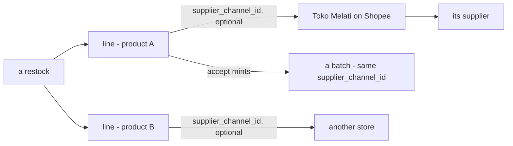

**The spec.**

| | |
| --- | --- |
| `restock_items.supplier_channel_id` | optional · an opaque id into `supplier_service` ([the-supplier-gets-its-own-service](../supplier/context_decision.md#the-supplier-gets-its-own-service)) |
| `restock_problem_items.supplier_channel_id` | as written — ⚠ [Q6b](./restock_clarify.md#question) recommends the problem row point at its line instead |
| `batches.supplier_channel_id` | copied from the line at accept |
| the supplier | reached through the channel — `channel → supplier_id` |

**What it does NOT settle:** a supplier with no channel — a physical vendor
([Q3](./restock_clarify.md#question)); what a line shows once the channel is hard-deleted ([Q1](./restock_clarify.md#question));
and whether one restock may span parcels that arrive separately ([Q4](./restock_clarify.md#question)).

## accept-is-one-transaction-then-an-event

> Owner, in [restock.md](./restock.md) §Restock Accepted Flow *(2026-10-06)*: *"Accept RPC called"* → *"Open Database
> Transaction"* — *"If Any Step Fails, Rollback Transaction and Return Error"* — holding `restock_problem_items`,
> *"calculate price_unit and post in batch_ledger"* and *"post in placement ledger"*; then *"Send Restock Accepted
> Event"* *"if success"*, received by `supplier_service`'s *"Inventory Webhook"* *"by push subscribe"*. It settles the
> shelf half of the clarify's *two-drawings-of-receiving*.

**The verdict.** Accepting a restock is **all or nothing**: the problems found, the batch the good units become — its
unit price computed then — and the shelves they go to are written together, or not at all. Only once that has
committed does the rest of the system hear of it, through one event.

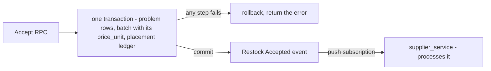

**The spec.**

| | |
| --- | --- |
| inside the transaction | `restock_problem_items` · `batches` + `batch_logs` (+ `batch_price_logs`, per [batch.md](./batch.md)) · `product_placements` + `product_placement_logs` |
| the price | computed at accept — consistent with [staff-accepts-the-restock](../user/context_decision.md#staff-accepts-the-restock) (*"the quantity, the losses, the unit price"*); the formula is still product Q2, Q6 |
| the event | published after commit, no outbox — [no-outbox-the-publish-is-trusted](../../technical/event_architecture/context_decision.md#no-outbox-the-publish-is-trusted) |
| who hears it | `supplier_service`, by push. What it does is [Q10a](./restock_clarify.md#question) |

**What it does NOT settle:** the courier's ask — neither its cost lines nor what the selling team owes for them is in
the transaction ([Q10b](./restock_clarify.md#question)); how many batches, and whether the log rows name the restock
([Q11](./restock_clarify.md#question)); the status change and its trail ([Q9](./restock_clarify.md#question)).

## any-warehouse-member-counts-what-arrived

> Owner, in chat *(2026-10-07)*: *"for 3, all warehouse staff can"*. The question was *"what does Staff type at the door?"*,
> and the owner confirmed it as **who + the recommendation**. It answers [Q6a](./restock_clarify.md#question), as recommended,
> and widens [staff-accepts-the-restock](../user/context_decision.md#staff-accepts-the-restock) from Staff to the whole team.

**The verdict.** Whoever in the warehouse team opens the box counts what is in it and accepts it, in one act. Per line
they type two numbers: **how many arrived**, and **how many of those are broken**. Nobody counts what is not there; the
short units are the difference.

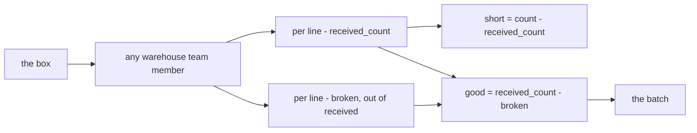

**The spec.**

| | |
| --- | --- |
| who | the warehouse team's Owner, Admin and Staff, plus Root and the Administrator. The build's `RestockRequestFulfillRequest` already allows all five |
| `restock_items.received_count` | 🆕 typed at accept, `>= 0` |
| broken | typed per line, `0 <= broken <= received_count`, written as a `restock_problem_items` row |
| short | derived, `count - received_count`, written as a problem row when above 0. Its type name is [Q6c](./restock_clarify.md#question) |
| good units | `received_count - broken`. They become stock ([restock.md](./restock.md): *"accept the rest of good stock"*) |

**What it does NOT settle:** more arriving than was ordered ([Q6d](./restock_clarify.md#question)), whether the short row
is named `lost` or `missing` ([Q6c](./restock_clarify.md#question)), and the problem row's price being copied rather than typed
([Q6b](./restock_clarify.md#question)).

## a-product-appears-once-per-restock

> Owner, in chat *(2026-10-07)*, in the same answer: the recommendation for #3 included it. It answers
> [Q12](./restock_clarify.md#question), as recommended. supplier.md §Supplier Rule 2 had said *"its choose per product in restock"*.

**The verdict.** A restock lists each product **once**, and the store it was bought from is chosen per product. The
same shirt bought from two stores is two restocks, or one restock under one store.

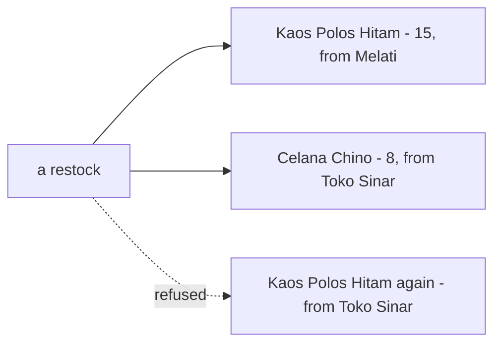

**The spec.**

| | |
| --- | --- |
| `restock_items` | unique (`restock_id`, `product_id`) |
| `restock_problem_items` | its `product_id` finds its line, so no `restock_item_id` is needed and [Critique 6](./restock_clarify.md#critique)'s case cannot happen |
| the batch | one line is one product, one store and one price, which matches one batch per line ([Q11a](./restock_clarify.md#question)) |

**What it costs:** a forwarder's box holding one product from two stores is entered as two restocks, or under one store.

## a-created-restock-tells-the-financial-account

> Owner, in [restock.md](./restock.md) §Restock Created Flow *(2026-10-09)*: *"Create RPC called"* → *"Open Database
> Transaction"* — *"New Restock Record"*, then *"Create Restock Items Records"* — then *"Send Restock Created Event"* *"if
> success"*, received by `financial_account_service`'s webhook *"by push subscribe"*. It is how inventory carries out
> [a-restock-must-name-the-account-that-paid](../financial_account/context_decision.md#a-restock-must-name-the-account-that-paid):
> *"inventory publishes the payment, and this service posts it."*

**The verdict.** Raising a restock is **all or nothing** — the restock and its lines together — and only once that has
committed does the money side hear of it. No inventory transaction is made: nothing has moved yet
([a-transaction-is-made-when-the-act-happens](./transaction_decision.md#a-transaction-is-made-when-the-act-happens)).

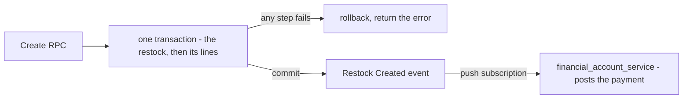

**The spec.**

| | |
| --- | --- |
| inside the transaction | `restocks` (status `ongoing`), then `restock_items` |
| the event | *Restock Created*, after commit, no outbox ([no-outbox-the-publish-is-trusted](../../technical/event_architecture/context_decision.md#no-outbox-the-publish-is-trusted)) |
| who hears it | `financial_account_service`, by push |

**What it does NOT settle** — [restock_clarify Q10d](./restock_clarify.md#question): which account paid (`restocks` has no
column for it) and what the event carries.

## an-accepted-restock-cannot-be-cancelled

> Owner, in [restock.md](./restock.md) §Restock Created Flow *(2026-10-09)*: *"Cancel RPC called"* → *"find and lock
> restock"* → *"check is accepted"* — *[yes] return error*, *[no] updating status* — then *"Send Restock Cancel Event"* to
> `financial_account_service`. It answers [restock_clarify Q5d](./restock_clarify.md#question) in part — **wider than my
> recommendation**, which allowed a cancel from `ongoing` only.

**The verdict.** A restock can be cancelled up to the moment the warehouse accepts it, and never after — accepted goods are
stock, and stock is undone by a rollback ([an-undo-rolls-the-transaction-back-once](./transaction_decision.md#an-undo-rolls-the-transaction-back-once)),
not by a cancel. The check runs under a lock on the restock row, so two cancels cannot both pass it.

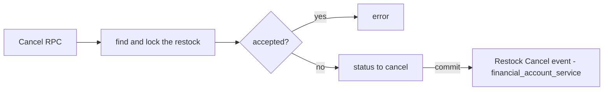

**The spec.**

| | |
| --- | --- |
| allowed | any status but `accepted`, as drawn |
| refused | `accepted` — an error |
| the event | *Restock Cancel*, after commit, to `financial_account_service` |

**What it does NOT settle** — [restock_clarify Q5d, Q13](./restock_clarify.md#question): a cancel after `arrived` (the box
is in the building), after `lost`, or a second time · *did the money come back?* · and accept, which does not take the same
lock.

🔄 *(2026-10-09)* **Narrowed.** *"Any status but `accepted`"* is overtaken: a cancel is from `ongoing` only
([a-restock-is-cancelled-only-while-ongoing](#a-restock-is-cancelled-only-while-ongoing)), and accept takes the same lock
([accept-locks-the-restock](#accept-locks-the-restock)).

## the-warehouse-signs-and-accepts-the-team-does-the-rest

> Owner, in chat *(2026-10-09)*: *"q5 warehouse can accept, sellting team at rest"* — then, asked about `arrived`:
> **the warehouse sets it**. It answers [restock_clarify Q5a](./restock_clarify.md#question) and *who moves each status*, as
> recommended.

**The verdict.** The two statuses that happen **at the warehouse door** belong to the warehouse: signing for the box
(`arrived`) and counting it in (`accepted`). Everything the selling team knows first — raising it, changing it, calling
it off, giving it up as lost — belongs to the selling team.

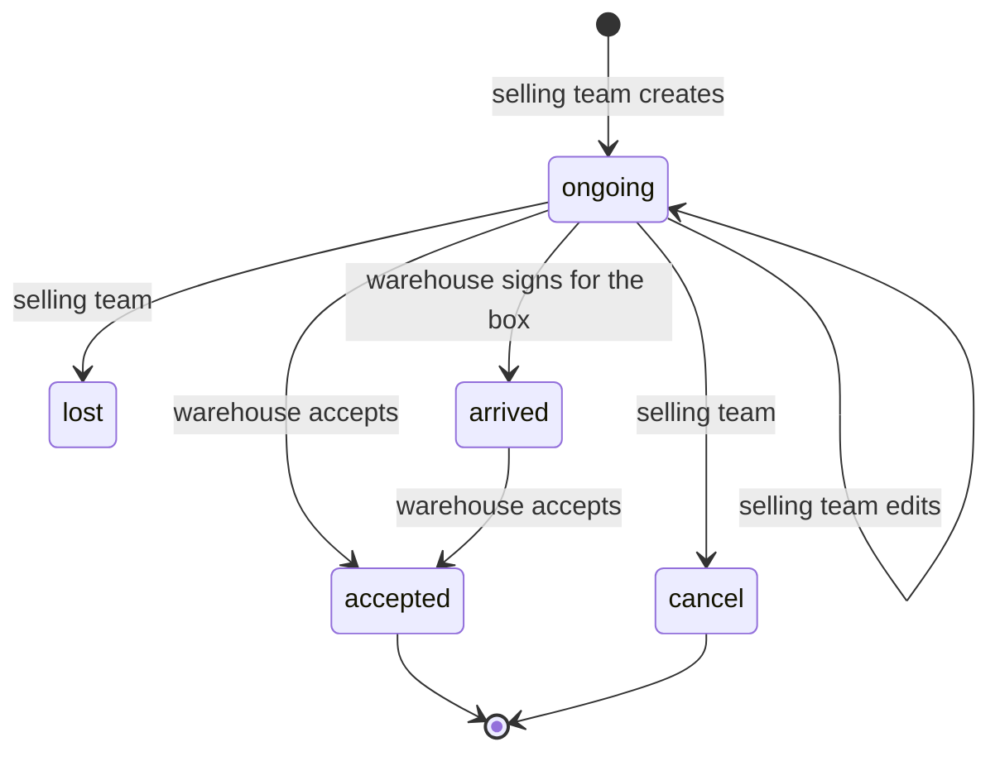

**The spec.**

| status | set by |
| --- | --- |
| `ongoing` · edits · `cancel` · `lost` | the selling team |
| `arrived` | the warehouse team, when it signs for the box — any member, as [any-warehouse-member-counts-what-arrived](#any-warehouse-member-counts-what-arrived) |
| `accepted` | the warehouse team |

**What it does NOT settle** — [restock_clarify Q5](./restock_clarify.md#question): `lost` after `arrived` (5b) · a `lost`
parcel that turns up (5c) · editing after `ongoing` (5e).

## a-restock-is-cancelled-only-while-ongoing

> Owner, in chat *(2026-10-09)*, asked from which statuses the selling team may cancel: **`ongoing` only**. It answers
> [restock_clarify Q5d](./restock_clarify.md#question), as recommended, and narrows
> [an-accepted-restock-cannot-be-cancelled](#an-accepted-restock-cannot-be-cancelled), whose *"any status but `accepted`"*
> it overtakes.

**The verdict.** A restock can be called off only while it is still on its way. Once the box has arrived it is in the
building, and cancelling would leave goods there with no record. Once it is `lost`, the money was spent on goods that
vanished, and a cancel would refund it. A cancel that finds the restock already cancelled is an error — so *Restock
Cancel* is sent once, and the money comes back once.

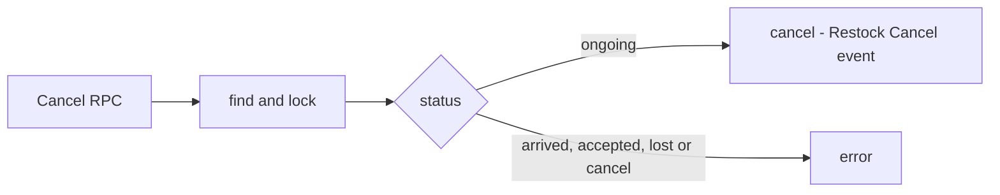

**The spec.**

| | |
| --- | --- |
| allowed from | `ongoing` |
| refused from | `arrived` · `accepted` · `lost` · `cancel` |

## accept-locks-the-restock

> Owner, in chat *(2026-10-09)*: *"q13 lock restock"* — then, asked from which statuses: **`ongoing` or `arrived`**. It
> answers [restock_clarify Q13](./restock_clarify.md#question), as recommended.

**The verdict.** Accept takes the **same lock** as cancel, on the restock row, and checks the status under it. A cancel and
an accept at the same second then queue on the one row: whichever comes second sees what the first did. A box that turns
up before anyone marked it `arrived` can still be accepted.

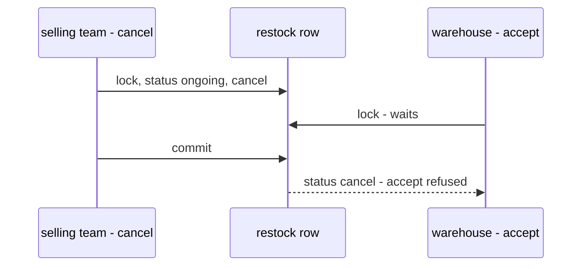

**The spec.**

| | |
| --- | --- |
| first step of accept | find and lock the restock |
| accepted from | `ongoing` · `arrived` |
| refused from | `cancel` · `lost` · `accepted` |
| proven by | the concurrency audit (`audit-sql`) on the built accept and cancel RPCs |

## the-couriers-debt-is-written-in-the-accept

> Owner, in chat *(2026-10-09)*: *"q10 follow your recomendation"*. It answers
> [restock_clarify Q10b](./restock_clarify.md#question) — *what the selling team owes for the courier's ask* — as
> recommended.

**The verdict.** What costs money stays in the transaction; what is cosmetic rides the event. When the warehouse pays a
courier's ask at the door, what the selling team now owes the warehouse is written **inside the accept's database
transaction**, beside the batch whose price already includes it
([the-couriers-ask-is-in-the-unit-price](../product/context_decision.md#the-couriers-ask-is-in-the-unit-price)). An event
can be lost, rarely ([no-outbox-the-publish-is-trusted](../../technical/event_architecture/context_decision.md#no-outbox-the-publish-is-trusted));
a lost debt would leave the warehouse out of pocket with no record.

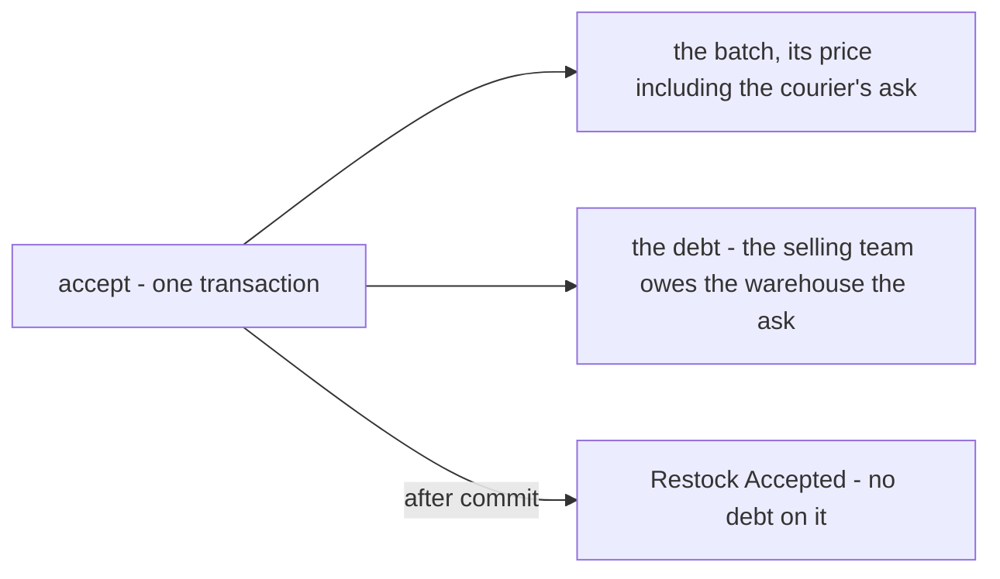

**The spec.**

| | |
| --- | --- |
| where | inside the accept's database transaction |
| not | on *Restock Accepted* |

**What it does NOT settle:** which service's table holds the debt. If it is balance's, a write from inside the accept is a
cross-service write that the accept's one database transaction cannot span — to be asked where balance can answer it.

## restock-accepted-carries-every-line

> Owner, in chat *(2026-10-09)*: *"q10 follow your recomendation"*. It answers
> [restock_clarify Q10c](./restock_clarify.md#question) — *what Restock Accepted carries* — as recommended.

**The verdict.** *Restock Accepted* carries everything its listeners need to work alone: supplier's product-to-channel
link and its daily report read every field below, and should never have to call back.

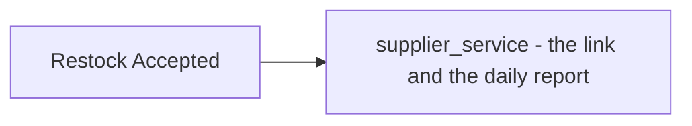

**The spec.**

| | |
| --- | --- |
| the restock | its id |
| both teams | the selling team and the warehouse team |
| when | the accept time |
| every line | product · channel · the accepted count · its price · the broken count · the short count |

## a-restock-names-its-paying-account

> Owner, in chat *(2026-10-09)*: *"q10 follow your recomendation"*. It answers
> [restock_clarify Q10d](./restock_clarify.md#question) — *what Restock Created and Restock Cancel carry* — as
> recommended, carrying out [a-restock-must-name-the-account-that-paid](../financial_account/context_decision.md#a-restock-must-name-the-account-that-paid).

**The verdict.** A restock says, from the moment it is raised, **which of the team's accounts paid for it**, and its two
money events say so too. A cancel says whether the money came back, so the financial account refunds only what was
actually refunded.

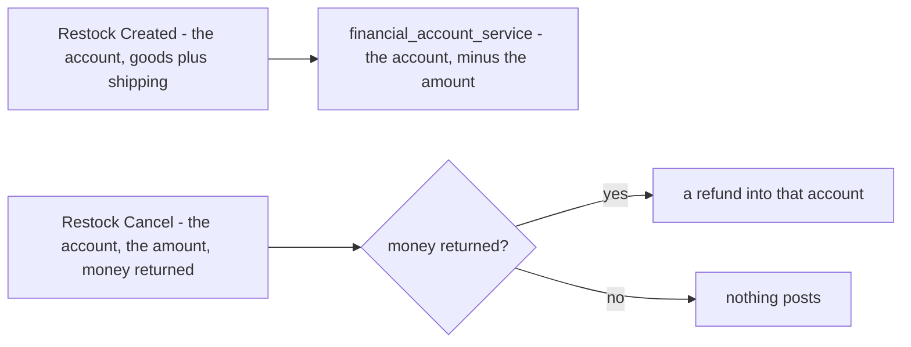

**The spec.**

| | |
| --- | --- |
| `restocks.paid_from_account_id` | 🆕 required at create — one of the team's operational accounts. 🔄 *(2026-10-09)* named **`finance_account_id`** in your [restock.md](./restock.md) — that name stands |
| *Restock Created* carries | the account · the amount, goods plus shipping |
| *Restock Cancel* carries | the account · the amount · **money returned**, yes or no |
| the Cancel RPC | asks *did the money come back?* |

## lost-is-set-only-before-the-box-arrives

> Owner, in chat *(2026-10-09)*: *"q5b,c,e follow your recomendation"*. It answers [restock_clarify Q5b](./restock_clarify.md#question)
> as recommended.

**The verdict.** `lost` means the parcel never came. Once the warehouse has signed for it, the box is in the building, and
a unit missing from it is a problem row at accept, not a lost restock.

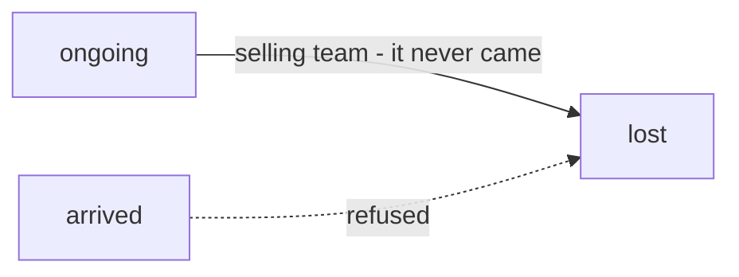

| | |
| --- | --- |
| `lost` from | `ongoing` only |
| a unit missing from an arrived box | a problem row at accept ([any-warehouse-member-counts-what-arrived](#any-warehouse-member-counts-what-arrived)) |

## a-late-lost-box-is-signed-for-as-arrived

> Owner, in chat *(2026-10-09)*: *"q5b,c,e follow your recomendation"*. It answers [restock_clarify Q5c](./restock_clarify.md#question)
> as recommended — needed because [accept-locks-the-restock](#accept-locks-the-restock) refuses an accept from `lost`.

**The verdict.** A parcel given up as lost that turns up after all is the **same restock**: the warehouse signs for it
(`lost → arrived`) and accepts it as usual. The restock stays the record of what is in that box.

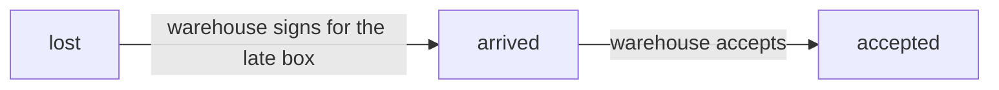

| | |
| --- | --- |
| `arrived` from | `ongoing` · `lost` |
| set by | the warehouse, when it signs ([the-warehouse-signs-and-accepts-the-team-does-the-rest](#the-warehouse-signs-and-accepts-the-team-does-the-rest)) |

## a-restock-is-edited-only-while-ongoing

> Owner, in chat *(2026-10-09)*: *"q5b,c,e follow your recomendation"*. It answers [restock_clarify Q5e](./restock_clarify.md#question)
> as recommended.

**The verdict.** The selling team may change a restock — its lines, its costs, its tracking number — only while it is on
its way. Once the warehouse has the box, the restock is a record of what arrived.

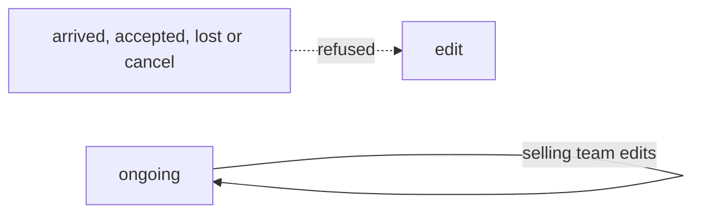

| | |
| --- | --- |
| editable | while `ongoing` |
| by | the selling team |

**What it does NOT settle:** that an edit changing the amount must reach the financial account — *"an edit posts the
difference"* ([a-restock-must-name-the-account-that-paid](../financial_account/context_decision.md#a-restock-must-name-the-account-that-paid))
— and no event carries it ([restock_clarify Q14](./restock_clarify.md#question)).


🔄 *(2026-10-09)* **Widened for the lines:** while `arrived`, a line's count, total and note stay editable until accepted —
[the-lines-stay-editable-until-accepted](#the-lines-stay-editable-until-accepted).
## a-deleted-supplier-still-shows-with-a-badge

> Owner, in chat *(2026-10-09)*: *"for q1, still show but any badge that deleted"*. It answers
> [restock_clarify Q1](./restock_clarify.md#question) — *what a line shows once its supplier or channel is deleted* — as
> recommended, plus a badge.

**The verdict.** A restock line keeps showing its supplier and store after either is deleted, read from the kept rows —
both deletes are soft ([a-store-delete-is-soft-too](../supplier/context_decision.md#a-store-delete-is-soft-too)) — with a
**deleted** badge beside the name. No names are copied onto the line.

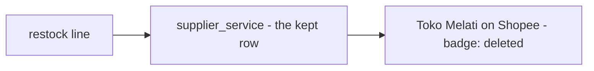

| | |
| --- | --- |
| the name | read from the supplier's and the store's kept rows |
| when deleted | the same name, with a *deleted* badge |
| a rename | reaches past lines — accepted |

## a-line-connects-to-any-teams-supplier-from-a-popup

> Owner, in chat *(2026-10-09)*: *"for 2, in restock page, each item that will restocked have button connect supplier
> channel. and show popup and can search all supplier"*. It answers [restock_clarify Q2](./restock_clarify.md#question) —
> *how does team B's line find team A's supplier?* — as recommended in reach.

**The verdict.** Each line on the restock page has a **Connect Supplier Channel** button. It opens a popup that searches
**every** supplier — any team's, not only the restocking team's — and the line is connected to what is picked.

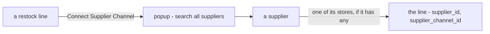

| | |
| --- | --- |
| where | one button per line, on the restock page |
| searches | all suppliers, of every team |
| picks | a supplier, then one of its stores — or the supplier alone ([a-line-may-name-a-supplier-without-a-channel](#a-line-may-name-a-supplier-without-a-channel)) |
| when | while the restock is `ongoing` ([a-restock-is-edited-only-while-ongoing](#a-restock-is-edited-only-while-ongoing)) |

## a-line-may-name-a-supplier-without-a-channel

> Owner, in chat *(2026-10-09)*: *"for 3, follow your recomendation"*. It answers [restock_clarify Q3](./restock_clarify.md#question)
> as recommended.

**The verdict.** A market-stall purchase is not anonymous: a line may name a supplier that sells from no online store.
Both names are optional, and a store, when given, must belong to the supplier given.

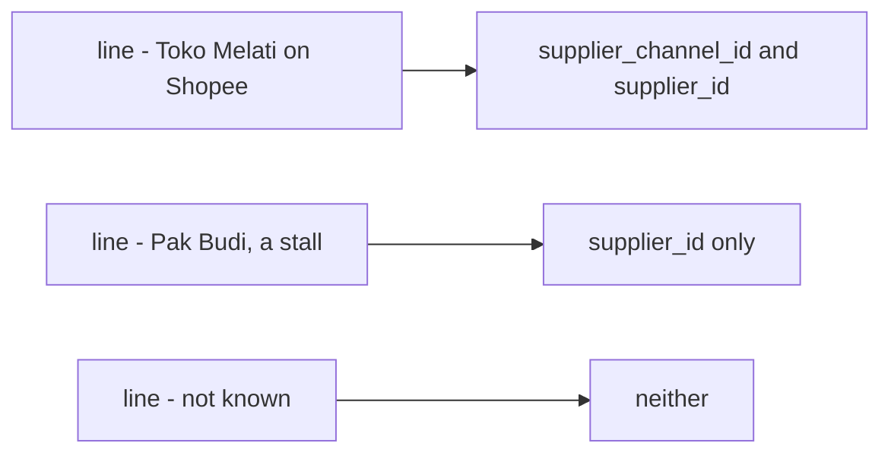

| | |
| --- | --- |
| `restock_items.supplier_id` | 🆕 optional |
| `restock_items.supplier_channel_id` | optional, as before — when set, a store of that `supplier_id` |

**What it does NOT settle:** that a batch minted from a stall line has nowhere to keep the supplier — `batches` carries
`supplier_channel_id` only ([context_clarify Q14h](./context_clarify.md#question)).

## a-restock-is-one-parcel

> Owner, in chat *(2026-10-09)*: *"for 4, what mean one parcel ?, yes it one parcel with contain multiple product
> variation"*. It answers [restock_clarify Q4](./restock_clarify.md#question), as recommended.

**The verdict.** A restock is **what the courier hands over together** — one courier, one tracking number, one arrival —
and it may hold many products and variations. Goods that ship separately are separate restocks. Every status is then true
of the whole restock: it arrived, or it did not.

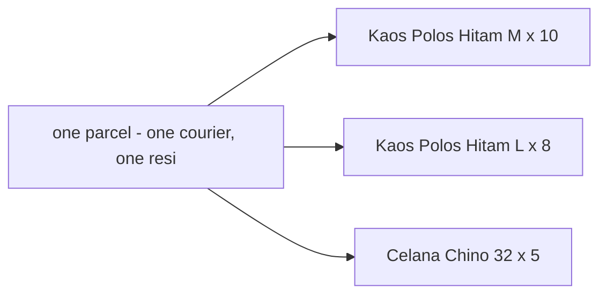

| | |
| --- | --- |
| one restock | one parcel |
| its lines | any number of products and variations, each once ([a-product-appears-once-per-restock](#a-product-appears-once-per-restock)) |
| two parcels | two restocks |

## a-restock-carries-its-tracking-number

> Owner, in chat *(2026-10-09)*: *"for 7, 8, 9, and 11a, follow your recomendation"*. It answers
> [restock_clarify Q7](./restock_clarify.md#question) as recommended.

**The verdict.** The warehouse finds the restock a box belongs to by the **tracking number** on its label, not by
searching open restocks for the products inside. A marketplace issues the number a day after the purchase, so it can be
added while the restock is on its way.

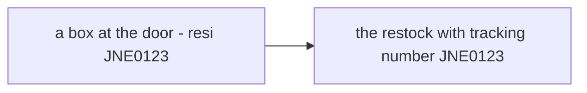

| | |
| --- | --- |
| `restocks.tracking_number` | 🆕 editable while `ongoing` |
| `restocks.courier` | 🆕 editable while `ongoing` |

## a-line-is-typed-as-its-total

> Owner, in chat *(2026-10-09)*: *"for 7, 8, 9, and 11a, follow your recomendation"*. It answers
> [restock_clarify Q8](./restock_clarify.md#question) as recommended.

**The verdict.** A line is typed as the invoice prints it — *3 pcs, Rp 10.000* — and its unit price is worked out for
display. A rounded unit price can never make the line disagree with what was paid. It matches the batch rule that the
value is the truth and the unit price follows from it ([context Q14c](./context_clarify.md#question)).

```mermaid
flowchart LR
  T["typed - 3 pcs, total Rp 10.000"] --> U["shown - Rp 3.333,33 each"]
  T --> B["the batch's value starts from the total"]
```

| | |
| --- | --- |
| typed | `count` and `total` |
| derived | `price_unit`, for display |

## every-status-change-is-logged

> Owner, in chat *(2026-10-09)*: *"for 7, 8, 9, and 11a, follow your recomendation"*. It answers
> [restock_clarify Q9](./restock_clarify.md#question) as recommended.

**The verdict.** A restock keeps a trail: every status change says from what, to what, by whom and when. The restock lists
filter by the person who moved a restock, and a supplier's lead time needs *when it arrived*.

```mermaid
flowchart LR
  A["ongoing to arrived - Ani - 09 Oct 10:14"] --> B["arrived to accepted - Budi - 09 Oct 11:02"]
```

| `restock_logs` | |
| --- | --- |
| `restock_id` · `from_status` · `to_status` · `actor_id` · `description` · `created_at` | one row per status change |

## one-batch-per-line

> Owner, in chat *(2026-10-09)*: *"for 7, 8, 9, and 11a, follow your recomendation"*. It answers
> [restock_clarify Q11a](./restock_clarify.md#question) as recommended.

**The verdict.** Accept mints **one batch for each line that has good units**. A line is one product, one store and one
price — which is exactly what a batch is. Its unit price is the landed price.

```mermaid
flowchart LR
  L1["line - Kaos M, 10 arrived, 1 broken"] --> B1["batch - 9 units"]
  L2["line - Kaos L, 8 arrived, all broken"] --> N["no batch"]
```

| | |
| --- | --- |
| a batch | per line with good units (received − broken > 0) |
| its count | the good units |
| its price | the landed price — the formula is product's |

## an-edit-sends-the-difference

> Owner, in chat *(2026-10-09)*: *"for q14, i follow your recomendation"*. It answers
> [restock_clarify Q14](./restock_clarify.md#question) — *what tells the financial account about an edit?* — as recommended,
> carrying out *"an edit posts the difference, never the whole again"* from
> [a-restock-must-name-the-account-that-paid](../financial_account/context_decision.md#a-restock-must-name-the-account-that-paid).

**The verdict.** When an edit changes what the restock cost, inventory sends **Restock Updated** with the paying account and
the **difference** — so the account moves by exactly what changed, never by the whole again. An edit that changes nothing
paid — a tracking number, a store — sends nothing.

```mermaid
flowchart LR
  E["edit - Kaos 10 pcs to 12 pcs, total Rp 100.000 to Rp 120.000"] --> D{"the amount changed?"}
  D -->|"yes, by Rp 20.000"| U["Restock Updated - the account, minus Rp 20.000"]
  D -->|"no - a tracking number, a store"| N["nothing sent"]
```

**The spec.**

| | |
| --- | --- |
| sent when | an edit changes the amount — goods plus shipping |
| carries | the paying account · the difference, new minus old |
| not sent | for an edit that changes nothing paid |
| when | after the edit commits, like *Created* and *Cancel* |

**What it does NOT settle:** an edit that changes the **paying account** itself
([restock_clarify Q15](./restock_clarify.md#question)).

## an-edit-may-move-the-payment-to-another-account

> Owner, in chat *(2026-10-09)*: *"q15 follow your recomendation"*. It answers [restock_clarify Q15](./restock_clarify.md#question)
> — *may an edit change the paying account?* — as recommended.

**The verdict.** A restock raised as paid from one account but really paid from another can be corrected while it is still
`ongoing`. The amount did not change, so a difference would be zero; instead *Restock Updated* moves the **whole amount**:
back into the old account, out of the new one.

```mermaid
flowchart LR
  E["edit - BCA to Cash, Rp 120.000"] --> U["Restock Updated"]
  U --> O["BCA - plus Rp 120.000"]
  U --> N["Cash - minus Rp 120.000"]
```

**The spec.**

| | |
| --- | --- |
| allowed | while `ongoing` ([a-restock-is-edited-only-while-ongoing](#a-restock-is-edited-only-while-ongoing)) |
| *Restock Updated* carries | the old account and the whole amount back · the new account and the whole amount out |
| with an amount change too | the new account is charged the new amount; the old gets back the old amount |

## the-receipt-is-the-tracking-number

> Owner, in chat *(2026-10-09)*: *"for q16 its tracking number"*. It answers [restock_clarify Q16](./restock_clarify.md#question)
> — *are `receipt` and `receipt_file` the courier's resi or the supplier's invoice?*

**The verdict.** `restocks.receipt` **is** the tracking number — the resi on the box's label — and `receipt_file` is a
photo of it. It is the column [a-restock-carries-its-tracking-number](#a-restock-carries-its-tracking-number) asked for, under
your name.

```mermaid
flowchart LR
  B["a box at the door - resi JNE0123"] --> R["restocks.receipt - JNE0123"]
  P["a photo of the label"] --> F["restocks.receipt_file"]
```

**The spec.**

| | |
| --- | --- |
| `restocks.receipt` | the tracking number — editable while `ongoing` |
| `restocks.receipt_file` | a photo of the label |
| the courier | 🔄 *(2026-10-09)* **`restocks.shipment_id`** in your [restock.md](./restock.md) — a shipment channel, as `ShipmentChannelList` serves them |

## the-problem-price-is-filled-by-the-system

> Owner, in chat *(2026-10-09)*: *"for 6b, system fill automatically and cannot edit by warehouse"*. It answers
> [restock_clarify Q6b](./restock_clarify.md#question) as recommended, and makes it firm: the warehouse cannot change it.

**The verdict.** The warehouse staff at the door type **how many** are broken; the system fills in **what they were
worth**, from the line the selling team typed. The staff never see a price field to get wrong — they do not know what the
selling team paid, and they are not asked.

```mermaid
flowchart LR
  L["the line - 10 pcs, Rp 100.000"] --> P["problem row - 2 broken"]
  S["staff type - 2 broken"] --> P
  P --> V["system fills - Rp 20.000, read-only"]
```

**The spec.**

| | |
| --- | --- |
| typed by the warehouse | the count |
| filled by the system | `price_unit` and `total` — the line's share, `line total × count ÷ line count` |
| editable by the warehouse | no |

## a-loss-is-named-by-where-it-happened

> Owner, in chat *(2026-10-09)*: *"do you misleading about missing / broken ? lost / broken when accepting restock its
> different things lost / broken when stock already stay on rack/placement"*. It answers
> [restock_clarify Q6c](./restock_clarify.md#question) — **against my recommendation** to rename the short unit `missing`.

**The verdict.** `lost` and `broken` keep their names in both places. **The table says where it happened, and so who
bears it**: a row in `restock_problem_items` happened at the door, and the selling team bears it; a row in `batch_logs`
happened on a rack, and the warehouse bears it. My rename fixed only `lost` and left `broken` — which has exactly the same
two meanings — so it was never the real distinction.

```mermaid
flowchart LR
  subgraph door["restock_problem_items - at the door"]
    D1["lost - not in the box"]
    D2["broken - broken in the box"]
  end
  subgraph rack["batch_logs - on a rack"]
    R1["lost - gone from the rack"]
    R2["broken - broken on the rack"]
  end
  door --> S["the selling team bears it"]
  rack --> W["the warehouse bears it"]
```

**The spec.**

| a row in | means | borne by |
| --- | --- | --- |
| `restock_problem_items`, `lost` or `broken` | short or broken at receiving | the selling team ([selling-team-bears-the-receiving-loss](./context_clarify.md#selling-team-bears-the-receiving-loss)) |
| `batch_logs`, `lost` or `broken` | gone or broken in custody | the warehouse ([in-custody-shortfall-is-the-warehouses](./context_clarify.md#in-custody-shortfall-is-the-warehouses)) |

The one rule that keeps it so: **a receiving problem row never posts to the warehouse's payable** — whatever reads a loss
reads it from its table, never from the word alone.

🔄 *(2026-10-09)* **Reversed** the same day: the short unit is `missing` after all —
[a-short-unit-at-the-door-is-missing](#a-short-unit-at-the-door-is-missing). Kept as the record of why `broken` was left alone.

## a-short-unit-at-the-door-is-missing

> Owner, in chat *(2026-10-09)*: *"for 6c, i follow your recomendation "missing""*. It answers
> [restock_clarify Q6c](./restock_clarify.md#question) as first recommended, and **reverses**
> [a-loss-is-named-by-where-it-happened](#a-loss-is-named-by-where-it-happened), recorded the same day.

**The verdict.** A unit that should have been in the box and was not is **`missing`**. `lost` keeps two meanings it can
hold safely — a parcel that never came (a restock status) and a unit gone from a rack (the warehouse's). `broken` keeps its
name in both places; the table still says whether it happened at the door or on a rack.

```mermaid
flowchart LR
  M["10 ordered, 8 in the box - 2 missing"] --> S["the selling team bears it"]
  B["broken in the box - broken"] --> S
  L["gone from a rack - lost"] --> W["the warehouse bears it"]
```

**The spec.**

| | |
| --- | --- |
| `restock_problem_items.problem_type` | `broken` · **`missing`** |
| `missing` | worked out at accept: `count − received`, when above 0 ([any-warehouse-member-counts-what-arrived](#any-warehouse-member-counts-what-arrived)) |
| `lost` | stays: `restocks.status` (a parcel that never came) and `batch_logs` (gone from a rack) |
| the guard | a receiving problem row never posts to the warehouse's payable |

✅ *(2026-10-09)* [restock.md](./restock.md)'s `problem_type` list now says `broken` · `missing`.

## extra-units-are-added-by-the-selling-teams-edit

> Owner, in chat *(2026-10-09)*: *"for 6d, selling edited again the quantity, and warehouse accepting that. im add field
> `note` in restock_items. so it can be use for note "extra stock" that write manually by team selling"*. It answers
> [restock_clarify Q6d](./restock_clarify.md#question) — *12 arrive in a box of 10* — **instead of** my *accept all 12 at the
> door*.

**The verdict.** More in the box than was ordered is the **selling team's** to record, not the warehouse's to decide: the
selling team edits the line's quantity — 10 to 12 — and writes why in the line's new `note` (*"extra stock"*). The
warehouse then accepts what the line now says. The extra units arrive with an owner's word behind them, not a guess at the
door.

```mermaid
sequenceDiagram
  participant W as warehouse
  participant S as selling team
  participant R as restock line
  W->>W: opens the box - 12, the line says 10
  W->>S: tells the selling team
  S->>R: count 10 to 12, note extra stock
  W->>R: accepts 12
```

**The spec.**

| | |
| --- | --- |
| who adds the extra | the selling team — an edit of the line's `count` |
| `restock_items.note` | 🆕 free text written by the selling team, e.g. *extra stock* |
| the warehouse | accepts the edited line |
| the money | an edit that changes the amount sends the difference ([an-edit-sends-the-difference](#an-edit-sends-the-difference)); free extras change nothing paid |

**What it does NOT settle** — [restock_clarify Q17](./restock_clarify.md#question): the box has usually been signed for by
then, and [a-restock-is-edited-only-while-ongoing](#a-restock-is-edited-only-while-ongoing) refuses an edit once it is
`arrived` · and what accept does when more is typed than the line says.

## a-restock-keeps-its-invoice-reference

> Owner, in [restock.md](./restock.md) §Table Should We Have In Restock *(2026-10-09)*: *"`invoice_ref_id`, its string"* on
> `restocks`, announced in chat beside the tracking-number answer.

**The verdict.** Beside the tracking number that finds the box, a restock keeps the **reference of what was paid** — the
store's invoice or order number — so the selling team can show what the money bought.

```mermaid
flowchart LR
  R["a restock"] --> T["receipt - the resi, finds the box"]
  R --> I["invoice_ref_id - the store's invoice, proves the payment"]
```

**The spec.**

| | |
| --- | --- |
| `restocks.invoice_ref_id` | 🆕 a string — the store's invoice or order number |

**What it does NOT settle:** a parcel whose lines come from **two stores** has two invoices, and the column holds one
([restock_clarify Q18](./restock_clarify.md#question)).

## a-restock-has-one-invoice

> Owner, in chat *(2026-10-09)*: *"for q18, its one invoice, but one invoice can contain different product"*. It answers
> [restock_clarify Q18](./restock_clarify.md#question) — *a parcel from two stores has two invoices* — **against my
> recommendation** of one invoice per line.

**The verdict.** A restock is paid by **one invoice**, and that invoice may list many products. `invoice_ref_id` stays on
`restocks`. A marketplace order is one store's, so in practice a restock's lines share a store — the case my question was
about, a forwarder repacking two stores' orders into one box, is not how these teams buy.

```mermaid
flowchart LR
  I["INV-001 - Toko Melati"] --> R["one restock"]
  R --> A["Kaos Hitam M x 10"]
  R --> B["Kaos Hitam L x 8"]
  R --> C["Celana Chino 32 x 5"]
```

**The spec.**

| | |
| --- | --- |
| `restocks.invoice_ref_id` | one per restock — the store's invoice or order number |
| the invoice | may list any number of products and variations |

**If two stores' goods ever share a box:** they are two restocks, each with its own invoice — see
[a-restock-is-one-parcel](#a-restock-is-one-parcel), which that case would strain.

## the-lines-stay-editable-until-accepted

> Owner, in chat *(2026-10-09)*: *"17a → Recommend: while arrived, the selling team can still change the lines (count,
> total, note) until the warehouse accepts … i follow your recomendation"*. It answers
> [restock_clarify Q17a](./restock_clarify.md#question) as recommended, and widens
> [a-restock-is-edited-only-while-ongoing](#a-restock-is-edited-only-while-ongoing) for the lines.

**The verdict.** Extra units are found when the box is opened — after it has been signed for. So the **lines** stay
editable until the warehouse accepts: the selling team can turn 10 into 12 and say why. What describes the parcel and its
payment — the account, the store, the tracking number — still closes when the box arrives.

```mermaid
stateDiagram-v2
  ongoing --> ongoing: selling team edits anything
  ongoing --> arrived: warehouse signs for the box
  arrived --> arrived: selling team edits the lines - count, total, note
  arrived --> accepted: warehouse accepts
  ongoing --> accepted: warehouse accepts
```

**The spec.**

| editable by the selling team | while `ongoing` | while `arrived` | once `accepted` |
| --- | --- | --- | --- |
| a line's count, total, note | ✅ | ✅ | — |
| the paying account, a line's store, the tracking number | ✅ | — | — |

An edit while `arrived` that changes the amount still sends the difference
([an-edit-sends-the-difference](#an-edit-sends-the-difference)).

## accept-refuses-more-than-the-line-says

> Owner, in chat *(2026-10-09)*: *"17b → Recommend: if staff type more than the line says, accept is refused with "ask the
> selling team to add them". i follow your recomendation"*. It answers [restock_clarify Q17b](./restock_clarify.md#question)
> as recommended.

**The verdict.** The warehouse counts; it does not decide what the selling team owns. If staff count more than a line
says, accept stops and asks for the selling team's edit — so every extra unit enters stock with the owner's word behind it
([extra-units-are-added-by-the-selling-teams-edit](#extra-units-are-added-by-the-selling-teams-edit)).

```mermaid
flowchart LR
  C["staff count - 12 received, the line says 10"] --> R["accept refused"]
  R --> M["ask the selling team to add them"]
  M --> E["selling team edits the line to 12"]
  E --> A["accept goes through"]
```

**The spec.**

| | |
| --- | --- |
| refused when | any line's received count is above its count |
| the message | *"more arrived than ordered — ask the selling team to add them"* |
| received below the count | allowed — the difference is a `missing` row ([a-short-unit-at-the-door-is-missing](#a-short-unit-at-the-door-is-missing)) |

## the-warehouse-cost-is-the-couriers-charge-at-the-door

> Owner, in chat *(2026-10-09)*: *"its actually incidental courrier charge when accepting parcel. but onsite its pay by
> warehouse. so warehouse charge compensation to selling."* It answers what `warehouse_additional_cost` is — the question
> in [the-tables-miss-two-decided-fields](./restock_clarify.md#the-tables-miss-two-decided-fields) — as I had read it.

**The verdict.** `warehouse_additional_cost` is the **courier's incidental charge** when the parcel is handed over. The
warehouse pays it on the spot from its own money, and the **selling team compensates the warehouse** — the goods are
theirs, so the cost of getting them in the door is theirs too. It is not a fee the warehouse earns.

```mermaid
flowchart LR
  K["the courier asks Rp 5.000 at the door"] --> W["the warehouse pays it, on the spot"]
  W --> D["the selling team owes the warehouse Rp 5.000"]
  K --> P["it is part of the goods' landed price"]
```

**The spec.**

| | |
| --- | --- |
| what it is | the courier's incidental charge at handover |
| entered | by the warehouse, at accept |
| paid by | the warehouse, on site |
| borne by | the selling team — it compensates the warehouse ([the-couriers-debt-is-written-in-the-accept](#the-couriers-debt-is-written-in-the-accept)) |
| in the price | yes — [the-couriers-ask-is-in-the-unit-price](../product/context_decision.md#the-couriers-ask-is-in-the-unit-price) |
| one money, five names | `warehouse_additional_cost` here · `cod_fee` in balance ([cod-fee-is-the-couriers-incidental-ask](../balance/context_decision.md#cod-fee-is-the-couriers-incidental-ask)) · `AdditionalWarehouseFee` in product · `incidental_fee` in balance's ledger · `warehouse_ops_fee` in the technical stock design |

**What it does NOT settle** — [restock_clarify Q19](./restock_clarify.md#question): one number or a line per charge, and
whether it sits inside `total`.

## the-couriers-charge-stays-out-of-total

> Owner, in chat *(2026-10-09)*: *"no, its outside total"* — to *is the courier's charge inside `total`?* It answers
> [restock_clarify Q19b](./restock_clarify.md#question) as recommended.

**The verdict.** A restock's `total` is what the selling team paid when it raised it — the goods and the agreed shipping —
and it matches the account that paid. The courier's charge at the door was paid by the **warehouse**, later, and is owed
back as its own debt; adding it in would make `total` disagree with the account it came from.

```mermaid
flowchart LR
  S["the selling team's account - at create"] --> T["total Rp 120.000 - goods Rp 100.000 + shipping Rp 20.000"]
  W["the warehouse's cash - at the door"] --> C["the courier's charge Rp 5.000"]
  C --> D["the selling team owes the warehouse Rp 5.000"]
  C -.->|"never added into"| T
```

**The spec.**

| | |
| --- | --- |
| `total` | `subtotal` + `shipment_cost` |
| `warehouse_additional_cost` | outside `total` — its own debt, written at accept ([the-couriers-debt-is-written-in-the-accept](#the-couriers-debt-is-written-in-the-accept)) |
| the landed price | still includes it ([the-couriers-ask-is-in-the-unit-price](../product/context_decision.md#the-couriers-ask-is-in-the-unit-price)) — outside `total`, inside the unit price |

## the-courier-is-paid-once-per-restock

> Owner, in chat *(2026-10-09)*: *"for now, warehouse just can ask once"*. It answers
> [restock_clarify Q19a](./restock_clarify.md#question) — *one number or a line per charge?* — **against my recommendation**
> of cost lines, **for now**.

**The verdict.** A restock carries **one** courier's charge — one amount, entered by the warehouse at accept. If the courier
asks for two things, the warehouse enters them as one sum. *For now*: if several charges per parcel become common, this
becomes a list of lines, and the one amount becomes their sum.

```mermaid
flowchart LR
  K["the courier asks at the door"] --> A["warehouse_additional_cost - one amount"]
  K --> N["its note - what it was for"]
  A --> D["the selling team owes the warehouse"]
```

**The spec.**

| | |
| --- | --- |
| `restocks.warehouse_additional_cost` | one amount per restock, entered at accept |
| its note | **required** when the amount is above 0 — every incidental cost says what it was for ([an-incidental-line-must-say-what-it-was-for](../balance/context_decision.md#an-incidental-line-must-say-what-it-was-for), already decided) |
| *for now* | one charge; a list of lines if several become common |

⚠ [restock.md](./restock.md)'s `restocks` has no column for the note yet.
