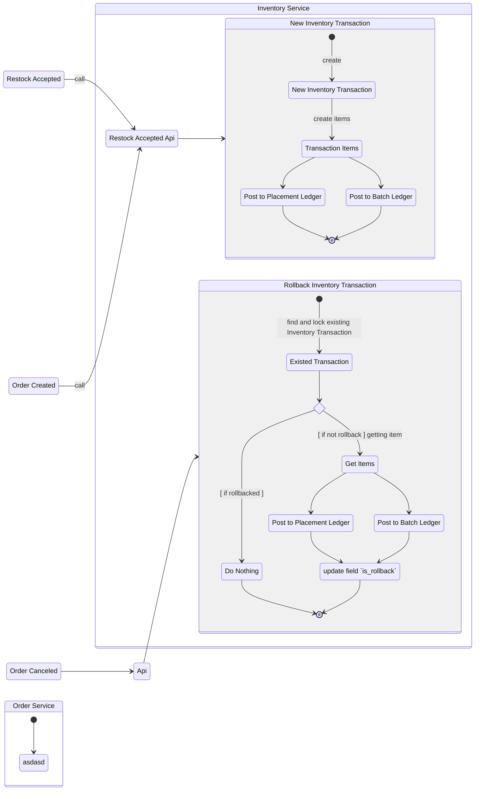

# Transaction.

## General Table That Must Have.

1. Table `inventory_transactions`

    This table is for record all operation that happen in inventory.

    Field that must have:
    - `id` as primary key
    - `warehouse_id`
    - `team_id`
    - `tx_type`
    - `create_by_user_id`
    - `is_rollback`
    - `description`
    - `updated_at`
    - `created_at`

    Field `tx_type` contain:
    - `order`
    - `restock`
    - `return`
    - `sample`
    - `transfer_in`
    - `transfer_out`
    - `adjustment`

2. Table `inventory_transaction_items`

    Field that must have:
    - `id` as primary key
    - `warehouse_id`
    - `transaction_id`
    - `quantity`
    - `total`
    - `created_at`

## Transaction Flow Related.

