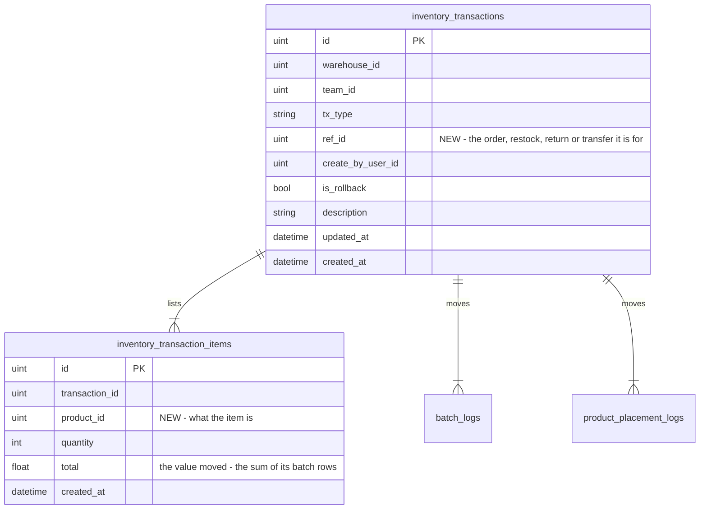
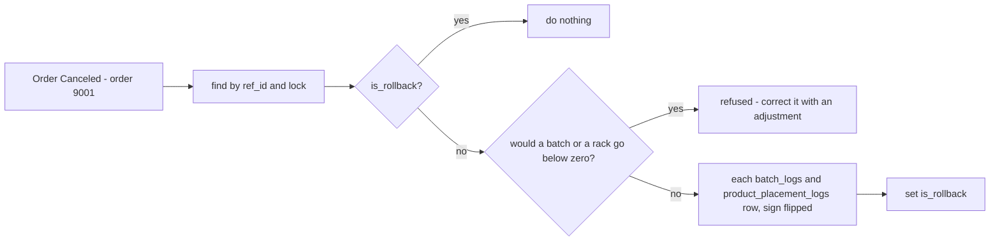
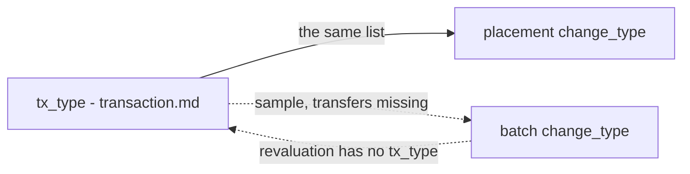

# Clarify — `inventory/transaction.md`

[transaction.md](./transaction.md) is yours — this one is mine. An answered point is deleted; what you settle is recorded
in [transaction_decision.md](./transaction_decision.md).

> **First pass (2026-10-09)**, after you moved the transaction table here from context.md and added items and a rollback.
> Recorded: [a-transaction-lists-its-items](./transaction_decision.md#a-transaction-lists-its-items) (reverses the old
> *no items table*) · [a-transaction-is-made-when-the-act-happens](./transaction_decision.md#a-transaction-is-made-when-the-act-happens)
> (context Q13b) · [an-undo-rolls-the-transaction-back-once](./transaction_decision.md#an-undo-rolls-the-transaction-back-once)
> (context Q13e). ➡ **Re-routed here** from [context Q13](./context_clarify.md#question): 13a, 13c, 13d, 13f — and the
> [Contradiction](#the-two-type-lists-do-not-line-up) over `tx_type`. 🔄 **Withdrawn:** my 13g (*record the person on the
> transaction only*) — your rollback is the reason to keep `actor_id` on the log rows: under the original transaction, the
> log rows are what say **who** rolled it back and **when**.

Siblings: [context_clarify](./context_clarify.md) · [order_clarify](./order_clarify.md) · [opname_clarify](./opname_clarify.md) ·
[restock_clarify](./restock_clarify.md).

---

## Proposed Design

### the tables, with what I would add

### the rollback, reversing the log rows

Your flow, with one change: the reversal reads the **log rows**, which say which batch and which rack, instead of the
items, which do not.

---

## Critique

| | Problem | → Recommend |
| --- | --- | --- |
| **1** | **The rollback cannot find its transaction.** *Order Canceled* says *order 9001*; nothing in `inventory_transactions` says which order a row is for. `restocks.transaction_id` covers a restock, but the order lives in another service | `ref_id` on the transaction — [Q1](#question) |
| **2** | **An item names no product.** `quantity 3, total Rp 32.000` — of what? It also repeats the transaction's `warehouse_id` | `product_id` — [Q2](#question) |
| **3** | **The rollback reverses from the items, and the items cannot say where the units came from.** An order of 3 took 2 from batch 7 and 1 from batch 9, 1 from Rak A and 2 from Rak B. Re-deriving that today, FIFO and fewest-first pick whatever is oldest and lowest **now** — a different batch at a different price, a different rack | reverse the **log rows** — [Q3](#question) |
| **4** | **A rollback can take stock below zero.** A restock of 10 is accepted, 6 are sold, then the restock is rolled back: the batch goes from 4 to −6 | refuse it — [Q4](#question) |

---

## Question

1. **How does a rollback find its transaction?** ➡ Was [context Q13a](./context_clarify.md#question).
   **→ Recommend: `ref_id`** on `inventory_transactions` — the order's, restock's, return's or transfer's id; `tx_type`
   already says which kind. *Order Canceled* then finds `tx_type = order, ref_id = 9001`. An order holding two owners' goods
   has two transactions ([Q7](#question)), and `ref_id` finds both.
2. **What is an item, and what reads it?** ([Critique 2](#critique))
   **→ Recommend:** one item per product moved, with **`product_id`**; `total` is the value moved — the sum of its batch
   rows' `change_valuation`. It reads as the transaction's summary: *"3 Kaos Hitam, Rp 32.000"*. *What else did you mean it
   for?*
3. **Does a rollback reverse the items, or the log rows?** ([Critique 3](#critique))
   **→ Recommend: the log rows** — each `batch_logs` and `product_placement_logs` row of the transaction, sign flipped. The
   units go back to batch 7 and batch 9 at their own prices, to Rak A and Rak B, exactly as they left. The items are then
   only checked against them.
4. **What if a rollback would take a batch or a rack below zero?** ([Critique 4](#critique)) 🔄 *(2026-10-10)* **The rack
   half is forced now** — [a-shelf-never-goes-below-zero](./placement_decision.md#a-shelf-never-goes-below-zero) puts a
   database check on `stock_count`, so a rollback that would go below zero on a rack fails. What is left is the batch.
   **→ Recommend: refuse it**, and correct with an `adjustment` instead. An order's rollback never hits this — it puts units
   back, and [no-cancel-after-the-warehouse-confirms](./order_decision.md#no-cancel-after-the-warehouse-confirms) means they
   were never picked.
5. **Operations with no `tx_type`.** ➡ Was [context Q13c](./context_clarify.md#question). A move between racks, a
   revaluation and a count each write ledger rows and have no type.
   **→ Recommend:** add **`move`**, **`revaluation`**, **`opname`** — not `adjustment` for all three: a move creates no debt,
   and a count does.
6. **What is `sample`?** ➡ Was [context Q13d](./context_clarify.md#question). Units out for a photo, a buyer's sample, a
   giveaway — who asks, and who pays?
   **→ Recommend: the owning team asks, and bears it** — its own goods leaving on its own request, never a warehouse debt.
7. **Whose `team_id` when team B sells team A's goods?** ➡ Was [context Q13f](./context_clarify.md#question).
   **→ Recommend: the stock's owner, A** — both ledgers are keyed by the owning team; the seller is on the order. An order
   holding two owners' goods writes two transactions.

---

# Contradiction

## the-two-type-lists-do-not-line-up

➡ *(2026-10-09)* **Moved here** from [context_clarify](./context_clarify.md#the-two-type-lists-do-not-line-up), because
`tx_type` now lives in this doc.

| | `tx_type` — [transaction.md](./transaction.md) | `change_type` — [placement.md](./placement.md) | `change_type` — [batch.md](./batch.md) |
| --- | --- | --- | --- |
| `order` · `restock` · `return` · `adjustment` | ✅ | ✅ | ✅ |
| `sample` · `transfer_in` · `transfer_out` | ✅ | ✅ | ❌ — a sample's or a transfer's batch row has no valid type. 🔄 *(2026-10-10)* More pressing now: batch.md mints a batch on transfer in, and that batch's first row has no type |
| `revaluation` | ❌ — no transaction type | ❌ | ✅ |
| `broken` · `lost` | — | — | ✅ — reasons inside an `adjustment`, fine |

**→ Recommend** one list, kept here, that both ledger docs point at: every `tx_type`, plus the reasons an `adjustment`
carries (`broken`, `lost`, `found`). A log row writes its transaction's type — or, inside an adjustment, its reason. The
placement side already does exactly this.

