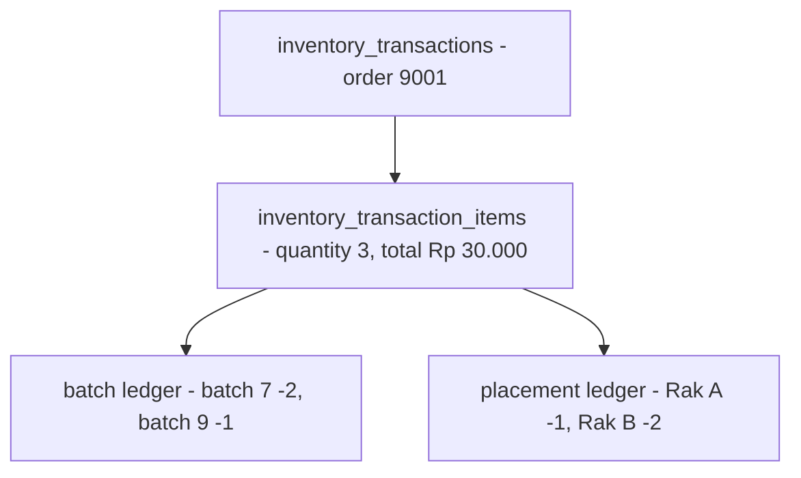
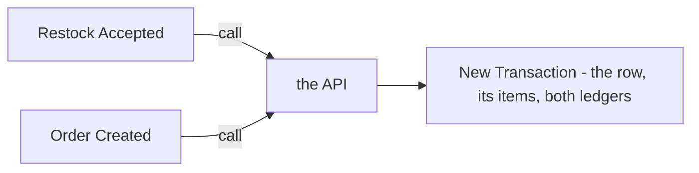
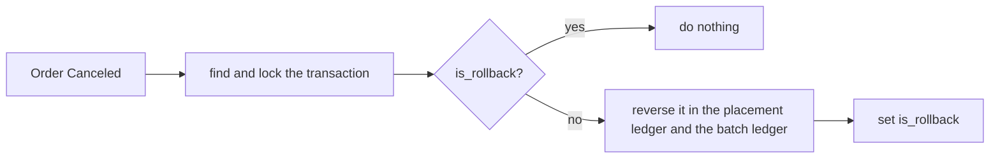

# Decisions — `inventory/transaction.md`

What the owner settled, recorded before it is acted on. **Append-only** — a decision that is later reversed is renamed
and its references grepped (RULE 12), never quietly edited away. The open set is [transaction_clarify.md](./transaction_clarify.md).

| decision | says | from |
| --- | --- | --- |
| [a-transaction-lists-its-items](#a-transaction-lists-its-items) | `inventory_transaction_items` is back — a transaction lists its items, each with a quantity and a total | your transaction.md, 2026-10-09 — **reverses** the *no items table* row of [every-stock-change-belongs-to-a-transaction](./context_decision.md#every-stock-change-belongs-to-a-transaction) |
| [a-transaction-is-made-when-the-act-happens](#a-transaction-is-made-when-the-act-happens) | *Restock Accepted* and *Order Created* each call the API, which creates a new transaction then and there | your transaction.md, 2026-10-09 — answers context Q13b, as recommended |
| [an-undo-rolls-the-transaction-back-once](#an-undo-rolls-the-transaction-back-once) | an undo finds and locks the existing transaction, reverses it in both ledgers and sets `is_rollback`; a second undo does nothing | your transaction.md, 2026-10-09 — answers context Q13e, against my new reversing transaction |

---

## a-transaction-lists-its-items

> Owner, in [transaction.md](./transaction.md) §General Table That Must Have *(2026-10-09)*: `inventory_transaction_items`
> with `id`, `warehouse_id`, `transaction_id`, `quantity`, `total`, `created_at` — and the flow creates them between the
> transaction and the two ledgers. ⚠ **It reverses** the spec row *"`inventory_transaction_items` — none"* in
> [every-stock-change-belongs-to-a-transaction](./context_decision.md#every-stock-change-belongs-to-a-transaction). That
> decision's name — every stock change belongs to a transaction — still holds; only its items row is overtaken.

**The verdict.** A transaction says, in its own rows, **what** it moved — a quantity and a total per item — before the
two ledgers say **where from**: which batches, which racks.

**The spec.**

| | |
| --- | --- |
| `inventory_transaction_items` | `id` · `warehouse_id` · `transaction_id` · `quantity` · `total` · `created_at` |
| written | after the transaction row, before either ledger, in the same database transaction |

**What it does NOT settle** — [transaction_clarify Q2, Q3](./transaction_clarify.md#question): an item names no product ·
what reads the items · and that a rollback cannot reverse from them, since they do not say which batch or rack.

## a-transaction-is-made-when-the-act-happens

> Owner, in [transaction.md](./transaction.md) §Transaction Flow Related *(2026-10-09)*: *Restock Accepted* → *call* →
> *Api* → *New Transaction*; the same for *Order Created*. It answers [context Q13b](./context_clarify.md#question) — *is
> the transaction made at accept, or earlier?* — as recommended.

**The verdict.** A transaction is born when stock actually changes — the restock accepted, the order created — never when
a restock is merely planned. A restock cancelled or lost before it arrives leaves no transaction behind.

**The spec.**

| | |
| --- | --- |
| created by | the call from *Restock Accepted* or *Order Created* |
| inside one database transaction | the transaction row, its items, the placement ledger, the batch ledger |
| `restocks.transaction_id` | set at accept, when the transaction exists |

## an-undo-rolls-the-transaction-back-once

> Owner, in [transaction.md](./transaction.md) *(2026-10-09)*: `is_rollback` and `description` on
> `inventory_transactions`; *Order Canceled* → *Api* → *Rollback Transaction* — *"find and lock existing Inventory
> Transaction"*, *if not rollback* get its items and post to both ledgers, then *"update field `is_rollback`"*; *if
> rollbacked*, *"Do Nothing"*. It answers [context Q13e](./context_clarify.md#question) — *how is a mistake undone?* —
> **against my recommendation** of a new transaction with `reverses_id`.

**The verdict.** An undo is the **same transaction, rolled back**: locked, reversed in both ledgers, and marked. Because
the mark is checked under the lock, an undo runs **once** — a cancel event delivered twice does nothing the second time,
which is exactly what [inventory-returns-stock-on-order-cancelled](../order/context_decision.md#inventory-returns-stock-on-order-cancelled)
asked for.

**The spec.**

| | |
| --- | --- |
| `inventory_transactions.is_rollback` | 🆕 set once, by the rollback |
| `inventory_transactions.description` | 🆕 |
| `updated_at` | kept — the rollback is what updates a transaction |
| triggered by | *Order Canceled* (and any later undo) |
| guard | the transaction row is locked, then `is_rollback` is checked — a second rollback does nothing |

**What it does NOT settle** — [transaction_clarify.md](./transaction_clarify.md): how *Order Canceled* finds the
transaction for order 9001 (Q1) · reversing from the log rows rather than the items (Q3) · a rollback that would take a
batch or a rack below zero (Q4).
