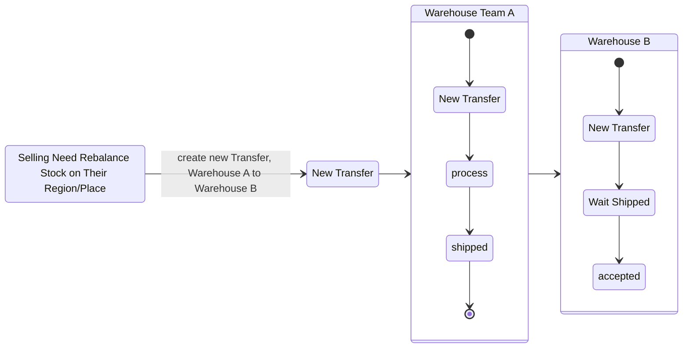

# Warehouse Transfer.

## Table Should Have in Warehouse Transfers.

1. Table `warehouse_transfers`

    Field that must have:
    - `id` as primary key
    - `team_id`
    - `from_warehouse_id`
    - `to_warehouse_id`
    
    - `finance_account_id`
    - `shipment_id`
    - `shipment_cost`
    - `warehouse_additional_cost`
    
    - `receipt`, optional
    - `receipt_file`, optional
    

    - `inbound_transaction_id`
    - `outbound_transaction_id`
    - `status`
    - `note`
    - `total`
    - `updated_at`
    - `created_at`

    Inside `status`:
    - `created`
    - `shipped`
    - `process`
    - `arrived`
    - `accepted`
    - `cancel`
    - `lost`

2. Table `warehouse_transfer_items`
    - `id` as primary key
    - `transfer_id`
    - `product_id`
    - `count`
    - `price_unit`
    - `total`
    - `created_at`

3. Table `warehouse_transfer_problem_items`

    Field that must have:
    - `id` as primary key
    - `transfer_id`
    - `product_id`

    - `problem_type`
    - `note`
    - `count`
    - `price_unit`
    - `total`
    - `created_at`

    Field `problem_type` is contain:
    - `broken`
    - `missing`

## Warehouse Transfer Flow.
