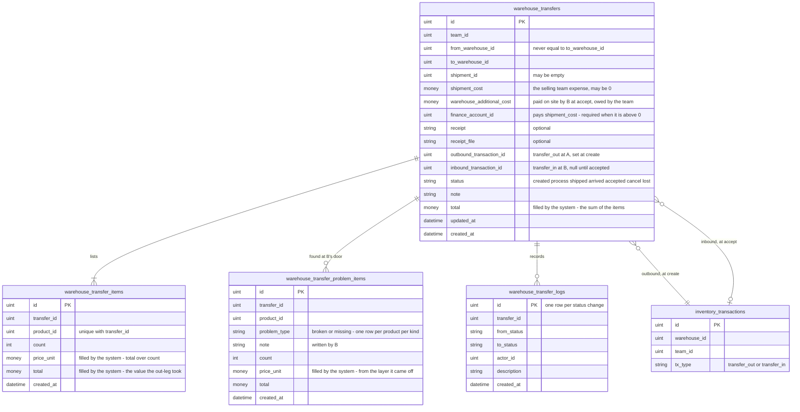
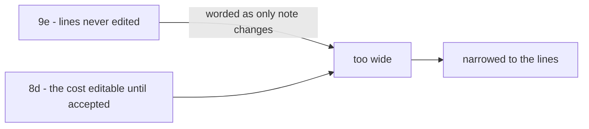

# Clarify — `inventory/warehouse_transfer.md`

[warehouse_transfer.md](./warehouse_transfer.md) is yours, and this file is mine. When a point is answered I delete it
here, and your answer goes in [warehouse_transfer_decision.md](./warehouse_transfer_decision.md).

> ✅ **Twelfth pass (2026-10-10)** — `problem` deleted by you, `warehouse_transfer_teams` removed at your request: **every
> contradiction is closed, and no question is open.**
>
> ✅ **Eleventh pass (2026-10-10)** — Q8d, 8e and 8f answered as recommended. **No question is open. 26 decisions.**
> Two contradictions still wait on your text — `problem` in the status list, and the technical doc's many-team table.
>
> 🔄 **Tenth pass (2026-10-10)** — your `finance_account_id` ([a-transfer-names-its-paying-account](./warehouse_transfer_decision.md#a-transfer-names-its-paying-account)).
> 8d narrows to when the cost is typed and the event; 8e and 8f are untouched.
>
> 🔄 **Ninth pass (2026-10-10)** — your `warehouse_additional_cost`: a transfer has a restock's two costs
> ([a-transfer-has-the-restocks-two-costs](./warehouse_transfer_decision.md#a-transfer-has-the-restocks-two-costs)).
> Q8 narrows to 8d the expense's account, 8e which door, 8f the unit price.
>
> 🔄 **Eighth pass (2026-10-10)** — your three edits checked: [batch-md-mints-nothing-on-transfer-in](#batch-md-mints-nothing-on-transfer-in)
> ✅ closed · the status list ⚠ still has `problem` · the technical doc ❌ unchanged.
>
> ✅ **Seventh pass (2026-10-10)** — Q9b answered as recommended: one line per product, one problem row per product per
> kind, batch prices in the ledger ([a-product-appears-once-per-transfer](./warehouse_transfer_decision.md#a-product-appears-once-per-transfer)).
> **21 decisions. Only Q8 is open**, plus your text in three places.
>
> ✅ **Sixth pass (2026-10-10)** — Q9a, 9c, 9d and 9e answered as recommended ([the index](./warehouse_transfer_decision.md)):
> the log, no self-transfer, a lock before every status change, and no editing lines. **20 decisions.** Open: Q8 and 9b.
>
> ✅ **Fifth pass (2026-10-10)** — Q2, Q3, Q4, Q6, 8b and 8c answered as recommended, and 8a's payer: the selling team.
> **16 decisions** now stand ([the index](./warehouse_transfer_decision.md)). The decided design (the journey, the seven
> statuses, the batch side) moved there with its diagrams, so this file is pruned to what is still open: **how the trip's
> money moves (Q8), four small rules (Q9), and your text in three places** (the contradictions below).
>
> Earlier passes, all on 2026-10-10: your tables, your flow, two table edits, and answers in chat. ➡ Moved here back then,
> both now decided: where in-transit goods live, from [technical stock Q1](../../technical/stock/design_clarify.md#question)
> (Q3), and who bears a loss in transit, from [context Critique 6](./context_clarify.md#critique) (Q7).

Siblings: [context_clarify](./context_clarify.md) · [restock_clarify](./restock_clarify.md) ·
[transaction_clarify](./transaction_clarify.md) · [placement_clarify](./placement_clarify.md) ·
[opname_clarify](./opname_clarify.md) · [order_clarify](./order_clarify.md).

---

## Proposed Design

### the tables, as decided

---

## Critique

None open. Every critique raised on this doc has been answered — the answers are in
[the decision file](./warehouse_transfer_decision.md).

---

## Question

1. ✅ **Answered** — [the-team-opens-the-sender-ships-the-receiver-accepts](./warehouse_transfer_decision.md#the-team-opens-the-sender-ships-the-receiver-accepts) ·
   [the-selling-team-cancels-and-sets-lost](./warehouse_transfer_decision.md#the-selling-team-cancels-and-sets-lost) ·
   [a-warehouse-asks-the-team-to-open-a-transfer](./warehouse_transfer_decision.md#a-warehouse-asks-the-team-to-open-a-transfer).
2. ✅ **Answered** — [a-transfer-takes-from-the-sender-at-create](./warehouse_transfer_decision.md#a-transfer-takes-from-the-sender-at-create).
3. ✅ **Answered** — [the-transfer-is-where-goods-in-transit-are](./warehouse_transfer_decision.md#the-transfer-is-where-goods-in-transit-are).
4. ✅ **Answered** — [cancel-before-processed-lost-only-in-transit](./warehouse_transfer_decision.md#cancel-before-processed-lost-only-in-transit) ·
   [a-transfer-has-seven-statuses](./warehouse_transfer_decision.md#a-transfer-has-seven-statuses).
5. ✅ **Answered** — [the-system-fills-a-transfers-prices](./warehouse_transfer_decision.md#the-system-fills-a-transfers-prices).
6. ✅ **Answered** — [the-receiver-mints-one-batch-per-source-batch](./warehouse_transfer_decision.md#the-receiver-mints-one-batch-per-source-batch).
7. ✅ **Answered** — [the-selling-team-bears-broken-missing-and-lost](./warehouse_transfer_decision.md#the-selling-team-bears-broken-missing-and-lost) ·
   [broken-and-missing-at-the-door-are-problem-rows](./warehouse_transfer_decision.md#broken-and-missing-at-the-door-are-problem-rows).
8. ✅ **Answered** — [a-transfer-has-the-restocks-two-costs](./warehouse_transfer_decision.md#a-transfer-has-the-restocks-two-costs) ·
   [a-transfer-names-its-paying-account](./warehouse_transfer_decision.md#a-transfer-names-its-paying-account) ·
   [the-shipping-expense-reaches-the-account-by-event](./warehouse_transfer_decision.md#the-shipping-expense-reaches-the-account-by-event) ·
   [the-on-site-charge-is-paid-by-b-at-accept](./warehouse_transfer_decision.md#the-on-site-charge-is-paid-by-b-at-accept) ·
   [a-transfer-never-changes-a-units-price](./warehouse_transfer_decision.md#a-transfer-never-changes-a-units-price).
9. ✅ **Answered** — [every-transfer-status-change-is-logged](./warehouse_transfer_decision.md#every-transfer-status-change-is-logged) ·
   [a-product-appears-once-per-transfer](./warehouse_transfer_decision.md#a-product-appears-once-per-transfer) ·
   [a-transfer-never-goes-to-its-own-warehouse](./warehouse_transfer_decision.md#a-transfer-never-goes-to-its-own-warehouse) ·
   [a-transfer-is-locked-before-any-status-change](./warehouse_transfer_decision.md#a-transfer-is-locked-before-any-status-change) ·
   [a-transfers-lines-are-never-edited](./warehouse_transfer_decision.md#a-transfers-lines-are-never-edited).

---

# Contradiction

## the-flow-and-the-status-list-disagree

✅ *(2026-10-10)* **Closed by your edit** — `problem` is gone, and your status list is exactly the seven of
[a-transfer-has-seven-statuses](./warehouse_transfer_decision.md#a-transfer-has-seven-statuses). The flow draws the main
path, and every step on it is in the list.

## batch-md-mints-nothing-on-transfer-in

✅ *(2026-10-10)* **Closed by your edit** — [batch.md](./batch.md) now reads *"batch is minted by restock, return, transfer
in and adjustment"*, which matches [the-receiver-mints-one-batch-per-source-batch](./warehouse_transfer_decision.md#the-receiver-mints-one-batch-per-source-batch).
What batch.md still lacks is a `change_type` for a transfer row, and that is its own contradiction,
[the-two-type-lists-do-not-line-up](./transaction_clarify.md#the-two-type-lists-do-not-line-up).

## one-team-or-many-per-transfer

✅ *(2026-10-10)* **Closed** — `warehouse_transfer_teams` removed from [technical/stock/design.md](../../technical/stock/design.md)
(its note and its table), at your request. One team per transfer, as your doc says. ⚠ That doc's `warehouse_transfers` now
names no team at all; it catches up when the doc moves to `technical/inventory/` ([context Q10](./context_clarify.md#question)).

## only-note-changes-was-too-wide

✅ *(2026-10-10)* **Found and fixed in the same pass** — recorded so the pattern stays visible.

| | says |
| --- | --- |
| [a-transfers-lines-are-never-edited](./warehouse_transfer_decision.md#a-transfers-lines-are-never-edited) | *"a wrong transfer is cancelled while `created` and made again; only `note` changes"* |
| [the-shipping-expense-reaches-the-account-by-event](./warehouse_transfer_decision.md#the-shipping-expense-reaches-the-account-by-event) | the team types `shipment_cost` and its account until `accepted` |

**The first was wrong, and only in its wording.** Q9e asked about the **lines**; *"only `note`"* reached past them to the
whole transfer. The decision index now narrows it to the lines.
**→ Recommend:** a rule about what may change names the rows it covers, never "only X" across a whole record.

