# Decisions — `inventory/warehouse_transfer.md`

What the owner settled, recorded before it is acted on. **Append-only** — a decision that is later reversed is renamed
and its references grepped (RULE 12), never quietly edited away. The open set is
[warehouse_transfer_clarify.md](./warehouse_transfer_clarify.md).

| decision | says | from |
| --- | --- | --- |
| [the-team-opens-the-sender-ships-the-receiver-accepts](#the-team-opens-the-sender-ships-the-receiver-accepts) | the selling team opens a transfer to rebalance its stock; the sending warehouse processes and ships it; the receiving warehouse sees it from the start, waits for it, and accepts it | your §Warehouse Transfer Flow, 2026-10-10 — answers the core of Q1, as recommended |
| [the-selling-team-cancels-and-sets-lost](#the-selling-team-cancels-and-sets-lost) | the selling team cancels a transfer, and the selling team sets it `lost` — never a warehouse | chat, 2026-10-10 — answers Q1a and Q1b, as recommended — 🔄 its windows set by [cancel-before-processed-lost-only-in-transit](#cancel-before-processed-lost-only-in-transit) |
| [a-warehouse-asks-the-team-to-open-a-transfer](#a-warehouse-asks-the-team-to-open-a-transfer) | a warehouse never opens a transfer itself; when it needs goods moved, it asks the team that owns them | chat, 2026-10-10 — answers Q1c, as recommended |
| [cancel-before-processed-lost-only-in-transit](#cancel-before-processed-lost-only-in-transit) | a cancel only before the sending warehouse confirms (`processed`), as for an order; `lost` only after `shipped` and before the receiving warehouse signs (`arrived`) | chat, 2026-10-10 — answers the windows in Q4, as recommended |
| [a-transfer-may-carry-a-tracking-number](#a-transfer-may-carry-a-tracking-number) | `receipt` (the tracking number) and `receipt_file` (a photo of the label), both optional | your §Table Should Have edit, 2026-10-10 — answers the tracking-number half of Q8, as recommended, and makes it optional |
| [broken-and-missing-at-the-door-are-problem-rows](#broken-and-missing-at-the-door-are-problem-rows) | what the receiving warehouse finds wrong is written as `warehouse_transfer_problem_items`, per product, `broken` or `missing` — the same as a restock | your §Table Should Have edit, 2026-10-10 — answers how Q7 is recorded, as recommended |
| [the-selling-team-bears-broken-missing-and-lost](#the-selling-team-bears-broken-missing-and-lost) | a unit broken or missing at the receiving door, and a box that never comes, are the selling team's loss — never a warehouse's | chat, 2026-10-10 — answers Q7, as recommended |
| [the-system-fills-a-transfers-prices](#the-system-fills-a-transfers-prices) | an item's `total` is the value the out-leg took, its `price_unit` that total over the count; the transfer's `total` sums its items; a problem row is priced from the layer it came off — nobody types a price | chat, 2026-10-10 — answers Q5, as recommended |
| [a-transfer-names-its-courier-and-cost](#a-transfer-names-its-courier-and-cost) | `warehouse_transfers.shipment_id` and `shipment_cost` | your §Table Should Have edit, 2026-10-10 — answers the courier half of Q8, as recommended |
| [a-transfer-problem-row-carries-a-note](#a-transfer-problem-row-carries-a-note) | `warehouse_transfer_problem_items.note` | your §Table Should Have edit, 2026-10-10 — answers Q9e, as recommended |
| [a-transfer-takes-from-the-sender-at-create](#a-transfer-takes-from-the-sender-at-create) | the `transfer_out` is written at create — shelves fewest first, batches oldest first; too few at A and the create fails | chat, 2026-10-10 — answers Q2, as recommended |
| [the-transfer-is-where-goods-in-transit-are](#the-transfer-is-where-goods-in-transit-are) | between the two legs the units are in neither warehouse's book, but in the transfer; no in-transit placement | chat, 2026-10-10 — answers Q3, as recommended |
| [a-transfer-has-seven-statuses](#a-transfer-has-seven-statuses) | `created`, `process`, `shipped`, `arrived`, `accepted`, `cancel`, `lost` — `problem` dropped; a lost box that turns up goes on to `arrived` | chat, 2026-10-10 — answers Q4a and Q4b, as recommended — 🔄 accept from `shipped` confirmed by [a-transfer-is-locked-before-any-status-change](#a-transfer-is-locked-before-any-status-change) |
| [the-receiver-mints-one-batch-per-source-batch](#the-receiver-mints-one-batch-per-source-batch) | B mints one batch per batch the out-leg took from, with its price, expiry and supplier | chat, 2026-10-10 — answers Q6, as recommended |
| [the-selling-team-pays-for-the-trip](#the-selling-team-pays-for-the-trip) | the selling team pays `shipment_cost`, and the cost stays out of the unit price | chat, 2026-10-10 — answers Q8a's payer and Q8b, as recommended |
| [a-transfer-may-travel-without-a-courier](#a-transfer-may-travel-without-a-courier) | `shipment_id` may be empty and `shipment_cost` 0, as `receipt` is optional | chat, 2026-10-10 — answers Q8c, as recommended |
| [every-transfer-status-change-is-logged](#every-transfer-status-change-is-logged) | `warehouse_transfer_logs` — one row per status change: from, to, who, why, when | chat, 2026-10-10 — answers Q9a, as recommended |
| [a-transfers-lines-are-never-edited](#a-transfers-lines-are-never-edited) | a wrong transfer is cancelled while `created` and made again; only `note` changes | chat, 2026-10-10 — answers Q9e, as recommended — 🔄 *"only `note` changes"* narrowed to the lines by [the-shipping-expense-reaches-the-account-by-event](#the-shipping-expense-reaches-the-account-by-event): the cost and its account stay editable until accepted |
| [a-transfer-never-goes-to-its-own-warehouse](#a-transfer-never-goes-to-its-own-warehouse) | `from_warehouse_id` is never `to_warehouse_id`, checked by the database | chat, 2026-10-10 — answers Q9c, as recommended |
| [a-transfer-is-locked-before-any-status-change](#a-transfer-is-locked-before-any-status-change) | every status change locks the transfer row, then checks, then writes; accept runs once, from `arrived` or `shipped` | chat, 2026-10-10 — answers Q9d, as recommended |
| [a-product-appears-once-per-transfer](#a-product-appears-once-per-transfer) | one line per product, one problem row per product per kind; batches at different prices live in the ledger, not on the line | chat, 2026-10-10 — answers Q9b, as recommended |
| [a-transfer-has-the-restocks-two-costs](#a-transfer-has-the-restocks-two-costs) | `shipment_cost` is the selling team's expense; `warehouse_additional_cost` is paid on site by the warehouse and owed back by the team, like a restock | your §Table Should Have edit and chat, 2026-10-10 — answers the core of Q8, in part against my *b* |
| [a-transfer-names-its-paying-account](#a-transfer-names-its-paying-account) | `finance_account_id` — the selling team's account that pays `shipment_cost` | your §Table Should Have edit, 2026-10-10 — answers the account half of Q8d, as recommended |
| [the-shipping-expense-reaches-the-account-by-event](#the-shipping-expense-reaches-the-account-by-event) | the team types `shipment_cost` until accepted; each save sends the account and the difference to `financial_account_service`; the account is required only when the cost is above 0 | chat, 2026-10-10 — answers Q8d, as recommended |
| [the-on-site-charge-is-paid-by-b-at-accept](#the-on-site-charge-is-paid-by-b-at-accept) | B pays the courier's on-site charge and enters it at accept; the team's debt to B is written inside the accept | chat, 2026-10-10 — answers Q8e, as recommended |
| [a-transfer-never-changes-a-units-price](#a-transfer-never-changes-a-units-price) | neither cost enters B's unit price — a transfer moves, it does not buy | chat, 2026-10-10 — answers Q8f, as recommended, unlike a restock |
| [the-sender-enters-the-courier-at-ship](#the-sender-enters-the-courier-at-ship) | Warehouse A enters the courier, the tracking number and the label photo when it ships; the team enters only the cost and its account | chat, 2026-10-10 — raised by the screens, as recommended |

---

## the-team-opens-the-sender-ships-the-receiver-accepts

> Owner, in [warehouse_transfer.md](./warehouse_transfer.md) §Warehouse Transfer Flow *(2026-10-10)*: *"Selling Need
> Rebalance Stock on Their Region/Place"* → *"create new Transfer, Warehouse A to Warehouse B"*; Warehouse Team A:
> *New Transfer → process → shipped*; Warehouse B: *New Transfer → Wait Shipped → accepted*. It answers the core of
> [warehouse_transfer_clarify Q1](./warehouse_transfer_clarify.md#question) — *who moves each status?* — as recommended.

**The verdict.** A transfer is the **owner's** decision about where its goods should be: the selling team opens it when
one region needs more of its stock. Each warehouse then does its own half. The sender processes and ships, and the
receiver, which knows from the start that the goods are coming, accepts them.

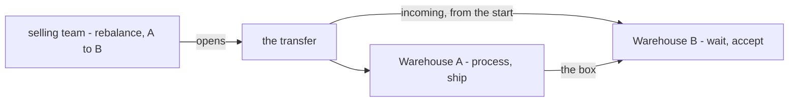

**The spec.**

| | |
| --- | --- |
| opens a transfer | the selling team that owns the goods, naming the sending and the receiving warehouse |
| why | to rebalance its stock between regions or places |
| the sending warehouse | processes the transfer, then ships it |
| the receiving warehouse | sees it as soon as it is opened, waits until it is shipped, then accepts it |

**What it does NOT settle** — [warehouse_transfer_clarify.md](./warehouse_transfer_clarify.md): who cancels a transfer, and
until when · who sets `lost` · whether a warehouse may open one itself (Q1) · whether *process* is a status, and the
statuses the flow does not draw: `arrived`, `cancel`, `lost`, `problem` (Q4,
[the-flow-and-the-status-list-disagree](./warehouse_transfer_clarify.md#the-flow-and-the-status-list-disagree)) · when each leg is
written (Q2).

## the-selling-team-cancels-and-sets-lost

> Owner, in chat *(2026-10-10)*: *"for 1a, selling team cancel it. 1b, selling team set lost"*. It answers
> [warehouse_transfer_clarify Q1a and Q1b](./warehouse_transfer_clarify.md#question) — *who cancels, and who sets `lost`?*
> — as recommended. **Who** is settled here. **When** each is allowed is still open in
> [Q4](./warehouse_transfer_clarify.md#question), because it depends on whether *process* becomes a status.

**The verdict.** The two statuses that end a transfer early belong to the team whose goods they are. A warehouse ships,
signs for and accepts the goods. It never cancels a transfer, and never declares the goods gone.

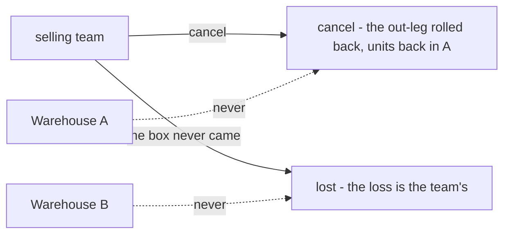

**The spec.**

| | |
| --- | --- |
| cancel | the selling team only; it rolls the `transfer_out` back ([an-undo-rolls-the-transaction-back-once](./transaction_decision.md#an-undo-rolls-the-transaction-back-once)) |
| `lost` | the selling team only |
| a warehouse | cannot cancel and cannot set `lost` |

**What it does NOT settle** — the windows, in [Q4](./warehouse_transfer_clarify.md#question): I recommend cancel only from
`created` (before A confirms) and `lost` only from `shipped` (before B signs) · who bears a lost box, in
[Q7](./warehouse_transfer_clarify.md#question).

## a-warehouse-asks-the-team-to-open-a-transfer

> Owner, in chat *(2026-10-10)*: *"1c no, ask the team"*. It answers
> [warehouse_transfer_clarify Q1c](./warehouse_transfer_clarify.md#question) — *may a warehouse open a transfer itself, for
> example when it is closing?* — as recommended.

**The verdict.** Only the team that owns the goods decides where they are kept. A warehouse that needs goods moved (because
it is closing, or full) asks the team, and the team opens the transfer. A warehouse closing with several teams' goods on its
racks means one request per team, and one transfer per team.

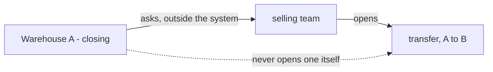

**The spec.**

| | |
| --- | --- |
| who may open a transfer | the selling team that owns the goods, and nobody else |
| a warehouse's request | made outside the system, for now. Nothing records it |
| goods of several teams | one transfer per team, as [one-team-or-many-per-transfer](./warehouse_transfer_clarify.md#one-team-or-many-per-transfer) recommends |

## cancel-before-processed-lost-only-in-transit

> Owner, in chat *(2026-10-10)*: *"cancel only before the sending warehouse confirms (processed), the same as an order,
> only after the box is shipped and before the receiving warehouse signs for it"*. It answers the windows in
> [warehouse_transfer_clarify Q4](./warehouse_transfer_clarify.md#question) — *when may the team cancel, and when may it set
> `lost`?* — as recommended.

**The verdict.** Each early ending has a window, and the window is set by what has physically happened. A cancel is
allowed only while nobody has touched the goods: once Warehouse A confirms, it is picking them. `lost` is allowed only while
the box is with the courier: before it ships, the goods are still in A, and once B signs for the box, it is not lost.

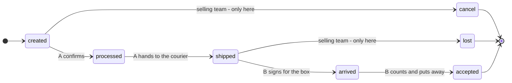

**The spec.**

| | |
| --- | --- |
| cancel | only from `created`. From `processed` on it is refused with an error — the same as an order ([no-cancel-after-the-warehouse-confirms](./order_decision.md#no-cancel-after-the-warehouse-confirms)) |
| `lost` | only from `shipped`. Before it, the goods are still at A. From `arrived` on it is refused — the same as a restock ([lost-is-set-only-before-the-box-arrives](./restock_decision.md#lost-is-set-only-before-the-box-arrives)) |
| requires | `processed` and `arrived` stored as statuses, because each window is checked against them |
| the guard | the transfer row is locked, then its status is checked. A cancel racing A's confirm cannot both succeed — the same as [an-accepted-restock-cannot-be-cancelled](./restock_decision.md#an-accepted-restock-cannot-be-cancelled) |

**What it does NOT settle** — [warehouse_transfer_clarify Q4](./warehouse_transfer_clarify.md#question): what `problem` is
for · whether a lost box that turns up goes on to `arrived` · and your `status` list, which still lacks `processed` and
`arrived` ([the-flow-and-the-status-list-disagree](./warehouse_transfer_clarify.md#the-flow-and-the-status-list-disagree)).

## a-transfer-may-carry-a-tracking-number

> Owner, in [warehouse_transfer.md](./warehouse_transfer.md) §Table Should Have in Warehouse Transfers *(2026-10-10)*:
> `warehouse_transfers` gains *"`receipt`, optional"* and *"`receipt_file`, optional"*. It answers the tracking-number half
> of [warehouse_transfer_clarify Q8](./warehouse_transfer_clarify.md#question) — *how does it travel?* — as recommended,
> and makes both fields optional, which I had not proposed.

**The verdict.** A transfer that travels by courier keeps the courier's tracking number and a photo of the label. These are
the same two fields a restock has ([the-receipt-is-the-tracking-number](./restock_decision.md#the-receipt-is-the-tracking-number)).
A transfer without them is still a valid transfer.

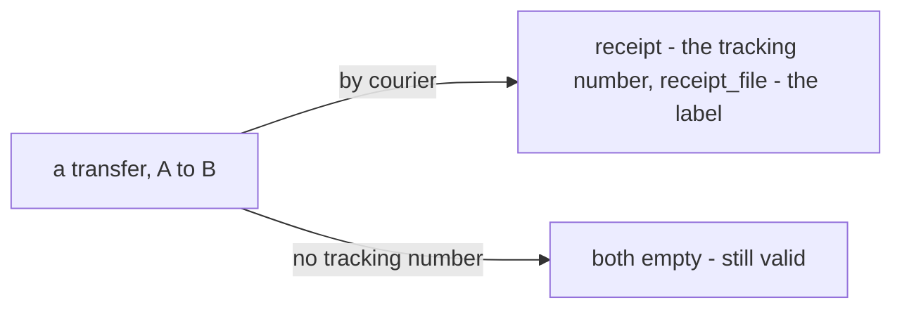

**The spec.**

| | |
| --- | --- |
| `warehouse_transfers.receipt` | the courier's tracking number — optional |
| `warehouse_transfers.receipt_file` | a photo of the label — optional |

**What it does NOT settle** — [Q8](./warehouse_transfer_clarify.md#question): why the fields are optional (I read it as a
transfer that may travel without a courier, for example in a warehouse's own vehicle) · which courier (`shipment_id`) ·
the cost of the trip, and who pays it.

## broken-and-missing-at-the-door-are-problem-rows

> Owner, in [warehouse_transfer.md](./warehouse_transfer.md) §Table Should Have in Warehouse Transfers *(2026-10-10)*:
> `warehouse_transfer_problem_items` with `id`, `transfer_id`, `product_id`, `problem_type` (`broken`, `missing`), `count`,
> `price_unit`, `total`, `created_at`. It answers how a unit found wrong at the receiving door is recorded
> ([warehouse_transfer_clarify Q7](./warehouse_transfer_clarify.md#question), Critique 4) — as recommended: the same rows a
> restock has.

**The verdict.** What Warehouse B's count finds wrong is written down per product and per kind. The kinds are the same two
a restock uses at its door ([a-short-unit-at-the-door-is-missing](./restock_decision.md#a-short-unit-at-the-door-is-missing)):
`missing` is sent but not in the box, and `broken` is in the box but unusable. The good units are the rest.

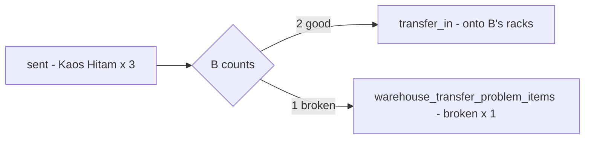

**The spec.**

| | |
| --- | --- |
| `warehouse_transfer_problem_items` | `id` · `transfer_id` · `product_id` · `problem_type` · `count` · `price_unit` · `total` · `created_at` |
| `problem_type` | `broken` — in the box, unusable · `missing` — sent, not in the box |
| written | at accept, by Warehouse B, from its count |

**What it does NOT settle** — [warehouse_transfer_clarify.md](./warehouse_transfer_clarify.md): who bears them (Q7) · who
fills `price_unit`, and from which batch (Q5, Q6) · whether the `problem` status still means anything beside these rows (Q4a)
· a note on the row (Q9e).

## the-selling-team-bears-broken-missing-and-lost

> Owner, in chat *(2026-10-10)*: *"for q7, yes, your recomendation exactly true"*. It answers
> [warehouse_transfer_clarify Q7](./warehouse_transfer_clarify.md#question) — *broken or missing at the receiving door: who
> bears it?* — as recommended, together with the lost box the recommendation included. It reverses my context Critique 6,
> which had put the risk on the sending warehouse.

**The verdict.** What goes wrong between the two warehouses is the **selling team's** loss, the same as at a restock's door
([selling-team-bears-the-receiving-loss](./context_clarify.md#selling-team-bears-the-receiving-loss)). The courier carried
the goods, and the team chose to move them. Warehouse A cannot control a courier, and Warehouse B only finds out what
arrived. A short pack by A loses nothing: the units are still on A's rack, and A's next count finds them.

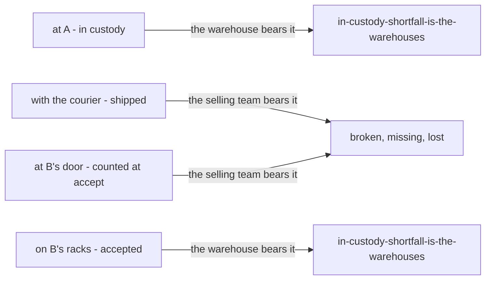

**The spec.**

| what happened | recorded as | bears it |
| --- | --- | --- |
| broken in the box | a `broken` problem row | the selling team |
| sent, not in the box | a `missing` problem row | the selling team |
| the box never came | status `lost` | the selling team |
| A packed short | nothing at B beyond the `missing` row. The units are still on A's rack, and A's next count finds them | nobody loses |
| broken on B's rack after accept | an `adjustment` at B | Warehouse B ([in-custody-shortfall-is-the-warehouses](./context_clarify.md#in-custody-shortfall-is-the-warehouses)) |

## the-system-fills-a-transfers-prices

> Owner, in chat *(2026-10-10)*: *"for q5 follow your recomendation"*. It answers
> [warehouse_transfer_clarify Q5](./warehouse_transfer_clarify.md#question) — *who sets `price_unit` and `total`?* — as
> recommended.

**The verdict.** A transfer's money is read from the batches, never typed. The out-leg takes units at their batches' own
prices, and every price on the transfer is a record of what was taken.

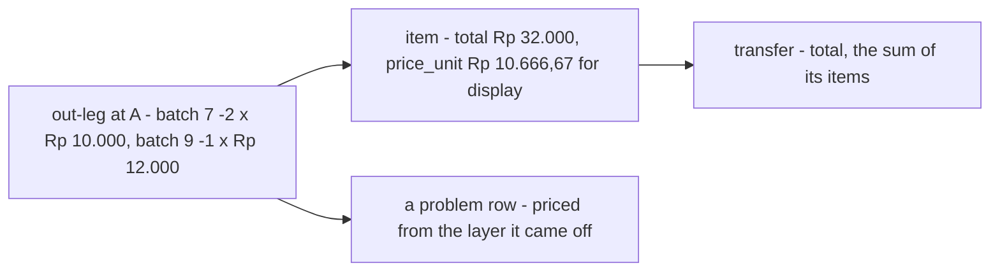

**The spec.**

| | |
| --- | --- |
| `warehouse_transfer_items.total` | the value the out-leg took for that product: the sum of its `batch_logs` rows' `change_valuation` |
| `warehouse_transfer_items.price_unit` | `total` ÷ `count`, for display only |
| `warehouse_transfers.total` | the sum of its items |
| `warehouse_transfer_problem_items.price_unit` | the price of the layer the unit came off, which is the newest one ([Q6](./warehouse_transfer_clarify.md#question)) — the same as [the-problem-price-is-filled-by-the-system](./restock_decision.md#the-problem-price-is-filled-by-the-system) |
| typed by a person | none of them |

**What it does NOT settle** — the layers themselves: one batch per source batch at B is [Q6](./warehouse_transfer_clarify.md#question).

## a-transfer-names-its-courier-and-cost

> Owner, in [warehouse_transfer.md](./warehouse_transfer.md) §Table Should Have in Warehouse Transfers *(2026-10-10)*:
> `warehouse_transfers` gains `shipment_id` and `shipment_cost` — *"for q8 i add shipment_id and shipment_cost"*. It answers
> the courier half of [warehouse_transfer_clarify Q8](./warehouse_transfer_clarify.md#question), as recommended.

**The verdict.** A transfer says which courier carried it and what the trip cost, the same as a restock.

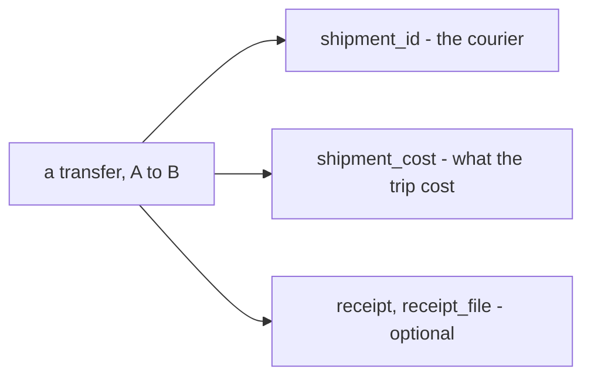

**The spec.**

| | |
| --- | --- |
| `warehouse_transfers.shipment_id` | the courier, from the shipment catalogue |
| `warehouse_transfers.shipment_cost` | what the trip cost |
| optional? | not marked so, unlike `receipt` — asked in [Q8](./warehouse_transfer_clarify.md#question) |

**What it does NOT settle** — [Q8](./warehouse_transfer_clarify.md#question): which account pays the cost, and whether the
financial account hears of it · whether the cost stays out of the unit price · whether a transfer with no courier leaves
`shipment_id` empty.

## a-transfer-problem-row-carries-a-note

> Owner, in [warehouse_transfer.md](./warehouse_transfer.md) §Table Should Have in Warehouse Transfers *(2026-10-10)*:
> `warehouse_transfer_problem_items` gains `note` — *"for 9e i recently added"*. It answers
> [warehouse_transfer_clarify Q9e](./warehouse_transfer_clarify.md#question), as recommended.

**The verdict.** Warehouse B can say what it saw beside each problem row (*"carton crushed on one corner"*), the same as at a
restock ([three-notes-one-writer-each](./restock_decision.md#three-notes-one-writer-each)).

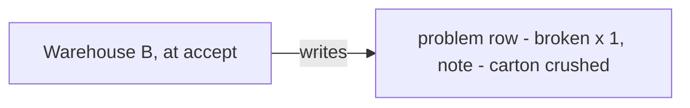

**The spec.**

| | |
| --- | --- |
| `warehouse_transfer_problem_items.note` | free text, written by Warehouse B when it records the row |

## a-transfer-takes-from-the-sender-at-create

> Owner, in chat *(2026-10-10)*: *"for q2 … yes follow your recomendation"*. It answers
> [warehouse_transfer_clarify Q2](./warehouse_transfer_clarify.md#question) — *when is the out-leg written?* — as recommended.

**The verdict.** The stock leaves Warehouse A's book the moment the transfer is created, the same as an order does. From then
on the team cannot sell those units at A, even though they wait on A's racks until the picker takes them.

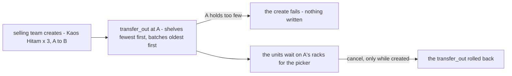

**The spec.**

| | |
| --- | --- |
| when | at create, inside the create's database transaction; `outbound_transaction_id` is set then |
| shelves | the fewest first ([an-order-takes-from-the-lowest-shelf-first](./context_decision.md#an-order-takes-from-the-lowest-shelf-first)) — the system chooses, and A's pick list names the racks |
| batches | the oldest first |
| too few at A | the create fails and writes nothing ([a-shelf-never-goes-below-zero](./placement_decision.md#a-shelf-never-goes-below-zero)) |
| a cancel | rolls the `transfer_out` back ([an-undo-rolls-the-transaction-back-once](./transaction_decision.md#an-undo-rolls-the-transaction-back-once)), only while `created` ([cancel-before-processed-lost-only-in-transit](#cancel-before-processed-lost-only-in-transit)) |
| A's rack screen | shows the units as waiting for the picker until they leave — the same as a sold unit ([placement Q4](./placement_clarify.md#question)) |

## the-transfer-is-where-goods-in-transit-are

> Owner, in chat *(2026-10-10)*: *"for … q3 … yes follow your recomendation"*. It answers
> [warehouse_transfer_clarify Q3](./warehouse_transfer_clarify.md#question) — *where are the units between the two legs?* —
> as recommended. It closes [technical stock Q1](../../technical/stock/design_clarify.md#question), and withdraws my
> in-transit placement from that doc.

**The verdict.** Between the two legs, the units are in **neither** warehouse's book. They are in the transfer, which is a
record a person can point at. There is no in-transit rack, because a placement belongs to one warehouse and a truck is in
neither.

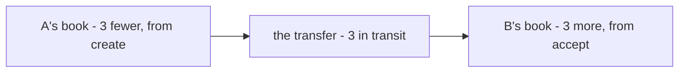

**The spec.**

| | |
| --- | --- |
| in transit | the items of every transfer that has an outbound transaction and no inbound one |
| shown | on the team's stock screen, per product — *"3 in transit"* |
| its value | the sum of those transfers' `total` |
| a placement for it | none |

## a-transfer-has-seven-statuses

> Owner, in chat *(2026-10-10)*: *"for … q4 … yes follow your recomendation"*. It answers
> [warehouse_transfer_clarify Q4a and Q4b](./warehouse_transfer_clarify.md#question) — *what is `problem` for, and what
> happens when a lost box turns up?* — as recommended. It closes the status half of
> [the-flow-and-the-status-list-disagree](./warehouse_transfer_clarify.md#the-flow-and-the-status-list-disagree).

**The verdict.** A transfer ends in one of three places: `accepted`, `cancel` or `lost`. Whatever B's count finds, an accept
ends at `accepted`, and whether it had problems is read from its problem rows, the same as a restock. `problem` is dropped.
A lost box that turns up is signed for and accepted as usual
([a-late-lost-box-is-signed-for-as-arrived](./restock_decision.md#a-late-lost-box-is-signed-for-as-arrived)).

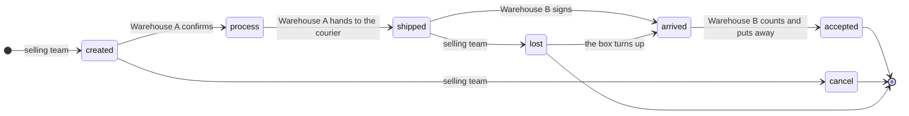

**The spec.**

| status | set by | from |
| --- | --- | --- |
| `created` | the selling team | — |
| `process` | Warehouse A | `created` |
| `shipped` | Warehouse A | `process` |
| `arrived` | Warehouse B | `shipped` · `lost` |
| `accepted` | Warehouse B | `arrived` (and `shipped`, if [Q9d](./warehouse_transfer_clarify.md#question) is confirmed) |
| `cancel` | the selling team | `created` |
| `lost` | the selling team | `shipped` |
| `problem` | dropped — broken and missing units are rows ([broken-and-missing-at-the-door-are-problem-rows](#broken-and-missing-at-the-door-are-problem-rows)) | — |

## the-receiver-mints-one-batch-per-source-batch

> Owner, in chat *(2026-10-10)*: *"for … 6 … yes follow your recomendation"*. It answers
> [warehouse_transfer_clarify Q6](./warehouse_transfer_clarify.md#question) — *what does B mint?* — as recommended.

**The verdict.** A move does not change what a unit cost, when it expires, or who sold it. So Warehouse B mints one batch for
each batch the out-leg took from, carrying those facts across unchanged. The FIFO layers survive the trip.

Kaos Hitam × 3: at A, batch 7 has 2 at Rp 10.000 (expiring in March) and batch 9 has 5 at Rp 12.000 (expiring in May).

| | out-leg at A, oldest first | minted at B |
| --- | --- | --- |
| from batch 7 | −2 × Rp 10.000 | **batch 31**: 2 × Rp 10.000, March |
| from batch 9 | −1 × Rp 12.000 | **batch 32**: 1 × Rp 12.000, May |
| value | Rp 32.000 | Rp 32.000 |

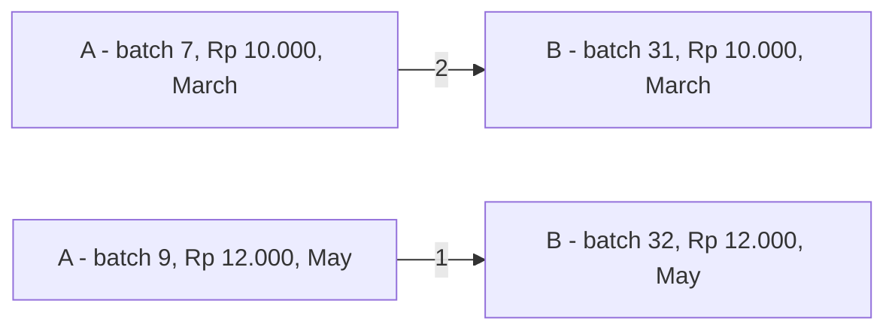

**The spec.**

| | |
| --- | --- |
| minted | one batch at B per source batch with good units, in the `transfer_in`; `batches.transaction_id` is the inbound transaction |
| copied from the source | `price_unit`, `expired_at`, `supplier_channel_id` (and `supplier_id`, if [context Q14h](./context_clarify.md#question) adds it) |
| the source batches | read from the outbound transaction's `batch_logs` — no new column |
| broken or missing | come off the newest layer first; the good units fill the oldest. If batch 9's unit arrives broken, batch 32 is never minted |

**What it does NOT settle** — [batch.md](./batch.md) still says a batch is minted only by a restock, a return and an
adjustment ([batch-md-mints-nothing-on-transfer-in](./warehouse_transfer_clarify.md#batch-md-mints-nothing-on-transfer-in)).

## the-selling-team-pays-for-the-trip

> Owner, in chat *(2026-10-10)*: *"for 8a is selling team"* and *"for … 8b … yes follow your recomendation"*. It answers
> [warehouse_transfer_clarify Q8a](./warehouse_transfer_clarify.md#question)'s payer and Q8b — *who pays `shipment_cost`, and
> does it enter the unit price?* — as recommended.

**The verdict.** The team that decided to move its goods pays for the move. The cost is the team's, and never part of a
unit's price: a transferred batch keeps its source price.

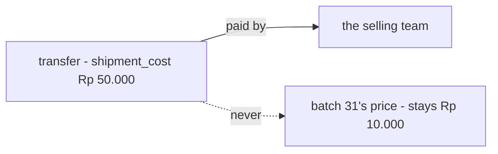

**The spec.**

| | |
| --- | --- |
| who pays `shipment_cost` | the selling team |
| the unit price at B | unchanged by the trip — equal to the source batch's ([the-receiver-mints-one-batch-per-source-batch](#the-receiver-mints-one-batch-per-source-batch)) |

**What it does NOT settle** — [Q8](./warehouse_transfer_clarify.md#question): which of the team's accounts pays, and whether
`financial_account_service` hears of it. My recommendation also named those, and the answer named the payer only.

## a-transfer-may-travel-without-a-courier

> Owner, in chat *(2026-10-10)*: *"for … 8c yes follow your recomendation"*. It answers
> [warehouse_transfer_clarify Q8c](./warehouse_transfer_clarify.md#question) — *a transfer with no courier?* — as recommended.

**The verdict.** A transfer may go in a warehouse's own vehicle, or by hand. Then there is no courier, no tracking number and
no cost, and that is still a valid transfer.

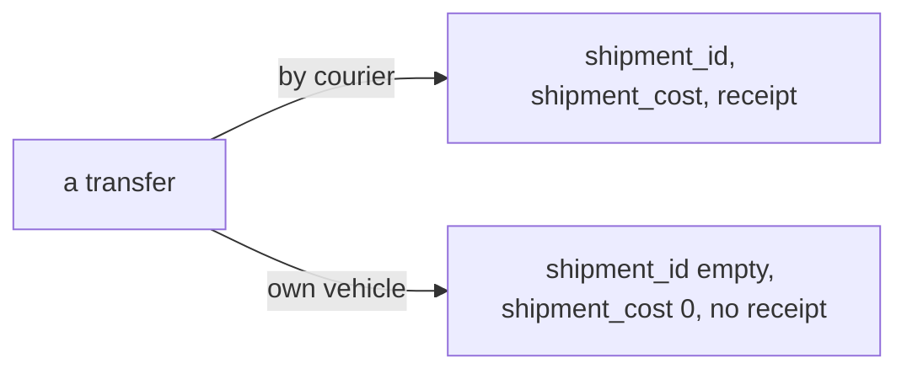

**The spec.**

| | |
| --- | --- |
| `shipment_id` | may be empty |
| `shipment_cost` | may be 0 |
| `receipt`, `receipt_file` | optional ([a-transfer-may-carry-a-tracking-number](#a-transfer-may-carry-a-tracking-number)) |

## every-transfer-status-change-is-logged

> Owner, in chat *(2026-10-10)*: *"for 9a, yes we must have warehouse_transfer_logs"*. It answers
> [warehouse_transfer_clarify Q9a](./warehouse_transfer_clarify.md#question), as recommended.

**The verdict.** People from three teams move one transfer, so every move of its status leaves a row saying who did it and
why. *"A shipped late"* and *"who declared it lost?"* can then be answered from the record, not from memory. The selling
team bears what is lost, so it needs that record most.

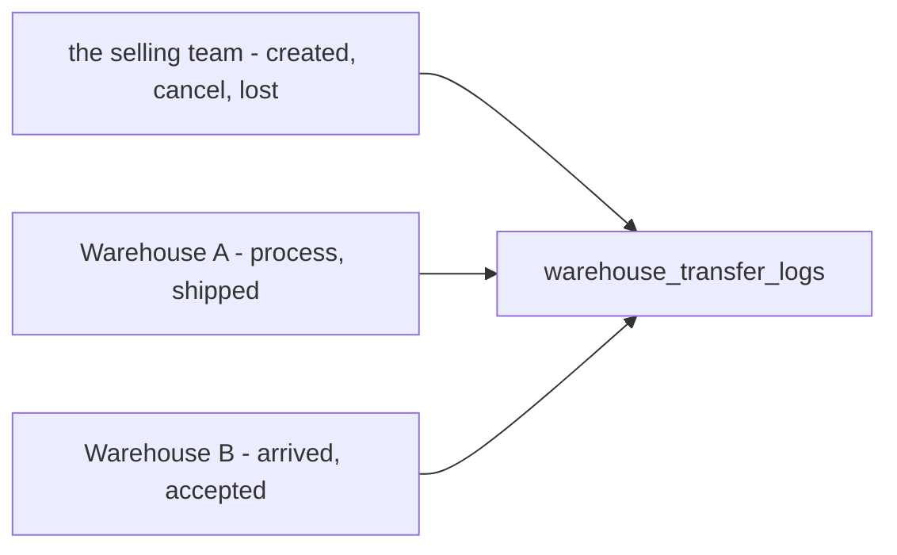

**The spec.**

| | |
| --- | --- |
| `warehouse_transfer_logs` | `id` · `transfer_id` · `from_status` · `to_status` · `actor_id` · `description` · `created_at` |
| written | one row per status change, in the same database transaction as the change |
| the first row | `from_status` empty, `to_status` `created` |
| changed | never — a log row is not updated or deleted |

The same as a restock: [every-status-change-is-logged](./restock_decision.md#every-status-change-is-logged).

## a-transfers-lines-are-never-edited

> Owner, in chat *(2026-10-10)*: *"for 9e, 9c yes follow your recomendation"*. It answers
> [warehouse_transfer_clarify Q9e](./warehouse_transfer_clarify.md#question), as recommended.

**The verdict.** A transfer takes its stock at create
([a-transfer-takes-from-the-sender-at-create](#a-transfer-takes-from-the-sender-at-create)), so changing a line would mean
undoing the take and taking again. A cancel followed by a new transfer does exactly that, with no new code path. This is
the one place a transfer differs from a restock, whose lines stay editable because it takes nothing until accept
([the-lines-stay-editable-until-accepted](./restock_decision.md#the-lines-stay-editable-until-accepted)).

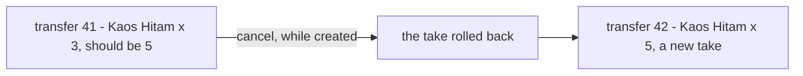

**The spec.**

| | |
| --- | --- |
| the lines | never edited — no count, product or line is changed once created |
| a wrong transfer | cancelled while `created` ([cancel-before-processed-lost-only-in-transit](#cancel-before-processed-lost-only-in-transit)), then made again |
| `note` | editable |

## a-transfer-never-goes-to-its-own-warehouse

> Owner, in chat *(2026-10-10)*: *"for 9e, 9c yes follow your recomendation"*. It answers
> [warehouse_transfer_clarify Q9c](./warehouse_transfer_clarify.md#question), as recommended.

**The verdict.** A transfer from A to A would take units out and mint them back in one building, issue new batch ids, maybe
pay a courier for nothing, and show the units as *in transit* while they never left the rack. Moving goods inside one
warehouse is a rack move ([placement Q3](./placement_clarify.md#question)), never a transfer.

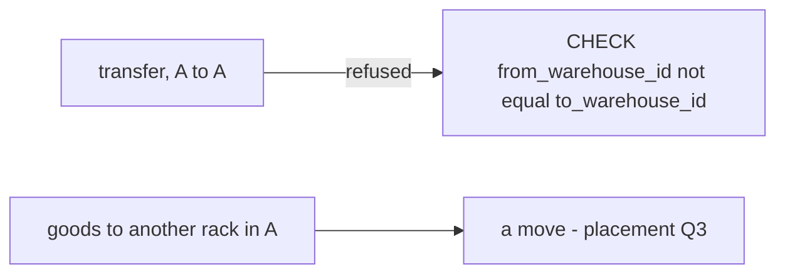

**The spec.**

| | |
| --- | --- |
| the database | `CHECK (from_warehouse_id <> to_warehouse_id)` on `warehouse_transfers` |
| the form | refuses the same warehouse on both sides before it submits |

## a-transfer-is-locked-before-any-status-change

> Owner, in chat *(2026-10-10)*: *"9d we must lock to prevent race condition"*. It answers
> [warehouse_transfer_clarify Q9d](./warehouse_transfer_clarify.md#question), as recommended. Accepting from `shipped` is the
> step your flow already draws (*Wait Shipped → accepted*), so it is recorded here with the lock. It completes the `accepted`
> row of [a-transfer-has-seven-statuses](#a-transfer-has-seven-statuses).

**The verdict.** Two people at one transfer is the normal case here: two staff at B's door, or the team and B at the same
moment. Every status change therefore locks the transfer row first, then reads its status, then writes. Whoever comes
second sees what the first did. Without the lock, two accepts of one box of 3 mint 6 units, and a `lost` and an `accept`
can both succeed on one transfer.

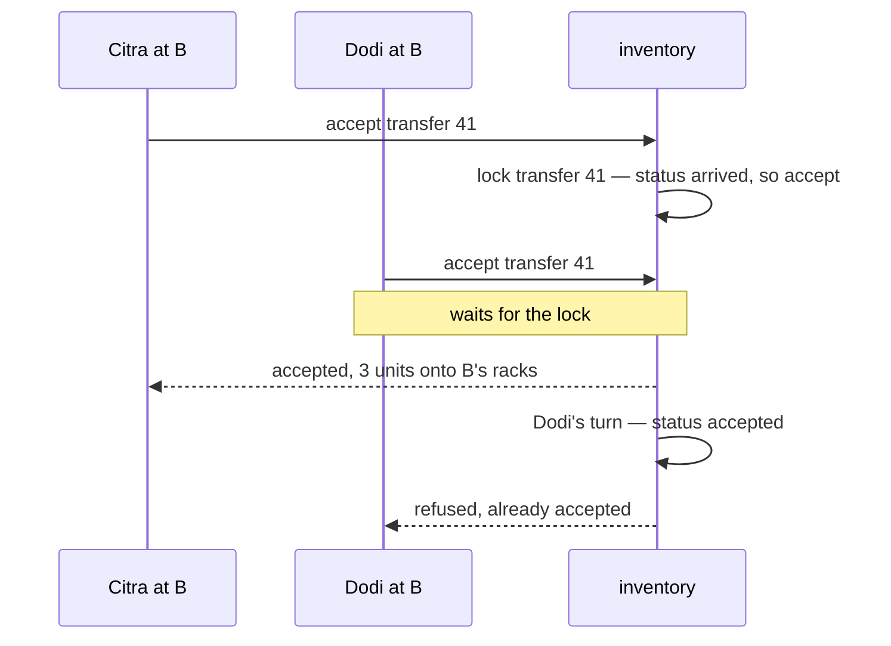

**The spec.**

| | |
| --- | --- |
| every status change | `SELECT … FOR UPDATE` on the transfer row, then the status check, then the writes, in one database transaction |
| accept | from `arrived`, or from `shipped` (signed and counted as one act); runs once — a second accept is refused |
| accept from `lost` | refused — the box is signed for first, `lost → arrived` ([a-transfer-has-seven-statuses](#a-transfer-has-seven-statuses)) |
| the lock order | the transfer row first, then batches, then shelves, each in id order ([batches-lock-before-shelves-by-id](./context_decision.md#batches-lock-before-shelves-by-id)) |
| proven by | a concurrency audit of each write RPC once it exists (the `audit-sql` skill, `backend/pkgs/san_race`) |

The same guard as [accept-locks-the-restock](./restock_decision.md#accept-locks-the-restock).

## a-product-appears-once-per-transfer

> Owner, in chat *(2026-10-10)*: *"okay, i follow your recomendation"*, after asking *"if one line, how about different
> price batch?"*. It answers [warehouse_transfer_clarify Q9b](./warehouse_transfer_clarify.md#question), as recommended,
> including the problem-row half raised while working it through.

**The verdict.** A transfer lists each product **once**, and B records each kind of problem for a product **once**. Every
decided rule that finds a line does it by product: the price, the problem row, and the batches made at B. With two lines for
one product, each of those rules would have two answers. Batches at different prices do not need a line each, because the
line records **what** moved and the ledger records **which batch, at what price**.

Kaos Hitam × 5. At A, batch 7 holds 2 at Rp 10.000 and batch 9 holds 5 at Rp 12.000. B counts 4 good and 1 broken:

| layer | grain | holds |
| --- | --- | --- |
| the line | per product | count 5 · total Rp 56.000 · `price_unit` Rp 11.200, for display only |
| the ledger at A | per batch | batch 7: −2 × Rp 10.000 · batch 9: −3 × Rp 12.000 |
| the problem row | per product per kind | broken × 1 · Rp 12.000, off the newest batch |
| the batches made at B | per source batch | batch 31: 2 × Rp 10.000 · batch 32: 2 × Rp 12.000 |

```mermaid
flowchart LR
  L["line - Kaos Hitam x 5, Rp 56.000"] --> G["the ledger at A - batch 7 -2, batch 9 -3"]
  G --> B31["B - batch 31, 2 x Rp 10.000"]
  G --> B32["B - batch 32, 2 x Rp 12.000"]
  G --> P["problem row - broken x 1, Rp 12.000"]
```

**The spec.**

| | |
| --- | --- |
| `warehouse_transfer_items` | `UNIQUE (transfer_id, product_id)` |
| `warehouse_transfer_problem_items` | `UNIQUE (transfer_id, product_id, problem_type)` — *broken × 2*, never two rows of 1 |
| per product | `broken + missing ≤ count`; the good units are `count − broken − missing` |
| the form | adding a product already listed raises its count; merging happens only before submit, since lines are never edited after ([a-transfers-lines-are-never-edited](#a-transfers-lines-are-never-edited)) |
| B's accept screen | one row per product — *sent 5 · arrived · broken* |
| batch prices | in the outbound transaction's `batch_logs`, never on the line; a line's or a problem row's `total` is exact, and its `price_unit` is a display average |

The same as a restock: [a-product-appears-once-per-restock](./restock_decision.md#a-product-appears-once-per-restock).

## a-transfer-has-the-restocks-two-costs

> Owner, in [warehouse_transfer.md](./warehouse_transfer.md) §Table Should Have in Warehouse Transfers *(2026-10-10)*:
> `warehouse_transfers` gains `warehouse_additional_cost`, and in chat: *"shipment_cost is as selling team expense. and
> warehouse_additional_cost is liability team like restock"*. It answers the core of
> [warehouse_transfer_clarify Q8](./warehouse_transfer_clarify.md#question) — *how does the trip's money reach the
> courier?* — **in part against my *b***, which had Warehouse A pay the whole trip at the counter. The on-site half keeps
> *b*'s debt.

**The verdict.** A transfer has the same two costs as a restock, and each is paid the way the restock's is. The agreed
shipping is the selling team's own **expense**. A charge the courier asks on site is paid by the **warehouse** standing
there, and the selling team then **owes** that warehouse: a liability, not the warehouse's cost.

```mermaid
flowchart LR
  S["shipment_cost"] -->|"the selling team's expense"| T["the selling team"]
  W["warehouse_additional_cost"] -->|"paid on site"| H["the warehouse at the counter"]
  T -->|"owes - a liability"| H
```

**The spec.**

| | |
| --- | --- |
| `warehouse_transfers.shipment_cost` | the selling team's expense |
| `warehouse_transfers.warehouse_additional_cost` | paid by the warehouse on site; the selling team owes it back — as [the-warehouse-cost-is-the-couriers-charge-at-the-door](./restock_decision.md#the-warehouse-cost-is-the-couriers-charge-at-the-door) |
| `warehouse_transfers.total` | unchanged — the value of the goods moved ([the-system-fills-a-transfers-prices](#the-system-fills-a-transfers-prices)); both costs sit outside it |

**What it does NOT settle** — [Q8](./warehouse_transfer_clarify.md#question): which account the expense comes from, when it
is typed, and how the financial account hears of it (8d) · which warehouse enters the on-site charge, at which door (8e) ·
whether the on-site charge enters B's unit price, as a restock's does (8f).

## a-transfer-names-its-paying-account

> Owner, in [warehouse_transfer.md](./warehouse_transfer.md) §Table Should Have in Warehouse Transfers *(2026-10-10)*:
> `warehouse_transfers` gains `finance_account_id`. It answers the account half of
> [warehouse_transfer_clarify Q8d](./warehouse_transfer_clarify.md#question) — *the expense comes from which account?* —
> as recommended.

**The verdict.** A transfer says which of the selling team's accounts pays its `shipment_cost`, the same as a restock says
which account paid for it ([a-restock-names-its-paying-account](./restock_decision.md#a-restock-names-its-paying-account)).
The expense then has an account to come out of, instead of a number with no source.

```mermaid
flowchart LR
  T["transfer - shipment_cost Rp 18.000"] -->|"finance_account_id"| A["the team's account - BCA 123"]
```

**The spec.**

| | |
| --- | --- |
| `warehouse_transfers.finance_account_id` | the selling team's account that pays `shipment_cost` |
| whose account | one of the selling team's own — never a warehouse's |

**What it does NOT settle** — [Q8d](./warehouse_transfer_clarify.md#question): whether it is required when `shipment_cost`
is 0 · when the cost is typed · the event that tells `financial_account_service`, which no flow draws yet.

## the-shipping-expense-reaches-the-account-by-event

> Owner, in chat *(2026-10-10)*: *"for q8 yes follow your recomendation"*. It answers
> [warehouse_transfer_clarify Q8d](./warehouse_transfer_clarify.md#question) — *the expense: typed when, and how does the
> financial account hear?* — as recommended.

**The verdict.** The shipping expense leaves the team's account the way a restock's does: inventory publishes it after its
own write commits, and `financial_account_service` posts it
([a-created-restock-tells-the-financial-account](./restock_decision.md#a-created-restock-tells-the-financial-account)).
A courier prices by the packed weight, so the team may type the cost after A has packed, at any time before B accepts.
Every change sends only the difference.

```mermaid
sequenceDiagram
  participant S as selling team
  participant I as inventory
  participant F as financial_account_service
  S->>I: create transfer — no cost yet
  S->>I: shipment_cost Rp 18.000, from BCA 123
  I-->>F: event — BCA 123, minus Rp 18.000
  S->>I: corrected to Rp 20.000
  I-->>F: event — BCA 123, minus Rp 2.000
```

**The spec.**

| | |
| --- | --- |
| `shipment_cost`, `finance_account_id` | typed by the selling team at create or later, until `accepted` |
| `finance_account_id` | required when `shipment_cost` is above 0; empty when it is 0 ([a-transfer-may-travel-without-a-courier](#a-transfer-may-travel-without-a-courier)) |
| the event | after commit, carrying the account and the amount — the whole cost the first time, then only the difference ([an-edit-sends-the-difference](./restock_decision.md#an-edit-sends-the-difference)); no outbox ([no-outbox-the-publish-is-trusted](../../technical/event_architecture/context_decision.md#no-outbox-the-publish-is-trusted)) |
| moving to another account | the whole amount back to the old account, and out of the new one — as [an-edit-may-move-the-payment-to-another-account](./restock_decision.md#an-edit-may-move-the-payment-to-another-account) |
| a cancel | only while `created`; its event returns whatever was posted |
| who hears it | `financial_account_service`, by push |

⚠ It narrows [a-transfers-lines-are-never-edited](#a-transfers-lines-are-never-edited), whose *"only `note` changes"* was
written about the lines. The cost and its account are not lines, and stay editable until `accepted`.

## the-on-site-charge-is-paid-by-b-at-accept

> Owner, in chat *(2026-10-10)*: *"for q8 yes follow your recomendation"*. It answers
> [warehouse_transfer_clarify Q8e](./warehouse_transfer_clarify.md#question) — *the on-site charge: which warehouse, at
> which door?* — as recommended.

**The verdict.** The courier's charge on site is asked at delivery, so the warehouse at that door, B, pays it and enters it
when it accepts. What the selling team then owes B is written **inside the accept**, beside the batches it mints, the same
as a restock ([the-couriers-debt-is-written-in-the-accept](./restock_decision.md#the-couriers-debt-is-written-in-the-accept)).
An event can be lost, rarely; a debt written in the accept cannot.

```mermaid
flowchart LR
  K["the courier asks Rp 5.000 at B's door"] --> B["Warehouse B pays it on site"]
  B --> A["accept - one transaction"]
  A --> M["the batches minted at B"]
  A --> D["the debt - the selling team owes B Rp 5.000"]
```

**The spec.**

| | |
| --- | --- |
| `warehouse_additional_cost` | entered by Warehouse B, at accept |
| paid by | Warehouse B, on site |
| owed by | the selling team, to B — written inside the accept's database transaction |
| A at handover | not covered — one field is one door. A second field is added if A is ever asked to pay too |

**What it does NOT settle** — which service's table holds the debt. It is the same open point as the restock's
([the-couriers-debt-is-written-in-the-accept](./restock_decision.md#the-couriers-debt-is-written-in-the-accept)), and it is
answered once for both.

## a-transfer-never-changes-a-units-price

> Owner, in chat *(2026-10-10)*: *"for q8 yes follow your recomendation"*. It answers
> [warehouse_transfer_clarify Q8f](./warehouse_transfer_clarify.md#question) — *does the on-site charge enter B's unit
> price?* — as recommended, and **unlike a restock**, whose courier charge is in the landed price
> ([the-couriers-ask-is-in-the-unit-price](../product/context_decision.md#the-couriers-ask-is-in-the-unit-price)).

**The verdict.** A restock **buys** goods, so what it cost to get them in the door is part of what they cost. A transfer only
**moves** goods the team already owns. Neither of its costs enters a unit's price: B's batches keep their source price to
the rupiah, and both costs are the team's own, outside the goods.

```mermaid
flowchart LR
  B7["A - batch 7, Rp 10.000"] -->|"transfer"| B31["B - batch 31, Rp 10.000"]
  SC["shipment_cost - the team's expense"] -.->|"never"| B31
  WC["warehouse_additional_cost - owed to B"] -.->|"never"| B31
```

**The spec.**

| | |
| --- | --- |
| B's batch price | equal to its source batch's ([the-receiver-mints-one-batch-per-source-batch](#the-receiver-mints-one-batch-per-source-batch)) |
| `shipment_cost` | the team's expense ([the-selling-team-pays-for-the-trip](#the-selling-team-pays-for-the-trip)) |
| `warehouse_additional_cost` | the team's debt to B ([the-on-site-charge-is-paid-by-b-at-accept](#the-on-site-charge-is-paid-by-b-at-accept)) |
| unlike a restock | where the courier's charge is in the landed price — a restock buys, a transfer moves |

## the-sender-enters-the-courier-at-ship

> Owner, in chat *(2026-10-10)*, choosing *"Warehouse A, at Ship"* when the screens asked who enters the courier and the
> tracking number. No earlier decision covered it: [the-shipping-expense-reaches-the-account-by-event](#the-shipping-expense-reaches-the-account-by-event)
> gives the **cost** to the team, but the box is in Warehouse A's hands when it leaves. As recommended.

**The verdict.** Whoever holds the labelled box records what is on the label. Warehouse A ships, so A's *Ship* action asks
for the courier, the tracking number and a photo of the label. The selling team still enters the cost and the account that
pays it.

```mermaid
flowchart LR
  A["Warehouse A - Ship"] --> C["shipment_id, receipt, receipt_file"]
  S["selling team - Edit Cost"] --> M["shipment_cost, finance_account_id"]
```

**The spec.**

| | |
| --- | --- |
| `shipment_id`, `receipt`, `receipt_file` | entered by Warehouse A in the Ship action, moving `process → shipped`; all optional ([a-transfer-may-travel-without-a-courier](#a-transfer-may-travel-without-a-courier)) |
| `shipment_cost`, `finance_account_id` | entered by the selling team, until `accepted` ([the-shipping-expense-reaches-the-account-by-event](#the-shipping-expense-reaches-the-account-by-event)) |
| the team's create form | asks for neither the courier nor the tracking number |
