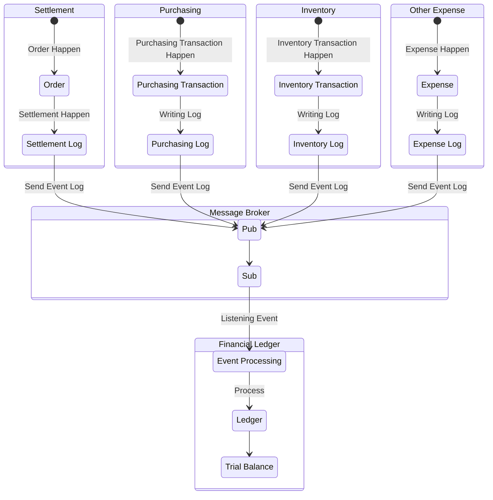

# Ledger and Financial Statistic Contexts.

## The Flow.
1. ledger is downstream projection.

```mermaid
stateDiagram-v2

set: Settlement
state set {
    state "Order" as order
    state "Settlement Log" as revlog

    [*]-->order: Order Happen
    order-->revlog: Settlement Happen
    revlog-->pub: Send Event Log
}

purchasing: Purchasing
state purchasing {
    state "Purchasing Transaction" as pur
    state "Purchasing Log" as purlog
    [*]-->pur: Purchasing Transaction Happen
    pur-->purlog: Writing Log
    purlog-->pub: Send Event Log
}

inv: Inventory
state inv{
    state "Inventory Transaction" as it
    state "Inventory Log" as itlog
    [*]-->it: Inventory Transaction Happen
    it-->itlog: Writing Log
    itlog-->pub: Send Event Log
}

ocost: Other Expense
state ocost{
    state "Expense" as cost
    state "Expense Log" as clog

    [*]-->cost: Expense Happen
    cost-->clog: Writing Log
    clog-->pub: Send Event Log
}

pubsub: Message Broker
state pubsub {
    state "Pub" as pub
    state "Sub" as sub

    pub-->sub
    sub-->eventproc: Listening Event
}

fin: Financial Ledger
state fin {
    state "Event Processing" as eventproc
    state "Ledger" as ledger
    state "Trial Balance" as balance

    eventproc-->ledger: Process
    ledger-->balance
}

```