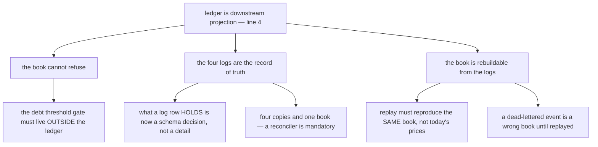
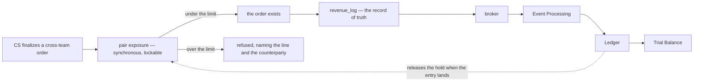
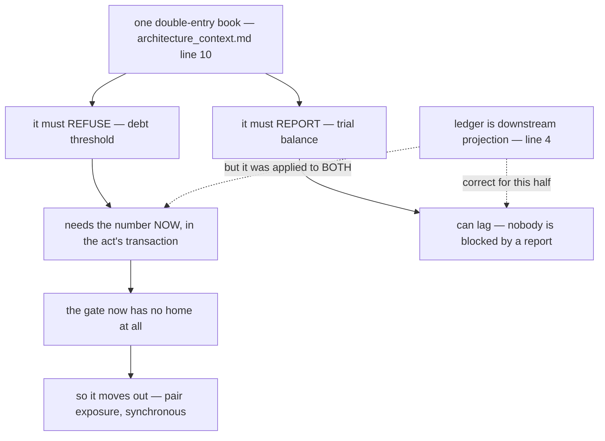
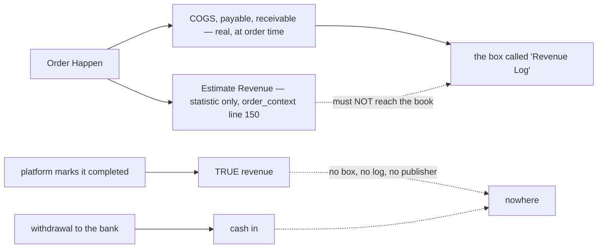

# Clarity — `ledger_context.md`

What I read out of [ledger_context.md](./context.md), and what is still open.
**That doc is yours — this one is mine.** Answered points are **deleted**, so this file is always the
current open set.

> **Re-examined after line 4 landed.** ✅ **Closed and deleted:** the whole *authority vs projection* fork,
> both option tables, my `book-blocks-broker-reports` proposal, its transaction block and both of its
> sequence diagrams — you have ruled, and the arrow I asked you to reverse stays as you drew it. Two
> questions go with it (*in-band or broker*, *four logs or one outbox*). **What survives got bigger, not
> smaller:** replay, at-least-once and reconciliation stop being arguments *against* an option and become
> **required spec** for the one you chose.

Siblings: [balance_context](../balance/context_clarify.md) · [order_context](../order/context_clarify.md) ·
[architectures/architecture_context](../../technical/architecture/context_clarify.md) ·
[business_level](../business_level_clarify.md) · [stock_context](../stock/context_clarify.md) ·
[product_context](../product/context_clarify.md).

---

## Proposed Design

### The rules, named

#### ledger-is-downstream-projection
*"ledger is downstream projection."* *(line 4 — the doc's only prose sentence, and the one that mattered)*
The four `*_log` tables are the **records of truth**. `Financial Ledger` *(lines 55-62)* is **derived**, and
therefore **cannot refuse anything**. ✅ **Yours. Recorded, not re-argued.** Everything below is what it
forces.

#### four-sources-feed-the-book
Money enters from exactly four places — **Sales/Order**, **Purchasing**, **Inventory** and **Other
Expense** *(lines 8, 18, 27, 36)*. ✅ Strong, and I would not change it. ⚠ Two consequences the list does
not yet carry: **Purchasing has no owning service** ([Critique 5](#critique)) and **Payment has no source
box at all** ([Critique 1](#critique)).

#### every-source-writes-a-log-first
Each source writes its own `*_log` inside its own boundary, then publishes *(lines 14-15, and the same
shape at 23-24, 32-33, 42-43)*. Under [ledger-is-downstream-projection](#ledger-is-downstream-projection)
these are **first-class permanent tables**, not outboxes — four schemas, four retention policies, four
owners.

#### the-broker-is-the-only-path-in
Nothing reaches `Financial Ledger` except `Pub → Sub → Event Processing` *(lines 51-52)*. ✅ Consistent with
line 4. ⚠ It also means **a dead-lettered event is a permanently wrong book**, not a dropped notification.

#### trial-balance-is-derived-from-the-ledger
`ledger-->balance` *(line 62)*. The report is downstream of the entries.

### What the decision forces

#### gate-reads-exposure-not-the-book
A projection cannot say no, so the Debt Threshold reads a **different object**: a synchronous, row-locked
**pair exposure**, incremented in the act's own transaction.

| object | freshness | who reads it |
| --- | --- | --- |
| **pair exposure** — one integer per ordered team pair | synchronous, lockable | the **gate** |
| **ledger / trial balance** *(lines 58-62)* | eventual, projected | the **report** |

`exposure = posted (from the projection) + pending holds (synchronous)`. A finalize takes a **hold** on the
pair — the projected entry releases it when it lands.

**Why this costs almost nothing:** a credit gate never needed the *book*. It needs the *exposure*, which is
one small integer. Nothing moves back in-band except a counter.
**Honest cost:** counter and book are two numbers that can drift, so a hold needs an owner and an expiry
(an order cancelled after the hold, an event that never lands) — and the counter needs the same reconciler
as [Critique 2](#critique).

⚠ **Routing:** this is a `balance_context.md` decision — already open as
[balance_context Q2](../balance/context_clarify.md#question). `ledger_context.md` can only say the ledger does
not do it.

#### log-carries-the-frozen-money
A log row carries the business fact **plus every amount only that domain could have computed** — unit
price, the layer id and qty drawn, the markup % applied, the fee typed at accept.

**Why:** a picker takes 3 units off a shelf. *Which layer those 3 came from* is decided by that shelf's
history at that instant, and by tomorrow the history is gone — someone restocked, someone drew the layer to
zero. The number is knowable only at the moment a person touched the goods, so the service that witnessed
it must freeze it. A fact-only log replayed next year re-prices with next year's data and produces a
**different book**.

#### event-processing-owns-the-mapping
The **debit/credit account mapping** stays in `Event Processing` *(line 57)* and nowhere else. This is the
other half of [log-carries-the-frozen-money](#log-carries-the-frozen-money) and it is not the same half:
the domain freezes the **amount**, the consumer decides the **accounts**. Keeping the mapping in one place
is what makes
[one-book-for-all-money](../../technical/architecture/context_clarify.md#one-book-for-all-money) a rule
rather than a coincidence — otherwise the accounting policy is written four times and the fifth source
gets it slightly wrong.

#### blocking-is-synchronous-reading-may-lag
| | |
| --- | --- |
| anything that **blocks a person** | synchronous — the exposure counter, and an accepted payment credits it **at acceptance** |
| anything a person **reads** | may lag, and **must display how far behind** — "as of 14:32", or "N events pending" |

**Why:** paying is two humans watching — one transferring, one confirming. If the confirm does not unblock
immediately, the debtor team stops selling for a queue lag they cannot see, and their first move is to
phone for an override. That makes the override the normal path. **A gate people routinely override is worse
than no gate**, because it also produces a false audit trail.

---

## Critique

| | Problem | → Recommend |
| --- | --- | --- |
| **1** | **The one cause that REDUCES a debt has no way into the book.** [balance_context.md](../balance/context.md) cause 6 — *"Create / Accepting Payment other teams"* — maps to **none** of the four sources *(lines 8, 18, 27, 36)*, while `architecture_context.md:10` lists *"payments"* inside the ledger. A projection has no inbound path except the broker, and nothing publishes a payment. **As drawn, a balance can only grow.** | **`payment-is-the-fifth-source`** — a fifth box with its own `payment_log`, and a **two-phase** state, because *"Create / Accepting"* is a handshake, not a write. It also needs an owning service, which the six in `architecture_context.md` do not contain. |
| **2** | **Four logs and one book that can disagree, and no reconciler is named.** Under [ledger-is-downstream-projection](#ledger-is-downstream-projection) this is no longer avoidable — it is the cost of the option you chose, and it has to be budgeted rather than discovered. Nothing says who compares them, at what cadence, at what tolerance, or what happens when they differ. | **A daily job comparing `SUM(*_log)` against the projected book, per team pair, with a named human owner** — and a non-zero result treated as an **incident**, not a log line. Tolerance zero: [balance_context Critique 8](../balance/context_clarify.md#critique) already asks for exact whole rupiah. |
| **3** | **At-least-once delivery is unhandled, and here it corrupts the BOOK.** A redelivery re-runs `Event Processing` *(line 57)* and **double-posts**. Reordering makes the balance transiently wrong. Neither dedupe nor an idempotency key appears anywhere. | **An idempotency key carried by the log row and enforced by the consumer** — the causing act's natural key (`shop_id` + `marketplace_order_id` + leg for an order, `receipt_id` for a restock). Same defence as [order Q1](../order/context_clarify.md#question), one layer down. |
| **4** | **A dead-lettered event is a permanently wrong book.** `CLAUDE.md` requires a DLQ on push subscriptions, and under this flow a poisoned message is not a lost notification — it is a missing entry that no screen will ever show as missing. | **Alarm on the DLQ with a named owner, and a replay path.** And the reconciler in [Critique 2](#critique) is what *detects* it, which is a second reason it is not optional. |
| **5** | **Purchasing is a first-class money source here and has no owning service anywhere.** *(line 18)* — `architecture_context.md:4-10` names six services and none is purchasing, [balance_context](../balance/context_clarify.md)'s six causes do not include paying a supplier, and [order_context](../order/context_clarify.md) credits an asset that no documented transaction ever created. | Either **describe purchasing as a business flow** — who buys, who types the price, is a supplier payable tracked — or **delete the box**. My pick: describe it. It is the largest cash outflow in the business and it currently has no record at all. |
| **6** | **Nothing says whether an entry is ever reversed or corrected — and [log-carries-the-frozen-money](#log-carries-the-frozen-money) makes that mandatory.** Once an amount is frozen in the log, a wrong amount can no longer be fixed by re-projecting. [balance_context](../balance/context_clarify.md) has a *found back* cause, a *payment* cause and a disputable charge — three reversals with no arrow between them. | **Append-only, corrections as compensating entries**, original left visible. That is also what [business_level](../business_level_clarify.md)'s *"transparency accounting"* requires. |
| **7** | **`Event Processing` is one word doing all the work.** *(line 57)* `Process` is the entire specification of fact → journal. Whether a log row arrives as a business event or as pre-computed Dr/Cr lines is unreadable from the diagram, and the two produce different schemas for all four tables. | [log-carries-the-frozen-money](#log-carries-the-frozen-money) + [event-processing-owns-the-mapping](#event-processing-owns-the-mapping): **amounts frozen by the domain, accounts decided by the consumer.** One sentence in the doc closes it. |
| **8** | **No actor appears anywhere in the flow.** Every other requirement doc has a person in it. Who reads the Trial Balance, on what day, to decide what? Without that, there is no way to judge what lag is acceptable — which is the question [blocking-is-synchronous-reading-may-lag](#blocking-is-synchronous-reading-may-lag) needs answered to be sized. | Name the reader and the moment. I would expect **an admin closing a period** and **a team owner disputing a charge** — two very different tolerances, and the second one is the demanding one. |

---

## Question

1. **Where does the Debt Threshold gate live, and does it BLOCK or WARN?**
   [balance_context.md](../balance/context.md) says *"prevent"*, which a projection
   cannot do. ([gate-reads-exposure-not-the-book](#gate-reads-exposure-not-the-book))
   **→ I recommend a synchronous pair-exposure counter outside the ledger, and BLOCK.**
   *(⚠ The decision belongs in [balance_context](../balance/context_clarify.md#question) — asked here only
   because line 4 is what removed its previous home.)*
2. **Does a `*_log` row carry the frozen amounts, or only the fact?** ([Critique 7](#critique))
   **→ I recommend the frozen amounts — the layer, the qty, the unit price, the markup, the fee.**
3. **Which box writes a PAYMENT?** ([Critique 1](#critique))
   **→ I recommend a fifth source with a two-phase `payment_log`.**
4. **What is the idempotency key for a posted entry?** ([Critique 3](#critique))
   **→ I recommend the causing act's natural key.**
5. **Who reconciles the four logs against the book, how often, and who is paged?**
   ([Critique 2](#critique)) **→ I recommend daily, per pair, tolerance zero, a named owner.**
6. **Is an entry ever reversed or corrected, and how?** ([Critique 6](#critique))
   **→ I recommend append-only with compensating entries.**
7. **What lag is acceptable, and does a money screen show how far behind it is?**
   ([blocking-is-synchronous-reading-may-lag](#blocking-is-synchronous-reading-may-lag))
   **→ I recommend every projected money screen carries an "as of".**

---

# Contradiction

## a blocking duty was left inside an object that has just been made eventual

Three sites, one cause. Line 4 did not create the conflict — it **revealed** it, by settling the half that
was ambiguous.

> `ledger_context.md:4` — *"ledger is downstream projection."*
>
> `architectures/architecture_context.md:10` — *"`ledger_service`, one double-entry book: COGS,
> payable/receivable, team balance, **debt threshold**, warehouse fee, expenses, payments"*
>
> `balance_context.md:66` — *"For **prevent** unfair liability, we must have feature Debt Thresholds."*
>
> `balance_context.md:16` — *"the balance is **two mirrored row**."*

**Which lines I think are wrong.** Not
[one-book-for-all-money](../../technical/architecture/context_clarify.md#one-book-for-all-money) — I would
keep that verbatim. It is **the two words *"debt threshold"* sitting inside it**, the verb ***"prevent"***,
and the reading of the **mirrored rows as an authored record**: under line 4 they are a projection output —
derived, lagging, not lockable — so if two teams are meant to reconcile against them, they cannot live only
in the projection.

**→ RECOMMEND** move the gate out ([gate-reads-exposure-not-the-book](#gate-reads-exposure-not-the-book))
and keep the book whole. What stops this recurring is naming the **property**, not the component: **any
control that can refuse a person must be written in the same transaction as the act it refuses.** That
generalises past the ledger to the shared lock and the reserved-stock rule, which are the next two gates in
this system.

## the source named Revenue is fed by a trigger that produces no revenue

> `ledger_context.md:11-14` — `state "Revenue Log" as revlog` · `[*]-->order: Order Happen` ·
> `order-->revlog: Writing Log`
>
> `order_context.md:150` — *"Estimate Revenue is just recorded. **its doesn't affect the ledger**, its used
> for statistic."*
> `order_context.md:168` — `prev-->revenue: Write to True Revenue System Ledger` — true revenue is written
> from **platform completion**
> `order_context.md:17-19` — at order time the movements are *"the debit is COGS"* and a **payable** /
> **receivable**

**I think the box label is the wrong side.** What an order writes at `Order Happen` is **COGS and a
payable** — not revenue. Real revenue enters at a moment (`order_context.md:167-177`: platform completion,
wallet, withdrawal) that has **no box, no log and no publisher** in this diagram. As drawn, either the
estimate reaches the book — contradicting `:150` — or the book never learns about revenue at all.

**→ RECOMMEND** rename the box to what the order actually posts, and add a **settlement / withdrawal
source**. The cheaper fix — one log with an `is_estimate` flag the projection ignores — I would not pick:
an estimate and a settlement arrive from **different parties on different days**, and folding them into one
log is how the two get summed by accident.

---

# Awaiting

- **One prose sentence in 65 lines.** Line 4 was the important one and it closed the biggest question in
  this file. Three or four more — what a log row holds, what the projection may lag by, who reconciles —
  would close most of what is left.
- **No currency, precision or rounding statement.** Carried from
  [balance_context Critique 8](../balance/context_clarify.md#critique), and it lands here hardest: the log rows
  are now where rounding is frozen forever.
- **No retention rule for four permanent record-of-truth tables.** They are now the audit trail, so "how
  long" is a business answer, not an ops one.
